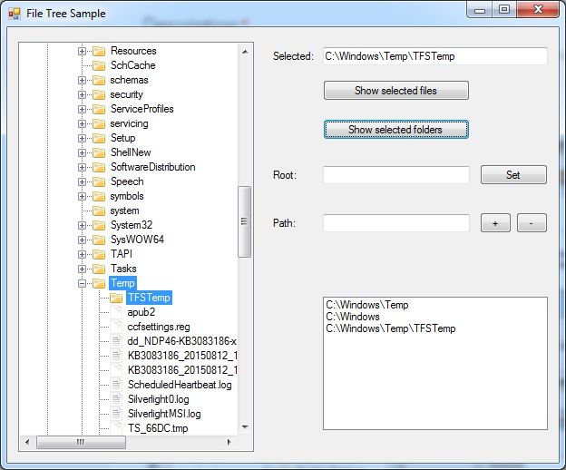
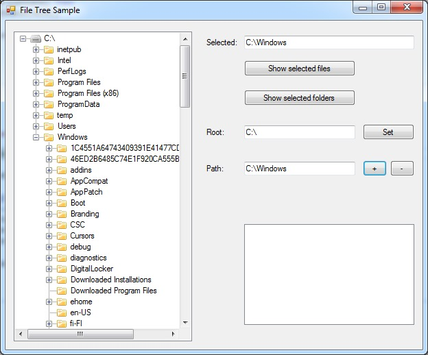

# File System Tree View
## Requires
- Visual Studio 2012
## License
- Apache License, Version 2.0
## Technologies
- Windows Forms
- VB.Net
- System.Windows.Forms.UserControl
- Visual Studio 2012
## Topics
- User Interface
- Windows Forms
- VB.Net
- TreeView
- User Control
## Updated
- 08/12/2015
## Description

<h1>Introduction</h1>

<em>This sample how to build directory and file tree view with UserControl and TreeView controls in Windows Forms. Sample was originally build with VS 2008, but has converted to VS 2012. 
</em>

<h1>Building the Sample</h1>

<em>You need .NET 4.5 and Visual Studio 2012. No other requirements or 3rd party libraries, just extract and build. 
</em>

Description

<em>This sample solves the problem of browsing drives, folders and files by using UserControl with TreeView and creating custom TreeNode classes for each kind of an file system item. Control start from the My Computer node and under that is drives --&gt;
 folders --&gt; images and so on. There is also multiple properties to control what will be shown in the control, for example to control whether or not inactive drives are shown. Other behavior of the control is to track the changes in drive state and enable
 browsing for the content of the drive, if it becomes active. This is also controlled by property and by default it's not enabled. 
</em>

The UI of the control can be seen in the following screen shot. As you can see it shows some icons for directory and files based on file extension.

The custom TreeNode classes are based on single base class FileSystemNode and there is one for each item shown in Control. ComputerNode, DriveNode, DirectoryNode and FileNode.

&nbsp;

Visual Basic

Edit|Remove

vb
<pre class="hidden">''' &lt;summary&gt;
''' Class that represents file system tree node.
''' &lt;/summary&gt;
Friend MustInherit Class FileSystemNode
    Inherits TreeNode

    Private m_nodeType As FileSystemNodeType

    ''' &lt;summary&gt;
    ''' Initializes new instance of &lt;see cref=&quot;FileSystemNode&quot;/&gt; class.
    ''' &lt;/summary&gt;
    ''' &lt;param name=&quot;nodeType&quot;&gt;A &lt;see cref=&quot;FileSystemNodeType&quot;/&gt; of the node.&lt;/param&gt;
    Protected Sub New(ByVal nodeType As FileSystemNodeType)
        Me.New(nodeType, String.Empty)
    End Sub

    ''' &lt;summary&gt;
    ''' Initializes new instance of &lt;see cref=&quot;FileSystemNode&quot;/&gt; class.
    ''' &lt;/summary&gt;
    ''' &lt;param name=&quot;nodeType&quot;&gt;A &lt;see cref=&quot;FileSystemNodeType&quot;/&gt; of the node.&lt;/param&gt;
    ''' &lt;param name=&quot;text&quot;&gt;A text of the node.&lt;/param&gt;
    Protected Sub New(ByVal nodeType As FileSystemNodeType, ByVal text As String)
        MyBase.New(text)
        Me.m_nodeType = nodeType
    End Sub

    ''' &lt;summary&gt;
    ''' Gets the &lt;see cref=&quot;FileSystemNodeType&quot;/&gt; of the node.
    ''' &lt;/summary&gt;
    Public ReadOnly Property NodeType As FileSystemNodeType
        Get
            Return Me.m_nodeType
        End Get
    End Property

End Class</pre>

<pre class="vb">'''&nbsp;&lt;summary&gt;&nbsp;
'''&nbsp;Class&nbsp;that&nbsp;represents&nbsp;file&nbsp;system&nbsp;tree&nbsp;node.&nbsp;
'''&nbsp;&lt;/summary&gt;&nbsp;
Friend&nbsp;MustInherit&nbsp;Class&nbsp;FileSystemNode&nbsp;
&nbsp;&nbsp;&nbsp;&nbsp;Inherits&nbsp;TreeNode&nbsp;
&nbsp;
&nbsp;&nbsp;&nbsp;&nbsp;Private&nbsp;m_nodeType&nbsp;As&nbsp;FileSystemNodeType&nbsp;
&nbsp;
&nbsp;&nbsp;&nbsp;&nbsp;'''&nbsp;&lt;summary&gt;&nbsp;
&nbsp;&nbsp;&nbsp;&nbsp;'''&nbsp;Initializes&nbsp;new&nbsp;instance&nbsp;of&nbsp;&lt;see&nbsp;cref=&quot;FileSystemNode&quot;/&gt;&nbsp;class.&nbsp;
&nbsp;&nbsp;&nbsp;&nbsp;'''&nbsp;&lt;/summary&gt;&nbsp;
&nbsp;&nbsp;&nbsp;&nbsp;'''&nbsp;&lt;param&nbsp;name=&quot;nodeType&quot;&gt;A&nbsp;&lt;see&nbsp;cref=&quot;FileSystemNodeType&quot;/&gt;&nbsp;of&nbsp;the&nbsp;node.&lt;/param&gt;&nbsp;
&nbsp;&nbsp;&nbsp;&nbsp;Protected&nbsp;Sub&nbsp;New(ByVal&nbsp;nodeType&nbsp;As&nbsp;FileSystemNodeType)&nbsp;
&nbsp;&nbsp;&nbsp;&nbsp;&nbsp;&nbsp;&nbsp;&nbsp;Me.New(nodeType,&nbsp;String.Empty)&nbsp;
&nbsp;&nbsp;&nbsp;&nbsp;End&nbsp;Sub&nbsp;
&nbsp;
&nbsp;&nbsp;&nbsp;&nbsp;'''&nbsp;&lt;summary&gt;&nbsp;
&nbsp;&nbsp;&nbsp;&nbsp;'''&nbsp;Initializes&nbsp;new&nbsp;instance&nbsp;of&nbsp;&lt;see&nbsp;cref=&quot;FileSystemNode&quot;/&gt;&nbsp;class.&nbsp;
&nbsp;&nbsp;&nbsp;&nbsp;'''&nbsp;&lt;/summary&gt;&nbsp;
&nbsp;&nbsp;&nbsp;&nbsp;'''&nbsp;&lt;param&nbsp;name=&quot;nodeType&quot;&gt;A&nbsp;&lt;see&nbsp;cref=&quot;FileSystemNodeType&quot;/&gt;&nbsp;of&nbsp;the&nbsp;node.&lt;/param&gt;&nbsp;
&nbsp;&nbsp;&nbsp;&nbsp;'''&nbsp;&lt;param&nbsp;name=&quot;text&quot;&gt;A&nbsp;text&nbsp;of&nbsp;the&nbsp;node.&lt;/param&gt;&nbsp;
&nbsp;&nbsp;&nbsp;&nbsp;Protected&nbsp;Sub&nbsp;New(ByVal&nbsp;nodeType&nbsp;As&nbsp;FileSystemNodeType,&nbsp;ByVal&nbsp;text&nbsp;As&nbsp;String)&nbsp;
&nbsp;&nbsp;&nbsp;&nbsp;&nbsp;&nbsp;&nbsp;&nbsp;MyBase.New(text)&nbsp;
&nbsp;&nbsp;&nbsp;&nbsp;&nbsp;&nbsp;&nbsp;&nbsp;Me.m_nodeType&nbsp;=&nbsp;nodeType&nbsp;
&nbsp;&nbsp;&nbsp;&nbsp;End&nbsp;Sub&nbsp;
&nbsp;
&nbsp;&nbsp;&nbsp;&nbsp;'''&nbsp;&lt;summary&gt;&nbsp;
&nbsp;&nbsp;&nbsp;&nbsp;'''&nbsp;Gets&nbsp;the&nbsp;&lt;see&nbsp;cref=&quot;FileSystemNodeType&quot;/&gt;&nbsp;of&nbsp;the&nbsp;node.&nbsp;
&nbsp;&nbsp;&nbsp;&nbsp;'''&nbsp;&lt;/summary&gt;&nbsp;
&nbsp;&nbsp;&nbsp;&nbsp;Public&nbsp;ReadOnly&nbsp;Property&nbsp;NodeType&nbsp;As&nbsp;FileSystemNodeType&nbsp;
&nbsp;&nbsp;&nbsp;&nbsp;&nbsp;&nbsp;&nbsp;&nbsp;Get&nbsp;
&nbsp;&nbsp;&nbsp;&nbsp;&nbsp;&nbsp;&nbsp;&nbsp;&nbsp;&nbsp;&nbsp;&nbsp;Return&nbsp;Me.m_nodeType&nbsp;
&nbsp;&nbsp;&nbsp;&nbsp;&nbsp;&nbsp;&nbsp;&nbsp;End&nbsp;Get&nbsp;
&nbsp;&nbsp;&nbsp;&nbsp;End&nbsp;Property&nbsp;
&nbsp;
End&nbsp;Class</pre>

It is also possible to select multiple nodes by pressing the Control key when node is selected. You can get the selected directories and files in code by calling GetSelectedDirectories or GetSelectedFiles method. The multi-selection
 is demonstrated in following screen shot.

It also possible to limit tree to only select files from specified drive by setting RootDrive property to some valid path or drive. Control also has two methods, Expand and Collapse, to either expand or collapse specified path in tree. Both these features
 can seen in screenshot below.

<h1>Source Code Files</h1>
<ul>
<li><em>FileSystemNode.vb - base class for the custom TreeNode classes. 
</em></li><li><em><em>ComputerNode.vb - computer TreeNode.</em></em> </li><li><em>DirectoryTreeNode.vb - base class for TreeNode with directories.</em> </li><li><em>DriveNode.vb - drive TreeNode.</em> </li><li><em>DirectoryNode.vb - directory TreeNode.</em> </li><li><em>FileNode.vb - file TreeNode.</em> </li><li><em>FileSystemTree.vb - the UserControl that contains the custom TreeView.</em>
</li></ul>
