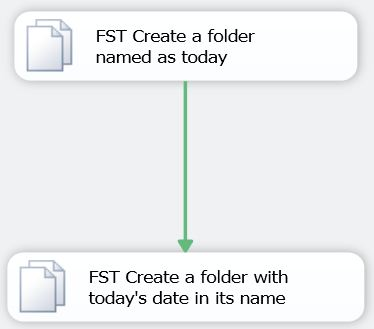

# FileSystem Task Create Directory Demo
## Requires
- Visual Studio 2010
## License
- Apache License, Version 2.0
## Technologies
- SSIS
- SQL Server Integration Services
- SSIS 2012
- SQL Server Integration Services 2012
## Topics
- How to
- SsisFileSystemTask
## Updated
- 04/09/2012
## Description

<h1>Introduction</h1>

This is a short demonstration of how to use the FileSystem Task within SQL Server Integration Services (SSIS) 2012 to create a directory. It incorporates the use of SSIS expressions which are a valuable tool when building SSIS packages.

<strong>This sample requires SQL Server Integration Services (SSIS) 2012 or later.</strong>

<h1>Building the Sample</h1>

Executing the package contained within the attached zip file will cause the sample to be built behind the scenes so there are no extra steps required for you, the developer, in order to view the results of this sample..

Description

This is a very simple demo that shows how to use the File System Task in SQL Server Integration Services (SSIS) 2012 to&nbsp;create a folder whose name depends on today.

In order to use the sample simply download the attached .zip file and unzip it to your hard drive (doesn&rsquo;t matter where). It contains a Visual Studio solution which in turn contains a single SSIS project called &ldquo;FileSystem Task Create Directory
 Demo&rdquo;. Within that SSIS project is an SSIS package called Package.dtsx. You can simply open up that package within the design environment and execute it there in order to see what it does (i.e. there is no need to deploy it anywhere). When it executes
 it will, by default, create two folders in C:\Temp.&nbsp;

 
Both tasks will, by default create a folder in &quot;C:\Temp&quot;. You can change&nbsp;this default by changing the value of the FolderRoot variable.&nbsp;

Task &quot;FST Create a folder named as today&quot; will create a folder with today's&nbsp;day name in it (e.g. C:\Temp\Friday).

Task &quot;FST Create a folder with today's date in its name&quot; will create a folder&nbsp;with today's date in it (e.g. C:\Temp\2012-03-23).

 
This demo was originally built in response to a thread on the SSIS Forum.&nbsp;See that thread at
<a href="http://bit.ly/GHV4VO">http://bit.ly/GHV4VO</a>

&nbsp;

Regards 
Jamie

<em> 
</em>

<em> 
</em>

Jamie Thomson 
<a href="http://sqlblog.com/blogs/jamie_thomson">http://sqlblog.com/blogs/jamie_thomson</a> 
<a href="http://twitter.com/jamiet">@jamiet</a><em> 
</em>

