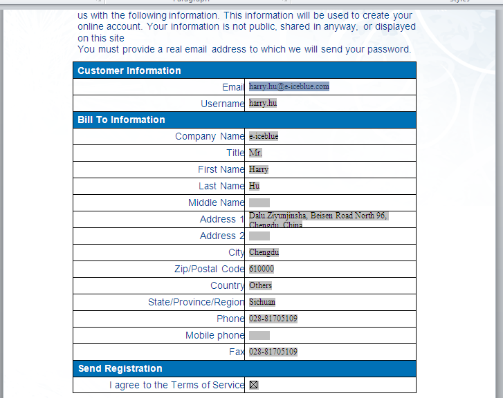

# Fill FormField in PDF in C#
## Requires
- Visual Studio 2010
## License
- MS-LPL
## Technologies
- C#
- ASP.NET
- WPF
- .NET Framework
## Topics
- Controls
- C#
- User Interface
- How to
## Updated
- 09/15/2014
## Description

This sample show you how to fill the formfield in PDF in C# code with the help of Spire.PDF for .NET.
As a standalone C#/VB.NET component,&nbsp;<a href="http://www.e-iceblue.com/Introduce/free-pdf-component.html">Free Spire.PDF for .NET</a>&nbsp;enables developers to create, write, edit, convert, print, handle and read PDF files
 on any .NET applications. You can implement rich capabilities to create PDF files from scratch or process existing PDF documents.

Spire.PDF for .NET offers the facility to merge/split PDF documents and overlay documents. That is to say, users can overlay pages from different PDF documents one over another. Meanwhile, Spire.PDF for .NET can provide import and stamp feature, booklet
 feature and form filling which can help users read value from form fields and populate a database.

With Spire.PDF, we could fix the data for Textbox, listBox,comBox, checkBox and so on. Effective screenshot of the form filling.

There a lot of PDF tasks can be operated by using this .NET PDF library. Programmers can merge PDF files into one PDF as well as split a huge PDF with the given number range accordingly. Furthermore, it can protect your PDF document by encryption with both
 owner password and user password, create PDF digital signature. If you do not need to lock your PDF, you can decrypt it quickly. Besides, you can set PDF property, PDF template and view preference as you like. Finally, webpage, image and text all can be converted
 to PDF which are already referred above.

<strong>Useful Links:</strong>

<strong>Website</strong>:&nbsp;<a href="http://www.e-icbelue.com/">http://www.e-icbelue.com</a>

<strong>Product Home</strong>:&nbsp;<a href="http://www.e-iceblue.com/Introduce/pdf-for-net-introduce.html">Spire.PDF for .NET introduction</a>

<strong>Free Trial</strong>:&nbsp;<a href="http://www.e-iceblue.com/Download/download-pdf-for-net-now.html">Free evalution on Spire.PDF</a>

<strong>Forum</strong>:&nbsp;<a href="http://www.e-iceblue.com/forum/viewforum.php?f=4">Spire.PDF Forums</a>

