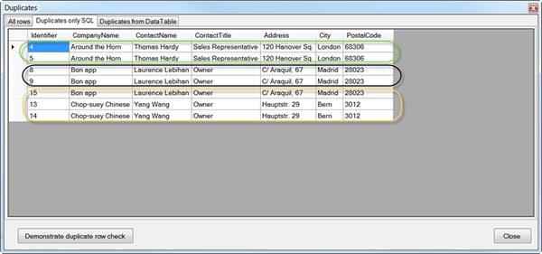

# Find duplicate records via SQL or LINQ in database table
## Requires
- Visual Studio 2013
## License
- Apache License, Version 2.0
## Technologies
- C#
- Data Access
- VB.Net
## Topics
- Data Access
- Databases
## Updated
- 09/24/2014
## Description

<h1>Description</h1>

This article demonstrates two methods to find duplicate records in a database table using SQL and finding duplicates after data is loaded from a database table into a DataTable. Also gives one example on how to prevent duplicates
 in &nbsp;code without constraints on the current object or database table. 
 
The reason for these demonstrations is from seeing many post on Microsoft Social forums were a developer did not use proper validation in their program, a secondary entry into their database with no validation or they had zero
 control over validation. 
 
There several common methods to discover duplicate records were all focus on returning duplicate records by one or more fields yet fail to return duplicate records which include the primary key value. Without this key how does
 one know which record to remove (which is usually what is done with a complete duplicate record) a record? There are two demonstrations, one using LINQ against data loaded already while the second uses a medium skill level SQL statement. Personally I would
 use an SQL statement against the database table to learn which records are duplicates especially if there are a lot of records to check. 
 
The demonstrations are done in a VB.NET Windows Form project to show results. Code for discovering duplicate records is split into two class projects, VB.NET for SQL method and C# for the LINQ method. Why split the two up? C# developers
 tend not to use VB.NET and VB.NET developers tend not to use C#. Now the last statement is not broad stroke, instead this is a small segment of coders. I want to promote (as does Visual Studio) using multiple languages in a solution rather than finding a solution
 in one language and not having skills to convert, why not just use the code! 
 
Back to discovering duplicates, examine both methods and you will find that both are very similar i.e. focus on groupings and inner join and count. The same database table is used for both. In both methods I am checking each field
 in each row but the same code will work for one or two fields also.&nbsp; 
 
The database is MS-Access but this is irrelevant as the focus is on a) the container, in this case a DataTable b) against the database table using SQL-93 standards for writing SQL.

&nbsp;

<strong>IMPORTANT </strong>The solution is in VS2013 but the code itself will work in VS2010, VS2012&nbsp; &nbsp;

&nbsp;

Visual BasicC#

Edit|Remove

vbcsharp
<pre class="hidden">Private Sub GetOnlyDuplicatesFromDatabase()
    Using cn As New OleDb.OleDbConnection With
            {
                .ConnectionString = Builder.ConnectionString
            }

        Using cmd As New OleDb.OleDbCommand With {.Connection = cn}

            cmd.CommandText =
                &lt;SQL&gt;
                SELECT A.*
                FROM Customers A
                INNER JOIN
                    (
                    SELECT 
                        CompanyName,
                        ContactName,
                        ContactTitle,
                        Address,
                        City,
                        PostalCode
                    FROM 
                        Customers
                    GROUP BY 
                        CompanyName,
                        ContactName,
                        ContactTitle,
                        Address,City,
                        PostalCode
                    HAVING COUNT(*) &gt; 1
                    ) B
                ON
                A.CompanyName = B.CompanyName AND
                A.ContactName = B.ContactName AND
                A.ContactTitle = B.ContactTitle AND
                A.Address = B.Address AND
                A.City = B.City AND
                A.PostalCode = B.PostalCode
                ORDER BY 
                    A.CompanyName
                &lt;/SQL&gt;.Value

            cn.Open()

            mDuplicatesCustomersDataTableFromDatabase.Load(cmd.ExecuteReader)

        End Using
    End Using
End Sub</pre>
<pre class="hidden">using DataOperations_VB;
using System.Data;
using System.Linq;

namespace DuplicateForDataTable_CS
{
    /// &lt;summary&gt;
    /// Sample how to get duplicate records/datarows in a DataTable
    /// via more than one column and include the primary key so we
    /// can have options to a) shows data to users b) allow user
    /// to delete records as we need a key to do this.
    /// &lt;/summary&gt;
    public class DataTableDuplicateFinder
    {
        public DataTable GetDuplicates()
        {
            DataAccess da = new DataAccess();
            DataTable dt = da.AllCustomersDataDataTable;

            DataTable dtNew = dt.Clone();
            dtNew.Columns[&quot;Identifier&quot;].AutoIncrement = false;

            var duplicates = from row in dt.AsEnumerable()
                             select
                             new
                             {
                                 Identifier = row[0],
                                 CompanyName = row[1],
                                 ContactName = row[2],
                                 ContactTitle = row[3],
                                 Address = row[4],
                                 City = row[5],
                                 PostalCode = row[6]
                             }
                                 into temp
                                 group temp by
                                 new
                                 {
                                     CompanyName = temp.CompanyName,
                                     ContactName = temp.ContactName,
                                     ContactTitle = temp.ContactTitle
                                 }
                                     into grouped
                                     where grouped.Count() &gt; 1
                                     select grouped.Select(g =&gt;
                                     new
                                     {
                                         g.Identifier,
                                         g.CompanyName,
                                         g.ContactName,
                                         g.ContactTitle,
                                         g.Address,
                                         g.City,
                                         g.PostalCode
                                     }
                                 );

            foreach (var Item in duplicates)
            {
                foreach (var row in Item)
                {
                    dtNew.Rows.Add(new object[]
                        {
                            (int)row.Identifier,
                            row.CompanyName,
                            row.ContactName,
                            row.ContactTitle,
                            row.Address,
                            row.City,
                            row.PostalCode
                        }
                    );
                }
            }

            return dtNew;
        }
    }
}</pre>

<pre class="vb">Private&nbsp;Sub&nbsp;GetOnlyDuplicatesFromDatabase()&nbsp;
&nbsp;&nbsp;&nbsp;&nbsp;Using&nbsp;cn&nbsp;As&nbsp;New&nbsp;OleDb.OleDbConnection&nbsp;With&nbsp;
&nbsp;&nbsp;&nbsp;&nbsp;&nbsp;&nbsp;&nbsp;&nbsp;&nbsp;&nbsp;&nbsp;&nbsp;{&nbsp;
&nbsp;&nbsp;&nbsp;&nbsp;&nbsp;&nbsp;&nbsp;&nbsp;&nbsp;&nbsp;&nbsp;&nbsp;&nbsp;&nbsp;&nbsp;&nbsp;.ConnectionString&nbsp;=&nbsp;Builder.ConnectionString&nbsp;
&nbsp;&nbsp;&nbsp;&nbsp;&nbsp;&nbsp;&nbsp;&nbsp;&nbsp;&nbsp;&nbsp;&nbsp;}&nbsp;
&nbsp;
&nbsp;
&nbsp;&nbsp;&nbsp;&nbsp;&nbsp;&nbsp;&nbsp;&nbsp;Using&nbsp;cmd&nbsp;As&nbsp;New&nbsp;OleDb.OleDbCommand&nbsp;With&nbsp;{.Connection&nbsp;=&nbsp;cn}&nbsp;
&nbsp;
&nbsp;&nbsp;&nbsp;&nbsp;&nbsp;&nbsp;&nbsp;&nbsp;&nbsp;&nbsp;&nbsp;&nbsp;cmd.CommandText&nbsp;=&nbsp;
&nbsp;&nbsp;&nbsp;&nbsp;&nbsp;&nbsp;&nbsp;&nbsp;&nbsp;&nbsp;&nbsp;&nbsp;&nbsp;&nbsp;&nbsp;&nbsp;&lt;SQL&gt;&nbsp;
&nbsp;&nbsp;&nbsp;&nbsp;&nbsp;&nbsp;&nbsp;&nbsp;&nbsp;&nbsp;&nbsp;&nbsp;&nbsp;&nbsp;&nbsp;&nbsp;SELECT&nbsp;A.*&nbsp;
&nbsp;&nbsp;&nbsp;&nbsp;&nbsp;&nbsp;&nbsp;&nbsp;&nbsp;&nbsp;&nbsp;&nbsp;&nbsp;&nbsp;&nbsp;&nbsp;FROM&nbsp;Customers&nbsp;A&nbsp;
&nbsp;&nbsp;&nbsp;&nbsp;&nbsp;&nbsp;&nbsp;&nbsp;&nbsp;&nbsp;&nbsp;&nbsp;&nbsp;&nbsp;&nbsp;&nbsp;INNER&nbsp;JOIN&nbsp;
&nbsp;&nbsp;&nbsp;&nbsp;&nbsp;&nbsp;&nbsp;&nbsp;&nbsp;&nbsp;&nbsp;&nbsp;&nbsp;&nbsp;&nbsp;&nbsp;&nbsp;&nbsp;&nbsp;&nbsp;(&nbsp;
&nbsp;&nbsp;&nbsp;&nbsp;&nbsp;&nbsp;&nbsp;&nbsp;&nbsp;&nbsp;&nbsp;&nbsp;&nbsp;&nbsp;&nbsp;&nbsp;&nbsp;&nbsp;&nbsp;&nbsp;SELECT&nbsp;&nbsp;
&nbsp;&nbsp;&nbsp;&nbsp;&nbsp;&nbsp;&nbsp;&nbsp;&nbsp;&nbsp;&nbsp;&nbsp;&nbsp;&nbsp;&nbsp;&nbsp;&nbsp;&nbsp;&nbsp;&nbsp;&nbsp;&nbsp;&nbsp;&nbsp;CompanyName,&nbsp;
&nbsp;&nbsp;&nbsp;&nbsp;&nbsp;&nbsp;&nbsp;&nbsp;&nbsp;&nbsp;&nbsp;&nbsp;&nbsp;&nbsp;&nbsp;&nbsp;&nbsp;&nbsp;&nbsp;&nbsp;&nbsp;&nbsp;&nbsp;&nbsp;ContactName,&nbsp;
&nbsp;&nbsp;&nbsp;&nbsp;&nbsp;&nbsp;&nbsp;&nbsp;&nbsp;&nbsp;&nbsp;&nbsp;&nbsp;&nbsp;&nbsp;&nbsp;&nbsp;&nbsp;&nbsp;&nbsp;&nbsp;&nbsp;&nbsp;&nbsp;ContactTitle,&nbsp;
&nbsp;&nbsp;&nbsp;&nbsp;&nbsp;&nbsp;&nbsp;&nbsp;&nbsp;&nbsp;&nbsp;&nbsp;&nbsp;&nbsp;&nbsp;&nbsp;&nbsp;&nbsp;&nbsp;&nbsp;&nbsp;&nbsp;&nbsp;&nbsp;Address,&nbsp;
&nbsp;&nbsp;&nbsp;&nbsp;&nbsp;&nbsp;&nbsp;&nbsp;&nbsp;&nbsp;&nbsp;&nbsp;&nbsp;&nbsp;&nbsp;&nbsp;&nbsp;&nbsp;&nbsp;&nbsp;&nbsp;&nbsp;&nbsp;&nbsp;City,&nbsp;
&nbsp;&nbsp;&nbsp;&nbsp;&nbsp;&nbsp;&nbsp;&nbsp;&nbsp;&nbsp;&nbsp;&nbsp;&nbsp;&nbsp;&nbsp;&nbsp;&nbsp;&nbsp;&nbsp;&nbsp;&nbsp;&nbsp;&nbsp;&nbsp;PostalCode&nbsp;
&nbsp;&nbsp;&nbsp;&nbsp;&nbsp;&nbsp;&nbsp;&nbsp;&nbsp;&nbsp;&nbsp;&nbsp;&nbsp;&nbsp;&nbsp;&nbsp;&nbsp;&nbsp;&nbsp;&nbsp;FROM&nbsp;&nbsp;
&nbsp;&nbsp;&nbsp;&nbsp;&nbsp;&nbsp;&nbsp;&nbsp;&nbsp;&nbsp;&nbsp;&nbsp;&nbsp;&nbsp;&nbsp;&nbsp;&nbsp;&nbsp;&nbsp;&nbsp;&nbsp;&nbsp;&nbsp;&nbsp;Customers&nbsp;
&nbsp;&nbsp;&nbsp;&nbsp;&nbsp;&nbsp;&nbsp;&nbsp;&nbsp;&nbsp;&nbsp;&nbsp;&nbsp;&nbsp;&nbsp;&nbsp;&nbsp;&nbsp;&nbsp;&nbsp;GROUP&nbsp;BY&nbsp;&nbsp;
&nbsp;&nbsp;&nbsp;&nbsp;&nbsp;&nbsp;&nbsp;&nbsp;&nbsp;&nbsp;&nbsp;&nbsp;&nbsp;&nbsp;&nbsp;&nbsp;&nbsp;&nbsp;&nbsp;&nbsp;&nbsp;&nbsp;&nbsp;&nbsp;CompanyName,&nbsp;
&nbsp;&nbsp;&nbsp;&nbsp;&nbsp;&nbsp;&nbsp;&nbsp;&nbsp;&nbsp;&nbsp;&nbsp;&nbsp;&nbsp;&nbsp;&nbsp;&nbsp;&nbsp;&nbsp;&nbsp;&nbsp;&nbsp;&nbsp;&nbsp;ContactName,&nbsp;
&nbsp;&nbsp;&nbsp;&nbsp;&nbsp;&nbsp;&nbsp;&nbsp;&nbsp;&nbsp;&nbsp;&nbsp;&nbsp;&nbsp;&nbsp;&nbsp;&nbsp;&nbsp;&nbsp;&nbsp;&nbsp;&nbsp;&nbsp;&nbsp;ContactTitle,&nbsp;
&nbsp;&nbsp;&nbsp;&nbsp;&nbsp;&nbsp;&nbsp;&nbsp;&nbsp;&nbsp;&nbsp;&nbsp;&nbsp;&nbsp;&nbsp;&nbsp;&nbsp;&nbsp;&nbsp;&nbsp;&nbsp;&nbsp;&nbsp;&nbsp;Address,City,&nbsp;
&nbsp;&nbsp;&nbsp;&nbsp;&nbsp;&nbsp;&nbsp;&nbsp;&nbsp;&nbsp;&nbsp;&nbsp;&nbsp;&nbsp;&nbsp;&nbsp;&nbsp;&nbsp;&nbsp;&nbsp;&nbsp;&nbsp;&nbsp;&nbsp;PostalCode&nbsp;
&nbsp;&nbsp;&nbsp;&nbsp;&nbsp;&nbsp;&nbsp;&nbsp;&nbsp;&nbsp;&nbsp;&nbsp;&nbsp;&nbsp;&nbsp;&nbsp;&nbsp;&nbsp;&nbsp;&nbsp;HAVING&nbsp;COUNT(*)&nbsp;&gt;&nbsp;1&nbsp;
&nbsp;&nbsp;&nbsp;&nbsp;&nbsp;&nbsp;&nbsp;&nbsp;&nbsp;&nbsp;&nbsp;&nbsp;&nbsp;&nbsp;&nbsp;&nbsp;&nbsp;&nbsp;&nbsp;&nbsp;)&nbsp;B&nbsp;
&nbsp;&nbsp;&nbsp;&nbsp;&nbsp;&nbsp;&nbsp;&nbsp;&nbsp;&nbsp;&nbsp;&nbsp;&nbsp;&nbsp;&nbsp;&nbsp;ON&nbsp;
&nbsp;&nbsp;&nbsp;&nbsp;&nbsp;&nbsp;&nbsp;&nbsp;&nbsp;&nbsp;&nbsp;&nbsp;&nbsp;&nbsp;&nbsp;&nbsp;A.CompanyName&nbsp;=&nbsp;B.CompanyName&nbsp;AND&nbsp;
&nbsp;&nbsp;&nbsp;&nbsp;&nbsp;&nbsp;&nbsp;&nbsp;&nbsp;&nbsp;&nbsp;&nbsp;&nbsp;&nbsp;&nbsp;&nbsp;A.ContactName&nbsp;=&nbsp;B.ContactName&nbsp;AND&nbsp;
&nbsp;&nbsp;&nbsp;&nbsp;&nbsp;&nbsp;&nbsp;&nbsp;&nbsp;&nbsp;&nbsp;&nbsp;&nbsp;&nbsp;&nbsp;&nbsp;A.ContactTitle&nbsp;=&nbsp;B.ContactTitle&nbsp;AND&nbsp;
&nbsp;&nbsp;&nbsp;&nbsp;&nbsp;&nbsp;&nbsp;&nbsp;&nbsp;&nbsp;&nbsp;&nbsp;&nbsp;&nbsp;&nbsp;&nbsp;A.Address&nbsp;=&nbsp;B.Address&nbsp;AND&nbsp;
&nbsp;&nbsp;&nbsp;&nbsp;&nbsp;&nbsp;&nbsp;&nbsp;&nbsp;&nbsp;&nbsp;&nbsp;&nbsp;&nbsp;&nbsp;&nbsp;A.City&nbsp;=&nbsp;B.City&nbsp;AND&nbsp;
&nbsp;&nbsp;&nbsp;&nbsp;&nbsp;&nbsp;&nbsp;&nbsp;&nbsp;&nbsp;&nbsp;&nbsp;&nbsp;&nbsp;&nbsp;&nbsp;A.PostalCode&nbsp;=&nbsp;B.PostalCode&nbsp;
&nbsp;&nbsp;&nbsp;&nbsp;&nbsp;&nbsp;&nbsp;&nbsp;&nbsp;&nbsp;&nbsp;&nbsp;&nbsp;&nbsp;&nbsp;&nbsp;ORDER&nbsp;BY&nbsp;&nbsp;
&nbsp;&nbsp;&nbsp;&nbsp;&nbsp;&nbsp;&nbsp;&nbsp;&nbsp;&nbsp;&nbsp;&nbsp;&nbsp;&nbsp;&nbsp;&nbsp;&nbsp;&nbsp;&nbsp;&nbsp;A.CompanyName&nbsp;
&nbsp;&nbsp;&nbsp;&nbsp;&nbsp;&nbsp;&nbsp;&nbsp;&nbsp;&nbsp;&nbsp;&nbsp;&nbsp;&nbsp;&nbsp;&nbsp;&lt;/SQL&gt;.Value&nbsp;
&nbsp;
&nbsp;&nbsp;&nbsp;&nbsp;&nbsp;&nbsp;&nbsp;&nbsp;&nbsp;&nbsp;&nbsp;&nbsp;cn.Open()&nbsp;
&nbsp;
&nbsp;&nbsp;&nbsp;&nbsp;&nbsp;&nbsp;&nbsp;&nbsp;&nbsp;&nbsp;&nbsp;&nbsp;mDuplicatesCustomersDataTableFromDatabase.Load(cmd.ExecuteReader)&nbsp;
&nbsp;
&nbsp;&nbsp;&nbsp;&nbsp;&nbsp;&nbsp;&nbsp;&nbsp;End&nbsp;Using&nbsp;
&nbsp;&nbsp;&nbsp;&nbsp;End&nbsp;Using&nbsp;
End&nbsp;Sub</pre>

<h1></h1>
