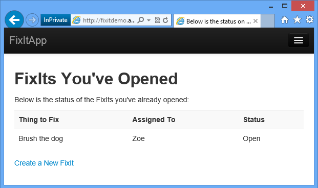
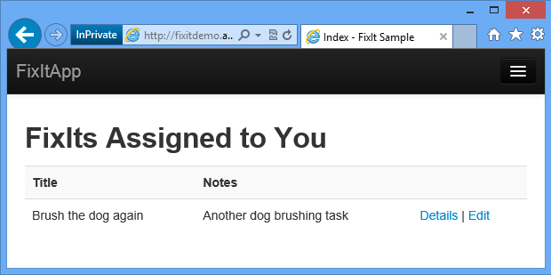

# Fix It app for Scott Guthrie's Building Real World Cloud Apps with Windows Azure
## Requires
- Visual Studio 2013
## License
- Apache License, Version 2.0
## Technologies
- C#
- ASP.NET
- Microsoft Azure
- .NET Framework
- ASP.NET MVC 4
- Windows Azure SQL Database
## Topics
- ASP.NET
- Microsoft Azure
- Web Development
- Windows Azure Queues
- Windows Azure Web Sites
- Windows Azure Cache Service
## Updated
- 08/22/2014
## Description

<h1>Introduction</h1>

This is a Visual Studio project that accompanies the e-book <a href="http://www.asp.net/aspnet/overview/developing-apps-with-windows-azure/building-real-world-cloud-apps-with-windows-azure/introduction">
Building Real-World Cloud Apps with Windows Azure</a>. The code demonstrates best practices for cloud apps as presented in the e-book, such as:

<ul>
<li>Storing automation scripts with code in source control </li><li>Using automation scripts for environment creation and deployment </li><li>Asynchronous programming </li><li>Dependency injection </li><li>Data partitioning </li><li>Blob storage </li><li>Transient fault handling </li><li>Instrumentation </li><li>Queue-centric work pattern </li></ul>
<h1>Building the Sample</h1>

There are two versions of the app you can run:

<ul>
<li>The base version is designed to run in a Windows Azure Web Site. </li><li>The queues version has a front-end web site and a back-end service. The front-end communicates with the back-end via Windows Azure Storage Queues. The front-end is designed to run in a Windows Azure Web Site, the back-end is designed to run in a Windows
 Azure Cloud Service. </li></ul>

The following instructions apply to the base version:

<ol>
<li>Install <a href="http://www.visualstudio.com/en-us/downloads">Visual Studio 2013 or Visual Studio 2013 Express for Web</a>.
</li><li>Install the <a href="http://go.microsoft.com/fwlink/p/?linkid=323510&clcid=0x409">
Windows Azure SDK for .NET for Visual Studio 2013.</a> </li><li>Download the .zip file. </li><li>In File Explorer, right-click the&nbsp;.zip file and click Properties, then in the Properties window click Unblock.
</li><li>Unzip the file. </li><li>Double-click the .sln file to launch Visual Studio. </li><li>From the Tools menu, click Library Package Manager, then Package Manager Console.
</li><li>In the Package Manager Console (PMC), click Restore. </li><li>Exit Visual Studio. </li><li>Start the <a href="http://msdn.microsoft.com/en-us/library/windowsazure/hh403989.aspx">
Windows Azure storage emulator</a>. </li><li>Restart Visual Studio, opening the solution file you closed in the previous step.
</li><li>Make sure the FixIt project is set as the startup project, and then press CTRL&#43;F5 to run the project.
</li></ol>

Instructions that explain how to use the included PowerShell scripts to deploy the application to Windows Azure, and how to run and deploy the queues version of the application, are in
<a href="http://www.asp.net/aspnet/overview/developing-apps-with-windows-azure/building-real-world-cloud-apps-with-windows-azure/the-fix-it-sample-application">
Appendix: The Fix It Sample Application</a>.

<h1>Description</h1>

The sample app is a simple work item ticketing system called &ldquo;Fix It!&rdquo;&nbsp; When you need something fixed, you create a ticket and assign it to someone, and others can log in and see the tickets assigned to them and mark tickets as completed
 when the work is done.

It&rsquo;s a standard Visual Studio web project. It is built on ASP.NET MVC and&nbsp; uses a SQL Server database. It can run locally in IIS Express&nbsp; and can be deployed to a Windows Azure Web Site to run in the cloud. For the queues version, the back-end
 code that processes the queue messages is deployed to a&nbsp;worker role in a&nbsp;Windows Azure Cloud Service.

You can log in using forms authentication and a local database or by using a social provider such as Google.

Once you&rsquo;re logged in you can create a ticket, assign it to someone, and upload a picture of what you want to get fixed.

You can track the progress of work items you created.

You can see tickets that are assigned to you and select one to see the details.

&nbsp;

<h1>Source Code Folders</h1>
<ul>
<li>Automation - PowerShell scripts for environment creation and deployment. </li><li>MyFixIt - The Web project. </li><li>MyFixIt.Logging - Instrumentation code (logging interface and implementation).
</li><li>MyFixIt.Persistence - Code for handling storage and retrieval of Tasks and their image files.
</li><li>MyFixIt.Tests - Unit tests. </li><li>MyFixIt.WorkerRole - Worker role project, used for queues version of the app only.
</li><li>MyFixIt.CloudService - Windows Azure Cloud Service deployment project, used for queues version of the app only.
</li><li>packages - NuGet packages. </li></ul>
<h1>More Information</h1>

For more information, see <a href="http://www.asp.net/aspnet/overview/developing-apps-with-windows-azure/building-real-world-cloud-apps-with-windows-azure/introduction">
Building Real-World Cloud Apps with Windows Azure</a>.

