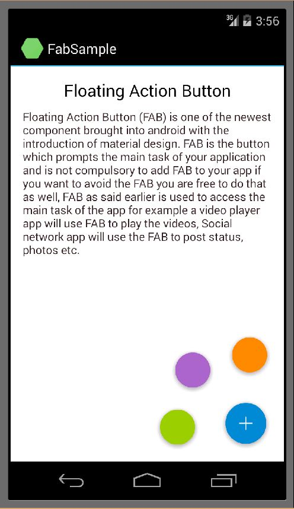

# Floating Action Button for Android
## Requires
- Visual Studio 2012
## License
- MIT
## Technologies
- Xamarin.Android
- Xamarin
## Topics
- Floating action Button Android
- Android material design
## Updated
- 06/23/2015
## Description

<h1>Floating Action Button for Android Using Xamarin in Visual Studio</h1>
<h1>Android L has introduced something called a Floating Action Button (FAB), which is basically a circle overlayed on top your application. This FAB can be clicked to do an action.&nbsp;</h1>

Floating action buttons are used for a promoted action. They are distinguished by a circled icon floating above the UI and have motion behaviors that include morphing, launching, and a transferring anchor point.

Floating action buttons come in two sizes:

<ul>
<li>Default size: For most use cases </li><li>Mini size: Only used to create visual continuity with other screen elements </li></ul>

At 2014 Google I/O, Google announced a new visual language called Material Design. Material Design guides creation of user experiences that work well on different devices, with different input methods and on different platforms. Google is gradually implementing
 Material Design in their apps and products, and we can start playing with it, too.

One interesting new design pattern is the promoted action, implemented as a&nbsp;<a href="http://www.google.com/design/spec/patterns/promoted-actions.html">floating action button</a>. This pattern exemplifies the underlying principles of Material Design
 and is a good place to start adapting existing applications to the new version of Android.

You can see from Google&rsquo;s guidelines that there are many ways to apply this pattern incorrectly, as evidenced by the various &ldquo;Don&rsquo;ts&rdquo; on that page. Today, I want to show you how to implement a floating action button in Xamarin using
 Visual Studio.

<em>Floating Action Button (FAB) is created ad seperate project and added to the sample as a package. The FAB is also give a small animation on it's click event.</em>

<em> 
</em>

&nbsp;

&nbsp;

By adding the predefined project or package of FAB &nbsp;we can adda FAButton.

&nbsp;

XML

Edit|Remove

xml

<pre class="xml">&nbsp;&nbsp;&nbsp;&nbsp;&lt;floatingactionbutton.Fab&nbsp;
&nbsp;&nbsp;&nbsp;&nbsp;&nbsp;&nbsp;&nbsp;&nbsp;android:id=&quot;@&#43;id/fabbutton&quot;&nbsp;
&nbsp;&nbsp;&nbsp;&nbsp;&nbsp;&nbsp;&nbsp;&nbsp;android:layout_width=&quot;70dp&quot;&nbsp;
&nbsp;&nbsp;&nbsp;&nbsp;&nbsp;&nbsp;&nbsp;&nbsp;android:layout_height=&quot;70dp&quot;&nbsp;
&nbsp;&nbsp;&nbsp;&nbsp;&nbsp;&nbsp;&nbsp;&nbsp;android:layout_gravity=&quot;bottom|right&quot;&nbsp;
&nbsp;&nbsp;&nbsp;&nbsp;&nbsp;&nbsp;&nbsp;&nbsp;android:layout_marginBottom=&quot;15dp&quot;&nbsp;
&nbsp;&nbsp;&nbsp;&nbsp;&nbsp;&nbsp;&nbsp;&nbsp;android:layout_marginRight=&quot;15dp&quot;&nbsp;/&gt;</pre>

