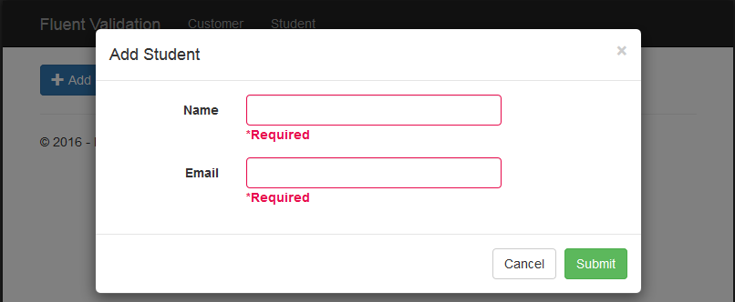

# FluentValidation in ASP.NET MVC 5 using Dependency Injection
## Requires
- Visual Studio 2015
## License
- Apache License, Version 2.0
## Technologies
- AJAX
- ASP.NET MVC
- Bootstrap
- Ninject
- ASP.NET MVC 5
- Fluent validation framework
## Topics
- Validation
- ASP.NET MVC
- Dependancy Injection
- jQuery Unobtrusive Validation
- FluentValidation in MVC
## Updated
- 08/27/2016
## Description

<h1>Introduction</h1>

This project shows that how to implement fluent validation in ASP.NET MVC 5 using dependency injection with Ninject IoC.

The code illustrates the following topics

<ul>
<li>Fluent Validation using Dependency Injection with Ninject IoC. 
</li><li>Fluent Validation on dynamic load bootstrap modal popup. 
</li><li>jquery.validate.unobtrusive validation on dynamic load bootstrap modal popup. 
</li><li>Bootstrap Modal Popup using Ajax request. 
</li><li>Separate example for both static form and dynamic load form. 
</li></ul>
<h1>Getting Started</h1>

To build and run this sample as-is, you must have Visual Studio 2013/2015 installed. In most cases you can run the application by following these steps:

<ol>
<li>Download and extract the .zip file. 
</li><li>Open the solution file in Visual Studio 2013/2015. 
</li><li>Build the solution, which automatically installs the missing NuGet packages. 
</li><li>Run the application. 
</li><li>You will see customer add form and click on submit button then it validates form.&nbsp; 
</li><li>Now access another form using &ldquo;Student&rdquo; Menu. After that click on &ldquo;Add&rdquo; button on student screen which opens add student form in modal popup and it loads dynamically using
 Ajax request and clicks on submit button and form validates.&nbsp; 
</li></ol>

Figure 1: Add Customer Form

Figure 2: Add Student Form in Modal Popup

<h1>Source Code Overview</h1>

Most of folders and files are used as per ASP.NET MVC conventions.

<ul>
<li><em>Validation</em>: This folder has validation classes which used to validate view models. 
</li><li><em>ValidatorFactory.cs</em>: This class is used for dependecy injection where validation classes object inject in IValidator. 
</li><li><em>NinjectWebCommon.cs</em>: This class is used to register validation DI with IoC Ninject.
 
</li><li><em>jQuery.customValidate.js</em>: It&rsquo;s custome validator which enables jquery.validate.unobtrusive on dynamic load bootstrap modal popup.&nbsp; 
</li></ul>
