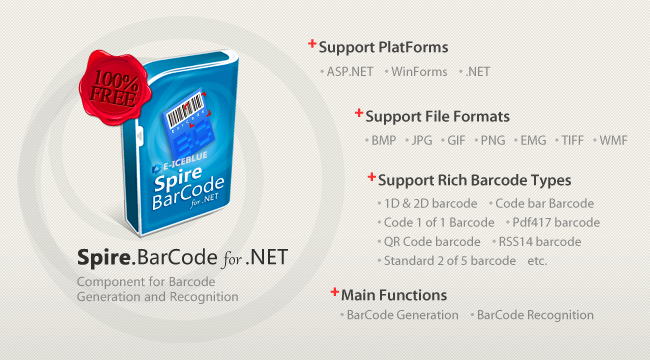

# Free Barcode API---Create and Scan Barcodes in C#
## Requires
- Visual Studio 2010
## License
- MS-LPL
## Technologies
- C#
- Silverlight
- ASP.NET
- Win32
- WPF
- .NET Framework
- VB.Net
- .NET Development
## Topics
- Controls
- C#
- ASP.NET
- Web Services
- .NET 4
- How to
- C# Language Features
## Updated
- 05/16/2014
## Description

<h1>Introduction</h1>

This is a C # example to generate and recognise barcode via a Free C# barcode library. And the code gives you clear information of how to create and scan barcode in C#.

<a href="http://www.e-iceblue.com/Introduce/barcode-for-net-introduce.html">Spire.BarCode for .NET</a> is a
<strong>100% free</strong>, professional and reliable barcode generation and recognition component. It enables developers to quickly and easily add barcode generation and recognition functionality to their Microsoft .NET applications and it supports in C#,
 VB.NET.

<strong>Main Features:</strong>

<strong>Supports rich Barcode types, more than 38 different barcodes.</strong>

<ul>
<li>Aztec Barcode </li><li>Code bar Barcode </li><li>Code 1 of 1 Barcode </li><li>Standard 2 of 5 Barcode </li><li>Code 3 of 9 Barcode </li><li>Extended Code 3 of 9 Barcode </li><li>Code 9 of 3 Barcode </li><li>Extended Code 9 of 3 Barcode </li><li>Code 128 Barcode </li><li>EAN-8 Barcode </li><li>EAN-13 Barcode </li><li>EAN-128 Barcode </li><li>EAN-14 Barcode </li><li>SCC14 Barcode </li><li>SSCC18 Barcode </li><li>ITF14 Barcode </li><li>ITF-6 Barcode </li><li>UPCA Barcode </li><li>UPCE Barcode </li><li>Postnet Barcode </li><li>Planet Barcode </li><li>MSI Barcode </li><li>2D Barcode DataMatrix </li><li>QR Code Barcode </li><li>Pdf417 Barcode </li><li>Pdf417 Macro Barcode </li><li>RSS14 Barcode&nbsp; </li><li>RSS-14 Truncated Barcode </li><li>RSS Limited Barcode </li><li>RSS Expanded Barcode </li><li>USPS OneCode Barcode </li><li>Swiss Post Parcel Barcode </li><li>PZN Barcode&nbsp; </li><li>OPC(Optical Product Code) Barcode </li><li>Deutschen Post Barcode </li><li>Deutsche Post Leitcode Barcode </li><li>Royal Mail 4-state Customer Code Barcode </li><li>Singapore Post Barcode&nbsp; </li></ul>

<strong>Robust Barcode Recognize and Generation 1D &amp; 2D Barcode.</strong>

Developers can read most often used Linear, 2D and Postal barcodes, detecting them anywhere, with any orientation.

<strong>High performance for generating and reading barcode image</strong>

Developers can create barcode images in any desired output image format like Bitmap, JPG, PNG, EMF, TIFF, GIF and WMF.

<strong>Superior performance support for reading and writing barcode</strong>

Developers can easily set barcode image borders, border colors, style, margins and width. You can also rotate barcode images to any angle and produce high quality barcode images.

<strong>Easy Integration</strong>

Spire.Barcode for .NET can be easily integrated into any .net applications. There are two main ways to integrate Spire.Barcode in .NET applications, API Mode and Component Mode.

<ul>
<li>API Mode is just one line of code to create, recognizes barcode. </li><li>Component Mode use Visual way to create barcode, then drag Spire.Barcode component to your .NET, Windows or ASP.NET Form. No more code needs.
</li></ul>

<strong>Download Spire.BarCode</strong>:

Spire.BarCode for .NET is a free barcode library used in .NET applications (in ASP.NET, WinForms and Web Service). And you can
<a href="http://www.e-iceblue.com/Download/download-barcode-for-net-now.html">download Spire.BarCode for .NET
</a>and install it on your system. With Spire.BarCode, you can add Enterprise-level barcode formats to your NET applications easily and quickly.

<strong>Related Links</strong>

<strong>Website</strong>: <a href="http://www.e-iceblue.com">www.e-iceblue.com</a>

<strong>Product Introduction</strong>: <a href="http://www.e-iceblue.com/Introduce/barcode-for-net-introduce.html">
http://www.e-iceblue.com/Introduce/barcode-for-net-introduce.html</a>

<strong>Download</strong>: <a href="http://www.e-iceblue.com/Download/download-barcode-for-net-now.html">
http://www.e-iceblue.com/Download/download-barcode-for-net-now.html</a>

<strong>Forum</strong>: <a href="http://www.e-iceblue.com/forum/spire-barcode-f13.html">
Free Barcode Forums</a>

