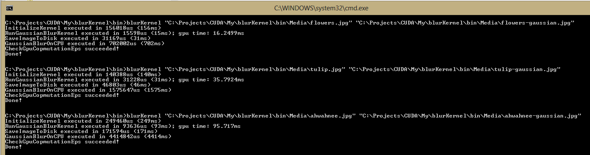
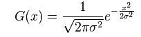
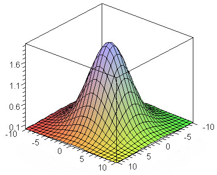

# Gaussian blur with CUDA 5
## Requires
- Visual Studio 2012
## License
- Apache License, Version 2.0
## Technologies
- C++
- Parallel Programming
- CUDA
- GPGPU
## Topics
- Parallel Programming
- Image manipulation
- CUDA
- GPGPU
## Updated
- 02/25/2013
## Description

<h1>Introduction</h1>

We will&nbsp;continue from a <a title="RGBA to Gray image conversion with CUDA 5" href="http://code.msdn.microsoft.com/vstudio/RGBA-to-Gray-image-e07dd9f5" target="_blank">
previous example</a> of RGBA to gray image conversion with CUDA 5 and&nbsp;add&nbsp;gaussian filter. After applying the filter we will achieve the following transformation:

&nbsp;

&nbsp;

to:

&nbsp;

Here's the information showing time it took to run&nbsp;CUDA kernel on the GPU compared to time on the CPU:

&nbsp;

This code will work with RGBA images where each channel (Red, Green, Blue, and Alpha) is represented by one byte (8-bits) and a range of values between 0 and 255 (2^8 - 1) for a total of 4-bytes per pixel.

Gaussian function&nbsp;expresses normal distribution in statistics.&nbsp;In image processing, Gaussian blur is based on the following function in one dimension:

&nbsp;

In two dimensions, it is the product of two Gaussians, one in each dimension, and has to be applied to each pixel of the image.

&nbsp;

In the formula, x is the distance from the origin in the horizontal axis (number of pixels to the left and to the right), y is the distance from the origin in the vertical axis (number of pixels to the top and to the bottom), and
 &sigma; is the standard deviation of the Gaussian distribution (arbitrary number). When applied in two dimensions, this formula produces a surface whose contours are concentric circles with a bell-shaped distribution from the center point. Values from this
 distribution are used to build a convolution matrix which is applied to the original image. Each pixel's new value is set to a weighted average of that pixel's neighboring pixels and self. The original pixel's value receives the heaviest weight (having the
 highest Gaussian value) and neighboring pixels receive smaller weights as their distance to the original pixel increases. This results in a blur that preserves boundaries and edges.

Visually convollution matrix looks like this:

References:

<a title="wiki" href="http://en.wikipedia.org/wiki/Gaussian_blur" target="_blank">Wikipedia</a>

<a href="http://rastergrid.com/blog/2010/09/efficient-gaussian-blur-with-linear-sampling" target="_blank">Efficient Gaussian blur with linear sampling</a>

<a href="http://www.swageroo.com/wordpress/how-to-program-a-gaussian-blur-without-using-3rd-party-libraries" target="_blank">How to program a Gaussian Blur</a>

<a href="http://people.csail.mit.edu/sparis/bf_course/slides08/03_definition_bf.pdf" target="_blank">Gentle introduction to bilateral filtering</a>

&nbsp;

<h1>Building the Sample</h1>

Required prerequisites are: CUDA 5.0, NSight 3.0 RC1,
<a title="OpenCV download" href="http://opencv.org/downloads.html" target="_blank">
OpenCV</a>, Visual Studio 2012

<h1>Description</h1>

To calculate gaussian blur we have to complete the following steps:

<ol>
<li>

Separate RGBA image into red, green, and blue channels;

</li><li>

Apply gaussian blur to each channel, one at a time;

</li><li>

Recombine red, green, and blue back into RGBA image.

</li></ol>

Code that separates the channels looks the following:&nbsp;

&nbsp;

C&#43;&#43;

Edit|Remove

cplusplus
<pre class="hidden">// Kernel separates rgba image into red, green, blue channels
__global__ 
void gaussian_separate_channels(
	unsigned char* const red, 
	unsigned char* const green, 
	unsigned char* const blue, 
	const uchar4* const  rgba, 
	int					 rows, 
	int					 cols
	)
{
. . .
	int idx			= c &#43; cols * r;		// current pixel index

	red  [idx]		= rgba[idx].x;
	green[idx]		= rgba[idx].y;
	blue [idx]		= rgba[idx].z;
}</pre>

<pre class="cplusplus">//&nbsp;Kernel&nbsp;separates&nbsp;rgba&nbsp;image&nbsp;into&nbsp;red,&nbsp;green,&nbsp;blue&nbsp;channels&nbsp;
__global__&nbsp;&nbsp;
void&nbsp;gaussian_separate_channels(&nbsp;
&nbsp;&nbsp;&nbsp;&nbsp;unsigned&nbsp;char*&nbsp;const&nbsp;red,&nbsp;&nbsp;
&nbsp;&nbsp;&nbsp;&nbsp;unsigned&nbsp;char*&nbsp;const&nbsp;green,&nbsp;&nbsp;
&nbsp;&nbsp;&nbsp;&nbsp;unsigned&nbsp;char*&nbsp;const&nbsp;blue,&nbsp;&nbsp;
&nbsp;&nbsp;&nbsp;&nbsp;const&nbsp;uchar4*&nbsp;const&nbsp;&nbsp;rgba,&nbsp;&nbsp;
&nbsp;&nbsp;&nbsp;&nbsp;int&nbsp;&nbsp;&nbsp;&nbsp;&nbsp;&nbsp;&nbsp;&nbsp;&nbsp;&nbsp;&nbsp;&nbsp;&nbsp;&nbsp;&nbsp;&nbsp;&nbsp;&nbsp;&nbsp;&nbsp;&nbsp;rows,&nbsp;&nbsp;
&nbsp;&nbsp;&nbsp;&nbsp;int&nbsp;&nbsp;&nbsp;&nbsp;&nbsp;&nbsp;&nbsp;&nbsp;&nbsp;&nbsp;&nbsp;&nbsp;&nbsp;&nbsp;&nbsp;&nbsp;&nbsp;&nbsp;&nbsp;&nbsp;&nbsp;cols&nbsp;
&nbsp;&nbsp;&nbsp;&nbsp;)&nbsp;
{&nbsp;
.&nbsp;.&nbsp;.&nbsp;
&nbsp;&nbsp;&nbsp;&nbsp;int&nbsp;idx&nbsp;&nbsp;&nbsp;&nbsp;&nbsp;&nbsp;&nbsp;&nbsp;&nbsp;&nbsp;&nbsp;&nbsp;=&nbsp;c&nbsp;&#43;&nbsp;cols&nbsp;*&nbsp;r;&nbsp;&nbsp;&nbsp;&nbsp;&nbsp;&nbsp;&nbsp;&nbsp;//&nbsp;current&nbsp;pixel&nbsp;index&nbsp;
&nbsp;
&nbsp;&nbsp;&nbsp;&nbsp;red&nbsp;&nbsp;[idx]&nbsp;&nbsp;&nbsp;&nbsp;&nbsp;&nbsp;&nbsp;&nbsp;=&nbsp;rgba[idx].x;&nbsp;
&nbsp;&nbsp;&nbsp;&nbsp;green[idx]&nbsp;&nbsp;&nbsp;&nbsp;&nbsp;&nbsp;&nbsp;&nbsp;=&nbsp;rgba[idx].y;&nbsp;
&nbsp;&nbsp;&nbsp;&nbsp;blue&nbsp;[idx]&nbsp;&nbsp;&nbsp;&nbsp;&nbsp;&nbsp;&nbsp;&nbsp;=&nbsp;rgba[idx].z;&nbsp;
}</pre>

Here's the blur kernel:

C&#43;&#43;

Edit|Remove

cplusplus
<pre class="hidden">__global__ 
void gaussian_blur(
	unsigned char* const		blurredChannel,						// return value: blurred channel (either red, green, or blue)
	const unsigned char* const	inputChannel,						// red, green, or blue channel from the original image
	int							rows, 
	int							cols,
	const float* const			filterWeight,						// gaussian filter weights. The weights look like a bell shape.
	int							filterWidth							// number of pixels in x and y directions for calculating average blurring
	)
{
. . .
	int			  half   = filterWidth / 2;
	float		  blur   = 0.f;								// will contained blurred value
	int			  width  = cols - 1;
	int			  height = rows - 1;

	for (int i = -half; i &lt;= half; &#43;&#43;i)					// rows
	{
		for (int j = -half; j &lt;= half; &#43;&#43;j)				// columns
		{
			// Clamp filter to the image border
			int		h		= min(max(r &#43; i, 0), height);
			int		w		= min(max(c &#43; j, 0), width);

			// Blur is a product of current pixel value and weight of that pixel.
			// Remember that sum of all weights equals to 1, so we are averaging sum of all pixels by their weight.
			int		idx		= w &#43; cols * h;											// current pixel index
			float	pixel	= static_cast&lt;float&gt;(inputChannel[idx]);

					idx		= (i &#43; half) * filterWidth &#43; j &#43; half;
			float	weight	= filterWeight[idx];

			blur &#43;= pixel * weight;
		}
	}

	blurredChannel[c &#43; r * cols] = static_cast&lt;unsigned char&gt;(blur);
}
</pre>

<pre class="cplusplus">__global__&nbsp;&nbsp;
void&nbsp;gaussian_blur(&nbsp;
&nbsp;&nbsp;&nbsp;&nbsp;unsigned&nbsp;char*&nbsp;const&nbsp;&nbsp;&nbsp;&nbsp;&nbsp;&nbsp;&nbsp;&nbsp;blurredChannel,&nbsp;&nbsp;&nbsp;&nbsp;&nbsp;&nbsp;&nbsp;&nbsp;&nbsp;&nbsp;&nbsp;&nbsp;&nbsp;&nbsp;&nbsp;&nbsp;&nbsp;&nbsp;&nbsp;&nbsp;&nbsp;&nbsp;&nbsp;&nbsp;//&nbsp;return&nbsp;value:&nbsp;blurred&nbsp;channel&nbsp;(either&nbsp;red,&nbsp;green,&nbsp;or&nbsp;blue)&nbsp;
&nbsp;&nbsp;&nbsp;&nbsp;const&nbsp;unsigned&nbsp;char*&nbsp;const&nbsp;&nbsp;&nbsp;&nbsp;inputChannel,&nbsp;&nbsp;&nbsp;&nbsp;&nbsp;&nbsp;&nbsp;&nbsp;&nbsp;&nbsp;&nbsp;&nbsp;&nbsp;&nbsp;&nbsp;&nbsp;&nbsp;&nbsp;&nbsp;&nbsp;&nbsp;&nbsp;&nbsp;&nbsp;//&nbsp;red,&nbsp;green,&nbsp;or&nbsp;blue&nbsp;channel&nbsp;from&nbsp;the&nbsp;original&nbsp;image&nbsp;
&nbsp;&nbsp;&nbsp;&nbsp;int&nbsp;&nbsp;&nbsp;&nbsp;&nbsp;&nbsp;&nbsp;&nbsp;&nbsp;&nbsp;&nbsp;&nbsp;&nbsp;&nbsp;&nbsp;&nbsp;&nbsp;&nbsp;&nbsp;&nbsp;&nbsp;&nbsp;&nbsp;&nbsp;&nbsp;&nbsp;&nbsp;&nbsp;rows,&nbsp;&nbsp;
&nbsp;&nbsp;&nbsp;&nbsp;int&nbsp;&nbsp;&nbsp;&nbsp;&nbsp;&nbsp;&nbsp;&nbsp;&nbsp;&nbsp;&nbsp;&nbsp;&nbsp;&nbsp;&nbsp;&nbsp;&nbsp;&nbsp;&nbsp;&nbsp;&nbsp;&nbsp;&nbsp;&nbsp;&nbsp;&nbsp;&nbsp;&nbsp;cols,&nbsp;
&nbsp;&nbsp;&nbsp;&nbsp;const&nbsp;float*&nbsp;const&nbsp;&nbsp;&nbsp;&nbsp;&nbsp;&nbsp;&nbsp;&nbsp;&nbsp;&nbsp;&nbsp;&nbsp;filterWeight,&nbsp;&nbsp;&nbsp;&nbsp;&nbsp;&nbsp;&nbsp;&nbsp;&nbsp;&nbsp;&nbsp;&nbsp;&nbsp;&nbsp;&nbsp;&nbsp;&nbsp;&nbsp;&nbsp;&nbsp;&nbsp;&nbsp;&nbsp;&nbsp;//&nbsp;gaussian&nbsp;filter&nbsp;weights.&nbsp;The&nbsp;weights&nbsp;look&nbsp;like&nbsp;a&nbsp;bell&nbsp;shape.&nbsp;
&nbsp;&nbsp;&nbsp;&nbsp;int&nbsp;&nbsp;&nbsp;&nbsp;&nbsp;&nbsp;&nbsp;&nbsp;&nbsp;&nbsp;&nbsp;&nbsp;&nbsp;&nbsp;&nbsp;&nbsp;&nbsp;&nbsp;&nbsp;&nbsp;&nbsp;&nbsp;&nbsp;&nbsp;&nbsp;&nbsp;&nbsp;&nbsp;filterWidth&nbsp;&nbsp;&nbsp;&nbsp;&nbsp;&nbsp;&nbsp;&nbsp;&nbsp;&nbsp;&nbsp;&nbsp;&nbsp;&nbsp;&nbsp;&nbsp;&nbsp;&nbsp;&nbsp;&nbsp;&nbsp;&nbsp;&nbsp;&nbsp;&nbsp;&nbsp;&nbsp;&nbsp;//&nbsp;number&nbsp;of&nbsp;pixels&nbsp;in&nbsp;x&nbsp;and&nbsp;y&nbsp;directions&nbsp;for&nbsp;calculating&nbsp;average&nbsp;blurring&nbsp;
&nbsp;&nbsp;&nbsp;&nbsp;)&nbsp;
{&nbsp;
.&nbsp;.&nbsp;.&nbsp;
&nbsp;&nbsp;&nbsp;&nbsp;int&nbsp;&nbsp;&nbsp;&nbsp;&nbsp;&nbsp;&nbsp;&nbsp;&nbsp;&nbsp;&nbsp;&nbsp;&nbsp;&nbsp;half&nbsp;&nbsp;&nbsp;=&nbsp;filterWidth&nbsp;/&nbsp;2;&nbsp;
&nbsp;&nbsp;&nbsp;&nbsp;float&nbsp;&nbsp;&nbsp;&nbsp;&nbsp;&nbsp;&nbsp;&nbsp;&nbsp;&nbsp;blur&nbsp;&nbsp;&nbsp;=&nbsp;0.f;&nbsp;&nbsp;&nbsp;&nbsp;&nbsp;&nbsp;&nbsp;&nbsp;&nbsp;&nbsp;&nbsp;&nbsp;&nbsp;&nbsp;&nbsp;&nbsp;&nbsp;&nbsp;&nbsp;&nbsp;&nbsp;&nbsp;&nbsp;&nbsp;&nbsp;&nbsp;&nbsp;&nbsp;&nbsp;&nbsp;&nbsp;&nbsp;//&nbsp;will&nbsp;contained&nbsp;blurred&nbsp;value&nbsp;
&nbsp;&nbsp;&nbsp;&nbsp;int&nbsp;&nbsp;&nbsp;&nbsp;&nbsp;&nbsp;&nbsp;&nbsp;&nbsp;&nbsp;&nbsp;&nbsp;&nbsp;&nbsp;width&nbsp;&nbsp;=&nbsp;cols&nbsp;-&nbsp;1;&nbsp;
&nbsp;&nbsp;&nbsp;&nbsp;int&nbsp;&nbsp;&nbsp;&nbsp;&nbsp;&nbsp;&nbsp;&nbsp;&nbsp;&nbsp;&nbsp;&nbsp;&nbsp;&nbsp;height&nbsp;=&nbsp;rows&nbsp;-&nbsp;1;&nbsp;
&nbsp;
&nbsp;&nbsp;&nbsp;&nbsp;for&nbsp;(int&nbsp;i&nbsp;=&nbsp;-half;&nbsp;i&nbsp;&lt;=&nbsp;half;&nbsp;&#43;&#43;i)&nbsp;&nbsp;&nbsp;&nbsp;&nbsp;&nbsp;&nbsp;&nbsp;&nbsp;&nbsp;&nbsp;&nbsp;&nbsp;&nbsp;&nbsp;&nbsp;&nbsp;&nbsp;&nbsp;&nbsp;//&nbsp;rows&nbsp;
&nbsp;&nbsp;&nbsp;&nbsp;{&nbsp;
&nbsp;&nbsp;&nbsp;&nbsp;&nbsp;&nbsp;&nbsp;&nbsp;for&nbsp;(int&nbsp;j&nbsp;=&nbsp;-half;&nbsp;j&nbsp;&lt;=&nbsp;half;&nbsp;&#43;&#43;j)&nbsp;&nbsp;&nbsp;&nbsp;&nbsp;&nbsp;&nbsp;&nbsp;&nbsp;&nbsp;&nbsp;&nbsp;&nbsp;&nbsp;&nbsp;&nbsp;//&nbsp;columns&nbsp;
&nbsp;&nbsp;&nbsp;&nbsp;&nbsp;&nbsp;&nbsp;&nbsp;{&nbsp;
&nbsp;&nbsp;&nbsp;&nbsp;&nbsp;&nbsp;&nbsp;&nbsp;&nbsp;&nbsp;&nbsp;&nbsp;//&nbsp;Clamp&nbsp;filter&nbsp;to&nbsp;the&nbsp;image&nbsp;border&nbsp;
&nbsp;&nbsp;&nbsp;&nbsp;&nbsp;&nbsp;&nbsp;&nbsp;&nbsp;&nbsp;&nbsp;&nbsp;int&nbsp;&nbsp;&nbsp;&nbsp;&nbsp;&nbsp;&nbsp;&nbsp;h&nbsp;&nbsp;&nbsp;&nbsp;&nbsp;&nbsp;&nbsp;&nbsp;=&nbsp;min(max(r&nbsp;&#43;&nbsp;i,&nbsp;0),&nbsp;height);&nbsp;
&nbsp;&nbsp;&nbsp;&nbsp;&nbsp;&nbsp;&nbsp;&nbsp;&nbsp;&nbsp;&nbsp;&nbsp;int&nbsp;&nbsp;&nbsp;&nbsp;&nbsp;&nbsp;&nbsp;&nbsp;w&nbsp;&nbsp;&nbsp;&nbsp;&nbsp;&nbsp;&nbsp;&nbsp;=&nbsp;min(max(c&nbsp;&#43;&nbsp;j,&nbsp;0),&nbsp;width);&nbsp;
&nbsp;
&nbsp;&nbsp;&nbsp;&nbsp;&nbsp;&nbsp;&nbsp;&nbsp;&nbsp;&nbsp;&nbsp;&nbsp;//&nbsp;Blur&nbsp;is&nbsp;a&nbsp;product&nbsp;of&nbsp;current&nbsp;pixel&nbsp;value&nbsp;and&nbsp;weight&nbsp;of&nbsp;that&nbsp;pixel.&nbsp;
&nbsp;&nbsp;&nbsp;&nbsp;&nbsp;&nbsp;&nbsp;&nbsp;&nbsp;&nbsp;&nbsp;&nbsp;//&nbsp;Remember&nbsp;that&nbsp;sum&nbsp;of&nbsp;all&nbsp;weights&nbsp;equals&nbsp;to&nbsp;1,&nbsp;so&nbsp;we&nbsp;are&nbsp;averaging&nbsp;sum&nbsp;of&nbsp;all&nbsp;pixels&nbsp;by&nbsp;their&nbsp;weight.&nbsp;
&nbsp;&nbsp;&nbsp;&nbsp;&nbsp;&nbsp;&nbsp;&nbsp;&nbsp;&nbsp;&nbsp;&nbsp;int&nbsp;&nbsp;&nbsp;&nbsp;&nbsp;&nbsp;&nbsp;&nbsp;idx&nbsp;&nbsp;&nbsp;&nbsp;&nbsp;&nbsp;&nbsp;&nbsp;=&nbsp;w&nbsp;&#43;&nbsp;cols&nbsp;*&nbsp;h;&nbsp;&nbsp;&nbsp;&nbsp;&nbsp;&nbsp;&nbsp;&nbsp;&nbsp;&nbsp;&nbsp;&nbsp;&nbsp;&nbsp;&nbsp;&nbsp;&nbsp;&nbsp;&nbsp;&nbsp;&nbsp;&nbsp;&nbsp;&nbsp;&nbsp;&nbsp;&nbsp;&nbsp;&nbsp;&nbsp;&nbsp;&nbsp;&nbsp;&nbsp;&nbsp;&nbsp;&nbsp;&nbsp;&nbsp;&nbsp;&nbsp;&nbsp;&nbsp;&nbsp;//&nbsp;current&nbsp;pixel&nbsp;index&nbsp;
&nbsp;&nbsp;&nbsp;&nbsp;&nbsp;&nbsp;&nbsp;&nbsp;&nbsp;&nbsp;&nbsp;&nbsp;float&nbsp;&nbsp;&nbsp;&nbsp;pixel&nbsp;&nbsp;&nbsp;&nbsp;=&nbsp;static_cast&lt;float&gt;(inputChannel[idx]);&nbsp;
&nbsp;
&nbsp;&nbsp;&nbsp;&nbsp;&nbsp;&nbsp;&nbsp;&nbsp;&nbsp;&nbsp;&nbsp;&nbsp;&nbsp;&nbsp;&nbsp;&nbsp;&nbsp;&nbsp;&nbsp;&nbsp;idx&nbsp;&nbsp;&nbsp;&nbsp;&nbsp;&nbsp;&nbsp;&nbsp;=&nbsp;(i&nbsp;&#43;&nbsp;half)&nbsp;*&nbsp;filterWidth&nbsp;&#43;&nbsp;j&nbsp;&#43;&nbsp;half;&nbsp;
&nbsp;&nbsp;&nbsp;&nbsp;&nbsp;&nbsp;&nbsp;&nbsp;&nbsp;&nbsp;&nbsp;&nbsp;float&nbsp;&nbsp;&nbsp;&nbsp;weight&nbsp;&nbsp;&nbsp;&nbsp;=&nbsp;filterWeight[idx];&nbsp;
&nbsp;
&nbsp;&nbsp;&nbsp;&nbsp;&nbsp;&nbsp;&nbsp;&nbsp;&nbsp;&nbsp;&nbsp;&nbsp;blur&nbsp;&#43;=&nbsp;pixel&nbsp;*&nbsp;weight;&nbsp;
&nbsp;&nbsp;&nbsp;&nbsp;&nbsp;&nbsp;&nbsp;&nbsp;}&nbsp;
&nbsp;&nbsp;&nbsp;&nbsp;}&nbsp;
&nbsp;
&nbsp;&nbsp;&nbsp;&nbsp;blurredChannel[c&nbsp;&#43;&nbsp;r&nbsp;*&nbsp;cols]&nbsp;=&nbsp;static_cast&lt;unsigned&nbsp;char&gt;(blur);&nbsp;
}&nbsp;
</pre>

Convolution matrix, 9x9 in our case, is a table of weight values where sum of all weights&nbsp;totals to 1. We have to 'cover' a pixel that we are computing blur for with the weight matrix, find a pixel under each cell of the matrix
 and multiply color value in that pixel by that of the weight. Summing all products up will produce average pixel color value for the entire region covered by the convolution matrix, that is the new color valur of the pixel. We have to be careful around image
 edges where we have to clip convolution matrix to image boundaries.

To recombine channels we have to do the following:

C&#43;&#43;

Edit|Remove

cplusplus
<pre class="hidden">// Recombines red, green, and blue channels into an RGB image.
// Alpha channel is set to 255 or opaque.
__global__
void gaussian_recombine_channels(
	uchar4* const				rgba,
	const unsigned char* const	red,
	const unsigned char* const	green,
	const unsigned char* const	blue,
	int							rows,
	int							cols
	)
{
. . .
	int idx			= y &#43; cols * x;		// current pixel index

	// Copy channels to the local variables
	unsigned char r = red[idx];
	unsigned char g = green[idx];
	unsigned char b = blue[idx];

	// Combine, setting alpha to 255
	uchar4 pixel = make_uchar4(r, g, b, 255);

	// Update image
	rgba[idx] = pixel;
}
</pre>

<pre class="cplusplus">//&nbsp;Recombines&nbsp;red,&nbsp;green,&nbsp;and&nbsp;blue&nbsp;channels&nbsp;into&nbsp;an&nbsp;RGB&nbsp;image.&nbsp;
//&nbsp;Alpha&nbsp;channel&nbsp;is&nbsp;set&nbsp;to&nbsp;255&nbsp;or&nbsp;opaque.&nbsp;
__global__&nbsp;
void&nbsp;gaussian_recombine_channels(&nbsp;
&nbsp;&nbsp;&nbsp;&nbsp;uchar4*&nbsp;const&nbsp;&nbsp;&nbsp;&nbsp;&nbsp;&nbsp;&nbsp;&nbsp;&nbsp;&nbsp;&nbsp;&nbsp;&nbsp;&nbsp;&nbsp;&nbsp;rgba,&nbsp;
&nbsp;&nbsp;&nbsp;&nbsp;const&nbsp;unsigned&nbsp;char*&nbsp;const&nbsp;&nbsp;&nbsp;&nbsp;red,&nbsp;
&nbsp;&nbsp;&nbsp;&nbsp;const&nbsp;unsigned&nbsp;char*&nbsp;const&nbsp;&nbsp;&nbsp;&nbsp;green,&nbsp;
&nbsp;&nbsp;&nbsp;&nbsp;const&nbsp;unsigned&nbsp;char*&nbsp;const&nbsp;&nbsp;&nbsp;&nbsp;blue,&nbsp;
&nbsp;&nbsp;&nbsp;&nbsp;int&nbsp;&nbsp;&nbsp;&nbsp;&nbsp;&nbsp;&nbsp;&nbsp;&nbsp;&nbsp;&nbsp;&nbsp;&nbsp;&nbsp;&nbsp;&nbsp;&nbsp;&nbsp;&nbsp;&nbsp;&nbsp;&nbsp;&nbsp;&nbsp;&nbsp;&nbsp;&nbsp;&nbsp;rows,&nbsp;
&nbsp;&nbsp;&nbsp;&nbsp;int&nbsp;&nbsp;&nbsp;&nbsp;&nbsp;&nbsp;&nbsp;&nbsp;&nbsp;&nbsp;&nbsp;&nbsp;&nbsp;&nbsp;&nbsp;&nbsp;&nbsp;&nbsp;&nbsp;&nbsp;&nbsp;&nbsp;&nbsp;&nbsp;&nbsp;&nbsp;&nbsp;&nbsp;cols&nbsp;
&nbsp;&nbsp;&nbsp;&nbsp;)&nbsp;
{&nbsp;
.&nbsp;.&nbsp;.&nbsp;
&nbsp;&nbsp;&nbsp;&nbsp;int&nbsp;idx&nbsp;&nbsp;&nbsp;&nbsp;&nbsp;&nbsp;&nbsp;&nbsp;&nbsp;&nbsp;&nbsp;&nbsp;=&nbsp;y&nbsp;&#43;&nbsp;cols&nbsp;*&nbsp;x;&nbsp;&nbsp;&nbsp;&nbsp;&nbsp;&nbsp;&nbsp;&nbsp;//&nbsp;current&nbsp;pixel&nbsp;index&nbsp;
&nbsp;
&nbsp;&nbsp;&nbsp;&nbsp;//&nbsp;Copy&nbsp;channels&nbsp;to&nbsp;the&nbsp;local&nbsp;variables&nbsp;
&nbsp;&nbsp;&nbsp;&nbsp;unsigned&nbsp;char&nbsp;r&nbsp;=&nbsp;red[idx];&nbsp;
&nbsp;&nbsp;&nbsp;&nbsp;unsigned&nbsp;char&nbsp;g&nbsp;=&nbsp;green[idx];&nbsp;
&nbsp;&nbsp;&nbsp;&nbsp;unsigned&nbsp;char&nbsp;b&nbsp;=&nbsp;blue[idx];&nbsp;
&nbsp;
&nbsp;&nbsp;&nbsp;&nbsp;//&nbsp;Combine,&nbsp;setting&nbsp;alpha&nbsp;to&nbsp;255&nbsp;
&nbsp;&nbsp;&nbsp;&nbsp;uchar4&nbsp;pixel&nbsp;=&nbsp;make_uchar4(r,&nbsp;g,&nbsp;b,&nbsp;255);&nbsp;
&nbsp;
&nbsp;&nbsp;&nbsp;&nbsp;//&nbsp;Update&nbsp;image&nbsp;
&nbsp;&nbsp;&nbsp;&nbsp;rgba[idx]&nbsp;=&nbsp;pixel;&nbsp;
}&nbsp;
</pre>

That was relatively straight forward.

&nbsp;

To execute the kernels we have to decide on number of threads to allocate and from that to calculate how many blocks of threads the image requires, then call each kernel one at a time. In my case, i am allocating 32 threads for
 x and y dimensions for the total of 32x32=1024, maximum number of threads per block for my GPU:

C&#43;&#43;

Edit|Remove

cplusplus
<pre class="hidden">// Applies gaussian blur to an r8g8b8a8 image.
// Returns blurredimage.
void RunGaussianBlurKernel(
	uchar4* const			blurredImage,					// Return value: blurred rgba image with alpha set to 255 or opaque.
	const uchar4* const		originalImage,
	unsigned char* const	red,							// red channel from the original image
	unsigned char* const	green,							// green channel from the original image
	unsigned char* const	blue,							// blue channel from the original image
	unsigned char* const	redBlurred,						// red channel from the blurred image
	unsigned char* const	greenBlurred,					// green channel from the blurred image
	unsigned char* const	blueBlurred,					// blue channel from the blurred image
	const float* const		filterWeight,					// gaussian filter weights. The weights look like a bell shape.
	int						filterWidth,					// number of pixels in x and y directions for calculating average blurring
	int						rows,							// image size: number of rows
	int						cols							// image size: number of columns
	)
{
	const char* func = &quot;RunGaussianBlurKernel&quot;;

	cudaError hr = cudaSuccess;

	static const int BLOCK_WIDTH = 32;						// threads per block; because we are setting 2-dimensional block, the total number of threads is 32^2, or 1024
															// 1024 is the maximum number of threads per block for modern GPUs.

	int x = static_cast&lt;int&gt;(ceilf(static_cast&lt;float&gt;(cols) / BLOCK_WIDTH));
	int y = static_cast&lt;int&gt;(ceilf(static_cast&lt;float&gt;(rows) / BLOCK_WIDTH));

	const dim3 grid (x, y, 1);								// number of blocks
	const dim3 block(BLOCK_WIDTH, BLOCK_WIDTH, 1);			// block width: number of threads per block

	// Separate RGBA image into different color channels
	gaussian_separate_channels&lt;&lt;&lt;grid, block&gt;&gt;&gt;(
		red,
		green,
		blue,
		originalImage, 
		rows, 
		cols
		);
		
	hr = cudaDeviceSynchronize();																CHECK_CUDA_ERROR(hr, func, &quot;separate_channels kernel failed.&quot;);

	// Call convolution kernel for the total of 3 times, once for each channel
	gaussian_blur&lt;&lt;&lt;grid, block&gt;&gt;&gt;(
		redBlurred,
		red,
		rows,
		cols,
		filterWeight,
		filterWidth
		);

	hr = cudaDeviceSynchronize();																CHECK_CUDA_ERROR(hr, func, &quot;gaussian_blur kernel failed - red channel&quot;);

	gaussian_blur&lt;&lt;&lt;grid, block&gt;&gt;&gt;(
		greenBlurred,
		green,
		rows,
		cols,
		filterWeight,
		filterWidth
		);

	hr = cudaDeviceSynchronize();																CHECK_CUDA_ERROR(hr, func, &quot;gaussian_blur kernel failed - green channel&quot;);

	gaussian_blur&lt;&lt;&lt;grid, block&gt;&gt;&gt;(
		blueBlurred,
		blue,
		rows,
		cols,
		filterWeight,
		filterWidth
		);

	hr = cudaDeviceSynchronize();																CHECK_CUDA_ERROR(hr, func, &quot;gaussian_blur kernel failed - blue channel&quot;);

	// Recombine red, green,and blue channels into an RGB image
	gaussian_recombine_channels&lt;&lt;&lt;grid, block&gt;&gt;&gt;(
		blurredImage,
		redBlurred,
		greenBlurred,
		blueBlurred,
		rows,
		cols
		);

	hr = cudaDeviceSynchronize();																CHECK_CUDA_ERROR(hr, func, &quot;gaussian_recombine_channels kernel failed.&quot;);
}
</pre>

<pre class="cplusplus">//&nbsp;Applies&nbsp;gaussian&nbsp;blur&nbsp;to&nbsp;an&nbsp;r8g8b8a8&nbsp;image.&nbsp;
//&nbsp;Returns&nbsp;blurredimage.&nbsp;
void&nbsp;RunGaussianBlurKernel(&nbsp;
&nbsp;&nbsp;&nbsp;&nbsp;uchar4*&nbsp;const&nbsp;&nbsp;&nbsp;&nbsp;&nbsp;&nbsp;&nbsp;&nbsp;&nbsp;&nbsp;&nbsp;&nbsp;blurredImage,&nbsp;&nbsp;&nbsp;&nbsp;&nbsp;&nbsp;&nbsp;&nbsp;&nbsp;&nbsp;&nbsp;&nbsp;&nbsp;&nbsp;&nbsp;&nbsp;&nbsp;&nbsp;&nbsp;&nbsp;//&nbsp;Return&nbsp;value:&nbsp;blurred&nbsp;rgba&nbsp;image&nbsp;with&nbsp;alpha&nbsp;set&nbsp;to&nbsp;255&nbsp;or&nbsp;opaque.&nbsp;
&nbsp;&nbsp;&nbsp;&nbsp;const&nbsp;uchar4*&nbsp;const&nbsp;&nbsp;&nbsp;&nbsp;&nbsp;&nbsp;&nbsp;&nbsp;originalImage,&nbsp;
&nbsp;&nbsp;&nbsp;&nbsp;unsigned&nbsp;char*&nbsp;const&nbsp;&nbsp;&nbsp;&nbsp;red,&nbsp;&nbsp;&nbsp;&nbsp;&nbsp;&nbsp;&nbsp;&nbsp;&nbsp;&nbsp;&nbsp;&nbsp;&nbsp;&nbsp;&nbsp;&nbsp;&nbsp;&nbsp;&nbsp;&nbsp;&nbsp;&nbsp;&nbsp;&nbsp;&nbsp;&nbsp;&nbsp;&nbsp;//&nbsp;red&nbsp;channel&nbsp;from&nbsp;the&nbsp;original&nbsp;image&nbsp;
&nbsp;&nbsp;&nbsp;&nbsp;unsigned&nbsp;char*&nbsp;const&nbsp;&nbsp;&nbsp;&nbsp;green,&nbsp;&nbsp;&nbsp;&nbsp;&nbsp;&nbsp;&nbsp;&nbsp;&nbsp;&nbsp;&nbsp;&nbsp;&nbsp;&nbsp;&nbsp;&nbsp;&nbsp;&nbsp;&nbsp;&nbsp;&nbsp;&nbsp;&nbsp;&nbsp;&nbsp;&nbsp;&nbsp;&nbsp;//&nbsp;green&nbsp;channel&nbsp;from&nbsp;the&nbsp;original&nbsp;image&nbsp;
&nbsp;&nbsp;&nbsp;&nbsp;unsigned&nbsp;char*&nbsp;const&nbsp;&nbsp;&nbsp;&nbsp;blue,&nbsp;&nbsp;&nbsp;&nbsp;&nbsp;&nbsp;&nbsp;&nbsp;&nbsp;&nbsp;&nbsp;&nbsp;&nbsp;&nbsp;&nbsp;&nbsp;&nbsp;&nbsp;&nbsp;&nbsp;&nbsp;&nbsp;&nbsp;&nbsp;&nbsp;&nbsp;&nbsp;&nbsp;//&nbsp;blue&nbsp;channel&nbsp;from&nbsp;the&nbsp;original&nbsp;image&nbsp;
&nbsp;&nbsp;&nbsp;&nbsp;unsigned&nbsp;char*&nbsp;const&nbsp;&nbsp;&nbsp;&nbsp;redBlurred,&nbsp;&nbsp;&nbsp;&nbsp;&nbsp;&nbsp;&nbsp;&nbsp;&nbsp;&nbsp;&nbsp;&nbsp;&nbsp;&nbsp;&nbsp;&nbsp;&nbsp;&nbsp;&nbsp;&nbsp;&nbsp;&nbsp;&nbsp;&nbsp;//&nbsp;red&nbsp;channel&nbsp;from&nbsp;the&nbsp;blurred&nbsp;image&nbsp;
&nbsp;&nbsp;&nbsp;&nbsp;unsigned&nbsp;char*&nbsp;const&nbsp;&nbsp;&nbsp;&nbsp;greenBlurred,&nbsp;&nbsp;&nbsp;&nbsp;&nbsp;&nbsp;&nbsp;&nbsp;&nbsp;&nbsp;&nbsp;&nbsp;&nbsp;&nbsp;&nbsp;&nbsp;&nbsp;&nbsp;&nbsp;&nbsp;//&nbsp;green&nbsp;channel&nbsp;from&nbsp;the&nbsp;blurred&nbsp;image&nbsp;
&nbsp;&nbsp;&nbsp;&nbsp;unsigned&nbsp;char*&nbsp;const&nbsp;&nbsp;&nbsp;&nbsp;blueBlurred,&nbsp;&nbsp;&nbsp;&nbsp;&nbsp;&nbsp;&nbsp;&nbsp;&nbsp;&nbsp;&nbsp;&nbsp;&nbsp;&nbsp;&nbsp;&nbsp;&nbsp;&nbsp;&nbsp;&nbsp;//&nbsp;blue&nbsp;channel&nbsp;from&nbsp;the&nbsp;blurred&nbsp;image&nbsp;
&nbsp;&nbsp;&nbsp;&nbsp;const&nbsp;float*&nbsp;const&nbsp;&nbsp;&nbsp;&nbsp;&nbsp;&nbsp;&nbsp;&nbsp;filterWeight,&nbsp;&nbsp;&nbsp;&nbsp;&nbsp;&nbsp;&nbsp;&nbsp;&nbsp;&nbsp;&nbsp;&nbsp;&nbsp;&nbsp;&nbsp;&nbsp;&nbsp;&nbsp;&nbsp;&nbsp;//&nbsp;gaussian&nbsp;filter&nbsp;weights.&nbsp;The&nbsp;weights&nbsp;look&nbsp;like&nbsp;a&nbsp;bell&nbsp;shape.&nbsp;
&nbsp;&nbsp;&nbsp;&nbsp;int&nbsp;&nbsp;&nbsp;&nbsp;&nbsp;&nbsp;&nbsp;&nbsp;&nbsp;&nbsp;&nbsp;&nbsp;&nbsp;&nbsp;&nbsp;&nbsp;&nbsp;&nbsp;&nbsp;&nbsp;&nbsp;&nbsp;&nbsp;&nbsp;filterWidth,&nbsp;&nbsp;&nbsp;&nbsp;&nbsp;&nbsp;&nbsp;&nbsp;&nbsp;&nbsp;&nbsp;&nbsp;&nbsp;&nbsp;&nbsp;&nbsp;&nbsp;&nbsp;&nbsp;&nbsp;//&nbsp;number&nbsp;of&nbsp;pixels&nbsp;in&nbsp;x&nbsp;and&nbsp;y&nbsp;directions&nbsp;for&nbsp;calculating&nbsp;average&nbsp;blurring&nbsp;
&nbsp;&nbsp;&nbsp;&nbsp;int&nbsp;&nbsp;&nbsp;&nbsp;&nbsp;&nbsp;&nbsp;&nbsp;&nbsp;&nbsp;&nbsp;&nbsp;&nbsp;&nbsp;&nbsp;&nbsp;&nbsp;&nbsp;&nbsp;&nbsp;&nbsp;&nbsp;&nbsp;&nbsp;rows,&nbsp;&nbsp;&nbsp;&nbsp;&nbsp;&nbsp;&nbsp;&nbsp;&nbsp;&nbsp;&nbsp;&nbsp;&nbsp;&nbsp;&nbsp;&nbsp;&nbsp;&nbsp;&nbsp;&nbsp;&nbsp;&nbsp;&nbsp;&nbsp;&nbsp;&nbsp;&nbsp;&nbsp;//&nbsp;image&nbsp;size:&nbsp;number&nbsp;of&nbsp;rows&nbsp;
&nbsp;&nbsp;&nbsp;&nbsp;int&nbsp;&nbsp;&nbsp;&nbsp;&nbsp;&nbsp;&nbsp;&nbsp;&nbsp;&nbsp;&nbsp;&nbsp;&nbsp;&nbsp;&nbsp;&nbsp;&nbsp;&nbsp;&nbsp;&nbsp;&nbsp;&nbsp;&nbsp;&nbsp;cols&nbsp;&nbsp;&nbsp;&nbsp;&nbsp;&nbsp;&nbsp;&nbsp;&nbsp;&nbsp;&nbsp;&nbsp;&nbsp;&nbsp;&nbsp;&nbsp;&nbsp;&nbsp;&nbsp;&nbsp;&nbsp;&nbsp;&nbsp;&nbsp;&nbsp;&nbsp;&nbsp;&nbsp;//&nbsp;image&nbsp;size:&nbsp;number&nbsp;of&nbsp;columns&nbsp;
&nbsp;&nbsp;&nbsp;&nbsp;)&nbsp;
{&nbsp;
&nbsp;&nbsp;&nbsp;&nbsp;const&nbsp;char*&nbsp;func&nbsp;=&nbsp;&quot;RunGaussianBlurKernel&quot;;&nbsp;
&nbsp;
&nbsp;&nbsp;&nbsp;&nbsp;cudaError&nbsp;hr&nbsp;=&nbsp;cudaSuccess;&nbsp;
&nbsp;
&nbsp;&nbsp;&nbsp;&nbsp;static&nbsp;const&nbsp;int&nbsp;BLOCK_WIDTH&nbsp;=&nbsp;32;&nbsp;&nbsp;&nbsp;&nbsp;&nbsp;&nbsp;&nbsp;&nbsp;&nbsp;&nbsp;&nbsp;&nbsp;&nbsp;&nbsp;&nbsp;&nbsp;&nbsp;&nbsp;&nbsp;&nbsp;&nbsp;&nbsp;&nbsp;&nbsp;//&nbsp;threads&nbsp;per&nbsp;block;&nbsp;because&nbsp;we&nbsp;are&nbsp;setting&nbsp;2-dimensional&nbsp;block,&nbsp;the&nbsp;total&nbsp;number&nbsp;of&nbsp;threads&nbsp;is&nbsp;32^2,&nbsp;or&nbsp;1024&nbsp;
&nbsp;&nbsp;&nbsp;&nbsp;&nbsp;&nbsp;&nbsp;&nbsp;&nbsp;&nbsp;&nbsp;&nbsp;&nbsp;&nbsp;&nbsp;&nbsp;&nbsp;&nbsp;&nbsp;&nbsp;&nbsp;&nbsp;&nbsp;&nbsp;&nbsp;&nbsp;&nbsp;&nbsp;&nbsp;&nbsp;&nbsp;&nbsp;&nbsp;&nbsp;&nbsp;&nbsp;&nbsp;&nbsp;&nbsp;&nbsp;&nbsp;&nbsp;&nbsp;&nbsp;&nbsp;&nbsp;&nbsp;&nbsp;&nbsp;&nbsp;&nbsp;&nbsp;&nbsp;&nbsp;&nbsp;&nbsp;&nbsp;&nbsp;&nbsp;&nbsp;//&nbsp;1024&nbsp;is&nbsp;the&nbsp;maximum&nbsp;number&nbsp;of&nbsp;threads&nbsp;per&nbsp;block&nbsp;for&nbsp;modern&nbsp;GPUs.&nbsp;
&nbsp;
&nbsp;&nbsp;&nbsp;&nbsp;int&nbsp;x&nbsp;=&nbsp;static_cast&lt;int&gt;(ceilf(static_cast&lt;float&gt;(cols)&nbsp;/&nbsp;BLOCK_WIDTH));&nbsp;
&nbsp;&nbsp;&nbsp;&nbsp;int&nbsp;y&nbsp;=&nbsp;static_cast&lt;int&gt;(ceilf(static_cast&lt;float&gt;(rows)&nbsp;/&nbsp;BLOCK_WIDTH));&nbsp;
&nbsp;
&nbsp;&nbsp;&nbsp;&nbsp;const&nbsp;dim3&nbsp;grid&nbsp;(x,&nbsp;y,&nbsp;1);&nbsp;&nbsp;&nbsp;&nbsp;&nbsp;&nbsp;&nbsp;&nbsp;&nbsp;&nbsp;&nbsp;&nbsp;&nbsp;&nbsp;&nbsp;&nbsp;&nbsp;&nbsp;&nbsp;&nbsp;&nbsp;&nbsp;&nbsp;&nbsp;&nbsp;&nbsp;&nbsp;&nbsp;&nbsp;&nbsp;&nbsp;&nbsp;//&nbsp;number&nbsp;of&nbsp;blocks&nbsp;
&nbsp;&nbsp;&nbsp;&nbsp;const&nbsp;dim3&nbsp;block(BLOCK_WIDTH,&nbsp;BLOCK_WIDTH,&nbsp;1);&nbsp;&nbsp;&nbsp;&nbsp;&nbsp;&nbsp;&nbsp;&nbsp;&nbsp;&nbsp;&nbsp;&nbsp;//&nbsp;block&nbsp;width:&nbsp;number&nbsp;of&nbsp;threads&nbsp;per&nbsp;block&nbsp;
&nbsp;
&nbsp;&nbsp;&nbsp;&nbsp;//&nbsp;Separate&nbsp;RGBA&nbsp;image&nbsp;into&nbsp;different&nbsp;color&nbsp;channels&nbsp;
&nbsp;&nbsp;&nbsp;&nbsp;gaussian_separate_channels&lt;&lt;&lt;grid,&nbsp;block&gt;&gt;&gt;(&nbsp;
&nbsp;&nbsp;&nbsp;&nbsp;&nbsp;&nbsp;&nbsp;&nbsp;red,&nbsp;
&nbsp;&nbsp;&nbsp;&nbsp;&nbsp;&nbsp;&nbsp;&nbsp;green,&nbsp;
&nbsp;&nbsp;&nbsp;&nbsp;&nbsp;&nbsp;&nbsp;&nbsp;blue,&nbsp;
&nbsp;&nbsp;&nbsp;&nbsp;&nbsp;&nbsp;&nbsp;&nbsp;originalImage,&nbsp;&nbsp;
&nbsp;&nbsp;&nbsp;&nbsp;&nbsp;&nbsp;&nbsp;&nbsp;rows,&nbsp;&nbsp;
&nbsp;&nbsp;&nbsp;&nbsp;&nbsp;&nbsp;&nbsp;&nbsp;cols&nbsp;
&nbsp;&nbsp;&nbsp;&nbsp;&nbsp;&nbsp;&nbsp;&nbsp;);&nbsp;
&nbsp;&nbsp;&nbsp;&nbsp;&nbsp;&nbsp;&nbsp;&nbsp;&nbsp;
&nbsp;&nbsp;&nbsp;&nbsp;hr&nbsp;=&nbsp;cudaDeviceSynchronize();&nbsp;&nbsp;&nbsp;&nbsp;&nbsp;&nbsp;&nbsp;&nbsp;&nbsp;&nbsp;&nbsp;&nbsp;&nbsp;&nbsp;&nbsp;&nbsp;&nbsp;&nbsp;&nbsp;&nbsp;&nbsp;&nbsp;&nbsp;&nbsp;&nbsp;&nbsp;&nbsp;&nbsp;&nbsp;&nbsp;&nbsp;&nbsp;&nbsp;&nbsp;&nbsp;&nbsp;&nbsp;&nbsp;&nbsp;&nbsp;&nbsp;&nbsp;&nbsp;&nbsp;&nbsp;&nbsp;&nbsp;&nbsp;&nbsp;&nbsp;&nbsp;&nbsp;&nbsp;&nbsp;&nbsp;&nbsp;&nbsp;&nbsp;&nbsp;&nbsp;&nbsp;&nbsp;&nbsp;&nbsp;CHECK_CUDA_ERROR(hr,&nbsp;func,&nbsp;&quot;separate_channels&nbsp;kernel&nbsp;failed.&quot;);&nbsp;
&nbsp;
&nbsp;&nbsp;&nbsp;&nbsp;//&nbsp;Call&nbsp;convolution&nbsp;kernel&nbsp;for&nbsp;the&nbsp;total&nbsp;of&nbsp;3&nbsp;times,&nbsp;once&nbsp;for&nbsp;each&nbsp;channel&nbsp;
&nbsp;&nbsp;&nbsp;&nbsp;gaussian_blur&lt;&lt;&lt;grid,&nbsp;block&gt;&gt;&gt;(&nbsp;
&nbsp;&nbsp;&nbsp;&nbsp;&nbsp;&nbsp;&nbsp;&nbsp;redBlurred,&nbsp;
&nbsp;&nbsp;&nbsp;&nbsp;&nbsp;&nbsp;&nbsp;&nbsp;red,&nbsp;
&nbsp;&nbsp;&nbsp;&nbsp;&nbsp;&nbsp;&nbsp;&nbsp;rows,&nbsp;
&nbsp;&nbsp;&nbsp;&nbsp;&nbsp;&nbsp;&nbsp;&nbsp;cols,&nbsp;
&nbsp;&nbsp;&nbsp;&nbsp;&nbsp;&nbsp;&nbsp;&nbsp;filterWeight,&nbsp;
&nbsp;&nbsp;&nbsp;&nbsp;&nbsp;&nbsp;&nbsp;&nbsp;filterWidth&nbsp;
&nbsp;&nbsp;&nbsp;&nbsp;&nbsp;&nbsp;&nbsp;&nbsp;);&nbsp;
&nbsp;
&nbsp;&nbsp;&nbsp;&nbsp;hr&nbsp;=&nbsp;cudaDeviceSynchronize();&nbsp;&nbsp;&nbsp;&nbsp;&nbsp;&nbsp;&nbsp;&nbsp;&nbsp;&nbsp;&nbsp;&nbsp;&nbsp;&nbsp;&nbsp;&nbsp;&nbsp;&nbsp;&nbsp;&nbsp;&nbsp;&nbsp;&nbsp;&nbsp;&nbsp;&nbsp;&nbsp;&nbsp;&nbsp;&nbsp;&nbsp;&nbsp;&nbsp;&nbsp;&nbsp;&nbsp;&nbsp;&nbsp;&nbsp;&nbsp;&nbsp;&nbsp;&nbsp;&nbsp;&nbsp;&nbsp;&nbsp;&nbsp;&nbsp;&nbsp;&nbsp;&nbsp;&nbsp;&nbsp;&nbsp;&nbsp;&nbsp;&nbsp;&nbsp;&nbsp;&nbsp;&nbsp;&nbsp;&nbsp;CHECK_CUDA_ERROR(hr,&nbsp;func,&nbsp;&quot;gaussian_blur&nbsp;kernel&nbsp;failed&nbsp;-&nbsp;red&nbsp;channel&quot;);&nbsp;
&nbsp;
&nbsp;&nbsp;&nbsp;&nbsp;gaussian_blur&lt;&lt;&lt;grid,&nbsp;block&gt;&gt;&gt;(&nbsp;
&nbsp;&nbsp;&nbsp;&nbsp;&nbsp;&nbsp;&nbsp;&nbsp;greenBlurred,&nbsp;
&nbsp;&nbsp;&nbsp;&nbsp;&nbsp;&nbsp;&nbsp;&nbsp;green,&nbsp;
&nbsp;&nbsp;&nbsp;&nbsp;&nbsp;&nbsp;&nbsp;&nbsp;rows,&nbsp;
&nbsp;&nbsp;&nbsp;&nbsp;&nbsp;&nbsp;&nbsp;&nbsp;cols,&nbsp;
&nbsp;&nbsp;&nbsp;&nbsp;&nbsp;&nbsp;&nbsp;&nbsp;filterWeight,&nbsp;
&nbsp;&nbsp;&nbsp;&nbsp;&nbsp;&nbsp;&nbsp;&nbsp;filterWidth&nbsp;
&nbsp;&nbsp;&nbsp;&nbsp;&nbsp;&nbsp;&nbsp;&nbsp;);&nbsp;
&nbsp;
&nbsp;&nbsp;&nbsp;&nbsp;hr&nbsp;=&nbsp;cudaDeviceSynchronize();&nbsp;&nbsp;&nbsp;&nbsp;&nbsp;&nbsp;&nbsp;&nbsp;&nbsp;&nbsp;&nbsp;&nbsp;&nbsp;&nbsp;&nbsp;&nbsp;&nbsp;&nbsp;&nbsp;&nbsp;&nbsp;&nbsp;&nbsp;&nbsp;&nbsp;&nbsp;&nbsp;&nbsp;&nbsp;&nbsp;&nbsp;&nbsp;&nbsp;&nbsp;&nbsp;&nbsp;&nbsp;&nbsp;&nbsp;&nbsp;&nbsp;&nbsp;&nbsp;&nbsp;&nbsp;&nbsp;&nbsp;&nbsp;&nbsp;&nbsp;&nbsp;&nbsp;&nbsp;&nbsp;&nbsp;&nbsp;&nbsp;&nbsp;&nbsp;&nbsp;&nbsp;&nbsp;&nbsp;&nbsp;CHECK_CUDA_ERROR(hr,&nbsp;func,&nbsp;&quot;gaussian_blur&nbsp;kernel&nbsp;failed&nbsp;-&nbsp;green&nbsp;channel&quot;);&nbsp;
&nbsp;
&nbsp;&nbsp;&nbsp;&nbsp;gaussian_blur&lt;&lt;&lt;grid,&nbsp;block&gt;&gt;&gt;(&nbsp;
&nbsp;&nbsp;&nbsp;&nbsp;&nbsp;&nbsp;&nbsp;&nbsp;blueBlurred,&nbsp;
&nbsp;&nbsp;&nbsp;&nbsp;&nbsp;&nbsp;&nbsp;&nbsp;blue,&nbsp;
&nbsp;&nbsp;&nbsp;&nbsp;&nbsp;&nbsp;&nbsp;&nbsp;rows,&nbsp;
&nbsp;&nbsp;&nbsp;&nbsp;&nbsp;&nbsp;&nbsp;&nbsp;cols,&nbsp;
&nbsp;&nbsp;&nbsp;&nbsp;&nbsp;&nbsp;&nbsp;&nbsp;filterWeight,&nbsp;
&nbsp;&nbsp;&nbsp;&nbsp;&nbsp;&nbsp;&nbsp;&nbsp;filterWidth&nbsp;
&nbsp;&nbsp;&nbsp;&nbsp;&nbsp;&nbsp;&nbsp;&nbsp;);&nbsp;
&nbsp;
&nbsp;&nbsp;&nbsp;&nbsp;hr&nbsp;=&nbsp;cudaDeviceSynchronize();&nbsp;&nbsp;&nbsp;&nbsp;&nbsp;&nbsp;&nbsp;&nbsp;&nbsp;&nbsp;&nbsp;&nbsp;&nbsp;&nbsp;&nbsp;&nbsp;&nbsp;&nbsp;&nbsp;&nbsp;&nbsp;&nbsp;&nbsp;&nbsp;&nbsp;&nbsp;&nbsp;&nbsp;&nbsp;&nbsp;&nbsp;&nbsp;&nbsp;&nbsp;&nbsp;&nbsp;&nbsp;&nbsp;&nbsp;&nbsp;&nbsp;&nbsp;&nbsp;&nbsp;&nbsp;&nbsp;&nbsp;&nbsp;&nbsp;&nbsp;&nbsp;&nbsp;&nbsp;&nbsp;&nbsp;&nbsp;&nbsp;&nbsp;&nbsp;&nbsp;&nbsp;&nbsp;&nbsp;&nbsp;CHECK_CUDA_ERROR(hr,&nbsp;func,&nbsp;&quot;gaussian_blur&nbsp;kernel&nbsp;failed&nbsp;-&nbsp;blue&nbsp;channel&quot;);&nbsp;
&nbsp;
&nbsp;&nbsp;&nbsp;&nbsp;//&nbsp;Recombine&nbsp;red,&nbsp;green,and&nbsp;blue&nbsp;channels&nbsp;into&nbsp;an&nbsp;RGB&nbsp;image&nbsp;
&nbsp;&nbsp;&nbsp;&nbsp;gaussian_recombine_channels&lt;&lt;&lt;grid,&nbsp;block&gt;&gt;&gt;(&nbsp;
&nbsp;&nbsp;&nbsp;&nbsp;&nbsp;&nbsp;&nbsp;&nbsp;blurredImage,&nbsp;
&nbsp;&nbsp;&nbsp;&nbsp;&nbsp;&nbsp;&nbsp;&nbsp;redBlurred,&nbsp;
&nbsp;&nbsp;&nbsp;&nbsp;&nbsp;&nbsp;&nbsp;&nbsp;greenBlurred,&nbsp;
&nbsp;&nbsp;&nbsp;&nbsp;&nbsp;&nbsp;&nbsp;&nbsp;blueBlurred,&nbsp;
&nbsp;&nbsp;&nbsp;&nbsp;&nbsp;&nbsp;&nbsp;&nbsp;rows,&nbsp;
&nbsp;&nbsp;&nbsp;&nbsp;&nbsp;&nbsp;&nbsp;&nbsp;cols&nbsp;
&nbsp;&nbsp;&nbsp;&nbsp;&nbsp;&nbsp;&nbsp;&nbsp;);&nbsp;
&nbsp;
&nbsp;&nbsp;&nbsp;&nbsp;hr&nbsp;=&nbsp;cudaDeviceSynchronize();&nbsp;&nbsp;&nbsp;&nbsp;&nbsp;&nbsp;&nbsp;&nbsp;&nbsp;&nbsp;&nbsp;&nbsp;&nbsp;&nbsp;&nbsp;&nbsp;&nbsp;&nbsp;&nbsp;&nbsp;&nbsp;&nbsp;&nbsp;&nbsp;&nbsp;&nbsp;&nbsp;&nbsp;&nbsp;&nbsp;&nbsp;&nbsp;&nbsp;&nbsp;&nbsp;&nbsp;&nbsp;&nbsp;&nbsp;&nbsp;&nbsp;&nbsp;&nbsp;&nbsp;&nbsp;&nbsp;&nbsp;&nbsp;&nbsp;&nbsp;&nbsp;&nbsp;&nbsp;&nbsp;&nbsp;&nbsp;&nbsp;&nbsp;&nbsp;&nbsp;&nbsp;&nbsp;&nbsp;&nbsp;CHECK_CUDA_ERROR(hr,&nbsp;func,&nbsp;&quot;gaussian_recombine_channels&nbsp;kernel&nbsp;failed.&quot;);&nbsp;
}&nbsp;
</pre>

The rest is similar to the previous example where&nbsp;we have to:

<ol>
<li>

Allocate memory on the host and device for input and output RGBA images;&nbsp;red,&nbsp;green, blue normal and blurred channels; weights convolution matrix;

</li><li>

Execute blur kernels;

</li><li>

Copy blured image from the device to the CPU and save it to disk.

</li></ol>

Here's the function that does all that:

C&#43;&#43;

Edit|Remove

cplusplus
<pre class="hidden">// Applies gaussian blur to an image
void BlurFilter::GaussianBlur(const string&amp; imagePath, const string&amp; outputPath)
{
	// Load image and initialize kernel
	KernelMap host;

	InitializeKernel(host, imagePath);
	CreateGaussianFilter();
	AllocateChannels();

	// Run kernel: convert rgba image to modifiedImage
	RunGaussianBlurKernel(
		m_device.modifiedImage,
		m_device.originalImage, 
		m_device.red,
		m_device.green,
		m_device.blue,
		m_device.redBlurred,
		m_device.greenBlurred,
		m_device.blueBlurred,
		m_device.filter,
		m_filter.width,
		m_host.originalImage.rows, 
		m_host.originalImage.cols
		);

	// Save modifiedImage image to disk
	SaveImageToDisk(outputPath);

#if 0			// Change to 1 to enable
	// Validate GPU convertion against CPU result.
	// Only turn it when you want to run validation because CPU calculation will be slow.
	VerifyGpuComputation(host.originalImage);
#endif

	// Release cuda
	hr = cudaFree(m_device.modifiedImage);
	hr = cudaFree(m_device.originalImage);
}
</pre>

<pre class="cplusplus">//&nbsp;Applies&nbsp;gaussian&nbsp;blur&nbsp;to&nbsp;an&nbsp;image&nbsp;
void&nbsp;BlurFilter::GaussianBlur(const&nbsp;string&amp;&nbsp;imagePath,&nbsp;const&nbsp;string&amp;&nbsp;outputPath)&nbsp;
{&nbsp;
&nbsp;&nbsp;&nbsp;&nbsp;//&nbsp;Load&nbsp;image&nbsp;and&nbsp;initialize&nbsp;kernel&nbsp;
&nbsp;&nbsp;&nbsp;&nbsp;KernelMap&nbsp;host;&nbsp;
&nbsp;
&nbsp;&nbsp;&nbsp;&nbsp;InitializeKernel(host,&nbsp;imagePath);&nbsp;
&nbsp;&nbsp;&nbsp;&nbsp;CreateGaussianFilter();&nbsp;
&nbsp;&nbsp;&nbsp;&nbsp;AllocateChannels();&nbsp;
&nbsp;
&nbsp;&nbsp;&nbsp;&nbsp;//&nbsp;Run&nbsp;kernel:&nbsp;convert&nbsp;rgba&nbsp;image&nbsp;to&nbsp;modifiedImage&nbsp;
&nbsp;&nbsp;&nbsp;&nbsp;RunGaussianBlurKernel(&nbsp;
&nbsp;&nbsp;&nbsp;&nbsp;&nbsp;&nbsp;&nbsp;&nbsp;m_device.modifiedImage,&nbsp;
&nbsp;&nbsp;&nbsp;&nbsp;&nbsp;&nbsp;&nbsp;&nbsp;m_device.originalImage,&nbsp;&nbsp;
&nbsp;&nbsp;&nbsp;&nbsp;&nbsp;&nbsp;&nbsp;&nbsp;m_device.red,&nbsp;
&nbsp;&nbsp;&nbsp;&nbsp;&nbsp;&nbsp;&nbsp;&nbsp;m_device.green,&nbsp;
&nbsp;&nbsp;&nbsp;&nbsp;&nbsp;&nbsp;&nbsp;&nbsp;m_device.blue,&nbsp;
&nbsp;&nbsp;&nbsp;&nbsp;&nbsp;&nbsp;&nbsp;&nbsp;m_device.redBlurred,&nbsp;
&nbsp;&nbsp;&nbsp;&nbsp;&nbsp;&nbsp;&nbsp;&nbsp;m_device.greenBlurred,&nbsp;
&nbsp;&nbsp;&nbsp;&nbsp;&nbsp;&nbsp;&nbsp;&nbsp;m_device.blueBlurred,&nbsp;
&nbsp;&nbsp;&nbsp;&nbsp;&nbsp;&nbsp;&nbsp;&nbsp;m_device.filter,&nbsp;
&nbsp;&nbsp;&nbsp;&nbsp;&nbsp;&nbsp;&nbsp;&nbsp;m_filter.width,&nbsp;
&nbsp;&nbsp;&nbsp;&nbsp;&nbsp;&nbsp;&nbsp;&nbsp;m_host.originalImage.rows,&nbsp;&nbsp;
&nbsp;&nbsp;&nbsp;&nbsp;&nbsp;&nbsp;&nbsp;&nbsp;m_host.originalImage.cols&nbsp;
&nbsp;&nbsp;&nbsp;&nbsp;&nbsp;&nbsp;&nbsp;&nbsp;);&nbsp;
&nbsp;
&nbsp;&nbsp;&nbsp;&nbsp;//&nbsp;Save&nbsp;modifiedImage&nbsp;image&nbsp;to&nbsp;disk&nbsp;
&nbsp;&nbsp;&nbsp;&nbsp;SaveImageToDisk(outputPath);&nbsp;
&nbsp;
#if&nbsp;0&nbsp;&nbsp;&nbsp;&nbsp;&nbsp;&nbsp;&nbsp;&nbsp;&nbsp;&nbsp;&nbsp;&nbsp;//&nbsp;Change&nbsp;to&nbsp;1&nbsp;to&nbsp;enable&nbsp;
&nbsp;&nbsp;&nbsp;&nbsp;//&nbsp;Validate&nbsp;GPU&nbsp;convertion&nbsp;against&nbsp;CPU&nbsp;result.&nbsp;
&nbsp;&nbsp;&nbsp;&nbsp;//&nbsp;Only&nbsp;turn&nbsp;it&nbsp;when&nbsp;you&nbsp;want&nbsp;to&nbsp;run&nbsp;validation&nbsp;because&nbsp;CPU&nbsp;calculation&nbsp;will&nbsp;be&nbsp;slow.&nbsp;
&nbsp;&nbsp;&nbsp;&nbsp;VerifyGpuComputation(host.originalImage);&nbsp;
#endif&nbsp;
&nbsp;
&nbsp;&nbsp;&nbsp;&nbsp;//&nbsp;Release&nbsp;cuda&nbsp;
&nbsp;&nbsp;&nbsp;&nbsp;hr&nbsp;=&nbsp;cudaFree(m_device.modifiedImage);&nbsp;
&nbsp;&nbsp;&nbsp;&nbsp;hr&nbsp;=&nbsp;cudaFree(m_device.originalImage);&nbsp;
}&nbsp;
</pre>

We should check results of blurring by runnig the same calculation on CPU and comparing pixels. That is what VerifyGpuComputation does.

The last interesting function is the one creating the convolution matrix:

C&#43;&#43;

Edit|Remove

cplusplus
<pre class="hidden">// Creates gaussian filter based on G(x,y) formula: http://en.wikipedia.org/wiki/Gaussian_blur.
void BlurFilter::CreateGaussianFilter()
{
	const int   width	= 9;				// This is stencil width, or how many pixels in each row or column should we include in blurring function. SHould be odd.
	const float sigma	= 2.f;				// Standard deviation of the Gaussian distribution.

	const int	half	= width / 2;
	float		sum		= 0.f;

	m_filter.width = width;

	// Create convolution matrix
	m_filter.weight.resize(width * width);

	// Calculate filter sum first
	for (int r = -half; r &lt;= half; &#43;&#43;r)
	{
		for (int c = -half; c &lt;= half; &#43;&#43;c)
		{
			// e (natural logarithm base) to the power x, where x is what's in the brackets
			float weight = expf(-static_cast&lt;float&gt;(c * c &#43; r * r) / (2.f * sigma * sigma));
			int idx = (r &#43; half) * width &#43; c &#43; half;

			m_filter.weight[idx] = weight;
			sum &#43;= weight;
		}
	}

	// Normalize weight: sum of weights must equal 1
	float normal = 1.f / sum;

	for (int r = -half; r &lt;= half; &#43;&#43;r)
	{
		for (int c = -half; c &lt;= half; &#43;&#43;c)
		{
			int idx = (r &#43; half) * width &#43; c &#43; half;

			m_filter.weight[idx] *= normal;
		}
	}
}
</pre>

<pre class="cplusplus">//&nbsp;Creates&nbsp;gaussian&nbsp;filter&nbsp;based&nbsp;on&nbsp;G(x,y)&nbsp;formula:&nbsp;http://en.wikipedia.org/wiki/Gaussian_blur.&nbsp;
void&nbsp;BlurFilter::CreateGaussianFilter()&nbsp;
{&nbsp;
&nbsp;&nbsp;&nbsp;&nbsp;const&nbsp;int&nbsp;&nbsp;&nbsp;width&nbsp;&nbsp;&nbsp;&nbsp;=&nbsp;9;&nbsp;&nbsp;&nbsp;&nbsp;&nbsp;&nbsp;&nbsp;&nbsp;&nbsp;&nbsp;&nbsp;&nbsp;&nbsp;&nbsp;&nbsp;&nbsp;//&nbsp;This&nbsp;is&nbsp;stencil&nbsp;width,&nbsp;or&nbsp;how&nbsp;many&nbsp;pixels&nbsp;in&nbsp;each&nbsp;row&nbsp;or&nbsp;column&nbsp;should&nbsp;we&nbsp;include&nbsp;in&nbsp;blurring&nbsp;function.&nbsp;SHould&nbsp;be&nbsp;odd.&nbsp;
&nbsp;&nbsp;&nbsp;&nbsp;const&nbsp;float&nbsp;sigma&nbsp;&nbsp;&nbsp;&nbsp;=&nbsp;2.f;&nbsp;&nbsp;&nbsp;&nbsp;&nbsp;&nbsp;&nbsp;&nbsp;&nbsp;&nbsp;&nbsp;&nbsp;&nbsp;&nbsp;&nbsp;&nbsp;//&nbsp;Standard&nbsp;deviation&nbsp;of&nbsp;the&nbsp;Gaussian&nbsp;distribution.&nbsp;
&nbsp;
&nbsp;&nbsp;&nbsp;&nbsp;const&nbsp;int&nbsp;&nbsp;&nbsp;&nbsp;half&nbsp;&nbsp;&nbsp;&nbsp;=&nbsp;width&nbsp;/&nbsp;2;&nbsp;
&nbsp;&nbsp;&nbsp;&nbsp;float&nbsp;&nbsp;&nbsp;&nbsp;&nbsp;&nbsp;&nbsp;&nbsp;sum&nbsp;&nbsp;&nbsp;&nbsp;&nbsp;&nbsp;&nbsp;&nbsp;=&nbsp;0.f;&nbsp;
&nbsp;
&nbsp;&nbsp;&nbsp;&nbsp;m_filter.width&nbsp;=&nbsp;width;&nbsp;
&nbsp;
&nbsp;&nbsp;&nbsp;&nbsp;//&nbsp;Create&nbsp;convolution&nbsp;matrix&nbsp;
&nbsp;&nbsp;&nbsp;&nbsp;m_filter.weight.resize(width&nbsp;*&nbsp;width);&nbsp;
&nbsp;
&nbsp;&nbsp;&nbsp;&nbsp;//&nbsp;Calculate&nbsp;filter&nbsp;sum&nbsp;first&nbsp;
&nbsp;&nbsp;&nbsp;&nbsp;for&nbsp;(int&nbsp;r&nbsp;=&nbsp;-half;&nbsp;r&nbsp;&lt;=&nbsp;half;&nbsp;&#43;&#43;r)&nbsp;
&nbsp;&nbsp;&nbsp;&nbsp;{&nbsp;
&nbsp;&nbsp;&nbsp;&nbsp;&nbsp;&nbsp;&nbsp;&nbsp;for&nbsp;(int&nbsp;c&nbsp;=&nbsp;-half;&nbsp;c&nbsp;&lt;=&nbsp;half;&nbsp;&#43;&#43;c)&nbsp;
&nbsp;&nbsp;&nbsp;&nbsp;&nbsp;&nbsp;&nbsp;&nbsp;{&nbsp;
&nbsp;&nbsp;&nbsp;&nbsp;&nbsp;&nbsp;&nbsp;&nbsp;&nbsp;&nbsp;&nbsp;&nbsp;//&nbsp;e&nbsp;(natural&nbsp;logarithm&nbsp;base)&nbsp;to&nbsp;the&nbsp;power&nbsp;x,&nbsp;where&nbsp;x&nbsp;is&nbsp;what's&nbsp;in&nbsp;the&nbsp;brackets&nbsp;
&nbsp;&nbsp;&nbsp;&nbsp;&nbsp;&nbsp;&nbsp;&nbsp;&nbsp;&nbsp;&nbsp;&nbsp;float&nbsp;weight&nbsp;=&nbsp;expf(-static_cast&lt;float&gt;(c&nbsp;*&nbsp;c&nbsp;&#43;&nbsp;r&nbsp;*&nbsp;r)&nbsp;/&nbsp;(2.f&nbsp;*&nbsp;sigma&nbsp;*&nbsp;sigma));&nbsp;
&nbsp;&nbsp;&nbsp;&nbsp;&nbsp;&nbsp;&nbsp;&nbsp;&nbsp;&nbsp;&nbsp;&nbsp;int&nbsp;idx&nbsp;=&nbsp;(r&nbsp;&#43;&nbsp;half)&nbsp;*&nbsp;width&nbsp;&#43;&nbsp;c&nbsp;&#43;&nbsp;half;&nbsp;
&nbsp;
&nbsp;&nbsp;&nbsp;&nbsp;&nbsp;&nbsp;&nbsp;&nbsp;&nbsp;&nbsp;&nbsp;&nbsp;m_filter.weight[idx]&nbsp;=&nbsp;weight;&nbsp;
&nbsp;&nbsp;&nbsp;&nbsp;&nbsp;&nbsp;&nbsp;&nbsp;&nbsp;&nbsp;&nbsp;&nbsp;sum&nbsp;&#43;=&nbsp;weight;&nbsp;
&nbsp;&nbsp;&nbsp;&nbsp;&nbsp;&nbsp;&nbsp;&nbsp;}&nbsp;
&nbsp;&nbsp;&nbsp;&nbsp;}&nbsp;
&nbsp;
&nbsp;&nbsp;&nbsp;&nbsp;//&nbsp;Normalize&nbsp;weight:&nbsp;sum&nbsp;of&nbsp;weights&nbsp;must&nbsp;equal&nbsp;1&nbsp;
&nbsp;&nbsp;&nbsp;&nbsp;float&nbsp;normal&nbsp;=&nbsp;1.f&nbsp;/&nbsp;sum;&nbsp;
&nbsp;
&nbsp;&nbsp;&nbsp;&nbsp;for&nbsp;(int&nbsp;r&nbsp;=&nbsp;-half;&nbsp;r&nbsp;&lt;=&nbsp;half;&nbsp;&#43;&#43;r)&nbsp;
&nbsp;&nbsp;&nbsp;&nbsp;{&nbsp;
&nbsp;&nbsp;&nbsp;&nbsp;&nbsp;&nbsp;&nbsp;&nbsp;for&nbsp;(int&nbsp;c&nbsp;=&nbsp;-half;&nbsp;c&nbsp;&lt;=&nbsp;half;&nbsp;&#43;&#43;c)&nbsp;
&nbsp;&nbsp;&nbsp;&nbsp;&nbsp;&nbsp;&nbsp;&nbsp;{&nbsp;
&nbsp;&nbsp;&nbsp;&nbsp;&nbsp;&nbsp;&nbsp;&nbsp;&nbsp;&nbsp;&nbsp;&nbsp;int&nbsp;idx&nbsp;=&nbsp;(r&nbsp;&#43;&nbsp;half)&nbsp;*&nbsp;width&nbsp;&#43;&nbsp;c&nbsp;&#43;&nbsp;half;&nbsp;
&nbsp;
&nbsp;&nbsp;&nbsp;&nbsp;&nbsp;&nbsp;&nbsp;&nbsp;&nbsp;&nbsp;&nbsp;&nbsp;m_filter.weight[idx]&nbsp;*=&nbsp;normal;&nbsp;
&nbsp;&nbsp;&nbsp;&nbsp;&nbsp;&nbsp;&nbsp;&nbsp;}&nbsp;
&nbsp;&nbsp;&nbsp;&nbsp;}&nbsp;
}&nbsp;
</pre>

&nbsp;

In the main function we can now call our code:

C&#43;&#43;

Edit|Remove

cplusplus
<pre class="hidden">	BlurFilter gaussian;

	try
	{
		gaussian.GaussianBlur(imagePath, outputPath);
	}
	catch(exception&amp; e)
	{
		cerr &lt;&lt; endl &lt;&lt; &quot;ERROR: &quot; &lt;&lt; e.what() &lt;&lt; endl;
		exit(1);
	}
</pre>

<pre class="cplusplus">&nbsp;&nbsp;&nbsp;&nbsp;BlurFilter&nbsp;gaussian;&nbsp;
&nbsp;
&nbsp;&nbsp;&nbsp;&nbsp;try&nbsp;
&nbsp;&nbsp;&nbsp;&nbsp;{&nbsp;
&nbsp;&nbsp;&nbsp;&nbsp;&nbsp;&nbsp;&nbsp;&nbsp;gaussian.GaussianBlur(imagePath,&nbsp;outputPath);&nbsp;
&nbsp;&nbsp;&nbsp;&nbsp;}&nbsp;
&nbsp;&nbsp;&nbsp;&nbsp;catch(exception&amp;&nbsp;e)&nbsp;
&nbsp;&nbsp;&nbsp;&nbsp;{&nbsp;
&nbsp;&nbsp;&nbsp;&nbsp;&nbsp;&nbsp;&nbsp;&nbsp;cerr&nbsp;&lt;&lt;&nbsp;endl&nbsp;&lt;&lt;&nbsp;&quot;ERROR:&nbsp;&quot;&nbsp;&lt;&lt;&nbsp;e.what()&nbsp;&lt;&lt;&nbsp;endl;&nbsp;
&nbsp;&nbsp;&nbsp;&nbsp;&nbsp;&nbsp;&nbsp;&nbsp;exit(1);&nbsp;
&nbsp;&nbsp;&nbsp;&nbsp;}&nbsp;
</pre>

&nbsp;

We are done!&nbsp;&nbsp;

&nbsp;

<h1>Source Code Files</h1>
<dl><dt>program.cpp - main function.</dt><dt>BlurFilter.h and BlurFilter.cpp - responsible for loading and saving images, initializing CUDA kernel and managing memory;</dt><dt>GaussianBlur.cu - CUDA kernel and function needed to run them;</dt><dt>utilities - checks runtime errors and compares pixels from GPU conversion to reference conversion on CPU;</dt><dt>gputimer - events to measure execution time on the GPU in milliseconds</dt></dl>

&nbsp;

&nbsp;

<dl></dl>
