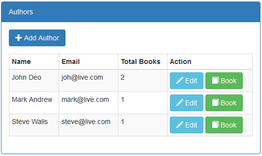
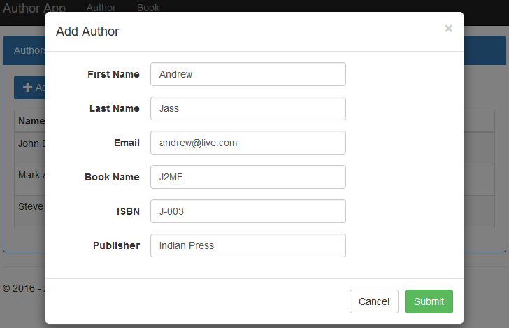
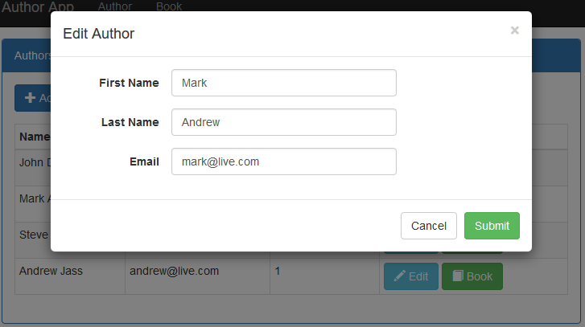
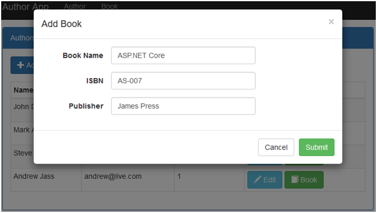
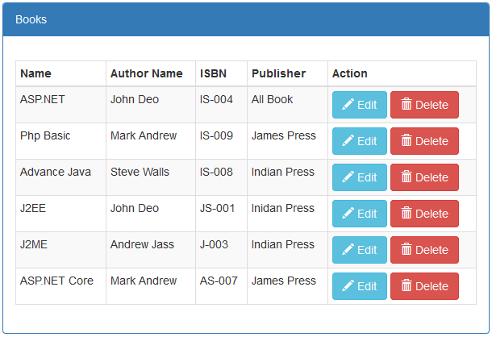
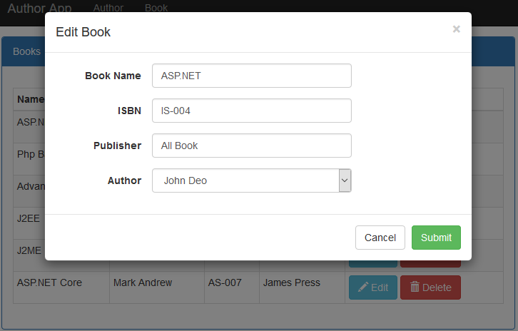
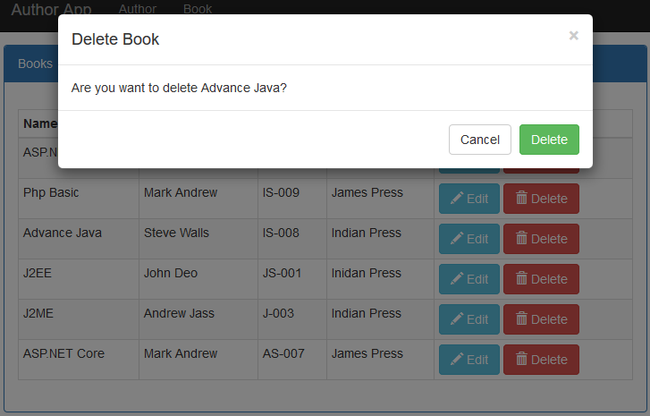

# Generic Repository Pattern in ASP.NET Core
## Requires
- Visual Studio 2015
## License
- MIT
## Technologies
- ASP.NET
- ASP.NET Core
- Entity Framework Core 1.0
## Topics
- Repository Pattern
- Entity Framework Code First
- ASP.NET Core
- ASP.NET Core MVC
## Updated
- 11/26/2016
## Description

<h1>Introduction</h1>

A Visual Studio 2015 project which shows how to perform the create, read, update and delete operations in the ASP.NET Core application using generic repository pattern with Entity Framework Core Code First approach.

The code illustrates the following topics:

<ol>
<li>Listings, create, update and delete operations. </li><li>One to many relationship in Entity Framework Core. </li><li>Create, Update and Delete operations perform in bootstrap modal pop up with tag helpers.
</li><li>Database design using entity framework core code first approach with fluent API.
</li><li>Entity classes and repository in separate class library project and use migration to create database from it.
</li><li>Populate dropdown list in ASP.NET Core with dynamic data. </li><li>Dependency injection for DbContext and repository. </li></ol>
<h1>Getting Started</h1>

To build and run this sample as-is, you must have Visual Studio 2015 installed. In most cases you can run the application by following these steps:

<ol>
<li>Download and extract the .zip file. </li><li>Open the solution file in Visual Studio. </li><li>Change connection string in the appsettings.json file. </li><li>Choose GR.Data project in package manager console and run the following command for migration and create database.
<ul>
<li>Tools &ndash;&gt; NuGet Package Manager &ndash;&gt; Package Manager Console </li><li>PM&gt; Add-Migration MyFirstMigration </li><li>PM&gt; Update-Database </li></ul>
</li><li>Run the application. </li></ol>
<h1>Running the Sample</h1>

To run the sample, hit F5 or choose the Debug | Start Debugging menu command. You will see the author list screen. From this screen you have author listing screen as shown in below figure.

Figure 1: Author listing

Now click on &ldquo;Add Author&rdquo; button to add new author in the application as per following screen.

Figure2: Add Author

As per figure 1, Edit button uses to edit individual author as per following figure.

Figure 3: Edit Author

As per figure 1, Book button uses to add new with respect an author as per following figure.

Figure 4: Add New Book

Now click on Book menu from the top and shows book listing screen as per following screen.

Figure 5: Book Listing

As per figure 5, Edit button uses to edit individual book as per following figure.

Figure 6: Edit Book

As per figure 5, Delete button uses to delete individual book as per following figure.

Figure 7: Delete Book

<h1>Source Code Overview</h1>

Most of folders play same role as in MVC application but there are following more folder and files.

<ol>
<li>wwwroot: It holds static js and css files. </li><li>GR.Data: It&rsquo;s separate class library project. It holds DbContext, Entities and repository to perform database operations.
</li><li>project.json: It holds database connection string. </li><li>Migrations: It holds database migration files. </li></ol>
