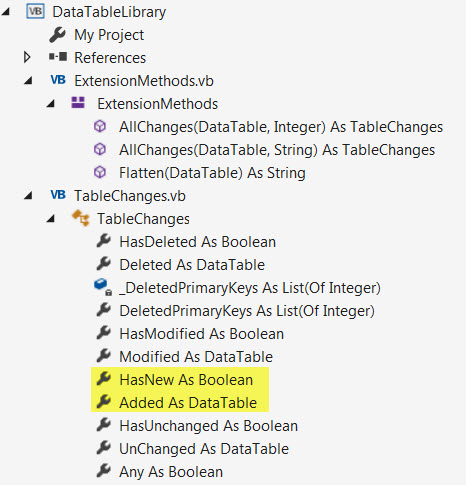
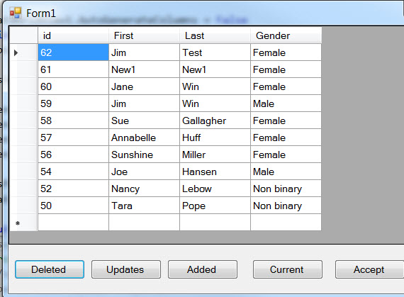

# Get changes for a DataTable (add, remove and edit) VB.NET
## Requires
- Visual Studio 2017
## License
- MIT
## Technologies
- SQL Server
- DataGridView
- DataTable
## Topics
- Data Access
- DataTable
- Databases
## Updated
- 09/27/2017
## Description

<h1>Description</h1>

This code sample shows how to get changes from a DataTable that may be hooked up to a DataGridView, DataGridView and also bound to controls such as TextBox, ComboBox etc.

What prompted this code sample was over the years answering questions on the Microsoft Social forums and other major forums new comers to working with data would ask &quot;how do I get changes to my DataTable which is bound to one
 or more controls&quot; or &quot;why I'm I getting concurrency exceptions?&quot;. This code sample does not show how to handle concurrency issues but instead the point on this topic is not understanding the &quot;why&quot; things happen. So instead the focus here is to provide a class
 project that encapsulates a DataTable language extension method (along with a few helper extensions) to when there are issues with changes in a DataTable you can add this library to your solution to see what is happening under the covers and once done remove
 the class project/library from the solution.

I also did this in C# <a href="https://code.msdn.microsoft.com/Get-changes-for-a-11413e32?redir=0">
found here</a>. Note that usually my C# examples are more robust yet this code sample in vb.net goes beyond the C# example.

In short using the image below taken from the code sample, in TableChanges class each action has a check and container. For example, if want to know if there are new row(s) check HasNew, if true then Added (a DataTable) will
 have the new rows, Deleted rows are a little more complex but I've made it easy.

In the code sample data is loaded into two DataTable objects and shown in a DataGridView via a BindingSource component.

&nbsp;

Visual Basic

Edit|Remove

vb

<pre class="vb">Public&nbsp;Class&nbsp;Form1&nbsp;
&nbsp;&nbsp;&nbsp;&nbsp;Private&nbsp;bsPeople&nbsp;As&nbsp;New&nbsp;BindingSource()&nbsp;
&nbsp;&nbsp;&nbsp;&nbsp;Private&nbsp;bsGender&nbsp;As&nbsp;New&nbsp;BindingSource()&nbsp;
&nbsp;&nbsp;&nbsp;&nbsp;Private&nbsp;Sub&nbsp;Form1_Load(sender&nbsp;As&nbsp;Object,&nbsp;e&nbsp;As&nbsp;EventArgs)&nbsp;Handles&nbsp;MyBase.Load&nbsp;
&nbsp;
&nbsp;&nbsp;&nbsp;&nbsp;&nbsp;&nbsp;&nbsp;&nbsp;dataGridView1.AutoGenerateColumns&nbsp;=&nbsp;False&nbsp;
&nbsp;&nbsp;&nbsp;&nbsp;&nbsp;&nbsp;&nbsp;&nbsp;Dim&nbsp;ops&nbsp;=&nbsp;New&nbsp;DataOperations()&nbsp;
&nbsp;&nbsp;&nbsp;&nbsp;&nbsp;&nbsp;&nbsp;&nbsp;ops.Read()&nbsp;
&nbsp;
&nbsp;&nbsp;&nbsp;&nbsp;&nbsp;&nbsp;&nbsp;&nbsp;bsGender.DataSource&nbsp;=&nbsp;ops.GenderTable&nbsp;
&nbsp;
&nbsp;&nbsp;&nbsp;&nbsp;&nbsp;&nbsp;&nbsp;&nbsp;GenderColumn.DisplayMember&nbsp;=&nbsp;&quot;Gender&quot;&nbsp;
&nbsp;&nbsp;&nbsp;&nbsp;&nbsp;&nbsp;&nbsp;&nbsp;GenderColumn.ValueMember&nbsp;=&nbsp;&quot;GenderIdentifier&quot;&nbsp;
&nbsp;&nbsp;&nbsp;&nbsp;&nbsp;&nbsp;&nbsp;&nbsp;GenderColumn.DataSource&nbsp;=&nbsp;bsGender&nbsp;
&nbsp;&nbsp;&nbsp;&nbsp;&nbsp;&nbsp;&nbsp;&nbsp;GenderColumn.DisplayStyle&nbsp;=&nbsp;DataGridViewComboBoxDisplayStyle.Nothing&nbsp;
&nbsp;
&nbsp;&nbsp;&nbsp;&nbsp;&nbsp;&nbsp;&nbsp;&nbsp;bsPeople.DataSource&nbsp;=&nbsp;ops.PersonsTable&nbsp;
&nbsp;&nbsp;&nbsp;&nbsp;&nbsp;&nbsp;&nbsp;&nbsp;dataGridView1.DataSource&nbsp;=&nbsp;bsPeople&nbsp;
&nbsp;
&nbsp;&nbsp;&nbsp;&nbsp;End&nbsp;Sub</pre>

So when we need access to the DataTable we cast the DataSource of the BindingSource to a DataTable (which is what TableChanges languag extensions work with).

&nbsp;

Visual Basic

Edit|Remove

vb

<pre class="js">Dim&nbsp;originalTable&nbsp;As&nbsp;DataTable&nbsp;=&nbsp;CType(bsPeople.DataSource,&nbsp;DataTable)&nbsp;
Dim&nbsp;results&nbsp;As&nbsp;TableChanges&nbsp;=&nbsp;originalTable.AllChanges(&quot;id&quot;)</pre>

AllChanges is in Extensions.vb (a code module for language extensions), it requires the primary key name for the table.

The following ask if we have any added rows

&nbsp;

Visual Basic

Edit|Remove

vb

<pre class="js">If&nbsp;results.HasModified&nbsp;Then</pre>

What you do with this is up to you. In the attached solution we will update the back end database as this is really the intent of this code but you could simply view changes and we can do that too in
 the demo project.

Without these extensions you can replicate what I've done but what I have seen out there is not reusable or done wrong.

The most challenging was adding new rows to the DataGridView and update the original new records (not as easy as one would think unless you come from a multi-user environment).&nbsp; After a little
 thought believed an <a href="https://docs.microsoft.com/en-us/dotnet/visual-basic/programming-guide/concepts/iterators">
Iterator</a> would fit the job.

Visual Basic

Edit|Remove

vb

<pre class="js">Public&nbsp;Iterator&nbsp;Function&nbsp;Add(ByVal&nbsp;pTable&nbsp;As&nbsp;DataTable)&nbsp;As&nbsp;IEnumerable(Of&nbsp;NewRecord)&nbsp;
&nbsp;&nbsp;&nbsp;&nbsp;Dim&nbsp;NewIdentifier&nbsp;As&nbsp;Integer&nbsp;=&nbsp;0&nbsp;
&nbsp;
&nbsp;&nbsp;&nbsp;&nbsp;Using&nbsp;cn&nbsp;As&nbsp;SqlConnection&nbsp;=&nbsp;New&nbsp;SqlConnection&nbsp;With&nbsp;{.ConnectionString&nbsp;=&nbsp;ConnectionString}&nbsp;
&nbsp;&nbsp;&nbsp;&nbsp;&nbsp;&nbsp;&nbsp;&nbsp;Using&nbsp;cmd&nbsp;As&nbsp;SqlCommand&nbsp;=&nbsp;New&nbsp;SqlCommand&nbsp;With&nbsp;{.Connection&nbsp;=&nbsp;cn}&nbsp;
&nbsp;
&nbsp;&nbsp;&nbsp;&nbsp;&nbsp;&nbsp;&nbsp;&nbsp;&nbsp;&nbsp;&nbsp;&nbsp;cmd.CommandText&nbsp;=&nbsp;
&nbsp;&nbsp;&nbsp;&nbsp;&nbsp;&nbsp;&nbsp;&nbsp;&nbsp;&nbsp;&nbsp;&nbsp;&nbsp;&nbsp;&nbsp;&nbsp;&lt;SQL&gt;&nbsp;
&nbsp;&nbsp;&nbsp;&nbsp;&nbsp;&nbsp;&nbsp;&nbsp;&nbsp;&nbsp;&nbsp;&nbsp;&nbsp;&nbsp;&nbsp;&nbsp;&nbsp;&nbsp;&nbsp;&nbsp;INSERT&nbsp;INTO&nbsp;dbo.Persons1&nbsp;&nbsp;
&nbsp;&nbsp;&nbsp;&nbsp;&nbsp;&nbsp;&nbsp;&nbsp;&nbsp;&nbsp;&nbsp;&nbsp;&nbsp;&nbsp;&nbsp;&nbsp;&nbsp;&nbsp;&nbsp;&nbsp;(&nbsp;
&nbsp;&nbsp;&nbsp;&nbsp;&nbsp;&nbsp;&nbsp;&nbsp;&nbsp;&nbsp;&nbsp;&nbsp;&nbsp;&nbsp;&nbsp;&nbsp;&nbsp;&nbsp;&nbsp;&nbsp;&nbsp;&nbsp;&nbsp;&nbsp;FirstName,&nbsp;
&nbsp;&nbsp;&nbsp;&nbsp;&nbsp;&nbsp;&nbsp;&nbsp;&nbsp;&nbsp;&nbsp;&nbsp;&nbsp;&nbsp;&nbsp;&nbsp;&nbsp;&nbsp;&nbsp;&nbsp;&nbsp;&nbsp;&nbsp;&nbsp;LastName,&nbsp;
&nbsp;&nbsp;&nbsp;&nbsp;&nbsp;&nbsp;&nbsp;&nbsp;&nbsp;&nbsp;&nbsp;&nbsp;&nbsp;&nbsp;&nbsp;&nbsp;&nbsp;&nbsp;&nbsp;&nbsp;&nbsp;&nbsp;&nbsp;&nbsp;GenderIdentifier,&nbsp;
&nbsp;&nbsp;&nbsp;&nbsp;&nbsp;&nbsp;&nbsp;&nbsp;&nbsp;&nbsp;&nbsp;&nbsp;&nbsp;&nbsp;&nbsp;&nbsp;&nbsp;&nbsp;&nbsp;&nbsp;&nbsp;&nbsp;&nbsp;&nbsp;IsDeleted&nbsp;
&nbsp;&nbsp;&nbsp;&nbsp;&nbsp;&nbsp;&nbsp;&nbsp;&nbsp;&nbsp;&nbsp;&nbsp;&nbsp;&nbsp;&nbsp;&nbsp;&nbsp;&nbsp;&nbsp;&nbsp;)&nbsp;&nbsp;&nbsp;
&nbsp;&nbsp;&nbsp;&nbsp;&nbsp;&nbsp;&nbsp;&nbsp;&nbsp;&nbsp;&nbsp;&nbsp;&nbsp;&nbsp;&nbsp;&nbsp;&nbsp;&nbsp;&nbsp;&nbsp;VALUES&nbsp;&nbsp;
&nbsp;&nbsp;&nbsp;&nbsp;&nbsp;&nbsp;&nbsp;&nbsp;&nbsp;&nbsp;&nbsp;&nbsp;&nbsp;&nbsp;&nbsp;&nbsp;&nbsp;&nbsp;&nbsp;&nbsp;(&nbsp;
&nbsp;&nbsp;&nbsp;&nbsp;&nbsp;&nbsp;&nbsp;&nbsp;&nbsp;&nbsp;&nbsp;&nbsp;&nbsp;&nbsp;&nbsp;&nbsp;&nbsp;&nbsp;&nbsp;&nbsp;&nbsp;&nbsp;&nbsp;&nbsp;@FirstName,&nbsp;
&nbsp;&nbsp;&nbsp;&nbsp;&nbsp;&nbsp;&nbsp;&nbsp;&nbsp;&nbsp;&nbsp;&nbsp;&nbsp;&nbsp;&nbsp;&nbsp;&nbsp;&nbsp;&nbsp;&nbsp;&nbsp;&nbsp;&nbsp;&nbsp;@LastName,&nbsp;
&nbsp;&nbsp;&nbsp;&nbsp;&nbsp;&nbsp;&nbsp;&nbsp;&nbsp;&nbsp;&nbsp;&nbsp;&nbsp;&nbsp;&nbsp;&nbsp;&nbsp;&nbsp;&nbsp;&nbsp;&nbsp;&nbsp;&nbsp;&nbsp;@GenderIdentifier,0&nbsp;
&nbsp;&nbsp;&nbsp;&nbsp;&nbsp;&nbsp;&nbsp;&nbsp;&nbsp;&nbsp;&nbsp;&nbsp;&nbsp;&nbsp;&nbsp;&nbsp;&nbsp;&nbsp;&nbsp;&nbsp;);&nbsp;
&nbsp;&nbsp;&nbsp;&nbsp;&nbsp;&nbsp;&nbsp;&nbsp;&nbsp;&nbsp;&nbsp;&nbsp;&nbsp;&nbsp;&nbsp;&nbsp;&nbsp;&nbsp;&nbsp;&nbsp;SELECT&nbsp;CAST(scope_identity()&nbsp;AS&nbsp;int);&nbsp;
&nbsp;&nbsp;&nbsp;&nbsp;&nbsp;&nbsp;&nbsp;&nbsp;&nbsp;&nbsp;&nbsp;&nbsp;&nbsp;&nbsp;&nbsp;&nbsp;&lt;/SQL&gt;.Value&nbsp;
&nbsp;
&nbsp;
&nbsp;&nbsp;&nbsp;&nbsp;&nbsp;&nbsp;&nbsp;&nbsp;&nbsp;&nbsp;&nbsp;&nbsp;cmd.Parameters.Add(New&nbsp;SqlParameter&nbsp;With&nbsp;{.ParameterName&nbsp;=&nbsp;&quot;@FirstName&quot;,&nbsp;.DbType&nbsp;=&nbsp;DbType.String})&nbsp;
&nbsp;&nbsp;&nbsp;&nbsp;&nbsp;&nbsp;&nbsp;&nbsp;&nbsp;&nbsp;&nbsp;&nbsp;cmd.Parameters.Add(New&nbsp;SqlParameter&nbsp;With&nbsp;{.ParameterName&nbsp;=&nbsp;&quot;@LastName&quot;,&nbsp;.DbType&nbsp;=&nbsp;DbType.String})&nbsp;
&nbsp;&nbsp;&nbsp;&nbsp;&nbsp;&nbsp;&nbsp;&nbsp;&nbsp;&nbsp;&nbsp;&nbsp;cmd.Parameters.Add(New&nbsp;SqlParameter&nbsp;With&nbsp;{.ParameterName&nbsp;=&nbsp;&quot;@GenderIdentifier&quot;,&nbsp;.DbType&nbsp;=&nbsp;DbType.Int32})&nbsp;
&nbsp;
&nbsp;&nbsp;&nbsp;&nbsp;&nbsp;&nbsp;&nbsp;&nbsp;&nbsp;&nbsp;&nbsp;&nbsp;cn.Open()&nbsp;
&nbsp;
&nbsp;&nbsp;&nbsp;&nbsp;&nbsp;&nbsp;&nbsp;&nbsp;&nbsp;&nbsp;&nbsp;&nbsp;For&nbsp;Each&nbsp;row&nbsp;As&nbsp;DataRow&nbsp;In&nbsp;pTable.Rows&nbsp;
&nbsp;
&nbsp;&nbsp;&nbsp;&nbsp;&nbsp;&nbsp;&nbsp;&nbsp;&nbsp;&nbsp;&nbsp;&nbsp;&nbsp;&nbsp;&nbsp;&nbsp;cmd.Parameters(&quot;@FirstName&quot;).Value&nbsp;=&nbsp;row.Field(Of&nbsp;String)(&quot;FirstName&quot;)&nbsp;
&nbsp;&nbsp;&nbsp;&nbsp;&nbsp;&nbsp;&nbsp;&nbsp;&nbsp;&nbsp;&nbsp;&nbsp;&nbsp;&nbsp;&nbsp;&nbsp;cmd.Parameters(&quot;@LastName&quot;).Value&nbsp;=&nbsp;row.Field(Of&nbsp;String)(&quot;LastName&quot;)&nbsp;
&nbsp;&nbsp;&nbsp;&nbsp;&nbsp;&nbsp;&nbsp;&nbsp;&nbsp;&nbsp;&nbsp;&nbsp;&nbsp;&nbsp;&nbsp;&nbsp;cmd.Parameters(&quot;@GenderIdentifier&quot;).Value&nbsp;=&nbsp;row.Field(Of&nbsp;Integer)(&quot;GenderIdentifier&quot;)&nbsp;
&nbsp;
&nbsp;&nbsp;&nbsp;&nbsp;&nbsp;&nbsp;&nbsp;&nbsp;&nbsp;&nbsp;&nbsp;&nbsp;&nbsp;&nbsp;&nbsp;&nbsp;NewIdentifier&nbsp;=&nbsp;Convert.ToInt32(cmd.ExecuteScalar())&nbsp;
&nbsp;&nbsp;&nbsp;&nbsp;&nbsp;&nbsp;&nbsp;&nbsp;&nbsp;&nbsp;&nbsp;&nbsp;&nbsp;&nbsp;&nbsp;&nbsp;Yield&nbsp;New&nbsp;NewRecord&nbsp;With&nbsp;
&nbsp;&nbsp;&nbsp;&nbsp;&nbsp;&nbsp;&nbsp;&nbsp;&nbsp;&nbsp;&nbsp;&nbsp;&nbsp;&nbsp;&nbsp;&nbsp;&nbsp;&nbsp;&nbsp;&nbsp;{&nbsp;
&nbsp;&nbsp;&nbsp;&nbsp;&nbsp;&nbsp;&nbsp;&nbsp;&nbsp;&nbsp;&nbsp;&nbsp;&nbsp;&nbsp;&nbsp;&nbsp;&nbsp;&nbsp;&nbsp;&nbsp;&nbsp;&nbsp;&nbsp;&nbsp;.IncomingIdentifier&nbsp;=&nbsp;row.Field(Of&nbsp;Integer)(&quot;Id&quot;),&nbsp;.OutGoingIdentifier&nbsp;=&nbsp;NewIdentifier&nbsp;
&nbsp;&nbsp;&nbsp;&nbsp;&nbsp;&nbsp;&nbsp;&nbsp;&nbsp;&nbsp;&nbsp;&nbsp;&nbsp;&nbsp;&nbsp;&nbsp;&nbsp;&nbsp;&nbsp;&nbsp;}&nbsp;
&nbsp;
&nbsp;&nbsp;&nbsp;&nbsp;&nbsp;&nbsp;&nbsp;&nbsp;&nbsp;&nbsp;&nbsp;&nbsp;Next&nbsp;
&nbsp;&nbsp;&nbsp;&nbsp;&nbsp;&nbsp;&nbsp;&nbsp;End&nbsp;Using&nbsp;
&nbsp;&nbsp;&nbsp;&nbsp;End&nbsp;Using&nbsp;
&nbsp;
End&nbsp;Function</pre>

&nbsp;Please read&nbsp; the comments in the Add method as they describe the reasoning for using an iterator and would suggest using this also even in a single user environment.

&nbsp;

More Information

<strong>Before running the sample make sure to run the script for creating the database and populating it with data.</strong>

