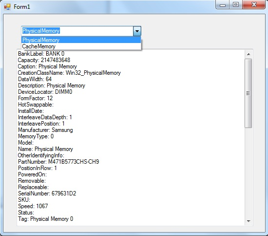

# Get memory information of local system using WMI in vb.net
## Requires
- Visual Studio 2008
## License
- Apache License, Version 2.0
## Technologies
- WMI
- VB.Net
## Topics
- VB.Net
- Windows Management Interface (WMI)
## Updated
- 01/05/2013
## Description

<h1>Introduction</h1>

<em>We can retrieve the hardware inforamtion of the local system by using WMI (Windows Management Instrumentation&nbsp;) in vb.net. This samle project demonstrate how you can retrieve the physical memeory and cache memory information by using
 WMI and &nbsp;ManagementObjectSearcher class in vb.net.</em>

<em>Windows Management Instrumentation (WMI) is the infrastructure for management data and operations on Windows-based operating systems.</em>

<em> 
</em>

&nbsp;

<em> 
</em>

Description

&nbsp;Before using the ManagementObjectSearcher object you need to add Reference System.Management.dll to your project and import <a class="libraryLink" href="http://msdn.microsoft.com/en-US/library/system.Management.aspx" target="_blank" title="Auto generated link to system.Management">system.Management</a> namespace.

&nbsp;

The sample project contains a Windows form with a combobox and Textbox control. textbox control will show the information according to combobox selection.

The following code snippet is for retrieving the physical memory information from WMI:&nbsp;

Visual Basic

Edit|Remove

vb

<pre class="js">&nbsp;Private&nbsp;Sub&nbsp;SetPhysicalMemoryinfo()&nbsp;
&nbsp;&nbsp;&nbsp;&nbsp;&nbsp;&nbsp;&nbsp;&nbsp;Dim&nbsp;searcher&nbsp;As&nbsp;New&nbsp;ManagementObjectSearcher(&nbsp;_&nbsp;
&nbsp;&nbsp;&nbsp;&nbsp;&nbsp;&nbsp;&nbsp;&nbsp;&nbsp;&nbsp;&nbsp;&nbsp;&nbsp;&nbsp;&nbsp;&nbsp;&nbsp;&nbsp;&quot;root\CIMV2&quot;,&nbsp;_&nbsp;
&nbsp;&nbsp;&nbsp;&nbsp;&nbsp;&nbsp;&nbsp;&nbsp;&nbsp;&nbsp;&nbsp;&nbsp;&nbsp;&nbsp;&nbsp;&nbsp;&nbsp;&nbsp;&quot;SELECT&nbsp;*&nbsp;FROM&nbsp;Win32_PhysicalMemory&quot;)&nbsp;
&nbsp;&nbsp;&nbsp;&nbsp;&nbsp;&nbsp;&nbsp;&nbsp;Dim&nbsp;index&nbsp;As&nbsp;Integer&nbsp;=&nbsp;0&nbsp;
&nbsp;&nbsp;&nbsp;&nbsp;&nbsp;&nbsp;&nbsp;&nbsp;Dim&nbsp;str&nbsp;As&nbsp;New&nbsp;StringBuilder&nbsp;
&nbsp;
&nbsp;&nbsp;&nbsp;&nbsp;&nbsp;&nbsp;&nbsp;&nbsp;For&nbsp;Each&nbsp;queryObj&nbsp;As&nbsp;ManagementObject&nbsp;In&nbsp;searcher.Get()&nbsp;
&nbsp;&nbsp;&nbsp;&nbsp;&nbsp;&nbsp;&nbsp;&nbsp;&nbsp;&nbsp;&nbsp;&nbsp;On&nbsp;Error&nbsp;Resume&nbsp;Next&nbsp;
&nbsp;&nbsp;&nbsp;&nbsp;&nbsp;&nbsp;&nbsp;&nbsp;&nbsp;
&nbsp;&nbsp;&nbsp;&nbsp;&nbsp;&nbsp;&nbsp;&nbsp;&nbsp;&nbsp;&nbsp;&nbsp;str.Append(&quot;BankLabel:&nbsp;&quot;&nbsp;&amp;&nbsp;queryObj(&quot;BankLabel&quot;)&nbsp;&amp;&nbsp;vbCrLf)&nbsp;
&nbsp;&nbsp;&nbsp;&nbsp;&nbsp;&nbsp;&nbsp;&nbsp;&nbsp;&nbsp;&nbsp;&nbsp;str.Append(&quot;Capacity:&nbsp;&quot;&nbsp;&amp;&nbsp;queryObj(&quot;Capacity&quot;)&nbsp;&amp;&nbsp;vbCrLf)&nbsp;
&nbsp;&nbsp;&nbsp;&nbsp;&nbsp;&nbsp;&nbsp;&nbsp;&nbsp;&nbsp;&nbsp;&nbsp;str.Append(&quot;Caption:&nbsp;&quot;&nbsp;&amp;&nbsp;queryObj(&quot;Caption&quot;)&nbsp;&amp;&nbsp;vbCrLf)&nbsp;
&nbsp;&nbsp;&nbsp;&nbsp;&nbsp;&nbsp;&nbsp;&nbsp;&nbsp;&nbsp;&nbsp;&nbsp;str.Append(&quot;CreationClassName:&nbsp;&quot;&nbsp;&amp;&nbsp;queryObj(&quot;CreationClassName&quot;)&nbsp;&amp;&nbsp;vbCrLf)&nbsp;
&nbsp;&nbsp;&nbsp;&nbsp;&nbsp;&nbsp;&nbsp;&nbsp;&nbsp;&nbsp;&nbsp;&nbsp;str.Append(&quot;DataWidth:&nbsp;&quot;&nbsp;&amp;&nbsp;queryObj(&quot;DataWidth&quot;)&nbsp;&amp;&nbsp;vbCrLf)&nbsp;
&nbsp;&nbsp;&nbsp;&nbsp;&nbsp;&nbsp;&nbsp;&nbsp;&nbsp;&nbsp;&nbsp;&nbsp;str.Append(&quot;Description:&nbsp;&quot;&nbsp;&amp;&nbsp;queryObj(&quot;Description&quot;)&nbsp;&amp;&nbsp;vbCrLf)&nbsp;
&nbsp;&nbsp;&nbsp;&nbsp;&nbsp;&nbsp;&nbsp;&nbsp;&nbsp;&nbsp;&nbsp;&nbsp;str.Append(&quot;DeviceLocator:&nbsp;&quot;&nbsp;&amp;&nbsp;queryObj(&quot;DeviceLocator&quot;)&nbsp;&amp;&nbsp;vbCrLf)&nbsp;
&nbsp;&nbsp;&nbsp;&nbsp;&nbsp;&nbsp;&nbsp;&nbsp;&nbsp;&nbsp;&nbsp;&nbsp;str.Append(&quot;FormFactor:&nbsp;&quot;&nbsp;&amp;&nbsp;queryObj(&quot;FormFactor&quot;)&nbsp;&amp;&nbsp;vbCrLf)&nbsp;
&nbsp;&nbsp;&nbsp;&nbsp;&nbsp;&nbsp;&nbsp;&nbsp;&nbsp;&nbsp;&nbsp;&nbsp;str.Append(&quot;HotSwappable:&nbsp;&quot;&nbsp;&amp;&nbsp;queryObj(&quot;HotSwappable&quot;)&nbsp;&amp;&nbsp;vbCrLf)&nbsp;
&nbsp;&nbsp;&nbsp;&nbsp;&nbsp;&nbsp;&nbsp;&nbsp;&nbsp;&nbsp;&nbsp;&nbsp;str.Append(&quot;InstallDate:&nbsp;&quot;&nbsp;&amp;&nbsp;queryObj(&quot;InstallDate&quot;)&nbsp;&amp;&nbsp;vbCrLf)&nbsp;
&nbsp;&nbsp;&nbsp;&nbsp;&nbsp;&nbsp;&nbsp;&nbsp;&nbsp;&nbsp;&nbsp;&nbsp;str.Append(&quot;InterleaveDataDepth:&nbsp;&quot;&nbsp;&amp;&nbsp;queryObj(&quot;InterleaveDataDepth&quot;)&nbsp;&amp;&nbsp;vbCrLf)&nbsp;
&nbsp;&nbsp;&nbsp;&nbsp;&nbsp;&nbsp;&nbsp;&nbsp;&nbsp;&nbsp;&nbsp;&nbsp;str.Append(&quot;InterleavePosition:&nbsp;&quot;&nbsp;&amp;&nbsp;queryObj(&quot;InterleavePosition&quot;)&nbsp;&amp;&nbsp;vbCrLf)&nbsp;
&nbsp;&nbsp;&nbsp;&nbsp;&nbsp;&nbsp;&nbsp;&nbsp;&nbsp;&nbsp;&nbsp;&nbsp;str.Append(&quot;Manufacturer:&nbsp;&quot;&nbsp;&amp;&nbsp;queryObj(&quot;Manufacturer&quot;)&nbsp;&amp;&nbsp;vbCrLf)&nbsp;
&nbsp;&nbsp;&nbsp;&nbsp;&nbsp;&nbsp;&nbsp;&nbsp;&nbsp;&nbsp;&nbsp;&nbsp;str.Append(&quot;MemoryType:&nbsp;&quot;&nbsp;&amp;&nbsp;queryObj(&quot;MemoryType&quot;)&nbsp;&amp;&nbsp;vbCrLf)&nbsp;
&nbsp;&nbsp;&nbsp;&nbsp;&nbsp;&nbsp;&nbsp;&nbsp;&nbsp;&nbsp;&nbsp;&nbsp;str.Append(&quot;Model:&nbsp;&quot;&nbsp;&amp;&nbsp;queryObj(&quot;Model&quot;)&nbsp;&amp;&nbsp;vbCrLf)&nbsp;
&nbsp;&nbsp;&nbsp;&nbsp;&nbsp;&nbsp;&nbsp;&nbsp;&nbsp;&nbsp;&nbsp;&nbsp;str.Append(&quot;Name:&nbsp;&quot;&nbsp;&amp;&nbsp;queryObj(&quot;Name&quot;)&nbsp;&amp;&nbsp;vbCrLf)&nbsp;
&nbsp;&nbsp;&nbsp;&nbsp;&nbsp;&nbsp;&nbsp;&nbsp;&nbsp;&nbsp;&nbsp;&nbsp;str.Append(&quot;OtherIdentifyingInfo:&nbsp;&quot;&nbsp;&amp;&nbsp;queryObj(&quot;OtherIdentifyingInfo&quot;)&nbsp;&amp;&nbsp;vbCrLf)&nbsp;
&nbsp;&nbsp;&nbsp;&nbsp;&nbsp;&nbsp;&nbsp;&nbsp;&nbsp;&nbsp;&nbsp;&nbsp;str.Append(&quot;PartNumber:&nbsp;&quot;&nbsp;&amp;&nbsp;queryObj(&quot;PartNumber&quot;)&nbsp;&amp;&nbsp;vbCrLf)&nbsp;
&nbsp;&nbsp;&nbsp;&nbsp;&nbsp;&nbsp;&nbsp;&nbsp;&nbsp;&nbsp;&nbsp;&nbsp;str.Append(&quot;PositionInRow:&nbsp;&quot;&nbsp;&amp;&nbsp;queryObj(&quot;PositionInRow&quot;)&nbsp;&amp;&nbsp;vbCrLf)&nbsp;
&nbsp;&nbsp;&nbsp;&nbsp;&nbsp;&nbsp;&nbsp;&nbsp;&nbsp;&nbsp;&nbsp;&nbsp;str.Append(&quot;PoweredOn:&nbsp;&quot;&nbsp;&amp;&nbsp;queryObj(&quot;PoweredOn&quot;)&nbsp;&amp;&nbsp;vbCrLf)&nbsp;
&nbsp;&nbsp;&nbsp;&nbsp;&nbsp;&nbsp;&nbsp;&nbsp;&nbsp;&nbsp;&nbsp;&nbsp;str.Append(&quot;Removable:&nbsp;&quot;&nbsp;&amp;&nbsp;queryObj(&quot;Removable&quot;)&nbsp;&amp;&nbsp;vbCrLf)&nbsp;
&nbsp;&nbsp;&nbsp;&nbsp;&nbsp;&nbsp;&nbsp;&nbsp;&nbsp;&nbsp;&nbsp;&nbsp;str.Append(&quot;Replaceable:&nbsp;&quot;&nbsp;&amp;&nbsp;queryObj(&quot;Replaceable&quot;)&nbsp;&amp;&nbsp;vbCrLf)&nbsp;
&nbsp;&nbsp;&nbsp;&nbsp;&nbsp;&nbsp;&nbsp;&nbsp;&nbsp;&nbsp;&nbsp;&nbsp;str.Append(&quot;SerialNumber:&nbsp;&quot;&nbsp;&amp;&nbsp;queryObj(&quot;SerialNumber&quot;)&nbsp;&amp;&nbsp;vbCrLf)&nbsp;
&nbsp;&nbsp;&nbsp;&nbsp;&nbsp;&nbsp;&nbsp;&nbsp;&nbsp;&nbsp;&nbsp;&nbsp;str.Append(&quot;SKU:&nbsp;&quot;&nbsp;&amp;&nbsp;queryObj(&quot;SKU&quot;)&nbsp;&amp;&nbsp;vbCrLf)&nbsp;
&nbsp;&nbsp;&nbsp;&nbsp;&nbsp;&nbsp;&nbsp;&nbsp;&nbsp;&nbsp;&nbsp;&nbsp;str.Append(&quot;Speed:&nbsp;&quot;&nbsp;&amp;&nbsp;queryObj(&quot;Speed&quot;)&nbsp;&amp;&nbsp;vbCrLf)&nbsp;
&nbsp;&nbsp;&nbsp;&nbsp;&nbsp;&nbsp;&nbsp;&nbsp;&nbsp;&nbsp;&nbsp;&nbsp;str.Append(&quot;Status:&nbsp;&quot;&nbsp;&amp;&nbsp;queryObj(&quot;Status&quot;)&nbsp;&amp;&nbsp;vbCrLf)&nbsp;
&nbsp;&nbsp;&nbsp;&nbsp;&nbsp;&nbsp;&nbsp;&nbsp;&nbsp;&nbsp;&nbsp;&nbsp;str.Append(&quot;Tag:&nbsp;&quot;&nbsp;&amp;&nbsp;queryObj(&quot;Tag&quot;)&nbsp;&amp;&nbsp;vbCrLf)&nbsp;
&nbsp;&nbsp;&nbsp;&nbsp;&nbsp;&nbsp;&nbsp;&nbsp;&nbsp;&nbsp;&nbsp;&nbsp;str.Append(&quot;TotalWidth:&nbsp;&quot;&nbsp;&amp;&nbsp;queryObj(&quot;TotalWidth&quot;)&nbsp;&amp;&nbsp;vbCrLf)&nbsp;
&nbsp;&nbsp;&nbsp;&nbsp;&nbsp;&nbsp;&nbsp;&nbsp;&nbsp;&nbsp;&nbsp;&nbsp;str.Append(&quot;TypeDetail:&nbsp;&quot;&nbsp;&amp;&nbsp;queryObj(&quot;TypeDetail&quot;)&nbsp;&amp;&nbsp;vbCrLf)&nbsp;
&nbsp;&nbsp;&nbsp;&nbsp;&nbsp;&nbsp;&nbsp;&nbsp;&nbsp;&nbsp;&nbsp;&nbsp;str.Append(&quot;Version:&nbsp;&quot;&nbsp;&amp;&nbsp;queryObj(&quot;Version&quot;)&nbsp;&amp;&nbsp;vbCrLf)&nbsp;
&nbsp;&nbsp;&nbsp;&nbsp;&nbsp;&nbsp;&nbsp;&nbsp;&nbsp;&nbsp;&nbsp;&nbsp;str.Append(&quot;------------------------------------&quot;)&nbsp;
&nbsp;
&nbsp;&nbsp;&nbsp;&nbsp;&nbsp;&nbsp;&nbsp;&nbsp;Next&nbsp;
&nbsp;&nbsp;&nbsp;&nbsp;&nbsp;&nbsp;&nbsp;&nbsp;TextBox1.Text&nbsp;=&nbsp;str.ToString()&nbsp;
&nbsp;&nbsp;&nbsp;&nbsp;End&nbsp;Sub</pre>

&nbsp;

<ul>
</ul>
<h1>More Information</h1>

We can use the WMI code creator tool to generate&nbsp;VBScript, C#, and VB .NET code that uses WMI to complete a management task such as querying for management data.

You can download from&nbsp;http://www.microsoft.com/en-us/download/details.aspx?id=8572

&nbsp;

For more information on WMI :&nbsp;http://msdn.microsoft.com/en-us/library/aa394582(v=vs.85).aspx

