# Getting Started With ASP.NET Core 2.0 Identity And Role Management
## Requires
- Visual Studio 2017
## License
- MIT
## Technologies
- ASP.NET Identity
- ASP.NET Core
## Topics
- ASP.NET Identity
- ASP.NET Core
- ASP.NET Core 2.0
## Updated
- 03/21/2018
## Description

<h1>Introduction</h1>

In this article, we will see in detail how to use ASP.NET Core Identity in MVC Application for creating user roles and displaying the menu depending on user roles.

Here, we will see how to:

<ul>
<li>Create default admin users </li><li>Create default admin role </li><li>Redirect unauthenticated users to a login page </li><li>Display Admin Page menu only for Authorized Admin User </li></ul>

ASP.NET Identity allows us to add login functionality to our system. Here, in this demo, we will be using SQL Server to store the user details and profile data. We will use ASP.NET Identity for new user registration, login, and to maintain the user profile
 data. If we talk about the login, the important part is whether the logged in user is authenticated and also authorized to view the pages.

<h1><strong>Authentication and Authorization</strong></h1>
<h2><strong>Authentication</strong></h2>

Check for the Valid User. Here, the question is how to check whether a user is valid or not. When a user comes to a website for the first time, he/she will register for that website. All their information, like username, password, email, and so on will be
 stored in the website database. When a user enters his/her userID and password, the information will be checked with the database. If the user has entered the same userID and Password as in the database, then he or she is a valid user and will be redirected
 to the website's home page. If the user entered UserID or Password that does not match the database, then the login page will give a message, something like &ldquo;Enter valid Username or Password&rdquo;. The entire process of checking whether the user is
 valid or not for accessing the website is called Authentication.&nbsp;

<h2>Authorization</h2>

Once the user is authenticated, they need to be redirected to the appropriate page by his/her role. For example, when an Admin is logged in, then need to be redirected to the Admin Page. If an Accountant is logged in, then he/she needs to be redirected to
 his Accounts page.

<h1>Building the Sample</h1>
<h1><em><strong>Prerequisites</strong></em></h1>

Make sure you have installed all the prerequisites in your computer. If not, then download and install them all, one by one.

<ol>
<li>First, download and install Visual Studio 2017 from this&nbsp;<a href="https://www.visualstudio.com/" target="_blank">link</a>
</li><li>SQL Server 2014 or above </li></ol>

Description

<h1>Step 1: Create a Database</h1>

Firstly, we will create a database and set the connection string in appsettings.json file for DefaultConnection with our new database connection. We will be using this database for ASP.NET Core Identity table creation. 
Create Database: Run the following script to create our database.&nbsp;

&nbsp;

SQL

Edit|Remove

mysql

<pre class="js">USE&nbsp;MASTER&nbsp;&nbsp;&nbsp;&nbsp;&nbsp;&nbsp;&nbsp;&nbsp;
GO&nbsp;&nbsp;&nbsp;&nbsp;&nbsp;&nbsp;&nbsp;&nbsp;
&nbsp;&nbsp;&nbsp;&nbsp;&nbsp;&nbsp;&nbsp;&nbsp;
--&nbsp;1)&nbsp;Check&nbsp;for&nbsp;the&nbsp;Database&nbsp;Exists&nbsp;.If&nbsp;the&nbsp;database&nbsp;is&nbsp;exist&nbsp;then&nbsp;drop&nbsp;and&nbsp;create&nbsp;new&nbsp;DB&nbsp;&nbsp;&nbsp;&nbsp;&nbsp;&nbsp;&nbsp;&nbsp;
IF&nbsp;EXISTS&nbsp;(SELECT&nbsp;[name]&nbsp;FROM&nbsp;sys.databases&nbsp;WHERE&nbsp;[name]&nbsp;=&nbsp;'InventoryDB'&nbsp;)&nbsp;&nbsp;&nbsp;&nbsp;&nbsp;&nbsp;&nbsp;&nbsp;
DROP&nbsp;DATABASE&nbsp;InventoryDB&nbsp;&nbsp;&nbsp;&nbsp;&nbsp;&nbsp;&nbsp;&nbsp;
GO&nbsp;&nbsp;&nbsp;&nbsp;&nbsp;&nbsp;&nbsp;&nbsp;
&nbsp;&nbsp;&nbsp;&nbsp;&nbsp;&nbsp;&nbsp;&nbsp;
CREATE&nbsp;DATABASE&nbsp;InventoryDB&nbsp;&nbsp;&nbsp;&nbsp;&nbsp;&nbsp;&nbsp;&nbsp;
GO&nbsp;&nbsp;&nbsp;&nbsp;&nbsp;&nbsp;&nbsp;&nbsp;
&nbsp;&nbsp;&nbsp;&nbsp;&nbsp;&nbsp;&nbsp;&nbsp;
USE&nbsp;InventoryDB&nbsp;&nbsp;&nbsp;&nbsp;&nbsp;&nbsp;&nbsp;&nbsp;
GO&nbsp;</pre>

&nbsp;

After running the DB Script, we can see that the Database has been created and tables have not yet been created.

<h1>Step 2: Create your ASP.NET Core&nbsp;</h1>

After installing our Visual Studio 2017, click Start, then Programs and select Visual Studio 2017 - Click Visual Studio 2017. Click New, then Project, select Web and then select ASP.NET Core Web Application. Enter your project name and click.

Select Web Application (Model-View-Controller) and click on the Change Authentication.

Select Individual User Accounts and click ok to create your project.

<h2>Updating appsettings.json</h2>

In appsettings.json file, we can find the DefaultConnection Connection string. Here, in connection string, change your SQL Server Name, UID and PWD to create and store all user details in one database.&nbsp;

&nbsp;

XML

Edit|Remove

xml

<pre class="js">&quot;ConnectionStrings&quot;:&nbsp;{&nbsp;
&nbsp;&nbsp;&nbsp;&nbsp;&quot;DefaultConnection&quot;:&nbsp;&quot;Server=&nbsp;YOURSERVERNAME;Database=InventoryDB;_&nbsp;
&nbsp;&nbsp;&nbsp;&nbsp;&nbsp;user&nbsp;id=&nbsp;YOURSQLUSERID;password=YOURSQLPASSWORD;Trusted_Connection=True;_&nbsp;
&nbsp;&nbsp;&nbsp;&nbsp;&nbsp;MultipleActiveResultSets=true&quot;&nbsp;
&nbsp;&nbsp;},</pre>

&nbsp;

&nbsp;

<h1>Step 3: Add Identity Service in Startup.cs</h1>

fileBy default, in your ASP.NET Core application, the Identity Service will be added in Startup.cs file /ConfigureServices method. You can also additionally add the password strength while the user registers and also set the default login page/logout page
 and also AccessDenaiedPath by using the following code:

&nbsp;

C#

Edit|Remove

csharp

<pre class="js">services.AddIdentity&lt;ApplicationUser,&nbsp;IdentityRole&gt;()&nbsp;
&nbsp;&nbsp;&nbsp;&nbsp;&nbsp;&nbsp;&nbsp;&nbsp;&nbsp;&nbsp;&nbsp;&nbsp;&nbsp;&nbsp;&nbsp;&nbsp;.AddEntityFrameworkStores&lt;ApplicationDbContext&gt;()&nbsp;
&nbsp;&nbsp;&nbsp;&nbsp;&nbsp;&nbsp;&nbsp;&nbsp;&nbsp;&nbsp;&nbsp;&nbsp;&nbsp;&nbsp;&nbsp;&nbsp;.AddDefaultTokenProviders();&nbsp;
&nbsp;
&nbsp;&nbsp;&nbsp;&nbsp;&nbsp;&nbsp;&nbsp;&nbsp;&nbsp;&nbsp;&nbsp;&nbsp;//Password&nbsp;Strength&nbsp;Setting&nbsp;
&nbsp;&nbsp;&nbsp;&nbsp;&nbsp;&nbsp;&nbsp;&nbsp;&nbsp;&nbsp;&nbsp;&nbsp;services.Configure&lt;IdentityOptions&gt;(options&nbsp;=&gt;&nbsp;
&nbsp;&nbsp;&nbsp;&nbsp;&nbsp;&nbsp;&nbsp;&nbsp;&nbsp;&nbsp;&nbsp;&nbsp;{&nbsp;
&nbsp;&nbsp;&nbsp;&nbsp;&nbsp;&nbsp;&nbsp;&nbsp;&nbsp;&nbsp;&nbsp;&nbsp;&nbsp;&nbsp;&nbsp;&nbsp;//&nbsp;Password&nbsp;settings&nbsp;
&nbsp;&nbsp;&nbsp;&nbsp;&nbsp;&nbsp;&nbsp;&nbsp;&nbsp;&nbsp;&nbsp;&nbsp;&nbsp;&nbsp;&nbsp;&nbsp;options.Password.RequireDigit&nbsp;=&nbsp;true;&nbsp;
&nbsp;&nbsp;&nbsp;&nbsp;&nbsp;&nbsp;&nbsp;&nbsp;&nbsp;&nbsp;&nbsp;&nbsp;&nbsp;&nbsp;&nbsp;&nbsp;options.Password.RequiredLength&nbsp;=&nbsp;8;&nbsp;
&nbsp;&nbsp;&nbsp;&nbsp;&nbsp;&nbsp;&nbsp;&nbsp;&nbsp;&nbsp;&nbsp;&nbsp;&nbsp;&nbsp;&nbsp;&nbsp;options.Password.RequireNonAlphanumeric&nbsp;=&nbsp;false;&nbsp;
&nbsp;&nbsp;&nbsp;&nbsp;&nbsp;&nbsp;&nbsp;&nbsp;&nbsp;&nbsp;&nbsp;&nbsp;&nbsp;&nbsp;&nbsp;&nbsp;options.Password.RequireUppercase&nbsp;=&nbsp;true;&nbsp;
&nbsp;&nbsp;&nbsp;&nbsp;&nbsp;&nbsp;&nbsp;&nbsp;&nbsp;&nbsp;&nbsp;&nbsp;&nbsp;&nbsp;&nbsp;&nbsp;options.Password.RequireLowercase&nbsp;=&nbsp;false;&nbsp;
&nbsp;&nbsp;&nbsp;&nbsp;&nbsp;&nbsp;&nbsp;&nbsp;&nbsp;&nbsp;&nbsp;&nbsp;&nbsp;&nbsp;&nbsp;&nbsp;options.Password.RequiredUniqueChars&nbsp;=&nbsp;6;&nbsp;
&nbsp;
&nbsp;&nbsp;&nbsp;&nbsp;&nbsp;&nbsp;&nbsp;&nbsp;&nbsp;&nbsp;&nbsp;&nbsp;&nbsp;&nbsp;&nbsp;&nbsp;//&nbsp;Lockout&nbsp;settings&nbsp;
&nbsp;&nbsp;&nbsp;&nbsp;&nbsp;&nbsp;&nbsp;&nbsp;&nbsp;&nbsp;&nbsp;&nbsp;&nbsp;&nbsp;&nbsp;&nbsp;options.Lockout.DefaultLockoutTimeSpan&nbsp;=&nbsp;TimeSpan.FromMinutes(30);&nbsp;
&nbsp;&nbsp;&nbsp;&nbsp;&nbsp;&nbsp;&nbsp;&nbsp;&nbsp;&nbsp;&nbsp;&nbsp;&nbsp;&nbsp;&nbsp;&nbsp;options.Lockout.MaxFailedAccessAttempts&nbsp;=&nbsp;10;&nbsp;
&nbsp;&nbsp;&nbsp;&nbsp;&nbsp;&nbsp;&nbsp;&nbsp;&nbsp;&nbsp;&nbsp;&nbsp;&nbsp;&nbsp;&nbsp;&nbsp;options.Lockout.AllowedForNewUsers&nbsp;=&nbsp;true;&nbsp;
&nbsp;
&nbsp;&nbsp;&nbsp;&nbsp;&nbsp;&nbsp;&nbsp;&nbsp;&nbsp;&nbsp;&nbsp;&nbsp;&nbsp;&nbsp;&nbsp;&nbsp;//&nbsp;User&nbsp;settings&nbsp;
&nbsp;&nbsp;&nbsp;&nbsp;&nbsp;&nbsp;&nbsp;&nbsp;&nbsp;&nbsp;&nbsp;&nbsp;&nbsp;&nbsp;&nbsp;&nbsp;options.User.RequireUniqueEmail&nbsp;=&nbsp;true;&nbsp;
&nbsp;&nbsp;&nbsp;&nbsp;&nbsp;&nbsp;&nbsp;&nbsp;&nbsp;&nbsp;&nbsp;&nbsp;});&nbsp;
&nbsp;
&nbsp;&nbsp;&nbsp;&nbsp;&nbsp;&nbsp;&nbsp;&nbsp;&nbsp;&nbsp;&nbsp;&nbsp;//Setting&nbsp;the&nbsp;Account&nbsp;Login&nbsp;page&nbsp;
&nbsp;&nbsp;&nbsp;&nbsp;&nbsp;&nbsp;&nbsp;&nbsp;&nbsp;&nbsp;&nbsp;&nbsp;services.ConfigureApplicationCookie(options&nbsp;=&gt;&nbsp;
&nbsp;&nbsp;&nbsp;&nbsp;&nbsp;&nbsp;&nbsp;&nbsp;&nbsp;&nbsp;&nbsp;&nbsp;{&nbsp;
&nbsp;&nbsp;&nbsp;&nbsp;&nbsp;&nbsp;&nbsp;&nbsp;&nbsp;&nbsp;&nbsp;&nbsp;&nbsp;&nbsp;&nbsp;&nbsp;//&nbsp;Cookie&nbsp;settings&nbsp;
&nbsp;&nbsp;&nbsp;&nbsp;&nbsp;&nbsp;&nbsp;&nbsp;&nbsp;&nbsp;&nbsp;&nbsp;&nbsp;&nbsp;&nbsp;&nbsp;options.Cookie.HttpOnly&nbsp;=&nbsp;true;&nbsp;
&nbsp;&nbsp;&nbsp;&nbsp;&nbsp;&nbsp;&nbsp;&nbsp;&nbsp;&nbsp;&nbsp;&nbsp;&nbsp;&nbsp;&nbsp;&nbsp;options.ExpireTimeSpan&nbsp;=&nbsp;TimeSpan.FromMinutes(30);&nbsp;
&nbsp;&nbsp;&nbsp;&nbsp;&nbsp;&nbsp;&nbsp;&nbsp;&nbsp;&nbsp;&nbsp;&nbsp;&nbsp;&nbsp;&nbsp;&nbsp;options.LoginPath&nbsp;=&nbsp;&quot;/Account/Login&quot;;&nbsp;//&nbsp;If&nbsp;the&nbsp;LoginPath&nbsp;is&nbsp;not&nbsp;set&nbsp;here,&nbsp;&nbsp;
&nbsp;&nbsp;&nbsp;&nbsp;&nbsp;&nbsp;&nbsp;&nbsp;&nbsp;&nbsp;&nbsp;&nbsp;&nbsp;&nbsp;&nbsp;&nbsp;&nbsp;&nbsp;&nbsp;&nbsp;&nbsp;&nbsp;&nbsp;&nbsp;&nbsp;&nbsp;&nbsp;&nbsp;&nbsp;&nbsp;&nbsp;&nbsp;&nbsp;&nbsp;&nbsp;&nbsp;&nbsp;&nbsp;&nbsp;&nbsp;&nbsp;&nbsp;&nbsp;&nbsp;&nbsp;&nbsp;&nbsp;&nbsp;&nbsp;&nbsp;&nbsp;&nbsp;&nbsp;&nbsp;//&nbsp;ASP.NET&nbsp;Core&nbsp;will&nbsp;default&nbsp;to&nbsp;/Account/Login&nbsp;
&nbsp;&nbsp;&nbsp;&nbsp;&nbsp;&nbsp;&nbsp;&nbsp;&nbsp;&nbsp;&nbsp;&nbsp;&nbsp;&nbsp;&nbsp;&nbsp;options.LogoutPath&nbsp;=&nbsp;&quot;/Account/Logout&quot;;&nbsp;//&nbsp;If&nbsp;the&nbsp;LogoutPath&nbsp;is&nbsp;not&nbsp;set&nbsp;here,&nbsp;&nbsp;
&nbsp;&nbsp;&nbsp;&nbsp;&nbsp;&nbsp;&nbsp;&nbsp;&nbsp;&nbsp;&nbsp;&nbsp;&nbsp;&nbsp;&nbsp;&nbsp;&nbsp;&nbsp;&nbsp;&nbsp;&nbsp;&nbsp;&nbsp;&nbsp;&nbsp;&nbsp;&nbsp;&nbsp;&nbsp;&nbsp;&nbsp;&nbsp;&nbsp;&nbsp;&nbsp;&nbsp;&nbsp;&nbsp;&nbsp;&nbsp;&nbsp;&nbsp;&nbsp;&nbsp;&nbsp;&nbsp;&nbsp;&nbsp;&nbsp;&nbsp;&nbsp;&nbsp;&nbsp;&nbsp;&nbsp;&nbsp;//&nbsp;ASP.NET&nbsp;Core&nbsp;will&nbsp;default&nbsp;to&nbsp;/Account/Logout&nbsp;
&nbsp;&nbsp;&nbsp;&nbsp;&nbsp;&nbsp;&nbsp;&nbsp;&nbsp;&nbsp;&nbsp;&nbsp;&nbsp;&nbsp;&nbsp;&nbsp;options.AccessDeniedPath&nbsp;=&nbsp;&quot;/Account/AccessDenied&quot;;&nbsp;//&nbsp;If&nbsp;the&nbsp;AccessDeniedPath&nbsp;is&nbsp;&nbsp;
&nbsp;&nbsp;&nbsp;&nbsp;&nbsp;&nbsp;&nbsp;&nbsp;&nbsp;&nbsp;&nbsp;&nbsp;&nbsp;&nbsp;&nbsp;&nbsp;&nbsp;&nbsp;&nbsp;&nbsp;&nbsp;&nbsp;&nbsp;&nbsp;&nbsp;&nbsp;&nbsp;&nbsp;&nbsp;&nbsp;&nbsp;&nbsp;&nbsp;&nbsp;&nbsp;&nbsp;&nbsp;&nbsp;&nbsp;&nbsp;&nbsp;&nbsp;&nbsp;&nbsp;&nbsp;&nbsp;&nbsp;&nbsp;&nbsp;&nbsp;&nbsp;&nbsp;&nbsp;&nbsp;&nbsp;&nbsp;&nbsp;&nbsp;&nbsp;&nbsp;&nbsp;&nbsp;&nbsp;&nbsp;&nbsp;&nbsp;&nbsp;&nbsp;//&nbsp;not&nbsp;set&nbsp;here,&nbsp;ASP.NET&nbsp;Core&nbsp;&nbsp;
&nbsp;&nbsp;&nbsp;&nbsp;&nbsp;&nbsp;&nbsp;&nbsp;&nbsp;&nbsp;&nbsp;&nbsp;&nbsp;&nbsp;&nbsp;&nbsp;&nbsp;&nbsp;&nbsp;&nbsp;&nbsp;&nbsp;&nbsp;&nbsp;&nbsp;&nbsp;&nbsp;&nbsp;&nbsp;&nbsp;&nbsp;&nbsp;&nbsp;&nbsp;&nbsp;&nbsp;&nbsp;&nbsp;&nbsp;&nbsp;&nbsp;&nbsp;&nbsp;&nbsp;&nbsp;&nbsp;&nbsp;&nbsp;&nbsp;&nbsp;&nbsp;&nbsp;&nbsp;&nbsp;&nbsp;&nbsp;&nbsp;&nbsp;&nbsp;&nbsp;&nbsp;&nbsp;&nbsp;&nbsp;&nbsp;&nbsp;&nbsp;&nbsp;//&nbsp;will&nbsp;default&nbsp;to&nbsp;&nbsp;
&nbsp;&nbsp;&nbsp;&nbsp;&nbsp;&nbsp;&nbsp;&nbsp;&nbsp;&nbsp;&nbsp;&nbsp;&nbsp;&nbsp;&nbsp;&nbsp;&nbsp;&nbsp;&nbsp;&nbsp;&nbsp;&nbsp;&nbsp;&nbsp;&nbsp;&nbsp;&nbsp;&nbsp;&nbsp;&nbsp;&nbsp;&nbsp;&nbsp;&nbsp;&nbsp;&nbsp;&nbsp;&nbsp;&nbsp;&nbsp;&nbsp;&nbsp;&nbsp;&nbsp;&nbsp;&nbsp;&nbsp;&nbsp;&nbsp;&nbsp;&nbsp;&nbsp;&nbsp;&nbsp;&nbsp;&nbsp;&nbsp;&nbsp;&nbsp;&nbsp;&nbsp;&nbsp;&nbsp;&nbsp;&nbsp;&nbsp;&nbsp;&nbsp;//&nbsp;/Account/AccessDenied&nbsp;
&nbsp;&nbsp;&nbsp;&nbsp;&nbsp;&nbsp;&nbsp;&nbsp;&nbsp;&nbsp;&nbsp;&nbsp;&nbsp;&nbsp;&nbsp;&nbsp;options.SlidingExpiration&nbsp;=&nbsp;true;&nbsp;
&nbsp;&nbsp;&nbsp;&nbsp;&nbsp;&nbsp;&nbsp;&nbsp;&nbsp;&nbsp;&nbsp;&nbsp;});</pre>

&nbsp;Here is how we have added the ASP.NET Core Identity Services in our ConfigureService method looks like:

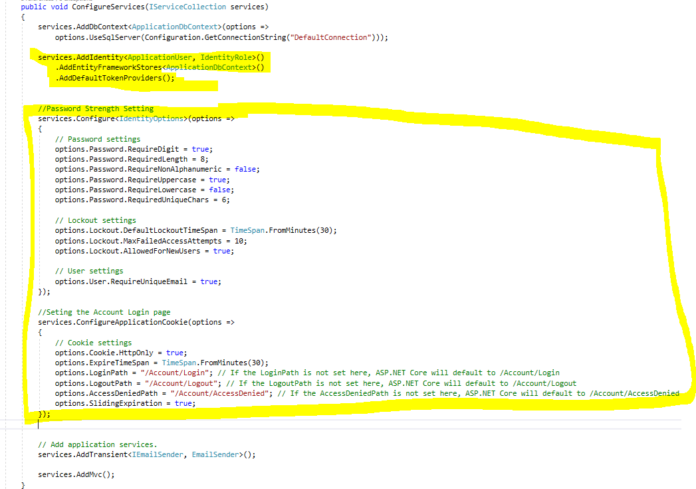

&nbsp;

<h1>Step 4: Register and Create your First User</h1>

Now our ASP.NET Core web application is ready for user to register in our website and also user can login to our system after registration. We will be doing the Authorization by adding role to user in next steps. Build and run your application to register
 your first default Admin user.

Click on the Register link to register our first User.

<h2>Migration</h2>

When we click on the Register button, we can see the below page. Don&rsquo;t panic with this page as for the first time run we need to do the Migration, just click on the Apply Migrations button.

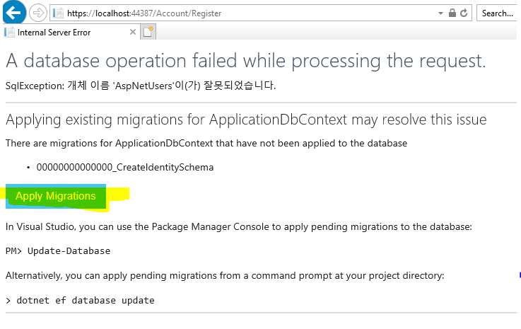

We can see the confirmation as Migration Applied and click on Try refreshing the page message.

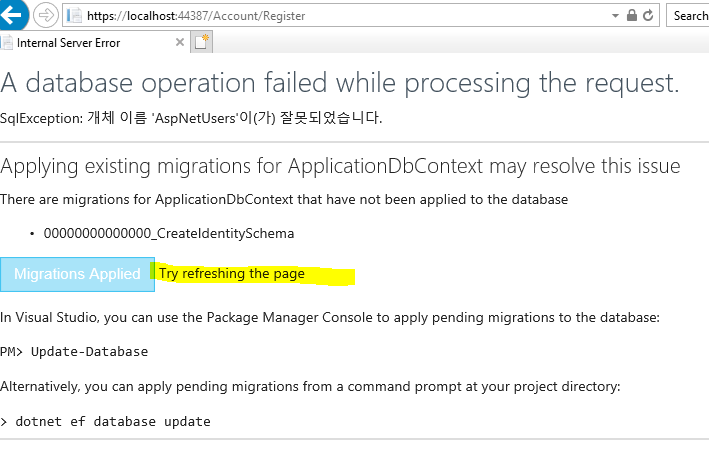

Refresh the page and we can see the newly registered user has been logged into our web site.

<h2>Refresh the Database</h2>

When we refresh our database, we can see all the Identity tables have been created.

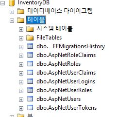

We can check the aspNetUsers table to find the newly created user details. We can also see the ASPNetRoles and ASPNetUserRoles have no records as we have not yet created any roles or added user for the roles. In the next step, we will add a new role as &ldquo;Admin&rdquo;
 and we will add the newly register user as Admin.

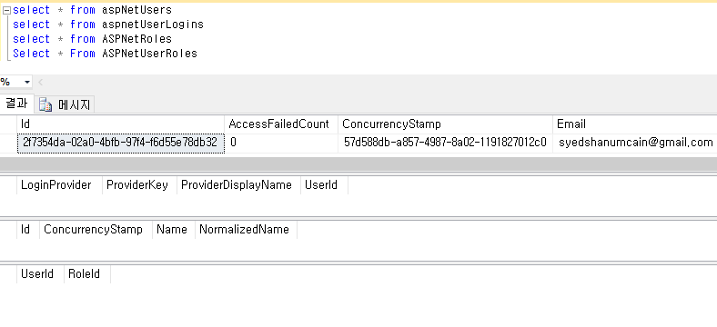

<h1>Step 5: Create Role and Assign User for Role</h1>

We use the below method to create a new Role as &ldquo;Admin&rdquo; and we will assign the recently registered as &ldquo;Admin&rdquo; to our website. Open Startup.cs file and add this method in your Startup.cs file.

&nbsp;

C#

Edit|Remove

csharp

<pre class="js">private&nbsp;async&nbsp;Task&nbsp;CreateUserRoles(IServiceProvider&nbsp;serviceProvider)&nbsp;
&nbsp;&nbsp;&nbsp;&nbsp;&nbsp;&nbsp;&nbsp;&nbsp;{&nbsp;
&nbsp;&nbsp;&nbsp;&nbsp;&nbsp;&nbsp;&nbsp;&nbsp;&nbsp;&nbsp;&nbsp;&nbsp;var&nbsp;RoleManager&nbsp;=&nbsp;serviceProvider.GetRequiredService&lt;RoleManager&lt;IdentityRole&gt;&gt;();&nbsp;
&nbsp;&nbsp;&nbsp;&nbsp;&nbsp;&nbsp;&nbsp;&nbsp;&nbsp;&nbsp;&nbsp;&nbsp;var&nbsp;UserManager&nbsp;=&nbsp;serviceProvider.GetRequiredService&lt;UserManager&lt;ApplicationUser&gt;&gt;();&nbsp;
&nbsp;
&nbsp;&nbsp;&nbsp;&nbsp;&nbsp;&nbsp;&nbsp;&nbsp;&nbsp;&nbsp;&nbsp;&nbsp;IdentityResult&nbsp;roleResult;&nbsp;
&nbsp;&nbsp;&nbsp;&nbsp;&nbsp;&nbsp;&nbsp;&nbsp;&nbsp;&nbsp;&nbsp;&nbsp;//Adding&nbsp;Admin&nbsp;Role&nbsp;
&nbsp;&nbsp;&nbsp;&nbsp;&nbsp;&nbsp;&nbsp;&nbsp;&nbsp;&nbsp;&nbsp;&nbsp;var&nbsp;roleCheck&nbsp;=&nbsp;await&nbsp;RoleManager.RoleExistsAsync(&quot;Admin&quot;);&nbsp;
&nbsp;&nbsp;&nbsp;&nbsp;&nbsp;&nbsp;&nbsp;&nbsp;&nbsp;&nbsp;&nbsp;&nbsp;if&nbsp;(!roleCheck)&nbsp;
&nbsp;&nbsp;&nbsp;&nbsp;&nbsp;&nbsp;&nbsp;&nbsp;&nbsp;&nbsp;&nbsp;&nbsp;{&nbsp;
&nbsp;&nbsp;&nbsp;&nbsp;&nbsp;&nbsp;&nbsp;&nbsp;&nbsp;&nbsp;&nbsp;&nbsp;&nbsp;&nbsp;&nbsp;&nbsp;//create&nbsp;the&nbsp;roles&nbsp;and&nbsp;seed&nbsp;them&nbsp;to&nbsp;the&nbsp;database&nbsp;
&nbsp;&nbsp;&nbsp;&nbsp;&nbsp;&nbsp;&nbsp;&nbsp;&nbsp;&nbsp;&nbsp;&nbsp;&nbsp;&nbsp;&nbsp;&nbsp;roleResult&nbsp;=&nbsp;await&nbsp;RoleManager.CreateAsync(new&nbsp;IdentityRole(&quot;Admin&quot;));&nbsp;
&nbsp;&nbsp;&nbsp;&nbsp;&nbsp;&nbsp;&nbsp;&nbsp;&nbsp;&nbsp;&nbsp;&nbsp;}&nbsp;
&nbsp;//Assign&nbsp;Admin&nbsp;role&nbsp;to&nbsp;the&nbsp;main&nbsp;User&nbsp;here&nbsp;we&nbsp;have&nbsp;given&nbsp;our&nbsp;newly&nbsp;registered&nbsp;&nbsp;
&nbsp;//login&nbsp;id&nbsp;for&nbsp;Admin&nbsp;management&nbsp;
&nbsp;&nbsp;&nbsp;&nbsp;&nbsp;&nbsp;&nbsp;&nbsp;&nbsp;&nbsp;&nbsp;&nbsp;ApplicationUser&nbsp;user&nbsp;=&nbsp;await&nbsp;UserManager.FindByEmailAsync(&quot;syedshanumcain@gmail.com&quot;);&nbsp;
&nbsp;&nbsp;&nbsp;&nbsp;&nbsp;&nbsp;&nbsp;&nbsp;&nbsp;&nbsp;&nbsp;&nbsp;var&nbsp;User&nbsp;=&nbsp;new&nbsp;ApplicationUser();&nbsp;&nbsp;
&nbsp;&nbsp;&nbsp;&nbsp;&nbsp;&nbsp;&nbsp;&nbsp;&nbsp;&nbsp;&nbsp;&nbsp;await&nbsp;UserManager.AddToRoleAsync(user,&nbsp;&quot;Admin&quot;);&nbsp;
&nbsp;&nbsp;&nbsp;&nbsp;&nbsp;&nbsp;&nbsp;&nbsp;}</pre>

&nbsp;From Startup.cs file, we can find the Configure method. Call our CreateUserRoles method from this Configure method. When we build and run our application, we can see new Role as &ldquo;Admin&rdquo; will be created in ASPNetRole
 table.

&nbsp;

When we build and run the application, we can see the New Role has been added in the ASPNetRoles table and also, we can see as our default User has been assigned with the Admin Role.

<h1>Step 6: Create Admin Page and Set Authorization</h1>

Now we have an Admin user for our ASP.NET Core web application. As a next step, let's create one new page and set Authorization for this page as only Logged in and Admin user alone can view this page. For doing this, we create a new Controller named as Admin.

<h2>Creating Admin Controller</h2>

Right click Controller folder and click Add New Controller, select MVC Controller &ndash; Empty and click Add.

Enter your Controller name as Admin and click Add.

From the controller, Right Click the Index and click Add View. Click the Add Button to create our View page.

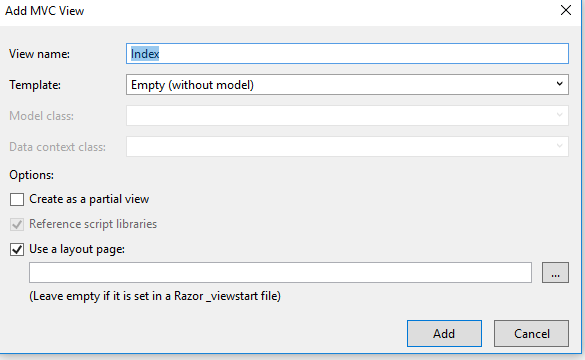

We can see our Admin Controller and Admin View has been created.

Open the&nbsp;<em>Admin/Index.cshtml</em>&nbsp;page to design for your need. Here, I have added simple text like below:

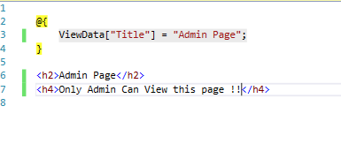

Next, we create a new Menu to display the Admin Page. For creating our new Menu, open the&nbsp;<em>_Layout.cshtml</em>from&nbsp;<em>Views/Shared</em>&nbsp;folder. Add the menu like the below image:

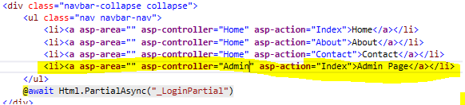

Now we have created the Admin Page and also added the menu for our Admin. We have created this page only for the Admin user and other users or non-logged in users should not see this page. What will happen If we run our application.

We can see as new menu &ldquo;Admin Page&rdquo; has been created and it's open to all now. This means that anyone can click on the link and view the content of that page.

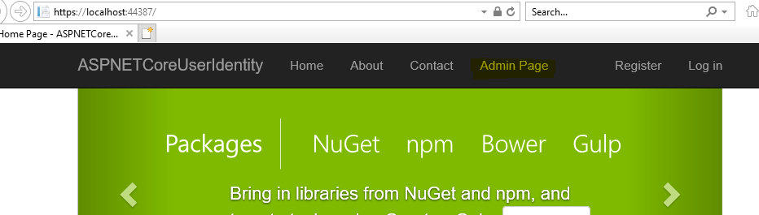

&nbsp;

Here, we can see as we can view the Admin page with our Login.

<h2>Set Authorization</h2>

To avoid this, we use the Authorization in our Admin page controller. Open our Admin Controller and add the below line of code:

&nbsp;

C#

Edit|Remove

csharp

<pre class="js">[Authorize(Roles&nbsp;=&nbsp;&quot;Admin&quot;)]&nbsp;
public&nbsp;IActionResult&nbsp;Index()&nbsp;
{&nbsp;
&nbsp;&nbsp;&nbsp;&nbsp;return&nbsp;View();&nbsp;
}</pre>

&nbsp;

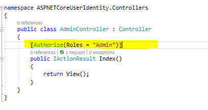

&nbsp;

If we run our application and click on the Admin page, it will automatically redirect to Log in page.

Note only the Admin Role Members will be able to view the admin page as we have set the Authorization only for the Admin Roles. If you want to add more Roles, we can use the comma like the below code:

&nbsp;

C#

Edit|Remove

csharp

<pre class="js">[Authorize(Roles&nbsp;=&nbsp;&quot;Admin,SuperAdmin,Manager&quot;)]</pre>

<h1 class="endscriptcode">&nbsp;Step 7: Show Hide Menu by User Role</h1>

&nbsp;

Now let&rsquo;s go one step forward as to show the Admin Menu only for the Logged in Admin users. To do this, we open our Layout.cshtml from Views/Shared folder and edit the newly added menu like the below code. Here, in this code, first we check whether
 the user is Authenticated, means Logged in, and then we check whether the user has Authorization to view the menu.

&nbsp;

HTML

Edit|Remove

html

<pre class="js">&lt;li&gt;&nbsp;
&nbsp;&nbsp;&nbsp;&nbsp;&nbsp;&nbsp;&nbsp;&nbsp;&nbsp;&nbsp;&nbsp;&nbsp;&nbsp;&nbsp;&nbsp;&nbsp;&nbsp;&nbsp;&nbsp;@if&nbsp;(User.Identity.IsAuthenticated)&nbsp;
&nbsp;&nbsp;&nbsp;&nbsp;&nbsp;&nbsp;&nbsp;&nbsp;&nbsp;&nbsp;&nbsp;&nbsp;&nbsp;&nbsp;&nbsp;&nbsp;&nbsp;&nbsp;&nbsp;{&nbsp;
&nbsp;&nbsp;&nbsp;&nbsp;&nbsp;&nbsp;&nbsp;&nbsp;&nbsp;&nbsp;&nbsp;&nbsp;&nbsp;&nbsp;&nbsp;&nbsp;&nbsp;&nbsp;&nbsp;&nbsp;@if&nbsp;(User.IsInRole(&quot;Admin&quot;))&nbsp;
&nbsp;&nbsp;&nbsp;&nbsp;&nbsp;&nbsp;&nbsp;&nbsp;&nbsp;&nbsp;&nbsp;&nbsp;&nbsp;&nbsp;&nbsp;&nbsp;&nbsp;&nbsp;&nbsp;&nbsp;&nbsp;&nbsp;&nbsp;{&nbsp;
&nbsp;&nbsp;&nbsp;&nbsp;&nbsp;&nbsp;&nbsp;&nbsp;&nbsp;&nbsp;&nbsp;&nbsp;&nbsp;&lt;a&nbsp;asp-area=&quot;&quot;&nbsp;asp-controller=&quot;Admin&quot;&nbsp;asp-action=&quot;Index&quot;&gt;Admin&nbsp;Page&lt;/a&gt;&nbsp;
&nbsp;&nbsp;&nbsp;&nbsp;&nbsp;&nbsp;&nbsp;&nbsp;&nbsp;&nbsp;&nbsp;&nbsp;&nbsp;&nbsp;&nbsp;&nbsp;&nbsp;&nbsp;&nbsp;&nbsp;&nbsp;&nbsp;&nbsp;}&nbsp;
&nbsp;&nbsp;&nbsp;&nbsp;&nbsp;&nbsp;&nbsp;&nbsp;&nbsp;&nbsp;&nbsp;&nbsp;&nbsp;&nbsp;&nbsp;&nbsp;&nbsp;&nbsp;&nbsp;&nbsp;}&nbsp;
&nbsp;&nbsp;&nbsp;&nbsp;&nbsp;&nbsp;&nbsp;&nbsp;&nbsp;&nbsp;&nbsp;&nbsp;&nbsp;&nbsp;&nbsp;&lt;/li&gt;</pre>

&nbsp;

Run the application and we can see by default the &ldquo;Admin Page&rdquo; will not be displayed in our top menu. Logged in Admin Role user alone can view the menu.

&nbsp;

Let&rsquo;s try this by&nbsp;Login with our Admin user which we created initially.

After Log in, we can see that the Admin user can view the Admin Page menu now.

&nbsp;

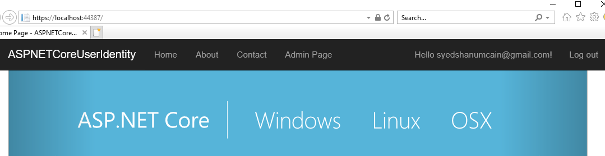

Let&rsquo;s try with creating a normal user as we register new user now.

After the registration, we can see that for this user, we didn&rsquo;t add the &ldquo;Admin&amp;rdquorole and he has no access to view the Admin Page.

&nbsp;

Reference Link:&nbsp;<a href="https://docs.microsoft.com/en-us/aspnet/core/security/authentication/identity?tabs=visual-studio%2Caspnetcore2x">https://docs.microsoft.com/en-us/aspnet/core/security/authentication/identity?tabs=visual-studio%2Caspnetcore2x</a>

<h1>Source Code Files</h1>
<ul>
<li>ASPNETCoreUserIdentity.zip - 2018/03/20 </li></ul>
<h1>More Information</h1>

<em>Firstly, create a sample InventoryDB database in your SQL Server. In the appsettings.json file, change the DefaultConnection connection string with your SQL Server Connections. In Startup.cs file, add all the code as we discussed in this article. In
 the next article, we will see in detail how to perform User Role management and customize the User Registration/Login Page in ASP.NET Core 2.0.</em>

