# Getting Started with Angular 7 And ASP.NET Core 2.1
## Requires
- Visual Studio 2017
## License
- MIT
## Technologies
- ASP.NET Core
- Angular 7
## Topics
- ASP.NET Core
- Angular 7
## Updated
- 02/08/2019
## Description

<h1>Introduction</h1>

In this article let&rsquo;s see in detail about getting started with Angular 7 and ASP.Net Core 2.0 using Angular 7 Web Application (.NET Core) Template and ASP.NET Core MVC Application. We will also see in detail about how to work with Angular 7 new features
 of Virtual Scrolling and Drag and Drop Items.

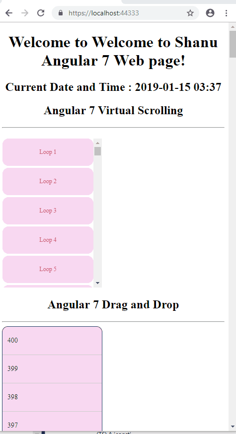

<h1>Building the Sample</h1>
<h1 class="MsoNormal" style="margin:12pt 0cm; line-height:normal"><strong>Prerequisites</strong></h1>

Make sure you have installed all the prerequisites in your computer. If not, then download and install all, one
 by one.

&nbsp;

<ol type="1">
<li class="MsoNormal" style="color:#212121; line-height:normal">First, download and install Visual Studio 2017 from this&nbsp;<a href="https://www.visualstudio.com/" target="_blank">link</a>.
</li><li class="MsoNormal" style="color:#212121; line-height:normal"><a href="https://www.microsoft.com/net/core#windowscmd" target="_blank">Download</a>&nbsp;and
 install .NET Core 2.0 or above version. </li><li class="MsoNormal" style="color:#212121; line-height:normal">Download and install Node.js latest version from this download&nbsp;<a href="https://nodejs.org/en/" target="_blank">link</a>.
</li></ol>

Description

Now, it&rsquo;s time to create our first ASP.NET Core and Angular 7 application using the Template.

<h1 class="MsoNormal" style="margin:12pt 0cm; line-height:normal"><strong>Angular 7 Web Application (.NET Core) using Template</strong></h1>
<h2 class="MsoNormal" style="margin:12pt 0cm; line-height:normal"><strong>Step 1- Create Angular 7 ASP.NET Core using Template</strong></h2>

After installing all the prerequisites listed above, click Start &gt;&gt; Programs &gt;&gt; Visual Studio 2017 &gt;&gt;
 Visual Studio 2017, on your desktop.

Click New &gt;&gt; Project. Select Online &gt;&gt; Template &gt;&gt; Search for Angular 7 .NetCore 2 Template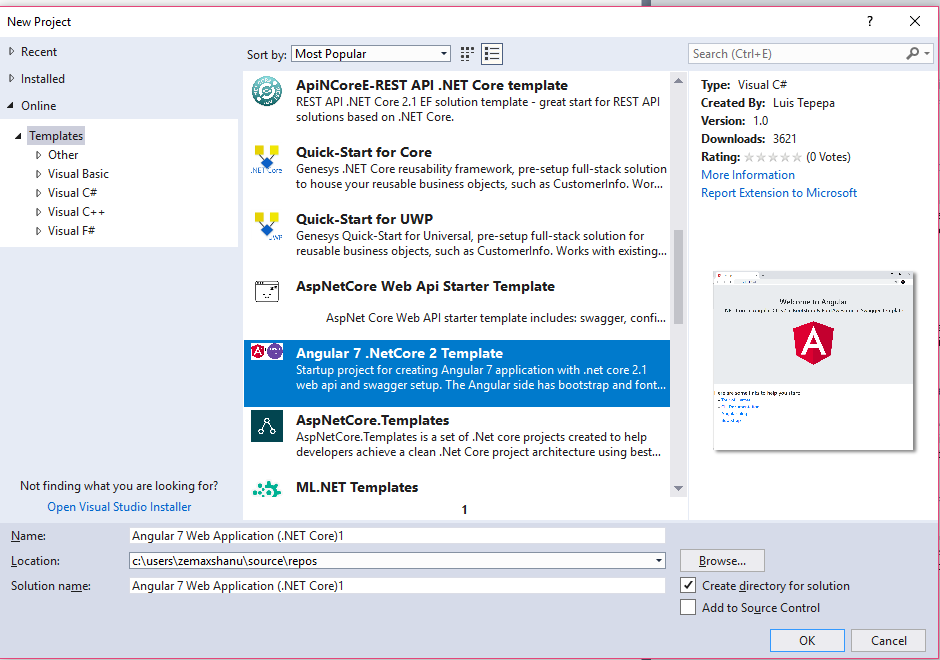

Download and Install the Template.

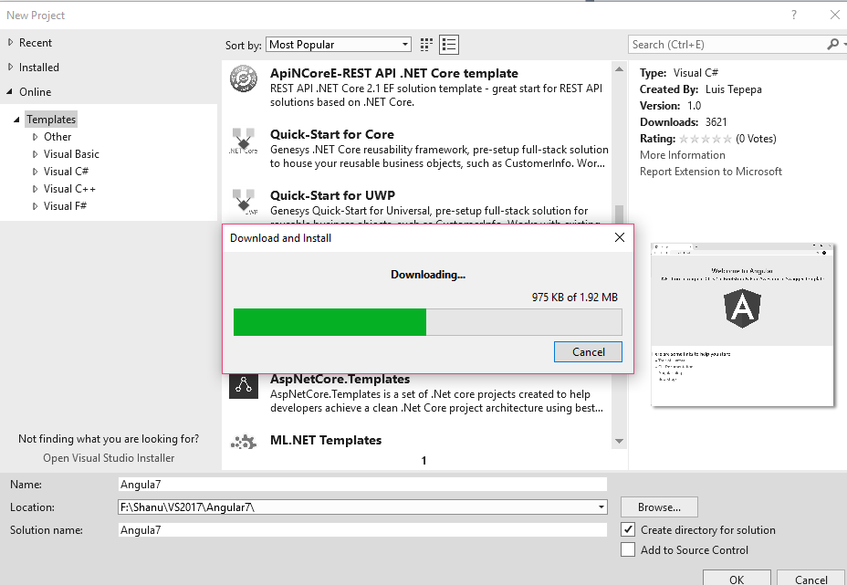 

We can see as the new Angular 7 web Application(.Net Core) template has been added ,Select the template add your
 project name and click ok to create your Angular 7 application using ASP.NET Core.

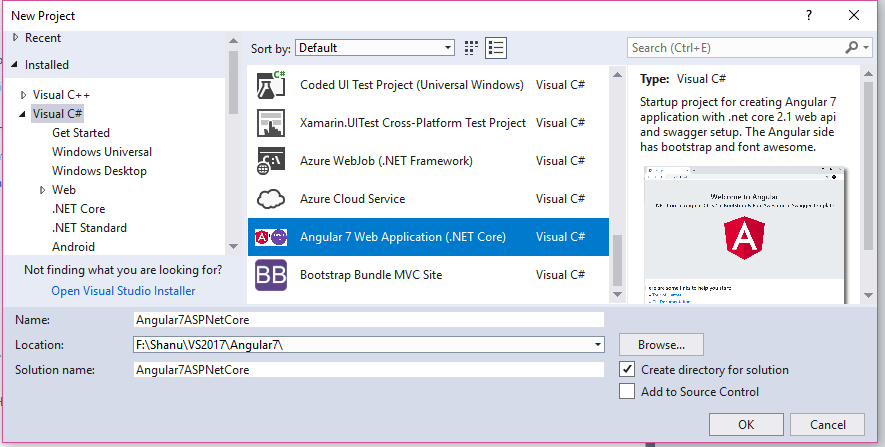 

You can see as new Angular7 project has been created also we can see the Asp.Net Core Controller and Angular 7 Client
 App folder from the solution explorer.

If we Open the package.json file we can see the new Angular 7 package has been installed to our project

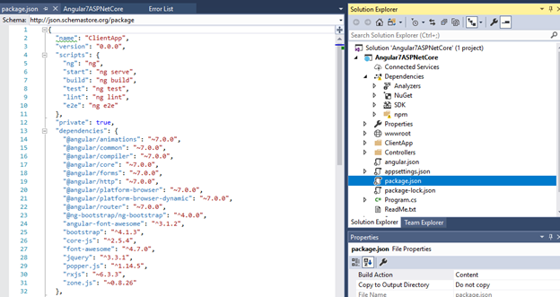

<strong>Note:</strong>&nbsp;
 we need to upgrade our Angular CLI to version 7. If you not yet install the Angular CLI then first install the Angular CLI and upgrade to Angular CLI version 7.&nbsp;

Now, let&rsquo;s start working with the Angular part.

First, we need to install the Angular CLI to our project

<h3 class="MsoNormal" style="margin:12pt 0cm; line-height:normal"><strong>Angular CLI</strong>&nbsp;</h3>

Angular CLI is a command line interface to scaffold and build Angular apps using node.js style (commonJS) modules.&nbsp;<a href="http://ngcli.github.io/" target="_blank">for
 More details click here</a>&nbsp;

To install the Angular CLI to your project, open the Visual Studio Command Prompt and &nbsp;&nbsp;run the below
 command.

Windows Shell Script

Edit|Remove

windowsshell

<pre class="js">npm&nbsp;i&nbsp;-g&nbsp;@angular/cli</pre>

<h2 class="endscriptcode">&nbsp;<strong>Step 2 -
</strong><strong>Build and Run the Application</strong></h2>

Now our application is ready to build and Run to see the sample Angular 7 page. Once we run the application, we can see a sample Angular 7-page like below.

<h3 class="MsoNormal" style="margin:12pt 0cm; line-height:normal"><strong>ClientApp folder:</strong></h3>

Our Angular files will be under the ClientApp folder. If we want to work with component or html then we open the app
 folder under ClientApp and we can see the app.Component.ts and app.Component.html.

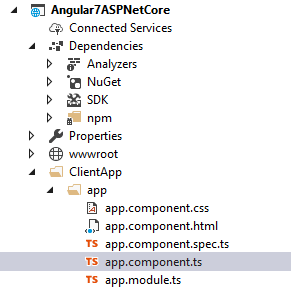

Now we can change the Title from our component file and display the new sub title with date time in our app html
 page.

&nbsp;In our app.Component.ts
 file we changed the default title and also added a new variable to get the current date and time to display in our html page.&nbsp;

JavaScript

Edit|Remove

js

<pre class="js">title&nbsp;=&nbsp;'Welcome&nbsp;to&nbsp;Shanu&nbsp;Angular&nbsp;7&nbsp;Web&nbsp;page';&nbsp;
subtitle&nbsp;=&nbsp;'.NET&nbsp;Core&nbsp;&#43;&nbsp;Angular&nbsp;CLI&nbsp;v7&nbsp;&#43;&nbsp;Bootstrap&nbsp;&amp;&nbsp;FontAwesome&nbsp;&#43;&nbsp;Swagger&nbsp;Template';&nbsp;&nbsp;&nbsp;&nbsp;datetime&nbsp;=&nbsp;Date.now();&nbsp;
&nbsp;
</pre>

&nbsp;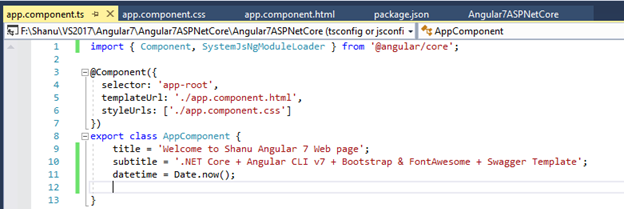

In our html page we bind the newly declared variable datetime with below code.&nbsp;

HTML

Edit|Remove

html

<pre class="js">&nbsp;&nbsp;&nbsp;&lt;h1&gt;{{title}}&lt;/h1&gt;&nbsp;
&nbsp;&nbsp;&nbsp;&nbsp;&nbsp;&nbsp;&nbsp;&nbsp;&lt;h3&gt;{{subtitle}}&lt;/h3&gt;&nbsp;
&nbsp;&nbsp;&nbsp;&nbsp;&nbsp;&nbsp;&nbsp;&nbsp;&lt;h4&gt;&nbsp;
&nbsp;&nbsp;&nbsp;&nbsp;&nbsp;&nbsp;&nbsp;&nbsp;&nbsp;&nbsp;Current&nbsp;Date&nbsp;and&nbsp;Time:&nbsp;&nbsp;&nbsp;{{datetime&nbsp;|&nbsp;date:'yyyy-MM-dd&nbsp;hh:mm'}}&nbsp;
&nbsp;&nbsp;&nbsp;&nbsp;&nbsp;&nbsp;&nbsp;&nbsp;&lt;/h4&gt;&nbsp;
</pre>

&nbsp;When we run the application, we can see as the title has been updated and displaying todays date and time like below image.

&nbsp;

&nbsp;

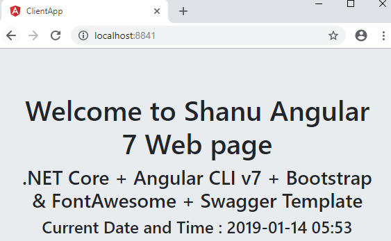

<h1 class="MsoNormal" style="margin:12pt 0cm; line-height:normal"><strong>Using Asp.NET Core Web Application</strong></h1>
<h2 class="MsoNormal" style="margin:12pt 0cm; line-height:normal"><strong>Step 1- Create ASP.NET Core Web Application</strong></h2>

&nbsp;click Start &gt;&gt; Programs &gt;&gt; Visual Studio 2017 &gt;&gt; Visual Studio 2017, on your desktop.

Click New &gt;&gt; Project. Select Web &gt;&gt; ASP.NET Core Web Application. Enter your project name and click OK.

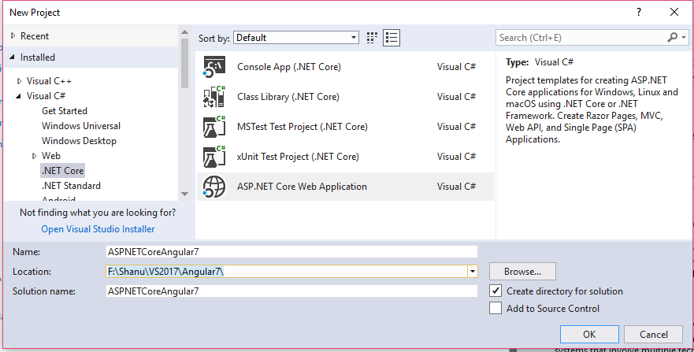 

Select Angular Project and click OK. &nbsp;

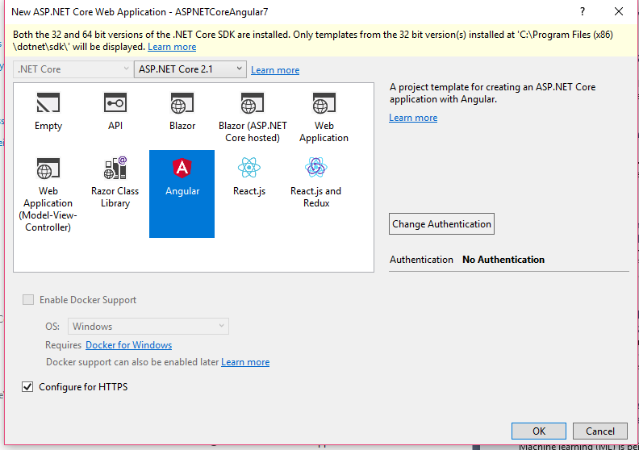 

<h2 class="MsoNormal"><strong>Step 2 &ndash; Upgrade to Angular 7</strong></h2>

By default, we can see the Angular 5 version has been installed in our project. We can check this from our Package.json file

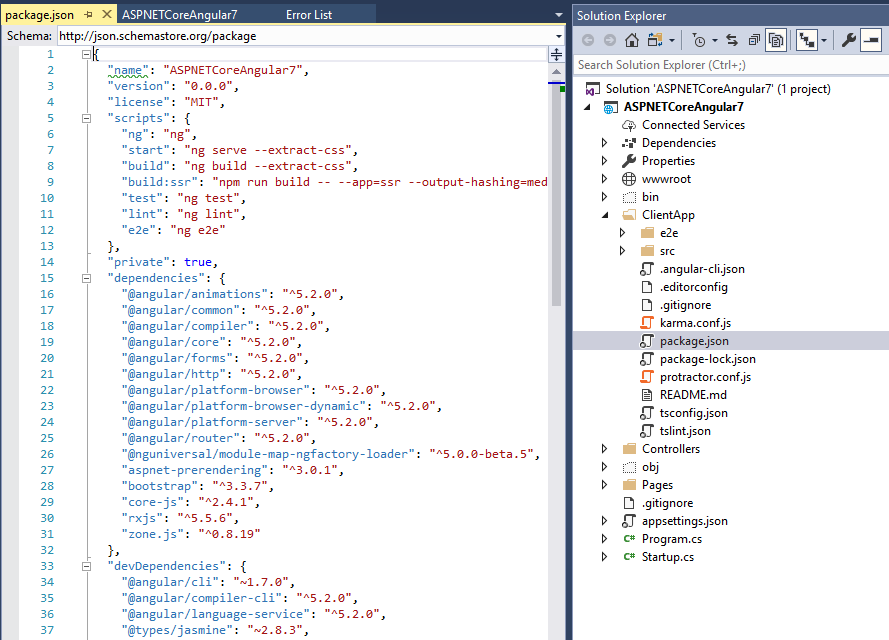

For upgrading to Angular 7 first we delete the ClientApp folder from project and create nee ClientApp from the Command prompt.

First, we delete the ClientApp folder from our project.

To install and create a new ClientApp with Angular7 packages, open a command prompt and go to our project folder, Enter the below command and run to install the Angular 7 Packages and create new ClientApp folder for working with Angular
 7.

Windows Shell Script

Edit|Remove

windowsshell

<pre class="js">ng&nbsp;new&nbsp;ClientApp&nbsp;
&nbsp;
</pre>

&nbsp;

It will take few seconds to install all the Angular 7 Packages and we can see the installing package details and confirmation from our command window.

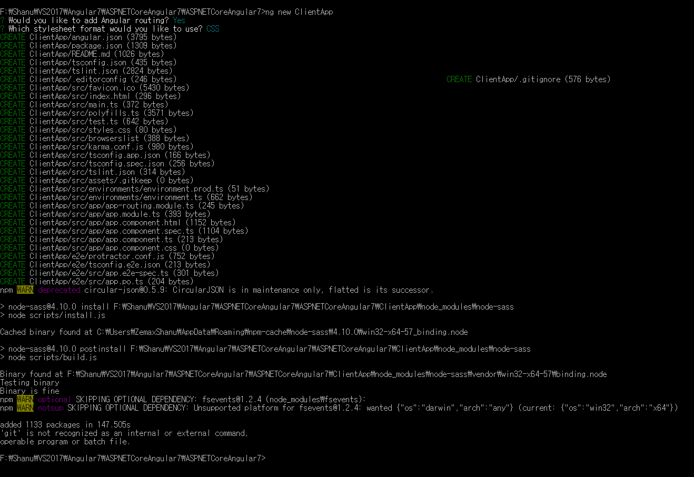

We can see new ClientApp folder has been created in our project and when we open the Package.json file the Angular 7 Version has been installed to ours project.

<strong>Note:</strong>&nbsp;
 we need to upgrade our Angular CLI to version 7. If you not yet install the Angular CLI then first install the Angular CLI and upgrade to Angular CLI version 7.&nbsp;

Now, let&rsquo;s start working with the Angular part.

First, we need to install the Angular CLI to our project

<h3 class="MsoNormal" style="margin:12pt 0cm; line-height:normal"><strong>Angular CLI</strong>&nbsp;</h3>

Angular CLI is a command line interface to scaffold and build Angular apps using node.js style (commonJS) modules.&nbsp;<a href="http://ngcli.github.io/" target="_blank">for
 More details click here</a>&nbsp;

To install the Angular CLI to your project, open the Visual Studio Command Prompt and &nbsp;&nbsp;run the below
 command.

Windows Shell Script

Edit|Remove

windowsshell

<pre class="js">npm&nbsp;i&nbsp;-g&nbsp;@angular/cli</pre>

<h2 class="endscriptcode">&nbsp;&nbsp;<strong>Step 3 -
</strong><strong>Build and Run the Application</strong></h2>

Now our application is ready to build and Run to see the sample Angular 7 page. Once we run the application, we can see a sample Angular 7-page like below.

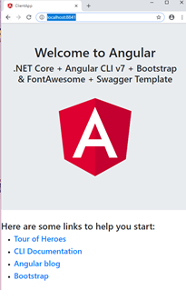

<h1 class="MsoNormal" style="margin:12pt 0cm; line-height:normal"><strong>What&rsquo;s new in Angular 7</strong></h1>

Virtual Scrolling and Drag and Drop are major features added in the Angular 7 CDK. If we have a large no of item in the list and want a fast performance scrolling to load and display all the items then we can use the new Angular 7 Virtual
 Scrolling to scroll the items in the List. Using the Angular 7 Drag and Drop now we can Drag and drop the item to the same list or to another list. We will be seeing in detail on how to work with Angular 7 Virtual Scrolling and Drag and Drop with example below.

<h2 class="MsoNormal"><strong>Installing Angular CDK</strong></h2>

For working with Virstual Scrolling and Drag and Drop we need to install the Angular CDK package to our project to add this we open the command prompt and go to our project ClientApp Folder path and enter the below code and run the command.

We can see the confirmation message in command prompt as the Angular CDK packages has been added to our project.

&nbsp;

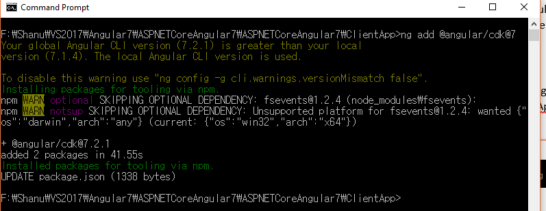

<h2 class="MsoNormal"><strong>Virtual Scrolling</strong></h2>
<h3 class="MsoNormal"><strong>App Module - Importing the Scrolling Module to our App</strong></h3>

In order to work with Virtual scrolling after adding the CDK project we need to import the ScrollingModule to our Modules app.

Open our Module.ts file here we will be working with our default app.module.ts to import the ScrollingModule to create our Virtual Scrolling in our application.

Add the below code in import section of your module to import the ScrollingModule.

JavaScript

Edit|Remove

js

<pre class="js">import&nbsp;{&nbsp;ScrollingModule&nbsp;}&nbsp;from&nbsp;'@angular/cdk/scrolling';</pre>

&nbsp;Also we need to add the import section add the ScrollingModule to work with Virtual Scrolling.

&nbsp;

JavaScript

Edit|Remove

js

<pre class="js">&nbsp;&nbsp;imports:&nbsp;[&nbsp;
&nbsp;&nbsp;&nbsp;&nbsp;BrowserModule,&nbsp;
&nbsp;&nbsp;&nbsp;&nbsp;AppRoutingModule,&nbsp;
&nbsp;&nbsp;&nbsp;&nbsp;ScrollingModule&nbsp;
],</pre>

&nbsp;Our Code will be look like below image.

<h4><strong>App Component</strong></h4>

For adding item to the list, we need an Item, for creating the Item in our app component we create a new Array and add items to the array in the constructor. By this when the page loads the new array item will be created with new values.Open
 the app.component.ts file and add the below code in your component export class.&nbsp;

JavaScript

Edit|Remove

js

<pre class="js">incrementValue:&nbsp;number[]&nbsp;=&nbsp;[];&nbsp;
&nbsp;&nbsp;constructor()&nbsp;{&nbsp;
&nbsp;&nbsp;&nbsp;&nbsp;for&nbsp;(let&nbsp;index&nbsp;=&nbsp;1;&nbsp;index&nbsp;&lt;=&nbsp;200;&nbsp;index&#43;&#43;)&nbsp;{&nbsp;
&nbsp;&nbsp;&nbsp;&nbsp;&nbsp;&nbsp;this.incrementValue.push(index);&nbsp;
&nbsp;&nbsp;&nbsp;&nbsp;}</pre>

&nbsp;The complete code will be look like this.

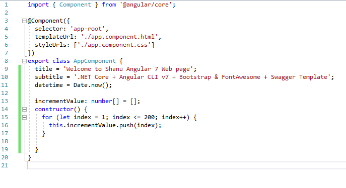

<h4 class="MsoNormal"><strong>Adding the CSS</strong></h4>

For our List scrolling we will be adding the below CSS to design our list with c rounded corner and adding colors. Add the below css code to your app.component.css file.

JavaScript

Edit|Remove

js

<pre class="js">ul&nbsp;{&nbsp;
&nbsp;&nbsp;max-width:&nbsp;800px;&nbsp;
&nbsp;&nbsp;color:&nbsp;#cc4871;&nbsp;
&nbsp;&nbsp;margin:&nbsp;20px&nbsp;auto;&nbsp;
&nbsp;&nbsp;padding:&nbsp;2px;&nbsp;
}&nbsp;
&nbsp;
.list&nbsp;li&nbsp;{&nbsp;
&nbsp;&nbsp;padding:&nbsp;20px;&nbsp;
&nbsp;&nbsp;background:&nbsp;#f8d8f2;&nbsp;
&nbsp;&nbsp;border-radius:&nbsp;12px;&nbsp;
&nbsp;&nbsp;margin-bottom:&nbsp;12px;&nbsp;
&nbsp;&nbsp;text-align:&nbsp;center;&nbsp;
&nbsp;&nbsp;font-size:&nbsp;12px;&nbsp;&nbsp;
}&nbsp;
</pre>

<h4 class="endscriptcode">&nbsp;<strong>Design your HTML page to display the List with CDK Virtual Scrolling</strong></h4>

Now its time to design our html page to add the Virtual Scrolling function to the List for scrolling the item from the list. Open app.component.html and add the below code to display the item in list with Virtual Scrolling features added.

Inside the list we use the 
cdk-virtual-scroll-viewport to add the virtual scrolling to our list and here we set the width and height of the List with the Itemsize per each scroll.

&nbsp;

CSS

Edit|Remove

css

<pre class="js">&lt;h2&gt;Angular&nbsp;7&nbsp;Virtual&nbsp;Scrolling&nbsp;&lt;/h2&gt;&nbsp;
&lt;hr&nbsp;/&gt;&nbsp;
&nbsp;&nbsp;&lt;ul&nbsp;class=&quot;list&quot;&gt;&nbsp;
&nbsp;&nbsp;&nbsp;&nbsp;&lt;cdk-virtual-scroll-viewport&nbsp;style=&quot;width:200px;height:&nbsp;300px&quot;&nbsp;itemSize=&quot;5&quot;&gt;&nbsp;
&nbsp;&nbsp;&nbsp;&nbsp;&nbsp;&nbsp;&lt;ng-container&nbsp;*cdkVirtualFor=&quot;let&nbsp;incValue&nbsp;of&nbsp;incrementValue&quot;&gt;&nbsp;
&nbsp;&nbsp;&nbsp;&nbsp;&nbsp;&nbsp;&nbsp;&nbsp;&lt;li&gt;&nbsp;Loop&nbsp;{{incValue}}&nbsp;&nbsp;&lt;/li&gt;&nbsp;
&nbsp;&nbsp;&nbsp;&nbsp;&nbsp;&nbsp;&lt;/ng-container&gt;&nbsp;
&nbsp;&nbsp;&nbsp;&nbsp;&lt;/cdk-virtual-scroll-viewport&gt;&nbsp;
&nbsp;&nbsp;&lt;/ul&gt;&nbsp;
</pre>

<h3 class="endscriptcode">&nbsp;<strong style="font-family:Verdana,Arial,Helvetica,sans-serif; font-size:10px">Run the Application</strong></h3>

&nbsp;

<strong>&nbsp;</strong>

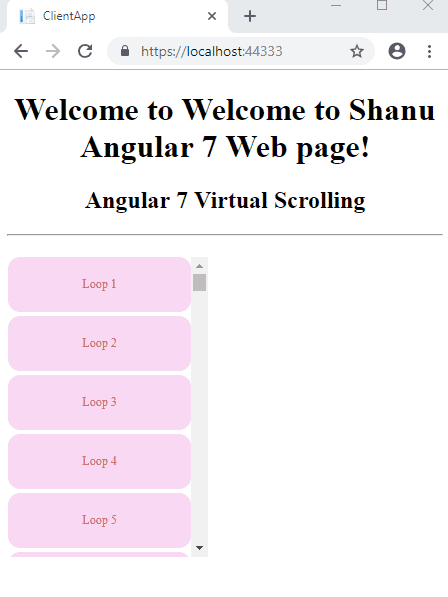

<h2 class="MsoNormal"><strong>Drag and Drop</strong></h2>
<h3 class="MsoNormal"><strong>App Module - Importing the DragDrop Module to our App</strong></h3>

In order to work with Drag and Drop after adding the CDK project we need to import the DragDrop Module to our Modules app.

Open our app.Module.ts file here we will be working with our default app.module.ts to import the DragDrop Module to create our Drag and Drop items in our application.

Add the below code in import section of your module to import the Drag and Drop.

JavaScript

Edit|Remove

js

<pre class="js">import&nbsp;{&nbsp;DragDropModule&nbsp;}&nbsp;from&nbsp;'@angular/cdk/drag-drop';</pre>

&nbsp;Also we need to add the import section add the ScrollingModule to work with Virtual Scrolling.

&nbsp;

JavaScript

Edit|Remove

js

<pre class="js">imports:&nbsp;[&nbsp;
&nbsp;&nbsp;&nbsp;&nbsp;BrowserModule,&nbsp;
&nbsp;&nbsp;&nbsp;&nbsp;AppRoutingModule,&nbsp;
&nbsp;&nbsp;&nbsp;&nbsp;ScrollingModule&nbsp;,&nbsp;
&nbsp;&nbsp;&nbsp;&nbsp;DragDropModule&nbsp;
],</pre>

&nbsp;Our Coed will be look like below image.

<h4 class="MsoNormal"><strong>App Component</strong></h4>

For adding item to the list, we need an Item, for creating the Item in our app component we create a new Array and add items to the array in the constructor. By this when the page loads the new array item will be created with new values.
 Open the app.component.ts file and add the below code in your component export class.

JavaScript

Edit|Remove

js

<pre class="js">incrementValue:&nbsp;number[]&nbsp;=&nbsp;[];&nbsp;
&nbsp;&nbsp;decrementValue:&nbsp;number[]&nbsp;=&nbsp;[];&nbsp;
&nbsp;&nbsp;constructor()&nbsp;{&nbsp;
&nbsp;&nbsp;&nbsp;&nbsp;for&nbsp;(let&nbsp;index&nbsp;=&nbsp;1;&nbsp;index&nbsp;&lt;=&nbsp;200;&nbsp;index&#43;&#43;)&nbsp;{&nbsp;
&nbsp;&nbsp;&nbsp;&nbsp;&nbsp;&nbsp;this.incrementValue.push(index);&nbsp;
&nbsp;&nbsp;&nbsp;&nbsp;}&nbsp;&nbsp;
&nbsp;
&nbsp;&nbsp;&nbsp;&nbsp;for&nbsp;(let&nbsp;int1&nbsp;=&nbsp;400;&nbsp;int1&nbsp;&gt;=&nbsp;201;&nbsp;int1--)&nbsp;{&nbsp;
&nbsp;&nbsp;&nbsp;&nbsp;&nbsp;&nbsp;this.decrementValue.push(int1);&nbsp;
&nbsp;&nbsp;&nbsp;&nbsp;}&nbsp;
&nbsp;&nbsp;}&nbsp;}</pre>

&nbsp;Here we have used the Increment Array we use for the Virtual Scrolling and Decrement array item we use for the Drag and Drop.&nbsp;

Now we need to Import the CdkDragDrop with MoveItemInArray to create the Drop event for adding the dragged item during drop at the selected position in the list.&nbsp;&nbsp;

JavaScript

Edit|Remove

js

<pre class="js">import&nbsp;{&nbsp;CdkDragDrop,&nbsp;moveItemInArray&nbsp;}&nbsp;from&nbsp;'@angular/cdk/drag-drop';</pre>

&nbsp;Then we add the drop event method inside our app component class for adding the selected item array to the selected current index.

JavaScript

Edit|Remove

js

<pre class="js">drop(event:&nbsp;CdkDragDrop&lt;string[]&gt;)&nbsp;{&nbsp;
&nbsp;&nbsp;&nbsp;&nbsp;moveItemInArray(this.decrementValue,&nbsp;event.previousIndex,&nbsp;event.currentIndex);&nbsp;
&nbsp;&nbsp;}</pre>

&nbsp;The complete code will be look like this.

 

<h4 class="MsoNormal" style="text-indent:10.5pt"><strong>Adding the CSS</strong></h4>

For our List Drag Drop we will be adding the below CSS to design our list .Add the below CSS code to your app.component.css file.

JavaScript

Edit|Remove

js

<pre class="js">.divClasslist&nbsp;{&nbsp;
&nbsp;&nbsp;width:&nbsp;200px;&nbsp;
&nbsp;&nbsp;border:&nbsp;solid&nbsp;1px&nbsp;#234365;&nbsp;
&nbsp;&nbsp;min-height:&nbsp;60px;&nbsp;
&nbsp;&nbsp;display:&nbsp;block;&nbsp;
&nbsp;&nbsp;background:&nbsp;#cc4871;&nbsp;
&nbsp;&nbsp;border-radius:&nbsp;12px;&nbsp;
&nbsp;&nbsp;margin-bottom:&nbsp;12px;&nbsp;
&nbsp;&nbsp;overflow:&nbsp;hidden;&nbsp;&nbsp;
}&nbsp;
&nbsp;
&nbsp;
.divClass&nbsp;{&nbsp;
&nbsp;&nbsp;padding:&nbsp;20px&nbsp;10px;&nbsp;
&nbsp;&nbsp;border-bottom:&nbsp;solid&nbsp;1px&nbsp;#ccc;&nbsp;
&nbsp;&nbsp;color:&nbsp;rgba(0,&nbsp;0,&nbsp;0,&nbsp;0.87);&nbsp;
&nbsp;&nbsp;display:&nbsp;flex;&nbsp;
&nbsp;&nbsp;flex-direction:&nbsp;row;&nbsp;
&nbsp;&nbsp;align-items:&nbsp;center;&nbsp;
&nbsp;&nbsp;justify-content:&nbsp;space-between;&nbsp;
&nbsp;&nbsp;box-sizing:&nbsp;border-box;&nbsp;
&nbsp;&nbsp;cursor:&nbsp;move;&nbsp;
&nbsp;&nbsp;background:&nbsp;#f8d8f2;&nbsp;
&nbsp;&nbsp;font-size:&nbsp;14px;&nbsp;
}&nbsp;
&nbsp;
&nbsp;&nbsp;.divClass:active&nbsp;{&nbsp;
&nbsp;&nbsp;&nbsp;&nbsp;background-color:&nbsp;#cc4871;&nbsp;
&nbsp;&nbsp;}&nbsp;
</pre>

<h4 class="endscriptcode">&nbsp;<strong>Design your HTML page to display the List with CDK Virtual Scrolling</strong></h4>

Now it&rsquo;s time to design our html page to add the Drag and Drop function to the List &nbsp;. Open app.component.html and add the below code to display the item in list with Drag and Drop features added.

Here we create the cdkDropList div element with Drop event using cdkDropListDropped.We add one more div elevement inside the cdkDroplist for adding the item with cdkDrag features for dragging the item inside the selected div element.

JavaScript

Edit|Remove

js

<pre class="js">&lt;h2&gt;Angular&nbsp;7&nbsp;Drag&nbsp;and&nbsp;Drop&nbsp;&lt;/h2&gt;&nbsp;
&lt;hr&nbsp;/&gt;&nbsp;
&lt;div&nbsp;cdkDropList&nbsp;class=&quot;divClasslist&quot;&nbsp;(cdkDropListDropped)=&quot;drop($event)&quot;&gt;&nbsp;
&nbsp;&nbsp;&lt;div&nbsp;class=&quot;divClass&quot;&nbsp;&nbsp;*ngFor=&quot;let&nbsp;decValue&nbsp;of&nbsp;decrementValue&quot;&nbsp;cdkDrag&gt;{{decValue}}&lt;/div&gt;&nbsp;
&lt;/div&gt;&nbsp;
</pre>

<h3 class="endscriptcode">&nbsp;<strong>Run the Application</strong></h3>

&nbsp;

<strong>&nbsp;</strong>

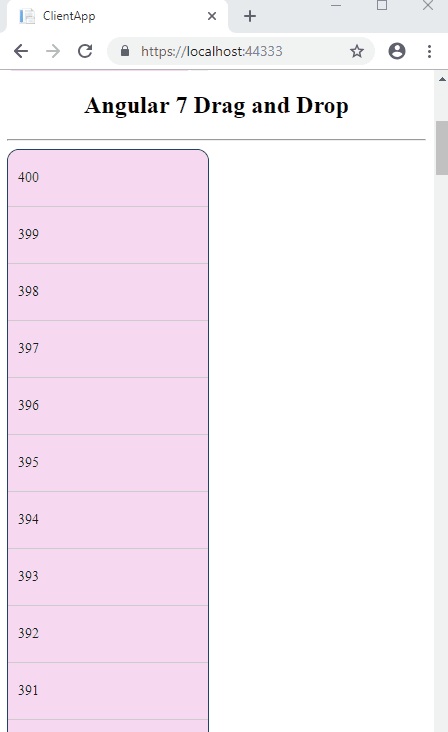

<h1>Source Code Files</h1>
<ul>
<li><em><em>ASPNETCoreAngular7.zip - 2019-01-15.</em></em> </li></ul>
<h1>More Information</h1>

hope you liked this article. In our next post, we will see in detail on how to perform CRUD operation using Angular
 7 and Asp.NET Core with and Web API.

<strong>Prerequisites 
</strong> 
Make sure you have installed all the prerequisites in your computer. If not, then download and install all, one by one.

<ol type="1">
<li class="MsoNormal" style="color:#212121; line-height:normal; background:white">
First, download and install Visual Studio 2017 from this&nbsp;<a href="https://www.visualstudio.com/" target="_blank">link</a>.
</li><li class="MsoNormal" style="color:#212121; line-height:normal; background:white">
<a href="https://www.microsoft.com/net/core#windowscmd" target="_blank">Download</a>&nbsp;and
 install .NET Core 2.0 or above version. </li><li class="MsoNormal" style="color:#212121; line-height:normal; background:white">
Download and install Node.js latest version from this download&nbsp;<a href="https://nodejs.org/en/" target="_blank">link</a>.
</li></ol>

