# Getting Started with Machine Learning DotNet (ML.NET)
## Requires
- Visual Studio 2017
## License
- MIT
## Technologies
- C#
- Machine Learning
- ML.NET
- Machine Learning DotNet
## Topics
- C#
- Machine Learning
- ML.NET
- Machine Learning DotNet
## Updated
- 08/27/2018
## Description

<h1>Introduction</h1>

In Build 2018 Microsoft interduce the preview of ML.NET (Machine Learning .NET) which is a cross platform, open source machine learning framework. Yes, now its easy to develop our own Machine Learning application or develop costume module using Machine Learning
 framework.ML.NET is a machine learning framework which was mainly developed for .NET developers. We can use C# or F# to develop ML.NET applications.ML.NET is an open source which can be run on Windows, Linux and macOS. The ML.NET is still in development and
 now we can use the preview version to work and play with ML.NET.

ref link: <a href="https://blogs.msdn.microsoft.com/dotnet/2018/05/07/introducing-ml-net-cross-platform-proven-and-open-source-machine-learning-framework/" target="_blank">
Introducing ML.NET: Cross-platform, Proven and Open Source Machine Learning Framework</a>

In this article we will see on how to develop our first ML.Net application to predict the Item stock quantity.&nbsp;

<strong>Machine Learning Regression </strong>

In this sample program we will be using Machine Leaning Regression of ML.NET to predict the Item Stock. Regression is a statistical method to find the relation between variable for example in our demo program we will be predicting the stock item based on
 the existing stock dataset.&nbsp;

Ref link : <a href="https://docs.microsoft.com/en-us/dotnet/machine-learning/resources/tasks#regression" target="_blank">
Regression</a> , <a href="https://docs.microsoft.com/en-us/dotnet/machine-learning/tutorials/taxi-fare" target="_blank">
Taxi fare predictor (regression)</a>

<strong>Things to know before staring ML.NET</strong>

<strong>Initialize the Model</strong>

For working with Machine Learning first we need to pick our best fit machine learning algorithm. Machine learning has Clustering, regression, classification and anomaly detection modules. Here in this article we will be using the regression model for predicting
 the item stock.

<strong>Train </strong>

We need to train the machine learning model. Training is the process of analyzing input data by model. The training is mainly used for model to learn the pattern and save the as a trained model. For example, we will be creating a csv file in our application
 and in the csv file we will be giving the stock details as ItemID, Locaiotn, InQTY, OutQTY, ItemType and TotalStock quantity. We give around 100 records in the csv file as sample with all necessary details. We need to give this csv file as input to our model.
 Our model needs to be got trained and using this data our model needs to be analyzed to predict the result. Once our model got trained and understand the pattern of the input the resultant model needs to be saved to predict with the result.

<strong>Score</strong>

Score also called as the prediction where score need to have the same column as the train model. Score generate the result based on the trained model.

<strong>Evaluate</strong>

Evaluate will be performed after the model training completed. In evaluate the trained model will be compared with the test data to compare and predict the final result to be produce.

Ref link :&nbsp; <a href="https://docs.microsoft.com/en-us/azure/machine-learning/studio-module-reference/machine-learning-modules" target="_blank">
https://docs.microsoft.com/en-us/azure/machine-learning/studio-module-reference/machine-learning-modules</a>

<h1>Building the Sample</h1>

<strong>Prerequisites: </strong>

Make sure, you have installed all the prerequisites in your computer. If not, then download and install
<a href="https://visualstudio.microsoft.com/downloads/?utm_medium=microsoft&utm_source=docs.microsoft.com&utm_campaign=button&#43;cta&utm_content=download&#43;vs2017">
Visual Studio 2017 15.6 or later</a>&nbsp;with the &quot;.NET Core cross-platform development&quot; workload installed.

Description

<strong>Step 1 -&nbsp;Create C# Console Application</strong>

After installing the prerequisites, click Start &gt;&gt; Programs &gt;&gt; Visual Studio 2017 &gt;&gt; Visual Studio 2017 on your desktop. Click New &gt;&gt; Project. Select Visual C# &gt;&gt; Windows Desktop &gt;&gt; Console APP (.Net Framework). Enter
 your project name and click OK.

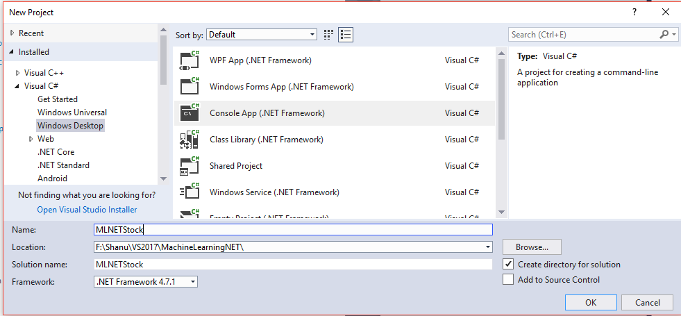

<strong>Step 2 &ndash;&nbsp;Add Microsoft ML package</strong>

Right click on your project and click on Manage NuGet Packages.

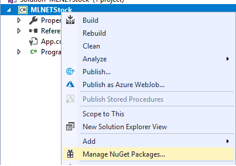

Select Browse tab and search for Microsoft.ML

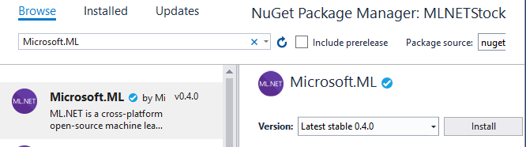

Click on Install, I Accept and wait till the installation complete.

We can see as the Microsoft.ML package was been installed and all the references for Microsoft.ML has been added in our project references.

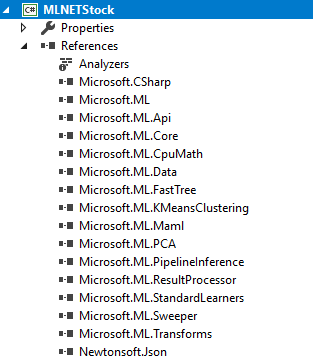

<strong>Step 3 &ndash;&nbsp;Creating Train and Evaluate Data</strong>

Now we need to create a Model training and evaluate dataset. For creating this we will add two csv file one for training and one for the evaluate. We will create a new folder called data in our project to add our csv files.

<strong>Add Data Folder:</strong>

Right click the project and Add New Folder and name the folder as &ldquo;Data&rdquo;

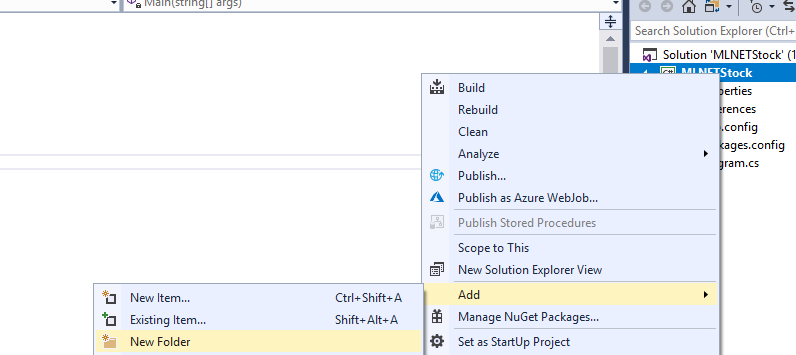

<strong>Creating Train CSV file</strong>

Right click the Data folder click on Add &gt;&gt; New Item &gt;&gt; select the text file and name it as &ldquo;StockTrain.csv&rdquo;

Select the properties of the &ldquo;StockTrain.csv&rdquo; change the Copy to Output Directory to
<strong>&ldquo;Copy always&rdquo;</strong>

<strong></strong>

Add your csv file data like below.

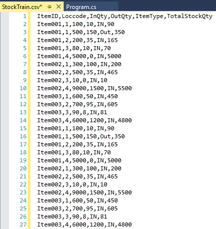

Here we have added the data with the fallowing fields.

Note that we need to fix the label and the features.

<strong>Label: </strong>Label is the field which we need to predict in our sample here TotalStockQty is the Label where we will be predicting the Total remaining Stock Quantity of an item. Other all fields we make it as features.

<strong>ItemID</strong> - Stock Item ID (Feature)

<strong>Loccode</strong> &ndash; Warehouse Location of the Item (Feature)

<strong>InQty</strong> &ndash; Total Item received in location (Feature)

<strong>OutQty</strong> &ndash; Total Item delivered from the location (Feature)

<strong>ItemType</strong> - ItemType &ldquo;In&rdquo; means as local manufactured and &ldquo;out&rdquo; means as outsourced. (Feature)

<strong>TotalStockQty</strong> - Total no of item stock in location.(Label)&nbsp;

Note:&nbsp; we need minimum 100 records of data to be added to train our Model

Same like this we add one more CSV file and add similar information for evaluate. We have created one more csv file name as &ldquo;StockTest.csv&rdquo;&nbsp;&nbsp;

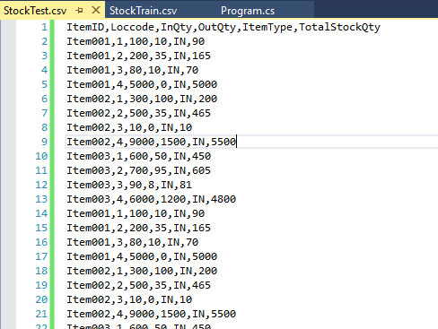

<strong>Step 4 &ndash;&nbsp;Creating Class for Input Data and Prediction</strong>

Now we need to create a class for Input Data and prediction for doing this right click our project and add new class and name it as &ldquo;ItemStock.cs&rdquo;

In our class first, we need to import the Microsoft.ML.Runtime.Api

C#

Edit|Remove

csharp
<pre class="hidden">using Microsoft.ML.Runtime.Api;</pre>

<pre class="csharp">using&nbsp;Microsoft.ML.Runtime.Api;</pre>

Next, we need to add all our columns same like our csv file in same order in our class and set as the column 0 to 5.

C#

Edit|Remove

csharp
<pre class="hidden">public class ItemStock
    {
        [Column(&quot;0&quot;)]
        public string ItemID;

        [Column(&quot;1&quot;)]
        public float Loccode;

        [Column(&quot;2&quot;)]
        public float InQty;

        [Column(&quot;3&quot;)]
        public float OutQty;

        [Column(&quot;4&quot;)]
        public string ItemType;

        [Column(&quot;5&quot;)]
        public float TotalStockQty;
    }
</pre>

<pre class="js">public&nbsp;class&nbsp;ItemStock&nbsp;
&nbsp;&nbsp;&nbsp;&nbsp;{&nbsp;
&nbsp;&nbsp;&nbsp;&nbsp;&nbsp;&nbsp;&nbsp;&nbsp;[Column(&quot;0&quot;)]&nbsp;
&nbsp;&nbsp;&nbsp;&nbsp;&nbsp;&nbsp;&nbsp;&nbsp;public&nbsp;string&nbsp;ItemID;&nbsp;
&nbsp;
&nbsp;&nbsp;&nbsp;&nbsp;&nbsp;&nbsp;&nbsp;&nbsp;[Column(&quot;1&quot;)]&nbsp;
&nbsp;&nbsp;&nbsp;&nbsp;&nbsp;&nbsp;&nbsp;&nbsp;public&nbsp;float&nbsp;Loccode;&nbsp;
&nbsp;
&nbsp;&nbsp;&nbsp;&nbsp;&nbsp;&nbsp;&nbsp;&nbsp;[Column(&quot;2&quot;)]&nbsp;
&nbsp;&nbsp;&nbsp;&nbsp;&nbsp;&nbsp;&nbsp;&nbsp;public&nbsp;float&nbsp;InQty;&nbsp;
&nbsp;
&nbsp;&nbsp;&nbsp;&nbsp;&nbsp;&nbsp;&nbsp;&nbsp;[Column(&quot;3&quot;)]&nbsp;
&nbsp;&nbsp;&nbsp;&nbsp;&nbsp;&nbsp;&nbsp;&nbsp;public&nbsp;float&nbsp;OutQty;&nbsp;
&nbsp;
&nbsp;&nbsp;&nbsp;&nbsp;&nbsp;&nbsp;&nbsp;&nbsp;[Column(&quot;4&quot;)]&nbsp;
&nbsp;&nbsp;&nbsp;&nbsp;&nbsp;&nbsp;&nbsp;&nbsp;public&nbsp;string&nbsp;ItemType;&nbsp;
&nbsp;
&nbsp;&nbsp;&nbsp;&nbsp;&nbsp;&nbsp;&nbsp;&nbsp;[Column(&quot;5&quot;)]&nbsp;
&nbsp;&nbsp;&nbsp;&nbsp;&nbsp;&nbsp;&nbsp;&nbsp;public&nbsp;float&nbsp;TotalStockQty;&nbsp;
&nbsp;&nbsp;&nbsp;&nbsp;}</pre>

Creating prediction class. Now we need to create a prediction class and, in this class, we need to add our Prediction column. Prediction column are same as our label. Our label is &ldquo;TotalStockQty&rdquo;. Our aim of this program is to predict and display
 the final result of the Total Stock quantity from the trained model. We add &ldquo;TotalStockQty&rdquo; as prediction column in our prediction class.

Note: Important to be note is in the prediction column we need to set the column name as the &ldquo;<strong>Score</strong>&rdquo; also set the data type as the float.

In the regression model the <strong>score</strong> column contains the predicted results.

C#

Edit|Remove

csharp
<pre class="hidden">  public class itemStockQtyPrediction
    {
        [ColumnName(&quot;Score&quot;)]
        public float TotalStockQty;
    }</pre>

<pre class="csharp">publicclass&nbsp;itemStockQtyPrediction&nbsp;
&nbsp;&nbsp;&nbsp;&nbsp;{&nbsp;
&nbsp;&nbsp;&nbsp;&nbsp;&nbsp;&nbsp;&nbsp;&nbsp;[ColumnName(&quot;Score&quot;)]&nbsp;
&nbsp;&nbsp;&nbsp;&nbsp;&nbsp;&nbsp;&nbsp;&nbsp;publicfloat&nbsp;TotalStockQty;&nbsp;
&nbsp;&nbsp;&nbsp;&nbsp;}</pre>

<strong>Step 5 &ndash;&nbsp;Program.cs</strong>

To work with ML.NET we open our &ldquo;program.cs&rdquo; file and first we import all the needed ML.NET references.

C#

Edit|Remove

csharp
<pre class="hidden">using Microsoft.ML;
using Microsoft.ML.Data;
using Microsoft.ML.Models;
using Microsoft.ML.Trainers;
using Microsoft.ML.Transforms;
</pre>

<pre class="js">using&nbsp;Microsoft.ML;&nbsp;
using&nbsp;Microsoft.ML.Data;&nbsp;
using&nbsp;Microsoft.ML.Models;&nbsp;
using&nbsp;Microsoft.ML.Trainers;&nbsp;
using&nbsp;Microsoft.ML.Transforms;&nbsp;
</pre>

<strong>Dataset Path</strong>

We set the Traincsv data,Evaluate data and Model data path. For the traindata we give &ldquo;StockTrain.csv&rdquo; path and same like that for the evaluate csv file.

The final trained model needs to be saved for evaluating and produce results. For this we set modelpath with the &ldquo;Model.zip&rdquo; file. The trained model will be saved in the zip fil automatically during runtime of the program our bin folder with
 all needed files.

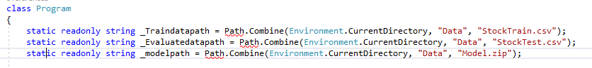

C#

Edit|Remove

csharp
<pre class="hidden">static readonly string _Traindatapath = Path.Combine(Environment.CurrentDirectory, &quot;Data&quot;, &quot;StockTrain.csv&quot;);
 static readonly string _Evaluatedatapath = Path.Combine(Environment.CurrentDirectory, &quot;Data&quot;, &quot;StockTest.csv&quot;);
 static readonly string _modelpath = Path.Combine(Environment.CurrentDirectory, &quot;Data&quot;, &quot;Model.zip&quot;);
</pre>

<pre class="js">static&nbsp;readonly&nbsp;string&nbsp;_Traindatapath&nbsp;=&nbsp;Path.Combine(Environment.CurrentDirectory,&nbsp;&quot;Data&quot;,&nbsp;&quot;StockTrain.csv&quot;);&nbsp;
&nbsp;static&nbsp;readonly&nbsp;string&nbsp;_Evaluatedatapath&nbsp;=&nbsp;Path.Combine(Environment.CurrentDirectory,&nbsp;&quot;Data&quot;,&nbsp;&quot;StockTest.csv&quot;);&nbsp;
&nbsp;static&nbsp;readonly&nbsp;string&nbsp;_modelpath&nbsp;=&nbsp;Path.Combine(Environment.CurrentDirectory,&nbsp;&quot;Data&quot;,&nbsp;&quot;Model.zip&quot;);&nbsp;
</pre>

Change the Main method to async Task Main method like below code.

JavaScript

Edit|Remove

js
<pre class="hidden">static async Task Main(string[] args)
        {
             
        }</pre>

<pre class="js">static&nbsp;async&nbsp;Task&nbsp;Main(string[]&nbsp;args)&nbsp;
&nbsp;&nbsp;&nbsp;&nbsp;&nbsp;&nbsp;&nbsp;&nbsp;{}</pre>

Before doing this, we need to perform 2 important tasks to successfully run our program

First is to set <strong>Platform Target</strong> as <strong>x64.</strong>The ML.NET only runs in x64<strong>,
</strong>for doing this right click the project and<strong> </strong><em>select properties &gt;&gt; Select Build and change the Platform target to x64.</em>

&nbsp;In order to run with our async Task Main method we need the change the Language version to C#7.1

In the Project Properties &gt;&gt; Build tab &gt;&gt; click on Advance button at the bottom and change the
<strong>Language Version</strong> to <strong>C#7.1</strong>

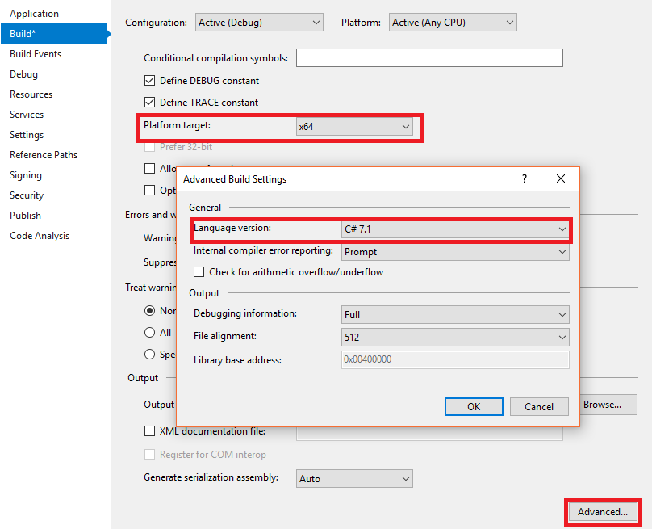

<strong>Working with Training Model</strong>

First, we need to train the model and save the model to the zip file for this in our main method we call the predictionModel method and pass the ItemStock and itemStockQtyPrediction class and return the model to the main method.

C#

Edit|Remove

csharp
<pre class="hidden">static async Task Main(string[] args)
        {
            PredictionModel&lt;ItemStock, itemStockQtyPrediction&gt; model = await TrainourModel();
        }

        public static async Task&lt;PredictionModel&lt;ItemStock, itemStockQtyPrediction&gt;&gt; TrainourModel()
        {
        }
</pre>

<pre class="js">static&nbsp;async&nbsp;Task&nbsp;Main(string[]&nbsp;args)&nbsp;
&nbsp;&nbsp;&nbsp;&nbsp;&nbsp;&nbsp;&nbsp;&nbsp;{&nbsp;
&nbsp;&nbsp;&nbsp;&nbsp;&nbsp;&nbsp;&nbsp;&nbsp;&nbsp;&nbsp;&nbsp;&nbsp;PredictionModel&lt;ItemStock,&nbsp;itemStockQtyPrediction&gt;&nbsp;model&nbsp;=&nbsp;await&nbsp;TrainourModel();&nbsp;
&nbsp;&nbsp;&nbsp;&nbsp;&nbsp;&nbsp;&nbsp;&nbsp;}&nbsp;
&nbsp;
&nbsp;&nbsp;&nbsp;&nbsp;&nbsp;&nbsp;&nbsp;&nbsp;public&nbsp;static&nbsp;async&nbsp;Task&lt;PredictionModel&lt;ItemStock,&nbsp;itemStockQtyPrediction&gt;&gt;&nbsp;TrainourModel()&nbsp;
&nbsp;&nbsp;&nbsp;&nbsp;&nbsp;&nbsp;&nbsp;&nbsp;{}</pre>

<strong>Train and Save Model</strong>

In the above method we add the function to train the model and save the model to the zip file.

<strong>LearningPipeline</strong>

In training the first step will be working the LearningPipeline().

The LearningPipeline loads all the training data to train the model.

<strong>TextLoader</strong>

The TextLoader used to get all the data from tran csv file for training and here we set as the useHeader:true to avaoid reading the first row from the csv file.

<strong>ColumnCopier</strong>

In the training model the important part is the predicted values to be defined.In our example we have set the TotalStockQty as the label .In training model we need to set the prediction label by using the ColumnCopier.we can see in our below code part in
 ColumnCopier we have given the TotalStockQty and Label.

<strong>CategoricalOneHotVectorizer </strong>

The training model needs the numeric features we need to transform the categorial data like our ItemID,ItemType into numbers.

<strong>ColumnConcatenator</strong>

Next, we add all our fratures colums to be trained and evaluate.

<strong>Adding Learning Algorithm</strong>

<strong>FastTreeRegressor</strong>

The learner will train the model.We have selected the regression&nbsp; for our sample and we will be using
<strong>FastTreeRegressor learner </strong>.<strong> FastTreeRegressor </strong>is one of the regression leraner provided by the ML.NET. Here we add the FastTreeRegressor to our pipeline.

<strong>Train and Save Model</strong>

&nbsp;Finally, we will train and save the model from this method.

C#

Edit|Remove

csharp
<pre class="hidden">public static async Task&lt;PredictionModel&lt;ItemStock, itemStockQtyPrediction&gt;&gt; TrainourModel()
        {
            var pipeline = new LearningPipeline
             {
                new TextLoader(_Traindatapath).CreateFrom&lt;ItemStock&gt;(useHeader: true, separator: ','),
                new ColumnCopier((&quot;TotalStockQty&quot;, &quot;Label&quot;)),
                new CategoricalOneHotVectorizer(
                    &quot;ItemID&quot;, 
                    &quot;ItemType&quot;),
                new ColumnConcatenator(
                    &quot;Features&quot;,
                    &quot;ItemID&quot;,
                    &quot;Loccode&quot;,
                   &quot;InQty&quot;,
                    &quot;OutQty&quot;,
                    &quot;ItemType&quot;),
                new FastTreeRegressor()
            };

            PredictionModel&lt;ItemStock, itemStockQtyPrediction&gt; model = pipeline.Train&lt;ItemStock, itemStockQtyPrediction&gt;();

            await model.WriteAsync(_modelpath);
            return model;
        }
</pre>

<pre class="js">public&nbsp;static&nbsp;async&nbsp;Task&lt;PredictionModel&lt;ItemStock,&nbsp;itemStockQtyPrediction&gt;&gt;&nbsp;TrainourModel()&nbsp;
&nbsp;&nbsp;&nbsp;&nbsp;&nbsp;&nbsp;&nbsp;&nbsp;{var&nbsp;pipeline&nbsp;=&nbsp;new&nbsp;LearningPipeline&nbsp;
&nbsp;&nbsp;&nbsp;&nbsp;&nbsp;&nbsp;&nbsp;&nbsp;&nbsp;&nbsp;&nbsp;&nbsp;&nbsp;{new&nbsp;TextLoader(_Traindatapath).CreateFrom&lt;ItemStock&gt;(useHeader:&nbsp;true,&nbsp;separator:&nbsp;','),&nbsp;
&nbsp;&nbsp;&nbsp;&nbsp;&nbsp;&nbsp;&nbsp;&nbsp;&nbsp;&nbsp;&nbsp;&nbsp;&nbsp;&nbsp;&nbsp;&nbsp;new&nbsp;ColumnCopier((&quot;TotalStockQty&quot;,&nbsp;&quot;Label&quot;)),&nbsp;
&nbsp;&nbsp;&nbsp;&nbsp;&nbsp;&nbsp;&nbsp;&nbsp;&nbsp;&nbsp;&nbsp;&nbsp;&nbsp;&nbsp;&nbsp;&nbsp;new&nbsp;CategoricalOneHotVectorizer(&nbsp;
&nbsp;&nbsp;&nbsp;&nbsp;&nbsp;&nbsp;&nbsp;&nbsp;&nbsp;&nbsp;&nbsp;&nbsp;&nbsp;&nbsp;&nbsp;&nbsp;&nbsp;&nbsp;&nbsp;&nbsp;&quot;ItemID&quot;,&nbsp;&nbsp;
&nbsp;&nbsp;&nbsp;&nbsp;&nbsp;&nbsp;&nbsp;&nbsp;&nbsp;&nbsp;&nbsp;&nbsp;&nbsp;&nbsp;&nbsp;&nbsp;&nbsp;&nbsp;&nbsp;&nbsp;&quot;ItemType&quot;),&nbsp;
&nbsp;&nbsp;&nbsp;&nbsp;&nbsp;&nbsp;&nbsp;&nbsp;&nbsp;&nbsp;&nbsp;&nbsp;&nbsp;&nbsp;&nbsp;&nbsp;new&nbsp;ColumnConcatenator(&nbsp;
&nbsp;&nbsp;&nbsp;&nbsp;&nbsp;&nbsp;&nbsp;&nbsp;&nbsp;&nbsp;&nbsp;&nbsp;&nbsp;&nbsp;&nbsp;&nbsp;&nbsp;&nbsp;&nbsp;&nbsp;&quot;Features&quot;,&nbsp;
&nbsp;&nbsp;&nbsp;&nbsp;&nbsp;&nbsp;&nbsp;&nbsp;&nbsp;&nbsp;&nbsp;&nbsp;&nbsp;&nbsp;&nbsp;&nbsp;&nbsp;&nbsp;&nbsp;&nbsp;&quot;ItemID&quot;,&nbsp;
&nbsp;&nbsp;&nbsp;&nbsp;&nbsp;&nbsp;&nbsp;&nbsp;&nbsp;&nbsp;&nbsp;&nbsp;&nbsp;&nbsp;&nbsp;&nbsp;&nbsp;&nbsp;&nbsp;&nbsp;&quot;Loccode&quot;,&nbsp;
&nbsp;&nbsp;&nbsp;&nbsp;&nbsp;&nbsp;&nbsp;&nbsp;&nbsp;&nbsp;&nbsp;&nbsp;&nbsp;&nbsp;&nbsp;&nbsp;&nbsp;&nbsp;&nbsp;&quot;InQty&quot;,&nbsp;
&nbsp;&nbsp;&nbsp;&nbsp;&nbsp;&nbsp;&nbsp;&nbsp;&nbsp;&nbsp;&nbsp;&nbsp;&nbsp;&nbsp;&nbsp;&nbsp;&nbsp;&nbsp;&nbsp;&nbsp;&quot;OutQty&quot;,&nbsp;
&nbsp;&nbsp;&nbsp;&nbsp;&nbsp;&nbsp;&nbsp;&nbsp;&nbsp;&nbsp;&nbsp;&nbsp;&nbsp;&nbsp;&nbsp;&nbsp;&nbsp;&nbsp;&nbsp;&nbsp;&quot;ItemType&quot;),&nbsp;
&nbsp;&nbsp;&nbsp;&nbsp;&nbsp;&nbsp;&nbsp;&nbsp;&nbsp;&nbsp;&nbsp;&nbsp;&nbsp;&nbsp;&nbsp;&nbsp;new&nbsp;FastTreeRegressor()&nbsp;
&nbsp;&nbsp;&nbsp;&nbsp;&nbsp;&nbsp;&nbsp;&nbsp;&nbsp;&nbsp;&nbsp;&nbsp;};&nbsp;
&nbsp;
&nbsp;&nbsp;&nbsp;&nbsp;&nbsp;&nbsp;&nbsp;&nbsp;&nbsp;&nbsp;&nbsp;&nbsp;PredictionModel&lt;ItemStock,&nbsp;itemStockQtyPrediction&gt;&nbsp;model&nbsp;=&nbsp;pipeline.Train&lt;ItemStock,&nbsp;itemStockQtyPrediction&gt;();&nbsp;
&nbsp;
&nbsp;&nbsp;&nbsp;&nbsp;&nbsp;&nbsp;&nbsp;&nbsp;&nbsp;&nbsp;&nbsp;&nbsp;await&nbsp;model.WriteAsync(_modelpath);&nbsp;
&nbsp;&nbsp;&nbsp;&nbsp;&nbsp;&nbsp;&nbsp;&nbsp;&nbsp;&nbsp;&nbsp;&nbsp;return&nbsp;model;&nbsp;
&nbsp;&nbsp;&nbsp;&nbsp;&nbsp;&nbsp;&nbsp;&nbsp;}</pre>

<strong>Evaluate Model</strong>&nbsp;

Next, we need to evaluate the model by checking the model with the test data and predict the final results. For this we call the method Evaluate from our main method and pass the trained model to this method.

C#

Edit|Remove

csharp
<pre class="hidden">  static async Task Main(string[] args)
        {
            PredictionModel&lt;ItemStock, itemStockQtyPrediction&gt; model = await TrainourModel();

            Evaluate(model);
        }</pre>

<pre class="csharp">static&nbsp;async&nbsp;Task&nbsp;Main(string[]&nbsp;args)&nbsp;
&nbsp;&nbsp;&nbsp;&nbsp;&nbsp;&nbsp;&nbsp;&nbsp;{&nbsp;
&nbsp;&nbsp;&nbsp;&nbsp;&nbsp;&nbsp;&nbsp;&nbsp;&nbsp;&nbsp;&nbsp;&nbsp;PredictionModel&lt;ItemStock,&nbsp;itemStockQtyPrediction&gt;&nbsp;model&nbsp;=&nbsp;await&nbsp;TrainourModel();&nbsp;
&nbsp;
&nbsp;&nbsp;&nbsp;&nbsp;&nbsp;&nbsp;&nbsp;&nbsp;&nbsp;&nbsp;&nbsp;&nbsp;Evaluate(model);&nbsp;
&nbsp;&nbsp;&nbsp;&nbsp;&nbsp;&nbsp;&nbsp;&nbsp;}</pre>

In the Evaluate method we pass the trained model.We need to evaluate the model with our sample csv test data.In this method using textlader we load all the data from test data csv file for evaluate the model.

Using RegressionEvaluator method we evaluate the model with the testdata and produce evaluation metrics

We display both the RMS (Root mean Squared) and RSquared metrics value.

RMS is one of evaluation metrics where the lower RMS value is treated as the better model.

RSquared is another evaluation metrics where the value will be between 0 to 1. If the value is closer to 1 is the better model.

C#

Edit|Remove

csharp
<pre class="hidden">   private static void Evaluate(PredictionModel&lt;ItemStock, itemStockQtyPrediction&gt; model)
        {
            var testData = new TextLoader(_Evaluatedatapath).CreateFrom&lt;ItemStock&gt;(useHeader: true, separator: ',');
            var evaluator = new RegressionEvaluator();
            RegressionMetrics metrics = evaluator.Evaluate(model, testData);

            Console.WriteLine($&quot;Rms = {metrics.Rms}&quot;);
            Console.WriteLine($&quot;RSquared = {metrics.RSquared}&quot;);
 
        }
</pre>

<pre class="js">&nbsp;&nbsp;&nbsp;private&nbsp;static&nbsp;void&nbsp;Evaluate(PredictionModel&lt;ItemStock,&nbsp;itemStockQtyPrediction&gt;&nbsp;model)&nbsp;
&nbsp;&nbsp;&nbsp;&nbsp;&nbsp;&nbsp;&nbsp;&nbsp;{var&nbsp;testData&nbsp;=&nbsp;new&nbsp;TextLoader(_Evaluatedatapath).CreateFrom&lt;ItemStock&gt;(useHeader:&nbsp;true,&nbsp;separator:&nbsp;',');&nbsp;
&nbsp;&nbsp;&nbsp;&nbsp;&nbsp;&nbsp;&nbsp;&nbsp;&nbsp;&nbsp;&nbsp;&nbsp;var&nbsp;evaluator&nbsp;=&nbsp;new&nbsp;RegressionEvaluator();&nbsp;
&nbsp;&nbsp;&nbsp;&nbsp;&nbsp;&nbsp;&nbsp;&nbsp;&nbsp;&nbsp;&nbsp;&nbsp;RegressionMetrics&nbsp;metrics&nbsp;=&nbsp;evaluator.Evaluate(model,&nbsp;testData);&nbsp;
&nbsp;
&nbsp;&nbsp;&nbsp;&nbsp;&nbsp;&nbsp;&nbsp;&nbsp;&nbsp;&nbsp;&nbsp;&nbsp;Console.WriteLine($&quot;Rms&nbsp;=&nbsp;{metrics.Rms}&quot;);&nbsp;
&nbsp;&nbsp;&nbsp;&nbsp;&nbsp;&nbsp;&nbsp;&nbsp;&nbsp;&nbsp;&nbsp;&nbsp;Console.WriteLine($&quot;RSquared&nbsp;=&nbsp;{metrics.RSquared}&quot;);&nbsp;
&nbsp;&nbsp;
&nbsp;&nbsp;&nbsp;&nbsp;&nbsp;&nbsp;&nbsp;&nbsp;}</pre>

<strong>Prediction Results</strong>

Now its time for us to produce the result of predicted results by model. For this we will add one more class and, in this Class we will give the inputs.

Create a new Class named as &ldquo;ItemStocks.cs&ldquo;

We add the values to the ItemStock Class which we already created and defined the columns for Model training. Here we have created to stock input and we have given

The values as below.

Note: In each Stock we didn&rsquo;t given the input for the TotalStockQty and we have set the TotalStockQty = 0 as the model need to predict the result from the trained model and produce us the result.

C#

Edit|Remove

csharp
<pre class="hidden">static class ItemStocks
    {
        internal static readonly ItemStock stock1 = new ItemStock
        {
            ItemID = &quot;Item001&quot;,
            Loccode = 1,
            InQty = 100,
            OutQty = 10,
            ItemType = &quot;IN&quot;,
            TotalStockQty = 0 // predict it. Actual Total Stock Quantity is = 90
        };

        internal static readonly ItemStock stock2 = new ItemStock
        {
            ItemID = &quot;Item003&quot;,
            Loccode = 4,
            InQty = 6000,
            OutQty = 1200,
            ItemType = &quot;IN&quot;,
            TotalStockQty = 0 // predict it. Actual Total Stock Quantity is = 4800
        };
    }
</pre>

<pre class="js">static&nbsp;class&nbsp;ItemStocks&nbsp;
&nbsp;&nbsp;&nbsp;&nbsp;{&nbsp;
&nbsp;&nbsp;&nbsp;&nbsp;&nbsp;&nbsp;&nbsp;&nbsp;internal&nbsp;static&nbsp;readonly&nbsp;ItemStock&nbsp;stock1&nbsp;=&nbsp;new&nbsp;ItemStock&nbsp;
&nbsp;&nbsp;&nbsp;&nbsp;&nbsp;&nbsp;&nbsp;&nbsp;{&nbsp;
&nbsp;&nbsp;&nbsp;&nbsp;&nbsp;&nbsp;&nbsp;&nbsp;&nbsp;&nbsp;&nbsp;&nbsp;ItemID&nbsp;=&nbsp;&quot;Item001&quot;,&nbsp;
&nbsp;&nbsp;&nbsp;&nbsp;&nbsp;&nbsp;&nbsp;&nbsp;&nbsp;&nbsp;&nbsp;&nbsp;Loccode&nbsp;=&nbsp;1,&nbsp;
&nbsp;&nbsp;&nbsp;&nbsp;&nbsp;&nbsp;&nbsp;&nbsp;&nbsp;&nbsp;&nbsp;&nbsp;InQty&nbsp;=&nbsp;100,&nbsp;
&nbsp;&nbsp;&nbsp;&nbsp;&nbsp;&nbsp;&nbsp;&nbsp;&nbsp;&nbsp;&nbsp;&nbsp;OutQty&nbsp;=&nbsp;10,&nbsp;
&nbsp;&nbsp;&nbsp;&nbsp;&nbsp;&nbsp;&nbsp;&nbsp;&nbsp;&nbsp;&nbsp;&nbsp;ItemType&nbsp;=&nbsp;&quot;IN&quot;,&nbsp;
&nbsp;&nbsp;&nbsp;&nbsp;&nbsp;&nbsp;&nbsp;&nbsp;&nbsp;&nbsp;&nbsp;&nbsp;TotalStockQty&nbsp;=&nbsp;0//&nbsp;predict&nbsp;it.&nbsp;Actual&nbsp;Total&nbsp;Stock&nbsp;Quantity&nbsp;is&nbsp;=&nbsp;90};&nbsp;
&nbsp;
&nbsp;&nbsp;&nbsp;&nbsp;&nbsp;&nbsp;&nbsp;&nbsp;internal&nbsp;static&nbsp;readonly&nbsp;ItemStock&nbsp;stock2&nbsp;=&nbsp;new&nbsp;ItemStock&nbsp;
&nbsp;&nbsp;&nbsp;&nbsp;&nbsp;&nbsp;&nbsp;&nbsp;{&nbsp;
&nbsp;&nbsp;&nbsp;&nbsp;&nbsp;&nbsp;&nbsp;&nbsp;&nbsp;&nbsp;&nbsp;&nbsp;ItemID&nbsp;=&nbsp;&quot;Item003&quot;,&nbsp;
&nbsp;&nbsp;&nbsp;&nbsp;&nbsp;&nbsp;&nbsp;&nbsp;&nbsp;&nbsp;&nbsp;&nbsp;Loccode&nbsp;=&nbsp;4,&nbsp;
&nbsp;&nbsp;&nbsp;&nbsp;&nbsp;&nbsp;&nbsp;&nbsp;&nbsp;&nbsp;&nbsp;&nbsp;InQty&nbsp;=&nbsp;6000,&nbsp;
&nbsp;&nbsp;&nbsp;&nbsp;&nbsp;&nbsp;&nbsp;&nbsp;&nbsp;&nbsp;&nbsp;&nbsp;OutQty&nbsp;=&nbsp;1200,&nbsp;
&nbsp;&nbsp;&nbsp;&nbsp;&nbsp;&nbsp;&nbsp;&nbsp;&nbsp;&nbsp;&nbsp;&nbsp;ItemType&nbsp;=&nbsp;&quot;IN&quot;,&nbsp;
&nbsp;&nbsp;&nbsp;&nbsp;&nbsp;&nbsp;&nbsp;&nbsp;&nbsp;&nbsp;&nbsp;&nbsp;TotalStockQty&nbsp;=&nbsp;0//&nbsp;predict&nbsp;it.&nbsp;Actual&nbsp;Total&nbsp;Stock&nbsp;Quantity&nbsp;is&nbsp;=&nbsp;4800};&nbsp;
&nbsp;&nbsp;&nbsp;&nbsp;}</pre>

We can see in our StockTrain.csv file we have added the values of above stock1 and we can see as we have given TotalStockQty as 90 and the Model need to predict this result and produce the result.

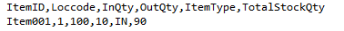

Same like that for Stock2 also we have added the values in the StockTrain.csv file , we can see as we have given TotalStockQty as 4800 and the Model need to predict this result and produce the result.

&nbsp;<strong>Produce the Model Predicted results</strong>

In our program main method, we will add the below code at the bottom after Train and Evaluate method calling to predict the Stock Quantity details and display the final predicted results from model to users in command window.

Here we display both Stock1 and Stock2 prediction results. The prediction.TotalStockQty will have the model predicted results and we display the results to the end users of the predicted Stock Quantity with actual input given by us.

JavaScript

Edit|Remove

js
<pre class="hidden"> Console.WriteLine(&quot;-------First Prediction Vale : ----------------&quot; ); 
 itemStockQtyPrediction prediction = model.Predict(ItemStocks.stock1);
 Console.WriteLine(&quot;Item ID  {0}&quot;, ItemStocks.stock1.ItemID);
 Console.WriteLine(&quot;Predicted Stock: {0}, actual Stock Qty: 90 &quot;,      prediction.TotalStockQty);             
 Console.WriteLine(&quot; &quot;);
 Console.WriteLine(&quot;----------Next Prediction : -------------&quot;);
 Console.WriteLine(&quot; &quot;);
 prediction = model.Predict(ItemStocks.stock2);
 Console.WriteLine(&quot;Item ID  {0}&quot;, ItemStocks.stock2.ItemID);
 Console.WriteLine(&quot;Predicted Stock: {0}, actual Stock Qty: 4800 &quot;,   prediction.TotalStockQty); 
  Console.ReadLine();
</pre>

<pre class="js">&nbsp;Console.WriteLine(&quot;-------First&nbsp;Prediction&nbsp;Vale&nbsp;:&nbsp;----------------&quot;&nbsp;);&nbsp;&nbsp;
&nbsp;itemStockQtyPrediction&nbsp;prediction&nbsp;=&nbsp;model.Predict(ItemStocks.stock1);&nbsp;
&nbsp;Console.WriteLine(&quot;Item&nbsp;ID&nbsp;&nbsp;{0}&quot;,&nbsp;ItemStocks.stock1.ItemID);&nbsp;
&nbsp;Console.WriteLine(&quot;Predicted&nbsp;Stock:&nbsp;{0},&nbsp;actual&nbsp;Stock&nbsp;Qty:&nbsp;90&nbsp;&quot;,&nbsp;&nbsp;&nbsp;&nbsp;&nbsp;&nbsp;prediction.TotalStockQty);&nbsp;&nbsp;&nbsp;&nbsp;&nbsp;&nbsp;&nbsp;&nbsp;&nbsp;&nbsp;&nbsp;&nbsp;&nbsp;&nbsp;
&nbsp;Console.WriteLine(&quot;&nbsp;&quot;);&nbsp;
&nbsp;Console.WriteLine(&quot;----------Next&nbsp;Prediction&nbsp;:&nbsp;-------------&quot;);&nbsp;
&nbsp;Console.WriteLine(&quot;&nbsp;&quot;);&nbsp;
&nbsp;prediction&nbsp;=&nbsp;model.Predict(ItemStocks.stock2);&nbsp;
&nbsp;Console.WriteLine(&quot;Item&nbsp;ID&nbsp;&nbsp;{0}&quot;,&nbsp;ItemStocks.stock2.ItemID);&nbsp;
&nbsp;Console.WriteLine(&quot;Predicted&nbsp;Stock:&nbsp;{0},&nbsp;actual&nbsp;Stock&nbsp;Qty:&nbsp;4800&nbsp;&quot;,&nbsp;&nbsp;&nbsp;prediction.TotalStockQty);&nbsp;&nbsp;
&nbsp;&nbsp;Console.ReadLine();&nbsp;
</pre>

<strong>Build and Run</strong>

When we can run the program, we can see the result in the command window like below.

We can see the Rms value as: 0.052 as we already discussed in this article if the Rms vale is near to 0 then the model is good in prediction and also, we can see the RSquared =0.999 as we already discussed in this article as if the RSquared value is near
 to 1 then the model is good and we can see the predicted result of both the Stock1 and Stock2 as both has predicted same Stock quantity as the actual. Our Model is very good in prediction and the predicted value is exactly same as the actual value.

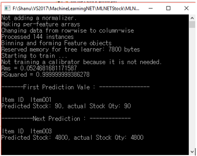

<strong>Trained Model Information </strong>

After we build and run the program we can see the Model.zip file in Data folder inside the Application root bin folder. We can also see our StockTrain and StockTest csv file, The Model will be trained with this csv file and trained model result will be stored
 in Model.zip file for predict the result.

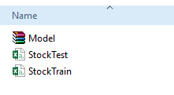

<h1>Source Code Files</h1>
<ul>
<li><em><em>MLNETStock.zip - 2018-08-13.</em></em> </li></ul>
<h1>More Information</h1>

ML.NET (Machine Learning DotNet) is a great framework for all the dotnet lovers who are all looking to work with machine learning. Now only preview version of ML.NET is available and Can&rsquo;t wait till the release of public version of ML.NET. Here in
 this article I have used the regression model to predict and display the Total Stock Quantity. If you are .Net lovers, not aware about Machine Learning and looking forward to work with machine learning then ML.Net is for you all and its great frame work to
 getting started with ML.NET. Hope you all enjoy reading this article and see you all soon with another post.

