# Getting Started with ReactJS Using MVC And WCF REST
## Requires
- Visual Studio 2015
## License
- MIT
## Technologies
- ASP.NET MVC
- WebAPI
- WCF Rest Service
- ReactJS
## Topics
- ASP.NET MVC
- WebAPI
- WCF Rest Service
- ReactJS
## Updated
- 09/06/2015
## Description

<h1>Introduction</h1>

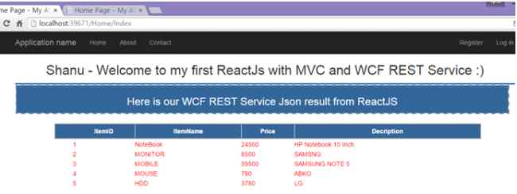

&nbsp;

The main aim to write this article is, there are lot of articles and samples related to MVC and AngularJS but there are not much articles and examples related to ReactJS and MVC and also there is no proper article that are samples which explain how to display
 data from SQL Server data base to MVC page using ReactJS and WCF Rest Service. I planned to explain the following using a simple program: 
 
In this article we will see in detail the following:

<ol>
<li>Create first ReactJS using simple HTML page to display hello message. </li><li>Create ReactJS using simple HTML page to display Data. </li><li>Create ReactJS using MVC and WEB API to display JSON data from Controller to view.
</li><li>Create ReactJS using MVC and WCF Rest Service to display the data from database result to bind in MVC page using ReactJS and WCF Rest Service.
</li></ol>

<strong>What is ReactJS?</strong> 
 
ReactJS is an open source JavaScript library developed by Facebook team and maintained by Facebook and Instagram. ReactJS has only View Part which is nothing but a UI part. In MVC it has (Model View and Controller) and in ReactJS it has only View part. ReactJS
 can be used when dealing with large data which will be frequently changed. The ReactJS script file will be saved as an extension of JSX. 
 
To understand more details about ReactJS kindly check the following reference links.

<ul>
<li><a href="http://facebook.github.io/react/docs/getting-started.html" target="_blank">http://facebook.github.io/react/docs/getting-started.html</a>
</li><li><a href="http://reactjs.net/" target="_blank">http://reactjs.net/</a>
</li><li><a href="http://reactjs.net/getting-started/tutorial.html" target="_blank">http://reactjs.net/getting-started/tutorial.html</a>
</li></ul>
<h1>Building the Sample</h1>
<h2>1. ReactJS and our first Program</h2>

<strong>Step 1:&nbsp;</strong>Add the ReactJS JS link to run our ReactJS html page.

HTML

Edit|Remove

html
<pre class="hidden">&lt;script src=&quot;https://fb.me/react-0.13.3.js&quot;&gt;&lt;/script&gt;
 &lt;script src=&quot;https://fb.me/JSXTransformer-0.13.3.js&quot;&gt;&lt;/script&gt;</pre>

<pre class="js">&lt;script&nbsp;src=&quot;https://fb.me/react-0.13.3.js&quot;&gt;&lt;/script&gt;&nbsp;
&nbsp;&lt;script&nbsp;src=&quot;https://fb.me/JSXTransformer-0.13.3.js&quot;&gt;&lt;/script&gt;</pre>

&nbsp;<strong>Step 2: </strong>In your html body tag declare div tag and give the proper id (name) for the div tag.From ReactJS we display all the result to this div tag.

HTML

Edit|Remove

html
<pre class="hidden">&lt;div id=&quot;myName&quot;&gt;&lt;/div&gt;</pre>

<pre class="js">&lt;div&nbsp;id=&quot;myName&quot;&gt;&lt;/div&gt;</pre>

&nbsp;<strong>Step 3:</strong> Create our first ReactJS script. Here we add the type as =&quot;<strong>text/jsx</strong>&quot;.

HTML

Edit|Remove

html
<pre class="hidden">&lt;script type=&quot;text/jsx&quot;&gt;</pre>

<pre class="js">&lt;script&nbsp;type=&quot;text/jsx&quot;&gt;</pre>

&nbsp;<strong>Step 4: renderComponent</strong> &ndash; In ReactJS we can see many components here render component is to render the result and bind to the DOM (which is our div tag). In the below sample we can see we bind the
<em>NameDisplay</em> component to DOM.

JavaScript

Edit|Remove

js
<pre class="hidden">React.render(
  &lt;NameDisplay  /&gt;,
  document.getElementById('myName')
);</pre>

<pre class="js">React.render(&nbsp;
&nbsp;&nbsp;&lt;NameDisplay&nbsp;&nbsp;/&gt;,&nbsp;
&nbsp;&nbsp;document.getElementById('myName')&nbsp;
);</pre>

&nbsp;<strong>Step 5:</strong> <strong>createClass- </strong>
We can create our own custom component by using <em>React.createClass</em>. We can see the below example here I have create a custom component as
<em>NameDisplay</em> .In this Component I will return the DIV with our message as &ldquo;<em>my Name is Shanu, Welcome to ReactJS</em>&rdquo;.We bind this component to DOM.

HTML

Edit|Remove

html
<pre class="hidden">var NameDisplay = React.createClass({
  render: function() {
    return (
      &lt;div &gt;
        my Name is Shanu,Welcome to ReactJS.
      &lt;/div&gt;</pre>

<pre class="js">var&nbsp;NameDisplay&nbsp;=&nbsp;React.createClass({&nbsp;
&nbsp;&nbsp;render:&nbsp;function()&nbsp;{&nbsp;
&nbsp;&nbsp;&nbsp;&nbsp;return&nbsp;(&nbsp;
&nbsp;&nbsp;&nbsp;&nbsp;&nbsp;&nbsp;&lt;div&nbsp;&gt;&nbsp;
&nbsp;&nbsp;&nbsp;&nbsp;&nbsp;&nbsp;&nbsp;&nbsp;my&nbsp;Name&nbsp;is&nbsp;Shanu,Welcome&nbsp;to&nbsp;ReactJS.&nbsp;
&nbsp;&nbsp;&nbsp;&nbsp;&nbsp;&nbsp;&lt;/div&gt;</pre>

&nbsp;Here is Complete HTML Source Code when we run this below code in browser we see the output like below.

Save this below code as html and open in browser: &ldquo;<em>shanuFirstReactJS.html</em>&rdquo;.&nbsp;

JavaScript

Edit|Remove

js
<pre class="hidden">&lt;!DOCTYPE html&gt;
&lt;html&gt;
  &lt;head&gt;
    &lt;meta charset=&quot;UTF-8&quot; /&gt;
    &lt;title&gt;Welcome to ReactJs&lt;/title&gt;
    &lt;script src=&quot;https://fb.me/react-0.13.3.js&quot;&gt;&lt;/script&gt;
    &lt;script src=&quot;https://fb.me/JSXTransformer-0.13.3.js&quot;&gt;&lt;/script&gt;
  &lt;/head&gt;
  &lt;body&gt;
    &lt;div id=&quot;myName&quot;&gt;&lt;/div&gt;
   &lt;script type=&quot;text/jsx&quot;&gt;
var NameDisplay = React.createClass({
  render: function() {
    return (
      &lt;div &gt;
        my Name is Shanu,Welcome to ReactJS.
      &lt;/div&gt;
    );
  }
});

React.render(
  &lt;NameDisplay  /&gt;,
  document.getElementById('myName')
);
    &lt;/script&gt;
  &lt;/body&gt;
&lt;/html&gt;</pre>

<pre class="js">&lt;!DOCTYPE&nbsp;html&gt;&nbsp;
&lt;html&gt;&nbsp;
&nbsp;&nbsp;&lt;head&gt;&nbsp;
&nbsp;&nbsp;&nbsp;&nbsp;&lt;meta&nbsp;charset=&quot;UTF-8&quot;&nbsp;/&gt;&nbsp;
&nbsp;&nbsp;&nbsp;&nbsp;&lt;title&gt;Welcome&nbsp;to&nbsp;ReactJs&lt;/title&gt;&nbsp;
&nbsp;&nbsp;&nbsp;&nbsp;&lt;script&nbsp;src=&quot;https://fb.me/react-0.13.3.js&quot;&gt;&lt;/script&gt;&nbsp;
&nbsp;&nbsp;&nbsp;&nbsp;&lt;script&nbsp;src=&quot;https://fb.me/JSXTransformer-0.13.3.js&quot;&gt;&lt;/script&gt;&nbsp;
&nbsp;&nbsp;&lt;/head&gt;&nbsp;
&nbsp;&nbsp;&lt;body&gt;&nbsp;
&nbsp;&nbsp;&nbsp;&nbsp;&lt;div&nbsp;id=&quot;myName&quot;&gt;&lt;/div&gt;&nbsp;
&nbsp;&nbsp;&nbsp;&lt;script&nbsp;type=&quot;text/jsx&quot;&gt;&nbsp;
var&nbsp;NameDisplay&nbsp;=&nbsp;React.createClass({&nbsp;
&nbsp;&nbsp;render:&nbsp;function()&nbsp;{return&nbsp;(&nbsp;
&nbsp;&nbsp;&nbsp;&nbsp;&nbsp;&nbsp;&lt;div&nbsp;&gt;&nbsp;
&nbsp;&nbsp;&nbsp;&nbsp;&nbsp;&nbsp;&nbsp;&nbsp;my&nbsp;Name&nbsp;is&nbsp;Shanu,Welcome&nbsp;to&nbsp;ReactJS.&nbsp;
&nbsp;&nbsp;&nbsp;&nbsp;&nbsp;&nbsp;&lt;/div&gt;&nbsp;
&nbsp;&nbsp;&nbsp;&nbsp;);&nbsp;
&nbsp;&nbsp;}});&nbsp;
&nbsp;
React.render(&nbsp;
&nbsp;&nbsp;&lt;NameDisplay&nbsp;&nbsp;/&gt;,&nbsp;
&nbsp;&nbsp;document.getElementById('myName')&nbsp;
);&nbsp;
&nbsp;&nbsp;&nbsp;&nbsp;&lt;/script&gt;&nbsp;
&nbsp;&nbsp;&lt;/body&gt;&nbsp;
&lt;/html&gt;</pre>

2. Create ReactJS using simple HTML page to display Data

Hope now you have some basic understanding of ReactJS for more kindly refer to the above reference links. Now let&rsquo;s see how to declare a variable and display the variable data in ReactJS.&nbsp;

<strong>Step 1:</strong> Declare a variable and add the sample data like below:

HTML

Edit|Remove

html
<pre class="hidden">var data = [      
        { Count : 1, Author: &quot;Shanu&quot;, Bookdesc: &quot;C# Book written by Shanu &quot; , NAMES: &quot;C#&quot;},
        {  Count : 2, Author: &quot;Afreen&quot;, Bookdesc: &quot;C# Book written by Shanu &quot; , NAMES: &quot;REACTJS&quot;},
        {  Count : 3, Author: &quot;Afraz&quot;, Bookdesc: &quot;ASP.NET MVC Book written by Shanu &quot;, NAMES: &quot;ASP.NET MVC&quot; }  ];</pre>

<pre class="js">var&nbsp;data&nbsp;=&nbsp;[&nbsp;&nbsp;&nbsp;&nbsp;&nbsp;&nbsp;&nbsp;
&nbsp;&nbsp;&nbsp;&nbsp;&nbsp;&nbsp;&nbsp;&nbsp;{&nbsp;Count&nbsp;:&nbsp;1,&nbsp;Author:&nbsp;&quot;Shanu&quot;,&nbsp;Bookdesc:&nbsp;&quot;C#&nbsp;Book&nbsp;written&nbsp;by&nbsp;Shanu&nbsp;&quot;&nbsp;,&nbsp;NAMES:&nbsp;&quot;C#&quot;},&nbsp;
&nbsp;&nbsp;&nbsp;&nbsp;&nbsp;&nbsp;&nbsp;&nbsp;{&nbsp;&nbsp;Count&nbsp;:&nbsp;2,&nbsp;Author:&nbsp;&quot;Afreen&quot;,&nbsp;Bookdesc:&nbsp;&quot;C#&nbsp;Book&nbsp;written&nbsp;by&nbsp;Shanu&nbsp;&quot;&nbsp;,&nbsp;NAMES:&nbsp;&quot;REACTJS&quot;},&nbsp;
&nbsp;&nbsp;&nbsp;&nbsp;&nbsp;&nbsp;&nbsp;&nbsp;{&nbsp;&nbsp;Count&nbsp;:&nbsp;3,&nbsp;Author:&nbsp;&quot;Afraz&quot;,&nbsp;Bookdesc:&nbsp;&quot;ASP.NET&nbsp;MVC&nbsp;Book&nbsp;written&nbsp;by&nbsp;Shanu&nbsp;&quot;,&nbsp;NAMES:&nbsp;&quot;ASP.NET&nbsp;MVC&quot;&nbsp;}&nbsp;&nbsp;];</pre>

&nbsp;<strong>Step 2:</strong> Same like above code we create our own Custom Component using React.createClass this time in the main component I have passed the result data to another component named as BooksList.

HTML

Edit|Remove

html
<pre class="hidden">var BooksContainer = React.createClass({
    render: function() {
        return (
         &lt;div className=&quot;commentBox&quot;&gt;
            &lt;h1&gt;Book Details&lt;/h1&gt;</pre>

<pre class="js">var&nbsp;BooksContainer&nbsp;=&nbsp;React.createClass({&nbsp;
&nbsp;&nbsp;&nbsp;&nbsp;render:&nbsp;function()&nbsp;{&nbsp;
&nbsp;&nbsp;&nbsp;&nbsp;&nbsp;&nbsp;&nbsp;&nbsp;return&nbsp;(&nbsp;
&nbsp;&nbsp;&nbsp;&nbsp;&nbsp;&nbsp;&nbsp;&nbsp;&nbsp;&lt;div&nbsp;className=&quot;commentBox&quot;&gt;&nbsp;
&nbsp;&nbsp;&nbsp;&nbsp;&nbsp;&nbsp;&nbsp;&nbsp;&nbsp;&nbsp;&nbsp;&nbsp;&lt;h1&gt;Book&nbsp;Details&lt;/h1&gt;</pre>

&nbsp;<strong>Step 3:</strong> In <em>BooksList</em> component I display data one by one from the
<em>bookArray</em> component. 
Save this below code as html and open in browser: &ldquo;<em>BookDetailsReactJs.html</em>&rdquo;.

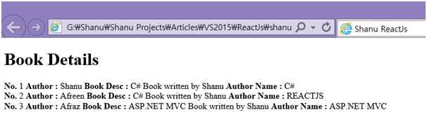

HTML

Edit|Remove

html
<pre class="hidden">&lt;!DOCTYPE html&gt;
&lt;html&gt;
  &lt;head&gt;
    &lt;meta charset=&quot;UTF-8&quot; /&gt;
    &lt;title&gt;Shanu ReactJs&lt;/title&gt;
    &lt;script src=&quot;https://fb.me/react-0.13.3.js&quot;&gt;&lt;/script&gt;
    &lt;script src=&quot;https://fb.me/JSXTransformer-0.13.3.js&quot;&gt;&lt;/script&gt;
  &lt;/head&gt;
  &lt;body&gt;
    &lt;div id=&quot;bookContainer&quot;&gt;&lt;/div&gt;
    &lt;script type=&quot;text/jsx&quot;&gt;

var data = [      
        { Count : 1, Author: &quot;Shanu&quot;, Bookdesc: &quot;C# Book written by Shanu &quot; , NAMES: &quot;C#&quot;},
        {  Count : 2, Author: &quot;Afreen&quot;, Bookdesc: &quot;C# Book written by Shanu &quot; , NAMES: &quot;REACTJS&quot;},
        {  Count : 3, Author: &quot;Afraz&quot;, Bookdesc: &quot;ASP.NET MVC Book written by Shanu &quot;, NAMES: &quot;ASP.NET MVC&quot; }
];

var BooksList = React.createClass({
  render: function() {
    var bookDetails = this.props.data.map(function (book) {
      return (
        &lt;bookArray&gt;
            &lt;b&gt;No.  &lt;/b&gt; {book.Count} 
            &lt;b&gt; Author : &lt;/b&gt; {book.Author} 
            &lt;b&gt; Book Desc :   &lt;/b&gt;   {book.Bookdesc}
            &lt;b&gt; Author Name :  &lt;/b&gt; {book.NAMES}
           &lt;br /&gt;
        &lt;/bookArray&gt;
      );
    });
    return (
      &lt;div &gt;
          {bookDetails}
     &lt;/div&gt;
    );
  }
});

var bookArray = React.createClass({
    render: function() {
        return (
          &lt;div &gt;          
        {this.props.children}
        &lt;/div&gt;
      );
    }
});

var BooksContainer = React.createClass({
    render: function() {
        return (
          &lt;div className=&quot;commentBox&quot;&gt;
            &lt;h1&gt;Book Details&lt;/h1&gt;     
            &lt;BooksList data={this.props.data} /&gt;
                &lt;/div&gt;
      );
    }
});

React.render(
  &lt;BooksContainer data={data} /&gt;,
  document.getElementById('bookContainer')
);

    &lt;/script&gt;
  &lt;/body&gt;
&lt;/html&gt;</pre>

<pre class="js">&lt;!DOCTYPE&nbsp;html&gt;&nbsp;
&lt;html&gt;&nbsp;
&nbsp;&nbsp;&lt;head&gt;&nbsp;
&nbsp;&nbsp;&nbsp;&nbsp;&lt;meta&nbsp;charset=&quot;UTF-8&quot;&nbsp;/&gt;&nbsp;
&nbsp;&nbsp;&nbsp;&nbsp;&lt;title&gt;Shanu&nbsp;ReactJs&lt;/title&gt;&nbsp;
&nbsp;&nbsp;&nbsp;&nbsp;&lt;script&nbsp;src=&quot;https://fb.me/react-0.13.3.js&quot;&gt;&lt;/script&gt;&nbsp;
&nbsp;&nbsp;&nbsp;&nbsp;&lt;script&nbsp;src=&quot;https://fb.me/JSXTransformer-0.13.3.js&quot;&gt;&lt;/script&gt;&nbsp;
&nbsp;&nbsp;&lt;/head&gt;&nbsp;
&nbsp;&nbsp;&lt;body&gt;&nbsp;
&nbsp;&nbsp;&nbsp;&nbsp;&lt;div&nbsp;id=&quot;bookContainer&quot;&gt;&lt;/div&gt;&nbsp;
&nbsp;&nbsp;&nbsp;&nbsp;&lt;script&nbsp;type=&quot;text/jsx&quot;&gt;&nbsp;
&nbsp;
var&nbsp;data&nbsp;=&nbsp;[&nbsp;&nbsp;&nbsp;&nbsp;&nbsp;&nbsp;&nbsp;
&nbsp;&nbsp;&nbsp;&nbsp;&nbsp;&nbsp;&nbsp;&nbsp;{&nbsp;Count&nbsp;:&nbsp;1,&nbsp;Author:&nbsp;&quot;Shanu&quot;,&nbsp;Bookdesc:&nbsp;&quot;C#&nbsp;Book&nbsp;written&nbsp;by&nbsp;Shanu&nbsp;&quot;&nbsp;,&nbsp;NAMES:&nbsp;&quot;C#&quot;},&nbsp;
&nbsp;&nbsp;&nbsp;&nbsp;&nbsp;&nbsp;&nbsp;&nbsp;{&nbsp;&nbsp;Count&nbsp;:&nbsp;2,&nbsp;Author:&nbsp;&quot;Afreen&quot;,&nbsp;Bookdesc:&nbsp;&quot;C#&nbsp;Book&nbsp;written&nbsp;by&nbsp;Shanu&nbsp;&quot;&nbsp;,&nbsp;NAMES:&nbsp;&quot;REACTJS&quot;},&nbsp;
&nbsp;&nbsp;&nbsp;&nbsp;&nbsp;&nbsp;&nbsp;&nbsp;{&nbsp;&nbsp;Count&nbsp;:&nbsp;3,&nbsp;Author:&nbsp;&quot;Afraz&quot;,&nbsp;Bookdesc:&nbsp;&quot;ASP.NET&nbsp;MVC&nbsp;Book&nbsp;written&nbsp;by&nbsp;Shanu&nbsp;&quot;,&nbsp;NAMES:&nbsp;&quot;ASP.NET&nbsp;MVC&quot;&nbsp;}&nbsp;
];&nbsp;
&nbsp;
var&nbsp;BooksList&nbsp;=&nbsp;React.createClass({&nbsp;
&nbsp;&nbsp;render:&nbsp;function()&nbsp;{&nbsp;
&nbsp;&nbsp;&nbsp;&nbsp;var&nbsp;bookDetails&nbsp;=&nbsp;this.props.data.map(function&nbsp;(book)&nbsp;{&nbsp;
&nbsp;&nbsp;&nbsp;&nbsp;&nbsp;&nbsp;return&nbsp;(&nbsp;
&nbsp;&nbsp;&nbsp;&nbsp;&nbsp;&nbsp;&nbsp;&nbsp;&lt;bookArray&gt;&nbsp;
&nbsp;&nbsp;&nbsp;&nbsp;&nbsp;&nbsp;&nbsp;&nbsp;&nbsp;&nbsp;&nbsp;&nbsp;&lt;b&gt;No.&nbsp;&nbsp;&lt;/b&gt;&nbsp;{book.Count}&nbsp;&nbsp;
&nbsp;&nbsp;&nbsp;&nbsp;&nbsp;&nbsp;&nbsp;&nbsp;&nbsp;&nbsp;&nbsp;&nbsp;&lt;b&gt;&nbsp;Author&nbsp;:&nbsp;&lt;/b&gt;&nbsp;{book.Author}&nbsp;&nbsp;
&nbsp;&nbsp;&nbsp;&nbsp;&nbsp;&nbsp;&nbsp;&nbsp;&nbsp;&nbsp;&nbsp;&nbsp;&lt;b&gt;&nbsp;Book&nbsp;Desc&nbsp;:&nbsp;&nbsp;&nbsp;&lt;/b&gt;&nbsp;&nbsp;&nbsp;{book.Bookdesc}&nbsp;
&nbsp;&nbsp;&nbsp;&nbsp;&nbsp;&nbsp;&nbsp;&nbsp;&nbsp;&nbsp;&nbsp;&nbsp;&lt;b&gt;&nbsp;Author&nbsp;Name&nbsp;:&nbsp;&nbsp;&lt;/b&gt;&nbsp;{book.NAMES}&nbsp;
&nbsp;&nbsp;&nbsp;&nbsp;&nbsp;&nbsp;&nbsp;&nbsp;&nbsp;&nbsp;&nbsp;&lt;br&nbsp;/&gt;&nbsp;
&nbsp;&nbsp;&nbsp;&nbsp;&nbsp;&nbsp;&nbsp;&nbsp;&lt;/bookArray&gt;&nbsp;
&nbsp;&nbsp;&nbsp;&nbsp;&nbsp;&nbsp;);&nbsp;
&nbsp;&nbsp;&nbsp;&nbsp;});&nbsp;
&nbsp;&nbsp;&nbsp;&nbsp;return&nbsp;(&nbsp;
&nbsp;&nbsp;&nbsp;&nbsp;&nbsp;&nbsp;&lt;div&nbsp;&gt;&nbsp;
&nbsp;&nbsp;&nbsp;&nbsp;&nbsp;&nbsp;&nbsp;&nbsp;&nbsp;&nbsp;{bookDetails}&nbsp;
&nbsp;&nbsp;&nbsp;&nbsp;&nbsp;&lt;/div&gt;&nbsp;
&nbsp;&nbsp;&nbsp;&nbsp;);&nbsp;
&nbsp;&nbsp;}&nbsp;
});&nbsp;
&nbsp;
var&nbsp;bookArray&nbsp;=&nbsp;React.createClass({&nbsp;
&nbsp;&nbsp;&nbsp;&nbsp;render:&nbsp;function()&nbsp;{&nbsp;
&nbsp;&nbsp;&nbsp;&nbsp;&nbsp;&nbsp;&nbsp;&nbsp;return&nbsp;(&nbsp;
&nbsp;&nbsp;&nbsp;&nbsp;&nbsp;&nbsp;&nbsp;&nbsp;&nbsp;&nbsp;&lt;div&nbsp;&gt;&nbsp;&nbsp;&nbsp;&nbsp;&nbsp;&nbsp;&nbsp;&nbsp;&nbsp;&nbsp;&nbsp;
&nbsp;&nbsp;&nbsp;&nbsp;&nbsp;&nbsp;&nbsp;&nbsp;{this.props.children}&nbsp;
&nbsp;&nbsp;&nbsp;&nbsp;&nbsp;&nbsp;&nbsp;&nbsp;&lt;/div&gt;&nbsp;
&nbsp;&nbsp;&nbsp;&nbsp;&nbsp;&nbsp;);&nbsp;
&nbsp;&nbsp;&nbsp;&nbsp;}&nbsp;
});&nbsp;
&nbsp;
var&nbsp;BooksContainer&nbsp;=&nbsp;React.createClass({&nbsp;
&nbsp;&nbsp;&nbsp;&nbsp;render:&nbsp;function()&nbsp;{&nbsp;
&nbsp;&nbsp;&nbsp;&nbsp;&nbsp;&nbsp;&nbsp;&nbsp;return&nbsp;(&nbsp;
&nbsp;&nbsp;&nbsp;&nbsp;&nbsp;&nbsp;&nbsp;&nbsp;&nbsp;&nbsp;&lt;div&nbsp;className=&quot;commentBox&quot;&gt;&nbsp;
&nbsp;&nbsp;&nbsp;&nbsp;&nbsp;&nbsp;&nbsp;&nbsp;&nbsp;&nbsp;&nbsp;&nbsp;&lt;h1&gt;Book&nbsp;Details&lt;/h1&gt;&nbsp;&nbsp;&nbsp;&nbsp;&nbsp;&nbsp;
&nbsp;&nbsp;&nbsp;&nbsp;&nbsp;&nbsp;&nbsp;&nbsp;&nbsp;&nbsp;&nbsp;&nbsp;&lt;BooksList&nbsp;data={this.props.data}&nbsp;/&gt;&nbsp;
&nbsp;&nbsp;&nbsp;&nbsp;&nbsp;&nbsp;&nbsp;&nbsp;&nbsp;&nbsp;&nbsp;&nbsp;&nbsp;&nbsp;&nbsp;&nbsp;&lt;/div&gt;&nbsp;
&nbsp;&nbsp;&nbsp;&nbsp;&nbsp;&nbsp;);&nbsp;
&nbsp;&nbsp;&nbsp;&nbsp;}&nbsp;
});&nbsp;
&nbsp;
React.render(&nbsp;
&nbsp;&nbsp;&lt;BooksContainer&nbsp;data={data}&nbsp;/&gt;,&nbsp;
&nbsp;&nbsp;document.getElementById('bookContainer')&nbsp;
);&nbsp;
&nbsp;
&nbsp;&nbsp;&nbsp;&nbsp;&lt;/script&gt;&nbsp;
&nbsp;&nbsp;&lt;/body&gt;&nbsp;
&lt;/html&gt;</pre>

&nbsp;Description

So for we have seen a sample program using html and ReactJS .Now we see how to use ReactJS in MVC.

<strong>Prerequisites</strong> 
Visual Studio 2015. You can download it from <a href="https://www.visualstudio.com/en-us/downloads/visual-studio-2015-downloads-vs.aspx" target="_blank">
here</a>.

<h2>3. Simple MVC, ReactJS and Web API to display JSON from controller to MVC View using React JS</h2>

Create our MVC web application in Visual Studio 2015. After installing our Visual Studio 2015, click Start -&gt; Programs then select Visual Studio 2015 then click Visual Studio 2015. 
 
Click New -&gt; Project then select Web -&gt; ASP.NET Web Application. Select your project location and enter your web application name.

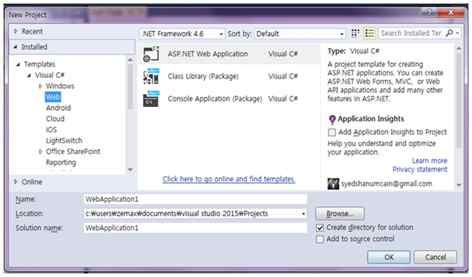

Select MVC and in Add Folders and Core reference for. Select the Web API and click OK.

<h1>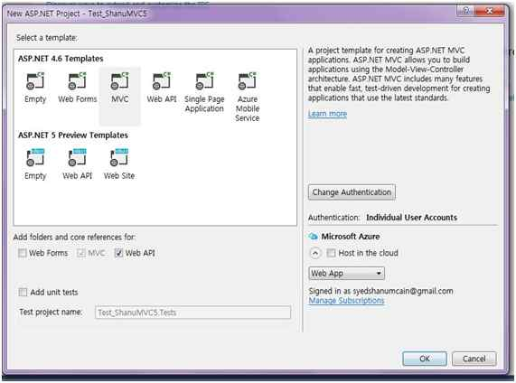</h1>

Once our MVC application created next step is to add <em>ReactJS</em> to our application.

<strong>Home Controller</strong> 
In your home controller add the below method to return the JSON result. Here i am returning ItemName and price .We need to give the URL as
<em>/Home/GetMessage</em> to get the result in our ReactJS script.

C#

Edit|Remove

csharp
<pre class="hidden">public JsonResult GetItemDetails()
{
return Json(new { ItemName = &quot;Samsung Notebook / &quot;,Price=&quot; 1500 RS &quot; }, JsonRequestBehavior.AllowGet);
  }</pre>

<pre class="csharp">public&nbsp;JsonResult&nbsp;GetItemDetails()&nbsp;
{&nbsp;
return&nbsp;Json(new&nbsp;{&nbsp;ItemName&nbsp;=&nbsp;&quot;Samsung&nbsp;Notebook&nbsp;/&nbsp;&quot;,Price=&quot;&nbsp;1500&nbsp;RS&nbsp;&quot;&nbsp;},&nbsp;JsonRequestBehavior.AllowGet);&nbsp;
&nbsp;&nbsp;}</pre>

&nbsp;<strong>Installing ReactJS package</strong> 
 
If the ReactJS package is missing then add the package to your project. 
 
Right-click your MVC project and click Manage NuGet Packages. Search for ReactJS - &gt; Select ReactJS tools for ASP.NET MVC 4 and 5 and click Install.

&nbsp;

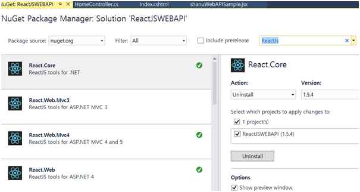

<strong>Creating our JSX file</strong> 
 
Right Click Scripts folder and Click Add -&gt; New Item. 
 
Select Web -&gt; Select JavaScript File -&gt; Enter script file name with &ldquo;<strong>JSX</strong>&rdquo; extension for example like &ldquo;<em>shanuWebAPISample.jsx</em>&rdquo; and click ADD. 
&nbsp;&nbsp; 

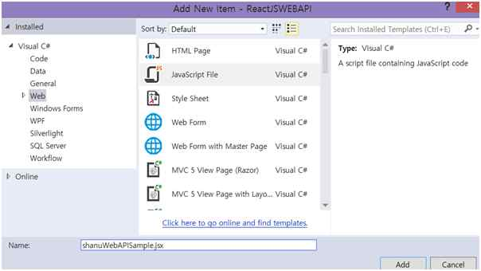

Now we can see our JSX file has been created.Here we can add our ReactJS script.Here is the complete code of our JSX which will display the data result to MVC View .

JavaScript

Edit|Remove

js
<pre class="hidden">var App = React.createClass({
              getInitialState: function(){
                     return{data: []};
              },

              componentWillMount: function(){
              var xhr = new XMLHttpRequest();
              xhr.open('get', this.props.url, true);
              xhr.onload = function() {
                var webAPIData = JSON.parse(xhr.responseText);
               this.setState({ data: webAPIData });
              }.bind(this);
              xhr.send();
       },

       render: function(){
            return (
               &lt;h2&gt;{this.state.data}&lt;/h2&gt;
            );
        }
});

React.render(&lt;App url=&quot;/Home/GetMessage&quot; /&gt;, document.getElementById('reactContent'));</pre>

<pre class="js">var&nbsp;App&nbsp;=&nbsp;React.createClass({&nbsp;
&nbsp;&nbsp;&nbsp;&nbsp;&nbsp;&nbsp;&nbsp;&nbsp;&nbsp;&nbsp;&nbsp;&nbsp;&nbsp;&nbsp;getInitialState:&nbsp;function(){&nbsp;
&nbsp;&nbsp;&nbsp;&nbsp;&nbsp;&nbsp;&nbsp;&nbsp;&nbsp;&nbsp;&nbsp;&nbsp;&nbsp;&nbsp;&nbsp;&nbsp;&nbsp;&nbsp;&nbsp;&nbsp;&nbsp;return{data:&nbsp;[]};&nbsp;
&nbsp;&nbsp;&nbsp;&nbsp;&nbsp;&nbsp;&nbsp;&nbsp;&nbsp;&nbsp;&nbsp;&nbsp;&nbsp;&nbsp;},&nbsp;
&nbsp;
&nbsp;&nbsp;&nbsp;&nbsp;&nbsp;&nbsp;&nbsp;&nbsp;&nbsp;&nbsp;&nbsp;&nbsp;&nbsp;&nbsp;componentWillMount:&nbsp;function(){&nbsp;
&nbsp;&nbsp;&nbsp;&nbsp;&nbsp;&nbsp;&nbsp;&nbsp;&nbsp;&nbsp;&nbsp;&nbsp;&nbsp;&nbsp;var&nbsp;xhr&nbsp;=&nbsp;new&nbsp;XMLHttpRequest();&nbsp;
&nbsp;&nbsp;&nbsp;&nbsp;&nbsp;&nbsp;&nbsp;&nbsp;&nbsp;&nbsp;&nbsp;&nbsp;&nbsp;&nbsp;xhr.open('get',&nbsp;this.props.url,&nbsp;true);&nbsp;
&nbsp;&nbsp;&nbsp;&nbsp;&nbsp;&nbsp;&nbsp;&nbsp;&nbsp;&nbsp;&nbsp;&nbsp;&nbsp;&nbsp;xhr.onload&nbsp;=&nbsp;function()&nbsp;{&nbsp;
&nbsp;&nbsp;&nbsp;&nbsp;&nbsp;&nbsp;&nbsp;&nbsp;&nbsp;&nbsp;&nbsp;&nbsp;&nbsp;&nbsp;&nbsp;&nbsp;var&nbsp;webAPIData&nbsp;=&nbsp;JSON.parse(xhr.responseText);&nbsp;
&nbsp;&nbsp;&nbsp;&nbsp;&nbsp;&nbsp;&nbsp;&nbsp;&nbsp;&nbsp;&nbsp;&nbsp;&nbsp;&nbsp;&nbsp;this.setState({&nbsp;data:&nbsp;webAPIData&nbsp;});&nbsp;
&nbsp;&nbsp;&nbsp;&nbsp;&nbsp;&nbsp;&nbsp;&nbsp;&nbsp;&nbsp;&nbsp;&nbsp;&nbsp;&nbsp;}.bind(this);&nbsp;
&nbsp;&nbsp;&nbsp;&nbsp;&nbsp;&nbsp;&nbsp;&nbsp;&nbsp;&nbsp;&nbsp;&nbsp;&nbsp;&nbsp;xhr.send();&nbsp;
&nbsp;&nbsp;&nbsp;&nbsp;&nbsp;&nbsp;&nbsp;},&nbsp;
&nbsp;
&nbsp;&nbsp;&nbsp;&nbsp;&nbsp;&nbsp;&nbsp;render:&nbsp;function(){&nbsp;
&nbsp;&nbsp;&nbsp;&nbsp;&nbsp;&nbsp;&nbsp;&nbsp;&nbsp;&nbsp;&nbsp;&nbsp;return&nbsp;(&nbsp;
&nbsp;&nbsp;&nbsp;&nbsp;&nbsp;&nbsp;&nbsp;&nbsp;&nbsp;&nbsp;&nbsp;&nbsp;&nbsp;&nbsp;&nbsp;&lt;h2&gt;{this.state.data}&lt;/h2&gt;&nbsp;
&nbsp;&nbsp;&nbsp;&nbsp;&nbsp;&nbsp;&nbsp;&nbsp;&nbsp;&nbsp;&nbsp;&nbsp;);&nbsp;
&nbsp;&nbsp;&nbsp;&nbsp;&nbsp;&nbsp;&nbsp;&nbsp;}&nbsp;
});&nbsp;
&nbsp;
React.render(&lt;App&nbsp;url=&quot;/Home/GetMessage&quot;&nbsp;/&gt;,&nbsp;document.getElementById('reactContent'));</pre>

&nbsp;<strong>Code part Explanation:</strong>

JavaScript

Edit|Remove

js
<pre class="hidden">React.render(&lt;App url=&quot;/Home/GetMessage&quot; /&gt;, document.getElementById('reactContent'));</pre>

<pre class="js">React.render(&lt;App&nbsp;url=&quot;/Home/GetMessage&quot;&nbsp;/&gt;,&nbsp;document.getElementById('reactContent'));</pre>

In React.render here first we pass our WEB API url (our controller and Method name ) to get the result.The final result has been bind to the DOM.

In our custom Component&nbsp; we create a Class and get the JSOn result data by passing the URL and final result has been renderd(displayed to our Div) tag by using the &gt;{this.state.data}

JavaScript

Edit|Remove

js
<pre class="hidden">var App = React.createClass({
              getInitialState: function(){
                     return{data: []};
              },

              componentWillMount: function(){
              var xhr = new XMLHttpRequest();
              xhr.open('get', this.props.url, true);
              xhr.onload = function() {
                var webAPIData = JSON.parse(xhr.responseText);
                this.setState({ data: webAPIData });
              }.bind(this);
              xhr.send();
       },

        render: function(){
            return (
               &lt;h2&gt;{this.state.data}&lt;/h2&gt;</pre>

<pre class="js">var&nbsp;App&nbsp;=&nbsp;React.createClass({&nbsp;
&nbsp;&nbsp;&nbsp;&nbsp;&nbsp;&nbsp;&nbsp;&nbsp;&nbsp;&nbsp;&nbsp;&nbsp;&nbsp;&nbsp;getInitialState:&nbsp;function(){&nbsp;
&nbsp;&nbsp;&nbsp;&nbsp;&nbsp;&nbsp;&nbsp;&nbsp;&nbsp;&nbsp;&nbsp;&nbsp;&nbsp;&nbsp;&nbsp;&nbsp;&nbsp;&nbsp;&nbsp;&nbsp;&nbsp;return{data:&nbsp;[]};&nbsp;
&nbsp;&nbsp;&nbsp;&nbsp;&nbsp;&nbsp;&nbsp;&nbsp;&nbsp;&nbsp;&nbsp;&nbsp;&nbsp;&nbsp;},&nbsp;
&nbsp;
&nbsp;&nbsp;&nbsp;&nbsp;&nbsp;&nbsp;&nbsp;&nbsp;&nbsp;&nbsp;&nbsp;&nbsp;&nbsp;&nbsp;componentWillMount:&nbsp;function(){&nbsp;
&nbsp;&nbsp;&nbsp;&nbsp;&nbsp;&nbsp;&nbsp;&nbsp;&nbsp;&nbsp;&nbsp;&nbsp;&nbsp;&nbsp;var&nbsp;xhr&nbsp;=&nbsp;new&nbsp;XMLHttpRequest();&nbsp;
&nbsp;&nbsp;&nbsp;&nbsp;&nbsp;&nbsp;&nbsp;&nbsp;&nbsp;&nbsp;&nbsp;&nbsp;&nbsp;&nbsp;xhr.open('get',&nbsp;this.props.url,&nbsp;true);&nbsp;
&nbsp;&nbsp;&nbsp;&nbsp;&nbsp;&nbsp;&nbsp;&nbsp;&nbsp;&nbsp;&nbsp;&nbsp;&nbsp;&nbsp;xhr.onload&nbsp;=&nbsp;function()&nbsp;{&nbsp;
&nbsp;&nbsp;&nbsp;&nbsp;&nbsp;&nbsp;&nbsp;&nbsp;&nbsp;&nbsp;&nbsp;&nbsp;&nbsp;&nbsp;&nbsp;&nbsp;var&nbsp;webAPIData&nbsp;=&nbsp;JSON.parse(xhr.responseText);&nbsp;
&nbsp;&nbsp;&nbsp;&nbsp;&nbsp;&nbsp;&nbsp;&nbsp;&nbsp;&nbsp;&nbsp;&nbsp;&nbsp;&nbsp;&nbsp;&nbsp;this.setState({&nbsp;data:&nbsp;webAPIData&nbsp;});&nbsp;
&nbsp;&nbsp;&nbsp;&nbsp;&nbsp;&nbsp;&nbsp;&nbsp;&nbsp;&nbsp;&nbsp;&nbsp;&nbsp;&nbsp;}.bind(this);&nbsp;
&nbsp;&nbsp;&nbsp;&nbsp;&nbsp;&nbsp;&nbsp;&nbsp;&nbsp;&nbsp;&nbsp;&nbsp;&nbsp;&nbsp;xhr.send();&nbsp;
&nbsp;&nbsp;&nbsp;&nbsp;&nbsp;&nbsp;&nbsp;},&nbsp;
&nbsp;
&nbsp;&nbsp;&nbsp;&nbsp;&nbsp;&nbsp;&nbsp;&nbsp;render:&nbsp;function(){&nbsp;
&nbsp;&nbsp;&nbsp;&nbsp;&nbsp;&nbsp;&nbsp;&nbsp;&nbsp;&nbsp;&nbsp;&nbsp;return&nbsp;(&nbsp;
&nbsp;&nbsp;&nbsp;&nbsp;&nbsp;&nbsp;&nbsp;&nbsp;&nbsp;&nbsp;&nbsp;&nbsp;&nbsp;&nbsp;&nbsp;&lt;h2&gt;{this.state.data}&lt;/h2&gt;</pre>

&nbsp;In View add the script file references and add the div tag to display our result.

HTML

Edit|Remove

html
<pre class="hidden">&lt;html&gt;
&lt;head&gt;
    &lt;title&gt;Hello React&lt;/title&gt;
&lt;/head&gt;
&lt;body&gt;

    &lt;table width=&quot;99%&quot; style=&quot; border-bottom:3px solid #3273d5;&quot;&gt;
        &lt;tr&gt;
            &lt;td class=&quot;style1&quot; align=&quot;center&quot;&gt;
                &lt;h2&gt;Shanu - Welcome to my first ReactJs with MVC and WEB API  :)&lt;/h2&gt;
            &lt;/td&gt;
        &lt;/tr&gt;
        &lt;tr&gt;
            &lt;td&gt;&lt;/td&gt;
        &lt;/tr&gt;
    &lt;/table&gt;

    &lt;table  style='width: 99%;table-layout:fixed;'&gt;
        &lt;tr&gt;
            &lt;td&gt;
           &lt;table style=&quot; background-color:#FFFFFF; border: dashed 3px #6D7B8D; padding: 5px;width: 99%;table-layout:fixed;&quot; cellpadding=&quot;2&quot;
                       cellspacing=&quot;2&quot;&gt;
        &lt;tr style=&quot;height: 30px; background-color:#336699 ; color:#FFFFFF ;border: solid 1px #659EC7;&quot;&gt;
                       &lt;td align=&quot;center&quot;&gt;
                            &lt;h3&gt; Here is our WEB API Json result from ReactJS&lt;/h3&gt;
                        &lt;/td&gt;
&lt;tr style=&quot;height: 30px; background-color:#d1d6dc ; color:#FFFFFF ;border: solid 1px #659EC7;&quot;&gt;
                        &lt;td align=&quot;center&quot;&gt;
                            &lt;div id=&quot;reactContent&quot; style=&quot;color:red&quot;&gt;&lt;/div&gt;
                        &lt;/td&gt;
                    &lt;/tr&gt;
                &lt;/table&gt;
            &lt;/td&gt;
       &lt;/tr&gt;
    &lt;/table&gt;

    &lt;script src=&quot;http://fb.me/react-0.13.1.js&quot;&gt;&lt;/script&gt;
    &lt;script src=&quot;~/Scripts/jquery-1.10.2.min.js&quot;&gt;&lt;/script&gt;
    &lt;script src=&quot;~/Scripts/jquery-1.10.2.js&quot;&gt;&lt;/script&gt;
    &lt;script src=&quot;~/Scripts/shanuWebAPISample.jsx&quot;&gt;&lt;/script&gt;
&lt;/body&gt;
&lt;/html&gt;</pre>

<pre class="js">&lt;html&gt;&nbsp;
&lt;head&gt;&nbsp;
&nbsp;&nbsp;&nbsp;&nbsp;&lt;title&gt;Hello&nbsp;React&lt;/title&gt;&nbsp;
&lt;/head&gt;&nbsp;
&lt;body&gt;&nbsp;
&nbsp;
&nbsp;&nbsp;&nbsp;&nbsp;&lt;table&nbsp;width=&quot;99%&quot;&nbsp;style=&quot;&nbsp;border-bottom:3px&nbsp;solid&nbsp;#3273d5;&quot;&gt;&nbsp;
&nbsp;&nbsp;&nbsp;&nbsp;&nbsp;&nbsp;&nbsp;&nbsp;&lt;tr&gt;&nbsp;
&nbsp;&nbsp;&nbsp;&nbsp;&nbsp;&nbsp;&nbsp;&nbsp;&nbsp;&nbsp;&nbsp;&nbsp;&lt;td&nbsp;class=&quot;style1&quot;&nbsp;align=&quot;center&quot;&gt;&nbsp;
&nbsp;&nbsp;&nbsp;&nbsp;&nbsp;&nbsp;&nbsp;&nbsp;&nbsp;&nbsp;&nbsp;&nbsp;&nbsp;&nbsp;&nbsp;&nbsp;&lt;h2&gt;Shanu&nbsp;-&nbsp;Welcome&nbsp;to&nbsp;my&nbsp;first&nbsp;ReactJs&nbsp;with&nbsp;MVC&nbsp;and&nbsp;WEB&nbsp;API&nbsp;&nbsp;:)&lt;/h2&gt;&nbsp;
&nbsp;&nbsp;&nbsp;&nbsp;&nbsp;&nbsp;&nbsp;&nbsp;&nbsp;&nbsp;&nbsp;&nbsp;&lt;/td&gt;&nbsp;
&nbsp;&nbsp;&nbsp;&nbsp;&nbsp;&nbsp;&nbsp;&nbsp;&lt;/tr&gt;&nbsp;
&nbsp;&nbsp;&nbsp;&nbsp;&nbsp;&nbsp;&nbsp;&nbsp;&lt;tr&gt;&nbsp;
&nbsp;&nbsp;&nbsp;&nbsp;&nbsp;&nbsp;&nbsp;&nbsp;&nbsp;&nbsp;&nbsp;&nbsp;&lt;td&gt;&lt;/td&gt;&nbsp;
&nbsp;&nbsp;&nbsp;&nbsp;&nbsp;&nbsp;&nbsp;&nbsp;&lt;/tr&gt;&nbsp;
&nbsp;&nbsp;&nbsp;&nbsp;&lt;/table&gt;&nbsp;
&nbsp;
&nbsp;&nbsp;&nbsp;&nbsp;&lt;table&nbsp;&nbsp;style='width:&nbsp;99%;table-layout:fixed;'&gt;&nbsp;
&nbsp;&nbsp;&nbsp;&nbsp;&nbsp;&nbsp;&nbsp;&nbsp;&lt;tr&gt;&nbsp;
&nbsp;&nbsp;&nbsp;&nbsp;&nbsp;&nbsp;&nbsp;&nbsp;&nbsp;&nbsp;&nbsp;&nbsp;&lt;td&gt;&nbsp;
&nbsp;&nbsp;&nbsp;&nbsp;&nbsp;&nbsp;&nbsp;&nbsp;&nbsp;&nbsp;&nbsp;&lt;table&nbsp;style=&quot;&nbsp;background-color:#FFFFFF;&nbsp;border:&nbsp;dashed&nbsp;3px&nbsp;#6D7B8D;&nbsp;padding:&nbsp;5px;width:&nbsp;99%;table-layout:fixed;&quot;&nbsp;cellpadding=&quot;2&quot;&nbsp;
&nbsp;&nbsp;&nbsp;&nbsp;&nbsp;&nbsp;&nbsp;&nbsp;&nbsp;&nbsp;&nbsp;&nbsp;&nbsp;&nbsp;&nbsp;&nbsp;&nbsp;&nbsp;&nbsp;&nbsp;&nbsp;&nbsp;&nbsp;cellspacing=&quot;2&quot;&gt;&nbsp;
&nbsp;&nbsp;&nbsp;&nbsp;&nbsp;&nbsp;&nbsp;&nbsp;&lt;tr&nbsp;style=&quot;height:&nbsp;30px;&nbsp;background-color:#336699&nbsp;;&nbsp;color:#FFFFFF&nbsp;;border:&nbsp;solid&nbsp;1px&nbsp;#659EC7;&quot;&gt;&nbsp;
&nbsp;&nbsp;&nbsp;&nbsp;&nbsp;&nbsp;&nbsp;&nbsp;&nbsp;&nbsp;&nbsp;&nbsp;&nbsp;&nbsp;&nbsp;&nbsp;&nbsp;&nbsp;&nbsp;&nbsp;&nbsp;&nbsp;&nbsp;&lt;td&nbsp;align=&quot;center&quot;&gt;&nbsp;
&nbsp;&nbsp;&nbsp;&nbsp;&nbsp;&nbsp;&nbsp;&nbsp;&nbsp;&nbsp;&nbsp;&nbsp;&nbsp;&nbsp;&nbsp;&nbsp;&nbsp;&nbsp;&nbsp;&nbsp;&nbsp;&nbsp;&nbsp;&nbsp;&nbsp;&nbsp;&nbsp;&nbsp;&lt;h3&gt;&nbsp;Here&nbsp;is&nbsp;our&nbsp;WEB&nbsp;API&nbsp;Json&nbsp;result&nbsp;from&nbsp;ReactJS&lt;/h3&gt;&nbsp;
&nbsp;&nbsp;&nbsp;&nbsp;&nbsp;&nbsp;&nbsp;&nbsp;&nbsp;&nbsp;&nbsp;&nbsp;&nbsp;&nbsp;&nbsp;&nbsp;&nbsp;&nbsp;&nbsp;&nbsp;&nbsp;&nbsp;&nbsp;&nbsp;&lt;/td&gt;&nbsp;
&lt;tr&nbsp;style=&quot;height:&nbsp;30px;&nbsp;background-color:#d1d6dc&nbsp;;&nbsp;color:#FFFFFF&nbsp;;border:&nbsp;solid&nbsp;1px&nbsp;#659EC7;&quot;&gt;&nbsp;
&nbsp;&nbsp;&nbsp;&nbsp;&nbsp;&nbsp;&nbsp;&nbsp;&nbsp;&nbsp;&nbsp;&nbsp;&nbsp;&nbsp;&nbsp;&nbsp;&nbsp;&nbsp;&nbsp;&nbsp;&nbsp;&nbsp;&nbsp;&nbsp;&lt;td&nbsp;align=&quot;center&quot;&gt;&nbsp;
&nbsp;&nbsp;&nbsp;&nbsp;&nbsp;&nbsp;&nbsp;&nbsp;&nbsp;&nbsp;&nbsp;&nbsp;&nbsp;&nbsp;&nbsp;&nbsp;&nbsp;&nbsp;&nbsp;&nbsp;&nbsp;&nbsp;&nbsp;&nbsp;&nbsp;&nbsp;&nbsp;&nbsp;&lt;div&nbsp;id=&quot;reactContent&quot;&nbsp;style=&quot;color:red&quot;&gt;&lt;/div&gt;&nbsp;
&nbsp;&nbsp;&nbsp;&nbsp;&nbsp;&nbsp;&nbsp;&nbsp;&nbsp;&nbsp;&nbsp;&nbsp;&nbsp;&nbsp;&nbsp;&nbsp;&nbsp;&nbsp;&nbsp;&nbsp;&nbsp;&nbsp;&nbsp;&nbsp;&lt;/td&gt;&nbsp;
&nbsp;&nbsp;&nbsp;&nbsp;&nbsp;&nbsp;&nbsp;&nbsp;&nbsp;&nbsp;&nbsp;&nbsp;&nbsp;&nbsp;&nbsp;&nbsp;&nbsp;&nbsp;&nbsp;&nbsp;&lt;/tr&gt;&nbsp;
&nbsp;&nbsp;&nbsp;&nbsp;&nbsp;&nbsp;&nbsp;&nbsp;&nbsp;&nbsp;&nbsp;&nbsp;&nbsp;&nbsp;&nbsp;&nbsp;&lt;/table&gt;&nbsp;
&nbsp;&nbsp;&nbsp;&nbsp;&nbsp;&nbsp;&nbsp;&nbsp;&nbsp;&nbsp;&nbsp;&nbsp;&lt;/td&gt;&nbsp;
&nbsp;&nbsp;&nbsp;&nbsp;&nbsp;&nbsp;&nbsp;&lt;/tr&gt;&nbsp;
&nbsp;&nbsp;&nbsp;&nbsp;&lt;/table&gt;&nbsp;
&nbsp;
&nbsp;&nbsp;&nbsp;&nbsp;&lt;script&nbsp;src=&quot;http://fb.me/react-0.13.1.js&quot;&gt;&lt;/script&gt;&nbsp;
&nbsp;&nbsp;&nbsp;&nbsp;&lt;script&nbsp;src=&quot;~/Scripts/jquery-1.10.2.min.js&quot;&gt;&lt;/script&gt;&nbsp;
&nbsp;&nbsp;&nbsp;&nbsp;&lt;script&nbsp;src=&quot;~/Scripts/jquery-1.10.2.js&quot;&gt;&lt;/script&gt;&nbsp;
&nbsp;&nbsp;&nbsp;&nbsp;&lt;script&nbsp;src=&quot;~/Scripts/shanuWebAPISample.jsx&quot;&gt;&lt;/script&gt;&nbsp;
&lt;/body&gt;&nbsp;
&lt;/html&gt;</pre>

&nbsp;When we run the program we can see the output like below.

4.Create ReactJS using MVC and WCF Rest Service to display the data from Database.

Now let&rsquo;s see in detail how to create a WCF REST Service using Entity Framework 6 to get the data from our SQL Server Database and bind the result to MVC view using ReactJS.

First we create a Sample Database and Table to display the result from database to MVC page using ReactJS and WCF REST.

<strong>Create Database and Table</strong>

JavaScript

Edit|Remove

js
<pre class="hidden">-- =============================================                                 
-- Author      : Shanu                                  
-- Create date : 2015-07-13                                    
-- Description : To Create Database,Table and Sample Insert Query                              
-- Latest                                 
-- Modifier    : Shanu                                  
-- Modify date : 2015-07-13                              
-- =============================================  
--Script to create DB,Table and sample Insert data  

USE MASTER  
GO  

-- 1) Check for the Database Exists .If the database is exist then drop and create new DB  
IF EXISTS (SELECT [name] FROM sys.databases WHERE [name] = 'ItemDB' )  
DROP DATABASE ItemDB  
GO  

CREATE DATABASE ItemDB  
GO  
 
USE ItemDB  
GO    

-- 1) //////////// StudentMasters  
  
IF EXISTS ( SELECT [name] FROM sys.tables WHERE [name] = 'ItemDetail' )  
DROP TABLE ItemDetail  
GO  

CREATE TABLE [dbo].[ItemDetail](  
       [ItemID] INT IDENTITY PRIMARY KEY,  
       [ItemName] [varchar](100) NOT NULL,     
      [Desc]  [varchar](100) NOT NULL,     
        [Price]  [varchar](20) NOT NULL 
)

-- insert sample data to itemDetails table  
INSERT INTO [ItemDetail]   ([ItemName],[Desc],[Price])  
     VALUES ('NoteBook','HP Notebook 15 Inch','24500')  

INSERT INTO [ItemDetail]   ([ItemName],[Desc],[Price])  
     VALUES ('MONITOR','SAMSNG','8500')

INSERT INTO [ItemDetail]   ([ItemName],[Desc],[Price])  
     VALUES ('MOBILE','SAMSUNG NOTE 5','59500')

INSERT INTO [ItemDetail]   ([ItemName],[Desc],[Price])  
     VALUES ('MOUSE','ABKO','780')

INSERT INTO [ItemDetail]   ([ItemName],[Desc],[Price])  
     VALUES ('HDD','LG','3780')

            Select * from ItemDetail
-- --------------------------------------------</pre>

<pre class="js">--&nbsp;=============================================&nbsp;&nbsp;&nbsp;&nbsp;&nbsp;&nbsp;&nbsp;&nbsp;&nbsp;&nbsp;&nbsp;&nbsp;&nbsp;&nbsp;&nbsp;&nbsp;&nbsp;&nbsp;&nbsp;&nbsp;&nbsp;&nbsp;&nbsp;&nbsp;&nbsp;&nbsp;&nbsp;&nbsp;&nbsp;&nbsp;&nbsp;&nbsp;&nbsp;&nbsp;
--&nbsp;Author&nbsp;&nbsp;&nbsp;&nbsp;&nbsp;&nbsp;:&nbsp;Shanu&nbsp;&nbsp;&nbsp;&nbsp;&nbsp;&nbsp;&nbsp;&nbsp;&nbsp;&nbsp;&nbsp;&nbsp;&nbsp;&nbsp;&nbsp;&nbsp;&nbsp;&nbsp;&nbsp;&nbsp;&nbsp;&nbsp;&nbsp;&nbsp;&nbsp;&nbsp;&nbsp;&nbsp;&nbsp;&nbsp;&nbsp;&nbsp;&nbsp;&nbsp;&nbsp;
--&nbsp;Create&nbsp;date&nbsp;:&nbsp;2015-07-13&nbsp;&nbsp;&nbsp;&nbsp;&nbsp;&nbsp;&nbsp;&nbsp;&nbsp;&nbsp;&nbsp;&nbsp;&nbsp;&nbsp;&nbsp;&nbsp;&nbsp;&nbsp;&nbsp;&nbsp;&nbsp;&nbsp;&nbsp;&nbsp;&nbsp;&nbsp;&nbsp;&nbsp;&nbsp;&nbsp;&nbsp;&nbsp;&nbsp;&nbsp;&nbsp;&nbsp;&nbsp;
--&nbsp;Description&nbsp;:&nbsp;To&nbsp;Create&nbsp;Database,Table&nbsp;and&nbsp;Sample&nbsp;Insert&nbsp;Query&nbsp;&nbsp;&nbsp;&nbsp;&nbsp;&nbsp;&nbsp;&nbsp;&nbsp;&nbsp;&nbsp;&nbsp;&nbsp;&nbsp;&nbsp;&nbsp;&nbsp;&nbsp;&nbsp;&nbsp;&nbsp;&nbsp;&nbsp;&nbsp;&nbsp;&nbsp;&nbsp;&nbsp;&nbsp;&nbsp;&nbsp;
--&nbsp;Latest&nbsp;&nbsp;&nbsp;&nbsp;&nbsp;&nbsp;&nbsp;&nbsp;&nbsp;&nbsp;&nbsp;&nbsp;&nbsp;&nbsp;&nbsp;&nbsp;&nbsp;&nbsp;&nbsp;&nbsp;&nbsp;&nbsp;&nbsp;&nbsp;&nbsp;&nbsp;&nbsp;&nbsp;&nbsp;&nbsp;&nbsp;&nbsp;&nbsp;&nbsp;
--&nbsp;Modifier&nbsp;&nbsp;&nbsp;&nbsp;:&nbsp;Shanu&nbsp;&nbsp;&nbsp;&nbsp;&nbsp;&nbsp;&nbsp;&nbsp;&nbsp;&nbsp;&nbsp;&nbsp;&nbsp;&nbsp;&nbsp;&nbsp;&nbsp;&nbsp;&nbsp;&nbsp;&nbsp;&nbsp;&nbsp;&nbsp;&nbsp;&nbsp;&nbsp;&nbsp;&nbsp;&nbsp;&nbsp;&nbsp;&nbsp;&nbsp;&nbsp;
--&nbsp;Modify&nbsp;date&nbsp;:&nbsp;2015-07-13&nbsp;&nbsp;&nbsp;&nbsp;&nbsp;&nbsp;&nbsp;&nbsp;&nbsp;&nbsp;&nbsp;&nbsp;&nbsp;&nbsp;&nbsp;&nbsp;&nbsp;&nbsp;&nbsp;&nbsp;&nbsp;&nbsp;&nbsp;&nbsp;&nbsp;&nbsp;&nbsp;&nbsp;&nbsp;&nbsp;&nbsp;
--&nbsp;=============================================&nbsp;&nbsp;&nbsp;
--Script&nbsp;to&nbsp;create&nbsp;DB,Table&nbsp;and&nbsp;sample&nbsp;Insert&nbsp;data&nbsp;&nbsp;&nbsp;
&nbsp;
USE&nbsp;MASTER&nbsp;&nbsp;&nbsp;
GO&nbsp;&nbsp;&nbsp;
&nbsp;
--&nbsp;1)&nbsp;Check&nbsp;for&nbsp;the&nbsp;Database&nbsp;Exists&nbsp;.If&nbsp;the&nbsp;database&nbsp;is&nbsp;exist&nbsp;then&nbsp;drop&nbsp;and&nbsp;create&nbsp;new&nbsp;DB&nbsp;&nbsp;&nbsp;
IF&nbsp;EXISTS&nbsp;(SELECT&nbsp;[name]&nbsp;FROM&nbsp;sys.databases&nbsp;WHERE&nbsp;[name]&nbsp;=&nbsp;'ItemDB'&nbsp;)&nbsp;&nbsp;&nbsp;
DROP&nbsp;DATABASE&nbsp;ItemDB&nbsp;&nbsp;&nbsp;
GO&nbsp;&nbsp;&nbsp;
&nbsp;
CREATE&nbsp;DATABASE&nbsp;ItemDB&nbsp;&nbsp;&nbsp;
GO&nbsp;&nbsp;&nbsp;
&nbsp;&nbsp;
USE&nbsp;ItemDB&nbsp;&nbsp;&nbsp;
GO&nbsp;&nbsp;&nbsp;&nbsp;&nbsp;
&nbsp;
--&nbsp;1)&nbsp;////////////&nbsp;StudentMasters&nbsp;&nbsp;&nbsp;
&nbsp;&nbsp;&nbsp;
IF&nbsp;EXISTS&nbsp;(&nbsp;SELECT&nbsp;[name]&nbsp;FROM&nbsp;sys.tables&nbsp;WHERE&nbsp;[name]&nbsp;=&nbsp;'ItemDetail'&nbsp;)&nbsp;&nbsp;&nbsp;
DROP&nbsp;TABLE&nbsp;ItemDetail&nbsp;&nbsp;&nbsp;
GO&nbsp;&nbsp;&nbsp;
&nbsp;
CREATE&nbsp;TABLE&nbsp;[dbo].[ItemDetail](&nbsp;&nbsp;&nbsp;
&nbsp;&nbsp;&nbsp;&nbsp;&nbsp;&nbsp;&nbsp;[ItemID]&nbsp;INT&nbsp;IDENTITY&nbsp;PRIMARY&nbsp;KEY,&nbsp;&nbsp;&nbsp;
&nbsp;&nbsp;&nbsp;&nbsp;&nbsp;&nbsp;&nbsp;[ItemName]&nbsp;[varchar](100)&nbsp;NOT&nbsp;NULL,&nbsp;&nbsp;&nbsp;&nbsp;&nbsp;&nbsp;
&nbsp;&nbsp;&nbsp;&nbsp;&nbsp;&nbsp;[Desc]&nbsp;&nbsp;[varchar](100)&nbsp;NOT&nbsp;NULL,&nbsp;&nbsp;&nbsp;&nbsp;&nbsp;&nbsp;
&nbsp;&nbsp;&nbsp;&nbsp;&nbsp;&nbsp;&nbsp;&nbsp;[Price]&nbsp;&nbsp;[varchar](20)&nbsp;NOT&nbsp;NULL&nbsp;&nbsp;
)&nbsp;
&nbsp;
--&nbsp;insert&nbsp;sample&nbsp;data&nbsp;to&nbsp;itemDetails&nbsp;table&nbsp;&nbsp;&nbsp;
INSERT&nbsp;INTO&nbsp;[ItemDetail]&nbsp;&nbsp;&nbsp;([ItemName],[Desc],[Price])&nbsp;&nbsp;&nbsp;
&nbsp;&nbsp;&nbsp;&nbsp;&nbsp;VALUES&nbsp;('NoteBook','HP&nbsp;Notebook&nbsp;15&nbsp;Inch','24500')&nbsp;&nbsp;&nbsp;
&nbsp;
INSERT&nbsp;INTO&nbsp;[ItemDetail]&nbsp;&nbsp;&nbsp;([ItemName],[Desc],[Price])&nbsp;&nbsp;&nbsp;
&nbsp;&nbsp;&nbsp;&nbsp;&nbsp;VALUES&nbsp;('MONITOR','SAMSNG','8500')&nbsp;
&nbsp;
INSERT&nbsp;INTO&nbsp;[ItemDetail]&nbsp;&nbsp;&nbsp;([ItemName],[Desc],[Price])&nbsp;&nbsp;&nbsp;
&nbsp;&nbsp;&nbsp;&nbsp;&nbsp;VALUES&nbsp;('MOBILE','SAMSUNG&nbsp;NOTE&nbsp;5','59500')&nbsp;
&nbsp;
INSERT&nbsp;INTO&nbsp;[ItemDetail]&nbsp;&nbsp;&nbsp;([ItemName],[Desc],[Price])&nbsp;&nbsp;&nbsp;
&nbsp;&nbsp;&nbsp;&nbsp;&nbsp;VALUES&nbsp;('MOUSE','ABKO','780')&nbsp;
&nbsp;
INSERT&nbsp;INTO&nbsp;[ItemDetail]&nbsp;&nbsp;&nbsp;([ItemName],[Desc],[Price])&nbsp;&nbsp;&nbsp;
&nbsp;&nbsp;&nbsp;&nbsp;&nbsp;VALUES&nbsp;('HDD','LG','3780')&nbsp;
&nbsp;
&nbsp;&nbsp;&nbsp;&nbsp;&nbsp;&nbsp;&nbsp;&nbsp;&nbsp;&nbsp;&nbsp;&nbsp;Select&nbsp;*&nbsp;from&nbsp;ItemDetail&nbsp;
--&nbsp;--------------------------------------------</pre>

<strong>After creating our Database and table now let&rsquo;s create first our WCF Rest Application</strong>

<strong>Create WCF REST Service</strong>

Create our MVC web application in Visual Studio 2015. After installing our Visual Studio 2015, click Start -&gt; Programs then select Visual Studio 2015&nbsp;then click Visual Studio 2015. 
 
Open Visual Studio 2015 then select &quot;File&quot; -&gt; &quot;New&quot; -&gt; &quot;Project...&quot; then select WCF Service Application then select your project path and name your WCF service and click OK.

Once we have created our WCF Service we can see &ldquo;IService.CS&rdquo; and &ldquo;Service1.svc&rdquo; in the Solution Explorer as in the following. 
 
In <em>IService.CS</em> Create our <em>DataContract</em> and <em>OperationContract</em> method to get the data. Here is the code to add in DataContract and OperationContract method to get the data.

C#

Edit|Remove

csharp
<pre class="hidden">public interface IService1
       {
              [OperationContract]
              [WebInvoke(Method = &quot;GET&quot;,
                       RequestFormat = WebMessageFormat.Json,
                       ResponseFormat = WebMessageFormat.Json,
                       UriTemplate = &quot;/GetItemDetails/&quot;)]
              List&lt;ShanuDataContract.itemDetailsDataContract&gt; GetItemDetails();
              // TODO: Add your service operations here
       }
      
       public class ShanuDataContract
       {
              [DataContract]
              public class itemDetailsDataContract
              {
                     [DataMember]
                     public string ItemID { get; set; }

                     [DataMember]
                     public string ItemName { get; set; }

                     [DataMember]
                     public string Desc { get; set; }

                     [DataMember]
                    public string Price { get; set; }              
              }
       }</pre>

<pre class="js">public&nbsp;interface&nbsp;IService1&nbsp;
&nbsp;&nbsp;&nbsp;&nbsp;&nbsp;&nbsp;&nbsp;{&nbsp;
&nbsp;&nbsp;&nbsp;&nbsp;&nbsp;&nbsp;&nbsp;&nbsp;&nbsp;&nbsp;&nbsp;&nbsp;&nbsp;&nbsp;[OperationContract]&nbsp;
&nbsp;&nbsp;&nbsp;&nbsp;&nbsp;&nbsp;&nbsp;&nbsp;&nbsp;&nbsp;&nbsp;&nbsp;&nbsp;&nbsp;[WebInvoke(Method&nbsp;=&nbsp;&quot;GET&quot;,&nbsp;
&nbsp;&nbsp;&nbsp;&nbsp;&nbsp;&nbsp;&nbsp;&nbsp;&nbsp;&nbsp;&nbsp;&nbsp;&nbsp;&nbsp;&nbsp;&nbsp;&nbsp;&nbsp;&nbsp;&nbsp;&nbsp;&nbsp;&nbsp;RequestFormat&nbsp;=&nbsp;WebMessageFormat.Json,&nbsp;
&nbsp;&nbsp;&nbsp;&nbsp;&nbsp;&nbsp;&nbsp;&nbsp;&nbsp;&nbsp;&nbsp;&nbsp;&nbsp;&nbsp;&nbsp;&nbsp;&nbsp;&nbsp;&nbsp;&nbsp;&nbsp;&nbsp;&nbsp;ResponseFormat&nbsp;=&nbsp;WebMessageFormat.Json,&nbsp;
&nbsp;&nbsp;&nbsp;&nbsp;&nbsp;&nbsp;&nbsp;&nbsp;&nbsp;&nbsp;&nbsp;&nbsp;&nbsp;&nbsp;&nbsp;&nbsp;&nbsp;&nbsp;&nbsp;&nbsp;&nbsp;&nbsp;&nbsp;UriTemplate&nbsp;=&nbsp;&quot;/GetItemDetails/&quot;)]&nbsp;
&nbsp;&nbsp;&nbsp;&nbsp;&nbsp;&nbsp;&nbsp;&nbsp;&nbsp;&nbsp;&nbsp;&nbsp;&nbsp;&nbsp;List&lt;ShanuDataContract.itemDetailsDataContract&gt;&nbsp;GetItemDetails();&nbsp;
&nbsp;&nbsp;&nbsp;&nbsp;&nbsp;&nbsp;&nbsp;&nbsp;&nbsp;&nbsp;&nbsp;&nbsp;&nbsp;&nbsp;//&nbsp;TODO:&nbsp;Add&nbsp;your&nbsp;service&nbsp;operations&nbsp;here&nbsp;
&nbsp;&nbsp;&nbsp;&nbsp;&nbsp;&nbsp;&nbsp;}&nbsp;
&nbsp;&nbsp;&nbsp;&nbsp;&nbsp;&nbsp;&nbsp;
&nbsp;&nbsp;&nbsp;&nbsp;&nbsp;&nbsp;&nbsp;public&nbsp;class&nbsp;ShanuDataContract&nbsp;
&nbsp;&nbsp;&nbsp;&nbsp;&nbsp;&nbsp;&nbsp;{&nbsp;
&nbsp;&nbsp;&nbsp;&nbsp;&nbsp;&nbsp;&nbsp;&nbsp;&nbsp;&nbsp;&nbsp;&nbsp;&nbsp;&nbsp;[DataContract]&nbsp;
&nbsp;&nbsp;&nbsp;&nbsp;&nbsp;&nbsp;&nbsp;&nbsp;&nbsp;&nbsp;&nbsp;&nbsp;&nbsp;&nbsp;public&nbsp;class&nbsp;itemDetailsDataContract&nbsp;
&nbsp;&nbsp;&nbsp;&nbsp;&nbsp;&nbsp;&nbsp;&nbsp;&nbsp;&nbsp;&nbsp;&nbsp;&nbsp;&nbsp;{&nbsp;
&nbsp;&nbsp;&nbsp;&nbsp;&nbsp;&nbsp;&nbsp;&nbsp;&nbsp;&nbsp;&nbsp;&nbsp;&nbsp;&nbsp;&nbsp;&nbsp;&nbsp;&nbsp;&nbsp;&nbsp;&nbsp;[DataMember]&nbsp;
&nbsp;&nbsp;&nbsp;&nbsp;&nbsp;&nbsp;&nbsp;&nbsp;&nbsp;&nbsp;&nbsp;&nbsp;&nbsp;&nbsp;&nbsp;&nbsp;&nbsp;&nbsp;&nbsp;&nbsp;&nbsp;public&nbsp;string&nbsp;ItemID&nbsp;{&nbsp;get;&nbsp;set;&nbsp;}&nbsp;
&nbsp;
&nbsp;&nbsp;&nbsp;&nbsp;&nbsp;&nbsp;&nbsp;&nbsp;&nbsp;&nbsp;&nbsp;&nbsp;&nbsp;&nbsp;&nbsp;&nbsp;&nbsp;&nbsp;&nbsp;&nbsp;&nbsp;[DataMember]&nbsp;
&nbsp;&nbsp;&nbsp;&nbsp;&nbsp;&nbsp;&nbsp;&nbsp;&nbsp;&nbsp;&nbsp;&nbsp;&nbsp;&nbsp;&nbsp;&nbsp;&nbsp;&nbsp;&nbsp;&nbsp;&nbsp;public&nbsp;string&nbsp;ItemName&nbsp;{&nbsp;get;&nbsp;set;&nbsp;}&nbsp;
&nbsp;
&nbsp;&nbsp;&nbsp;&nbsp;&nbsp;&nbsp;&nbsp;&nbsp;&nbsp;&nbsp;&nbsp;&nbsp;&nbsp;&nbsp;&nbsp;&nbsp;&nbsp;&nbsp;&nbsp;&nbsp;&nbsp;[DataMember]&nbsp;
&nbsp;&nbsp;&nbsp;&nbsp;&nbsp;&nbsp;&nbsp;&nbsp;&nbsp;&nbsp;&nbsp;&nbsp;&nbsp;&nbsp;&nbsp;&nbsp;&nbsp;&nbsp;&nbsp;&nbsp;&nbsp;public&nbsp;string&nbsp;Desc&nbsp;{&nbsp;get;&nbsp;set;&nbsp;}&nbsp;
&nbsp;
&nbsp;&nbsp;&nbsp;&nbsp;&nbsp;&nbsp;&nbsp;&nbsp;&nbsp;&nbsp;&nbsp;&nbsp;&nbsp;&nbsp;&nbsp;&nbsp;&nbsp;&nbsp;&nbsp;&nbsp;&nbsp;[DataMember]&nbsp;
&nbsp;&nbsp;&nbsp;&nbsp;&nbsp;&nbsp;&nbsp;&nbsp;&nbsp;&nbsp;&nbsp;&nbsp;&nbsp;&nbsp;&nbsp;&nbsp;&nbsp;&nbsp;&nbsp;&nbsp;public&nbsp;string&nbsp;Price&nbsp;{&nbsp;get;&nbsp;set;&nbsp;}&nbsp;&nbsp;&nbsp;&nbsp;&nbsp;&nbsp;&nbsp;&nbsp;&nbsp;&nbsp;&nbsp;&nbsp;&nbsp;&nbsp;&nbsp;
&nbsp;&nbsp;&nbsp;&nbsp;&nbsp;&nbsp;&nbsp;&nbsp;&nbsp;&nbsp;&nbsp;&nbsp;&nbsp;&nbsp;}&nbsp;
&nbsp;&nbsp;&nbsp;&nbsp;&nbsp;&nbsp;&nbsp;}</pre>

&nbsp;<strong>Add Database using ADO.NET Entity Data Model</strong>

Right-click your WCF project and select Add New Item tehn select ADO.NET Entity Data Model and click Add.

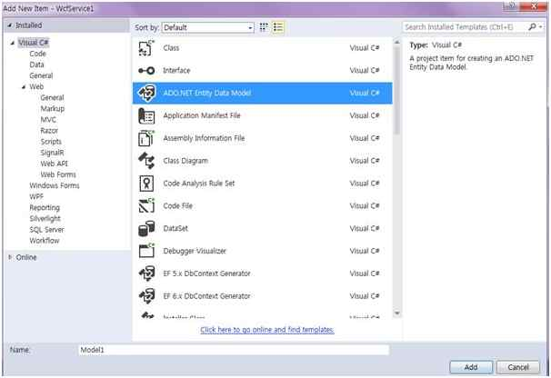

Select EF Designer from the Database and click &quot;Next&quot;.

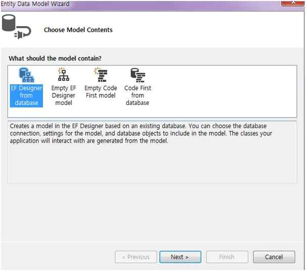

Click &quot;New Connection&quot;.

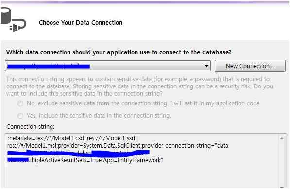

Here we can select our Database Server Name and enter your DB server SQL Server Authentication User ID and Password. We have already created our database as &ldquo;<strong>ItemDB</strong>&rdquo; so we can select the database and click OK. 
 

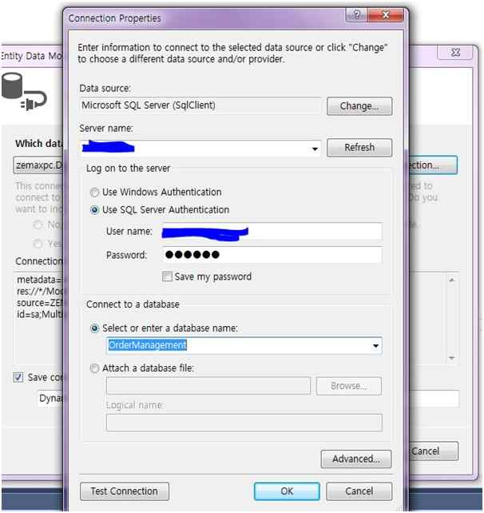

Click Next and select tables that need to be used. In our example we need to use &ldquo;<strong>ItemDB</strong> &quot; and &ldquo;<strong>ItemDetail</strong>&rdquo;. Select both tables and click &quot;Finish&quot;. 
 
Here we can see that now we have created our ItemDataModel.

<strong>Service1.SVC</strong>

&ldquo;Service.SVC.CS&rdquo; implements the IService Interface and overrides and defines all the methods of the Operation Contract.

For example here we can see I have implemented the <strong>IService1</strong> in the
<strong>Service1</strong> class. Created the object for our Entity model and in GetItemDetails using a LINQ Query I have selected the data from the ItemDetails table and the result was added to the list.

JavaScript

Edit|Remove

js
<pre class="hidden">public class Service1 : IService1
      {
             ItemDBEntities OME;
             public Service1()
             {
                    OME = new ItemDBEntities();
             }

            public List&lt;ShanuDataContract.itemDetailsDataContract&gt; GetItemDetails()
             {
                    var query = (from a in OME.ItemDetails
                                         select a).Distinct();

     List&lt;ShanuDataContract.itemDetailsDataContract&gt; ItemDetailsList = new List&lt;ShanuDataContract.itemDetailsDataContract&gt;();

                   query.ToList().ForEach(rec =&gt;
                    {
                         ItemDetailsList.Add(new ShanuDataContract.itemDetailsDataContract
                          {
                                 ItemID = Convert.ToString(rec.ItemID),
                                 ItemName = rec.ItemName,
                                 Desc = rec.Desc,
                                 Price =rec.Price
                          });
                    });
                    return ItemDetailsList;
             }
      }
</pre>

<pre class="js">public&nbsp;class&nbsp;Service1&nbsp;:&nbsp;IService1&nbsp;
&nbsp;&nbsp;&nbsp;&nbsp;&nbsp;&nbsp;{&nbsp;
&nbsp;&nbsp;&nbsp;&nbsp;&nbsp;&nbsp;&nbsp;&nbsp;&nbsp;&nbsp;&nbsp;&nbsp;&nbsp;ItemDBEntities&nbsp;OME;&nbsp;
&nbsp;&nbsp;&nbsp;&nbsp;&nbsp;&nbsp;&nbsp;&nbsp;&nbsp;&nbsp;&nbsp;&nbsp;&nbsp;public&nbsp;Service1()&nbsp;
&nbsp;&nbsp;&nbsp;&nbsp;&nbsp;&nbsp;&nbsp;&nbsp;&nbsp;&nbsp;&nbsp;&nbsp;&nbsp;{&nbsp;
&nbsp;&nbsp;&nbsp;&nbsp;&nbsp;&nbsp;&nbsp;&nbsp;&nbsp;&nbsp;&nbsp;&nbsp;&nbsp;&nbsp;&nbsp;&nbsp;&nbsp;&nbsp;&nbsp;&nbsp;OME&nbsp;=&nbsp;new&nbsp;ItemDBEntities();&nbsp;
&nbsp;&nbsp;&nbsp;&nbsp;&nbsp;&nbsp;&nbsp;&nbsp;&nbsp;&nbsp;&nbsp;&nbsp;&nbsp;}&nbsp;
&nbsp;
&nbsp;&nbsp;&nbsp;&nbsp;&nbsp;&nbsp;&nbsp;&nbsp;&nbsp;&nbsp;&nbsp;&nbsp;public&nbsp;List&lt;ShanuDataContract.itemDetailsDataContract&gt;&nbsp;GetItemDetails()&nbsp;
&nbsp;&nbsp;&nbsp;&nbsp;&nbsp;&nbsp;&nbsp;&nbsp;&nbsp;&nbsp;&nbsp;&nbsp;&nbsp;{var&nbsp;query&nbsp;=&nbsp;(from&nbsp;a&nbsp;in&nbsp;OME.ItemDetails&nbsp;
&nbsp;&nbsp;&nbsp;&nbsp;&nbsp;&nbsp;&nbsp;&nbsp;&nbsp;&nbsp;&nbsp;&nbsp;&nbsp;&nbsp;&nbsp;&nbsp;&nbsp;&nbsp;&nbsp;&nbsp;&nbsp;&nbsp;&nbsp;&nbsp;&nbsp;&nbsp;&nbsp;&nbsp;&nbsp;&nbsp;&nbsp;&nbsp;&nbsp;&nbsp;&nbsp;&nbsp;&nbsp;&nbsp;&nbsp;&nbsp;&nbsp;select&nbsp;a).Distinct();&nbsp;
&nbsp;
&nbsp;&nbsp;&nbsp;&nbsp;&nbsp;List&lt;ShanuDataContract.itemDetailsDataContract&gt;&nbsp;ItemDetailsList&nbsp;=&nbsp;new&nbsp;List&lt;ShanuDataContract.itemDetailsDataContract&gt;();&nbsp;
&nbsp;
&nbsp;&nbsp;&nbsp;&nbsp;&nbsp;&nbsp;&nbsp;&nbsp;&nbsp;&nbsp;&nbsp;&nbsp;&nbsp;&nbsp;&nbsp;&nbsp;&nbsp;&nbsp;&nbsp;query.ToList().ForEach(rec&nbsp;=&gt;&nbsp;
&nbsp;&nbsp;&nbsp;&nbsp;&nbsp;&nbsp;&nbsp;&nbsp;&nbsp;&nbsp;&nbsp;&nbsp;&nbsp;&nbsp;&nbsp;&nbsp;&nbsp;&nbsp;&nbsp;&nbsp;{&nbsp;
&nbsp;&nbsp;&nbsp;&nbsp;&nbsp;&nbsp;&nbsp;&nbsp;&nbsp;&nbsp;&nbsp;&nbsp;&nbsp;&nbsp;&nbsp;&nbsp;&nbsp;&nbsp;&nbsp;&nbsp;&nbsp;&nbsp;&nbsp;&nbsp;&nbsp;ItemDetailsList.Add(new&nbsp;ShanuDataContract.itemDetailsDataContract&nbsp;
&nbsp;&nbsp;&nbsp;&nbsp;&nbsp;&nbsp;&nbsp;&nbsp;&nbsp;&nbsp;&nbsp;&nbsp;&nbsp;&nbsp;&nbsp;&nbsp;&nbsp;&nbsp;&nbsp;&nbsp;&nbsp;&nbsp;&nbsp;&nbsp;&nbsp;&nbsp;{&nbsp;
&nbsp;&nbsp;&nbsp;&nbsp;&nbsp;&nbsp;&nbsp;&nbsp;&nbsp;&nbsp;&nbsp;&nbsp;&nbsp;&nbsp;&nbsp;&nbsp;&nbsp;&nbsp;&nbsp;&nbsp;&nbsp;&nbsp;&nbsp;&nbsp;&nbsp;&nbsp;&nbsp;&nbsp;&nbsp;&nbsp;&nbsp;&nbsp;&nbsp;ItemID&nbsp;=&nbsp;Convert.ToString(rec.ItemID),&nbsp;
&nbsp;&nbsp;&nbsp;&nbsp;&nbsp;&nbsp;&nbsp;&nbsp;&nbsp;&nbsp;&nbsp;&nbsp;&nbsp;&nbsp;&nbsp;&nbsp;&nbsp;&nbsp;&nbsp;&nbsp;&nbsp;&nbsp;&nbsp;&nbsp;&nbsp;&nbsp;&nbsp;&nbsp;&nbsp;&nbsp;&nbsp;&nbsp;&nbsp;ItemName&nbsp;=&nbsp;rec.ItemName,&nbsp;
&nbsp;&nbsp;&nbsp;&nbsp;&nbsp;&nbsp;&nbsp;&nbsp;&nbsp;&nbsp;&nbsp;&nbsp;&nbsp;&nbsp;&nbsp;&nbsp;&nbsp;&nbsp;&nbsp;&nbsp;&nbsp;&nbsp;&nbsp;&nbsp;&nbsp;&nbsp;&nbsp;&nbsp;&nbsp;&nbsp;&nbsp;&nbsp;&nbsp;Desc&nbsp;=&nbsp;rec.Desc,&nbsp;
&nbsp;&nbsp;&nbsp;&nbsp;&nbsp;&nbsp;&nbsp;&nbsp;&nbsp;&nbsp;&nbsp;&nbsp;&nbsp;&nbsp;&nbsp;&nbsp;&nbsp;&nbsp;&nbsp;&nbsp;&nbsp;&nbsp;&nbsp;&nbsp;&nbsp;&nbsp;&nbsp;&nbsp;&nbsp;&nbsp;&nbsp;&nbsp;&nbsp;Price&nbsp;=rec.Price&nbsp;
&nbsp;&nbsp;&nbsp;&nbsp;&nbsp;&nbsp;&nbsp;&nbsp;&nbsp;&nbsp;&nbsp;&nbsp;&nbsp;&nbsp;&nbsp;&nbsp;&nbsp;&nbsp;&nbsp;&nbsp;&nbsp;&nbsp;&nbsp;&nbsp;&nbsp;&nbsp;});&nbsp;
&nbsp;&nbsp;&nbsp;&nbsp;&nbsp;&nbsp;&nbsp;&nbsp;&nbsp;&nbsp;&nbsp;&nbsp;&nbsp;&nbsp;&nbsp;&nbsp;&nbsp;&nbsp;&nbsp;&nbsp;});&nbsp;
&nbsp;&nbsp;&nbsp;&nbsp;&nbsp;&nbsp;&nbsp;&nbsp;&nbsp;&nbsp;&nbsp;&nbsp;&nbsp;&nbsp;&nbsp;&nbsp;&nbsp;&nbsp;&nbsp;&nbsp;return&nbsp;ItemDetailsList;&nbsp;
&nbsp;&nbsp;&nbsp;&nbsp;&nbsp;&nbsp;&nbsp;&nbsp;&nbsp;&nbsp;&nbsp;&nbsp;&nbsp;}}</pre>

<strong>Web.Config</strong>

In the WCF project's &ldquo;<code>Web.Config</code>&rdquo;, make the following changes:

<ol>
<li>Change <code>&lt;add binding=&quot;basicHttpsBinding&quot; scheme=&quot;https&quot; /&gt;</code> to
<code>&lt;add binding=&quot;webHttpBinding&quot; scheme=&quot;http&quot; /&gt;</code> </li><li>Replace the <code>&lt;/behaviors&gt;</code> to: </li></ol>

XML

Edit|Remove

xml
<pre class="hidden">&lt;endpointBehaviors&gt;  
       &lt;behavior&gt; 
             &lt;webHttp helpEnabled=&quot;True&quot;/&gt;  
        &lt;/behavior&gt;  
 &lt;/endpointBehaviors&gt;  
</pre>

<pre class="js">&lt;endpointBehaviors&gt;&nbsp;&nbsp;&nbsp;
&nbsp;&nbsp;&nbsp;&nbsp;&nbsp;&nbsp;&nbsp;&lt;behavior&gt;&nbsp;&nbsp;
&nbsp;&nbsp;&nbsp;&nbsp;&nbsp;&nbsp;&nbsp;&nbsp;&nbsp;&nbsp;&nbsp;&nbsp;&nbsp;&lt;webHttp&nbsp;helpEnabled=&quot;True&quot;/&gt;&nbsp;&nbsp;&nbsp;
&nbsp;&nbsp;&nbsp;&nbsp;&nbsp;&nbsp;&nbsp;&nbsp;&lt;/behavior&gt;&nbsp;&nbsp;&nbsp;
&nbsp;&lt;/endpointBehaviors&gt;&nbsp;&nbsp;&nbsp;
</pre>

&nbsp;<strong>Run WCF Service</strong>

Now we have created our WCF Rest service, let's run and test our service.Here we can see the result.

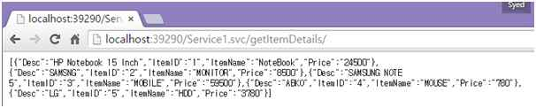

So now we have completed our WCF and now it's time to create our MVC ReactJS application.

We can add a new project to our existing project and create a new MVC web application as in the following.

Click New -&gt; Project then select Web -&gt; ASP.NET Web Application. Select your project location and enter your web application name.

Select MVC and in Add Folders and Core reference for. Select the Web API and click OK.

&nbsp;

<h1></h1>

Once our MVC application created next step is to add&nbsp;<em>ReactJS</em>&nbsp;to our application.

<strong>Installing ReactJS package</strong>

If the ReactJS package is missing then add the package to your project. 
 
Right-click your MVC project and click Manage NuGet Packages. Search for ReactJS - &gt; Select ReactJS tools for ASP.NET MVC 4 and 5 and click Install.&nbsp;

<strong>Creating our JSX file</strong> 
 
Right Click Scripts folder and Click Add -&gt; New Item. 
 
Select Web -&gt; Select JavaScript File -&gt; Enter script file name with &ldquo;<strong>JSX</strong>&rdquo; extension for example like &ldquo;<em>shanuWebAPISample.jsx</em>&rdquo; and click ADD. 
&nbsp;&nbsp; 

Now we can see our JSX file has been created.Here we can add our ReactJS script.Here is the complete code of our JSX which will display the data result to MVC View .

HTML

Edit|Remove

html
<pre class="hidden">var ItemDetailList = React.createClass({
    render: function() {
      
        var itemTable = this.props.data.map(function (itemarray) {

            return (                           
              &lt;ItemArray&gt;
                   &lt;table &gt;
                    &lt;tr &gt;
                       &lt;td width=&quot;40&quot;&gt;&lt;/td&gt;
                        &lt;td width=&quot;140&quot; align=&quot;center&quot;&gt;
                            {itemarray.ItemID}
                        &lt;/td&gt;
                        &lt;td width=&quot;240&quot; align=&quot;center&quot; &gt;
                            {itemarray.ItemName}
                        &lt;/td&gt;
                        &lt;td width=&quot;120&quot; align=&quot;right&quot; &gt;
                            {itemarray.Price}  
                        &lt;/td&gt;
                        &lt;td width=&quot;420&quot; align=&quot;center&quot;&gt;
                           {itemarray.Desc}
                        &lt;/td&gt;
                       &lt;td&gt;&lt;/td&gt;
                    &lt;/tr&gt;
                   &lt;/table&gt;
             &lt;/ItemArray&gt;
           );
   });
return (
  &lt;div &gt;
      {itemTable}
  &lt;/div&gt;
    );
}
});

var ItemArray = React.createClass({
    render: function() {      
        return (
          &lt;div&gt;
              {this.props.children}
          &lt;/div&gt;
      );
    }
});

var ItemContainer = React.createClass({
    getInitialState: function(){
        return{data: []};
    },
    componentWillMount: function(){
        var xhr = new XMLHttpRequest();
        xhr.open('get', this.props.url, true);
        xhr.onload = function() {
         var itemData = JSON.parse(xhr.responseText);
           this.setState({ data: itemData });
        }.bind(this);
        xhr.send();
    },

    render: function(){
        return(
               &lt;ItemDetailList data={this.state.data} /&gt;
        );
    }
});

React.render(&lt;ItemContainer url=&quot;http://localhost:39290/Service1.svc/getItemDetails/&quot; /&gt;, document.getElementById('reactContent'));</pre>

<pre class="js">var&nbsp;ItemDetailList&nbsp;=&nbsp;React.createClass({&nbsp;
&nbsp;&nbsp;&nbsp;&nbsp;render:&nbsp;function()&nbsp;{&nbsp;
&nbsp;&nbsp;&nbsp;&nbsp;&nbsp;&nbsp;&nbsp;
&nbsp;&nbsp;&nbsp;&nbsp;&nbsp;&nbsp;&nbsp;&nbsp;var&nbsp;itemTable&nbsp;=&nbsp;this.props.data.map(function&nbsp;(itemarray)&nbsp;{&nbsp;
&nbsp;
&nbsp;&nbsp;&nbsp;&nbsp;&nbsp;&nbsp;&nbsp;&nbsp;&nbsp;&nbsp;&nbsp;&nbsp;return&nbsp;(&nbsp;&nbsp;&nbsp;&nbsp;&nbsp;&nbsp;&nbsp;&nbsp;&nbsp;&nbsp;&nbsp;&nbsp;&nbsp;&nbsp;&nbsp;&nbsp;&nbsp;&nbsp;&nbsp;&nbsp;&nbsp;&nbsp;&nbsp;&nbsp;&nbsp;&nbsp;&nbsp;&nbsp;
&nbsp;&nbsp;&nbsp;&nbsp;&nbsp;&nbsp;&nbsp;&nbsp;&nbsp;&nbsp;&nbsp;&nbsp;&nbsp;&nbsp;&lt;ItemArray&gt;&nbsp;
&nbsp;&nbsp;&nbsp;&nbsp;&nbsp;&nbsp;&nbsp;&nbsp;&nbsp;&nbsp;&nbsp;&nbsp;&nbsp;&nbsp;&nbsp;&nbsp;&nbsp;&nbsp;&nbsp;&lt;table&nbsp;&gt;&nbsp;
&nbsp;&nbsp;&nbsp;&nbsp;&nbsp;&nbsp;&nbsp;&nbsp;&nbsp;&nbsp;&nbsp;&nbsp;&nbsp;&nbsp;&nbsp;&nbsp;&nbsp;&nbsp;&nbsp;&nbsp;&lt;tr&nbsp;&gt;&nbsp;
&nbsp;&nbsp;&nbsp;&nbsp;&nbsp;&nbsp;&nbsp;&nbsp;&nbsp;&nbsp;&nbsp;&nbsp;&nbsp;&nbsp;&nbsp;&nbsp;&nbsp;&nbsp;&nbsp;&nbsp;&nbsp;&nbsp;&nbsp;&lt;td&nbsp;width=&quot;40&quot;&gt;&lt;/td&gt;&nbsp;
&nbsp;&nbsp;&nbsp;&nbsp;&nbsp;&nbsp;&nbsp;&nbsp;&nbsp;&nbsp;&nbsp;&nbsp;&nbsp;&nbsp;&nbsp;&nbsp;&nbsp;&nbsp;&nbsp;&nbsp;&nbsp;&nbsp;&nbsp;&nbsp;&lt;td&nbsp;width=&quot;140&quot;&nbsp;align=&quot;center&quot;&gt;&nbsp;
&nbsp;&nbsp;&nbsp;&nbsp;&nbsp;&nbsp;&nbsp;&nbsp;&nbsp;&nbsp;&nbsp;&nbsp;&nbsp;&nbsp;&nbsp;&nbsp;&nbsp;&nbsp;&nbsp;&nbsp;&nbsp;&nbsp;&nbsp;&nbsp;&nbsp;&nbsp;&nbsp;&nbsp;{itemarray.ItemID}&nbsp;
&nbsp;&nbsp;&nbsp;&nbsp;&nbsp;&nbsp;&nbsp;&nbsp;&nbsp;&nbsp;&nbsp;&nbsp;&nbsp;&nbsp;&nbsp;&nbsp;&nbsp;&nbsp;&nbsp;&nbsp;&nbsp;&nbsp;&nbsp;&nbsp;&lt;/td&gt;&nbsp;
&nbsp;&nbsp;&nbsp;&nbsp;&nbsp;&nbsp;&nbsp;&nbsp;&nbsp;&nbsp;&nbsp;&nbsp;&nbsp;&nbsp;&nbsp;&nbsp;&nbsp;&nbsp;&nbsp;&nbsp;&nbsp;&nbsp;&nbsp;&nbsp;&lt;td&nbsp;width=&quot;240&quot;&nbsp;align=&quot;center&quot;&nbsp;&gt;&nbsp;
&nbsp;&nbsp;&nbsp;&nbsp;&nbsp;&nbsp;&nbsp;&nbsp;&nbsp;&nbsp;&nbsp;&nbsp;&nbsp;&nbsp;&nbsp;&nbsp;&nbsp;&nbsp;&nbsp;&nbsp;&nbsp;&nbsp;&nbsp;&nbsp;&nbsp;&nbsp;&nbsp;&nbsp;{itemarray.ItemName}&nbsp;
&nbsp;&nbsp;&nbsp;&nbsp;&nbsp;&nbsp;&nbsp;&nbsp;&nbsp;&nbsp;&nbsp;&nbsp;&nbsp;&nbsp;&nbsp;&nbsp;&nbsp;&nbsp;&nbsp;&nbsp;&nbsp;&nbsp;&nbsp;&nbsp;&lt;/td&gt;&nbsp;
&nbsp;&nbsp;&nbsp;&nbsp;&nbsp;&nbsp;&nbsp;&nbsp;&nbsp;&nbsp;&nbsp;&nbsp;&nbsp;&nbsp;&nbsp;&nbsp;&nbsp;&nbsp;&nbsp;&nbsp;&nbsp;&nbsp;&nbsp;&nbsp;&lt;td&nbsp;width=&quot;120&quot;&nbsp;align=&quot;right&quot;&nbsp;&gt;&nbsp;
&nbsp;&nbsp;&nbsp;&nbsp;&nbsp;&nbsp;&nbsp;&nbsp;&nbsp;&nbsp;&nbsp;&nbsp;&nbsp;&nbsp;&nbsp;&nbsp;&nbsp;&nbsp;&nbsp;&nbsp;&nbsp;&nbsp;&nbsp;&nbsp;&nbsp;&nbsp;&nbsp;&nbsp;{itemarray.Price}&nbsp;&nbsp;&nbsp;
&nbsp;&nbsp;&nbsp;&nbsp;&nbsp;&nbsp;&nbsp;&nbsp;&nbsp;&nbsp;&nbsp;&nbsp;&nbsp;&nbsp;&nbsp;&nbsp;&nbsp;&nbsp;&nbsp;&nbsp;&nbsp;&nbsp;&nbsp;&nbsp;&lt;/td&gt;&nbsp;
&nbsp;&nbsp;&nbsp;&nbsp;&nbsp;&nbsp;&nbsp;&nbsp;&nbsp;&nbsp;&nbsp;&nbsp;&nbsp;&nbsp;&nbsp;&nbsp;&nbsp;&nbsp;&nbsp;&nbsp;&nbsp;&nbsp;&nbsp;&nbsp;&lt;td&nbsp;width=&quot;420&quot;&nbsp;align=&quot;center&quot;&gt;&nbsp;
&nbsp;&nbsp;&nbsp;&nbsp;&nbsp;&nbsp;&nbsp;&nbsp;&nbsp;&nbsp;&nbsp;&nbsp;&nbsp;&nbsp;&nbsp;&nbsp;&nbsp;&nbsp;&nbsp;&nbsp;&nbsp;&nbsp;&nbsp;&nbsp;&nbsp;&nbsp;&nbsp;{itemarray.Desc}&nbsp;
&nbsp;&nbsp;&nbsp;&nbsp;&nbsp;&nbsp;&nbsp;&nbsp;&nbsp;&nbsp;&nbsp;&nbsp;&nbsp;&nbsp;&nbsp;&nbsp;&nbsp;&nbsp;&nbsp;&nbsp;&nbsp;&nbsp;&nbsp;&nbsp;&lt;/td&gt;&nbsp;
&nbsp;&nbsp;&nbsp;&nbsp;&nbsp;&nbsp;&nbsp;&nbsp;&nbsp;&nbsp;&nbsp;&nbsp;&nbsp;&nbsp;&nbsp;&nbsp;&nbsp;&nbsp;&nbsp;&nbsp;&nbsp;&nbsp;&nbsp;&lt;td&gt;&lt;/td&gt;&nbsp;
&nbsp;&nbsp;&nbsp;&nbsp;&nbsp;&nbsp;&nbsp;&nbsp;&nbsp;&nbsp;&nbsp;&nbsp;&nbsp;&nbsp;&nbsp;&nbsp;&nbsp;&nbsp;&nbsp;&nbsp;&lt;/tr&gt;&nbsp;
&nbsp;&nbsp;&nbsp;&nbsp;&nbsp;&nbsp;&nbsp;&nbsp;&nbsp;&nbsp;&nbsp;&nbsp;&nbsp;&nbsp;&nbsp;&nbsp;&nbsp;&nbsp;&nbsp;&lt;/table&gt;&nbsp;
&nbsp;&nbsp;&nbsp;&nbsp;&nbsp;&nbsp;&nbsp;&nbsp;&nbsp;&nbsp;&nbsp;&nbsp;&nbsp;&lt;/ItemArray&gt;&nbsp;
&nbsp;&nbsp;&nbsp;&nbsp;&nbsp;&nbsp;&nbsp;&nbsp;&nbsp;&nbsp;&nbsp;);&nbsp;
&nbsp;&nbsp;&nbsp;});&nbsp;
return&nbsp;(&nbsp;
&nbsp;&nbsp;&lt;div&nbsp;&gt;&nbsp;
&nbsp;&nbsp;&nbsp;&nbsp;&nbsp;&nbsp;{itemTable}&nbsp;
&nbsp;&nbsp;&lt;/div&gt;&nbsp;
&nbsp;&nbsp;&nbsp;&nbsp;);&nbsp;
}&nbsp;
});&nbsp;
&nbsp;
var&nbsp;ItemArray&nbsp;=&nbsp;React.createClass({&nbsp;
&nbsp;&nbsp;&nbsp;&nbsp;render:&nbsp;function()&nbsp;{&nbsp;&nbsp;&nbsp;&nbsp;&nbsp;&nbsp;&nbsp;
&nbsp;&nbsp;&nbsp;&nbsp;&nbsp;&nbsp;&nbsp;&nbsp;return&nbsp;(&nbsp;
&nbsp;&nbsp;&nbsp;&nbsp;&nbsp;&nbsp;&nbsp;&nbsp;&nbsp;&nbsp;&lt;div&gt;&nbsp;
&nbsp;&nbsp;&nbsp;&nbsp;&nbsp;&nbsp;&nbsp;&nbsp;&nbsp;&nbsp;&nbsp;&nbsp;&nbsp;&nbsp;{this.props.children}&nbsp;
&nbsp;&nbsp;&nbsp;&nbsp;&nbsp;&nbsp;&nbsp;&nbsp;&nbsp;&nbsp;&lt;/div&gt;&nbsp;
&nbsp;&nbsp;&nbsp;&nbsp;&nbsp;&nbsp;);&nbsp;
&nbsp;&nbsp;&nbsp;&nbsp;}&nbsp;
});&nbsp;
&nbsp;
var&nbsp;ItemContainer&nbsp;=&nbsp;React.createClass({&nbsp;
&nbsp;&nbsp;&nbsp;&nbsp;getInitialState:&nbsp;function(){&nbsp;
&nbsp;&nbsp;&nbsp;&nbsp;&nbsp;&nbsp;&nbsp;&nbsp;return{data:&nbsp;[]};&nbsp;
&nbsp;&nbsp;&nbsp;&nbsp;},&nbsp;
&nbsp;&nbsp;&nbsp;&nbsp;componentWillMount:&nbsp;function(){&nbsp;
&nbsp;&nbsp;&nbsp;&nbsp;&nbsp;&nbsp;&nbsp;&nbsp;var&nbsp;xhr&nbsp;=&nbsp;new&nbsp;XMLHttpRequest();&nbsp;
&nbsp;&nbsp;&nbsp;&nbsp;&nbsp;&nbsp;&nbsp;&nbsp;xhr.open('get',&nbsp;this.props.url,&nbsp;true);&nbsp;
&nbsp;&nbsp;&nbsp;&nbsp;&nbsp;&nbsp;&nbsp;&nbsp;xhr.onload&nbsp;=&nbsp;function()&nbsp;{&nbsp;
&nbsp;&nbsp;&nbsp;&nbsp;&nbsp;&nbsp;&nbsp;&nbsp;&nbsp;var&nbsp;itemData&nbsp;=&nbsp;JSON.parse(xhr.responseText);&nbsp;
&nbsp;&nbsp;&nbsp;&nbsp;&nbsp;&nbsp;&nbsp;&nbsp;&nbsp;&nbsp;&nbsp;this.setState({&nbsp;data:&nbsp;itemData&nbsp;});&nbsp;
&nbsp;&nbsp;&nbsp;&nbsp;&nbsp;&nbsp;&nbsp;&nbsp;}.bind(this);&nbsp;
&nbsp;&nbsp;&nbsp;&nbsp;&nbsp;&nbsp;&nbsp;&nbsp;xhr.send();&nbsp;
&nbsp;&nbsp;&nbsp;&nbsp;},&nbsp;
&nbsp;
&nbsp;&nbsp;&nbsp;&nbsp;render:&nbsp;function(){&nbsp;
&nbsp;&nbsp;&nbsp;&nbsp;&nbsp;&nbsp;&nbsp;&nbsp;return(&nbsp;
&nbsp;&nbsp;&nbsp;&nbsp;&nbsp;&nbsp;&nbsp;&nbsp;&nbsp;&nbsp;&nbsp;&nbsp;&nbsp;&nbsp;&nbsp;&lt;ItemDetailList&nbsp;data={this.state.data}&nbsp;/&gt;&nbsp;
&nbsp;&nbsp;&nbsp;&nbsp;&nbsp;&nbsp;&nbsp;&nbsp;);&nbsp;
&nbsp;&nbsp;&nbsp;&nbsp;}&nbsp;
});&nbsp;
&nbsp;
React.render(&lt;ItemContainer&nbsp;url=&quot;http://localhost:39290/Service1.svc/getItemDetails/&quot;&nbsp;/&gt;,&nbsp;document.getElementById('reactContent'));</pre>

<strong>Code part Explanation:</strong>

In above WEB API sample I have explained about how to pass the URL and bind the result Div tag&nbsp; by binding it to DOM.here I have used the same method but here I have passed the URL as my WCF URL as &ldquo;http://localhost:39290/Service1.svc/getItemDetails/&rdquo;
 .Here I get the result and display the data as tabular form inside div tag

When we run the program we can see the output like below.

<h1><strong style="font-size:2em">&nbsp;</strong>Source Code Files</h1>
<ul>
<li>shanuMVCReactJSWCFRest.zip </li></ul>
<h1>More Information</h1>

<em>Note: In my attached Zip file you can find all 4 Source Sample 2 for HTML sample and one for MVC and Web ApI and one for MVC and WCF Rest using ReactJS. Hope you like this article Thank You.</em>

