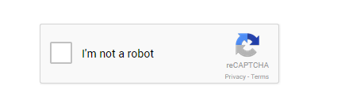
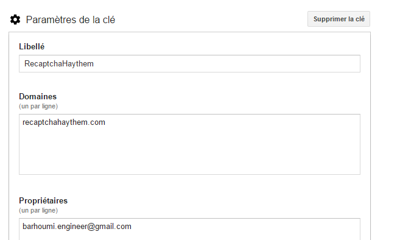

# Google reCAPTCHA in ASP.NET MVC 5
## Requires
- Visual Studio 2013
## License
- MIT
## Technologies
- C#
- ASP.NET MVC 5
## Topics
- Google reCAPTCHA
## Updated
- 05/26/2016
## Description

<h1>Introduction</h1>

Here, I will explain about how to use Google reCAPTCHA in ASP.NET MVC. What is reCAPTCHA?

reCAPTCHA protects the websites you love from spam and abuse. Google has updated their reCAPTCHA API to 2.0 . Now, users can attest they are human without having to solve a CAPTCHA. Instead with just a single click, they&rsquo;ll confirm they are not a robot
 and it is called as &ldquo;<strong>No CAPTCHA reCAPTCHA</strong>&ldquo;. This is how new reCAPTCHA looks:

Building the Sample

Now let's create an API key pair for your site at&nbsp;<a title="https://www.google.com/recaptcha/intro/index.html" href="https://www.google.com/recaptcha/intro/index.html" target="_blank">https://www.google.com/recaptcha/intro/index.html</a>&nbsp;and click
 on&nbsp;<strong>Get reCAPTCHA</strong>&nbsp;at the top of the page and follow the below steps to create an application.

Description

Once you are done with registration, the following keys will be generated:

reCAPTCHA keys

<strong>Site key</strong>: is used to display the widget in your page or code.

<strong>Secret key</strong>: can be used as communication between your site and Google to verify the user response whether the reCAPTCHA is valid or not.

Now the next is display the reCAPTCHA widget in your site.

<h2 class="subhead">Step-1: Create a Controller.</h2>

Go to Solution Explorer &gt; Right Click on Controllers folder form Solution Explorer &gt; Add &gt; Controller &gt; Enter Controller name &gt; Select Templete &quot;empty MVC Controller&quot;&gt; Add. 
 
Here I have created a controller &quot;HomeController&quot;

&nbsp;

&nbsp;

C#

Modifier&nbsp;le&nbsp;script|Remove

csharp

<pre class="csharp">using&nbsp;System;&nbsp;
using&nbsp;<a class="libraryLink" href="https://msdn.microsoft.com/fr-FR/library/System.Collections.Generic.aspx" target="_blank" title="Auto generated link to System.Collections.Generic">System.Collections.Generic</a>;&nbsp;
using&nbsp;<a class="libraryLink" href="https://msdn.microsoft.com/fr-FR/library/System.Linq.aspx" target="_blank" title="Auto generated link to System.Linq">System.Linq</a>;&nbsp;
using&nbsp;<a class="libraryLink" href="https://msdn.microsoft.com/fr-FR/library/System.Net.aspx" target="_blank" title="Auto generated link to System.Net">System.Net</a>;&nbsp;
using&nbsp;<a class="libraryLink" href="https://msdn.microsoft.com/fr-FR/library/System.Web.aspx" target="_blank" title="Auto generated link to System.Web">System.Web</a>;&nbsp;
using&nbsp;<a class="libraryLink" href="https://msdn.microsoft.com/fr-FR/library/System.Web.Mvc.aspx" target="_blank" title="Auto generated link to System.Web.Mvc">System.Web.Mvc</a>;&nbsp;
using&nbsp;Newtonsoft.Json;&nbsp;
using&nbsp;Newtonsoft.Json.Linq;&nbsp;
&nbsp;
namespace&nbsp;Recaptcha.Controllers&nbsp;
{&nbsp;
&nbsp;&nbsp;&nbsp;&nbsp;public&nbsp;class&nbsp;HomeController&nbsp;:&nbsp;Controller&nbsp;
&nbsp;&nbsp;&nbsp;&nbsp;{&nbsp;
&nbsp;&nbsp;&nbsp;&nbsp;&nbsp;
&nbsp;&nbsp;&nbsp;&nbsp;&nbsp;&nbsp;&nbsp;&nbsp;public&nbsp;ActionResult&nbsp;Index()&nbsp;
&nbsp;&nbsp;&nbsp;&nbsp;&nbsp;&nbsp;&nbsp;&nbsp;{&nbsp;
&nbsp;&nbsp;&nbsp;&nbsp;&nbsp;&nbsp;&nbsp;&nbsp;&nbsp;&nbsp;&nbsp;&nbsp;return&nbsp;View();&nbsp;
&nbsp;&nbsp;&nbsp;&nbsp;&nbsp;&nbsp;&nbsp;&nbsp;}&nbsp;
&nbsp;
&nbsp;&nbsp;&nbsp;&nbsp;&nbsp;&nbsp;&nbsp;&nbsp;[HttpPost]&nbsp;
&nbsp;&nbsp;&nbsp;&nbsp;&nbsp;&nbsp;&nbsp;&nbsp;public&nbsp;ActionResult&nbsp;FormSubmit()&nbsp;
&nbsp;&nbsp;&nbsp;&nbsp;&nbsp;&nbsp;&nbsp;&nbsp;{&nbsp;
&nbsp;&nbsp;&nbsp;&nbsp;&nbsp;&nbsp;&nbsp;&nbsp;&nbsp;&nbsp;&nbsp;&nbsp;
&nbsp;&nbsp;&nbsp;&nbsp;&nbsp;&nbsp;&nbsp;&nbsp;&nbsp;&nbsp;&nbsp;&nbsp;var&nbsp;response&nbsp;=&nbsp;Request[&quot;g-recaptcha-response&quot;];&nbsp;
&nbsp;&nbsp;&nbsp;&nbsp;&nbsp;&nbsp;&nbsp;&nbsp;&nbsp;&nbsp;&nbsp;&nbsp;string&nbsp;secretKey&nbsp;=&nbsp;&quot;your&nbsp;secret&nbsp;key&nbsp;here&quot;;&nbsp;
&nbsp;&nbsp;&nbsp;&nbsp;&nbsp;&nbsp;&nbsp;&nbsp;&nbsp;&nbsp;&nbsp;&nbsp;var&nbsp;client&nbsp;=&nbsp;new&nbsp;WebClient();&nbsp;
&nbsp;&nbsp;&nbsp;&nbsp;&nbsp;&nbsp;&nbsp;&nbsp;&nbsp;&nbsp;&nbsp;&nbsp;var&nbsp;result&nbsp;=&nbsp;client.DownloadString(string.Format(&quot;https://www.google.com/recaptcha/api/siteverify?secret={0}&amp;response={1}&quot;,&nbsp;secretKey,&nbsp;response));&nbsp;
&nbsp;&nbsp;&nbsp;&nbsp;&nbsp;&nbsp;&nbsp;&nbsp;&nbsp;&nbsp;&nbsp;&nbsp;var&nbsp;obj&nbsp;=&nbsp;JObject.Parse(result);&nbsp;
&nbsp;&nbsp;&nbsp;&nbsp;&nbsp;&nbsp;&nbsp;&nbsp;&nbsp;&nbsp;&nbsp;&nbsp;var&nbsp;status&nbsp;=&nbsp;(bool)obj.SelectToken(&quot;success&quot;);&nbsp;
&nbsp;&nbsp;&nbsp;&nbsp;&nbsp;&nbsp;&nbsp;&nbsp;&nbsp;&nbsp;&nbsp;&nbsp;ViewBag.Message&nbsp;=&nbsp;status&nbsp;?&nbsp;&quot;Google&nbsp;reCaptcha&nbsp;validation&nbsp;success&quot;&nbsp;:&nbsp;&quot;Google&nbsp;reCaptcha&nbsp;validation&nbsp;failed&quot;;&nbsp;
&nbsp;
&nbsp;&nbsp;&nbsp;&nbsp;&nbsp;&nbsp;&nbsp;&nbsp;&nbsp;&nbsp;&nbsp;&nbsp;return&nbsp;View(&quot;Index&quot;);&nbsp;
&nbsp;&nbsp;&nbsp;&nbsp;&nbsp;&nbsp;&nbsp;&nbsp;}&nbsp;
&nbsp;
&nbsp;&nbsp;&nbsp;&nbsp;}&nbsp;
}&nbsp;
******************************************&nbsp;
Step-2:&nbsp;Add&nbsp;view&nbsp;for&nbsp;the&nbsp;action&nbsp;(here&nbsp;&quot;Index&quot;)&nbsp;&amp;&nbsp;design.&nbsp;
******************************************&nbsp;
@{&nbsp;
&nbsp;&nbsp;&nbsp;&nbsp;ViewBag.Title&nbsp;=&nbsp;&quot;Index&quot;;&nbsp;
}&nbsp;
&lt;h2&gt;Index&lt;/h2&gt;&nbsp;
&lt;div&gt;&nbsp;
&nbsp;&nbsp;&nbsp;&nbsp;@using&nbsp;(Html.BeginForm(&quot;FormSubmit&quot;,&nbsp;&quot;Home&quot;,&nbsp;FormMethod.Post))&nbsp;
&nbsp;&nbsp;&nbsp;&nbsp;{&nbsp;
&nbsp;&nbsp;&nbsp;&nbsp;&lt;div&nbsp;class=&quot;g-recaptcha&quot;&nbsp;data-sitekey=&quot;6Lf9_CATAAAAAFwQl6G-_e3Onx_ZrTkNHJ-mBgvS&quot;&gt;&lt;/div&gt;&nbsp;
&nbsp;&nbsp;&nbsp;&nbsp;&nbsp;&nbsp;&nbsp;&nbsp;&lt;input&nbsp;type=&quot;submit&quot;&nbsp;value=&quot;Submit&quot;&nbsp;/&gt;&nbsp;
&nbsp;&nbsp;&nbsp;&nbsp;}&nbsp;
&lt;/div&gt;&nbsp;
&lt;span&nbsp;style=&quot;display:inline-block;&nbsp;font-size:20px;margin:20px&nbsp;0;padding:20px;border:1px&nbsp;solid&nbsp;#D3D3D3&quot;&gt;&nbsp;
&nbsp;&nbsp;&nbsp;&nbsp;@ViewBag.Message&nbsp;
&lt;/span&gt;&nbsp;
&lt;script&nbsp;src='https://www.google.com/recaptcha/api.js'&nbsp;type=&quot;text/javascript&quot;&gt;&lt;/script&gt;&nbsp;
&nbsp;</pre>

<h2 class="subhead">Step3: Run Application (before run, make sure you have added your site key &amp; secret key)</h2>
<h1>Closing Notes</h1>

<em>I hope you enjoyed this article. I tried to make this as simple as I can. If you like this article, please rate it and share it to share the knowledge.</em>

<em> 
</em>

