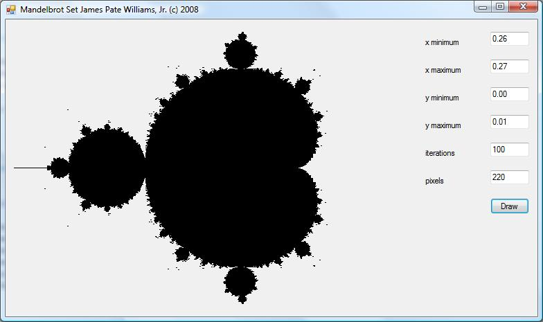

# Graphs the Mandelbrot Set Fractal
## Requires
- Visual Studio 2008
## License
- MIT
## Technologies
- Graphics
- C#
- Visual Studio 2008
- Windows Forms
- Visual C#
## Topics
- C#
- Numerical Computing
## Updated
- 04/01/2015
## Description

<h1>Introduction</h1>

<em>This application graphs the Mandelbrot set fractal utilizing user defined parameters. A fractal is a self-similar curve. 
</em>

<h1>Building the Sample</h1>

<em>This project should easily build using Visual Studio 2008. The project uses the minimum number of references. 
</em>

Description

<em>The Mandelbrot set along with the Julia set are among the most famous of classical fractals. Fractals are seen everywhere from the shapes of plants and trees, the clouds of Earth's atmosphere, and the coastlines of Earth's countries and continents. The
 user can select six parameters to adjust the shape of the fractal. The default parameters yield a nice image as shown in the following picture. The parameters are the x and y minima and maxima, the number of iterations to be performed and the number of picture
 elements. The number of pixels is limited to 220. Although the property of self-similarity has a long mathematical history it was not until the 1960s that computers were utilized to make beuatiful drawings of fractals. Benoit Mandelbrot was one of the first
 computer generated fractal innovators. 
</em>

<em> &nbsp;&nbsp;</em>

&nbsp;

C#

Edit|Remove

csharp
<pre class="hidden">using System;
using System.Drawing;
using System.Windows.Forms;

namespace Mandelbrot
{
    public partial class MandelbrotForm : Form
    {
        private double xMinimum, xMaximum;
        private double yMinimum, yMaximum;
        private int iterations, pixels;
        private Brush brush;
        private Complex bottomLeft;

        public MandelbrotForm()
        {
            InitializeComponent();
            panel1.Paint &#43;= new PaintEventHandler(panel1_Paint);
        }

        private void button1_Click(object sender, EventArgs e)
        {
            xMinimum = Convert.ToDouble(textBox1.Text);
            xMaximum = Convert.ToDouble(textBox2.Text);
            yMinimum = Convert.ToDouble(textBox3.Text);
            yMaximum = Convert.ToDouble(textBox4.Text);
            iterations = Convert.ToInt32(textBox5.Text);
            pixels = Convert.ToInt32(textBox6.Text);

            if (pixels &gt; 220)
            {
                pixels = 220;
                textBox6.Text = Convert.ToString(pixels);
                System.Windows.Forms.MessageBox.Show(
                    &quot;pixels being set to maximum of 220&quot;,
                    &quot;Number Warning&quot;, MessageBoxButtons.OK,
                    MessageBoxIcon.Warning);
            }

            bottomLeft = new Complex(xMinimum, yMinimum);
            brush = new SolidBrush(SystemColors.WindowText);
            panel1.Invalidate();
        }

        bool PrintPixel(double c1, double c2)
        {
            bool testValue = false;
            int count = 0;
            Complex c = new Complex(c1, c2), z = new Complex();

            while (count &lt; iterations)
            {
                count&#43;&#43;;
                z = z * z &#43; c;
                testValue = Complex.abs(z) &lt; 2.0;

                if (!testValue)
                    break;
            }

            return testValue;
        }

        private void panel1_Paint(object sender, System.Windows.Forms.PaintEventArgs e)
        {
            double scale = 100.0 * (xMaximum - xMinimum) / pixels;
            int width = panel1.Width - 1;
            int height = panel1.Height - 1;
            Graphics g = e.Graphics;

            for (int ct1 = -2 * pixels; ct1 &lt; 2 * pixels; ct1&#43;&#43;)
            {
                for (int ct2 = -2 * pixels; ct2 &lt; 2 * pixels; ct2&#43;&#43;)
                {
                    double x = ct1 * scale &#43; bottomLeft.Real;
                    double y = ct2 * scale &#43; bottomLeft.Imag;

                    if (PrintPixel(x, y))
                        g.FillEllipse(brush,
                            ct1 &#43; width / 2 &#43; 128,
                            ct2 &#43; height / 2,
                            2,
                            2);
                }
            }
        }
    }
}</pre>

<pre class="csharp">using&nbsp;System;&nbsp;
using&nbsp;System.Drawing;&nbsp;
using&nbsp;System.Windows.Forms;&nbsp;
&nbsp;
namespace&nbsp;Mandelbrot&nbsp;
{&nbsp;
&nbsp;&nbsp;&nbsp;&nbsp;public&nbsp;partial&nbsp;class&nbsp;MandelbrotForm&nbsp;:&nbsp;Form&nbsp;
&nbsp;&nbsp;&nbsp;&nbsp;{&nbsp;
&nbsp;&nbsp;&nbsp;&nbsp;&nbsp;&nbsp;&nbsp;&nbsp;private&nbsp;double&nbsp;xMinimum,&nbsp;xMaximum;&nbsp;
&nbsp;&nbsp;&nbsp;&nbsp;&nbsp;&nbsp;&nbsp;&nbsp;private&nbsp;double&nbsp;yMinimum,&nbsp;yMaximum;&nbsp;
&nbsp;&nbsp;&nbsp;&nbsp;&nbsp;&nbsp;&nbsp;&nbsp;private&nbsp;int&nbsp;iterations,&nbsp;pixels;&nbsp;
&nbsp;&nbsp;&nbsp;&nbsp;&nbsp;&nbsp;&nbsp;&nbsp;private&nbsp;Brush&nbsp;brush;&nbsp;
&nbsp;&nbsp;&nbsp;&nbsp;&nbsp;&nbsp;&nbsp;&nbsp;private&nbsp;Complex&nbsp;bottomLeft;&nbsp;
&nbsp;
&nbsp;&nbsp;&nbsp;&nbsp;&nbsp;&nbsp;&nbsp;&nbsp;public&nbsp;MandelbrotForm()&nbsp;
&nbsp;&nbsp;&nbsp;&nbsp;&nbsp;&nbsp;&nbsp;&nbsp;{&nbsp;
&nbsp;&nbsp;&nbsp;&nbsp;&nbsp;&nbsp;&nbsp;&nbsp;&nbsp;&nbsp;&nbsp;&nbsp;InitializeComponent();&nbsp;
&nbsp;&nbsp;&nbsp;&nbsp;&nbsp;&nbsp;&nbsp;&nbsp;&nbsp;&nbsp;&nbsp;&nbsp;panel1.Paint&nbsp;&#43;=&nbsp;new&nbsp;PaintEventHandler(panel1_Paint);&nbsp;
&nbsp;&nbsp;&nbsp;&nbsp;&nbsp;&nbsp;&nbsp;&nbsp;}&nbsp;
&nbsp;
&nbsp;&nbsp;&nbsp;&nbsp;&nbsp;&nbsp;&nbsp;&nbsp;private&nbsp;void&nbsp;button1_Click(object&nbsp;sender,&nbsp;EventArgs&nbsp;e)&nbsp;
&nbsp;&nbsp;&nbsp;&nbsp;&nbsp;&nbsp;&nbsp;&nbsp;{&nbsp;
&nbsp;&nbsp;&nbsp;&nbsp;&nbsp;&nbsp;&nbsp;&nbsp;&nbsp;&nbsp;&nbsp;&nbsp;xMinimum&nbsp;=&nbsp;Convert.ToDouble(textBox1.Text);&nbsp;
&nbsp;&nbsp;&nbsp;&nbsp;&nbsp;&nbsp;&nbsp;&nbsp;&nbsp;&nbsp;&nbsp;&nbsp;xMaximum&nbsp;=&nbsp;Convert.ToDouble(textBox2.Text);&nbsp;
&nbsp;&nbsp;&nbsp;&nbsp;&nbsp;&nbsp;&nbsp;&nbsp;&nbsp;&nbsp;&nbsp;&nbsp;yMinimum&nbsp;=&nbsp;Convert.ToDouble(textBox3.Text);&nbsp;
&nbsp;&nbsp;&nbsp;&nbsp;&nbsp;&nbsp;&nbsp;&nbsp;&nbsp;&nbsp;&nbsp;&nbsp;yMaximum&nbsp;=&nbsp;Convert.ToDouble(textBox4.Text);&nbsp;
&nbsp;&nbsp;&nbsp;&nbsp;&nbsp;&nbsp;&nbsp;&nbsp;&nbsp;&nbsp;&nbsp;&nbsp;iterations&nbsp;=&nbsp;Convert.ToInt32(textBox5.Text);&nbsp;
&nbsp;&nbsp;&nbsp;&nbsp;&nbsp;&nbsp;&nbsp;&nbsp;&nbsp;&nbsp;&nbsp;&nbsp;pixels&nbsp;=&nbsp;Convert.ToInt32(textBox6.Text);&nbsp;
&nbsp;
&nbsp;&nbsp;&nbsp;&nbsp;&nbsp;&nbsp;&nbsp;&nbsp;&nbsp;&nbsp;&nbsp;&nbsp;if&nbsp;(pixels&nbsp;&gt;&nbsp;220)&nbsp;
&nbsp;&nbsp;&nbsp;&nbsp;&nbsp;&nbsp;&nbsp;&nbsp;&nbsp;&nbsp;&nbsp;&nbsp;{&nbsp;
&nbsp;&nbsp;&nbsp;&nbsp;&nbsp;&nbsp;&nbsp;&nbsp;&nbsp;&nbsp;&nbsp;&nbsp;&nbsp;&nbsp;&nbsp;&nbsp;pixels&nbsp;=&nbsp;220;&nbsp;
&nbsp;&nbsp;&nbsp;&nbsp;&nbsp;&nbsp;&nbsp;&nbsp;&nbsp;&nbsp;&nbsp;&nbsp;&nbsp;&nbsp;&nbsp;&nbsp;textBox6.Text&nbsp;=&nbsp;Convert.ToString(pixels);&nbsp;
&nbsp;&nbsp;&nbsp;&nbsp;&nbsp;&nbsp;&nbsp;&nbsp;&nbsp;&nbsp;&nbsp;&nbsp;&nbsp;&nbsp;&nbsp;&nbsp;System.Windows.Forms.MessageBox.Show(&nbsp;
&nbsp;&nbsp;&nbsp;&nbsp;&nbsp;&nbsp;&nbsp;&nbsp;&nbsp;&nbsp;&nbsp;&nbsp;&nbsp;&nbsp;&nbsp;&nbsp;&nbsp;&nbsp;&nbsp;&nbsp;&quot;pixels&nbsp;being&nbsp;set&nbsp;to&nbsp;maximum&nbsp;of&nbsp;220&quot;,&nbsp;
&nbsp;&nbsp;&nbsp;&nbsp;&nbsp;&nbsp;&nbsp;&nbsp;&nbsp;&nbsp;&nbsp;&nbsp;&nbsp;&nbsp;&nbsp;&nbsp;&nbsp;&nbsp;&nbsp;&nbsp;&quot;Number&nbsp;Warning&quot;,&nbsp;MessageBoxButtons.OK,&nbsp;
&nbsp;&nbsp;&nbsp;&nbsp;&nbsp;&nbsp;&nbsp;&nbsp;&nbsp;&nbsp;&nbsp;&nbsp;&nbsp;&nbsp;&nbsp;&nbsp;&nbsp;&nbsp;&nbsp;&nbsp;MessageBoxIcon.Warning);&nbsp;
&nbsp;&nbsp;&nbsp;&nbsp;&nbsp;&nbsp;&nbsp;&nbsp;&nbsp;&nbsp;&nbsp;&nbsp;}&nbsp;
&nbsp;
&nbsp;&nbsp;&nbsp;&nbsp;&nbsp;&nbsp;&nbsp;&nbsp;&nbsp;&nbsp;&nbsp;&nbsp;bottomLeft&nbsp;=&nbsp;new&nbsp;Complex(xMinimum,&nbsp;yMinimum);&nbsp;
&nbsp;&nbsp;&nbsp;&nbsp;&nbsp;&nbsp;&nbsp;&nbsp;&nbsp;&nbsp;&nbsp;&nbsp;brush&nbsp;=&nbsp;new&nbsp;SolidBrush(SystemColors.WindowText);&nbsp;
&nbsp;&nbsp;&nbsp;&nbsp;&nbsp;&nbsp;&nbsp;&nbsp;&nbsp;&nbsp;&nbsp;&nbsp;panel1.Invalidate();&nbsp;
&nbsp;&nbsp;&nbsp;&nbsp;&nbsp;&nbsp;&nbsp;&nbsp;}&nbsp;
&nbsp;
&nbsp;&nbsp;&nbsp;&nbsp;&nbsp;&nbsp;&nbsp;&nbsp;bool&nbsp;PrintPixel(double&nbsp;c1,&nbsp;double&nbsp;c2)&nbsp;
&nbsp;&nbsp;&nbsp;&nbsp;&nbsp;&nbsp;&nbsp;&nbsp;{&nbsp;
&nbsp;&nbsp;&nbsp;&nbsp;&nbsp;&nbsp;&nbsp;&nbsp;&nbsp;&nbsp;&nbsp;&nbsp;bool&nbsp;testValue&nbsp;=&nbsp;false;&nbsp;
&nbsp;&nbsp;&nbsp;&nbsp;&nbsp;&nbsp;&nbsp;&nbsp;&nbsp;&nbsp;&nbsp;&nbsp;int&nbsp;count&nbsp;=&nbsp;0;&nbsp;
&nbsp;&nbsp;&nbsp;&nbsp;&nbsp;&nbsp;&nbsp;&nbsp;&nbsp;&nbsp;&nbsp;&nbsp;Complex&nbsp;c&nbsp;=&nbsp;new&nbsp;Complex(c1,&nbsp;c2),&nbsp;z&nbsp;=&nbsp;new&nbsp;Complex();&nbsp;
&nbsp;
&nbsp;&nbsp;&nbsp;&nbsp;&nbsp;&nbsp;&nbsp;&nbsp;&nbsp;&nbsp;&nbsp;&nbsp;while&nbsp;(count&nbsp;&lt;&nbsp;iterations)&nbsp;
&nbsp;&nbsp;&nbsp;&nbsp;&nbsp;&nbsp;&nbsp;&nbsp;&nbsp;&nbsp;&nbsp;&nbsp;{&nbsp;
&nbsp;&nbsp;&nbsp;&nbsp;&nbsp;&nbsp;&nbsp;&nbsp;&nbsp;&nbsp;&nbsp;&nbsp;&nbsp;&nbsp;&nbsp;&nbsp;count&#43;&#43;;&nbsp;
&nbsp;&nbsp;&nbsp;&nbsp;&nbsp;&nbsp;&nbsp;&nbsp;&nbsp;&nbsp;&nbsp;&nbsp;&nbsp;&nbsp;&nbsp;&nbsp;z&nbsp;=&nbsp;z&nbsp;*&nbsp;z&nbsp;&#43;&nbsp;c;&nbsp;
&nbsp;&nbsp;&nbsp;&nbsp;&nbsp;&nbsp;&nbsp;&nbsp;&nbsp;&nbsp;&nbsp;&nbsp;&nbsp;&nbsp;&nbsp;&nbsp;testValue&nbsp;=&nbsp;Complex.abs(z)&nbsp;&lt;&nbsp;2.0;&nbsp;
&nbsp;
&nbsp;&nbsp;&nbsp;&nbsp;&nbsp;&nbsp;&nbsp;&nbsp;&nbsp;&nbsp;&nbsp;&nbsp;&nbsp;&nbsp;&nbsp;&nbsp;if&nbsp;(!testValue)&nbsp;
&nbsp;&nbsp;&nbsp;&nbsp;&nbsp;&nbsp;&nbsp;&nbsp;&nbsp;&nbsp;&nbsp;&nbsp;&nbsp;&nbsp;&nbsp;&nbsp;&nbsp;&nbsp;&nbsp;&nbsp;break;&nbsp;
&nbsp;&nbsp;&nbsp;&nbsp;&nbsp;&nbsp;&nbsp;&nbsp;&nbsp;&nbsp;&nbsp;&nbsp;}&nbsp;
&nbsp;
&nbsp;&nbsp;&nbsp;&nbsp;&nbsp;&nbsp;&nbsp;&nbsp;&nbsp;&nbsp;&nbsp;&nbsp;return&nbsp;testValue;&nbsp;
&nbsp;&nbsp;&nbsp;&nbsp;&nbsp;&nbsp;&nbsp;&nbsp;}&nbsp;
&nbsp;
&nbsp;&nbsp;&nbsp;&nbsp;&nbsp;&nbsp;&nbsp;&nbsp;private&nbsp;void&nbsp;panel1_Paint(object&nbsp;sender,&nbsp;System.Windows.Forms.PaintEventArgs&nbsp;e)&nbsp;
&nbsp;&nbsp;&nbsp;&nbsp;&nbsp;&nbsp;&nbsp;&nbsp;{&nbsp;
&nbsp;&nbsp;&nbsp;&nbsp;&nbsp;&nbsp;&nbsp;&nbsp;&nbsp;&nbsp;&nbsp;&nbsp;double&nbsp;scale&nbsp;=&nbsp;100.0&nbsp;*&nbsp;(xMaximum&nbsp;-&nbsp;xMinimum)&nbsp;/&nbsp;pixels;&nbsp;
&nbsp;&nbsp;&nbsp;&nbsp;&nbsp;&nbsp;&nbsp;&nbsp;&nbsp;&nbsp;&nbsp;&nbsp;int&nbsp;width&nbsp;=&nbsp;panel1.Width&nbsp;-&nbsp;1;&nbsp;
&nbsp;&nbsp;&nbsp;&nbsp;&nbsp;&nbsp;&nbsp;&nbsp;&nbsp;&nbsp;&nbsp;&nbsp;int&nbsp;height&nbsp;=&nbsp;panel1.Height&nbsp;-&nbsp;1;&nbsp;
&nbsp;&nbsp;&nbsp;&nbsp;&nbsp;&nbsp;&nbsp;&nbsp;&nbsp;&nbsp;&nbsp;&nbsp;Graphics&nbsp;g&nbsp;=&nbsp;e.Graphics;&nbsp;
&nbsp;
&nbsp;&nbsp;&nbsp;&nbsp;&nbsp;&nbsp;&nbsp;&nbsp;&nbsp;&nbsp;&nbsp;&nbsp;for&nbsp;(int&nbsp;ct1&nbsp;=&nbsp;-2&nbsp;*&nbsp;pixels;&nbsp;ct1&nbsp;&lt;&nbsp;2&nbsp;*&nbsp;pixels;&nbsp;ct1&#43;&#43;)&nbsp;
&nbsp;&nbsp;&nbsp;&nbsp;&nbsp;&nbsp;&nbsp;&nbsp;&nbsp;&nbsp;&nbsp;&nbsp;{&nbsp;
&nbsp;&nbsp;&nbsp;&nbsp;&nbsp;&nbsp;&nbsp;&nbsp;&nbsp;&nbsp;&nbsp;&nbsp;&nbsp;&nbsp;&nbsp;&nbsp;for&nbsp;(int&nbsp;ct2&nbsp;=&nbsp;-2&nbsp;*&nbsp;pixels;&nbsp;ct2&nbsp;&lt;&nbsp;2&nbsp;*&nbsp;pixels;&nbsp;ct2&#43;&#43;)&nbsp;
&nbsp;&nbsp;&nbsp;&nbsp;&nbsp;&nbsp;&nbsp;&nbsp;&nbsp;&nbsp;&nbsp;&nbsp;&nbsp;&nbsp;&nbsp;&nbsp;{&nbsp;
&nbsp;&nbsp;&nbsp;&nbsp;&nbsp;&nbsp;&nbsp;&nbsp;&nbsp;&nbsp;&nbsp;&nbsp;&nbsp;&nbsp;&nbsp;&nbsp;&nbsp;&nbsp;&nbsp;&nbsp;double&nbsp;x&nbsp;=&nbsp;ct1&nbsp;*&nbsp;scale&nbsp;&#43;&nbsp;bottomLeft.Real;&nbsp;
&nbsp;&nbsp;&nbsp;&nbsp;&nbsp;&nbsp;&nbsp;&nbsp;&nbsp;&nbsp;&nbsp;&nbsp;&nbsp;&nbsp;&nbsp;&nbsp;&nbsp;&nbsp;&nbsp;&nbsp;double&nbsp;y&nbsp;=&nbsp;ct2&nbsp;*&nbsp;scale&nbsp;&#43;&nbsp;bottomLeft.Imag;&nbsp;
&nbsp;
&nbsp;&nbsp;&nbsp;&nbsp;&nbsp;&nbsp;&nbsp;&nbsp;&nbsp;&nbsp;&nbsp;&nbsp;&nbsp;&nbsp;&nbsp;&nbsp;&nbsp;&nbsp;&nbsp;&nbsp;if&nbsp;(PrintPixel(x,&nbsp;y))&nbsp;
&nbsp;&nbsp;&nbsp;&nbsp;&nbsp;&nbsp;&nbsp;&nbsp;&nbsp;&nbsp;&nbsp;&nbsp;&nbsp;&nbsp;&nbsp;&nbsp;&nbsp;&nbsp;&nbsp;&nbsp;&nbsp;&nbsp;&nbsp;&nbsp;g.FillEllipse(brush,&nbsp;
&nbsp;&nbsp;&nbsp;&nbsp;&nbsp;&nbsp;&nbsp;&nbsp;&nbsp;&nbsp;&nbsp;&nbsp;&nbsp;&nbsp;&nbsp;&nbsp;&nbsp;&nbsp;&nbsp;&nbsp;&nbsp;&nbsp;&nbsp;&nbsp;&nbsp;&nbsp;&nbsp;&nbsp;ct1&nbsp;&#43;&nbsp;width&nbsp;/&nbsp;2&nbsp;&#43;&nbsp;128,&nbsp;
&nbsp;&nbsp;&nbsp;&nbsp;&nbsp;&nbsp;&nbsp;&nbsp;&nbsp;&nbsp;&nbsp;&nbsp;&nbsp;&nbsp;&nbsp;&nbsp;&nbsp;&nbsp;&nbsp;&nbsp;&nbsp;&nbsp;&nbsp;&nbsp;&nbsp;&nbsp;&nbsp;&nbsp;ct2&nbsp;&#43;&nbsp;height&nbsp;/&nbsp;2,&nbsp;
&nbsp;&nbsp;&nbsp;&nbsp;&nbsp;&nbsp;&nbsp;&nbsp;&nbsp;&nbsp;&nbsp;&nbsp;&nbsp;&nbsp;&nbsp;&nbsp;&nbsp;&nbsp;&nbsp;&nbsp;&nbsp;&nbsp;&nbsp;&nbsp;&nbsp;&nbsp;&nbsp;&nbsp;2,&nbsp;
&nbsp;&nbsp;&nbsp;&nbsp;&nbsp;&nbsp;&nbsp;&nbsp;&nbsp;&nbsp;&nbsp;&nbsp;&nbsp;&nbsp;&nbsp;&nbsp;&nbsp;&nbsp;&nbsp;&nbsp;&nbsp;&nbsp;&nbsp;&nbsp;&nbsp;&nbsp;&nbsp;&nbsp;2);&nbsp;
&nbsp;&nbsp;&nbsp;&nbsp;&nbsp;&nbsp;&nbsp;&nbsp;&nbsp;&nbsp;&nbsp;&nbsp;&nbsp;&nbsp;&nbsp;&nbsp;}&nbsp;
&nbsp;&nbsp;&nbsp;&nbsp;&nbsp;&nbsp;&nbsp;&nbsp;&nbsp;&nbsp;&nbsp;&nbsp;}&nbsp;
&nbsp;&nbsp;&nbsp;&nbsp;&nbsp;&nbsp;&nbsp;&nbsp;}&nbsp;
&nbsp;&nbsp;&nbsp;&nbsp;}&nbsp;
}</pre>

<h1>Source Code Files</h1>
<ul>
<li><em>Complex.cs - a minimal complex number class. Remember Visual Studio 2008 did not have a predefined Complex class. 
</em></li><li><em><em>MandelbrotForm.cs - the main and only form of the application.</em></em>
</li><li><em>Program.cs - the Visual Studio 2008 generated application source code class.</em>
</li></ul>
<h1>More Information</h1>

<em>For more information on fractals, and the Mandelbrot and Julia sets in particular, search the Internet. 
</em>

