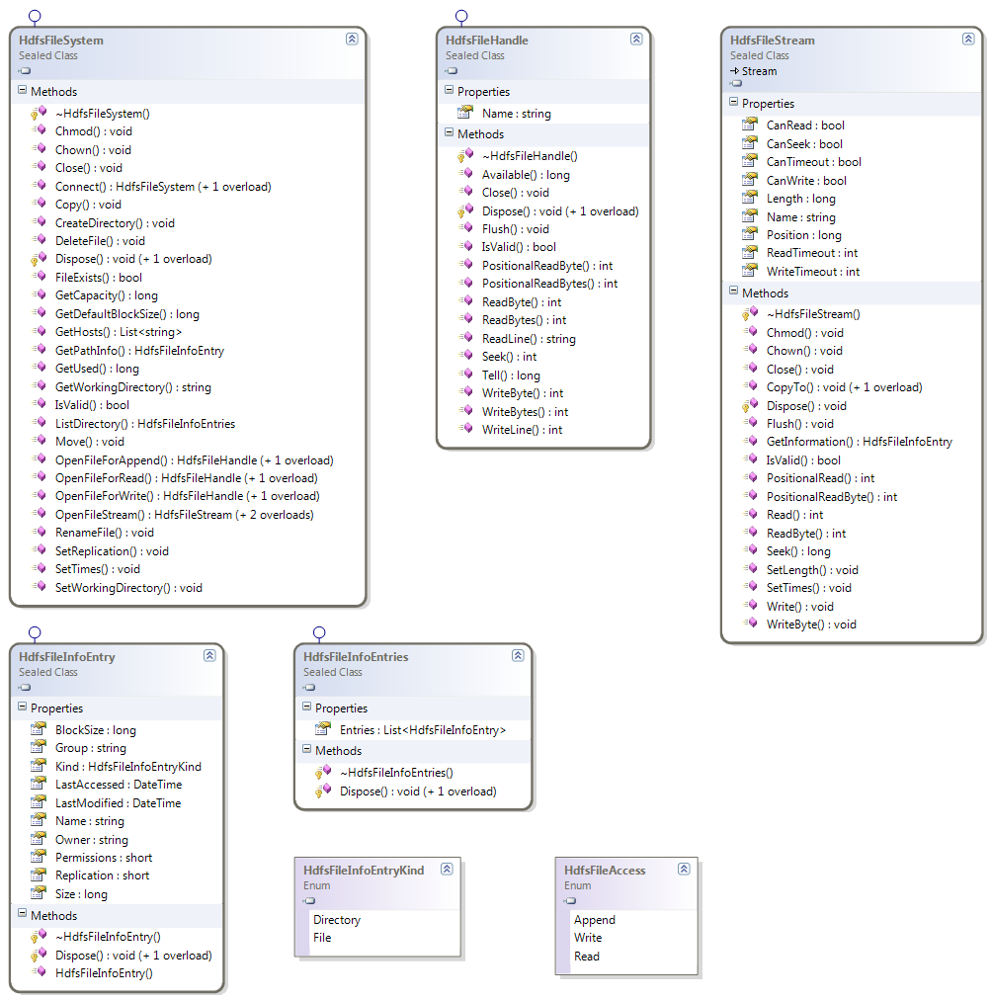

# Hadoop .Net HDFS File Access
## Requires
- Visual Studio 2010
## License
- Apache License, Version 2.0
## Technologies
- .NET Framework
- HDInsight
- Apache Hadoop
## Topics
- Hadoop
- HDFS
## Updated
- 02/08/2013
## Description

Provided with the Microsoft Distribution of Hadoop, HDInsight, is a C library for HDFS file access. This code extends this library file with a&nbsp;Managed C&#43;&#43; solution. This solution enables one to consume HDFS files from within a .Net environment.

The download not only consists of the compiled libraries but also the full source code and sample C# application that this post is based upon. You can compile the source or just use the delivered assemblies. The source supports both x86 and x64 compilations.
 However one has to remember that if one does a 32-bit compilation then a 32-bit version of the JRE will also be required.

Here is a simple class diagram of the Win HDFS Managed library:

The main premise is that the HdfsFileSystem is your starting point, from which one can acquire a HdfsFileStream or a HdfsFileHandle. From the HdfsFileStream you can perform operations one would normally expect when working with .Net Streams. From the HdfsFileHandle
 you can perform operations analogous to normal HDFS file operations.

A more complete description of the library can be found here:

<a href="http://blogs.msdn.com/b/carlnol/archive/tags/winhdfs/">http://blogs.msdn.com/b/carlnol/archive/tags/winhdfs/</a>

A quick word is warranted on appending to a file. Although the API currently supports open files for Append, this is only supported in Hadoop version 1.0.0 and above.

&nbsp;

