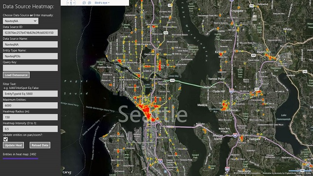

# Heat Maps of Bing Maps SDS Data Sources in Windows Store Apps (JavaScript)
## Requires
- Visual Studio 2012
## License
- MS-LPL
## Technologies
- Javascript
- Bing Maps
- Windows Store app
## Topics
- Bing Maps
- Windows Store app
## Updated
- 06/24/2013
## Description

<h1>Introduction</h1>

This code sample demonstrates how to generate heat maps of location data hosted in Bing Maps Spatial Data Services data sources using the&nbsp;JavaScript Bing Maps Windows Store App SDK. Heat maps are an effective means of visualizing trends by showing the
 relative density of location-based data.&nbsp;This example&nbsp;leverages&nbsp;the
<a href="http://bingmapsv7modules.codeplex.com/wikipage?title=Client%20Side%20Heatmap">
Heat&nbsp;Map</a> module from the Bing Maps V7 Modules project on&nbsp;Codeplex to render heat maps&nbsp;in a&nbsp;Windows Store app, drawing on the publicly available data&nbsp;sources provided by Bing Maps, as well as private data sources uploaded via Bing
 Maps Spatial Data Services.&nbsp;Various configuration parameters are exposed via the UI to enable dynamic modification of the heat map rendering options, and&nbsp;the filter criteria used to query the data sources.&nbsp;

<h1>Building the Sample</h1>

To run this sample you must install the <a href="http://go.microsoft.com/fwlink/?LinkID=264993&clcid=0x409">
Bing Maps SDK for Windows Store apps</a>&nbsp;and get a <a href="http://msdn.microsoft.com/en-us/library/ff428642.aspx">
Bing Maps key</a> for Windows Store apps. You must also have Windows 8 and Visual Studio 2012.

Open the sample in Visual Studio and insert your Bing Maps key in the&nbsp;default.html file&nbsp;where it says &ldquo;INSERT_BING_MAPS_KEY_HERE&rdquo; in the source code. You must perform the following steps for your app project to work correctly with Bing
 Maps. Detailed instructions are provided below.&nbsp;

Build the sample by press F5 or use <strong>Debug &gt; Start Debugging</strong>. To run the app without debugging, press Ctrl&#43;F5 or use
<strong>Debug &gt; Start Without Debugging</strong>

Description

This code sample shows techniques for leveraging client-side heat mapping capabilities with large data sets with the use of filtering, limiting data volumes, and rendering options included in the UI.

By generating heat maps of public Bing Maps data sources, you can enhance apps by:

<ul>
<li>showing heat maps of restaurants/bars in a city to show where nightlife is concentrated
</li><li>showing heat maps of where industry is concentrated </li><li>showing heat maps of where specific chains are </li></ul>

By generating heat maps of your own private data sources, you can identify trends in your business data, and use it to drive smarter business decisions.

<ul>
<li>You can manually choose from four publicly available data sources (FourthCoffee, NavteqNA, NavteqEU, or TrafficIncidents) or enter your own data source details and Bing Maps key, to reload the map and view your own custom data
</li><li>The app uses the current map view to retrieve only those entities in the current view
<ul>
<li>As the map is navigated, the entities in the current map view will be reloaded, unless the &lsquo;Update entities on pan/zoom?&rsquo; checkbox is de-selected. De-selecting the checkbox can be useful for analyzing a particular heatmap view without the performance
 hit of reloading all of the data </li></ul>
</li><li>You can add in your own filter text, to apply filters on-the-fly, though you must know the data source 
schema to use this effectively </li><li>You can select your own Maximum Entities value, to choose your own cut-off point in the tradeoff between performance and data volume
</li><li>As you navigate the map, you can update the heatmap radius and intensity, to best show the current data, 
based on zoom factor and data concentration
<ul>
<li>If you click the &lsquo;Update Heat&rsquo; button, it will update these attributes without reloading all of the data
</li></ul>
</li><li>If you change the Maximum Entities or Filter text, and wish to reload the data, or if you have deselected the &lsquo;Update entities on pan/zoom?&rsquo; checkbox, you can reload the data on demand with the &lsquo;Reload data&rsquo; button
</li></ul>

 
Here is a screenshot of the application, showing hotspots of restaurants in Seattle:

<h1>&nbsp;</h1>
