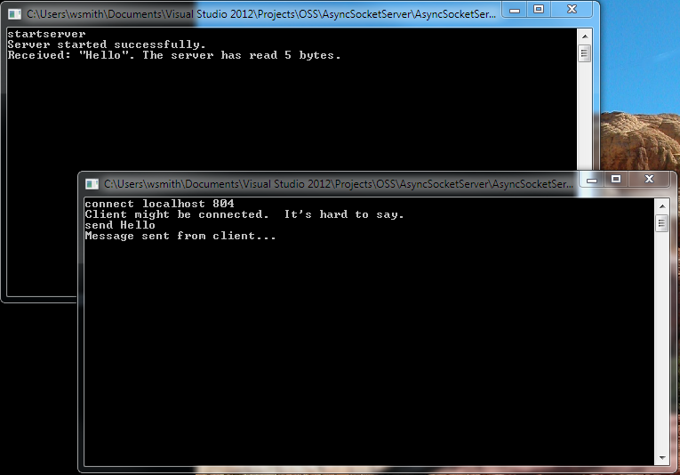

# High Performance .NET Socket Server Using Async Winsock
## Requires
- Visual Studio 2012
## License
- Apache License, Version 2.0
## Technologies
- C#
- Sockets
- Async
- Networking
- System.Net Namespace
- TCP/IP
- system.net.sockets
- Winsock
## Topics
- Asynchronous Programming
- Sockets
- Networking
- Network Programming
- TCP/IP Client/Server
- Winsock
- client server programming
## Updated
- 01/15/2014
## Description

<h1>Introduction</h1>

Sockets are the foundation of all network based programming. &nbsp;Every web server, ftp, chat, or media server is built upon the sockets API core functions. &nbsp;In a
<a title="past example" href="http://code.msdn.microsoft.com/Basic-WinSock-Sockets-6448d6ed">
past example</a>, I showed you how simple it is to build a basic client to server interaction using the sockets API in .NET. &nbsp;This example will show you how to scale the sockets API so that hundreds, or even thousands of clients can use your server at
 the same time. &nbsp;This example introduces the idea of asynchronous sockets, which were added to the Winsock framework to promote scalability in large applications. &nbsp;Async sockets use multiple application threads to simultaneously read and write to
 many connection sockets.&nbsp;

<h1>Building the Sample</h1>

This is a console application written in C# and .NET. &nbsp;This sample should be compiled in Visual Studio 2012 or above. &nbsp;You can run more than one instance of this application on a single machine, or across multiple machinees on a network, which
 in fact you will want to do to test the scalability of the application. &nbsp;Only one server should be instantiated within the application per port on a machine, however.

Description

This is quite a large example, and contains a few bits of complex code. &nbsp;However, I have tried to document the code heavily inside of the source. &nbsp;So you may want to open the source code in Visual Studio 2012 or above and follow along in there.
 &nbsp;I am going to describe the entire application here, focusing on the interesting parts of async sockets programming. &nbsp;To understand the complete flow of the example, you should examine the source or step through it, starting in the Main() function
 of the application.

Beginning at the top of the program, we have created a simple stack class, <strong>
OSAsyncEventStack</strong>,&nbsp;that will contain a reusable pool of&nbsp;SocketAsyncEventArgs that we will use in our server to handle client connections. &nbsp;You can think of SocketAsyncEventArgs as representing an async socket connection, complete with
 its underlying plumbing and sockets. &nbsp;In this example, each client that connects to the server will consume one&nbsp;SocketAsyncEventArgs instance, and to promote scalability and performance, we are going to reuse a collection of these from the stack.
 &nbsp;The stack has only two methods, Pop() and Push(). &nbsp;Those of you who remember assembler code will recognize these as gettting and putting an instance on the stack, respectively.

the next class in the example,&nbsp;<strong>OSUserToken</strong>, is where we will actually do our socket processing on the server. &nbsp;In other words, when a client is connected and the server has accepted the connection, the UserToken will be instantiated
 to read the data off of the client connection and could actually write an acknowledgment back to the &nbsp;client, although in this example that code is only partially implemented and is commented out. &nbsp;Later on, I will show you how the OSUserToken is
 tied to the actual client connection socket at run-time. &nbsp;For now, let's just look at the two functions inside of the user token that do actual work:

&nbsp;

C#

Edit|Remove

csharp
<pre class="hidden">       // This method gets the data out of the read socket and adds it to the accumulator string builder
        public bool ReadSocketData(SocketAsyncEventArgs readSocket)
        {
            Int32 bytecount = readSocket.BytesTransferred;

            if ((totalbytecount &#43; bytecount) &gt; stringbuilder.Capacity)
            {
                LastError = &quot;Receive Buffer cannot hold the entire message for this connection.&quot;;
                return false;
            }
            else
            {
                stringbuilder.Append(Encoding.ASCII.GetString(readSocket.Buffer, readSocket.Offset, bytecount));
                totalbytecount &#43;= bytecount;
                return true;
            }
        }
</pre>

<pre class="csharp">&nbsp;&nbsp;&nbsp;&nbsp;&nbsp;&nbsp;&nbsp;//&nbsp;This&nbsp;method&nbsp;gets&nbsp;the&nbsp;data&nbsp;out&nbsp;of&nbsp;the&nbsp;read&nbsp;socket&nbsp;and&nbsp;adds&nbsp;it&nbsp;to&nbsp;the&nbsp;accumulator&nbsp;string&nbsp;builder&nbsp;
&nbsp;&nbsp;&nbsp;&nbsp;&nbsp;&nbsp;&nbsp;&nbsp;public&nbsp;bool&nbsp;ReadSocketData(SocketAsyncEventArgs&nbsp;readSocket)&nbsp;
&nbsp;&nbsp;&nbsp;&nbsp;&nbsp;&nbsp;&nbsp;&nbsp;{&nbsp;
&nbsp;&nbsp;&nbsp;&nbsp;&nbsp;&nbsp;&nbsp;&nbsp;&nbsp;&nbsp;&nbsp;&nbsp;Int32&nbsp;bytecount&nbsp;=&nbsp;readSocket.BytesTransferred;&nbsp;
&nbsp;
&nbsp;&nbsp;&nbsp;&nbsp;&nbsp;&nbsp;&nbsp;&nbsp;&nbsp;&nbsp;&nbsp;&nbsp;if&nbsp;((totalbytecount&nbsp;&#43;&nbsp;bytecount)&nbsp;&gt;&nbsp;stringbuilder.Capacity)&nbsp;
&nbsp;&nbsp;&nbsp;&nbsp;&nbsp;&nbsp;&nbsp;&nbsp;&nbsp;&nbsp;&nbsp;&nbsp;{&nbsp;
&nbsp;&nbsp;&nbsp;&nbsp;&nbsp;&nbsp;&nbsp;&nbsp;&nbsp;&nbsp;&nbsp;&nbsp;&nbsp;&nbsp;&nbsp;&nbsp;LastError&nbsp;=&nbsp;&quot;Receive&nbsp;Buffer&nbsp;cannot&nbsp;hold&nbsp;the&nbsp;entire&nbsp;message&nbsp;for&nbsp;this&nbsp;connection.&quot;;&nbsp;
&nbsp;&nbsp;&nbsp;&nbsp;&nbsp;&nbsp;&nbsp;&nbsp;&nbsp;&nbsp;&nbsp;&nbsp;&nbsp;&nbsp;&nbsp;&nbsp;return&nbsp;false;&nbsp;
&nbsp;&nbsp;&nbsp;&nbsp;&nbsp;&nbsp;&nbsp;&nbsp;&nbsp;&nbsp;&nbsp;&nbsp;}&nbsp;
&nbsp;&nbsp;&nbsp;&nbsp;&nbsp;&nbsp;&nbsp;&nbsp;&nbsp;&nbsp;&nbsp;&nbsp;else&nbsp;
&nbsp;&nbsp;&nbsp;&nbsp;&nbsp;&nbsp;&nbsp;&nbsp;&nbsp;&nbsp;&nbsp;&nbsp;{&nbsp;
&nbsp;&nbsp;&nbsp;&nbsp;&nbsp;&nbsp;&nbsp;&nbsp;&nbsp;&nbsp;&nbsp;&nbsp;&nbsp;&nbsp;&nbsp;&nbsp;stringbuilder.Append(Encoding.ASCII.GetString(readSocket.Buffer,&nbsp;readSocket.Offset,&nbsp;bytecount));&nbsp;
&nbsp;&nbsp;&nbsp;&nbsp;&nbsp;&nbsp;&nbsp;&nbsp;&nbsp;&nbsp;&nbsp;&nbsp;&nbsp;&nbsp;&nbsp;&nbsp;totalbytecount&nbsp;&#43;=&nbsp;bytecount;&nbsp;
&nbsp;&nbsp;&nbsp;&nbsp;&nbsp;&nbsp;&nbsp;&nbsp;&nbsp;&nbsp;&nbsp;&nbsp;&nbsp;&nbsp;&nbsp;&nbsp;return&nbsp;true;&nbsp;
&nbsp;&nbsp;&nbsp;&nbsp;&nbsp;&nbsp;&nbsp;&nbsp;&nbsp;&nbsp;&nbsp;&nbsp;}&nbsp;
&nbsp;&nbsp;&nbsp;&nbsp;&nbsp;&nbsp;&nbsp;&nbsp;}&nbsp;
</pre>

&nbsp;The ReadSocketData() function reads the data on the client connection socket (called a read socket). &nbsp;When we instantiate the UserToken class, we specify how big a client message can be in total. &nbsp;This function checks
 to see whether our buffer (in this case a StringBuilder) can hold any more read data, and if it can we append the data in the read socket to the string. &nbsp;To understand this function, it is important to know that a client can send many packets of information
 to a server through a connection, and each one will generate a read socket on that connection. &nbsp;So we may need to call this function many timed for a single client connection, in order to receive the entire message from the client.

&nbsp;

When we have finished receiving data from the client, we probably want to do something useful with it. &nbsp;The ProcessData() function is where we do that.

C#

Edit|Remove

csharp
<pre class="hidden">      // Do something with the received data, then reset the token for use by another connection.
        // This is called when all of the data have been received for a read socket.
        public void ProcessData(SocketAsyncEventArgs args)
        {
            // Get the last message received from the client, which has been stored in the stringbuilder.
            String received = stringbuilder.ToString();

            //TODO Use message received to perform a specific operation.
            Console.WriteLine(&quot;Received: \&quot;{0}\&quot;. The server has read {1} bytes.&quot;, received, received.Length);

            //TODO: Load up a send buffer to send an ack back to the calling client
            //Byte[] sendBuffer = Encoding.ASCII.GetBytes(received);
            //args.SetBuffer(sendBuffer, 0, sendBuffer.Length);

            // Clear StringBuffer, so it can receive more data from the client.
            stringbuilder.Length = 0;
            totalbytecount = 0;
        }
</pre>

<pre class="csharp">&nbsp;&nbsp;&nbsp;&nbsp;&nbsp;&nbsp;//&nbsp;Do&nbsp;something&nbsp;with&nbsp;the&nbsp;received&nbsp;data,&nbsp;then&nbsp;reset&nbsp;the&nbsp;token&nbsp;for&nbsp;use&nbsp;by&nbsp;another&nbsp;connection.&nbsp;
&nbsp;&nbsp;&nbsp;&nbsp;&nbsp;&nbsp;&nbsp;&nbsp;//&nbsp;This&nbsp;is&nbsp;called&nbsp;when&nbsp;all&nbsp;of&nbsp;the&nbsp;data&nbsp;have&nbsp;been&nbsp;received&nbsp;for&nbsp;a&nbsp;read&nbsp;socket.&nbsp;
&nbsp;&nbsp;&nbsp;&nbsp;&nbsp;&nbsp;&nbsp;&nbsp;public&nbsp;void&nbsp;ProcessData(SocketAsyncEventArgs&nbsp;args)&nbsp;
&nbsp;&nbsp;&nbsp;&nbsp;&nbsp;&nbsp;&nbsp;&nbsp;{&nbsp;
&nbsp;&nbsp;&nbsp;&nbsp;&nbsp;&nbsp;&nbsp;&nbsp;&nbsp;&nbsp;&nbsp;&nbsp;//&nbsp;Get&nbsp;the&nbsp;last&nbsp;message&nbsp;received&nbsp;from&nbsp;the&nbsp;client,&nbsp;which&nbsp;has&nbsp;been&nbsp;stored&nbsp;in&nbsp;the&nbsp;stringbuilder.&nbsp;
&nbsp;&nbsp;&nbsp;&nbsp;&nbsp;&nbsp;&nbsp;&nbsp;&nbsp;&nbsp;&nbsp;&nbsp;String&nbsp;received&nbsp;=&nbsp;stringbuilder.ToString();&nbsp;
&nbsp;
&nbsp;&nbsp;&nbsp;&nbsp;&nbsp;&nbsp;&nbsp;&nbsp;&nbsp;&nbsp;&nbsp;&nbsp;//TODO&nbsp;Use&nbsp;message&nbsp;received&nbsp;to&nbsp;perform&nbsp;a&nbsp;specific&nbsp;operation.&nbsp;
&nbsp;&nbsp;&nbsp;&nbsp;&nbsp;&nbsp;&nbsp;&nbsp;&nbsp;&nbsp;&nbsp;&nbsp;Console.WriteLine(&quot;Received:&nbsp;\&quot;{0}\&quot;.&nbsp;The&nbsp;server&nbsp;has&nbsp;read&nbsp;{1}&nbsp;bytes.&quot;,&nbsp;received,&nbsp;received.Length);&nbsp;
&nbsp;
&nbsp;&nbsp;&nbsp;&nbsp;&nbsp;&nbsp;&nbsp;&nbsp;&nbsp;&nbsp;&nbsp;&nbsp;//TODO:&nbsp;Load&nbsp;up&nbsp;a&nbsp;send&nbsp;buffer&nbsp;to&nbsp;send&nbsp;an&nbsp;ack&nbsp;back&nbsp;to&nbsp;the&nbsp;calling&nbsp;client&nbsp;
&nbsp;&nbsp;&nbsp;&nbsp;&nbsp;&nbsp;&nbsp;&nbsp;&nbsp;&nbsp;&nbsp;&nbsp;//Byte[]&nbsp;sendBuffer&nbsp;=&nbsp;Encoding.ASCII.GetBytes(received);&nbsp;
&nbsp;&nbsp;&nbsp;&nbsp;&nbsp;&nbsp;&nbsp;&nbsp;&nbsp;&nbsp;&nbsp;&nbsp;//args.SetBuffer(sendBuffer,&nbsp;0,&nbsp;sendBuffer.Length);&nbsp;
&nbsp;
&nbsp;&nbsp;&nbsp;&nbsp;&nbsp;&nbsp;&nbsp;&nbsp;&nbsp;&nbsp;&nbsp;&nbsp;//&nbsp;Clear&nbsp;StringBuffer,&nbsp;so&nbsp;it&nbsp;can&nbsp;receive&nbsp;more&nbsp;data&nbsp;from&nbsp;the&nbsp;client.&nbsp;
&nbsp;&nbsp;&nbsp;&nbsp;&nbsp;&nbsp;&nbsp;&nbsp;&nbsp;&nbsp;&nbsp;&nbsp;stringbuilder.Length&nbsp;=&nbsp;0;&nbsp;
&nbsp;&nbsp;&nbsp;&nbsp;&nbsp;&nbsp;&nbsp;&nbsp;&nbsp;&nbsp;&nbsp;&nbsp;totalbytecount&nbsp;=&nbsp;0;&nbsp;
&nbsp;&nbsp;&nbsp;&nbsp;&nbsp;&nbsp;&nbsp;&nbsp;}&nbsp;
</pre>

In our example, we are going to echo to the console whatever message was received from the client. &nbsp;We could also send something back to the client at this point, but we are not going to do that in our example, so that code is commented out. &nbsp;When
 we are done with the processing, we clear out the string builder because each user token will be contained within an AsyncEventArgs instance on the reusable stack that we established earlier, so we may want to use the user token over and over again.

Now we move on to the <strong>OSCore </strong>class. &nbsp;This example contains both client and server code. &nbsp;As we saw in my earlier example, Winsock clients and servers share a lot of common code. &nbsp;This class contains the code that is common
 for our client and server classes.

Some things that are contained in this class that you might want to change are the default server name, port, and buffer size for the application. &nbsp;In a real application, you would probably put these in a configuration file and read them in at start
 up. &nbsp;

The two core functions in this class are the CreateIPEndPoint() function, which takes a server name and port number and converts it into a structure that the socket needs to be instantiated. &nbsp;It looks like this:

&nbsp;

C#

Edit|Remove

csharp
<pre class="hidden">       // An IPEndPoint contains all of the information about a server or client
        // machine that a socket needs.  Here we create one from information
        // that we send in as parameters
        public IPEndPoint CreateIPEndPoint(string servername, int portnumber)
        {
            try
            {
                // We get the IP address and stuff from DNS (Domain Name Services)
                // I think you can also pass in an IP address, but I would not because
                // that would not be extensible to IPV6 later
                IPHostEntry hostInfo = Dns.GetHostEntry(servername);
                IPAddress serverAddr = hostInfo.AddressList[0];
                return new IPEndPoint(serverAddr, portnumber);
            }
            catch (Exception ex)
            {
                exceptionthrown = true;
                lasterror = ex.ToString();
                return null;
            }
        }
</pre>

<pre class="csharp">&nbsp;&nbsp;&nbsp;&nbsp;&nbsp;&nbsp;&nbsp;//&nbsp;An&nbsp;IPEndPoint&nbsp;contains&nbsp;all&nbsp;of&nbsp;the&nbsp;information&nbsp;about&nbsp;a&nbsp;server&nbsp;or&nbsp;client&nbsp;
&nbsp;&nbsp;&nbsp;&nbsp;&nbsp;&nbsp;&nbsp;&nbsp;//&nbsp;machine&nbsp;that&nbsp;a&nbsp;socket&nbsp;needs.&nbsp;&nbsp;Here&nbsp;we&nbsp;create&nbsp;one&nbsp;from&nbsp;information&nbsp;
&nbsp;&nbsp;&nbsp;&nbsp;&nbsp;&nbsp;&nbsp;&nbsp;//&nbsp;that&nbsp;we&nbsp;send&nbsp;in&nbsp;as&nbsp;parameters&nbsp;
&nbsp;&nbsp;&nbsp;&nbsp;&nbsp;&nbsp;&nbsp;&nbsp;public&nbsp;IPEndPoint&nbsp;CreateIPEndPoint(string&nbsp;servername,&nbsp;int&nbsp;portnumber)&nbsp;
&nbsp;&nbsp;&nbsp;&nbsp;&nbsp;&nbsp;&nbsp;&nbsp;{&nbsp;
&nbsp;&nbsp;&nbsp;&nbsp;&nbsp;&nbsp;&nbsp;&nbsp;&nbsp;&nbsp;&nbsp;&nbsp;try&nbsp;
&nbsp;&nbsp;&nbsp;&nbsp;&nbsp;&nbsp;&nbsp;&nbsp;&nbsp;&nbsp;&nbsp;&nbsp;{&nbsp;
&nbsp;&nbsp;&nbsp;&nbsp;&nbsp;&nbsp;&nbsp;&nbsp;&nbsp;&nbsp;&nbsp;&nbsp;&nbsp;&nbsp;&nbsp;&nbsp;//&nbsp;We&nbsp;get&nbsp;the&nbsp;IP&nbsp;address&nbsp;and&nbsp;stuff&nbsp;from&nbsp;DNS&nbsp;(Domain&nbsp;Name&nbsp;Services)&nbsp;
&nbsp;&nbsp;&nbsp;&nbsp;&nbsp;&nbsp;&nbsp;&nbsp;&nbsp;&nbsp;&nbsp;&nbsp;&nbsp;&nbsp;&nbsp;&nbsp;//&nbsp;I&nbsp;think&nbsp;you&nbsp;can&nbsp;also&nbsp;pass&nbsp;in&nbsp;an&nbsp;IP&nbsp;address,&nbsp;but&nbsp;I&nbsp;would&nbsp;not&nbsp;because&nbsp;
&nbsp;&nbsp;&nbsp;&nbsp;&nbsp;&nbsp;&nbsp;&nbsp;&nbsp;&nbsp;&nbsp;&nbsp;&nbsp;&nbsp;&nbsp;&nbsp;//&nbsp;that&nbsp;would&nbsp;not&nbsp;be&nbsp;extensible&nbsp;to&nbsp;IPV6&nbsp;later&nbsp;
&nbsp;&nbsp;&nbsp;&nbsp;&nbsp;&nbsp;&nbsp;&nbsp;&nbsp;&nbsp;&nbsp;&nbsp;&nbsp;&nbsp;&nbsp;&nbsp;IPHostEntry&nbsp;hostInfo&nbsp;=&nbsp;Dns.GetHostEntry(servername);&nbsp;
&nbsp;&nbsp;&nbsp;&nbsp;&nbsp;&nbsp;&nbsp;&nbsp;&nbsp;&nbsp;&nbsp;&nbsp;&nbsp;&nbsp;&nbsp;&nbsp;IPAddress&nbsp;serverAddr&nbsp;=&nbsp;hostInfo.AddressList[0];&nbsp;
&nbsp;&nbsp;&nbsp;&nbsp;&nbsp;&nbsp;&nbsp;&nbsp;&nbsp;&nbsp;&nbsp;&nbsp;&nbsp;&nbsp;&nbsp;&nbsp;return&nbsp;new&nbsp;IPEndPoint(serverAddr,&nbsp;portnumber);&nbsp;
&nbsp;&nbsp;&nbsp;&nbsp;&nbsp;&nbsp;&nbsp;&nbsp;&nbsp;&nbsp;&nbsp;&nbsp;}&nbsp;
&nbsp;&nbsp;&nbsp;&nbsp;&nbsp;&nbsp;&nbsp;&nbsp;&nbsp;&nbsp;&nbsp;&nbsp;catch&nbsp;(Exception&nbsp;ex)&nbsp;
&nbsp;&nbsp;&nbsp;&nbsp;&nbsp;&nbsp;&nbsp;&nbsp;&nbsp;&nbsp;&nbsp;&nbsp;{&nbsp;
&nbsp;&nbsp;&nbsp;&nbsp;&nbsp;&nbsp;&nbsp;&nbsp;&nbsp;&nbsp;&nbsp;&nbsp;&nbsp;&nbsp;&nbsp;&nbsp;exceptionthrown&nbsp;=&nbsp;true;&nbsp;
&nbsp;&nbsp;&nbsp;&nbsp;&nbsp;&nbsp;&nbsp;&nbsp;&nbsp;&nbsp;&nbsp;&nbsp;&nbsp;&nbsp;&nbsp;&nbsp;lasterror&nbsp;=&nbsp;ex.ToString();&nbsp;
&nbsp;&nbsp;&nbsp;&nbsp;&nbsp;&nbsp;&nbsp;&nbsp;&nbsp;&nbsp;&nbsp;&nbsp;&nbsp;&nbsp;&nbsp;&nbsp;return&nbsp;null;&nbsp;
&nbsp;&nbsp;&nbsp;&nbsp;&nbsp;&nbsp;&nbsp;&nbsp;&nbsp;&nbsp;&nbsp;&nbsp;}&nbsp;
&nbsp;&nbsp;&nbsp;&nbsp;&nbsp;&nbsp;&nbsp;&nbsp;}&nbsp;
</pre>

&nbsp;The other important function takes the IPEndPoint and uses it to create a connection socket, either for the client or the server. &nbsp;It is called CreateSocket(). &nbsp;Think of a connection socket as the plug that connects
 the client or server application to the network. &nbsp;Each side of the connection needs a socket to communicate over the network. &nbsp;Only one line of code is needed to create a Winsock connection socket. &nbsp;It looks like this:

C#

Edit|Remove

csharp
<pre class="hidden">connectionsocket = new Socket(connectionendpoint.AddressFamily, SocketType.Stream, ProtocolType.Tcp);</pre>

<pre class="csharp">connectionsocket&nbsp;=&nbsp;new&nbsp;Socket(connectionendpoint.AddressFamily,&nbsp;SocketType.Stream,&nbsp;ProtocolType.Tcp);</pre>

CreateSocket() does some other things to allow flexibility in the socket creation, but they are pretty self-explanatory so I won't go into them here.

Now we come to the meet of the example, the <strong>
OSServer</strong> class. &nbsp;This class creates and manages the socket server. &nbsp;It is derived from OSCore, as you might expect. &nbsp;At the top of the class, we do a couple of things:

C#

Edit|Remove

csharp
<pre class="hidden">       // We limit this server client connections for test purposes
        protected const int DEFAULT_MAX_CONNECTIONS = 4;

        // We use a Mutex to block the listener thread so that limited client connections are active
        // on the server.  If you stop the server, the mutex is released. 
        private static Mutex mutex;

        // Here is where we track the number of client connections
        protected int numconnections;

        // Here is where we track the totalbytes read by the server
        protected int totalbytesread;

        // Here is our stack of available accept sockets
        protected OSAsyncEventStack socketpool;</pre>

<pre class="csharp">&nbsp;&nbsp;&nbsp;&nbsp;&nbsp;&nbsp;&nbsp;//&nbsp;We&nbsp;limit&nbsp;this&nbsp;server&nbsp;client&nbsp;connections&nbsp;for&nbsp;test&nbsp;purposes&nbsp;
&nbsp;&nbsp;&nbsp;&nbsp;&nbsp;&nbsp;&nbsp;&nbsp;protected&nbsp;const&nbsp;int&nbsp;DEFAULT_MAX_CONNECTIONS&nbsp;=&nbsp;4;&nbsp;
&nbsp;
&nbsp;&nbsp;&nbsp;&nbsp;&nbsp;&nbsp;&nbsp;&nbsp;//&nbsp;We&nbsp;use&nbsp;a&nbsp;Mutex&nbsp;to&nbsp;block&nbsp;the&nbsp;listener&nbsp;thread&nbsp;so&nbsp;that&nbsp;limited&nbsp;client&nbsp;connections&nbsp;are&nbsp;active&nbsp;
&nbsp;&nbsp;&nbsp;&nbsp;&nbsp;&nbsp;&nbsp;&nbsp;//&nbsp;on&nbsp;the&nbsp;server.&nbsp;&nbsp;If&nbsp;you&nbsp;stop&nbsp;the&nbsp;server,&nbsp;the&nbsp;mutex&nbsp;is&nbsp;released.&nbsp;&nbsp;
&nbsp;&nbsp;&nbsp;&nbsp;&nbsp;&nbsp;&nbsp;&nbsp;private&nbsp;static&nbsp;Mutex&nbsp;mutex;&nbsp;
&nbsp;
&nbsp;&nbsp;&nbsp;&nbsp;&nbsp;&nbsp;&nbsp;&nbsp;//&nbsp;Here&nbsp;is&nbsp;where&nbsp;we&nbsp;track&nbsp;the&nbsp;number&nbsp;of&nbsp;client&nbsp;connections&nbsp;
&nbsp;&nbsp;&nbsp;&nbsp;&nbsp;&nbsp;&nbsp;&nbsp;protected&nbsp;int&nbsp;numconnections;&nbsp;
&nbsp;
&nbsp;&nbsp;&nbsp;&nbsp;&nbsp;&nbsp;&nbsp;&nbsp;//&nbsp;Here&nbsp;is&nbsp;where&nbsp;we&nbsp;track&nbsp;the&nbsp;totalbytes&nbsp;read&nbsp;by&nbsp;the&nbsp;server&nbsp;
&nbsp;&nbsp;&nbsp;&nbsp;&nbsp;&nbsp;&nbsp;&nbsp;protected&nbsp;int&nbsp;totalbytesread;&nbsp;
&nbsp;
&nbsp;&nbsp;&nbsp;&nbsp;&nbsp;&nbsp;&nbsp;&nbsp;//&nbsp;Here&nbsp;is&nbsp;our&nbsp;stack&nbsp;of&nbsp;available&nbsp;accept&nbsp;sockets&nbsp;
&nbsp;&nbsp;&nbsp;&nbsp;&nbsp;&nbsp;&nbsp;&nbsp;protected&nbsp;OSAsyncEventStack&nbsp;socketpool;</pre>

&nbsp;Notice that our server is limited to 4 client connections. &nbsp;You can change this if you like. &nbsp;If you test the server and open up 5 copies of the application as clients, you will see that only 4 can connect. &nbsp;The
 5th client is unable to send messages to the server. &nbsp;Also notice that we name our socketpool object here of our type OSAsyncEventStack.

In our default constructor, we set up the things we need to make the server work:

C#

Edit|Remove

csharp
<pre class="hidden">        // Default constructor
        public OSServer()
        {
            exceptionthrown = false;

            // First we set up our mutex
            mutex = new Mutex();
            numconnections = 0;

            // Then we create our stack of read sockets
            socketpool = new OSAsyncEventStack(DEFAULT_MAX_CONNECTIONS);

            // Now we create enough read sockets to service the maximum number of clients
            // that we will allow on the server
            // We also assign the event handler for IO Completed to each socket as we create it
            // and set up its buffer to the right size.
            // Then we push it onto our stack to wait for a client connection
            for (Int32 i = 0; i &lt; DEFAULT_MAX_CONNECTIONS; i&#43;&#43;)
            {
                SocketAsyncEventArgs item = new SocketAsyncEventArgs();
                item.Completed &#43;= new EventHandler&lt;SocketAsyncEventArgs&gt;(OnIOCompleted);
                item.SetBuffer(new Byte[DEFAULT_BUFFER_SIZE], 0, DEFAULT_BUFFER_SIZE);
                socketpool.Push(item);
            }
        }</pre>

<pre class="csharp">&nbsp;&nbsp;&nbsp;&nbsp;&nbsp;&nbsp;&nbsp;&nbsp;//&nbsp;Default&nbsp;constructor&nbsp;
&nbsp;&nbsp;&nbsp;&nbsp;&nbsp;&nbsp;&nbsp;&nbsp;public&nbsp;OSServer()&nbsp;
&nbsp;&nbsp;&nbsp;&nbsp;&nbsp;&nbsp;&nbsp;&nbsp;{&nbsp;
&nbsp;&nbsp;&nbsp;&nbsp;&nbsp;&nbsp;&nbsp;&nbsp;&nbsp;&nbsp;&nbsp;&nbsp;exceptionthrown&nbsp;=&nbsp;false;&nbsp;
&nbsp;
&nbsp;&nbsp;&nbsp;&nbsp;&nbsp;&nbsp;&nbsp;&nbsp;&nbsp;&nbsp;&nbsp;&nbsp;//&nbsp;First&nbsp;we&nbsp;set&nbsp;up&nbsp;our&nbsp;mutex&nbsp;
&nbsp;&nbsp;&nbsp;&nbsp;&nbsp;&nbsp;&nbsp;&nbsp;&nbsp;&nbsp;&nbsp;&nbsp;mutex&nbsp;=&nbsp;new&nbsp;Mutex();&nbsp;
&nbsp;&nbsp;&nbsp;&nbsp;&nbsp;&nbsp;&nbsp;&nbsp;&nbsp;&nbsp;&nbsp;&nbsp;numconnections&nbsp;=&nbsp;0;&nbsp;
&nbsp;
&nbsp;&nbsp;&nbsp;&nbsp;&nbsp;&nbsp;&nbsp;&nbsp;&nbsp;&nbsp;&nbsp;&nbsp;//&nbsp;Then&nbsp;we&nbsp;create&nbsp;our&nbsp;stack&nbsp;of&nbsp;read&nbsp;sockets&nbsp;
&nbsp;&nbsp;&nbsp;&nbsp;&nbsp;&nbsp;&nbsp;&nbsp;&nbsp;&nbsp;&nbsp;&nbsp;socketpool&nbsp;=&nbsp;new&nbsp;OSAsyncEventStack(DEFAULT_MAX_CONNECTIONS);&nbsp;
&nbsp;
&nbsp;&nbsp;&nbsp;&nbsp;&nbsp;&nbsp;&nbsp;&nbsp;&nbsp;&nbsp;&nbsp;&nbsp;//&nbsp;Now&nbsp;we&nbsp;create&nbsp;enough&nbsp;read&nbsp;sockets&nbsp;to&nbsp;service&nbsp;the&nbsp;maximum&nbsp;number&nbsp;of&nbsp;clients&nbsp;
&nbsp;&nbsp;&nbsp;&nbsp;&nbsp;&nbsp;&nbsp;&nbsp;&nbsp;&nbsp;&nbsp;&nbsp;//&nbsp;that&nbsp;we&nbsp;will&nbsp;allow&nbsp;on&nbsp;the&nbsp;server&nbsp;
&nbsp;&nbsp;&nbsp;&nbsp;&nbsp;&nbsp;&nbsp;&nbsp;&nbsp;&nbsp;&nbsp;&nbsp;//&nbsp;We&nbsp;also&nbsp;assign&nbsp;the&nbsp;event&nbsp;handler&nbsp;for&nbsp;IO&nbsp;Completed&nbsp;to&nbsp;each&nbsp;socket&nbsp;as&nbsp;we&nbsp;create&nbsp;it&nbsp;
&nbsp;&nbsp;&nbsp;&nbsp;&nbsp;&nbsp;&nbsp;&nbsp;&nbsp;&nbsp;&nbsp;&nbsp;//&nbsp;and&nbsp;set&nbsp;up&nbsp;its&nbsp;buffer&nbsp;to&nbsp;the&nbsp;right&nbsp;size.&nbsp;
&nbsp;&nbsp;&nbsp;&nbsp;&nbsp;&nbsp;&nbsp;&nbsp;&nbsp;&nbsp;&nbsp;&nbsp;//&nbsp;Then&nbsp;we&nbsp;push&nbsp;it&nbsp;onto&nbsp;our&nbsp;stack&nbsp;to&nbsp;wait&nbsp;for&nbsp;a&nbsp;client&nbsp;connection&nbsp;
&nbsp;&nbsp;&nbsp;&nbsp;&nbsp;&nbsp;&nbsp;&nbsp;&nbsp;&nbsp;&nbsp;&nbsp;for&nbsp;(Int32&nbsp;i&nbsp;=&nbsp;0;&nbsp;i&nbsp;&lt;&nbsp;DEFAULT_MAX_CONNECTIONS;&nbsp;i&#43;&#43;)&nbsp;
&nbsp;&nbsp;&nbsp;&nbsp;&nbsp;&nbsp;&nbsp;&nbsp;&nbsp;&nbsp;&nbsp;&nbsp;{&nbsp;
&nbsp;&nbsp;&nbsp;&nbsp;&nbsp;&nbsp;&nbsp;&nbsp;&nbsp;&nbsp;&nbsp;&nbsp;&nbsp;&nbsp;&nbsp;&nbsp;SocketAsyncEventArgs&nbsp;item&nbsp;=&nbsp;new&nbsp;SocketAsyncEventArgs();&nbsp;
&nbsp;&nbsp;&nbsp;&nbsp;&nbsp;&nbsp;&nbsp;&nbsp;&nbsp;&nbsp;&nbsp;&nbsp;&nbsp;&nbsp;&nbsp;&nbsp;item.Completed&nbsp;&#43;=&nbsp;new&nbsp;EventHandler&lt;SocketAsyncEventArgs&gt;(OnIOCompleted);&nbsp;
&nbsp;&nbsp;&nbsp;&nbsp;&nbsp;&nbsp;&nbsp;&nbsp;&nbsp;&nbsp;&nbsp;&nbsp;&nbsp;&nbsp;&nbsp;&nbsp;item.SetBuffer(new&nbsp;Byte[DEFAULT_BUFFER_SIZE],&nbsp;0,&nbsp;DEFAULT_BUFFER_SIZE);&nbsp;
&nbsp;&nbsp;&nbsp;&nbsp;&nbsp;&nbsp;&nbsp;&nbsp;&nbsp;&nbsp;&nbsp;&nbsp;&nbsp;&nbsp;&nbsp;&nbsp;socketpool.Push(item);&nbsp;
&nbsp;&nbsp;&nbsp;&nbsp;&nbsp;&nbsp;&nbsp;&nbsp;&nbsp;&nbsp;&nbsp;&nbsp;}&nbsp;
&nbsp;&nbsp;&nbsp;&nbsp;&nbsp;&nbsp;&nbsp;&nbsp;}</pre>

&nbsp;We will use a Mutex to control thread safety in the application. &nbsp;We will look at that more later. &nbsp;Then we create our socket pool, and fill it with SocketAsyncEventArg objects, as many as we can have client connections
 (DEFAULT_MAX_CONNECTIONS). &nbsp;Notice within this loop that we also attach the OnIOCompleted function to the Completed event in each SocketAsyncEventArgs item in our pool. &nbsp;This will cause that event to fire and run that function anytime a socket finishes
 an IO (Input/Output) operation, in other words a read or write to the socket.

To start the server, we call the Start() function.

C#

Edit|Remove

csharp
<pre class="hidden">      // We call this method once to start the server if it is not started
        public bool Start(string cmdstring)
        {
            exceptionthrown = false;

            // First create a generic socket
            if(CreateSocket(cmdstring))
            {
                try
                {
                    // Now make it a listener socket at the IP address and port that we specified
                    connectionsocket.Bind(connectionendpoint);

                    // Now start listening on the listener socket and wait for asynchronous client connections
                    connectionsocket.Listen(DEFAULT_MAX_CONNECTIONS);
                    StartAcceptAsync(null);
                    mutex.WaitOne();
                    return true;
                }
                catch (Exception ex)
                {
                    exceptionthrown = true;
                    lasterror = ex.ToString();
                    return false;
                }
            }
            else
            {
                lasterror = &quot;Unknown Error in Server Start.&quot;;
                return false;
            }
        }</pre>

<pre class="csharp">&nbsp;&nbsp;&nbsp;&nbsp;&nbsp;&nbsp;//&nbsp;We&nbsp;call&nbsp;this&nbsp;method&nbsp;once&nbsp;to&nbsp;start&nbsp;the&nbsp;server&nbsp;if&nbsp;it&nbsp;is&nbsp;not&nbsp;started&nbsp;
&nbsp;&nbsp;&nbsp;&nbsp;&nbsp;&nbsp;&nbsp;&nbsp;public&nbsp;bool&nbsp;Start(string&nbsp;cmdstring)&nbsp;
&nbsp;&nbsp;&nbsp;&nbsp;&nbsp;&nbsp;&nbsp;&nbsp;{&nbsp;
&nbsp;&nbsp;&nbsp;&nbsp;&nbsp;&nbsp;&nbsp;&nbsp;&nbsp;&nbsp;&nbsp;&nbsp;exceptionthrown&nbsp;=&nbsp;false;&nbsp;
&nbsp;
&nbsp;&nbsp;&nbsp;&nbsp;&nbsp;&nbsp;&nbsp;&nbsp;&nbsp;&nbsp;&nbsp;&nbsp;//&nbsp;First&nbsp;create&nbsp;a&nbsp;generic&nbsp;socket&nbsp;
&nbsp;&nbsp;&nbsp;&nbsp;&nbsp;&nbsp;&nbsp;&nbsp;&nbsp;&nbsp;&nbsp;&nbsp;if(CreateSocket(cmdstring))&nbsp;
&nbsp;&nbsp;&nbsp;&nbsp;&nbsp;&nbsp;&nbsp;&nbsp;&nbsp;&nbsp;&nbsp;&nbsp;{&nbsp;
&nbsp;&nbsp;&nbsp;&nbsp;&nbsp;&nbsp;&nbsp;&nbsp;&nbsp;&nbsp;&nbsp;&nbsp;&nbsp;&nbsp;&nbsp;&nbsp;try&nbsp;
&nbsp;&nbsp;&nbsp;&nbsp;&nbsp;&nbsp;&nbsp;&nbsp;&nbsp;&nbsp;&nbsp;&nbsp;&nbsp;&nbsp;&nbsp;&nbsp;{&nbsp;
&nbsp;&nbsp;&nbsp;&nbsp;&nbsp;&nbsp;&nbsp;&nbsp;&nbsp;&nbsp;&nbsp;&nbsp;&nbsp;&nbsp;&nbsp;&nbsp;&nbsp;&nbsp;&nbsp;&nbsp;//&nbsp;Now&nbsp;make&nbsp;it&nbsp;a&nbsp;listener&nbsp;socket&nbsp;at&nbsp;the&nbsp;IP&nbsp;address&nbsp;and&nbsp;port&nbsp;that&nbsp;we&nbsp;specified&nbsp;
&nbsp;&nbsp;&nbsp;&nbsp;&nbsp;&nbsp;&nbsp;&nbsp;&nbsp;&nbsp;&nbsp;&nbsp;&nbsp;&nbsp;&nbsp;&nbsp;&nbsp;&nbsp;&nbsp;&nbsp;connectionsocket.Bind(connectionendpoint);&nbsp;
&nbsp;
&nbsp;&nbsp;&nbsp;&nbsp;&nbsp;&nbsp;&nbsp;&nbsp;&nbsp;&nbsp;&nbsp;&nbsp;&nbsp;&nbsp;&nbsp;&nbsp;&nbsp;&nbsp;&nbsp;&nbsp;//&nbsp;Now&nbsp;start&nbsp;listening&nbsp;on&nbsp;the&nbsp;listener&nbsp;socket&nbsp;and&nbsp;wait&nbsp;for&nbsp;asynchronous&nbsp;client&nbsp;connections&nbsp;
&nbsp;&nbsp;&nbsp;&nbsp;&nbsp;&nbsp;&nbsp;&nbsp;&nbsp;&nbsp;&nbsp;&nbsp;&nbsp;&nbsp;&nbsp;&nbsp;&nbsp;&nbsp;&nbsp;&nbsp;connectionsocket.Listen(DEFAULT_MAX_CONNECTIONS);&nbsp;
&nbsp;&nbsp;&nbsp;&nbsp;&nbsp;&nbsp;&nbsp;&nbsp;&nbsp;&nbsp;&nbsp;&nbsp;&nbsp;&nbsp;&nbsp;&nbsp;&nbsp;&nbsp;&nbsp;&nbsp;StartAcceptAsync(null);&nbsp;
&nbsp;&nbsp;&nbsp;&nbsp;&nbsp;&nbsp;&nbsp;&nbsp;&nbsp;&nbsp;&nbsp;&nbsp;&nbsp;&nbsp;&nbsp;&nbsp;&nbsp;&nbsp;&nbsp;&nbsp;mutex.WaitOne();&nbsp;
&nbsp;&nbsp;&nbsp;&nbsp;&nbsp;&nbsp;&nbsp;&nbsp;&nbsp;&nbsp;&nbsp;&nbsp;&nbsp;&nbsp;&nbsp;&nbsp;&nbsp;&nbsp;&nbsp;&nbsp;return&nbsp;true;&nbsp;
&nbsp;&nbsp;&nbsp;&nbsp;&nbsp;&nbsp;&nbsp;&nbsp;&nbsp;&nbsp;&nbsp;&nbsp;&nbsp;&nbsp;&nbsp;&nbsp;}&nbsp;
&nbsp;&nbsp;&nbsp;&nbsp;&nbsp;&nbsp;&nbsp;&nbsp;&nbsp;&nbsp;&nbsp;&nbsp;&nbsp;&nbsp;&nbsp;&nbsp;catch&nbsp;(Exception&nbsp;ex)&nbsp;
&nbsp;&nbsp;&nbsp;&nbsp;&nbsp;&nbsp;&nbsp;&nbsp;&nbsp;&nbsp;&nbsp;&nbsp;&nbsp;&nbsp;&nbsp;&nbsp;{&nbsp;
&nbsp;&nbsp;&nbsp;&nbsp;&nbsp;&nbsp;&nbsp;&nbsp;&nbsp;&nbsp;&nbsp;&nbsp;&nbsp;&nbsp;&nbsp;&nbsp;&nbsp;&nbsp;&nbsp;&nbsp;exceptionthrown&nbsp;=&nbsp;true;&nbsp;
&nbsp;&nbsp;&nbsp;&nbsp;&nbsp;&nbsp;&nbsp;&nbsp;&nbsp;&nbsp;&nbsp;&nbsp;&nbsp;&nbsp;&nbsp;&nbsp;&nbsp;&nbsp;&nbsp;&nbsp;lasterror&nbsp;=&nbsp;ex.ToString();&nbsp;
&nbsp;&nbsp;&nbsp;&nbsp;&nbsp;&nbsp;&nbsp;&nbsp;&nbsp;&nbsp;&nbsp;&nbsp;&nbsp;&nbsp;&nbsp;&nbsp;&nbsp;&nbsp;&nbsp;&nbsp;return&nbsp;false;&nbsp;
&nbsp;&nbsp;&nbsp;&nbsp;&nbsp;&nbsp;&nbsp;&nbsp;&nbsp;&nbsp;&nbsp;&nbsp;&nbsp;&nbsp;&nbsp;&nbsp;}&nbsp;
&nbsp;&nbsp;&nbsp;&nbsp;&nbsp;&nbsp;&nbsp;&nbsp;&nbsp;&nbsp;&nbsp;&nbsp;}&nbsp;
&nbsp;&nbsp;&nbsp;&nbsp;&nbsp;&nbsp;&nbsp;&nbsp;&nbsp;&nbsp;&nbsp;&nbsp;else&nbsp;
&nbsp;&nbsp;&nbsp;&nbsp;&nbsp;&nbsp;&nbsp;&nbsp;&nbsp;&nbsp;&nbsp;&nbsp;{&nbsp;
&nbsp;&nbsp;&nbsp;&nbsp;&nbsp;&nbsp;&nbsp;&nbsp;&nbsp;&nbsp;&nbsp;&nbsp;&nbsp;&nbsp;&nbsp;&nbsp;lasterror&nbsp;=&nbsp;&quot;Unknown&nbsp;Error&nbsp;in&nbsp;Server&nbsp;Start.&quot;;&nbsp;
&nbsp;&nbsp;&nbsp;&nbsp;&nbsp;&nbsp;&nbsp;&nbsp;&nbsp;&nbsp;&nbsp;&nbsp;&nbsp;&nbsp;&nbsp;&nbsp;return&nbsp;false;&nbsp;
&nbsp;&nbsp;&nbsp;&nbsp;&nbsp;&nbsp;&nbsp;&nbsp;&nbsp;&nbsp;&nbsp;&nbsp;}&nbsp;
&nbsp;&nbsp;&nbsp;&nbsp;&nbsp;&nbsp;&nbsp;&nbsp;}</pre>

In the Start() function, we create a listener socket using the generic OSCore CreateSocket() function. &nbsp;Then we Bind that socket to connection endpoint. &nbsp;This is like plugging the socket into the network at a specific
 plug point, which is an IP address and Port Number combination. &nbsp;When this is done, we start to Listen() on the endpoint for clients to connect. &nbsp;Now the async magic happens. &nbsp;We call StartAsyncAccept() one time, and block the current thread
 so that the server just hangs open, listening for connections. &nbsp;The server will not finish executing the Start() method (the part after the WaitOne call) until the Mutex is released somewhere else in the program, which is the Stop() function.

The StartAcceptAsync() function has some tricky business going on in it. &nbsp;Let's take a look.

C#

Edit|Remove

csharp
<pre class="hidden">        // This method implements the asynchronous loop of events
        // that accepts incoming client connections
        public void StartAcceptAsync(SocketAsyncEventArgs acceptEventArg)
        {
            // If there is not an accept socket, create it
            // If there is, reuse it
            if (acceptEventArg == null)
            {
                acceptEventArg = new SocketAsyncEventArgs();
                acceptEventArg.Completed &#43;= new EventHandler&lt;SocketAsyncEventArgs&gt;(OnAcceptCompleted);
            }
            else
            {
                acceptEventArg.AcceptSocket = null;
            }

            // this will return true if there is a connection
            // waiting to be processed (IO Pending) 
            bool acceptpending = connectionsocket.AcceptAsync(acceptEventArg);

            // If not, we can go ahead and process the accept.
            // Otherwise, the Completed event we tacked onto the accept socket will do it when it completes
            if (!acceptpending)
            {
                // Process the accept event
                ProcessAccept(acceptEventArg);
            }
        }</pre>

<pre class="csharp">&nbsp;&nbsp;&nbsp;&nbsp;&nbsp;&nbsp;&nbsp;&nbsp;//&nbsp;This&nbsp;method&nbsp;implements&nbsp;the&nbsp;asynchronous&nbsp;loop&nbsp;of&nbsp;events&nbsp;
&nbsp;&nbsp;&nbsp;&nbsp;&nbsp;&nbsp;&nbsp;&nbsp;//&nbsp;that&nbsp;accepts&nbsp;incoming&nbsp;client&nbsp;connections&nbsp;
&nbsp;&nbsp;&nbsp;&nbsp;&nbsp;&nbsp;&nbsp;&nbsp;public&nbsp;void&nbsp;StartAcceptAsync(SocketAsyncEventArgs&nbsp;acceptEventArg)&nbsp;
&nbsp;&nbsp;&nbsp;&nbsp;&nbsp;&nbsp;&nbsp;&nbsp;{&nbsp;
&nbsp;&nbsp;&nbsp;&nbsp;&nbsp;&nbsp;&nbsp;&nbsp;&nbsp;&nbsp;&nbsp;&nbsp;//&nbsp;If&nbsp;there&nbsp;is&nbsp;not&nbsp;an&nbsp;accept&nbsp;socket,&nbsp;create&nbsp;it&nbsp;
&nbsp;&nbsp;&nbsp;&nbsp;&nbsp;&nbsp;&nbsp;&nbsp;&nbsp;&nbsp;&nbsp;&nbsp;//&nbsp;If&nbsp;there&nbsp;is,&nbsp;reuse&nbsp;it&nbsp;
&nbsp;&nbsp;&nbsp;&nbsp;&nbsp;&nbsp;&nbsp;&nbsp;&nbsp;&nbsp;&nbsp;&nbsp;if&nbsp;(acceptEventArg&nbsp;==&nbsp;null)&nbsp;
&nbsp;&nbsp;&nbsp;&nbsp;&nbsp;&nbsp;&nbsp;&nbsp;&nbsp;&nbsp;&nbsp;&nbsp;{&nbsp;
&nbsp;&nbsp;&nbsp;&nbsp;&nbsp;&nbsp;&nbsp;&nbsp;&nbsp;&nbsp;&nbsp;&nbsp;&nbsp;&nbsp;&nbsp;&nbsp;acceptEventArg&nbsp;=&nbsp;new&nbsp;SocketAsyncEventArgs();&nbsp;
&nbsp;&nbsp;&nbsp;&nbsp;&nbsp;&nbsp;&nbsp;&nbsp;&nbsp;&nbsp;&nbsp;&nbsp;&nbsp;&nbsp;&nbsp;&nbsp;acceptEventArg.Completed&nbsp;&#43;=&nbsp;new&nbsp;EventHandler&lt;SocketAsyncEventArgs&gt;(OnAcceptCompleted);&nbsp;
&nbsp;&nbsp;&nbsp;&nbsp;&nbsp;&nbsp;&nbsp;&nbsp;&nbsp;&nbsp;&nbsp;&nbsp;}&nbsp;
&nbsp;&nbsp;&nbsp;&nbsp;&nbsp;&nbsp;&nbsp;&nbsp;&nbsp;&nbsp;&nbsp;&nbsp;else&nbsp;
&nbsp;&nbsp;&nbsp;&nbsp;&nbsp;&nbsp;&nbsp;&nbsp;&nbsp;&nbsp;&nbsp;&nbsp;{&nbsp;
&nbsp;&nbsp;&nbsp;&nbsp;&nbsp;&nbsp;&nbsp;&nbsp;&nbsp;&nbsp;&nbsp;&nbsp;&nbsp;&nbsp;&nbsp;&nbsp;acceptEventArg.AcceptSocket&nbsp;=&nbsp;null;&nbsp;
&nbsp;&nbsp;&nbsp;&nbsp;&nbsp;&nbsp;&nbsp;&nbsp;&nbsp;&nbsp;&nbsp;&nbsp;}&nbsp;
&nbsp;
&nbsp;&nbsp;&nbsp;&nbsp;&nbsp;&nbsp;&nbsp;&nbsp;&nbsp;&nbsp;&nbsp;&nbsp;//&nbsp;this&nbsp;will&nbsp;return&nbsp;true&nbsp;if&nbsp;there&nbsp;is&nbsp;a&nbsp;connection&nbsp;
&nbsp;&nbsp;&nbsp;&nbsp;&nbsp;&nbsp;&nbsp;&nbsp;&nbsp;&nbsp;&nbsp;&nbsp;//&nbsp;waiting&nbsp;to&nbsp;be&nbsp;processed&nbsp;(IO&nbsp;Pending)&nbsp;&nbsp;
&nbsp;&nbsp;&nbsp;&nbsp;&nbsp;&nbsp;&nbsp;&nbsp;&nbsp;&nbsp;&nbsp;&nbsp;bool&nbsp;acceptpending&nbsp;=&nbsp;connectionsocket.AcceptAsync(acceptEventArg);&nbsp;
&nbsp;
&nbsp;&nbsp;&nbsp;&nbsp;&nbsp;&nbsp;&nbsp;&nbsp;&nbsp;&nbsp;&nbsp;&nbsp;//&nbsp;If&nbsp;not,&nbsp;we&nbsp;can&nbsp;go&nbsp;ahead&nbsp;and&nbsp;process&nbsp;the&nbsp;accept.&nbsp;
&nbsp;&nbsp;&nbsp;&nbsp;&nbsp;&nbsp;&nbsp;&nbsp;&nbsp;&nbsp;&nbsp;&nbsp;//&nbsp;Otherwise,&nbsp;the&nbsp;Completed&nbsp;event&nbsp;we&nbsp;tacked&nbsp;onto&nbsp;the&nbsp;accept&nbsp;socket&nbsp;will&nbsp;do&nbsp;it&nbsp;when&nbsp;it&nbsp;completes&nbsp;
&nbsp;&nbsp;&nbsp;&nbsp;&nbsp;&nbsp;&nbsp;&nbsp;&nbsp;&nbsp;&nbsp;&nbsp;if&nbsp;(!acceptpending)&nbsp;
&nbsp;&nbsp;&nbsp;&nbsp;&nbsp;&nbsp;&nbsp;&nbsp;&nbsp;&nbsp;&nbsp;&nbsp;{&nbsp;
&nbsp;&nbsp;&nbsp;&nbsp;&nbsp;&nbsp;&nbsp;&nbsp;&nbsp;&nbsp;&nbsp;&nbsp;&nbsp;&nbsp;&nbsp;&nbsp;//&nbsp;Process&nbsp;the&nbsp;accept&nbsp;event&nbsp;
&nbsp;&nbsp;&nbsp;&nbsp;&nbsp;&nbsp;&nbsp;&nbsp;&nbsp;&nbsp;&nbsp;&nbsp;&nbsp;&nbsp;&nbsp;&nbsp;ProcessAccept(acceptEventArg);&nbsp;
&nbsp;&nbsp;&nbsp;&nbsp;&nbsp;&nbsp;&nbsp;&nbsp;&nbsp;&nbsp;&nbsp;&nbsp;}&nbsp;
&nbsp;&nbsp;&nbsp;&nbsp;&nbsp;&nbsp;&nbsp;&nbsp;}</pre>

In this function, we create an accept socket in the form of a SocketAsyncEventArgs object, and we assign a Complete event to it. &nbsp;Then the call to connectionsocket.AcceptAsync() will either return true or false. &nbsp;This
 function is accepting a client request. &nbsp;If it fully accepts the client request in the time it takes to execute the call (synchronously) then it returns true. &nbsp;If not, it returns false. &nbsp;In either case, ProcessAccept() is going to get called.
 &nbsp;The difference is that if the accept is synchronous (right away), then we directly invoke ProcessAccept(). &nbsp;Otherwise, the Completed event that was assigned to the accept socket further up in this function will fire when the accept is completed
 later, and the function OnAcceptCompleted() will invoke ProcessAccept(). &nbsp;In either case, ProcessAccept() will get called eventually when a client socket connection is accepted onto the accept socket. This makes the server highly scalable and performant
 because we can have lots of client connections being accepted even on a slow network or server, and we know that eventually they will get done, within reason.

Once we accept a connection, we process it with ProcessAccept().

C#

Edit|Remove

csharp
<pre class="hidden">        // This method is used to process the accept socket connection
        private void ProcessAccept(SocketAsyncEventArgs AsyncEventArgs)
        {
            // First we get the accept socket from the passed in arguments
            Socket acceptsocket = AsyncEventArgs.AcceptSocket;

            // If the accept socket is connected to a client we will process it
            // otherwise nothing happens
            if (acceptsocket.Connected)
            {
                try
                {
                    // Go get a read socket out of the read socket stack
                    SocketAsyncEventArgs readsocket = socketpool.Pop();
  
                    // If we get a socket, use it, otherwise all the sockets in the stack are used up
                    // and we can't accept anymore connections until one frees up
                    if (readsocket != null)
                    {
                        // Create our user object and put the accept socket into it to use later
                        readsocket.UserToken = new OSUserToken(acceptsocket, DEFAULT_BUFFER_SIZE);
                        
                        // We are not using this right now, but it is useful for counting connections
                        Interlocked.Increment(ref numconnections);

                        // Start a receive request and immediately check to see if the receive is already complete
                        // Otherwise OnIOCompleted will get called when the receive is complete
                        bool IOPending = acceptsocket.ReceiveAsync(readsocket);
                        if (!IOPending)
                        {
                            ProcessReceive(readsocket);
                        }
                    }
                    else
                    {
                        acceptsocket.Close();
                        Console.WriteLine(&quot;Client connection refused because the maximum number of client connections allowed on the server has been reached.&quot;);
                        var ex = new Exception(&quot;No more connections can be accepted on the server.&quot;);
                        throw ex;
                    }
                }
                catch(Exception ex)
                {
                    exceptionthrown = true;
                    lasterror = ex.ToString();
                }

                // Start the process again to wait for the next connection
                StartAcceptAsync(AsyncEventArgs);
            }
        }</pre>

<pre class="csharp">&nbsp;&nbsp;&nbsp;&nbsp;&nbsp;&nbsp;&nbsp;&nbsp;//&nbsp;This&nbsp;method&nbsp;is&nbsp;used&nbsp;to&nbsp;process&nbsp;the&nbsp;accept&nbsp;socket&nbsp;connection&nbsp;
&nbsp;&nbsp;&nbsp;&nbsp;&nbsp;&nbsp;&nbsp;&nbsp;private&nbsp;void&nbsp;ProcessAccept(SocketAsyncEventArgs&nbsp;AsyncEventArgs)&nbsp;
&nbsp;&nbsp;&nbsp;&nbsp;&nbsp;&nbsp;&nbsp;&nbsp;{&nbsp;
&nbsp;&nbsp;&nbsp;&nbsp;&nbsp;&nbsp;&nbsp;&nbsp;&nbsp;&nbsp;&nbsp;&nbsp;//&nbsp;First&nbsp;we&nbsp;get&nbsp;the&nbsp;accept&nbsp;socket&nbsp;from&nbsp;the&nbsp;passed&nbsp;in&nbsp;arguments&nbsp;
&nbsp;&nbsp;&nbsp;&nbsp;&nbsp;&nbsp;&nbsp;&nbsp;&nbsp;&nbsp;&nbsp;&nbsp;Socket&nbsp;acceptsocket&nbsp;=&nbsp;AsyncEventArgs.AcceptSocket;&nbsp;
&nbsp;
&nbsp;&nbsp;&nbsp;&nbsp;&nbsp;&nbsp;&nbsp;&nbsp;&nbsp;&nbsp;&nbsp;&nbsp;//&nbsp;If&nbsp;the&nbsp;accept&nbsp;socket&nbsp;is&nbsp;connected&nbsp;to&nbsp;a&nbsp;client&nbsp;we&nbsp;will&nbsp;process&nbsp;it&nbsp;
&nbsp;&nbsp;&nbsp;&nbsp;&nbsp;&nbsp;&nbsp;&nbsp;&nbsp;&nbsp;&nbsp;&nbsp;//&nbsp;otherwise&nbsp;nothing&nbsp;happens&nbsp;
&nbsp;&nbsp;&nbsp;&nbsp;&nbsp;&nbsp;&nbsp;&nbsp;&nbsp;&nbsp;&nbsp;&nbsp;if&nbsp;(acceptsocket.Connected)&nbsp;
&nbsp;&nbsp;&nbsp;&nbsp;&nbsp;&nbsp;&nbsp;&nbsp;&nbsp;&nbsp;&nbsp;&nbsp;{&nbsp;
&nbsp;&nbsp;&nbsp;&nbsp;&nbsp;&nbsp;&nbsp;&nbsp;&nbsp;&nbsp;&nbsp;&nbsp;&nbsp;&nbsp;&nbsp;&nbsp;try&nbsp;
&nbsp;&nbsp;&nbsp;&nbsp;&nbsp;&nbsp;&nbsp;&nbsp;&nbsp;&nbsp;&nbsp;&nbsp;&nbsp;&nbsp;&nbsp;&nbsp;{&nbsp;
&nbsp;&nbsp;&nbsp;&nbsp;&nbsp;&nbsp;&nbsp;&nbsp;&nbsp;&nbsp;&nbsp;&nbsp;&nbsp;&nbsp;&nbsp;&nbsp;&nbsp;&nbsp;&nbsp;&nbsp;//&nbsp;Go&nbsp;get&nbsp;a&nbsp;read&nbsp;socket&nbsp;out&nbsp;of&nbsp;the&nbsp;read&nbsp;socket&nbsp;stack&nbsp;
&nbsp;&nbsp;&nbsp;&nbsp;&nbsp;&nbsp;&nbsp;&nbsp;&nbsp;&nbsp;&nbsp;&nbsp;&nbsp;&nbsp;&nbsp;&nbsp;&nbsp;&nbsp;&nbsp;&nbsp;SocketAsyncEventArgs&nbsp;readsocket&nbsp;=&nbsp;socketpool.Pop();&nbsp;
&nbsp;&nbsp;&nbsp;
&nbsp;&nbsp;&nbsp;&nbsp;&nbsp;&nbsp;&nbsp;&nbsp;&nbsp;&nbsp;&nbsp;&nbsp;&nbsp;&nbsp;&nbsp;&nbsp;&nbsp;&nbsp;&nbsp;&nbsp;//&nbsp;If&nbsp;we&nbsp;get&nbsp;a&nbsp;socket,&nbsp;use&nbsp;it,&nbsp;otherwise&nbsp;all&nbsp;the&nbsp;sockets&nbsp;in&nbsp;the&nbsp;stack&nbsp;are&nbsp;used&nbsp;up&nbsp;
&nbsp;&nbsp;&nbsp;&nbsp;&nbsp;&nbsp;&nbsp;&nbsp;&nbsp;&nbsp;&nbsp;&nbsp;&nbsp;&nbsp;&nbsp;&nbsp;&nbsp;&nbsp;&nbsp;&nbsp;//&nbsp;and&nbsp;we&nbsp;can't&nbsp;accept&nbsp;anymore&nbsp;connections&nbsp;until&nbsp;one&nbsp;frees&nbsp;up&nbsp;
&nbsp;&nbsp;&nbsp;&nbsp;&nbsp;&nbsp;&nbsp;&nbsp;&nbsp;&nbsp;&nbsp;&nbsp;&nbsp;&nbsp;&nbsp;&nbsp;&nbsp;&nbsp;&nbsp;&nbsp;if&nbsp;(readsocket&nbsp;!=&nbsp;null)&nbsp;
&nbsp;&nbsp;&nbsp;&nbsp;&nbsp;&nbsp;&nbsp;&nbsp;&nbsp;&nbsp;&nbsp;&nbsp;&nbsp;&nbsp;&nbsp;&nbsp;&nbsp;&nbsp;&nbsp;&nbsp;{&nbsp;
&nbsp;&nbsp;&nbsp;&nbsp;&nbsp;&nbsp;&nbsp;&nbsp;&nbsp;&nbsp;&nbsp;&nbsp;&nbsp;&nbsp;&nbsp;&nbsp;&nbsp;&nbsp;&nbsp;&nbsp;&nbsp;&nbsp;&nbsp;&nbsp;//&nbsp;Create&nbsp;our&nbsp;user&nbsp;object&nbsp;and&nbsp;put&nbsp;the&nbsp;accept&nbsp;socket&nbsp;into&nbsp;it&nbsp;to&nbsp;use&nbsp;later&nbsp;
&nbsp;&nbsp;&nbsp;&nbsp;&nbsp;&nbsp;&nbsp;&nbsp;&nbsp;&nbsp;&nbsp;&nbsp;&nbsp;&nbsp;&nbsp;&nbsp;&nbsp;&nbsp;&nbsp;&nbsp;&nbsp;&nbsp;&nbsp;&nbsp;readsocket.UserToken&nbsp;=&nbsp;new&nbsp;OSUserToken(acceptsocket,&nbsp;DEFAULT_BUFFER_SIZE);&nbsp;
&nbsp;&nbsp;&nbsp;&nbsp;&nbsp;&nbsp;&nbsp;&nbsp;&nbsp;&nbsp;&nbsp;&nbsp;&nbsp;&nbsp;&nbsp;&nbsp;&nbsp;&nbsp;&nbsp;&nbsp;&nbsp;&nbsp;&nbsp;&nbsp;&nbsp;
&nbsp;&nbsp;&nbsp;&nbsp;&nbsp;&nbsp;&nbsp;&nbsp;&nbsp;&nbsp;&nbsp;&nbsp;&nbsp;&nbsp;&nbsp;&nbsp;&nbsp;&nbsp;&nbsp;&nbsp;&nbsp;&nbsp;&nbsp;&nbsp;//&nbsp;We&nbsp;are&nbsp;not&nbsp;using&nbsp;this&nbsp;right&nbsp;now,&nbsp;but&nbsp;it&nbsp;is&nbsp;useful&nbsp;for&nbsp;counting&nbsp;connections&nbsp;
&nbsp;&nbsp;&nbsp;&nbsp;&nbsp;&nbsp;&nbsp;&nbsp;&nbsp;&nbsp;&nbsp;&nbsp;&nbsp;&nbsp;&nbsp;&nbsp;&nbsp;&nbsp;&nbsp;&nbsp;&nbsp;&nbsp;&nbsp;&nbsp;Interlocked.Increment(ref&nbsp;numconnections);&nbsp;
&nbsp;
&nbsp;&nbsp;&nbsp;&nbsp;&nbsp;&nbsp;&nbsp;&nbsp;&nbsp;&nbsp;&nbsp;&nbsp;&nbsp;&nbsp;&nbsp;&nbsp;&nbsp;&nbsp;&nbsp;&nbsp;&nbsp;&nbsp;&nbsp;&nbsp;//&nbsp;Start&nbsp;a&nbsp;receive&nbsp;request&nbsp;and&nbsp;immediately&nbsp;check&nbsp;to&nbsp;see&nbsp;if&nbsp;the&nbsp;receive&nbsp;is&nbsp;already&nbsp;complete&nbsp;
&nbsp;&nbsp;&nbsp;&nbsp;&nbsp;&nbsp;&nbsp;&nbsp;&nbsp;&nbsp;&nbsp;&nbsp;&nbsp;&nbsp;&nbsp;&nbsp;&nbsp;&nbsp;&nbsp;&nbsp;&nbsp;&nbsp;&nbsp;&nbsp;//&nbsp;Otherwise&nbsp;OnIOCompleted&nbsp;will&nbsp;get&nbsp;called&nbsp;when&nbsp;the&nbsp;receive&nbsp;is&nbsp;complete&nbsp;
&nbsp;&nbsp;&nbsp;&nbsp;&nbsp;&nbsp;&nbsp;&nbsp;&nbsp;&nbsp;&nbsp;&nbsp;&nbsp;&nbsp;&nbsp;&nbsp;&nbsp;&nbsp;&nbsp;&nbsp;&nbsp;&nbsp;&nbsp;&nbsp;bool&nbsp;IOPending&nbsp;=&nbsp;acceptsocket.ReceiveAsync(readsocket);&nbsp;
&nbsp;&nbsp;&nbsp;&nbsp;&nbsp;&nbsp;&nbsp;&nbsp;&nbsp;&nbsp;&nbsp;&nbsp;&nbsp;&nbsp;&nbsp;&nbsp;&nbsp;&nbsp;&nbsp;&nbsp;&nbsp;&nbsp;&nbsp;&nbsp;if&nbsp;(!IOPending)&nbsp;
&nbsp;&nbsp;&nbsp;&nbsp;&nbsp;&nbsp;&nbsp;&nbsp;&nbsp;&nbsp;&nbsp;&nbsp;&nbsp;&nbsp;&nbsp;&nbsp;&nbsp;&nbsp;&nbsp;&nbsp;&nbsp;&nbsp;&nbsp;&nbsp;{&nbsp;
&nbsp;&nbsp;&nbsp;&nbsp;&nbsp;&nbsp;&nbsp;&nbsp;&nbsp;&nbsp;&nbsp;&nbsp;&nbsp;&nbsp;&nbsp;&nbsp;&nbsp;&nbsp;&nbsp;&nbsp;&nbsp;&nbsp;&nbsp;&nbsp;&nbsp;&nbsp;&nbsp;&nbsp;ProcessReceive(readsocket);&nbsp;
&nbsp;&nbsp;&nbsp;&nbsp;&nbsp;&nbsp;&nbsp;&nbsp;&nbsp;&nbsp;&nbsp;&nbsp;&nbsp;&nbsp;&nbsp;&nbsp;&nbsp;&nbsp;&nbsp;&nbsp;&nbsp;&nbsp;&nbsp;&nbsp;}&nbsp;
&nbsp;&nbsp;&nbsp;&nbsp;&nbsp;&nbsp;&nbsp;&nbsp;&nbsp;&nbsp;&nbsp;&nbsp;&nbsp;&nbsp;&nbsp;&nbsp;&nbsp;&nbsp;&nbsp;&nbsp;}&nbsp;
&nbsp;&nbsp;&nbsp;&nbsp;&nbsp;&nbsp;&nbsp;&nbsp;&nbsp;&nbsp;&nbsp;&nbsp;&nbsp;&nbsp;&nbsp;&nbsp;&nbsp;&nbsp;&nbsp;&nbsp;else&nbsp;
&nbsp;&nbsp;&nbsp;&nbsp;&nbsp;&nbsp;&nbsp;&nbsp;&nbsp;&nbsp;&nbsp;&nbsp;&nbsp;&nbsp;&nbsp;&nbsp;&nbsp;&nbsp;&nbsp;&nbsp;{&nbsp;
&nbsp;&nbsp;&nbsp;&nbsp;&nbsp;&nbsp;&nbsp;&nbsp;&nbsp;&nbsp;&nbsp;&nbsp;&nbsp;&nbsp;&nbsp;&nbsp;&nbsp;&nbsp;&nbsp;&nbsp;&nbsp;&nbsp;&nbsp;&nbsp;acceptsocket.Close();&nbsp;
&nbsp;&nbsp;&nbsp;&nbsp;&nbsp;&nbsp;&nbsp;&nbsp;&nbsp;&nbsp;&nbsp;&nbsp;&nbsp;&nbsp;&nbsp;&nbsp;&nbsp;&nbsp;&nbsp;&nbsp;&nbsp;&nbsp;&nbsp;&nbsp;Console.WriteLine(&quot;Client&nbsp;connection&nbsp;refused&nbsp;because&nbsp;the&nbsp;maximum&nbsp;number&nbsp;of&nbsp;client&nbsp;connections&nbsp;allowed&nbsp;on&nbsp;the&nbsp;server&nbsp;has&nbsp;been&nbsp;reached.&quot;);&nbsp;
&nbsp;&nbsp;&nbsp;&nbsp;&nbsp;&nbsp;&nbsp;&nbsp;&nbsp;&nbsp;&nbsp;&nbsp;&nbsp;&nbsp;&nbsp;&nbsp;&nbsp;&nbsp;&nbsp;&nbsp;&nbsp;&nbsp;&nbsp;&nbsp;var&nbsp;ex&nbsp;=&nbsp;new&nbsp;Exception(&quot;No&nbsp;more&nbsp;connections&nbsp;can&nbsp;be&nbsp;accepted&nbsp;on&nbsp;the&nbsp;server.&quot;);&nbsp;
&nbsp;&nbsp;&nbsp;&nbsp;&nbsp;&nbsp;&nbsp;&nbsp;&nbsp;&nbsp;&nbsp;&nbsp;&nbsp;&nbsp;&nbsp;&nbsp;&nbsp;&nbsp;&nbsp;&nbsp;&nbsp;&nbsp;&nbsp;&nbsp;throw&nbsp;ex;&nbsp;
&nbsp;&nbsp;&nbsp;&nbsp;&nbsp;&nbsp;&nbsp;&nbsp;&nbsp;&nbsp;&nbsp;&nbsp;&nbsp;&nbsp;&nbsp;&nbsp;&nbsp;&nbsp;&nbsp;&nbsp;}&nbsp;
&nbsp;&nbsp;&nbsp;&nbsp;&nbsp;&nbsp;&nbsp;&nbsp;&nbsp;&nbsp;&nbsp;&nbsp;&nbsp;&nbsp;&nbsp;&nbsp;}&nbsp;
&nbsp;&nbsp;&nbsp;&nbsp;&nbsp;&nbsp;&nbsp;&nbsp;&nbsp;&nbsp;&nbsp;&nbsp;&nbsp;&nbsp;&nbsp;&nbsp;catch(Exception&nbsp;ex)&nbsp;
&nbsp;&nbsp;&nbsp;&nbsp;&nbsp;&nbsp;&nbsp;&nbsp;&nbsp;&nbsp;&nbsp;&nbsp;&nbsp;&nbsp;&nbsp;&nbsp;{&nbsp;
&nbsp;&nbsp;&nbsp;&nbsp;&nbsp;&nbsp;&nbsp;&nbsp;&nbsp;&nbsp;&nbsp;&nbsp;&nbsp;&nbsp;&nbsp;&nbsp;&nbsp;&nbsp;&nbsp;&nbsp;exceptionthrown&nbsp;=&nbsp;true;&nbsp;
&nbsp;&nbsp;&nbsp;&nbsp;&nbsp;&nbsp;&nbsp;&nbsp;&nbsp;&nbsp;&nbsp;&nbsp;&nbsp;&nbsp;&nbsp;&nbsp;&nbsp;&nbsp;&nbsp;&nbsp;lasterror&nbsp;=&nbsp;ex.ToString();&nbsp;
&nbsp;&nbsp;&nbsp;&nbsp;&nbsp;&nbsp;&nbsp;&nbsp;&nbsp;&nbsp;&nbsp;&nbsp;&nbsp;&nbsp;&nbsp;&nbsp;}&nbsp;
&nbsp;
&nbsp;&nbsp;&nbsp;&nbsp;&nbsp;&nbsp;&nbsp;&nbsp;&nbsp;&nbsp;&nbsp;&nbsp;&nbsp;&nbsp;&nbsp;&nbsp;//&nbsp;Start&nbsp;the&nbsp;process&nbsp;again&nbsp;to&nbsp;wait&nbsp;for&nbsp;the&nbsp;next&nbsp;connection&nbsp;
&nbsp;&nbsp;&nbsp;&nbsp;&nbsp;&nbsp;&nbsp;&nbsp;&nbsp;&nbsp;&nbsp;&nbsp;&nbsp;&nbsp;&nbsp;&nbsp;StartAcceptAsync(AsyncEventArgs);&nbsp;
&nbsp;&nbsp;&nbsp;&nbsp;&nbsp;&nbsp;&nbsp;&nbsp;&nbsp;&nbsp;&nbsp;&nbsp;}&nbsp;
&nbsp;&nbsp;&nbsp;&nbsp;&nbsp;&nbsp;&nbsp;&nbsp;}</pre>

&nbsp;In this function, we check to make sure we still have a connected client on the accept socket, and if we do we Pop the next available read socket off of our read socket stack, provided they are all not used up by active client
 connections. &nbsp;Then we create the user token within our read socket so that we can process the read socket when we get something into it from the client. &nbsp;Then we do the same sort of thing that we did with the accept socket. &nbsp;We perform a ReceiveAsync()
 on the acceptsocket, which will either return right away or will complete sometime later. &nbsp;In either case, we will perform ProcessReceive() when the ReceiveAsync() completes. &nbsp;Notice at the bottom of this function that we call StartAcceptAsync()
 again, sort of recursively. &nbsp;This sets up an endless loop of accepting client connections and then processing the read events on those connections until someone stops the server.

When the receive is complete, the ProcessReceive() function looks at the read socket and processes like this:

C#

Edit|Remove

csharp
<pre class="hidden">       // This method processes the read socket once it has a transaction
        private void ProcessReceive(SocketAsyncEventArgs readSocket)
        {
            // if BytesTransferred is 0, then the remote end closed the connection
            if (readSocket.BytesTransferred &gt; 0)
            {
                //SocketError.Success indicates that the last operation on the underlying socket succeeded
                if (readSocket.SocketError == SocketError.Success)
                {
                    OSUserToken token = readSocket.UserToken as OSUserToken;
                    if (token.ReadSocketData(readSocket))
                    {
                        Socket readsocket = token.OwnerSocket;

                        // If the read socket is empty, we can do something with the data that we accumulated
                        // from all of the previous read requests on this socket
                        if (readsocket.Available == 0)
                        {
                            token.ProcessData(readSocket);
                        }

                        // Start another receive request and immediately check to see if the receive is already complete
                        // Otherwise OnIOCompleted will get called when the receive is complete
                        // We are basically calling this same method recursively until there is no more data
                        // on the read socket
                        bool IOPending = readsocket.ReceiveAsync(readSocket);
                        if (!IOPending)
                        {
                            ProcessReceive(readSocket);
                        }
                    }
                    else
                    {
                        Console.WriteLine(token.LastError);
                        CloseReadSocket(readSocket);
                    }

                }
                else
                {
                    ProcessError(readSocket);
                }
            }
            else
            {
                CloseReadSocket(readSocket);
            }
        }
</pre>

<pre class="csharp">&nbsp;&nbsp;&nbsp;&nbsp;&nbsp;&nbsp;&nbsp;//&nbsp;This&nbsp;method&nbsp;processes&nbsp;the&nbsp;read&nbsp;socket&nbsp;once&nbsp;it&nbsp;has&nbsp;a&nbsp;transaction&nbsp;
&nbsp;&nbsp;&nbsp;&nbsp;&nbsp;&nbsp;&nbsp;&nbsp;private&nbsp;void&nbsp;ProcessReceive(SocketAsyncEventArgs&nbsp;readSocket)&nbsp;
&nbsp;&nbsp;&nbsp;&nbsp;&nbsp;&nbsp;&nbsp;&nbsp;{&nbsp;
&nbsp;&nbsp;&nbsp;&nbsp;&nbsp;&nbsp;&nbsp;&nbsp;&nbsp;&nbsp;&nbsp;&nbsp;//&nbsp;if&nbsp;BytesTransferred&nbsp;is&nbsp;0,&nbsp;then&nbsp;the&nbsp;remote&nbsp;end&nbsp;closed&nbsp;the&nbsp;connection&nbsp;
&nbsp;&nbsp;&nbsp;&nbsp;&nbsp;&nbsp;&nbsp;&nbsp;&nbsp;&nbsp;&nbsp;&nbsp;if&nbsp;(readSocket.BytesTransferred&nbsp;&gt;&nbsp;0)&nbsp;
&nbsp;&nbsp;&nbsp;&nbsp;&nbsp;&nbsp;&nbsp;&nbsp;&nbsp;&nbsp;&nbsp;&nbsp;{&nbsp;
&nbsp;&nbsp;&nbsp;&nbsp;&nbsp;&nbsp;&nbsp;&nbsp;&nbsp;&nbsp;&nbsp;&nbsp;&nbsp;&nbsp;&nbsp;&nbsp;//SocketError.Success&nbsp;indicates&nbsp;that&nbsp;the&nbsp;last&nbsp;operation&nbsp;on&nbsp;the&nbsp;underlying&nbsp;socket&nbsp;succeeded&nbsp;
&nbsp;&nbsp;&nbsp;&nbsp;&nbsp;&nbsp;&nbsp;&nbsp;&nbsp;&nbsp;&nbsp;&nbsp;&nbsp;&nbsp;&nbsp;&nbsp;if&nbsp;(readSocket.SocketError&nbsp;==&nbsp;SocketError.Success)&nbsp;
&nbsp;&nbsp;&nbsp;&nbsp;&nbsp;&nbsp;&nbsp;&nbsp;&nbsp;&nbsp;&nbsp;&nbsp;&nbsp;&nbsp;&nbsp;&nbsp;{&nbsp;
&nbsp;&nbsp;&nbsp;&nbsp;&nbsp;&nbsp;&nbsp;&nbsp;&nbsp;&nbsp;&nbsp;&nbsp;&nbsp;&nbsp;&nbsp;&nbsp;&nbsp;&nbsp;&nbsp;&nbsp;OSUserToken&nbsp;token&nbsp;=&nbsp;readSocket.UserToken&nbsp;as&nbsp;OSUserToken;&nbsp;
&nbsp;&nbsp;&nbsp;&nbsp;&nbsp;&nbsp;&nbsp;&nbsp;&nbsp;&nbsp;&nbsp;&nbsp;&nbsp;&nbsp;&nbsp;&nbsp;&nbsp;&nbsp;&nbsp;&nbsp;if&nbsp;(token.ReadSocketData(readSocket))&nbsp;
&nbsp;&nbsp;&nbsp;&nbsp;&nbsp;&nbsp;&nbsp;&nbsp;&nbsp;&nbsp;&nbsp;&nbsp;&nbsp;&nbsp;&nbsp;&nbsp;&nbsp;&nbsp;&nbsp;&nbsp;{&nbsp;
&nbsp;&nbsp;&nbsp;&nbsp;&nbsp;&nbsp;&nbsp;&nbsp;&nbsp;&nbsp;&nbsp;&nbsp;&nbsp;&nbsp;&nbsp;&nbsp;&nbsp;&nbsp;&nbsp;&nbsp;&nbsp;&nbsp;&nbsp;&nbsp;Socket&nbsp;readsocket&nbsp;=&nbsp;token.OwnerSocket;&nbsp;
&nbsp;
&nbsp;&nbsp;&nbsp;&nbsp;&nbsp;&nbsp;&nbsp;&nbsp;&nbsp;&nbsp;&nbsp;&nbsp;&nbsp;&nbsp;&nbsp;&nbsp;&nbsp;&nbsp;&nbsp;&nbsp;&nbsp;&nbsp;&nbsp;&nbsp;//&nbsp;If&nbsp;the&nbsp;read&nbsp;socket&nbsp;is&nbsp;empty,&nbsp;we&nbsp;can&nbsp;do&nbsp;something&nbsp;with&nbsp;the&nbsp;data&nbsp;that&nbsp;we&nbsp;accumulated&nbsp;
&nbsp;&nbsp;&nbsp;&nbsp;&nbsp;&nbsp;&nbsp;&nbsp;&nbsp;&nbsp;&nbsp;&nbsp;&nbsp;&nbsp;&nbsp;&nbsp;&nbsp;&nbsp;&nbsp;&nbsp;&nbsp;&nbsp;&nbsp;&nbsp;//&nbsp;from&nbsp;all&nbsp;of&nbsp;the&nbsp;previous&nbsp;read&nbsp;requests&nbsp;on&nbsp;this&nbsp;socket&nbsp;
&nbsp;&nbsp;&nbsp;&nbsp;&nbsp;&nbsp;&nbsp;&nbsp;&nbsp;&nbsp;&nbsp;&nbsp;&nbsp;&nbsp;&nbsp;&nbsp;&nbsp;&nbsp;&nbsp;&nbsp;&nbsp;&nbsp;&nbsp;&nbsp;if&nbsp;(readsocket.Available&nbsp;==&nbsp;0)&nbsp;
&nbsp;&nbsp;&nbsp;&nbsp;&nbsp;&nbsp;&nbsp;&nbsp;&nbsp;&nbsp;&nbsp;&nbsp;&nbsp;&nbsp;&nbsp;&nbsp;&nbsp;&nbsp;&nbsp;&nbsp;&nbsp;&nbsp;&nbsp;&nbsp;{&nbsp;
&nbsp;&nbsp;&nbsp;&nbsp;&nbsp;&nbsp;&nbsp;&nbsp;&nbsp;&nbsp;&nbsp;&nbsp;&nbsp;&nbsp;&nbsp;&nbsp;&nbsp;&nbsp;&nbsp;&nbsp;&nbsp;&nbsp;&nbsp;&nbsp;&nbsp;&nbsp;&nbsp;&nbsp;token.ProcessData(readSocket);&nbsp;
&nbsp;&nbsp;&nbsp;&nbsp;&nbsp;&nbsp;&nbsp;&nbsp;&nbsp;&nbsp;&nbsp;&nbsp;&nbsp;&nbsp;&nbsp;&nbsp;&nbsp;&nbsp;&nbsp;&nbsp;&nbsp;&nbsp;&nbsp;&nbsp;}&nbsp;
&nbsp;
&nbsp;&nbsp;&nbsp;&nbsp;&nbsp;&nbsp;&nbsp;&nbsp;&nbsp;&nbsp;&nbsp;&nbsp;&nbsp;&nbsp;&nbsp;&nbsp;&nbsp;&nbsp;&nbsp;&nbsp;&nbsp;&nbsp;&nbsp;&nbsp;//&nbsp;Start&nbsp;another&nbsp;receive&nbsp;request&nbsp;and&nbsp;immediately&nbsp;check&nbsp;to&nbsp;see&nbsp;if&nbsp;the&nbsp;receive&nbsp;is&nbsp;already&nbsp;complete&nbsp;
&nbsp;&nbsp;&nbsp;&nbsp;&nbsp;&nbsp;&nbsp;&nbsp;&nbsp;&nbsp;&nbsp;&nbsp;&nbsp;&nbsp;&nbsp;&nbsp;&nbsp;&nbsp;&nbsp;&nbsp;&nbsp;&nbsp;&nbsp;&nbsp;//&nbsp;Otherwise&nbsp;OnIOCompleted&nbsp;will&nbsp;get&nbsp;called&nbsp;when&nbsp;the&nbsp;receive&nbsp;is&nbsp;complete&nbsp;
&nbsp;&nbsp;&nbsp;&nbsp;&nbsp;&nbsp;&nbsp;&nbsp;&nbsp;&nbsp;&nbsp;&nbsp;&nbsp;&nbsp;&nbsp;&nbsp;&nbsp;&nbsp;&nbsp;&nbsp;&nbsp;&nbsp;&nbsp;&nbsp;//&nbsp;We&nbsp;are&nbsp;basically&nbsp;calling&nbsp;this&nbsp;same&nbsp;method&nbsp;recursively&nbsp;until&nbsp;there&nbsp;is&nbsp;no&nbsp;more&nbsp;data&nbsp;
&nbsp;&nbsp;&nbsp;&nbsp;&nbsp;&nbsp;&nbsp;&nbsp;&nbsp;&nbsp;&nbsp;&nbsp;&nbsp;&nbsp;&nbsp;&nbsp;&nbsp;&nbsp;&nbsp;&nbsp;&nbsp;&nbsp;&nbsp;&nbsp;//&nbsp;on&nbsp;the&nbsp;read&nbsp;socket&nbsp;
&nbsp;&nbsp;&nbsp;&nbsp;&nbsp;&nbsp;&nbsp;&nbsp;&nbsp;&nbsp;&nbsp;&nbsp;&nbsp;&nbsp;&nbsp;&nbsp;&nbsp;&nbsp;&nbsp;&nbsp;&nbsp;&nbsp;&nbsp;&nbsp;bool&nbsp;IOPending&nbsp;=&nbsp;readsocket.ReceiveAsync(readSocket);&nbsp;
&nbsp;&nbsp;&nbsp;&nbsp;&nbsp;&nbsp;&nbsp;&nbsp;&nbsp;&nbsp;&nbsp;&nbsp;&nbsp;&nbsp;&nbsp;&nbsp;&nbsp;&nbsp;&nbsp;&nbsp;&nbsp;&nbsp;&nbsp;&nbsp;if&nbsp;(!IOPending)&nbsp;
&nbsp;&nbsp;&nbsp;&nbsp;&nbsp;&nbsp;&nbsp;&nbsp;&nbsp;&nbsp;&nbsp;&nbsp;&nbsp;&nbsp;&nbsp;&nbsp;&nbsp;&nbsp;&nbsp;&nbsp;&nbsp;&nbsp;&nbsp;&nbsp;{&nbsp;
&nbsp;&nbsp;&nbsp;&nbsp;&nbsp;&nbsp;&nbsp;&nbsp;&nbsp;&nbsp;&nbsp;&nbsp;&nbsp;&nbsp;&nbsp;&nbsp;&nbsp;&nbsp;&nbsp;&nbsp;&nbsp;&nbsp;&nbsp;&nbsp;&nbsp;&nbsp;&nbsp;&nbsp;ProcessReceive(readSocket);&nbsp;
&nbsp;&nbsp;&nbsp;&nbsp;&nbsp;&nbsp;&nbsp;&nbsp;&nbsp;&nbsp;&nbsp;&nbsp;&nbsp;&nbsp;&nbsp;&nbsp;&nbsp;&nbsp;&nbsp;&nbsp;&nbsp;&nbsp;&nbsp;&nbsp;}&nbsp;
&nbsp;&nbsp;&nbsp;&nbsp;&nbsp;&nbsp;&nbsp;&nbsp;&nbsp;&nbsp;&nbsp;&nbsp;&nbsp;&nbsp;&nbsp;&nbsp;&nbsp;&nbsp;&nbsp;&nbsp;}&nbsp;
&nbsp;&nbsp;&nbsp;&nbsp;&nbsp;&nbsp;&nbsp;&nbsp;&nbsp;&nbsp;&nbsp;&nbsp;&nbsp;&nbsp;&nbsp;&nbsp;&nbsp;&nbsp;&nbsp;&nbsp;else&nbsp;
&nbsp;&nbsp;&nbsp;&nbsp;&nbsp;&nbsp;&nbsp;&nbsp;&nbsp;&nbsp;&nbsp;&nbsp;&nbsp;&nbsp;&nbsp;&nbsp;&nbsp;&nbsp;&nbsp;&nbsp;{&nbsp;
&nbsp;&nbsp;&nbsp;&nbsp;&nbsp;&nbsp;&nbsp;&nbsp;&nbsp;&nbsp;&nbsp;&nbsp;&nbsp;&nbsp;&nbsp;&nbsp;&nbsp;&nbsp;&nbsp;&nbsp;&nbsp;&nbsp;&nbsp;&nbsp;Console.WriteLine(token.LastError);&nbsp;
&nbsp;&nbsp;&nbsp;&nbsp;&nbsp;&nbsp;&nbsp;&nbsp;&nbsp;&nbsp;&nbsp;&nbsp;&nbsp;&nbsp;&nbsp;&nbsp;&nbsp;&nbsp;&nbsp;&nbsp;&nbsp;&nbsp;&nbsp;&nbsp;CloseReadSocket(readSocket);&nbsp;
&nbsp;&nbsp;&nbsp;&nbsp;&nbsp;&nbsp;&nbsp;&nbsp;&nbsp;&nbsp;&nbsp;&nbsp;&nbsp;&nbsp;&nbsp;&nbsp;&nbsp;&nbsp;&nbsp;&nbsp;}&nbsp;
&nbsp;
&nbsp;&nbsp;&nbsp;&nbsp;&nbsp;&nbsp;&nbsp;&nbsp;&nbsp;&nbsp;&nbsp;&nbsp;&nbsp;&nbsp;&nbsp;&nbsp;}&nbsp;
&nbsp;&nbsp;&nbsp;&nbsp;&nbsp;&nbsp;&nbsp;&nbsp;&nbsp;&nbsp;&nbsp;&nbsp;&nbsp;&nbsp;&nbsp;&nbsp;else&nbsp;
&nbsp;&nbsp;&nbsp;&nbsp;&nbsp;&nbsp;&nbsp;&nbsp;&nbsp;&nbsp;&nbsp;&nbsp;&nbsp;&nbsp;&nbsp;&nbsp;{&nbsp;
&nbsp;&nbsp;&nbsp;&nbsp;&nbsp;&nbsp;&nbsp;&nbsp;&nbsp;&nbsp;&nbsp;&nbsp;&nbsp;&nbsp;&nbsp;&nbsp;&nbsp;&nbsp;&nbsp;&nbsp;ProcessError(readSocket);&nbsp;
&nbsp;&nbsp;&nbsp;&nbsp;&nbsp;&nbsp;&nbsp;&nbsp;&nbsp;&nbsp;&nbsp;&nbsp;&nbsp;&nbsp;&nbsp;&nbsp;}&nbsp;
&nbsp;&nbsp;&nbsp;&nbsp;&nbsp;&nbsp;&nbsp;&nbsp;&nbsp;&nbsp;&nbsp;&nbsp;}&nbsp;
&nbsp;&nbsp;&nbsp;&nbsp;&nbsp;&nbsp;&nbsp;&nbsp;&nbsp;&nbsp;&nbsp;&nbsp;else&nbsp;
&nbsp;&nbsp;&nbsp;&nbsp;&nbsp;&nbsp;&nbsp;&nbsp;&nbsp;&nbsp;&nbsp;&nbsp;{&nbsp;
&nbsp;&nbsp;&nbsp;&nbsp;&nbsp;&nbsp;&nbsp;&nbsp;&nbsp;&nbsp;&nbsp;&nbsp;&nbsp;&nbsp;&nbsp;&nbsp;CloseReadSocket(readSocket);&nbsp;
&nbsp;&nbsp;&nbsp;&nbsp;&nbsp;&nbsp;&nbsp;&nbsp;&nbsp;&nbsp;&nbsp;&nbsp;}&nbsp;
&nbsp;&nbsp;&nbsp;&nbsp;&nbsp;&nbsp;&nbsp;&nbsp;}&nbsp;
</pre>

&nbsp;First we make sure that some data got transferred on the read socket, by looking at the BytesTransferred property of the read socket. &nbsp;If something is there, we call the ReadSocketData() method on the user token, which
 is part of (inside of) the read socket. &nbsp;If no more data is waiting to be processed for this request on this read socket (if readsocket.Available == 0), then we go ahead and process the data in our token. Then we call the ProcessReceive() function recursively,
 so that we can receive the next message being sent from the client. This will go on as long as data is being received for this read socket, after which we will close the socket and put it back on the socket stack, like this:

C#

Edit|Remove

csharp
<pre class="hidden">       // This method closes the read socket and gets rid of our user token associated with it
        private void CloseReadSocket(OSUserToken token, SocketAsyncEventArgs readSocket)
        {
            token.Dispose();

            // Decrement the counter keeping track of the total number of clients connected to the server.
            Interlocked.Decrement(ref numconnections);

            // Put the read socket back in the stack to be used again
            socketpool.Push(readSocket);
        }</pre>

<pre class="csharp">&nbsp;&nbsp;&nbsp;&nbsp;&nbsp;&nbsp;&nbsp;//&nbsp;This&nbsp;method&nbsp;closes&nbsp;the&nbsp;read&nbsp;socket&nbsp;and&nbsp;gets&nbsp;rid&nbsp;of&nbsp;our&nbsp;user&nbsp;token&nbsp;associated&nbsp;with&nbsp;it&nbsp;
&nbsp;&nbsp;&nbsp;&nbsp;&nbsp;&nbsp;&nbsp;&nbsp;private&nbsp;void&nbsp;CloseReadSocket(OSUserToken&nbsp;token,&nbsp;SocketAsyncEventArgs&nbsp;readSocket)&nbsp;
&nbsp;&nbsp;&nbsp;&nbsp;&nbsp;&nbsp;&nbsp;&nbsp;{&nbsp;
&nbsp;&nbsp;&nbsp;&nbsp;&nbsp;&nbsp;&nbsp;&nbsp;&nbsp;&nbsp;&nbsp;&nbsp;token.Dispose();&nbsp;
&nbsp;
&nbsp;&nbsp;&nbsp;&nbsp;&nbsp;&nbsp;&nbsp;&nbsp;&nbsp;&nbsp;&nbsp;&nbsp;//&nbsp;Decrement&nbsp;the&nbsp;counter&nbsp;keeping&nbsp;track&nbsp;of&nbsp;the&nbsp;total&nbsp;number&nbsp;of&nbsp;clients&nbsp;connected&nbsp;to&nbsp;the&nbsp;server.&nbsp;
&nbsp;&nbsp;&nbsp;&nbsp;&nbsp;&nbsp;&nbsp;&nbsp;&nbsp;&nbsp;&nbsp;&nbsp;Interlocked.Decrement(ref&nbsp;numconnections);&nbsp;
&nbsp;
&nbsp;&nbsp;&nbsp;&nbsp;&nbsp;&nbsp;&nbsp;&nbsp;&nbsp;&nbsp;&nbsp;&nbsp;//&nbsp;Put&nbsp;the&nbsp;read&nbsp;socket&nbsp;back&nbsp;in&nbsp;the&nbsp;stack&nbsp;to&nbsp;be&nbsp;used&nbsp;again&nbsp;
&nbsp;&nbsp;&nbsp;&nbsp;&nbsp;&nbsp;&nbsp;&nbsp;&nbsp;&nbsp;&nbsp;&nbsp;socketpool.Push(readSocket);&nbsp;
&nbsp;&nbsp;&nbsp;&nbsp;&nbsp;&nbsp;&nbsp;&nbsp;}</pre>

That about sums up the server class.

The <strong>OSClient</strong> class is a basic socket client, of which there are countless examples on the Internet, so I will not go through it in detail here. &nbsp;Suffice to say that it creates a connection socket, connects
 to the server, and is able to send text data over that connection. &nbsp;We reuse OSCore in this client to minimize redundant code.

The <strong>OSUtil&nbsp;</strong>class just contains the parsing functions for the commands that are valid on the client and server. &nbsp;If you start the application and type help, you will see that the valid commands are:

startserver &lt;port&gt; = Start the OS Server (Limit 1 per box)

connect &lt;server&gt; &lt;port&gt; = Connect the client to the OS Server

disconnect = Disconnect from the OS Server

send &lt;message&gt; = Send a message to the OS Server

exit = Stop the server and quit the program

&nbsp;

&nbsp;

Note that in startserver, the port is optional. &nbsp;if you don't put one, the default port will be used, which in my example is 804. &nbsp;As the command help says, you should only start one server on a given port. &nbsp;The server always starts on localhost,
 which is IP 127.0.0.1

&nbsp;

The program is a simple console application that allows the user to start a server, connect a client to it, and send messages to the server from the client. &nbsp;You can start the application as many times as you like on your desktop, or you can even start
 it on another machine on your network. &nbsp;After you have started the program, you should run the command startserver on one of the instances of the application. &nbsp;Do this only once on a port on each box that you are using.

Once you have a server running, any of the application instances can connect to it by calling connect. &nbsp;You must supply a server name and port to this command. &nbsp;If you started the server with default options, you can simply type &quot;connect localhost
 804&quot;. &nbsp;This will connect you to your local server. &nbsp;Note that there is no guarantee that your connection can actually be used to talk to the server. &nbsp;It is an idiosyncrasy of Winsock that the server in most instances will accept the socket connection
 from the client, even if it cannot service the connection (for instance because too many clients are connected). &nbsp;You will not know that your client connection is good until you try to send information to the server. &nbsp;You can work around this shortcoming
 by programming connection acknowledgment code from the server to the client, but that is beyond the scope of this example.

Once you are connected to a server, use the send command to send text to the server. &nbsp;The server will echo the text that is sent to acknowledge that it received the command and text. &nbsp;

Here is a screenshot of the server in action, with a local client connected to it:

Some interesting experiments that you can perform with the code include:

1) Trying to connect too many clients

2) Reducing the buffer size on the server and trying to send a message that is too big.

3) Trying to connect to a server that is not running.

This example should get you well on the way to building your own server for the network. &nbsp;Who knows what you can do with it? &nbsp;The possibilities are endless.

