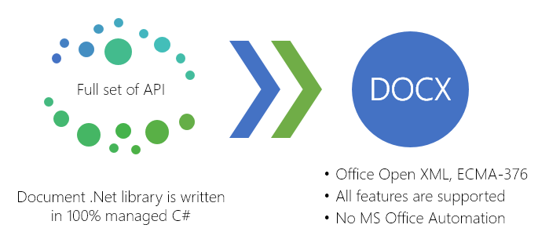
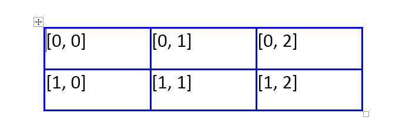
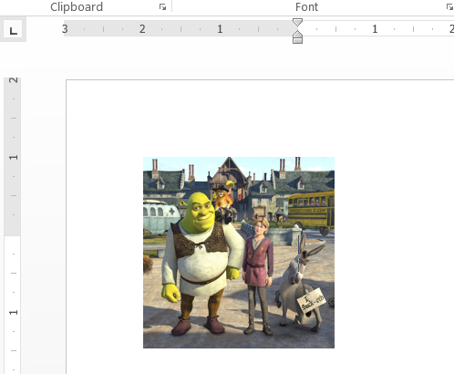

# How programmatically create DOCX in C# using Document .Net library?-Step by Step
## Requires
- Visual Studio 2012
## License
- MS-LPL
## Technologies
- C#
- ASP.NET
- Office
- .NET
- .NET Framework 4
- .NET Framework
- .NET Framework 4.0
- C# Language
- Office 2010
- Visual C#
- Office Development
## Topics
- Controls
- C#
- ASP.NET
- custom controls
- Word
- .NET 4
- How to
- Office 2010 101 code samples
## Updated
- 11/09/2016
## Description

<h1>Introduction</h1>

<em>If you are looking for a solution to programmatically create DOCX in C# or VB.Net, you are in the right place!</em>

<em> 
</em>

Document .Net is 100% managed C# assembly (SautinSoft.Document.dll) which gives you API to generate Office Open XML (DOCX) documents.&nbsp; 
 
Your .Net app will be able to create DOCX documents with any desired formatting, such as:

<ul class="CommonText">
<li>Insert formatted text, paragraphs, images, plain and nested tables. </li><li>Set page size and orientation (height, width, margin vals). </li><li>Set font type/name, style, and size. </li><li>Add page numbering and page breaks, headers and footers. </li><li>Add sections and pages, bookmarks, Table of contents. </li><li>Full Unicode support. </li></ul>

The library is absolutely standalone and does not require Microsoft Office or any others.

<h1>Main Functions</h1>

The library is absolutely standalone and does not require Microsoft Office or any others.

<h2 class="H2Text">Performance</h2>

At a machine with Intel Core i5-3337U and 4GB of RAM the Document .Net generates a simple DOCX document (one page filled by formatted text) without saving it to HDD:

<ul class="CommonText">
<li>1000 documents by 0.45 sec. </li><li>10000 documents by 3.61 sec. </li></ul>
<h2 class="H2Text">Implementation and code samples</h2>

To get the full set of API to operate with DOCX, you have to only add a reference to&nbsp;<em>&quot;Document.Net&quot;</em>.

<h3 class="CommonText">1. Let's see how easy to create DOCX document in C# application:</h3>

&nbsp;

C#

Edit|Remove

csharp

<pre class="csharp">//&nbsp;Let's&nbsp;create&nbsp;a&nbsp;simple&nbsp;DOCX&nbsp;document.&nbsp;
DocumentCore&nbsp;docx&nbsp;=&nbsp;new&nbsp;DocumentCore();&nbsp;
&nbsp;
docx.Content.End.Insert(&quot;Hello&nbsp;my&nbsp;Friend!&quot;,&nbsp;new&nbsp;CharacterFormat()&nbsp;{&nbsp;Size&nbsp;=&nbsp;14,&nbsp;FontName&nbsp;=&nbsp;&quot;Arial&quot;});</pre>

<h3 class="CommonText">2. Let's add a table (2x3) in DOCX using for-loop:</h3>

C#

Edit|Remove

csharp

<pre class="csharp">//&nbsp;Let's&nbsp;create&nbsp;a&nbsp;simple&nbsp;DOCX&nbsp;document.&nbsp;
DocumentCore&nbsp;docx&nbsp;=&nbsp;new&nbsp;DocumentCore();&nbsp;
&nbsp;
//&nbsp;Add&nbsp;a&nbsp;new&nbsp;section&nbsp;
Section&nbsp;s&nbsp;=&nbsp;new&nbsp;Section(docx);&nbsp;
docx.Sections.Add(s);&nbsp;
&nbsp;
&nbsp;
//&nbsp;Let's&nbsp;create&nbsp;a&nbsp;plain&nbsp;table:&nbsp;2x3.&nbsp;
Table&nbsp;t&nbsp;=&nbsp;new&nbsp;Table(docx);&nbsp;&nbsp;&nbsp;&nbsp;&nbsp;&nbsp;&nbsp;&nbsp;&nbsp;&nbsp;&nbsp;&nbsp;&nbsp;
&nbsp;
//&nbsp;Add&nbsp;2&nbsp;rows.for&nbsp;(int&nbsp;r&nbsp;=&nbsp;0;&nbsp;r&nbsp;&lt;&nbsp;2;&nbsp;r&#43;&#43;)&nbsp;
{&nbsp;
&nbsp;&nbsp;&nbsp;&nbsp;TableRow&nbsp;row&nbsp;=&nbsp;new&nbsp;TableRow(docx);&nbsp;
&nbsp;&nbsp;&nbsp;&nbsp;&nbsp;
&nbsp;&nbsp;&nbsp;&nbsp;//&nbsp;Add&nbsp;3&nbsp;columns.for&nbsp;(int&nbsp;c&nbsp;=&nbsp;0;&nbsp;c&nbsp;&lt;&nbsp;3;&nbsp;c&#43;&#43;)&nbsp;
&nbsp;&nbsp;&nbsp;&nbsp;{&nbsp;
&nbsp;&nbsp;&nbsp;&nbsp;&nbsp;&nbsp;&nbsp;&nbsp;TableCell&nbsp;cell&nbsp;=&nbsp;new&nbsp;TableCell(docx);&nbsp;
&nbsp;
&nbsp;&nbsp;&nbsp;&nbsp;&nbsp;&nbsp;&nbsp;&nbsp;//&nbsp;Set&nbsp;some&nbsp;cell&nbsp;formatting&nbsp;
&nbsp;&nbsp;&nbsp;&nbsp;&nbsp;&nbsp;&nbsp;&nbsp;cell.CellFormat.Borders.SetBorders(MultipleBorderTypes.Outside,&nbsp;BorderStyle.Single,&nbsp;Color.Blue,&nbsp;1.0);&nbsp;
&nbsp;&nbsp;&nbsp;&nbsp;&nbsp;&nbsp;&nbsp;&nbsp;cell.CellFormat.PreferredWidth&nbsp;=&nbsp;new&nbsp;TableWidth(60,&nbsp;TableWidthUnit.Point);&nbsp;
&nbsp;
&nbsp;
&nbsp;&nbsp;&nbsp;&nbsp;&nbsp;&nbsp;&nbsp;&nbsp;row.Cells.Add(cell);&nbsp;
&nbsp;
&nbsp;&nbsp;&nbsp;&nbsp;&nbsp;&nbsp;&nbsp;&nbsp;cell.Content.Start.Insert(String.Format(&quot;[{0},&nbsp;{1}]&quot;,&nbsp;r,&nbsp;c));&nbsp;
&nbsp;&nbsp;&nbsp;&nbsp;}&nbsp;
&nbsp;&nbsp;&nbsp;&nbsp;t.Rows.Add(row);&nbsp;
}&nbsp;
//&nbsp;Add&nbsp;this&nbsp;table&nbsp;to&nbsp;the&nbsp;current&nbsp;section.&nbsp;
s.Blocks.Add(t);</pre>

<h3 class="CommonText">3. If you want to add an image in DOCX in your .Net app:</h3>

C#

Edit|Remove

csharp

<pre class="js">//&nbsp;Let's&nbsp;create&nbsp;a&nbsp;simple&nbsp;DOCX&nbsp;document.&nbsp;
DocumentCore&nbsp;docx&nbsp;=&nbsp;new&nbsp;DocumentCore();&nbsp;
&nbsp;
//&nbsp;Add&nbsp;a&nbsp;new&nbsp;section&nbsp;
Section&nbsp;s&nbsp;=&nbsp;new&nbsp;Section(docx);&nbsp;
docx.Sections.Add(s);&nbsp;
&nbsp;
//&nbsp;Add&nbsp;the&nbsp;image&nbsp;as&nbsp;a&nbsp;shape&nbsp;with&nbsp;coordinates.&nbsp;
Picture&nbsp;pict1&nbsp;=&nbsp;new&nbsp;Picture(docx,&nbsp;&quot;image1.jpg&quot;);&nbsp;
&nbsp;
FloatingLayout&nbsp;fl&nbsp;=&nbsp;new&nbsp;FloatingLayout(&nbsp;
&nbsp;&nbsp;&nbsp;&nbsp;new&nbsp;HorizontalPosition(10,&nbsp;LengthUnit.Millimeter,&nbsp;HorizontalPositionAnchor.Page),&nbsp;
&nbsp;&nbsp;&nbsp;&nbsp;new&nbsp;VerticalPosition(10,&nbsp;LengthUnit.Millimeter,&nbsp;VerticalPositionAnchor.TopMargin),&nbsp;
&nbsp;&nbsp;&nbsp;&nbsp;new&nbsp;Size(70,&nbsp;70));&nbsp;
DrawingElement&nbsp;drawingElement&nbsp;=&nbsp;new&nbsp;DrawingElement(docx,&nbsp;fl,&nbsp;pict1);&nbsp;
s.Content.End.Insert(drawingElement.Content);</pre>

<h1>Source Code Files</h1>

<em>Related Links:</em>

<em> 
Website:&nbsp;<a href="http://www.sautinsoft.com/">www.sautinsoft.com</a> 
Product Home:&nbsp;<a href="http://sautinsoft.com/products/docx-document/index.php">Document.Net</a> 
Download:&nbsp;<em><a href="http://sautinsoft.com/products/docx-document/download.php">Document.Net</a></em></em>

&nbsp;

<h2 class="H2Text">Requrements and Technical Information</h2>

&nbsp;Requires only .Net 4.0 or above. Our product is compatible with all .Net languages and supports all Operating Systems where .Net Framework can be used. 
 
Note that &laquo;Document .Net&raquo; is entirely written in managed C#, which makes it absolutely standalone and an independent library. Of course, No dependency on Microsoft Word.

