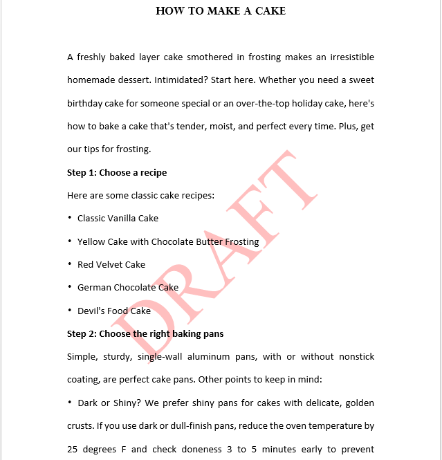

# How to Add Text Watermark and Image Watermark in Word with C#
## Requires
- Visual Studio 2010
## License
- MS-LPL
## Technologies
- Controls
- C#
- Silverlight
- ASP.NET
- WPF
- .NET Framework
- Visual C#
## Topics
- Controls
- Visual Studio
- Image
- watermark in C#
- add watermark in Word
## Updated
- 11/23/2016
## Description

<h1>Introduction</h1>

<em>This sample aims at demonstrating how to add text watermark and image watermark in Word document via free Spire.Doc for .NET with C#.</em>

Description

Text watermark and image watermark are both watermarks in Word document. In general, the watermark is used to indicate status of a document, like confidential, draft, approved, or display a company logo image. This sample will show how easy you can add text
 watermark and image watermark in Word with C#. To achieve this, this solution turns to a powerful .NET Word library &ndash;
<a href="http://www.e-iceblue.com/Introduce/free-doc-component.html">Free Spire.Doc for .NET</a>

Before you proceed, you need to download free Spire.Doc for .NET and install it in system. After adding free Spire.Doc dll as a reference to your .NET project assemblies, you&rsquo;re able to add watermark in Word by using just a few lines of code as below.

<strong>How to Add Image Watermark in Word with C#</strong><strong>：</strong>

<strong>Step 1</strong>: Initialize a new instance of Document class and load the Word document from file.

C#

Edit|Remove

csharp
<pre class="hidden">Document document = new Document();
document.LoadFromFile (@&quot;E:\Visual Studio\Sample\How to Make a Cake.docx&quot;);
</pre>

<pre class="csharp">Document&nbsp;document&nbsp;=&nbsp;new&nbsp;Document();&nbsp;
document.LoadFromFile&nbsp;(@&quot;E:\Visual&nbsp;Studio\Sample\How&nbsp;to&nbsp;Make&nbsp;a&nbsp;Cake.docx&quot;);&nbsp;
</pre>

<strong>Step 2</strong>: Load an image from system.

C#

Edit|Remove

csharp
<pre class="hidden">PictureWatermark picture = new PictureWatermark();
picture.Picture = System.Drawing.Image.FromFile (@&quot;C:\Users\Administrator\Pictures\cake.jpg&quot;);</pre>

<pre class="csharp">PictureWatermark&nbsp;picture&nbsp;=&nbsp;new&nbsp;PictureWatermark();&nbsp;
picture.Picture&nbsp;=&nbsp;System.Drawing.Image.FromFile&nbsp;(@&quot;C:\Users\Administrator\Pictures\cake.jpg&quot;);</pre>

<strong>Step 3</strong>: Set the image watermark scaling.

C#

Edit|Remove

csharp
<pre class="hidden">picture.Scaling = 180;</pre>

<pre class="csharp">picture.Scaling&nbsp;=&nbsp;180;</pre>

<strong>Step 4</strong>: Add the image watermark.

C#

Edit|Remove

csharp
<pre class="hidden">document.Watermark = picture;</pre>

<pre class="csharp">document.Watermark&nbsp;=&nbsp;picture;</pre>

<strong>Step 5</strong>: Save the file.

C#

Edit|Remove

csharp
<pre class="hidden">document.SaveToFile(&quot;result.docx&quot;);</pre>

<pre class="csharp">document.SaveToFile(&quot;result.docx&quot;);</pre>

<strong>Effective screenshot:</strong>

<strong> 
</strong>

<strong>How to Add Text Watermark in Word with C#</strong><strong>：</strong>

Adding text watermark is as easy as the solution above. Since Free Spire.Doc for .NET allows us to add and design watermark, we can set the property of text watermark as we want. Here is the core code to add text watermark in Word.

C#

Edit|Remove

csharp
<pre class="hidden">Document document = new Document();

document.LoadFromFile(@&quot;E:\Visual Studio\Sample\How to Make a Cake.docx&quot;);

TextWatermark txtWatermark = new TextWatermark();

txtWatermark.Text = &quot;DRAFT&quot;;

txtWatermark.FontSize = 100;

txtWatermark.Color = Color.Red;

txtWatermark.Layout = WatermarkLayout.Diagonal;

document.Watermark = txtWatermark;

document.SaveToFile(&quot;result.docx&quot;);</pre>

<pre class="csharp">Document&nbsp;document&nbsp;=&nbsp;new&nbsp;Document();&nbsp;
&nbsp;
document.LoadFromFile(@&quot;E:\Visual&nbsp;Studio\Sample\How&nbsp;to&nbsp;Make&nbsp;a&nbsp;Cake.docx&quot;);&nbsp;
&nbsp;
TextWatermark&nbsp;txtWatermark&nbsp;=&nbsp;new&nbsp;TextWatermark();&nbsp;
&nbsp;
txtWatermark.Text&nbsp;=&nbsp;&quot;DRAFT&quot;;&nbsp;
&nbsp;
txtWatermark.FontSize&nbsp;=&nbsp;100;&nbsp;
&nbsp;
txtWatermark.Color&nbsp;=&nbsp;Color.Red;&nbsp;
&nbsp;
txtWatermark.Layout&nbsp;=&nbsp;WatermarkLayout.Diagonal;&nbsp;
&nbsp;
document.Watermark&nbsp;=&nbsp;txtWatermark;&nbsp;
&nbsp;
document.SaveToFile(&quot;result.docx&quot;);</pre>

&nbsp;<strong>Effective screenshot<strong>:</strong></strong>

<strong><strong> 
</strong></strong>

<h1>More Information</h1>

The above sample only shows how free Sipre.Doc for .NET can be used to add watermark in Word file. In fact, free Spire.Doc for .NET contains much more incredible features that enable you to perform a wide range of document processing tasks, like creation,
 conversion and printing. Besides, free Spire.Doc for .NET is a totally independent .NET library to operate word documents, which doesn't need Microsoft Office to be installed on the system.

Please view the full detailed information at:

<strong>Website: </strong><a href="http://www.e-iceblue.com"><strong>www.e-iceblue.com</strong></a><strong>
</strong>

<strong>Product Home: </strong><a href="http://www.e-iceblue.com/Introduce/free-doc-component.html#.WBwKk8lv7nG"><strong>Free Spire.Doc for .NET</strong></a><strong>
</strong>

<strong>Download:</strong><a href="http://www.e-iceblue.com/Download/download-word-for-net-free.html"><strong> Free Spire.Doc for .NET</strong></a><strong>
</strong>

<strong>Forum:</strong><a href="http://www.e-iceblue.com/forum/spire-doc-f6.html"><strong> Free Word Library Forum</strong></a><strong>
</strong><strong>&nbsp;</strong>

