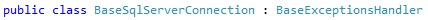
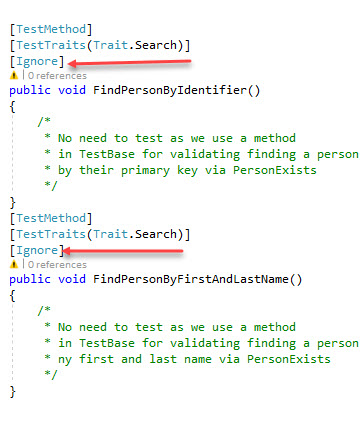
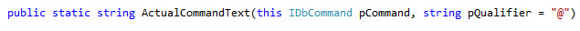
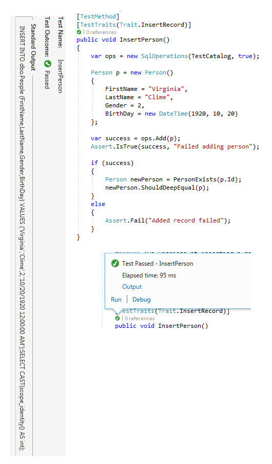
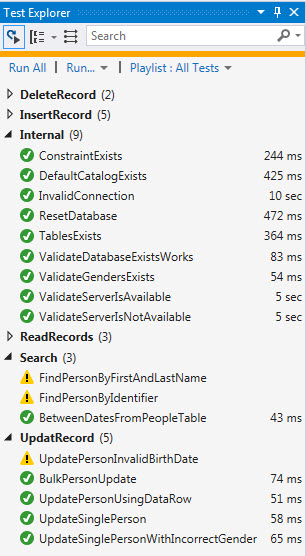
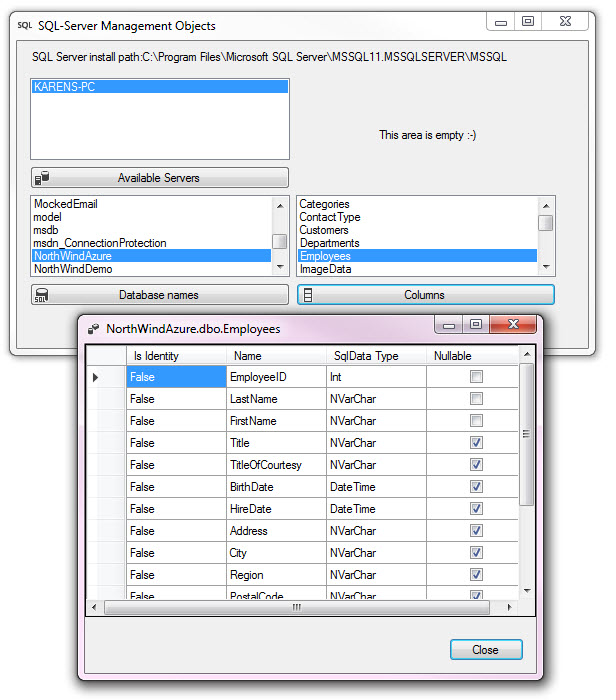
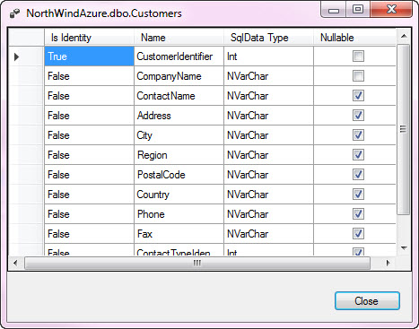

# How to: Create a shared library in C#
## Requires
- Visual Studio 2017
## License
- MS-LPL
## Technologies
- C#
- SQL Server
- Unit Test
- SQL Server SMO
## Topics
- Data Access
- Unit Testing
- Shared Projects
- Shared library
- Team Library
## Updated
- 02/17/2018
## Description

<h1>Introduction</h1>

This article will walkthrough creating a shared library for working with a SQL-Server database along with creating a unit test project to ensure all methods within the shared library function as expected. The reason for creating
 a shared library is that the library will provided a repeatable pattern for writing data centric solutions.

<h1>Building the Sample</h1>

Requires the following to be installed

SQL-Server, at least Express edition.

The following NuGet package DeepEquals for unit testing is used, if restore packages fails you can
<a href="https://github.com/jamesfoster/DeepEqual">get here</a>.

All data needs to be created via two data scripts under Solution Items.

Description

Main features of this library will contain a base class for exceptions and data connections where in each of your solutions will have at least one class to work with SQL-Server data which will inherit from the connection class
 and the connection class inherits from the base exception class.

Here SqlOperations resides outside of the shared library in your application solutions and inherits BaseSqlServerConnection.

Same for another class included for SQL-Server Management Objects&nbsp;

 

Peeking into BaseSqlServerConnection, it inherits BaseExceptionsHandler.

 

BaseExceptionsHandler used in the application solution data class to set several properties which in turn permit the calling class in the application solution to see if there was an exception thrown. The various properties are
 setup as protected which means they can be set in the application data class but not in the calling method such as an event in a windows form.

BaseExceptionHandler

&nbsp;

C#

Edit|Remove

csharp
<pre class="hidden">using System;
using System.Data.SqlClient;

namespace ExceptionsLibrary
{
    public class BaseExceptionsHandler
    {

        protected bool mHasException;
        /// &lt;summary&gt;
        /// Indicate the last operation thrown an 
        /// exception or not
        /// &lt;/summary&gt;
        /// &lt;returns&gt;&lt;/returns&gt;
        public bool HasException
        {
            get
            {
                return mHasException;
            }
        }
        protected Exception mLastException;
        /// &lt;summary&gt;
        /// Provides access to the last exception thrown
        /// &lt;/summary&gt;
        /// &lt;returns&gt;&lt;/returns&gt;
        public Exception LastException
        {
            get
            {
                return mLastException;
            }
        }

        /// &lt;summary&gt;
        /// Indicates if there was a sql related exception
        /// &lt;/summary&gt;
        public bool HasSqlException
        {
            get
            {
                if (mLastException != null)
                {
                    Console.WriteLine(mLastException is SqlException);
                    return mLastException is SqlException;
                }
                else
                {
                    return false;
                }
            }
        }
        /// &lt;summary&gt;
        /// If you don't need the entire exception as in 
        /// LastException this provides just the text of the exception
        /// &lt;/summary&gt;
        /// &lt;returns&gt;&lt;/returns&gt;
        public string LastExceptionMessage
        {
            get
            {
                return mLastException.Message;
            }
        }
        /// &lt;summary&gt;
        /// Indicate for return of a function if there was an 
        /// exception thrown or not.
        /// &lt;/summary&gt;
        /// &lt;returns&gt;&lt;/returns&gt;
        public bool IsSuccessFul
        {
            get
            {
                return !mHasException;
            }
        }
    }
}
</pre>

<pre class="csharp">using&nbsp;System;&nbsp;
using&nbsp;System.Data.SqlClient;&nbsp;
&nbsp;
namespace&nbsp;ExceptionsLibrary&nbsp;
{&nbsp;
&nbsp;&nbsp;&nbsp;&nbsp;public&nbsp;class&nbsp;BaseExceptionsHandler&nbsp;
&nbsp;&nbsp;&nbsp;&nbsp;{&nbsp;
&nbsp;
&nbsp;&nbsp;&nbsp;&nbsp;&nbsp;&nbsp;&nbsp;&nbsp;protected&nbsp;bool&nbsp;mHasException;&nbsp;
&nbsp;&nbsp;&nbsp;&nbsp;&nbsp;&nbsp;&nbsp;&nbsp;///&nbsp;&lt;summary&gt;&nbsp;
&nbsp;&nbsp;&nbsp;&nbsp;&nbsp;&nbsp;&nbsp;&nbsp;///&nbsp;Indicate&nbsp;the&nbsp;last&nbsp;operation&nbsp;thrown&nbsp;an&nbsp;&nbsp;
&nbsp;&nbsp;&nbsp;&nbsp;&nbsp;&nbsp;&nbsp;&nbsp;///&nbsp;exception&nbsp;or&nbsp;not&nbsp;
&nbsp;&nbsp;&nbsp;&nbsp;&nbsp;&nbsp;&nbsp;&nbsp;///&nbsp;&lt;/summary&gt;&nbsp;
&nbsp;&nbsp;&nbsp;&nbsp;&nbsp;&nbsp;&nbsp;&nbsp;///&nbsp;&lt;returns&gt;&lt;/returns&gt;&nbsp;
&nbsp;&nbsp;&nbsp;&nbsp;&nbsp;&nbsp;&nbsp;&nbsp;public&nbsp;bool&nbsp;HasException&nbsp;
&nbsp;&nbsp;&nbsp;&nbsp;&nbsp;&nbsp;&nbsp;&nbsp;{&nbsp;
&nbsp;&nbsp;&nbsp;&nbsp;&nbsp;&nbsp;&nbsp;&nbsp;&nbsp;&nbsp;&nbsp;&nbsp;get&nbsp;
&nbsp;&nbsp;&nbsp;&nbsp;&nbsp;&nbsp;&nbsp;&nbsp;&nbsp;&nbsp;&nbsp;&nbsp;{&nbsp;
&nbsp;&nbsp;&nbsp;&nbsp;&nbsp;&nbsp;&nbsp;&nbsp;&nbsp;&nbsp;&nbsp;&nbsp;&nbsp;&nbsp;&nbsp;&nbsp;return&nbsp;mHasException;&nbsp;
&nbsp;&nbsp;&nbsp;&nbsp;&nbsp;&nbsp;&nbsp;&nbsp;&nbsp;&nbsp;&nbsp;&nbsp;}&nbsp;
&nbsp;&nbsp;&nbsp;&nbsp;&nbsp;&nbsp;&nbsp;&nbsp;}&nbsp;
&nbsp;&nbsp;&nbsp;&nbsp;&nbsp;&nbsp;&nbsp;&nbsp;protected&nbsp;Exception&nbsp;mLastException;&nbsp;
&nbsp;&nbsp;&nbsp;&nbsp;&nbsp;&nbsp;&nbsp;&nbsp;///&nbsp;&lt;summary&gt;&nbsp;
&nbsp;&nbsp;&nbsp;&nbsp;&nbsp;&nbsp;&nbsp;&nbsp;///&nbsp;Provides&nbsp;access&nbsp;to&nbsp;the&nbsp;last&nbsp;exception&nbsp;thrown&nbsp;
&nbsp;&nbsp;&nbsp;&nbsp;&nbsp;&nbsp;&nbsp;&nbsp;///&nbsp;&lt;/summary&gt;&nbsp;
&nbsp;&nbsp;&nbsp;&nbsp;&nbsp;&nbsp;&nbsp;&nbsp;///&nbsp;&lt;returns&gt;&lt;/returns&gt;&nbsp;
&nbsp;&nbsp;&nbsp;&nbsp;&nbsp;&nbsp;&nbsp;&nbsp;public&nbsp;Exception&nbsp;LastException&nbsp;
&nbsp;&nbsp;&nbsp;&nbsp;&nbsp;&nbsp;&nbsp;&nbsp;{&nbsp;
&nbsp;&nbsp;&nbsp;&nbsp;&nbsp;&nbsp;&nbsp;&nbsp;&nbsp;&nbsp;&nbsp;&nbsp;get&nbsp;
&nbsp;&nbsp;&nbsp;&nbsp;&nbsp;&nbsp;&nbsp;&nbsp;&nbsp;&nbsp;&nbsp;&nbsp;{&nbsp;
&nbsp;&nbsp;&nbsp;&nbsp;&nbsp;&nbsp;&nbsp;&nbsp;&nbsp;&nbsp;&nbsp;&nbsp;&nbsp;&nbsp;&nbsp;&nbsp;return&nbsp;mLastException;&nbsp;
&nbsp;&nbsp;&nbsp;&nbsp;&nbsp;&nbsp;&nbsp;&nbsp;&nbsp;&nbsp;&nbsp;&nbsp;}&nbsp;
&nbsp;&nbsp;&nbsp;&nbsp;&nbsp;&nbsp;&nbsp;&nbsp;}&nbsp;
&nbsp;
&nbsp;&nbsp;&nbsp;&nbsp;&nbsp;&nbsp;&nbsp;&nbsp;///&nbsp;&lt;summary&gt;&nbsp;
&nbsp;&nbsp;&nbsp;&nbsp;&nbsp;&nbsp;&nbsp;&nbsp;///&nbsp;Indicates&nbsp;if&nbsp;there&nbsp;was&nbsp;a&nbsp;sql&nbsp;related&nbsp;exception&nbsp;
&nbsp;&nbsp;&nbsp;&nbsp;&nbsp;&nbsp;&nbsp;&nbsp;///&nbsp;&lt;/summary&gt;&nbsp;
&nbsp;&nbsp;&nbsp;&nbsp;&nbsp;&nbsp;&nbsp;&nbsp;public&nbsp;bool&nbsp;HasSqlException&nbsp;
&nbsp;&nbsp;&nbsp;&nbsp;&nbsp;&nbsp;&nbsp;&nbsp;{&nbsp;
&nbsp;&nbsp;&nbsp;&nbsp;&nbsp;&nbsp;&nbsp;&nbsp;&nbsp;&nbsp;&nbsp;&nbsp;get&nbsp;
&nbsp;&nbsp;&nbsp;&nbsp;&nbsp;&nbsp;&nbsp;&nbsp;&nbsp;&nbsp;&nbsp;&nbsp;{&nbsp;
&nbsp;&nbsp;&nbsp;&nbsp;&nbsp;&nbsp;&nbsp;&nbsp;&nbsp;&nbsp;&nbsp;&nbsp;&nbsp;&nbsp;&nbsp;&nbsp;if&nbsp;(mLastException&nbsp;!=&nbsp;null)&nbsp;
&nbsp;&nbsp;&nbsp;&nbsp;&nbsp;&nbsp;&nbsp;&nbsp;&nbsp;&nbsp;&nbsp;&nbsp;&nbsp;&nbsp;&nbsp;&nbsp;{&nbsp;
&nbsp;&nbsp;&nbsp;&nbsp;&nbsp;&nbsp;&nbsp;&nbsp;&nbsp;&nbsp;&nbsp;&nbsp;&nbsp;&nbsp;&nbsp;&nbsp;&nbsp;&nbsp;&nbsp;&nbsp;Console.WriteLine(mLastException&nbsp;is&nbsp;SqlException);&nbsp;
&nbsp;&nbsp;&nbsp;&nbsp;&nbsp;&nbsp;&nbsp;&nbsp;&nbsp;&nbsp;&nbsp;&nbsp;&nbsp;&nbsp;&nbsp;&nbsp;&nbsp;&nbsp;&nbsp;&nbsp;return&nbsp;mLastException&nbsp;is&nbsp;SqlException;&nbsp;
&nbsp;&nbsp;&nbsp;&nbsp;&nbsp;&nbsp;&nbsp;&nbsp;&nbsp;&nbsp;&nbsp;&nbsp;&nbsp;&nbsp;&nbsp;&nbsp;}&nbsp;
&nbsp;&nbsp;&nbsp;&nbsp;&nbsp;&nbsp;&nbsp;&nbsp;&nbsp;&nbsp;&nbsp;&nbsp;&nbsp;&nbsp;&nbsp;&nbsp;else&nbsp;
&nbsp;&nbsp;&nbsp;&nbsp;&nbsp;&nbsp;&nbsp;&nbsp;&nbsp;&nbsp;&nbsp;&nbsp;&nbsp;&nbsp;&nbsp;&nbsp;{&nbsp;
&nbsp;&nbsp;&nbsp;&nbsp;&nbsp;&nbsp;&nbsp;&nbsp;&nbsp;&nbsp;&nbsp;&nbsp;&nbsp;&nbsp;&nbsp;&nbsp;&nbsp;&nbsp;&nbsp;&nbsp;return&nbsp;false;&nbsp;
&nbsp;&nbsp;&nbsp;&nbsp;&nbsp;&nbsp;&nbsp;&nbsp;&nbsp;&nbsp;&nbsp;&nbsp;&nbsp;&nbsp;&nbsp;&nbsp;}&nbsp;
&nbsp;&nbsp;&nbsp;&nbsp;&nbsp;&nbsp;&nbsp;&nbsp;&nbsp;&nbsp;&nbsp;&nbsp;}&nbsp;
&nbsp;&nbsp;&nbsp;&nbsp;&nbsp;&nbsp;&nbsp;&nbsp;}&nbsp;
&nbsp;&nbsp;&nbsp;&nbsp;&nbsp;&nbsp;&nbsp;&nbsp;///&nbsp;&lt;summary&gt;&nbsp;
&nbsp;&nbsp;&nbsp;&nbsp;&nbsp;&nbsp;&nbsp;&nbsp;///&nbsp;If&nbsp;you&nbsp;don't&nbsp;need&nbsp;the&nbsp;entire&nbsp;exception&nbsp;as&nbsp;in&nbsp;&nbsp;
&nbsp;&nbsp;&nbsp;&nbsp;&nbsp;&nbsp;&nbsp;&nbsp;///&nbsp;LastException&nbsp;this&nbsp;provides&nbsp;just&nbsp;the&nbsp;text&nbsp;of&nbsp;the&nbsp;exception&nbsp;
&nbsp;&nbsp;&nbsp;&nbsp;&nbsp;&nbsp;&nbsp;&nbsp;///&nbsp;&lt;/summary&gt;&nbsp;
&nbsp;&nbsp;&nbsp;&nbsp;&nbsp;&nbsp;&nbsp;&nbsp;///&nbsp;&lt;returns&gt;&lt;/returns&gt;&nbsp;
&nbsp;&nbsp;&nbsp;&nbsp;&nbsp;&nbsp;&nbsp;&nbsp;public&nbsp;string&nbsp;LastExceptionMessage&nbsp;
&nbsp;&nbsp;&nbsp;&nbsp;&nbsp;&nbsp;&nbsp;&nbsp;{&nbsp;
&nbsp;&nbsp;&nbsp;&nbsp;&nbsp;&nbsp;&nbsp;&nbsp;&nbsp;&nbsp;&nbsp;&nbsp;get&nbsp;
&nbsp;&nbsp;&nbsp;&nbsp;&nbsp;&nbsp;&nbsp;&nbsp;&nbsp;&nbsp;&nbsp;&nbsp;{&nbsp;
&nbsp;&nbsp;&nbsp;&nbsp;&nbsp;&nbsp;&nbsp;&nbsp;&nbsp;&nbsp;&nbsp;&nbsp;&nbsp;&nbsp;&nbsp;&nbsp;return&nbsp;mLastException.Message;&nbsp;
&nbsp;&nbsp;&nbsp;&nbsp;&nbsp;&nbsp;&nbsp;&nbsp;&nbsp;&nbsp;&nbsp;&nbsp;}&nbsp;
&nbsp;&nbsp;&nbsp;&nbsp;&nbsp;&nbsp;&nbsp;&nbsp;}&nbsp;
&nbsp;&nbsp;&nbsp;&nbsp;&nbsp;&nbsp;&nbsp;&nbsp;///&nbsp;&lt;summary&gt;&nbsp;
&nbsp;&nbsp;&nbsp;&nbsp;&nbsp;&nbsp;&nbsp;&nbsp;///&nbsp;Indicate&nbsp;for&nbsp;return&nbsp;of&nbsp;a&nbsp;function&nbsp;if&nbsp;there&nbsp;was&nbsp;an&nbsp;&nbsp;
&nbsp;&nbsp;&nbsp;&nbsp;&nbsp;&nbsp;&nbsp;&nbsp;///&nbsp;exception&nbsp;thrown&nbsp;or&nbsp;not.&nbsp;
&nbsp;&nbsp;&nbsp;&nbsp;&nbsp;&nbsp;&nbsp;&nbsp;///&nbsp;&lt;/summary&gt;&nbsp;
&nbsp;&nbsp;&nbsp;&nbsp;&nbsp;&nbsp;&nbsp;&nbsp;///&nbsp;&lt;returns&gt;&lt;/returns&gt;&nbsp;
&nbsp;&nbsp;&nbsp;&nbsp;&nbsp;&nbsp;&nbsp;&nbsp;public&nbsp;bool&nbsp;IsSuccessFul&nbsp;
&nbsp;&nbsp;&nbsp;&nbsp;&nbsp;&nbsp;&nbsp;&nbsp;{&nbsp;
&nbsp;&nbsp;&nbsp;&nbsp;&nbsp;&nbsp;&nbsp;&nbsp;&nbsp;&nbsp;&nbsp;&nbsp;get&nbsp;
&nbsp;&nbsp;&nbsp;&nbsp;&nbsp;&nbsp;&nbsp;&nbsp;&nbsp;&nbsp;&nbsp;&nbsp;{&nbsp;
&nbsp;&nbsp;&nbsp;&nbsp;&nbsp;&nbsp;&nbsp;&nbsp;&nbsp;&nbsp;&nbsp;&nbsp;&nbsp;&nbsp;&nbsp;&nbsp;return&nbsp;!mHasException;&nbsp;
&nbsp;&nbsp;&nbsp;&nbsp;&nbsp;&nbsp;&nbsp;&nbsp;&nbsp;&nbsp;&nbsp;&nbsp;}&nbsp;
&nbsp;&nbsp;&nbsp;&nbsp;&nbsp;&nbsp;&nbsp;&nbsp;}&nbsp;
&nbsp;&nbsp;&nbsp;&nbsp;}&nbsp;
}&nbsp;</pre>

&nbsp;

BaseSqlServerConnection sole purpose is for setting up a connection string for a SQL-Server. When a class implements BaseSqlServerConnection that class can override the default server and default catalog set in BaseSqlServerConnection.

The connection class BaseSqlServerConnection is contained in a class project and BaseExceptionsHandler class within another class project. To use these classes add them the compiled DLL files to your application project with
 a Visual Studio solution.

The most important aspect for using the BaseExceptionsHandler class is that no try/catch is required by any code calling data routines for any data operations which includes reading data, finding data, adding new data, updating
 existing data or removal of existing data.

<h1>Testing</h1>

Once all data operations have been created the next step is to test each method. This is an essential part of creating a shared library. Writing unit test methods requires a good deal of time which includes both good test method
 e.g. a test to add a new record and then validate that the record was physically added to the database table with another test methods that fails to add a new record to the database table. This means you need to make sure that your add new record method does
 not allow invalid data. In the code provided in the sample code for this article validation is done in each method yet we can also separate validation by abstracting the validation into a business validation class which is called from the user interface then
 the business validation will call the data layer if the validation is good to go.

Note in regards to writing unit test methods that there may be cases where a test method is not required for one reason or another such as after adding a new record there is an internal method to validate the record was added
 in the test project. Rather than not write a unit test, write a unit test method for the operation, mark it as ignored (there are several in the code sample) and write a comment why the method has been ignored so that if another developer comes along looking
 at the test understands why the method is being skipped/ignored.

 

There are may be a reason not to capture exceptions but instead let them be thrown without a try/catch statement. At first glance they may seem difficult to write test for. Here we can take advantage of ExpectedException attribute
 to declarator on a test method which accepts the type of exception known to be thrown.

&nbsp;

C#

Edit|Remove

csharp
<pre class="hidden">[TestMethod]
[TestTraits(Trait.Internal)]
[ExpectedException(typeof(SqlException))]
public void InvalidConnection()
{
    var ops = new SqlOperations(&quot;BadServerName&quot;);
    var dt = ops.ReadPeople();
    /*
        * Normally one would use an Assert.IsTrue as commented out
        * below but in this case we can use ExpectedException Attribute,
        * see link above in seealso in method header comments.
        */
    //Assert.IsTrue(ops.HasSqlException);
}</pre>

<pre class="csharp">[TestMethod]&nbsp;
[TestTraits(Trait.Internal)]&nbsp;
[ExpectedException(typeof(SqlException))]&nbsp;
public&nbsp;void&nbsp;InvalidConnection()&nbsp;
{&nbsp;
&nbsp;&nbsp;&nbsp;&nbsp;var&nbsp;ops&nbsp;=&nbsp;new&nbsp;SqlOperations(&quot;BadServerName&quot;);&nbsp;
&nbsp;&nbsp;&nbsp;&nbsp;var&nbsp;dt&nbsp;=&nbsp;ops.ReadPeople();&nbsp;
&nbsp;&nbsp;&nbsp;&nbsp;/*&nbsp;
&nbsp;&nbsp;&nbsp;&nbsp;&nbsp;&nbsp;&nbsp;&nbsp;*&nbsp;Normally&nbsp;one&nbsp;would&nbsp;use&nbsp;an&nbsp;Assert.IsTrue&nbsp;as&nbsp;commented&nbsp;out&nbsp;
&nbsp;&nbsp;&nbsp;&nbsp;&nbsp;&nbsp;&nbsp;&nbsp;*&nbsp;below&nbsp;but&nbsp;in&nbsp;this&nbsp;case&nbsp;we&nbsp;can&nbsp;use&nbsp;ExpectedException&nbsp;Attribute,&nbsp;
&nbsp;&nbsp;&nbsp;&nbsp;&nbsp;&nbsp;&nbsp;&nbsp;*&nbsp;see&nbsp;link&nbsp;above&nbsp;in&nbsp;seealso&nbsp;in&nbsp;method&nbsp;header&nbsp;comments.&nbsp;
&nbsp;&nbsp;&nbsp;&nbsp;&nbsp;&nbsp;&nbsp;&nbsp;*/&nbsp;
&nbsp;&nbsp;&nbsp;&nbsp;//Assert.IsTrue(ops.HasSqlException);&nbsp;
}</pre>

<h1>Validating SQL Statements</h1>

A very difficult aspect for some developers to unit test are validating SQL statements are valid. The easy yet time consuming method is to write SQL statements in SQL-Server Management Studio, declare parameters, set parameter
 values and run the query. If the query and parameters work then copy them to your data class. Even so there still could be issues when running unit test against these statements. For this in the attach code sample the data class constructor accepts a optional
 argument which be default is set to false, when set to true the SQL statement is written out and viewable in code lens of the test method even if there is more than one SQL statement written out. &nbsp;This is done by a class project in the shared library
 solution which works against any managed data provider and is written up in a language extension method.

&nbsp;

Example for adding a record

 

There are two trains of thought for writing unit test, the first which is very popular is to use a mocking framework which sets up virtual data while the second less common method is to work from the database. When working from
 the database against a development database a test base can setup the development database for any test intended to run then after all the test execute will restore the database to the state it was in prior to running your unit test. Then there is the one
 used in this article which requires two databases, one which holds data for two tables that we never touch other than copying the data to a secondary mirror database.

Before each test executes the test database data is truncated then data is copied from the mirror database into the test database. The truncation and copying of data is triggered in a special method setup in the test class marked
 with [TestInitialize] which invokes a method in a test base class that the unit class inherits. In this case this method also shows how you can detect which test method is about to execute and writes to a trace file. The writing to a trace/text file does nothing
 useful yet this is good to know as you may want to know what test is about to run and do special actions prior to the test method running, same goes for after a test runs where this method is marked with [TestCleanup].

Each test in the attached code sample uses a special class that permits each test method to be categorized in Test Explorer. When writing a lot of unit test methods it&rsquo;s nice to see test of a specific type all grouped
 together which this custom class provides. Since this class (TestTraitsAttribute) most likely is specific to an application it&rsquo;s best to have the class in the application unit test project rather than in a shared library.

 

When writing asserts in your unit test methods make sure (as done in the attached code samples) you add a description for failure so in the event there are multiple asserts we know exactly which assertion failed.

A unit test method should be kept to the point, does not perform many assertions. Doing many assertions can cloud the initial reason why the test was written. A valid reason for multiple assertions is an assertion to see if
 a new record was added, in this case the add methods return a bool yet to be sure the record was added there should be a test to read the new record. What should not be in this test method is something that has nothing to do with the add new record.

<h1>Microsoft SQL-Server Management Objects</h1>

There are some test that can&rsquo;t truly be done one hundred percent even if you have customers volunteer to test your product. &nbsp;One of these is knowing if SQL-Server is installed and the proper instance is installed
 or the proper version/edition is presently installed. To assist with this we need a class project which allows you to interrogate if SQL-Server is installed, does the proper database/catalog exists and even to determine if tables, column (and the column types
 are what we expected to be there) exists along if there relationships are correct. This requires a reference to Microsoft&rsquo;s SMO (Sql-Server management Objects). The class project provided in the code sample has methods to determine if the proper server,
 database, tables, columns and foreign keys are present. Like any project in the shared library there are unit test methods for ensuring these methods return or not return expected values.

Some of the functionality within SMO classes can be done in T-SQL also but using SMO is a better approach in that they are solid and untouchable by a developer while T-SQL can change plus not all methods are as easy to create
 as found in the SMO classes.

For this article here are the classes in the shared library.

<strong>DataConnections</strong> which is responsible for setting up data connections to a database along within inheriting the base exception handling.

<strong>DataHelperLibrary</strong> which has a single static class for reading a command object&rsquo;s command text including values for each parameter in the command text. For a separate code sample see my
<a href="https://code.msdn.microsoft.com/Reveal-parameter-values-28725e53?redir=0">
MSDN code sample</a> which is done for both C# and VB.NET.

<strong>DeskTopLibrary</strong>, a static class which wraps MessageBox dialog into a easy to use format including changing the dialog&rsquo;s icon and the default button from Yes to No.

<strong>ExceptionLibrary</strong>, contains the base exception class.

<strong>SharedLibraryUnitTest</strong>, contains all unit test methods to ensure the data operations will work as expected.

<strong>SMO_Library</strong>, SQL-Server Management Object library for peeking into servers, databases, tables, columns and constraints and keys.

<strong>SMO_UserInterfaceDemo</strong>, this is an odd-ball in it does not truly belong in the shared library but does all you to see what is available from the SMO_Library.

Note in the example below, EmployeeID is not &quot;Is Identity&quot; but is a primary key.

 

Here CustomerIdentifier is &quot;Is Identity&quot; and a primary key. Why is that? Well Employee table is an original table in NorthWind database while the Customer table did not have CustomerIdentifier and when added it was made to be
 &quot;Is Identity&quot;

 

<strong>SqlOperationsProject</strong>, this project would reside in your application solution which would be called from a user interface be it a Windows Form or a class that requires data access to the backend database.

For more on SMO see <a href="https://code.msdn.microsoft.com/Working-with-SQL-Server-b204d549?redir=0">
my MSDN code sample</a> (part 3 of 3 in a series).

Want to know alternate test methods for Entity Framework, see my MSDN code sample&nbsp;<a href="https://code.msdn.microsoft.com/C-Entity-Framework-6-unit-f5a12725?redir=0">Entity Framework 6 unit testing with mocked data and
 auto cleanup of data</a>.

&nbsp;

In closing, most items for creating and testing a shared library have been covered in regards to the basics. In a future code sample this will be expanded on which will introduce generics and interfaces.

