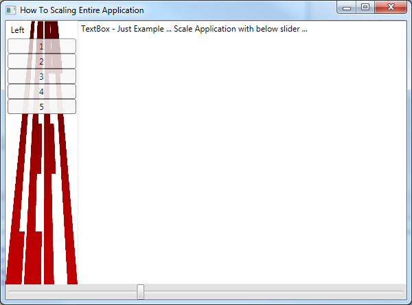
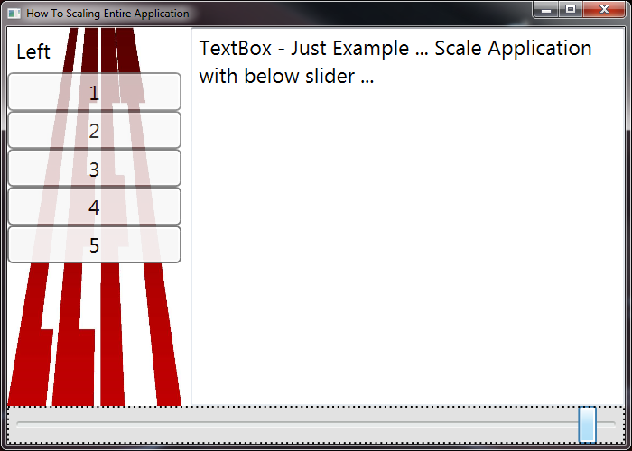
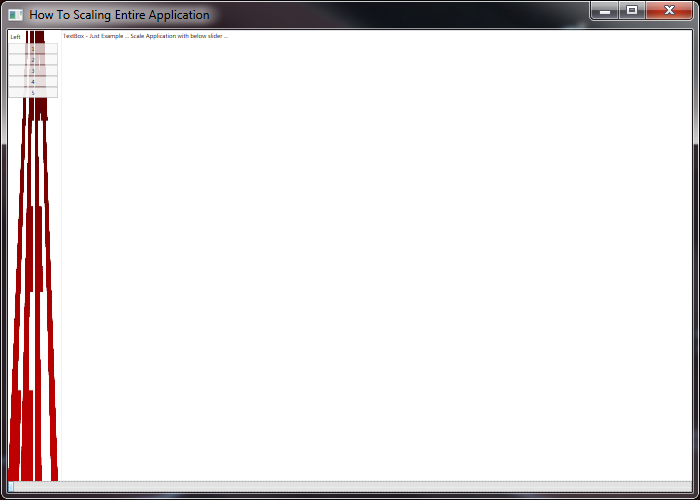
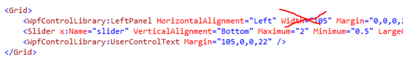

# How to Scale  WPF application
## Requires
- Visual Studio 2013
## License
- MIT
## Technologies
- WPF
- Scale
## Topics
- WPF
- Rapid Application Development
## Updated
- 01/14/2017
## Description

<h1>Introduction</h1>

If you/user has high-definition display resolutions (HD, 2K, 4K,&hellip;) you need to scale your application.&nbsp;

Usually, you change the display setting (125%, 150%, 200%...).

I think the best way to add needed behavior in your application &hellip;

WPF Windows application itself does not have Scaling Properties.

You can scale Grid, Canvas, etc&hellip; but not Application itself... Let windows doing scaling your application with minimum coding &nbsp;&hellip;

The easiest way to size correctly WPF application is wrapping all your users control inside MAIN user control and using MAIN user control in Window Application.

100%

200%

50%

<h1>Building the Sample</h1>

Make sure that your MAIN UserControl does not assign Width and Height &hellip;

Use only MinWidth and MinHeight &nbsp;

Do not use <strong>RenderingTransfer,</strong> it will scale User Control inside window &ndash; we need to have different behavior &hellip;

&nbsp;

&nbsp;&nbsp;&nbsp; &lt;UserControl.RenderTransform&gt;

&nbsp;&nbsp;&nbsp;&nbsp;&nbsp;&nbsp;&nbsp;
&lt;TransformGroup&gt;

&nbsp;&nbsp;&nbsp;&nbsp;&nbsp;&nbsp;&nbsp;&nbsp;&nbsp;&nbsp;&nbsp;
&lt;ScaleTransform x:Name=&quot;trScale&quot;
 ScaleX=&quot;1.0&quot; ScaleY=&quot;1.0&quot;/&gt;

&nbsp;&nbsp;&nbsp;&nbsp;&nbsp;&nbsp;&nbsp;&nbsp;&nbsp;&nbsp;&nbsp;
&lt;SkewTransform/&gt;

&nbsp;&nbsp;&nbsp;&nbsp;&nbsp;&nbsp;&nbsp;&nbsp;&nbsp;&nbsp;&nbsp;
&lt;RotateTransform/&gt;

&nbsp;&nbsp;&nbsp;&nbsp;&nbsp;&nbsp;&nbsp;&nbsp;&nbsp;&nbsp;&nbsp;
&lt;TranslateTransform/&gt;

&nbsp;&nbsp;&nbsp;&nbsp;&nbsp;&nbsp;&nbsp;
&lt;/TransformGroup&gt;

&nbsp;&nbsp;&nbsp; &lt;/UserControl.RenderTransform&gt;

&nbsp;

<strong>Use Layout Transfer&nbsp;</strong>

&nbsp;&nbsp; &lt;UserControl.LayoutTransform&gt;

&nbsp;&nbsp;&nbsp;&nbsp;&nbsp;&nbsp;&nbsp; &lt;ScaleTransform x:Name=&quot;ucScale&quot;

&nbsp;&nbsp;&nbsp;&nbsp;&nbsp;&nbsp;&nbsp;&nbsp;&nbsp;&nbsp;&nbsp;&nbsp;&nbsp;&nbsp;&nbsp;&nbsp;&nbsp;&nbsp;&nbsp;&nbsp;&nbsp;&nbsp; &nbsp;ScaleX=&quot;1.0&quot;

&nbsp;&nbsp;&nbsp;&nbsp;&nbsp;&nbsp;&nbsp;&nbsp;&nbsp;&nbsp;&nbsp;&nbsp;&nbsp;&nbsp;&nbsp;&nbsp;&nbsp;&nbsp;&nbsp;&nbsp;&nbsp;&nbsp; &nbsp;ScaleY=&quot;1.0&quot; /&gt;

&nbsp;&nbsp;&nbsp; &lt;/UserControl.LayoutTransform&gt;

C#XAML

Edit|Remove

csharpxaml
<pre class="hidden">using System.Windows.Navigation;
using System.Windows.Shapes;

namespace wpfScalingEntireApplication
{
    /// &lt;summary&gt;
    /// Interaction logic for CommonUserControl.xaml
    /// &lt;/summary&gt;
    public partial class CommonUserControl : UserControl
    {
        public CommonUserControl()
        {
            InitializeComponent();
        }

        private void Slider_ValueChanged(object sender, RoutedPropertyChangedEventArgs&lt;double&gt; e)
        {
            if (ucScale != null &amp;&amp; slider != null)   // exclude of exception during LOAD ...
            {
                ucScale.ScaleX = slider.Value;
                ucScale.ScaleY = slider.Value;
            }

        }
    }
}
</pre>
<pre class="hidden">&lt;UserControl
             xmlns=&quot;http://schemas.microsoft.com/winfx/2006/xaml/presentation&quot;
             xmlns:x=&quot;http://schemas.microsoft.com/winfx/2006/xaml&quot;
             xmlns:mc=&quot;http://schemas.openxmlformats.org/markup-compatibility/2006&quot; 
             xmlns:d=&quot;http://schemas.microsoft.com/expression/blend/2008&quot; 
             xmlns:WpfControlLibrary=&quot;clr-namespace:WpfControlLibrary;assembly=WpfControlLibrary&quot; x:Class=&quot;wpfScalingEntireApplication.CommonUserControl&quot; 
             mc:Ignorable=&quot;d&quot; 
             MinHeight=&quot;222&quot; MinWidth=&quot;300&quot; RenderTransformOrigin=&quot;0.5,0.5&quot;&gt;

    
    &lt;Grid&gt;
        &lt;WpfControlLibrary:LeftPanel HorizontalAlignment=&quot;Left&quot;  Margin=&quot;0,0,0,22&quot;/&gt;
        &lt;Slider x:Name=&quot;slider&quot; VerticalAlignment=&quot;Bottom&quot; Maximum=&quot;2&quot; Minimum=&quot;0.5&quot; LargeChange=&quot;0.1&quot; Value=&quot;1&quot; Height=&quot;22&quot; Background=&quot;#FFE2E2E2&quot; ValueChanged=&quot;Slider_ValueChanged&quot;/&gt;
        &lt;WpfControlLibrary:UserControlText Margin=&quot;105,0,0,22&quot; /&gt;
    &lt;/Grid&gt;
    
   &lt;UserControl.LayoutTransform&gt;
        &lt;ScaleTransform x:Name=&quot;ucScale&quot;
                        ScaleX=&quot;1.0&quot;
                        ScaleY=&quot;1.0&quot; /&gt;
    &lt;/UserControl.LayoutTransform&gt;
    
&lt;/UserControl&gt;
.</pre>

<pre class="csharp">using&nbsp;System.Windows.Navigation;&nbsp;
using&nbsp;System.Windows.Shapes;&nbsp;
&nbsp;
namespace&nbsp;wpfScalingEntireApplication&nbsp;
{&nbsp;
&nbsp;&nbsp;&nbsp;&nbsp;///&nbsp;&lt;summary&gt;&nbsp;
&nbsp;&nbsp;&nbsp;&nbsp;///&nbsp;Interaction&nbsp;logic&nbsp;for&nbsp;CommonUserControl.xaml&nbsp;
&nbsp;&nbsp;&nbsp;&nbsp;///&nbsp;&lt;/summary&gt;&nbsp;
&nbsp;&nbsp;&nbsp;&nbsp;public&nbsp;partial&nbsp;class&nbsp;CommonUserControl&nbsp;:&nbsp;UserControl&nbsp;
&nbsp;&nbsp;&nbsp;&nbsp;{&nbsp;
&nbsp;&nbsp;&nbsp;&nbsp;&nbsp;&nbsp;&nbsp;&nbsp;public&nbsp;CommonUserControl()&nbsp;
&nbsp;&nbsp;&nbsp;&nbsp;&nbsp;&nbsp;&nbsp;&nbsp;{&nbsp;
&nbsp;&nbsp;&nbsp;&nbsp;&nbsp;&nbsp;&nbsp;&nbsp;&nbsp;&nbsp;&nbsp;&nbsp;InitializeComponent();&nbsp;
&nbsp;&nbsp;&nbsp;&nbsp;&nbsp;&nbsp;&nbsp;&nbsp;}&nbsp;
&nbsp;
&nbsp;&nbsp;&nbsp;&nbsp;&nbsp;&nbsp;&nbsp;&nbsp;private&nbsp;void&nbsp;Slider_ValueChanged(object&nbsp;sender,&nbsp;RoutedPropertyChangedEventArgs&lt;double&gt;&nbsp;e)&nbsp;
&nbsp;&nbsp;&nbsp;&nbsp;&nbsp;&nbsp;&nbsp;&nbsp;{&nbsp;
&nbsp;&nbsp;&nbsp;&nbsp;&nbsp;&nbsp;&nbsp;&nbsp;&nbsp;&nbsp;&nbsp;&nbsp;if&nbsp;(ucScale&nbsp;!=&nbsp;null&nbsp;&amp;&amp;&nbsp;slider&nbsp;!=&nbsp;null)&nbsp;&nbsp;&nbsp;//&nbsp;exclude&nbsp;of&nbsp;exception&nbsp;during&nbsp;LOAD&nbsp;...&nbsp;
&nbsp;&nbsp;&nbsp;&nbsp;&nbsp;&nbsp;&nbsp;&nbsp;&nbsp;&nbsp;&nbsp;&nbsp;{&nbsp;
&nbsp;&nbsp;&nbsp;&nbsp;&nbsp;&nbsp;&nbsp;&nbsp;&nbsp;&nbsp;&nbsp;&nbsp;&nbsp;&nbsp;&nbsp;&nbsp;ucScale.ScaleX&nbsp;=&nbsp;slider.Value;&nbsp;
&nbsp;&nbsp;&nbsp;&nbsp;&nbsp;&nbsp;&nbsp;&nbsp;&nbsp;&nbsp;&nbsp;&nbsp;&nbsp;&nbsp;&nbsp;&nbsp;ucScale.ScaleY&nbsp;=&nbsp;slider.Value;&nbsp;
&nbsp;&nbsp;&nbsp;&nbsp;&nbsp;&nbsp;&nbsp;&nbsp;&nbsp;&nbsp;&nbsp;&nbsp;}&nbsp;
&nbsp;
&nbsp;&nbsp;&nbsp;&nbsp;&nbsp;&nbsp;&nbsp;&nbsp;}&nbsp;
&nbsp;&nbsp;&nbsp;&nbsp;}&nbsp;
}&nbsp;
</pre>

