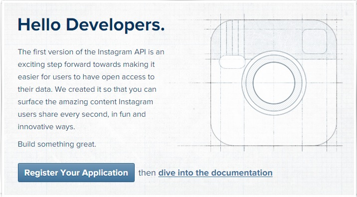
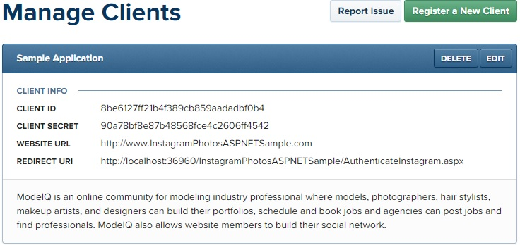
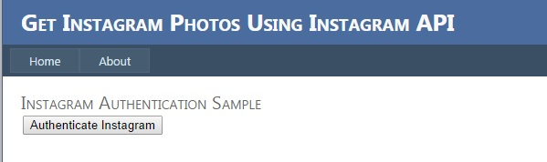
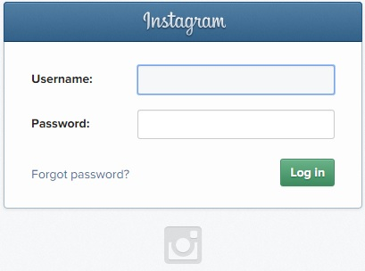
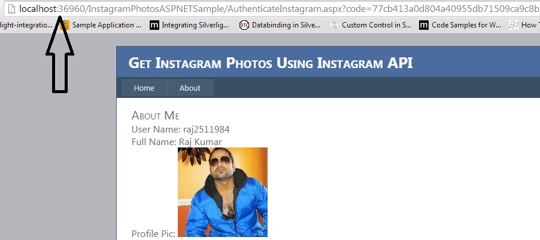

# How to authenticate and get data using Instagram API in ASP.NET
## Requires
- 
## License
- Apache License, Version 2.0
## Technologies
- ASP.NET
- Javascript
## Topics
- Get photos from instagram
- authenticate and get data using Instagram API
- authenticate using Instagram API
- Instagram API
- get data using Instagram API
## Updated
- 10/06/2014
## Description

<h1>Introduction</h1>

In this article I am going to explain how to authenticate Instagram API and how to get user photos, user details, and popular photos using Instagram API.

<h1>Description</h1>

<strong>Instagram</strong> &ndash;

Instagram is an online mobile photo-sharing, video-sharing and social networking service that enables its users to take pictures and videos, and share them on a variety of social networking platforms, such as Facebook, Twitter, Tumblr and Flickr.
<a href="http://en.wikipedia.org/wiki/Instagram">http://en.wikipedia.org/wiki/Instagram</a>

<strong>Authentication -</strong>

First of all you need to register as developer <a href="http://instagram.com/developer/">
http://instagram.com/developer/</a> click on Register Your Application button.

&nbsp;

Image 1.

Now enter your application name, description, website, OAuth redirect URL and captha code and click Register button.

Image 2.

Next screen looks like this which has client id, client secret, website URL, redirect uri.

Keep these credentials in web.config file.

&lt;appSettings&gt;

&nbsp;&nbsp;&nbsp; &lt;add key=&quot;instagram.clientid&quot; value=&quot;8be6127ff21b4f389cb859aadadbf0b4&quot;/&gt;

&nbsp;&nbsp;&nbsp; &lt;add key=&quot;instagram.clientsecret&quot; value=&quot;90a78bf8e87b48568fce4c2606ff4542&quot;/&gt;

&nbsp;&nbsp;&nbsp; &lt;add key=&quot;instagram.redirecturi&quot; value=&quot;http://localhost:36960/InstagramPhotosASPNETSample/AuthenticateInstagram.aspx&quot;/&gt;

&nbsp; &lt;/appSettings&gt;

&nbsp;

Now add a new web form and drag and drop a button control.

&nbsp; &lt;h1&gt;

&nbsp;&nbsp;&nbsp;&nbsp;&nbsp;&nbsp;&nbsp; Instagram Authentication Sample&lt;/h1&gt;

&nbsp;&nbsp;&nbsp; &lt;div&gt;

&nbsp;&nbsp;&nbsp;&nbsp;&nbsp;&nbsp;&nbsp; &lt;asp:Button ID=&quot;btnAuthenticate&quot; runat=&quot;server&quot; Text=&quot;Authenticate Instagram&quot; OnClick=&quot;btnAuthenticate_Click&quot; /&gt;

&nbsp;&nbsp;&nbsp; &lt;/div&gt;

&nbsp;

Fire button event and write following code.

Protected void btnAuthenticate_Click(object sender, EventArgs e)

&nbsp;&nbsp;&nbsp; {

&nbsp;&nbsp;&nbsp;&nbsp;&nbsp;&nbsp;&nbsp; var client_id = ConfigurationManager.AppSettings[&quot;instagram.clientid&quot;].ToString();

&nbsp;&nbsp;&nbsp;&nbsp;&nbsp;&nbsp;&nbsp; var redirect_uri = ConfigurationManager.AppSettings[&quot;instagram.redirecturi&quot;].ToString();

&nbsp;&nbsp;&nbsp;&nbsp;&nbsp;&nbsp;&nbsp; Response.Redirect(&quot;https://api.instagram.com/oauth/authorize/?client_id=&quot; &#43; client_id &#43; &quot;&amp;redirect_uri=&quot; &#43; redirect_uri &#43; &quot;&amp;response_type=code&quot;);

&nbsp;&nbsp;&nbsp; }

&nbsp;

In given cod you can see client_id and redirect_uri are coming from web.config file.

&nbsp;

That will do two things

<ul>
<li>That will open instagram login page if not login on instagram. </li><li>If already login on instgram that will redirect you on given redirect page with a code in query string.
</li></ul>

&nbsp;

Image 3.

If not logged in..

&nbsp;

Image 4.

If logged in.

&nbsp;

Image 5.

Now let&rsquo;s get the data from instagram like recent photos, popular photos and user details.

To get the data using API we need a access token first, so let&rsquo;s get the access token.

<strong>Get Access Token &ndash;</strong>

The Instagram Access Token is a long number that grants other applications access to your Instagram feed. This allows us to display your awesome Instagram photos on your blog. You can grab your access token by clicking here and authorizing Instagram access.
 Tumblr General.&nbsp;

For the most part, Instagram&rsquo;s API only requires the use of a client_id. A client_id simply associates your server, script, or program with a specific application. However, some requests require authentication - specifically requests made on behalf
 of a user. Authenticated requests require an access_token. These tokens are unique to a user and should be stored securely. Access tokens may expire at any time in the future.

Note that in many situations, you may not need to authenticate users at all. For instance, you may request popular photos without authenticating (i.e. you do not need to provide an access_token; just use your client ID with your request). We only require
 authentication in cases where your application is making requests on behalf of a user (commenting, liking, browsing a user&rsquo;s feed, etc.).

<a href="http://instagram.com/developer/authentication/">http://instagram.com/developer/authentication/</a>

Get access-token programmatically.

static string code = string.Empty;

&nbsp;

protected void Page_Load(object sender, EventArgs e)

&nbsp;&nbsp;&nbsp; {

&nbsp;&nbsp;&nbsp;&nbsp;&nbsp;&nbsp;&nbsp; if (!String.IsNullOrEmpty(Request[&quot;code&quot;]) &amp;&amp; !Page.IsPostBack)

&nbsp;&nbsp;&nbsp;&nbsp;&nbsp;&nbsp;&nbsp; {

&nbsp;&nbsp;&nbsp;&nbsp;&nbsp;&nbsp;&nbsp;&nbsp;&nbsp;&nbsp;&nbsp; code = Request[&quot;code&quot;].ToString();

&nbsp;&nbsp;&nbsp;&nbsp;&nbsp;&nbsp;&nbsp;&nbsp;&nbsp;&nbsp;&nbsp; GetDataInstagramToken();

&nbsp;

&nbsp;&nbsp;&nbsp;&nbsp;&nbsp;&nbsp;&nbsp; }

&nbsp;

&nbsp;&nbsp;&nbsp; }

&nbsp;

//Function used to get instagram user id and access token

&nbsp;&nbsp;&nbsp; public void GetDataInstagramToken()

&nbsp;&nbsp; &nbsp;{

&nbsp;&nbsp;&nbsp;&nbsp;&nbsp;&nbsp;&nbsp; var json = &quot;&quot;;

&nbsp;&nbsp;&nbsp;&nbsp;&nbsp;&nbsp;&nbsp; try

&nbsp;&nbsp;&nbsp;&nbsp;&nbsp;&nbsp;&nbsp; {

&nbsp;&nbsp;&nbsp;&nbsp;&nbsp;&nbsp;&nbsp;&nbsp;&nbsp;&nbsp;&nbsp; NameValueCollection parameters = new NameValueCollection();

&nbsp;&nbsp;&nbsp;&nbsp;&nbsp;&nbsp;&nbsp;&nbsp;&nbsp;&nbsp;&nbsp; parameters.Add(&quot;client_id&quot;, ConfigurationManager.AppSettings[&quot;instagram.clientid&quot;].ToString());

&nbsp;&nbsp;&nbsp;&nbsp;&nbsp;&nbsp;&nbsp;&nbsp;&nbsp;&nbsp;&nbsp; parameters.Add(&quot;client_secret&quot;, ConfigurationManager.AppSettings[&quot;instagram.clientsecret&quot;].ToString());

&nbsp;&nbsp;&nbsp;&nbsp;&nbsp;&nbsp;&nbsp;&nbsp;&nbsp;&nbsp;&nbsp; parameters.Add(&quot;grant_type&quot;, &quot;authorization_code&quot;);

&nbsp;&nbsp;&nbsp;&nbsp;&nbsp;&nbsp;&nbsp;&nbsp;&nbsp;&nbsp;&nbsp; parameters.Add(&quot;redirect_uri&quot;, ConfigurationManager.AppSettings[&quot;instagram.redirecturi&quot;].ToString());

&nbsp;&nbsp;&nbsp;&nbsp;&nbsp;&nbsp;&nbsp;&nbsp;&nbsp;&nbsp;&nbsp; parameters.Add(&quot;code&quot;, code);

&nbsp;

&nbsp;&nbsp;&nbsp;&nbsp;&nbsp;&nbsp;&nbsp;&nbsp;&nbsp;&nbsp;&nbsp; WebClient client = new WebClient();

&nbsp;&nbsp;&nbsp;&nbsp;&nbsp;&nbsp;&nbsp;&nbsp;&nbsp;&nbsp;&nbsp; var result = client.UploadValues(&quot;https://api.instagram.com/oauth/access_token&quot;, &quot;POST&quot;, parameters);

&nbsp;&nbsp;&nbsp;&nbsp;&nbsp;&nbsp;&nbsp;&nbsp;&nbsp;&nbsp;&nbsp; var response = System.Text.Encoding.Default.GetString(result);

&nbsp;

&nbsp;&nbsp;&nbsp;&nbsp;&nbsp;&nbsp;&nbsp;&nbsp;&nbsp;&nbsp;&nbsp; // deserializing nested JSON string to object

<strong>&nbsp;&nbsp;&nbsp;&nbsp;&nbsp;&nbsp;&nbsp;&nbsp;&nbsp;&nbsp;&nbsp; var jsResult = (JObject)JsonConvert.DeserializeObject(response);</strong>

<strong>&nbsp;&nbsp;&nbsp;&nbsp;&nbsp;&nbsp;&nbsp;&nbsp;&nbsp;&nbsp;&nbsp; string accessToken = (string)jsResult[&quot;access_token&quot;];</strong>

<strong>&nbsp;&nbsp;&nbsp;&nbsp;&nbsp;&nbsp;&nbsp;&nbsp;&nbsp;&nbsp;&nbsp; int id = (int)jsResult[&quot;user&quot;][&quot;id&quot;];</strong><strong>&nbsp;</strong>

&nbsp;

&nbsp;&nbsp;&nbsp;&nbsp;&nbsp;&nbsp;&nbsp;&nbsp;&nbsp;&nbsp;&nbsp; //This code register id and access token to get on client side

&nbsp;&nbsp;&nbsp;&nbsp;&nbsp;&nbsp;&nbsp;&nbsp;&nbsp;&nbsp;&nbsp; Page.ClientScript.RegisterStartupScript(this.GetType(), &quot;GetToken&quot;, &quot;&lt;script&gt;var instagramaccessid=\&quot;&quot; &#43; @&quot;&quot; &#43; id &#43; &quot;&quot; &#43; &quot;\&quot;; var instagramaccesstoken=\&quot;&quot; &#43; @&quot;&quot; &#43; accessToken &#43; &quot;&quot; &#43;
 &quot;\&quot;;&lt;/script&gt;&quot;);

&nbsp;

&nbsp;&nbsp;&nbsp;&nbsp;&nbsp;&nbsp;&nbsp; }

&nbsp;&nbsp;&nbsp;&nbsp;&nbsp;&nbsp;&nbsp; catch (Exception ex)

&nbsp;&nbsp;&nbsp;&nbsp;&nbsp;&nbsp;&nbsp; {

&nbsp;&nbsp;&nbsp;&nbsp;&nbsp;&nbsp;&nbsp;&nbsp;&nbsp;&nbsp;&nbsp; throw;

&nbsp;

&nbsp;&nbsp;&nbsp;&nbsp;&nbsp;&nbsp;&nbsp; }&nbsp;&nbsp;&nbsp;&nbsp;&nbsp;&nbsp;

&nbsp;}

&nbsp;

In above code, you can see we pass the parameters to instagram and based on those parameters instagram returns json format data which has id and access-token. You can store access_token and id wherever you want.

&nbsp;

&nbsp; // deserializing nested JSON string to object

&nbsp; var jsResult = (JObject)JsonConvert.DeserializeObject(response);

&nbsp; string accessToken = (string)jsResult[&quot;access_token&quot;];

&nbsp; int id = (int)jsResult[&quot;user&quot;][&quot;id&quot;];

&nbsp;

&nbsp; OR

&nbsp;

&nbsp;// deserializing nested JSON string to object

&nbsp;AuthToken user = JsonConvert.DeserializeObject&lt;AuthToken&gt;(response);

&nbsp;accessToken = user.AccessToken;

&nbsp;id = user.User.ID;

&nbsp;

&nbsp;

Now let&rsquo;s fetch user details from instagram like name, username, bio, profile picture using access_token.

&nbsp;

<strong>Get Basic Details - </strong>

&lt;div&gt;

&nbsp;&nbsp;&nbsp;&nbsp;&nbsp;&nbsp;&nbsp;&nbsp;&nbsp;&nbsp;&nbsp; &lt;h1&gt;

&nbsp;&nbsp;&nbsp;&nbsp;&nbsp;&nbsp;&nbsp;&nbsp;&nbsp;&nbsp;&nbsp;&nbsp;&nbsp;&nbsp;&nbsp; About Me&lt;/h1&gt;

&nbsp;&nbsp;&nbsp;&nbsp;&nbsp;&nbsp;&nbsp;&nbsp;&nbsp;&nbsp;&nbsp; &lt;div style=&quot;font-size: medium;&quot;&gt;

&nbsp;&nbsp;&nbsp;&nbsp;&nbsp;&nbsp;&nbsp;&nbsp;&nbsp;&nbsp;&nbsp;&nbsp;&nbsp;&nbsp;&nbsp; User Name:

&nbsp;&nbsp;&nbsp;&nbsp;&nbsp;&nbsp;&nbsp;&nbsp;&nbsp;&nbsp;&nbsp;&nbsp;&nbsp;&nbsp;&nbsp; &lt;label id=&quot;usernameLabel&quot;&gt;

&nbsp;&nbsp;&nbsp;&nbsp;&nbsp;&nbsp;&nbsp;&nbsp;&nbsp;&nbsp;&nbsp;&nbsp;&nbsp;&nbsp;&nbsp; &lt;/label&gt;

&nbsp;&nbsp;&nbsp;&nbsp;&nbsp;&nbsp;&nbsp;&nbsp;&nbsp;&nbsp;&nbsp; &lt;/div&gt;

&nbsp;&nbsp;&nbsp;&nbsp;&nbsp;&nbsp;&nbsp;&nbsp;&nbsp;&nbsp;&nbsp; &lt;div style=&quot;font-size: medium;&quot;&gt;

&nbsp;&nbsp;&nbsp;&nbsp;&nbsp;&nbsp;&nbsp;&nbsp;&nbsp;&nbsp;&nbsp;&nbsp;&nbsp;&nbsp;&nbsp; Full Name:

&nbsp;&nbsp;&nbsp;&nbsp;&nbsp;&nbsp;&nbsp;&nbsp;&nbsp;&nbsp;&nbsp;&nbsp;&nbsp;&nbsp;&nbsp; &lt;label id=&quot;nameLabel&quot;&gt;

&nbsp;&nbsp;&nbsp;&nbsp;&nbsp;&nbsp;&nbsp;&nbsp;&nbsp;&nbsp;&nbsp;&nbsp;&nbsp;&nbsp;&nbsp; &lt;/label&gt;

&nbsp;&nbsp;&nbsp;&nbsp;&nbsp;&nbsp;&nbsp;&nbsp;&nbsp;&nbsp;&nbsp; &lt;/div&gt;

&nbsp;&nbsp;&nbsp;&nbsp;&nbsp;&nbsp;&nbsp;&nbsp;&nbsp;&nbsp;&nbsp; &lt;div style=&quot;font-size: medium;&quot;&gt;

&nbsp;&nbsp;&nbsp;&nbsp;&nbsp;&nbsp;&nbsp;&nbsp;&nbsp;&nbsp;&nbsp;&nbsp;&nbsp;&nbsp;&nbsp; Profile Pic:

&nbsp;&nbsp;&nbsp;&nbsp;&nbsp;&nbsp;&nbsp;&nbsp;&nbsp;&nbsp;&nbsp;&nbsp;&nbsp;&nbsp;&nbsp; &lt;img id=&quot;imgProfilePic&quot; /&gt;

&nbsp;&nbsp;&nbsp;&nbsp;&nbsp;&nbsp;&nbsp;&nbsp;&nbsp;&nbsp;&nbsp; &lt;/div&gt;

&nbsp;&nbsp;&nbsp;&nbsp;&nbsp;&nbsp;&nbsp;&nbsp;&nbsp;&nbsp;&nbsp; &lt;div style=&quot;font-size: medium;&quot;&gt;

&nbsp;&nbsp;&nbsp;&nbsp;&nbsp;&nbsp;&nbsp;&nbsp;&nbsp;&nbsp;&nbsp;&nbsp;&nbsp;&nbsp;&nbsp; Bio:

&nbsp;&nbsp;&nbsp;&nbsp;&nbsp;&nbsp;&nbsp;&nbsp;&nbsp;&nbsp;&nbsp;&nbsp;&nbsp;&nbsp;&nbsp; &lt;label id=&quot;bioLabel&quot;&gt;

&nbsp;&nbsp;&nbsp;&nbsp;&nbsp;&nbsp;&nbsp;&nbsp;&nbsp;&nbsp;&nbsp;&nbsp;&nbsp;&nbsp;&nbsp; &lt;/label&gt;

&nbsp;&nbsp;&nbsp;&nbsp;&nbsp;&nbsp;&nbsp;&nbsp;&nbsp;&nbsp;&nbsp; &lt;/div&gt;

&nbsp;&nbsp;&nbsp;&nbsp;&nbsp;&nbsp;&nbsp; &lt;/div&gt;

<strong>&nbsp;</strong>

&lt;script src=&quot;Scripts/jquery-1.4.1.min.js&quot; type=&quot;text/javascript&quot;&gt;&lt;/script&gt;<strong>&nbsp;</strong>

&nbsp; $(document).ready (function () {&nbsp;&nbsp;&nbsp;&nbsp;&nbsp;&nbsp;&nbsp;

&nbsp; &nbsp;&nbsp;&nbsp;&nbsp;&nbsp;&nbsp;&nbsp; GetUserDetails();

&nbsp; });<strong>&nbsp;</strong>

<strong>&nbsp;</strong>

//Get user details

&nbsp;&nbsp;&nbsp;&nbsp;&nbsp;&nbsp;&nbsp; function GetUserDetails() {

&nbsp;&nbsp;&nbsp;&nbsp;&nbsp;&nbsp;&nbsp;&nbsp;&nbsp;&nbsp;&nbsp; $.ajax({

&nbsp;&nbsp;&nbsp;&nbsp;&nbsp;&nbsp;&nbsp;&nbsp;&nbsp;&nbsp;&nbsp;&nbsp;&nbsp;&nbsp;&nbsp; type: &quot;GET&quot;,

&nbsp;&nbsp;&nbsp;&nbsp;&nbsp;&nbsp;&nbsp;&nbsp;&nbsp;&nbsp;&nbsp;&nbsp;&nbsp;&nbsp;&nbsp; async: true,

&nbsp;&nbsp;&nbsp;&nbsp;&nbsp;&nbsp;&nbsp;&nbsp;&nbsp;&nbsp;&nbsp;&nbsp;&nbsp;&nbsp;&nbsp; contentType: &quot;application/json; charset=utf-8&quot;,

&nbsp;&nbsp;&nbsp;&nbsp;&nbsp;&nbsp;&nbsp;&nbsp;&nbsp;&nbsp;&nbsp;&nbsp;&nbsp;&nbsp;&nbsp; url: 'https://api.instagram.com/v1/users/' &#43; instagramaccessid &#43; '?access_token=' &#43; instagramaccesstoken,

&nbsp;&nbsp;&nbsp;&nbsp;&nbsp;&nbsp;&nbsp;&nbsp;&nbsp;&nbsp;&nbsp;&nbsp;&nbsp;&nbsp;&nbsp; dataType: &quot;jsonp&quot;,

&nbsp;&nbsp;&nbsp;&nbsp;&nbsp;&nbsp;&nbsp;&nbsp;&nbsp;&nbsp;&nbsp;&nbsp;&nbsp;&nbsp;&nbsp; cache: false,

&nbsp;&nbsp;&nbsp;&nbsp;&nbsp;&nbsp;&nbsp;&nbsp;&nbsp;&nbsp;&nbsp;&nbsp;&nbsp;&nbsp;&nbsp; beforeSend: function () {

&nbsp;&nbsp;&nbsp;&nbsp;&nbsp;&nbsp;&nbsp;&nbsp;&nbsp;&nbsp;&nbsp;&nbsp;&nbsp;&nbsp;&nbsp;&nbsp;&nbsp;&nbsp;&nbsp; $(&quot;#loading&quot;).show();

&nbsp;&nbsp;&nbsp;&nbsp;&nbsp;&nbsp;&nbsp;&nbsp;&nbsp;&nbsp;&nbsp;&nbsp;&nbsp;&nbsp;&nbsp; },

&nbsp;&nbsp;&nbsp;&nbsp;&nbsp;&nbsp;&nbsp;&nbsp;&nbsp;&nbsp;&nbsp;&nbsp;&nbsp;&nbsp;&nbsp; success: function (data) {

&nbsp;&nbsp;&nbsp;&nbsp;&nbsp;&nbsp;&nbsp;&nbsp;&nbsp;&nbsp;&nbsp;&nbsp;&nbsp;&nbsp;&nbsp;&nbsp;&nbsp;&nbsp;&nbsp; $('#usernameLabel').text(data.data.username);

&nbsp;&nbsp;&nbsp;&nbsp;&nbsp;&nbsp;&nbsp;&nbsp;&nbsp;&nbsp;&nbsp;&nbsp;&nbsp;&nbsp;&nbsp;&nbsp;&nbsp;&nbsp;&nbsp; $('#nameLabel').text(data.data.full_name);

&nbsp;&nbsp;&nbsp;&nbsp;&nbsp;&nbsp;&nbsp;&nbsp;&nbsp;&nbsp;&nbsp;&nbsp;&nbsp;&nbsp;&nbsp;&nbsp;&nbsp;&nbsp;&nbsp; $('#bioLabel').text(data.data.bio);

&nbsp;&nbsp;&nbsp;&nbsp;&nbsp;&nbsp;&nbsp;&nbsp;&nbsp;&nbsp;&nbsp;&nbsp;&nbsp;&nbsp;&nbsp;&nbsp;&nbsp;&nbsp;&nbsp; document.getElementById(&quot;imgProfilePic&quot;).src = data.data.profile_picture;

&nbsp;&nbsp;&nbsp;&nbsp;&nbsp;&nbsp;&nbsp;&nbsp;&nbsp;&nbsp;&nbsp;&nbsp;&nbsp;&nbsp;&nbsp; }

&nbsp;&nbsp;&nbsp;&nbsp;&nbsp;&nbsp;&nbsp;&nbsp;&nbsp;&nbsp;&nbsp; });

&nbsp;&nbsp;&nbsp;&nbsp;&nbsp;&nbsp;&nbsp; }

&nbsp;

Run the application.

Image 6.

&nbsp;

<strong>Get Recent Photos -</strong>

&nbsp;

&lt;div&gt;

&nbsp;&nbsp;&nbsp;&nbsp;&nbsp;&nbsp;&nbsp;&nbsp;&nbsp;&nbsp;&nbsp; &lt;h1&gt;

&nbsp;&nbsp;&nbsp;&nbsp;&nbsp;&nbsp;&nbsp;&nbsp;&nbsp;&nbsp;&nbsp;&nbsp;&nbsp;&nbsp;&nbsp; Recent Photos&lt;/h1&gt;

&nbsp;&nbsp;&nbsp;&nbsp;&nbsp;&nbsp;&nbsp;&nbsp;&nbsp;&nbsp;&nbsp; &lt;div id=&quot;PhotosDiv&quot;&gt;

&nbsp;&nbsp;&nbsp;&nbsp;&nbsp;&nbsp;&nbsp;&nbsp;&nbsp;&nbsp;&nbsp;&nbsp;&nbsp;&nbsp;&nbsp; &lt;ul id=&quot;PhotosUL&quot;&gt;

&nbsp;&nbsp;&nbsp;&nbsp;&nbsp;&nbsp;&nbsp;&nbsp;&nbsp;&nbsp;&nbsp;&nbsp;&nbsp;&nbsp;&nbsp; &lt;/ul&gt;

&nbsp;&nbsp;&nbsp;&nbsp;&nbsp;&nbsp;&nbsp;&nbsp;&nbsp;&nbsp;&nbsp; &lt;/div&gt;

&nbsp;&nbsp;&nbsp;&nbsp;&nbsp;&nbsp;&nbsp; &lt;/div&gt;

&nbsp;&nbsp;&nbsp;&nbsp;&nbsp;&nbsp;&nbsp; &lt;div style=&quot;clear:both;&quot;&gt;&lt;/div&gt;&nbsp;

&nbsp;

//Get photos

&nbsp;&nbsp;&nbsp;&nbsp;&nbsp;&nbsp;&nbsp; function GetInstagramPhotos() {

&nbsp;&nbsp;&nbsp;&nbsp;&nbsp;&nbsp;&nbsp;&nbsp;&nbsp;&nbsp;&nbsp; $(&quot;#PhotosUL&quot;).html(&quot;&quot;);

&nbsp;&nbsp;&nbsp;&nbsp;&nbsp;&nbsp;&nbsp;&nbsp;&nbsp;&nbsp;&nbsp; $.ajax({

&nbsp;&nbsp;&nbsp;&nbsp;&nbsp;&nbsp;&nbsp;&nbsp;&nbsp;&nbsp;&nbsp;&nbsp;&nbsp;&nbsp;&nbsp; type: &quot;GET&quot;,

&nbsp;&nbsp;&nbsp;&nbsp;&nbsp;&nbsp;&nbsp;&nbsp;&nbsp;&nbsp;&nbsp;&nbsp;&nbsp;&nbsp;&nbsp; async: true,

&nbsp;&nbsp;&nbsp;&nbsp;&nbsp;&nbsp;&nbsp;&nbsp;&nbsp;&nbsp;&nbsp;&nbsp;&nbsp;&nbsp;&nbsp; contentType: &quot;application/json; charset=utf-8&quot;,

&nbsp;&nbsp;&nbsp;&nbsp;&nbsp;&nbsp;&nbsp;&nbsp;&nbsp;&nbsp;&nbsp;&nbsp;&nbsp;&nbsp;&nbsp; //Recent user photos

&nbsp;&nbsp;&nbsp;&nbsp;&nbsp;&nbsp;&nbsp;&nbsp;&nbsp;&nbsp;&nbsp;&nbsp;&nbsp;&nbsp;&nbsp; url: 'https://api.instagram.com/v1/users/' &#43; instagramaccessid &#43; '/media/recent?access_token=' &#43; instagramaccesstoken,

&nbsp;&nbsp;&nbsp;&nbsp;&nbsp;&nbsp;&nbsp;&nbsp;&nbsp;&nbsp;&nbsp;&nbsp;&nbsp;&nbsp;&nbsp; //Most popular photos

&nbsp;&nbsp;&nbsp;&nbsp;&nbsp;&nbsp;&nbsp;&nbsp;&nbsp;&nbsp;&nbsp;&nbsp;&nbsp;&nbsp;&nbsp; //url: &quot;https://api.instagram.com/v1/media/popular?access_token=&quot; &#43; instagramaccesstoken,

&nbsp;&nbsp;&nbsp;&nbsp;&nbsp;&nbsp;&nbsp;&nbsp;&nbsp;&nbsp;&nbsp;&nbsp;&nbsp;&nbsp;&nbsp; //For most recent pictures from a specific location:

&nbsp;&nbsp;&nbsp;&nbsp;&nbsp;&nbsp;&nbsp;&nbsp;&nbsp;&nbsp;&nbsp;&nbsp;&nbsp;&nbsp;&nbsp; //url:&nbsp; &quot;https://api.instagram.com/v1/media/search?lat=[LAT]&amp;lng=[LNG]&amp;distance=[DST]?client_id=[ClientID]&amp;access_token=[CODE]&quot;,

&nbsp;&nbsp;&nbsp;&nbsp;&nbsp;&nbsp;&nbsp;&nbsp;&nbsp;&nbsp;&nbsp;&nbsp;&nbsp;&nbsp;&nbsp; //For min and max images

&nbsp;&nbsp;&nbsp;&nbsp;&nbsp;&nbsp;&nbsp;&nbsp;&nbsp;&nbsp;&nbsp;&nbsp;&nbsp;&nbsp;&nbsp; //url: &quot;https://api.instagram.com/v1/users/&quot;&#43; userId&#43; &quot;/media/recent/&quot;&#43; &quot;?access_token=&quot;&#43; token&#43; &quot;&amp;count=&quot; &#43; mediaCount&#43; &quot;&amp;max_id=&quot; &#43; mOldestId&quot;,

&nbsp;&nbsp;&nbsp;&nbsp;&nbsp;&nbsp;&nbsp;&nbsp;&nbsp;&nbsp;&nbsp;&nbsp;&nbsp;&nbsp;&nbsp; //By Tags

&nbsp;&nbsp;&nbsp;&nbsp;&nbsp;&nbsp;&nbsp;&nbsp;&nbsp;&nbsp;&nbsp;&nbsp;&nbsp;&nbsp;&nbsp; //url: &quot;https://api.instagram.com/v1/tags/coffee/media/recent?client_id=[]&amp;access_token=[]&quot;,

&nbsp;&nbsp;&nbsp;&nbsp;&nbsp;&nbsp;&nbsp;&nbsp;&nbsp;&nbsp;&nbsp;&nbsp;&nbsp;&nbsp;&nbsp; //To get a user&rsquo;s detail

&nbsp;&nbsp;&nbsp;&nbsp;&nbsp;&nbsp;&nbsp;&nbsp;&nbsp;&nbsp;&nbsp;&nbsp;&nbsp;&nbsp;&nbsp; //url: &quot;https://api.instagram.com/v1/users/usert_id/?access_token=youraccesstoken&quot;,

&nbsp;&nbsp;&nbsp;&nbsp;&nbsp;&nbsp;&nbsp;&nbsp;&nbsp;&nbsp;&nbsp;&nbsp;&nbsp;&nbsp;&nbsp; dataType: &quot;jsonp&quot;,

&nbsp;&nbsp;&nbsp;&nbsp;&nbsp;&nbsp;&nbsp;&nbsp;&nbsp;&nbsp;&nbsp;&nbsp;&nbsp;&nbsp;&nbsp; cache: false,

&nbsp;&nbsp;&nbsp;&nbsp;&nbsp;&nbsp;&nbsp;&nbsp;&nbsp;&nbsp;&nbsp;&nbsp;&nbsp;&nbsp;&nbsp; beforeSend: function () {

&nbsp;&nbsp;&nbsp;&nbsp;&nbsp;&nbsp;&nbsp;&nbsp;&nbsp;&nbsp;&nbsp;&nbsp;&nbsp;&nbsp;&nbsp;&nbsp;&nbsp;&nbsp;&nbsp; $(&quot;#loading&quot;).show();

&nbsp;&nbsp;&nbsp;&nbsp;&nbsp;&nbsp;&nbsp;&nbsp;&nbsp;&nbsp;&nbsp;&nbsp;&nbsp;&nbsp;&nbsp; },

&nbsp;&nbsp;&nbsp;&nbsp;&nbsp;&nbsp;&nbsp;&nbsp;&nbsp;&nbsp; &nbsp;&nbsp;&nbsp;&nbsp;&nbsp;success: function (data) {

&nbsp;&nbsp;&nbsp;&nbsp;&nbsp;&nbsp;&nbsp;&nbsp;&nbsp;&nbsp;&nbsp;&nbsp;&nbsp;&nbsp;&nbsp;&nbsp;&nbsp;&nbsp;&nbsp; $(&quot;#loading&quot;).hide();

&nbsp;&nbsp;&nbsp;&nbsp;&nbsp;&nbsp;&nbsp;&nbsp;&nbsp;&nbsp;&nbsp;&nbsp;&nbsp;&nbsp;&nbsp;&nbsp;&nbsp;&nbsp;&nbsp; if (data == &quot;&quot;) {

&nbsp;&nbsp;&nbsp;&nbsp;&nbsp;&nbsp;&nbsp;&nbsp;&nbsp;&nbsp;&nbsp;&nbsp;&nbsp;&nbsp;&nbsp;&nbsp;&nbsp;&nbsp;&nbsp;&nbsp;&nbsp;&nbsp;&nbsp; $(&quot;#PhotosDiv&quot;).hide();

&nbsp;&nbsp;&nbsp;&nbsp;&nbsp;&nbsp;&nbsp;&nbsp;&nbsp;&nbsp;&nbsp;&nbsp;&nbsp;&nbsp;&nbsp;&nbsp;&nbsp;&nbsp;&nbsp; } else {

&nbsp;

&nbsp;&nbsp;&nbsp;&nbsp;&nbsp;&nbsp;&nbsp;&nbsp;&nbsp;&nbsp;&nbsp;&nbsp;&nbsp;&nbsp;&nbsp;&nbsp;&nbsp;&nbsp;&nbsp;&nbsp;&nbsp;&nbsp;&nbsp; $(&quot;#PhotosDiv&quot;).show();

&nbsp;&nbsp;&nbsp;&nbsp;&nbsp;&nbsp;&nbsp;&nbsp;&nbsp;&nbsp;&nbsp;&nbsp;&nbsp;&nbsp;&nbsp;&nbsp;&nbsp; &nbsp;&nbsp;&nbsp;&nbsp;&nbsp;&nbsp;for (var i = 0; i &lt; data[&quot;data&quot;].length; i&#43;&#43;) {

&nbsp;&nbsp;&nbsp;&nbsp;&nbsp;&nbsp;&nbsp;&nbsp;&nbsp;&nbsp;&nbsp;&nbsp;&nbsp;&nbsp;&nbsp;&nbsp;&nbsp;&nbsp;&nbsp;&nbsp;&nbsp;&nbsp;&nbsp;&nbsp;&nbsp;&nbsp;&nbsp; $(&quot;#PhotosUL&quot;).append(&quot;&lt;li style='float:left;list-style:none;'&gt;&lt;a target='_blank'
 href='&quot; &#43; data.data[i].link &#43; &quot;'&gt;&lt;img src='&quot; &#43; data.data[i].images.thumbnail.url &#43; &quot;'&gt;&lt;/img&gt;&lt;/a&gt;&lt;/li&gt;&quot;);

&nbsp;&nbsp;&nbsp;&nbsp;&nbsp;&nbsp;&nbsp;&nbsp;&nbsp;&nbsp;&nbsp;&nbsp;&nbsp;&nbsp;&nbsp;&nbsp;&nbsp;&nbsp;&nbsp;&nbsp;&nbsp;&nbsp;&nbsp; }

&nbsp;

&nbsp;&nbsp;&nbsp;&nbsp;&nbsp;&nbsp;&nbsp;&nbsp;&nbsp;&nbsp;&nbsp;&nbsp;&nbsp;&nbsp;&nbsp;&nbsp;&nbsp;&nbsp;&nbsp; }

&nbsp;&nbsp;&nbsp;&nbsp;&nbsp;&nbsp;&nbsp;&nbsp;&nbsp;&nbsp;&nbsp;&nbsp;&nbsp;&nbsp;&nbsp; }

&nbsp;

&nbsp;&nbsp;&nbsp;&nbsp;&nbsp;&nbsp;&nbsp;&nbsp;&nbsp;&nbsp;&nbsp; });

&nbsp;&nbsp;&nbsp;&nbsp;&nbsp;&nbsp;&nbsp; }

&nbsp;

&lt;script src=&quot;Scripts/jquery-1.4.1.min.js&quot; type=&quot;text/javascript&quot;&gt;&lt;/script&gt;

&nbsp;&nbsp;&nbsp; &lt;script type=&quot;text/javascript&quot;&gt;

&nbsp;&nbsp;&nbsp;&nbsp;&nbsp;&nbsp;&nbsp; $(document).ready(function () {

&nbsp;&nbsp;&nbsp;&nbsp;&nbsp;&nbsp;&nbsp;&nbsp;&nbsp;&nbsp;&nbsp; GetInstagramPhotos();&nbsp;&nbsp;&nbsp;&nbsp;&nbsp;&nbsp;&nbsp;&nbsp;&nbsp;&nbsp;&nbsp;

&nbsp;&nbsp;&nbsp;&nbsp;&nbsp;&nbsp;&nbsp; });

&nbsp;

Output.

&nbsp;

&nbsp;

Image 7.&nbsp;

&nbsp;

<strong>Get Popular Photos &ndash;</strong>&nbsp;

&nbsp;

&lt;div&gt;

&nbsp;&nbsp;&nbsp;&nbsp;&nbsp;&nbsp;&nbsp;&nbsp;&nbsp;&nbsp;&nbsp; &lt;h1&gt;

&nbsp;&nbsp;&nbsp;&nbsp;&nbsp;&nbsp;&nbsp;&nbsp;&nbsp;&nbsp;&nbsp;&nbsp;&nbsp;&nbsp;&nbsp; Popular Pictures&lt;/h1&gt;

&nbsp;&nbsp;&nbsp;&nbsp;&nbsp;&nbsp;&nbsp;&nbsp;&nbsp;&nbsp;&nbsp; &lt;div id=&quot;PopularPhotosDiv&quot;&gt;

&nbsp;&nbsp;&nbsp;&nbsp;&nbsp;&nbsp;&nbsp;&nbsp;&nbsp;&nbsp;&nbsp;&nbsp;&nbsp;&nbsp;&nbsp; &lt;ul id=&quot;photosUL1&quot;&gt;

&nbsp;&nbsp;&nbsp;&nbsp;&nbsp;&nbsp;&nbsp;&nbsp;&nbsp;&nbsp;&nbsp;&nbsp;&nbsp;&nbsp;&nbsp; &lt;/ul&gt;

&nbsp;&nbsp;&nbsp;&nbsp;&nbsp;&nbsp;&nbsp;&nbsp;&nbsp;&nbsp;&nbsp; &lt;/div&gt;

&nbsp;&nbsp;&nbsp;&nbsp;&nbsp;&nbsp;&nbsp; &lt;/div&gt;

&nbsp;

&nbsp;

//Get popular pictures

&nbsp;&nbsp;&nbsp;&nbsp;&nbsp;&nbsp;&nbsp; function GetPopularPhotos() {

&nbsp;&nbsp;&nbsp;&nbsp;&nbsp;&nbsp;&nbsp;&nbsp;&nbsp;&nbsp;&nbsp; $(&quot;#photosUL1&quot;).html(&quot;&quot;);

&nbsp;&nbsp;&nbsp;&nbsp;&nbsp;&nbsp;&nbsp;&nbsp;&nbsp;&nbsp;&nbsp; $.ajax({

&nbsp;&nbsp;&nbsp;&nbsp;&nbsp;&nbsp;&nbsp;&nbsp;&nbsp;&nbsp;&nbsp;&nbsp;&nbsp;&nbsp;&nbsp; type: &quot;GET&quot;,

&nbsp;&nbsp;&nbsp;&nbsp;&nbsp;&nbsp;&nbsp;&nbsp;&nbsp;&nbsp;&nbsp;&nbsp;&nbsp;&nbsp;&nbsp; async: true,

&nbsp;&nbsp;&nbsp;&nbsp;&nbsp;&nbsp;&nbsp;&nbsp;&nbsp;&nbsp;&nbsp;&nbsp;&nbsp;&nbsp;&nbsp; contentType: &quot;application/json; charset=utf-8&quot;,

&nbsp;&nbsp;&nbsp;&nbsp;&nbsp;&nbsp;&nbsp;&nbsp;&nbsp;&nbsp;&nbsp;&nbsp;&nbsp;&nbsp;&nbsp; //Most popular photos

&nbsp;&nbsp;&nbsp;&nbsp;&nbsp;&nbsp;&nbsp;&nbsp;&nbsp;&nbsp;&nbsp;&nbsp;&nbsp;&nbsp;&nbsp; url: &quot;https://api.instagram.com/v1/media/popular?access_token=&quot; &#43; instagramaccesstoken,

&nbsp;&nbsp;&nbsp;&nbsp;&nbsp;&nbsp;&nbsp;&nbsp;&nbsp;&nbsp;&nbsp;&nbsp;&nbsp;&nbsp;&nbsp; dataType: &quot;jsonp&quot;,

&nbsp;&nbsp;&nbsp;&nbsp;&nbsp;&nbsp;&nbsp;&nbsp;&nbsp;&nbsp;&nbsp;&nbsp;&nbsp;&nbsp;&nbsp; cache: false,

&nbsp;&nbsp;&nbsp;&nbsp;&nbsp;&nbsp;&nbsp;&nbsp;&nbsp;&nbsp;&nbsp;&nbsp;&nbsp;&nbsp;&nbsp; beforeSend: function () {

&nbsp;&nbsp;&nbsp;&nbsp;&nbsp;&nbsp;&nbsp;&nbsp;&nbsp;&nbsp;&nbsp;&nbsp;&nbsp;&nbsp;&nbsp;&nbsp;&nbsp;&nbsp;&nbsp; $(&quot;#loading&quot;).show();

&nbsp;&nbsp;&nbsp;&nbsp;&nbsp;&nbsp;&nbsp;&nbsp;&nbsp;&nbsp;&nbsp;&nbsp;&nbsp;&nbsp;&nbsp; },

&nbsp;&nbsp;&nbsp;&nbsp;&nbsp;&nbsp;&nbsp;&nbsp;&nbsp;&nbsp;&nbsp;&nbsp;&nbsp;&nbsp;&nbsp; success: function (data) {

&nbsp;&nbsp;&nbsp;&nbsp;&nbsp;&nbsp;&nbsp;&nbsp;&nbsp;&nbsp;&nbsp;&nbsp;&nbsp;&nbsp;&nbsp;&nbsp;&nbsp;&nbsp;&nbsp; $(&quot;#loading&quot;).hide();

&nbsp;&nbsp;&nbsp;&nbsp;&nbsp;&nbsp;&nbsp;&nbsp;&nbsp;&nbsp;&nbsp;&nbsp;&nbsp;&nbsp;&nbsp;&nbsp;&nbsp;&nbsp;&nbsp; if (data == &quot;&quot;) {

&nbsp;&nbsp;&nbsp;&nbsp;&nbsp;&nbsp;&nbsp;&nbsp;&nbsp;&nbsp;&nbsp;&nbsp;&nbsp;&nbsp;&nbsp;&nbsp;&nbsp;&nbsp;&nbsp;&nbsp;&nbsp;&nbsp;&nbsp; $(&quot;#PopularPhotosDiv&quot;).hide();

&nbsp;&nbsp;&nbsp;&nbsp;&nbsp;&nbsp;&nbsp;&nbsp;&nbsp;&nbsp;&nbsp;&nbsp;&nbsp;&nbsp;&nbsp;&nbsp;&nbsp;&nbsp;&nbsp; } else {

&nbsp;&nbsp;&nbsp;&nbsp;&nbsp;&nbsp;&nbsp;&nbsp;&nbsp;&nbsp;&nbsp;&nbsp;&nbsp;&nbsp;&nbsp;&nbsp;&nbsp;&nbsp;&nbsp;&nbsp;&nbsp;&nbsp;&nbsp; $(&quot;#PopularPhotosDiv&quot;).show();

&nbsp;&nbsp;&nbsp;&nbsp;&nbsp;&nbsp;&nbsp;&nbsp;&nbsp;&nbsp;&nbsp;&nbsp;&nbsp;&nbsp;&nbsp;&nbsp;&nbsp;&nbsp;&nbsp;&nbsp;&nbsp;&nbsp;&nbsp; for (var i = 0; i &lt; data[&quot;data&quot;].length; i&#43;&#43;) {

&nbsp;&nbsp;&nbsp;&nbsp;&nbsp;&nbsp;&nbsp;&nbsp;&nbsp;&nbsp;&nbsp;&nbsp;&nbsp;&nbsp;&nbsp;&nbsp;&nbsp;&nbsp;&nbsp;&nbsp;&nbsp;&nbsp;&nbsp;&nbsp;&nbsp;&nbsp;&nbsp; $(&quot;#photosUL1&quot;).append(&quot;&lt;li style='float:left;list-style:none;'&gt;&lt;a target='_blank'
 href='&quot; &#43; data.data[i].link &#43; &quot;'&gt;&lt;img src='&quot; &#43; data.data[i].images.thumbnail.url &#43; &quot;'&gt;&lt;/img&gt;&lt;/a&gt;&lt;/li&gt;&quot;);

&nbsp;&nbsp;&nbsp;&nbsp;&nbsp;&nbsp;&nbsp;&nbsp;&nbsp;&nbsp;&nbsp;&nbsp;&nbsp;&nbsp;&nbsp;&nbsp;&nbsp;&nbsp;&nbsp;&nbsp;&nbsp;&nbsp;&nbsp; }

&nbsp;

&nbsp;&nbsp;&nbsp;&nbsp;&nbsp;&nbsp;&nbsp;&nbsp;&nbsp;&nbsp;&nbsp;&nbsp;&nbsp;&nbsp;&nbsp;&nbsp;&nbsp;&nbsp;&nbsp; }

&nbsp;&nbsp;&nbsp;&nbsp;&nbsp;&nbsp;&nbsp;&nbsp;&nbsp;&nbsp;&nbsp;&nbsp;&nbsp;&nbsp;&nbsp; }

&nbsp;

&nbsp;&nbsp;&nbsp;&nbsp;&nbsp;&nbsp;&nbsp;&nbsp;&nbsp;&nbsp;&nbsp; });

&nbsp;&nbsp;&nbsp;&nbsp;&nbsp;&nbsp;&nbsp; }&nbsp;

&nbsp;

&lt;script src=&quot;Scripts/jquery-1.4.1.min.js&quot; type=&quot;text/javascript&quot;&gt;&lt;/script&gt;

&nbsp;&nbsp;&nbsp; &lt;script type=&quot;text/javascript&quot;&gt;

&nbsp;&nbsp;&nbsp;&nbsp;&nbsp;&nbsp;&nbsp; $(document).ready(function () {

&nbsp;&nbsp;&nbsp;&nbsp;&nbsp;&nbsp;&nbsp;&nbsp;&nbsp;&nbsp;&nbsp;&nbsp; GetPopularPhotos();

&nbsp;&nbsp;&nbsp;&nbsp;&nbsp;&nbsp;&nbsp; });

&nbsp;

&nbsp;Output.

&nbsp;

Image 8.

