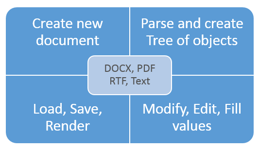

# How to convert PDF to DOCX document in C# - Step by Step
## Requires
- Visual Studio 2012
## License
- MS-LPL
## Technologies
- C#
- Silverlight
- ASP.NET
- Office
- Microsoft Azure
- .NET Framework
- Office 2010
## Topics
- Controls
- Graphics
- C#
- User Interface
- How to
- Office 2010 101 code samples
## Updated
- 06/14/2018
## Description

<h1>Introduction</h1>

<em>This is a C# example to convert any PDF files in DOCX files via a free C# &laquo;Document .Net&raquo; library. You will be able to do with PDF documents all what you want:</em>

<ul class="LiText">
<li><em>Generate new document on fly and fill it by necessary data.</em> </li><li><em>Load existing document and get all it's structure as tree of objects.</em>
</li><li><em>Modify paragraph formatting, text, tables, TOC and other elements in existing document.</em>
</li><li><em>Parse the document and get the tree of its objects.</em> </li><li><em>Replace, merge any data in documents and save as new DOCX, Text or RTF.</em>
</li><li><em>Convert between PDF, DOCX, RTF and Text.</em> </li></ul>

<em>Only the .Net platform and nothing else, 32 and 64-bit support, Medium Trust level.</em>

<em>Product Highlights:</em>

<ul class="LiText">
<li><em>Created in 100% managed C#.</em> </li><li><em>No Microsoft Office automation.</em> </li><li><em>Has own DOCX parser and renderer according to ECMA-376 specification.</em>
</li><li><em>Has own RTF parser and renderer according to RTF 1.8 specification.</em> </li><li><em>Has own PDF parser according to PDF reference 1.7.</em> </li></ul>

&nbsp;

<ul class="LiText">
</ul>

<strong>Main Functions</strong>

The simple code sample:

Input PDF file/Output DOCX file:

&nbsp;

C#

Edit|Remove

csharp

<pre class="csharp">using&nbsp;System;&nbsp;
using&nbsp;<a class="libraryLink" href="https://msdn.microsoft.com/en-US/library/System.IO.aspx" target="_blank" title="Auto generated link to System.IO">System.IO</a>;&nbsp;
using&nbsp;SautinSoft.Document;&nbsp;
&nbsp;
namespace&nbsp;Sample&nbsp;
{&nbsp;
&nbsp;&nbsp;&nbsp;&nbsp;class&nbsp;Sample&nbsp;
&nbsp;&nbsp;&nbsp;&nbsp;{&nbsp;
&nbsp;&nbsp;&nbsp;&nbsp;&nbsp;&nbsp;&nbsp;&nbsp;static&nbsp;void&nbsp;Main(string[]&nbsp;args)&nbsp;
&nbsp;&nbsp;&nbsp;&nbsp;&nbsp;&nbsp;&nbsp;&nbsp;{&nbsp;
&nbsp;&nbsp;&nbsp;&nbsp;&nbsp;&nbsp;&nbsp;&nbsp;&nbsp;&nbsp;&nbsp;&nbsp;ConvertPdfToDocx();&nbsp;&nbsp;&nbsp;&nbsp;&nbsp;&nbsp;&nbsp;&nbsp;&nbsp;&nbsp;&nbsp;&nbsp;&nbsp;
&nbsp;&nbsp;&nbsp;&nbsp;&nbsp;&nbsp;&nbsp;&nbsp;}&nbsp;
&nbsp;&nbsp;&nbsp;&nbsp;&nbsp;&nbsp;&nbsp;&nbsp;public&nbsp;static&nbsp;void&nbsp;ConvertPdfToDocx()&nbsp;
&nbsp;&nbsp;&nbsp;&nbsp;&nbsp;&nbsp;&nbsp;&nbsp;{&nbsp;
&nbsp;&nbsp;&nbsp;&nbsp;&nbsp;&nbsp;&nbsp;&nbsp;&nbsp;&nbsp;&nbsp;&nbsp;//&nbsp;Working&nbsp;directory&nbsp;
&nbsp;&nbsp;&nbsp;&nbsp;&nbsp;&nbsp;&nbsp;&nbsp;&nbsp;&nbsp;&nbsp;&nbsp;string&nbsp;workingDir&nbsp;=&nbsp;Path.GetFullPath(@&quot;Tempos&quot;);&nbsp;&nbsp;&nbsp;&nbsp;&nbsp;&nbsp;&nbsp;&nbsp;&nbsp;&nbsp;&nbsp;&nbsp;&nbsp;
&nbsp;&nbsp;&nbsp;&nbsp;&nbsp;&nbsp;&nbsp;&nbsp;&nbsp;&nbsp;&nbsp;&nbsp;string&nbsp;pdfFile&nbsp;=&nbsp;Path.Combine(workingDir,&nbsp;&quot;example.pdf&quot;);&nbsp;
&nbsp;&nbsp;&nbsp;&nbsp;&nbsp;&nbsp;&nbsp;&nbsp;&nbsp;&nbsp;&nbsp;&nbsp;string&nbsp;docxFile&nbsp;=&nbsp;Path.Combine(workingDir,&nbsp;&quot;Example-result.docx&quot;);&nbsp;
&nbsp;
&nbsp;&nbsp;&nbsp;&nbsp;&nbsp;&nbsp;&nbsp;&nbsp;&nbsp;&nbsp;&nbsp;&nbsp;//&nbsp;You&nbsp;may&nbsp;download&nbsp;the&nbsp;latest&nbsp;version&nbsp;of&nbsp;SDK&nbsp;here:&nbsp;&nbsp;&nbsp;&nbsp;
&nbsp;&nbsp;&nbsp;&nbsp;&nbsp;&nbsp;&nbsp;&nbsp;&nbsp;&nbsp;&nbsp;&nbsp;//&nbsp;http://sautinsoft.com/products/docx-document/download.php&nbsp;&nbsp;&nbsp;
&nbsp;
&nbsp;&nbsp;&nbsp;&nbsp;&nbsp;&nbsp;&nbsp;&nbsp;&nbsp;&nbsp;&nbsp;&nbsp;PdfLoadOptions&nbsp;pdfOptions&nbsp;=&nbsp;new&nbsp;PdfLoadOptions();&nbsp;
&nbsp;&nbsp;&nbsp;&nbsp;&nbsp;&nbsp;&nbsp;&nbsp;&nbsp;&nbsp;&nbsp;&nbsp;pdfOptions.ConversionMode&nbsp;=&nbsp;PdfConversionMode.Flowing;&nbsp;
&nbsp;&nbsp;&nbsp;&nbsp;&nbsp;&nbsp;&nbsp;&nbsp;&nbsp;&nbsp;&nbsp;&nbsp;pdfOptions.DetectTables&nbsp;=&nbsp;true;&nbsp;
&nbsp;&nbsp;&nbsp;&nbsp;&nbsp;&nbsp;&nbsp;&nbsp;&nbsp;&nbsp;&nbsp;&nbsp;pdfOptions.RasterizeVectorGraphics&nbsp;=&nbsp;true;&nbsp;
&nbsp;&nbsp;&nbsp;&nbsp;&nbsp;&nbsp;&nbsp;&nbsp;&nbsp;&nbsp;&nbsp;&nbsp;pdfOptions.FromPage&nbsp;=&nbsp;1;&nbsp;&nbsp;&nbsp;&nbsp;&nbsp;&nbsp;&nbsp;&nbsp;&nbsp;&nbsp;&nbsp;&nbsp;&nbsp;
&nbsp;
&nbsp;&nbsp;&nbsp;&nbsp;&nbsp;&nbsp;&nbsp;&nbsp;&nbsp;&nbsp;&nbsp;&nbsp;DocumentCore&nbsp;pdf&nbsp;=&nbsp;DocumentCore.Load(pdfFile,&nbsp;pdfOptions);&nbsp;&nbsp;&nbsp;&nbsp;&nbsp;&nbsp;&nbsp;&nbsp;&nbsp;&nbsp;&nbsp;&nbsp;&nbsp;
&nbsp;&nbsp;&nbsp;&nbsp;&nbsp;&nbsp;&nbsp;&nbsp;&nbsp;&nbsp;&nbsp;&nbsp;&nbsp;
&nbsp;&nbsp;&nbsp;&nbsp;&nbsp;&nbsp;&nbsp;&nbsp;&nbsp;&nbsp;&nbsp;&nbsp;pdf.Save(docxFile);&nbsp;
&nbsp;
&nbsp;&nbsp;&nbsp;&nbsp;&nbsp;&nbsp;&nbsp;&nbsp;&nbsp;&nbsp;&nbsp;&nbsp;//&nbsp;Open&nbsp;resulting&nbsp;DOCX.&nbsp;&nbsp;&nbsp;&nbsp;&nbsp;&nbsp;&nbsp;&nbsp;&nbsp;&nbsp;&nbsp;&nbsp;&nbsp;
&nbsp;&nbsp;&nbsp;&nbsp;&nbsp;&nbsp;&nbsp;&nbsp;&nbsp;&nbsp;&nbsp;&nbsp;<a class="libraryLink" href="https://msdn.microsoft.com/en-US/library/System.Diagnostics.Process.Start.aspx" target="_blank" title="Auto generated link to System.Diagnostics.Process.Start">System.Diagnostics.Process.Start</a>(docxFile);&nbsp;
&nbsp;&nbsp;&nbsp;&nbsp;&nbsp;&nbsp;&nbsp;&nbsp;}&nbsp;
&nbsp;&nbsp;&nbsp;&nbsp;}&nbsp;
}&nbsp;
</pre>

<h1>Source Code Files</h1>

<em>Related Links:</em>

<em> 
Website:&nbsp;<a href="http://www.sautinsoft.com/">www.sautinsoft.com</a> 
Product Home:&nbsp;<a href="http://sautinsoft.com/products/docx-document/index.php">Document.Net</a> 
Download:&nbsp;<em><a href="http://sautinsoft.com/products/docx-document/download.php">Document.Net</a></em></em>

&nbsp;

<h2 class="H2Text">Requrements and Technical Information</h2>

<em>Requires only .Net 4.0 or above. Our product is compatible with all .Net languages and supports all Operating Systems where .Net Framework can be used. Note that Document.Net is entirely written in managed C#, which makes it absolutely
 standalone and an independent library</em>

