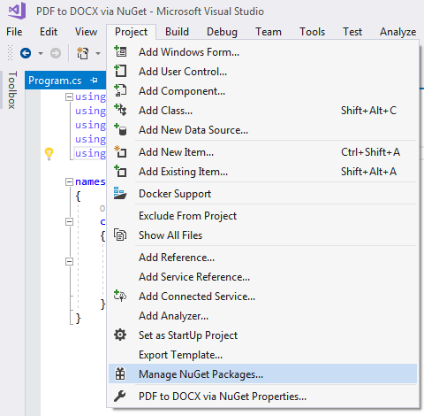
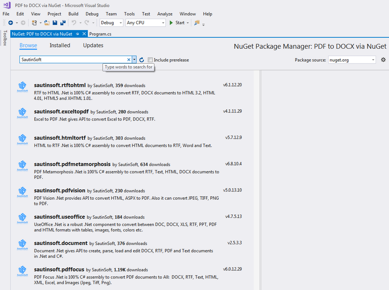
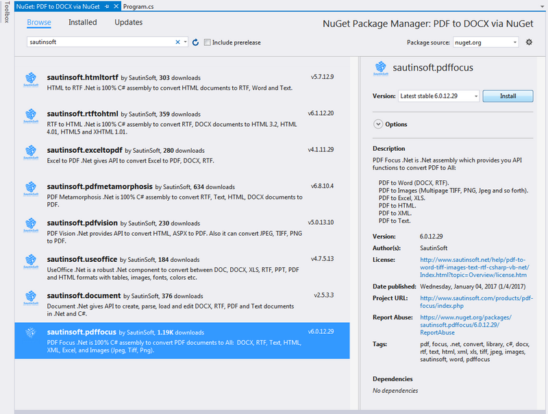
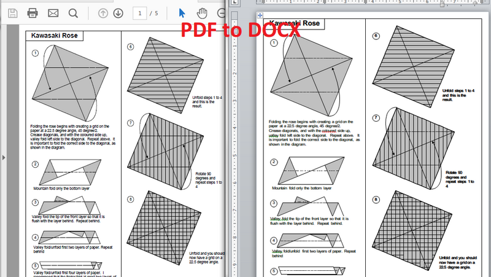

# How to convert PDF to DOCX via NuGet - Step by Step
## Requires
- Visual Studio 2017
## License
- MS-LPL
## Technologies
- C#
- ASP.NET
- Office
- .NET
- WPF
- Microsoft Azure
- .NET Framework
- .NET Framework 4.0
- C# Language
- Visual C#
- SharePoint Server 2013
## Topics
- Controls
- C#
- ASP.NET
- How to
- Office 2010 101 code samples
## Updated
- 04/20/2017
## Description

<h1>Introduction</h1>

<em>This example shows how to easily and simply convert PDF to DOCX using Nuget. It's enough to have Visual Studio with Nuget support, and also 5-10 minutes of free time.</em>

<em>PDF Focus .Net totally simplifies the development of .Net applications where it is required to convert PDF documents. Let us say, to provide the function of converting PDF to Word within a WinForms application, you have add only the reference to the
 &quot;SautinSoft.PdfFocus.dll&quot; and write 3-4 C# lines in your application. 
</em>

<h1>Using NuGet</h1>
<h3>Adding a Package to your Project</h3>

For adding a package, right click the References node in the Solution Explorer and click on Manage NuGet Packages&hellip; option.&nbsp;

It will open a dialog box, here type the desired package name in search text box at the top right side.

When you select the package, it shows package information in right side pane like Created By, Id, Version, Downloads, Description, Dependencies, etc.

Now click the Install button, it will download the package as well as its dependencies if any and install the package in your application.

Once installed, it makes few changes in your project like if you are adding a package for the first time, then it will create a file named&nbsp;<em>packages.config</em>. This file keeps a list of all packages that are installed in your project.

It also creates a folder named&nbsp;<em>packages</em>&nbsp;in the directory where your solution (<em>.sln</em>) file resides. Packages folder contains a subfolder for each installed package with version number.

NuGet automatically adds the reference of library and makes the necessary changes in&nbsp;<em>config</em>&nbsp;file. &nbsp;So you don&rsquo;t need to do anything and now you are ready to use the package in your application.

&nbsp;

The code sample

C#

Из&#1084;енение сценария|Remove

csharp
<pre class="hidden">using System;
using System.Collections.Generic;
using System.Linq;
using System.Text;
using System.Threading.Tasks;

namespace PDF_to_DOCX_via_NuGet
{
    class Program
    {
        static void Main(string[] args)
        {
            string pdfFile = @&quot;d:\Tempos\sample.pdf&quot;;
            string wordFile = @&quot;d:\Tempos\sample.docx&quot;;

            // Convert PDF file to DOCX file
            SautinSoft.PdfFocus f = new SautinSoft.PdfFocus();
           
            f.OpenPdf(pdfFile);

            if (f.PageCount &gt; 0)
            {
                // You may choose output format between Docx and Rtf.
                f.WordOptions.Format = SautinSoft.PdfFocus.CWordOptions.eWordDocument.Docx;

                int result = f.ToWord(wordFile);

                // Show the resulting Word document.
                if (result == 0)
                {
                    System.Diagnostics.Process.Start(wordFile);
                }
            }

        }
    }
}
</pre>

<pre class="csharp">using&nbsp;System;&nbsp;
using&nbsp;System.Collections.Generic;&nbsp;
using&nbsp;System.Linq;&nbsp;
using&nbsp;System.Text;&nbsp;
using&nbsp;System.Threading.Tasks;&nbsp;
&nbsp;
namespace&nbsp;PDF_to_DOCX_via_NuGet&nbsp;
{&nbsp;
&nbsp;&nbsp;&nbsp;&nbsp;class&nbsp;Program&nbsp;
&nbsp;&nbsp;&nbsp;&nbsp;{&nbsp;
&nbsp;&nbsp;&nbsp;&nbsp;&nbsp;&nbsp;&nbsp;&nbsp;static&nbsp;void&nbsp;Main(string[]&nbsp;args)&nbsp;
&nbsp;&nbsp;&nbsp;&nbsp;&nbsp;&nbsp;&nbsp;&nbsp;{&nbsp;
&nbsp;&nbsp;&nbsp;&nbsp;&nbsp;&nbsp;&nbsp;&nbsp;&nbsp;&nbsp;&nbsp;&nbsp;string&nbsp;pdfFile&nbsp;=&nbsp;@&quot;d:\Tempos\sample.pdf&quot;;&nbsp;
&nbsp;&nbsp;&nbsp;&nbsp;&nbsp;&nbsp;&nbsp;&nbsp;&nbsp;&nbsp;&nbsp;&nbsp;string&nbsp;wordFile&nbsp;=&nbsp;@&quot;d:\Tempos\sample.docx&quot;;&nbsp;
&nbsp;
&nbsp;&nbsp;&nbsp;&nbsp;&nbsp;&nbsp;&nbsp;&nbsp;&nbsp;&nbsp;&nbsp;&nbsp;//&nbsp;Convert&nbsp;PDF&nbsp;file&nbsp;to&nbsp;DOCX&nbsp;file&nbsp;
&nbsp;&nbsp;&nbsp;&nbsp;&nbsp;&nbsp;&nbsp;&nbsp;&nbsp;&nbsp;&nbsp;&nbsp;SautinSoft.PdfFocus&nbsp;f&nbsp;=&nbsp;new&nbsp;SautinSoft.PdfFocus();&nbsp;
&nbsp;&nbsp;&nbsp;&nbsp;&nbsp;&nbsp;&nbsp;&nbsp;&nbsp;&nbsp;&nbsp;&nbsp;
&nbsp;&nbsp;&nbsp;&nbsp;&nbsp;&nbsp;&nbsp;&nbsp;&nbsp;&nbsp;&nbsp;&nbsp;f.OpenPdf(pdfFile);&nbsp;
&nbsp;
&nbsp;&nbsp;&nbsp;&nbsp;&nbsp;&nbsp;&nbsp;&nbsp;&nbsp;&nbsp;&nbsp;&nbsp;if&nbsp;(f.PageCount&nbsp;&gt;&nbsp;0)&nbsp;
&nbsp;&nbsp;&nbsp;&nbsp;&nbsp;&nbsp;&nbsp;&nbsp;&nbsp;&nbsp;&nbsp;&nbsp;{&nbsp;
&nbsp;&nbsp;&nbsp;&nbsp;&nbsp;&nbsp;&nbsp;&nbsp;&nbsp;&nbsp;&nbsp;&nbsp;&nbsp;&nbsp;&nbsp;&nbsp;//&nbsp;You&nbsp;may&nbsp;choose&nbsp;output&nbsp;format&nbsp;between&nbsp;Docx&nbsp;and&nbsp;Rtf.&nbsp;
&nbsp;&nbsp;&nbsp;&nbsp;&nbsp;&nbsp;&nbsp;&nbsp;&nbsp;&nbsp;&nbsp;&nbsp;&nbsp;&nbsp;&nbsp;&nbsp;f.WordOptions.Format&nbsp;=&nbsp;SautinSoft.PdfFocus.CWordOptions.eWordDocument.Docx;&nbsp;
&nbsp;
&nbsp;&nbsp;&nbsp;&nbsp;&nbsp;&nbsp;&nbsp;&nbsp;&nbsp;&nbsp;&nbsp;&nbsp;&nbsp;&nbsp;&nbsp;&nbsp;int&nbsp;result&nbsp;=&nbsp;f.ToWord(wordFile);&nbsp;
&nbsp;
&nbsp;&nbsp;&nbsp;&nbsp;&nbsp;&nbsp;&nbsp;&nbsp;&nbsp;&nbsp;&nbsp;&nbsp;&nbsp;&nbsp;&nbsp;&nbsp;//&nbsp;Show&nbsp;the&nbsp;resulting&nbsp;Word&nbsp;document.&nbsp;
&nbsp;&nbsp;&nbsp;&nbsp;&nbsp;&nbsp;&nbsp;&nbsp;&nbsp;&nbsp;&nbsp;&nbsp;&nbsp;&nbsp;&nbsp;&nbsp;if&nbsp;(result&nbsp;==&nbsp;0)&nbsp;
&nbsp;&nbsp;&nbsp;&nbsp;&nbsp;&nbsp;&nbsp;&nbsp;&nbsp;&nbsp;&nbsp;&nbsp;&nbsp;&nbsp;&nbsp;&nbsp;{&nbsp;
&nbsp;&nbsp;&nbsp;&nbsp;&nbsp;&nbsp;&nbsp;&nbsp;&nbsp;&nbsp;&nbsp;&nbsp;&nbsp;&nbsp;&nbsp;&nbsp;&nbsp;&nbsp;&nbsp;&nbsp;System.Diagnostics.Process.Start(wordFile);&nbsp;
&nbsp;&nbsp;&nbsp;&nbsp;&nbsp;&nbsp;&nbsp;&nbsp;&nbsp;&nbsp;&nbsp;&nbsp;&nbsp;&nbsp;&nbsp;&nbsp;}&nbsp;
&nbsp;&nbsp;&nbsp;&nbsp;&nbsp;&nbsp;&nbsp;&nbsp;&nbsp;&nbsp;&nbsp;&nbsp;}&nbsp;
&nbsp;
&nbsp;&nbsp;&nbsp;&nbsp;&nbsp;&nbsp;&nbsp;&nbsp;}&nbsp;
&nbsp;&nbsp;&nbsp;&nbsp;}&nbsp;
}&nbsp;
</pre>

<h1>The results</h1>

<h1>Source Code Files</h1>

<em>Related Links:</em>

<em> 
Website:&nbsp;<a href="http://www.sautinsoft.com/">www.sautinsoft.com</a> 
Product Home:&nbsp;<a href="http://sautinsoft.com/products/pdf-focus/index.php">PDF Focus .NET</a> 
Download:&nbsp;<a href="http://sautinsoft.com/thankyou.php?download=pdf_focus_net.zip">PDF Focus .NET</a>&nbsp;(from website)</em>

<em><em>Search &amp; Install: sautinsoft.pdffocus (<a href="https://www.nuget.org/packages/sautinsoft.pdffocus/">from NuGet</a>)</em> 
</em>

<h2 class="H2Text">Requrements and Technical Information</h2>

<em>Requires only .Net 4.0 or above. Our product is compatible with all .Net languages and supports all Operating Systems where .Net Framework can be used. Note that PDF Focus .Net is entirely written in managed C#, which makes it absolutely
 standalone and an independent library</em>

