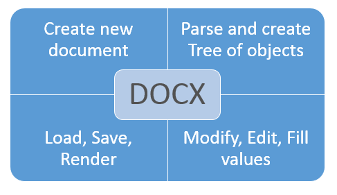
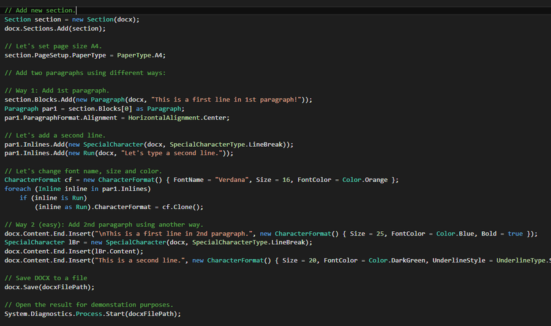
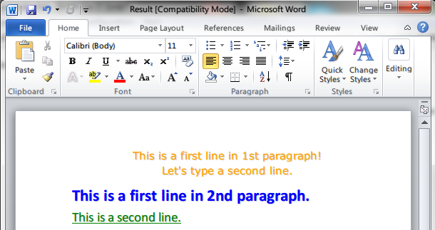

# How to create DOCX document in C# (without MS Word installed) - Step by Step
## Requires
- Visual Studio 2012
## License
- MS-LPL
## Technologies
- C#
- Silverlight
- ASP.NET
- Office
- Windows Forms
- Microsoft Azure
- .NET Framework
## Topics
- Controls
- C#
- ASP.NET
- User Interface
- custom controls
- Word
- How to
- Office 2010 101 code samples
- User Control
## Updated
- 04/19/2016
## Description

<h1>Introduction</h1>

<em>This is a C# example to generate a DOCX file via a free C# &laquo;DOCX Document .Net&raquo; library. You will be able to create DOCX document on fly and fill it by necessary data.</em>

 
<em>If you are searching for a solution to create DOCX in C#, stop the searching - you're in the right place! The DOCX Document.Net is only the one library designed for this purpose.</em>

 
<em>Only the .Net platform and nothing else, 32 and 64-bit support, Medium Trust level.</em>

<em>You will be able to do with DOCX documents all what you want:&nbsp;</em>

<ul class="LiText">
<li><em>Create a DOCX document on fly and fill it by necessary data.</em> </li><li><em>Load a DOCX document and get all it's structure as tree of objects.</em> </li><li><em>Modify text, tables and other data in an existing DOCX document.</em> </li><li><em>Parse the current content and structure and Save/Render it as a new DOCX.</em>
</li><li><em>Replace data in a DOCX document.</em> </li></ul>

<strong style="font-size:2em">Main Functions</strong>

The simple code sample:

The result (Docx file):

<em> 
</em>

&nbsp;

<h1>How to do it:</h1>

<em>So, here we'll show you in details how to create DOCX document on fly and fill it by necessary data.</em>

<em><strong>Very simple example.</strong>&nbsp;For example, we need to generate a simple DOCX document with 2 paragraphs.</em>

<em><strong>Step 1</strong>:&nbsp;Launch Visual Studio 2010 (2013). Click File-&gt;New Project-&gt;Visual C# Console Application.</em>

<em>Type the application name and location, for example &quot;simple DOCX&quot; and &quot;c:\samples&quot;.</em>

<em><strong>Step 2</strong>:&nbsp;In the Solution Explorer right-click on &quot;References&quot; and select &quot;Add Reference&quot;. Next add a reference to the &quot;Document.dll&quot;</em><em>.</em>

<em><strong>Step 3</strong>:&nbsp;So, we've created an empty C# console application. Now type the C# code to create a simple DOCX file with name: Result.docx</em>

<em><strong>Step 4</strong>: Please insert c# code in your console application.&nbsp;Now build the application and launch it.</em>

<em><strong>Well done!&nbsp;</strong>Our congratulations, with help of the Docx Document .Net library we've created an editable Word document.</em>

&nbsp;

C#

Edit|Remove

csharp

<pre class="csharp">using&nbsp;System;&nbsp;
using&nbsp;<a class="libraryLink" href="https://msdn.microsoft.com/en-US/library/System.IO.aspx" target="_blank" title="Auto generated link to System.IO">System.IO</a>;&nbsp;
using&nbsp;SautinSoft.Document;&nbsp;
&nbsp;
namespace&nbsp;Sample&nbsp;
{&nbsp;
&nbsp;&nbsp;&nbsp;&nbsp;class&nbsp;Sample&nbsp;
&nbsp;&nbsp;&nbsp;&nbsp;{&nbsp;
&nbsp;&nbsp;&nbsp;&nbsp;&nbsp;&nbsp;&nbsp;&nbsp;static&nbsp;void&nbsp;Main(string[]&nbsp;args)&nbsp;
&nbsp;&nbsp;&nbsp;&nbsp;&nbsp;&nbsp;&nbsp;&nbsp;{&nbsp;
&nbsp;&nbsp;&nbsp;&nbsp;&nbsp;&nbsp;&nbsp;&nbsp;&nbsp;&nbsp;&nbsp;&nbsp;CreateDocx();&nbsp;&nbsp;&nbsp;&nbsp;&nbsp;&nbsp;&nbsp;&nbsp;&nbsp;&nbsp;&nbsp;&nbsp;&nbsp;
&nbsp;&nbsp;&nbsp;&nbsp;&nbsp;&nbsp;&nbsp;&nbsp;}&nbsp;
&nbsp;&nbsp;&nbsp;&nbsp;&nbsp;&nbsp;&nbsp;&nbsp;&nbsp;&nbsp;&nbsp;&nbsp;&nbsp;&nbsp;&nbsp;&nbsp;public&nbsp;static&nbsp;void&nbsp;CreateDocx()&nbsp;
&nbsp;&nbsp;&nbsp;&nbsp;&nbsp;&nbsp;&nbsp;&nbsp;{&nbsp;
&nbsp;&nbsp;&nbsp;&nbsp;&nbsp;&nbsp;&nbsp;&nbsp;&nbsp;&nbsp;&nbsp;&nbsp;//&nbsp;Working&nbsp;directory&nbsp;
&nbsp;&nbsp;&nbsp;&nbsp;&nbsp;&nbsp;&nbsp;&nbsp;&nbsp;&nbsp;&nbsp;&nbsp;string&nbsp;workingDir&nbsp;=&nbsp;Path.GetFullPath(Directory.GetCurrentDirectory()&nbsp;&#43;&nbsp;@&quot;&quot;);&nbsp;
&nbsp;&nbsp;&nbsp;&nbsp;&nbsp;&nbsp;&nbsp;&nbsp;&nbsp;&nbsp;&nbsp;&nbsp;string&nbsp;docxFilePath&nbsp;=&nbsp;Path.Combine(workingDir,&nbsp;&quot;Result.docx&quot;);&nbsp;
&nbsp;
&nbsp;&nbsp;&nbsp;&nbsp;&nbsp;&nbsp;&nbsp;&nbsp;&nbsp;&nbsp;&nbsp;&nbsp;//&nbsp;Let's&nbsp;create&nbsp;a&nbsp;simple&nbsp;DOCX&nbsp;document.&nbsp;
&nbsp;&nbsp;&nbsp;&nbsp;&nbsp;&nbsp;&nbsp;&nbsp;&nbsp;&nbsp;&nbsp;&nbsp;DocumentCore&nbsp;docx&nbsp;=&nbsp;new&nbsp;DocumentCore();&nbsp;
&nbsp;&nbsp;&nbsp;&nbsp;&nbsp;&nbsp;&nbsp;&nbsp;&nbsp;&nbsp;&nbsp;//&nbsp;You&nbsp;may&nbsp;download&nbsp;the&nbsp;latest&nbsp;version&nbsp;of&nbsp;SDK&nbsp;here:&nbsp;&nbsp;&nbsp;
&nbsp;&nbsp;&nbsp;&nbsp;&nbsp;&nbsp;&nbsp;&nbsp;&nbsp;&nbsp;&nbsp;//&nbsp;http://sautinsoft.com/products/docx-document/download.php&nbsp;&nbsp;
&nbsp;&nbsp;&nbsp;&nbsp;&nbsp;&nbsp;&nbsp;&nbsp;&nbsp;&nbsp;&nbsp;&nbsp;
&nbsp;&nbsp;&nbsp;&nbsp;&nbsp;&nbsp;&nbsp;&nbsp;&nbsp;&nbsp;&nbsp;&nbsp;//&nbsp;Add&nbsp;new&nbsp;section.&nbsp;
&nbsp;&nbsp;&nbsp;&nbsp;&nbsp;&nbsp;&nbsp;&nbsp;&nbsp;&nbsp;&nbsp;&nbsp;Section&nbsp;section&nbsp;=&nbsp;new&nbsp;Section(docx);&nbsp;
&nbsp;&nbsp;&nbsp;&nbsp;&nbsp;&nbsp;&nbsp;&nbsp;&nbsp;&nbsp;&nbsp;&nbsp;docx.Sections.Add(section);&nbsp;
&nbsp;
&nbsp;&nbsp;&nbsp;&nbsp;&nbsp;&nbsp;&nbsp;&nbsp;&nbsp;&nbsp;&nbsp;&nbsp;//&nbsp;Let's&nbsp;set&nbsp;page&nbsp;size&nbsp;A4.&nbsp;
&nbsp;&nbsp;&nbsp;&nbsp;&nbsp;&nbsp;&nbsp;&nbsp;&nbsp;&nbsp;&nbsp;&nbsp;section.PageSetup.PaperType&nbsp;=&nbsp;PaperType.A4;&nbsp;
&nbsp;
&nbsp;&nbsp;&nbsp;&nbsp;&nbsp;&nbsp;&nbsp;&nbsp;&nbsp;&nbsp;&nbsp;&nbsp;//&nbsp;Add&nbsp;two&nbsp;paragraphs&nbsp;using&nbsp;different&nbsp;ways:&nbsp;
&nbsp;
&nbsp;&nbsp;&nbsp;&nbsp;&nbsp;&nbsp;&nbsp;&nbsp;&nbsp;&nbsp;&nbsp;&nbsp;//&nbsp;Way&nbsp;1:&nbsp;Add&nbsp;1st&nbsp;paragraph.&nbsp;
&nbsp;&nbsp;&nbsp;&nbsp;&nbsp;&nbsp;&nbsp;&nbsp;&nbsp;&nbsp;&nbsp;&nbsp;section.Blocks.Add(new&nbsp;Paragraph(docx,&nbsp;&quot;This&nbsp;is&nbsp;a&nbsp;first&nbsp;line&nbsp;in&nbsp;1st&nbsp;paragraph!&quot;));&nbsp;
&nbsp;&nbsp;&nbsp;&nbsp;&nbsp;&nbsp;&nbsp;&nbsp;&nbsp;&nbsp;&nbsp;&nbsp;Paragraph&nbsp;par1&nbsp;=&nbsp;section.Blocks[0]&nbsp;as&nbsp;Paragraph;&nbsp;
&nbsp;&nbsp;&nbsp;&nbsp;&nbsp;&nbsp;&nbsp;&nbsp;&nbsp;&nbsp;&nbsp;&nbsp;par1.ParagraphFormat.Alignment&nbsp;=&nbsp;HorizontalAlignment.Center;&nbsp;
&nbsp;
&nbsp;&nbsp;&nbsp;&nbsp;&nbsp;&nbsp;&nbsp;&nbsp;&nbsp;&nbsp;&nbsp;&nbsp;//&nbsp;Let's&nbsp;add&nbsp;a&nbsp;second&nbsp;line.&nbsp;
&nbsp;&nbsp;&nbsp;&nbsp;&nbsp;&nbsp;&nbsp;&nbsp;&nbsp;&nbsp;&nbsp;&nbsp;par1.Inlines.Add(new&nbsp;SpecialCharacter(docx,&nbsp;SpecialCharacterType.LineBreak));&nbsp;
&nbsp;&nbsp;&nbsp;&nbsp;&nbsp;&nbsp;&nbsp;&nbsp;&nbsp;&nbsp;&nbsp;&nbsp;par1.Inlines.Add(new&nbsp;Run(docx,&nbsp;&quot;Let's&nbsp;type&nbsp;a&nbsp;second&nbsp;line.&quot;));&nbsp;
&nbsp;
&nbsp;&nbsp;&nbsp;&nbsp;&nbsp;&nbsp;&nbsp;&nbsp;&nbsp;&nbsp;&nbsp;&nbsp;//&nbsp;Let's&nbsp;change&nbsp;font&nbsp;name,&nbsp;size&nbsp;and&nbsp;color.&nbsp;
&nbsp;&nbsp;&nbsp;&nbsp;&nbsp;&nbsp;&nbsp;&nbsp;&nbsp;&nbsp;&nbsp;&nbsp;CharacterFormat&nbsp;cf&nbsp;=&nbsp;new&nbsp;CharacterFormat()&nbsp;{&nbsp;FontName&nbsp;=&nbsp;&quot;Verdana&quot;,&nbsp;Size&nbsp;=&nbsp;16,&nbsp;FontColor&nbsp;=&nbsp;Color.Orange&nbsp;};&nbsp;
&nbsp;&nbsp;&nbsp;&nbsp;&nbsp;&nbsp;&nbsp;&nbsp;&nbsp;&nbsp;&nbsp;&nbsp;foreach&nbsp;(Inline&nbsp;inline&nbsp;in&nbsp;par1.Inlines)&nbsp;
&nbsp;&nbsp;&nbsp;&nbsp;&nbsp;&nbsp;&nbsp;&nbsp;&nbsp;&nbsp;&nbsp;&nbsp;&nbsp;&nbsp;&nbsp;&nbsp;if&nbsp;(inline&nbsp;is&nbsp;Run)&nbsp;
&nbsp;&nbsp;&nbsp;&nbsp;&nbsp;&nbsp;&nbsp;&nbsp;&nbsp;&nbsp;&nbsp;&nbsp;&nbsp;&nbsp;&nbsp;&nbsp;&nbsp;&nbsp;&nbsp;&nbsp;(inline&nbsp;as&nbsp;Run).CharacterFormat&nbsp;=&nbsp;cf.Clone();&nbsp;
&nbsp;
&nbsp;&nbsp;&nbsp;&nbsp;&nbsp;&nbsp;&nbsp;&nbsp;&nbsp;&nbsp;&nbsp;&nbsp;//&nbsp;Way&nbsp;2&nbsp;(easy):&nbsp;Add&nbsp;2nd&nbsp;paragarph&nbsp;using&nbsp;another&nbsp;way.&nbsp;
&nbsp;&nbsp;&nbsp;&nbsp;&nbsp;&nbsp;&nbsp;&nbsp;&nbsp;&nbsp;&nbsp;&nbsp;docx.Content.End.Insert(&quot;\nThis&nbsp;is&nbsp;a&nbsp;first&nbsp;line&nbsp;in&nbsp;2nd&nbsp;paragraph.&quot;,&nbsp;new&nbsp;CharacterFormat()&nbsp;{&nbsp;Size&nbsp;=&nbsp;25,&nbsp;FontColor&nbsp;=&nbsp;Color.Blue,&nbsp;Bold&nbsp;=&nbsp;true&nbsp;});&nbsp;
&nbsp;&nbsp;&nbsp;&nbsp;&nbsp;&nbsp;&nbsp;&nbsp;&nbsp;&nbsp;&nbsp;&nbsp;SpecialCharacter&nbsp;lBr&nbsp;=&nbsp;new&nbsp;SpecialCharacter(docx,&nbsp;SpecialCharacterType.LineBreak);&nbsp;
&nbsp;&nbsp;&nbsp;&nbsp;&nbsp;&nbsp;&nbsp;&nbsp;&nbsp;&nbsp;&nbsp;&nbsp;docx.Content.End.Insert(lBr.Content);&nbsp;
&nbsp;&nbsp;&nbsp;&nbsp;&nbsp;&nbsp;&nbsp;&nbsp;&nbsp;&nbsp;&nbsp;&nbsp;docx.Content.End.Insert(&quot;This&nbsp;is&nbsp;a&nbsp;second&nbsp;line.&quot;,&nbsp;new&nbsp;CharacterFormat()&nbsp;{&nbsp;Size&nbsp;=&nbsp;20,&nbsp;FontColor&nbsp;=&nbsp;Color.DarkGreen,&nbsp;UnderlineStyle&nbsp;=&nbsp;UnderlineType.Single&nbsp;});&nbsp;
&nbsp;
&nbsp;&nbsp;&nbsp;&nbsp;&nbsp;&nbsp;&nbsp;&nbsp;&nbsp;&nbsp;&nbsp;&nbsp;//&nbsp;Save&nbsp;DOCX&nbsp;to&nbsp;a&nbsp;file&nbsp;
&nbsp;&nbsp;&nbsp;&nbsp;&nbsp;&nbsp;&nbsp;&nbsp;&nbsp;&nbsp;&nbsp;&nbsp;docx.Save(docxFilePath);&nbsp;
&nbsp;
&nbsp;&nbsp;&nbsp;&nbsp;&nbsp;&nbsp;&nbsp;&nbsp;&nbsp;&nbsp;&nbsp;&nbsp;//&nbsp;Open&nbsp;the&nbsp;result&nbsp;for&nbsp;demonstation&nbsp;purposes.&nbsp;
&nbsp;&nbsp;&nbsp;&nbsp;&nbsp;&nbsp;&nbsp;&nbsp;&nbsp;&nbsp;&nbsp;&nbsp;<a class="libraryLink" href="https://msdn.microsoft.com/en-US/library/System.Diagnostics.Process.Start.aspx" target="_blank" title="Auto generated link to System.Diagnostics.Process.Start">System.Diagnostics.Process.Start</a>(docxFilePath);&nbsp;
&nbsp;&nbsp;&nbsp;&nbsp;&nbsp;&nbsp;&nbsp;&nbsp;}&nbsp;
&nbsp;
&nbsp;&nbsp;&nbsp;&nbsp;}&nbsp;
}&nbsp;
</pre>

<h1>Source Code Files</h1>

<em>Related Links:</em>

<em> 
Website:&nbsp;<a href="http://www.sautinsoft.com/">www.sautinsoft.com</a> 
Product Home: <a href="http://sautinsoft.com/products/docx-document/index.php">Docx Document.Net</a> 
Download:&nbsp;<em><a href="http://sautinsoft.com/products/docx-document/download.php">Docx Document.Net</a></em></em>

&nbsp;

<h2 class="H2Text">Requrements and Technical Information</h2>

<em>Requires only .Net 4.0 or above. Our product is compatible with all .Net languages and supports all Operating Systems where .Net Framework can be used. Note that DOCX Document.Net is entirely written in managed C#, which makes it
 absolutely standalone and an independent library</em>

