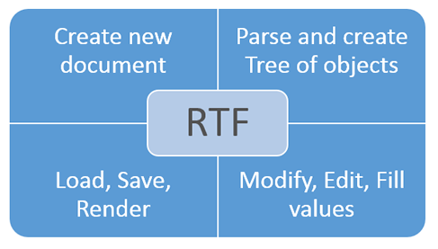

# How to create RTF document in C# (without MS Word installed) - Step by Step
## Requires
- Visual Studio 2012
## License
- MS-LPL
## Technologies
- C#
- Silverlight
- ASP.NET
- Office
- .NET Framework
- VB.Net
- Visual C#
## Topics
- Controls
- C#
- ASP.NET
- User Interface
- How to
- Office 2010 101 code samples
## Updated
- 04/22/2016
## Description

<h1>Introduction</h1>

<em>This is a C# example to generate a RTF file via a free C# &laquo;RTF Document .Net&raquo; library. You will be able to create RTF document on fly and fill it by necessary data.</em>

<em> 
</em>

<em>If you are searching for a solution to create RTF in C#, stop the searching - you're in the right place! The RTF Document.Net is only the one library designed for this purpose.</em>

 
<em>Only the .Net platform and nothing else, 32 and 64-bit support, Medium Trust level.</em>

<em>You will be able to do with RTF documents all what you want:</em>

<ul class="LiText">
<li><em>Create RTF document on fly and fill it by necessary data.</em> </li><li><em>Load RTF document and get all it's structure as tree of objects.</em> </li><li><em>Modify text, tables and other data in existing RTF document.</em> </li><li><em>Parse current content and structure and Save/Render it as new RTF.</em> </li><li><em>Replace data in RTF document.</em> </li></ul>
<h1>Main Function</h1>

The simple code sample:

The result (RTF file):

 

<h1>How to do it:</h1>

<em>So, here we'll show you in details how to create RTF document on fly and fill it by necessary data.</em>

<em><strong>Very simple example.</strong>&nbsp;For example, we need to generate a simple RTF document with 2 paragraphs.</em>

<em><strong>Step 1</strong>:&nbsp;Launch Visual Studio 2010 (2013). Click File-&gt;New Project-&gt;Visual C# Console Application.</em>

<em>Type the application name and location, for example &quot;simple RTF&quot; and &quot;c:\samples&quot;.</em>

<em><strong>Step 2</strong>:&nbsp;In the Solution Explorer right-click on &quot;References&quot; and select &quot;Add Reference&quot;. Next add a reference to the &quot;Document.dll&quot;</em><em>.</em>

<em><strong>Step 3</strong>:&nbsp;So, we've created an empty C# console application. Now type the C# code to create a simple RTF file with name: Result.rtf</em>

<em><strong>Step 4</strong>: Please insert c# code in your console application.&nbsp;Now build the application and launch it.</em>

<em><strong>Well done!&nbsp;</strong>Our congratulations, with help of the RTF Document .Net library we've created an editable Word document.</em>

&nbsp;

C#

Edit|Remove

csharp
<pre class="hidden">using System;
using System.IO;
using SautinSoft.Document;

namespace Sample
{
    class Sample
    {
        static void Main(string[] args)
        {
            CreateRtf();            
        }
        public static void CreateRtf()
        {
            // Working directory
            string workingDir = Path.GetFullPath(Directory.GetCurrentDirectory() &#43; @&quot;Tempos&quot;);
            string rtfFilePath = Path.Combine(workingDir, &quot;Result.rtf&quot;);

            // Let's create a simple RTF document.
            DocumentCore rtf = new DocumentCore();
             // You may download the latest version of SDK here:   
            // http://sautinsoft.com/products/rtf-document/download.php  

            // Add new section.
            Section section = new Section(rtf);
            rtf.Sections.Add(section);

            // Let's set page size A4.
            section.PageSetup.PaperType = PaperType.A4;

            // Add two paragraphs using different ways:

            // Way 1: Add 1st paragraph.
            section.Blocks.Add(new Paragraph(rtf, &quot;This is a first line in 1st paragraph!&quot;));
            Paragraph par1 = section.Blocks[0] as Paragraph;
            par1.ParagraphFormat.Alignment = HorizontalAlignment.Center;

            // Let's add a second line.
            par1.Inlines.Add(new SpecialCharacter(rtf, SpecialCharacterType.LineBreak));
            par1.Inlines.Add(new Run(rtf, &quot;Let's type a second line.&quot;));

            // Let's change font name, size and color.
            CharacterFormat cf = new CharacterFormat() { FontName = &quot;Verdana&quot;, Size = 16, FontColor = Color.Orange };
            foreach (Inline inline in par1.Inlines)
                if (inline is Run)
                    (inline as Run).CharacterFormat = cf.Clone();

            // Way 2 (easy): Add 2nd paragarph using another way.
            rtf.Content.End.Insert(&quot;\nThis is a first line in 2nd paragraph.&quot;, new CharacterFormat() { Size = 25, FontColor = Color.Blue, Bold = true });
            SpecialCharacter lBr = new SpecialCharacter(rtf, SpecialCharacterType.LineBreak);
            rtf.Content.End.Insert(lBr.Content);
            rtf.Content.End.Insert(&quot;This is a second line.&quot;, new CharacterFormat() { Size = 20, FontColor = Color.DarkGreen, UnderlineStyle = UnderlineType.Single });

            // Save RTF to a file
            rtf.Save(rtfFilePath, SaveOptions.RtfDefault);

            // Open the result for demonstation purposes.
            System.Diagnostics.Process.Start(rtfFilePath);
        }

    }
}
</pre>

<pre class="csharp">using&nbsp;System;&nbsp;
using&nbsp;System.IO;&nbsp;
using&nbsp;SautinSoft.Document;&nbsp;
&nbsp;
namespace&nbsp;Sample&nbsp;
{&nbsp;
&nbsp;&nbsp;&nbsp;&nbsp;class&nbsp;Sample&nbsp;
&nbsp;&nbsp;&nbsp;&nbsp;{&nbsp;
&nbsp;&nbsp;&nbsp;&nbsp;&nbsp;&nbsp;&nbsp;&nbsp;static&nbsp;void&nbsp;Main(string[]&nbsp;args)&nbsp;
&nbsp;&nbsp;&nbsp;&nbsp;&nbsp;&nbsp;&nbsp;&nbsp;{&nbsp;
&nbsp;&nbsp;&nbsp;&nbsp;&nbsp;&nbsp;&nbsp;&nbsp;&nbsp;&nbsp;&nbsp;&nbsp;CreateRtf();&nbsp;&nbsp;&nbsp;&nbsp;&nbsp;&nbsp;&nbsp;&nbsp;&nbsp;&nbsp;&nbsp;&nbsp;&nbsp;
&nbsp;&nbsp;&nbsp;&nbsp;&nbsp;&nbsp;&nbsp;&nbsp;}&nbsp;
&nbsp;&nbsp;&nbsp;&nbsp;&nbsp;&nbsp;&nbsp;&nbsp;public&nbsp;static&nbsp;void&nbsp;CreateRtf()&nbsp;
&nbsp;&nbsp;&nbsp;&nbsp;&nbsp;&nbsp;&nbsp;&nbsp;{&nbsp;
&nbsp;&nbsp;&nbsp;&nbsp;&nbsp;&nbsp;&nbsp;&nbsp;&nbsp;&nbsp;&nbsp;&nbsp;//&nbsp;Working&nbsp;directory&nbsp;
&nbsp;&nbsp;&nbsp;&nbsp;&nbsp;&nbsp;&nbsp;&nbsp;&nbsp;&nbsp;&nbsp;&nbsp;string&nbsp;workingDir&nbsp;=&nbsp;Path.GetFullPath(Directory.GetCurrentDirectory()&nbsp;&#43;&nbsp;@&quot;Tempos&quot;);&nbsp;
&nbsp;&nbsp;&nbsp;&nbsp;&nbsp;&nbsp;&nbsp;&nbsp;&nbsp;&nbsp;&nbsp;&nbsp;string&nbsp;rtfFilePath&nbsp;=&nbsp;Path.Combine(workingDir,&nbsp;&quot;Result.rtf&quot;);&nbsp;
&nbsp;
&nbsp;&nbsp;&nbsp;&nbsp;&nbsp;&nbsp;&nbsp;&nbsp;&nbsp;&nbsp;&nbsp;&nbsp;//&nbsp;Let's&nbsp;create&nbsp;a&nbsp;simple&nbsp;RTF&nbsp;document.&nbsp;
&nbsp;&nbsp;&nbsp;&nbsp;&nbsp;&nbsp;&nbsp;&nbsp;&nbsp;&nbsp;&nbsp;&nbsp;DocumentCore&nbsp;rtf&nbsp;=&nbsp;new&nbsp;DocumentCore();&nbsp;
&nbsp;&nbsp;&nbsp;&nbsp;&nbsp;&nbsp;&nbsp;&nbsp;&nbsp;&nbsp;&nbsp;&nbsp;&nbsp;//&nbsp;You&nbsp;may&nbsp;download&nbsp;the&nbsp;latest&nbsp;version&nbsp;of&nbsp;SDK&nbsp;here:&nbsp;&nbsp;&nbsp;&nbsp;
&nbsp;&nbsp;&nbsp;&nbsp;&nbsp;&nbsp;&nbsp;&nbsp;&nbsp;&nbsp;&nbsp;&nbsp;//&nbsp;http://sautinsoft.com/products/rtf-document/download.php&nbsp;&nbsp;&nbsp;
&nbsp;
&nbsp;&nbsp;&nbsp;&nbsp;&nbsp;&nbsp;&nbsp;&nbsp;&nbsp;&nbsp;&nbsp;&nbsp;//&nbsp;Add&nbsp;new&nbsp;section.&nbsp;
&nbsp;&nbsp;&nbsp;&nbsp;&nbsp;&nbsp;&nbsp;&nbsp;&nbsp;&nbsp;&nbsp;&nbsp;Section&nbsp;section&nbsp;=&nbsp;new&nbsp;Section(rtf);&nbsp;
&nbsp;&nbsp;&nbsp;&nbsp;&nbsp;&nbsp;&nbsp;&nbsp;&nbsp;&nbsp;&nbsp;&nbsp;rtf.Sections.Add(section);&nbsp;
&nbsp;
&nbsp;&nbsp;&nbsp;&nbsp;&nbsp;&nbsp;&nbsp;&nbsp;&nbsp;&nbsp;&nbsp;&nbsp;//&nbsp;Let's&nbsp;set&nbsp;page&nbsp;size&nbsp;A4.&nbsp;
&nbsp;&nbsp;&nbsp;&nbsp;&nbsp;&nbsp;&nbsp;&nbsp;&nbsp;&nbsp;&nbsp;&nbsp;section.PageSetup.PaperType&nbsp;=&nbsp;PaperType.A4;&nbsp;
&nbsp;
&nbsp;&nbsp;&nbsp;&nbsp;&nbsp;&nbsp;&nbsp;&nbsp;&nbsp;&nbsp;&nbsp;&nbsp;//&nbsp;Add&nbsp;two&nbsp;paragraphs&nbsp;using&nbsp;different&nbsp;ways:&nbsp;
&nbsp;
&nbsp;&nbsp;&nbsp;&nbsp;&nbsp;&nbsp;&nbsp;&nbsp;&nbsp;&nbsp;&nbsp;&nbsp;//&nbsp;Way&nbsp;1:&nbsp;Add&nbsp;1st&nbsp;paragraph.&nbsp;
&nbsp;&nbsp;&nbsp;&nbsp;&nbsp;&nbsp;&nbsp;&nbsp;&nbsp;&nbsp;&nbsp;&nbsp;section.Blocks.Add(new&nbsp;Paragraph(rtf,&nbsp;&quot;This&nbsp;is&nbsp;a&nbsp;first&nbsp;line&nbsp;in&nbsp;1st&nbsp;paragraph!&quot;));&nbsp;
&nbsp;&nbsp;&nbsp;&nbsp;&nbsp;&nbsp;&nbsp;&nbsp;&nbsp;&nbsp;&nbsp;&nbsp;Paragraph&nbsp;par1&nbsp;=&nbsp;section.Blocks[0]&nbsp;as&nbsp;Paragraph;&nbsp;
&nbsp;&nbsp;&nbsp;&nbsp;&nbsp;&nbsp;&nbsp;&nbsp;&nbsp;&nbsp;&nbsp;&nbsp;par1.ParagraphFormat.Alignment&nbsp;=&nbsp;HorizontalAlignment.Center;&nbsp;
&nbsp;
&nbsp;&nbsp;&nbsp;&nbsp;&nbsp;&nbsp;&nbsp;&nbsp;&nbsp;&nbsp;&nbsp;&nbsp;//&nbsp;Let's&nbsp;add&nbsp;a&nbsp;second&nbsp;line.&nbsp;
&nbsp;&nbsp;&nbsp;&nbsp;&nbsp;&nbsp;&nbsp;&nbsp;&nbsp;&nbsp;&nbsp;&nbsp;par1.Inlines.Add(new&nbsp;SpecialCharacter(rtf,&nbsp;SpecialCharacterType.LineBreak));&nbsp;
&nbsp;&nbsp;&nbsp;&nbsp;&nbsp;&nbsp;&nbsp;&nbsp;&nbsp;&nbsp;&nbsp;&nbsp;par1.Inlines.Add(new&nbsp;Run(rtf,&nbsp;&quot;Let's&nbsp;type&nbsp;a&nbsp;second&nbsp;line.&quot;));&nbsp;
&nbsp;
&nbsp;&nbsp;&nbsp;&nbsp;&nbsp;&nbsp;&nbsp;&nbsp;&nbsp;&nbsp;&nbsp;&nbsp;//&nbsp;Let's&nbsp;change&nbsp;font&nbsp;name,&nbsp;size&nbsp;and&nbsp;color.&nbsp;
&nbsp;&nbsp;&nbsp;&nbsp;&nbsp;&nbsp;&nbsp;&nbsp;&nbsp;&nbsp;&nbsp;&nbsp;CharacterFormat&nbsp;cf&nbsp;=&nbsp;new&nbsp;CharacterFormat()&nbsp;{&nbsp;FontName&nbsp;=&nbsp;&quot;Verdana&quot;,&nbsp;Size&nbsp;=&nbsp;16,&nbsp;FontColor&nbsp;=&nbsp;Color.Orange&nbsp;};&nbsp;
&nbsp;&nbsp;&nbsp;&nbsp;&nbsp;&nbsp;&nbsp;&nbsp;&nbsp;&nbsp;&nbsp;&nbsp;foreach&nbsp;(Inline&nbsp;inline&nbsp;in&nbsp;par1.Inlines)&nbsp;
&nbsp;&nbsp;&nbsp;&nbsp;&nbsp;&nbsp;&nbsp;&nbsp;&nbsp;&nbsp;&nbsp;&nbsp;&nbsp;&nbsp;&nbsp;&nbsp;if&nbsp;(inline&nbsp;is&nbsp;Run)&nbsp;
&nbsp;&nbsp;&nbsp;&nbsp;&nbsp;&nbsp;&nbsp;&nbsp;&nbsp;&nbsp;&nbsp;&nbsp;&nbsp;&nbsp;&nbsp;&nbsp;&nbsp;&nbsp;&nbsp;&nbsp;(inline&nbsp;as&nbsp;Run).CharacterFormat&nbsp;=&nbsp;cf.Clone();&nbsp;
&nbsp;
&nbsp;&nbsp;&nbsp;&nbsp;&nbsp;&nbsp;&nbsp;&nbsp;&nbsp;&nbsp;&nbsp;&nbsp;//&nbsp;Way&nbsp;2&nbsp;(easy):&nbsp;Add&nbsp;2nd&nbsp;paragarph&nbsp;using&nbsp;another&nbsp;way.&nbsp;
&nbsp;&nbsp;&nbsp;&nbsp;&nbsp;&nbsp;&nbsp;&nbsp;&nbsp;&nbsp;&nbsp;&nbsp;rtf.Content.End.Insert(&quot;\nThis&nbsp;is&nbsp;a&nbsp;first&nbsp;line&nbsp;in&nbsp;2nd&nbsp;paragraph.&quot;,&nbsp;new&nbsp;CharacterFormat()&nbsp;{&nbsp;Size&nbsp;=&nbsp;25,&nbsp;FontColor&nbsp;=&nbsp;Color.Blue,&nbsp;Bold&nbsp;=&nbsp;true&nbsp;});&nbsp;
&nbsp;&nbsp;&nbsp;&nbsp;&nbsp;&nbsp;&nbsp;&nbsp;&nbsp;&nbsp;&nbsp;&nbsp;SpecialCharacter&nbsp;lBr&nbsp;=&nbsp;new&nbsp;SpecialCharacter(rtf,&nbsp;SpecialCharacterType.LineBreak);&nbsp;
&nbsp;&nbsp;&nbsp;&nbsp;&nbsp;&nbsp;&nbsp;&nbsp;&nbsp;&nbsp;&nbsp;&nbsp;rtf.Content.End.Insert(lBr.Content);&nbsp;
&nbsp;&nbsp;&nbsp;&nbsp;&nbsp;&nbsp;&nbsp;&nbsp;&nbsp;&nbsp;&nbsp;&nbsp;rtf.Content.End.Insert(&quot;This&nbsp;is&nbsp;a&nbsp;second&nbsp;line.&quot;,&nbsp;new&nbsp;CharacterFormat()&nbsp;{&nbsp;Size&nbsp;=&nbsp;20,&nbsp;FontColor&nbsp;=&nbsp;Color.DarkGreen,&nbsp;UnderlineStyle&nbsp;=&nbsp;UnderlineType.Single&nbsp;});&nbsp;
&nbsp;
&nbsp;&nbsp;&nbsp;&nbsp;&nbsp;&nbsp;&nbsp;&nbsp;&nbsp;&nbsp;&nbsp;&nbsp;//&nbsp;Save&nbsp;RTF&nbsp;to&nbsp;a&nbsp;file&nbsp;
&nbsp;&nbsp;&nbsp;&nbsp;&nbsp;&nbsp;&nbsp;&nbsp;&nbsp;&nbsp;&nbsp;&nbsp;rtf.Save(rtfFilePath,&nbsp;SaveOptions.RtfDefault);&nbsp;
&nbsp;
&nbsp;&nbsp;&nbsp;&nbsp;&nbsp;&nbsp;&nbsp;&nbsp;&nbsp;&nbsp;&nbsp;&nbsp;//&nbsp;Open&nbsp;the&nbsp;result&nbsp;for&nbsp;demonstation&nbsp;purposes.&nbsp;
&nbsp;&nbsp;&nbsp;&nbsp;&nbsp;&nbsp;&nbsp;&nbsp;&nbsp;&nbsp;&nbsp;&nbsp;System.Diagnostics.Process.Start(rtfFilePath);&nbsp;
&nbsp;&nbsp;&nbsp;&nbsp;&nbsp;&nbsp;&nbsp;&nbsp;}&nbsp;
&nbsp;
&nbsp;&nbsp;&nbsp;&nbsp;}&nbsp;
}&nbsp;
</pre>

<h1>Source Code Files</h1>

<em>Related Links:</em>

<em> 
Website:&nbsp;<a href="http://www.sautinsoft.com/">www.sautinsoft.com</a> 
Product Home:&nbsp;<a href="http://sautinsoft.com/products/rtf-document/index.php">RTF Document.Net</a> 
Download:&nbsp;<em><a href="http://sautinsoft.com/products/rtf-document/download.php">RTF Document.Net</a></em></em>

&nbsp;

<h2 class="H2Text">Requrements and Technical Information</h2>

<em>Requires only .Net 4.0 or above. Our product is compatible with all .Net languages and supports all Operating Systems where .Net Framework can be used. Note that RTF Document.Net is entirely written in managed C#, which makes it
 absolutely standalone and an independent library</em>

