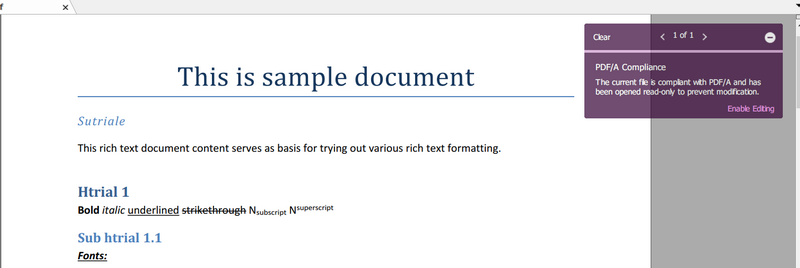

# How to create a PDF/A Compliance document in C# and VB.Net - Step by Step
## License
- MS-LPL
## Technologies
- C#
- ASP.NET
- .NET
- Windows Forms
- WPF
- .NET Framework
- VB.Net
- Visual C#
## Topics
- Controls
- Graphics
- C#
- ASP.NET
- User Interface
- WPF
- Drawing
- How to
- PDF
- Portable Document Format (pdf)
- Export to Pdf
- HTML to PDF
- PDF API
- C# PDF
- Html To Pdf Conversion
- ASP.NET Core
## Updated
- 02/18/2018
## Description

<h1>Introduction</h1>

&nbsp;PDF/A is an ISO-standardized version of the Portable Document Format (PDF) specialized for use in the archiving and long-term preservation of electronic documents.&nbsp; 
&nbsp;PDF/A differs from PDF by prohibiting features ill-suited to long-term archiving, such as font linking (as opposed to font embedding) and encryption. The ISO requirements for PDF/A file viewers include color management
 guidelines, support for embedded fonts, and a user interface for reading embedded annotations.

&nbsp;&nbsp;Let's create a simple PDF document from a DOCX file. By the way, this code shows - how to load an existing document and save it as a PDF/A compliant version.

&nbsp;

C#

Edit|Remove

csharp

<pre class="js">PdfSaveOptions&nbsp;options&nbsp;=&nbsp;new&nbsp;PdfSaveOptions()&nbsp;
{&nbsp;
&nbsp;&nbsp;&nbsp;&nbsp;//&nbsp;PdfComliance&nbsp;supports:&nbsp;PDF/A,&nbsp;PDF/1.5,&nbsp;etc.&nbsp;
&nbsp;&nbsp;&nbsp;&nbsp;Compliance&nbsp;=&nbsp;PdfCompliance.PDF_A&nbsp;
};</pre>

&nbsp;If you need to load an existing document (*.docx, *.rtf, *.pdf, *.html, *.txt, etc) and save it as a PDF/A compliant version, you need to point a path for this file:

C#

Edit|Remove

csharp

<pre class="js">//&nbsp;Path&nbsp;to&nbsp;a&nbsp;loadable&nbsp;document.&nbsp;
string&nbsp;loadPath&nbsp;=&nbsp;@&quot;..\..\..\..\..\..\Testing&nbsp;Files\example.pdf&quot;;&nbsp;
//string&nbsp;loadPath&nbsp;=&nbsp;@&quot;..\..\..\..\..\..\Testing&nbsp;Files\example.html&quot;;&nbsp;
//string&nbsp;loadPath&nbsp;=&nbsp;@&quot;..\..\..\..\..\..\Testing&nbsp;Files\example.rtf&quot;;</pre>

&nbsp;

&nbsp;

C#

Edit|Remove

csharp

<pre class="csharp">using&nbsp;System;&nbsp;
using&nbsp;<a class="libraryLink" href="https://msdn.microsoft.com/en-US/library/System.IO.aspx" target="_blank" title="Auto generated link to System.IO">System.IO</a>;&nbsp;
using&nbsp;SautinSoft.Document;&nbsp;
&nbsp;
namespace&nbsp;Sample&nbsp;
{&nbsp;
&nbsp;&nbsp;&nbsp;&nbsp;class&nbsp;Sample&nbsp;
&nbsp;&nbsp;&nbsp;&nbsp;{&nbsp;
&nbsp;&nbsp;&nbsp;&nbsp;&nbsp;&nbsp;&nbsp;&nbsp;static&nbsp;void&nbsp;Main(string[]&nbsp;args)&nbsp;
&nbsp;&nbsp;&nbsp;&nbsp;&nbsp;&nbsp;&nbsp;&nbsp;{&nbsp;
&nbsp;&nbsp;&nbsp;&nbsp;&nbsp;&nbsp;&nbsp;&nbsp;&nbsp;&nbsp;&nbsp;&nbsp;LoadAndSaveAsPDFA();&nbsp;
&nbsp;&nbsp;&nbsp;&nbsp;&nbsp;&nbsp;&nbsp;&nbsp;}&nbsp;
&nbsp;&nbsp;&nbsp;&nbsp;&nbsp;&nbsp;&nbsp;&nbsp;///&nbsp;
&nbsp;&nbsp;&nbsp;&nbsp;&nbsp;&nbsp;&nbsp;&nbsp;///&nbsp;Load&nbsp;an&nbsp;existing&nbsp;document&nbsp;(*.docx,&nbsp;*.rtf,&nbsp;*.pdf,&nbsp;*.html,&nbsp;*.txt,&nbsp;*.pdf)&nbsp;and&nbsp;save&nbsp;it&nbsp;as&nbsp;a&nbsp;PDF/A&nbsp;compliant&nbsp;version.&nbsp;
&nbsp;&nbsp;&nbsp;&nbsp;&nbsp;&nbsp;&nbsp;&nbsp;///&nbsp;
&nbsp;&nbsp;&nbsp;&nbsp;&nbsp;&nbsp;&nbsp;&nbsp;public&nbsp;static&nbsp;void&nbsp;LoadAndSaveAsPDFA()&nbsp;
&nbsp;&nbsp;&nbsp;&nbsp;&nbsp;&nbsp;&nbsp;&nbsp;{&nbsp;
&nbsp;&nbsp;&nbsp;&nbsp;&nbsp;&nbsp;&nbsp;&nbsp;&nbsp;&nbsp;&nbsp;&nbsp;//&nbsp;Path&nbsp;to&nbsp;a&nbsp;loadable&nbsp;document.&nbsp;
&nbsp;&nbsp;&nbsp;&nbsp;&nbsp;&nbsp;&nbsp;&nbsp;&nbsp;&nbsp;&nbsp;&nbsp;string&nbsp;loadPath&nbsp;=&nbsp;@&quot;..\..\..\..\..\..\Testing&nbsp;Files\example.docx&quot;;&nbsp;
&nbsp;
&nbsp;&nbsp;&nbsp;&nbsp;&nbsp;&nbsp;&nbsp;&nbsp;&nbsp;&nbsp;&nbsp;&nbsp;//DocumentCore.Serial&nbsp;=&nbsp;&quot;put&nbsp;your&nbsp;serial&nbsp;here&quot;;&nbsp;
&nbsp;&nbsp;&nbsp;&nbsp;&nbsp;&nbsp;&nbsp;&nbsp;&nbsp;&nbsp;&nbsp;&nbsp;DocumentCore&nbsp;document&nbsp;=&nbsp;DocumentCore.Load(loadPath);&nbsp;
&nbsp;
&nbsp;&nbsp;&nbsp;&nbsp;&nbsp;&nbsp;&nbsp;&nbsp;&nbsp;&nbsp;&nbsp;&nbsp;PdfSaveOptions&nbsp;options&nbsp;=&nbsp;new&nbsp;PdfSaveOptions()&nbsp;
&nbsp;&nbsp;&nbsp;&nbsp;&nbsp;&nbsp;&nbsp;&nbsp;&nbsp;&nbsp;&nbsp;&nbsp;{&nbsp;
&nbsp;&nbsp;&nbsp;&nbsp;&nbsp;&nbsp;&nbsp;&nbsp;&nbsp;&nbsp;&nbsp;&nbsp;&nbsp;&nbsp;&nbsp;&nbsp;//&nbsp;PdfComliance&nbsp;supports:&nbsp;PDF/A,&nbsp;PDF/1.5,&nbsp;etc.&nbsp;
&nbsp;&nbsp;&nbsp;&nbsp;&nbsp;&nbsp;&nbsp;&nbsp;&nbsp;&nbsp;&nbsp;&nbsp;&nbsp;&nbsp;&nbsp;&nbsp;Compliance&nbsp;=&nbsp;PdfCompliance.PDF_A&nbsp;
&nbsp;&nbsp;&nbsp;&nbsp;&nbsp;&nbsp;&nbsp;&nbsp;&nbsp;&nbsp;&nbsp;&nbsp;};&nbsp;
&nbsp;
&nbsp;&nbsp;&nbsp;&nbsp;&nbsp;&nbsp;&nbsp;&nbsp;&nbsp;&nbsp;&nbsp;&nbsp;string&nbsp;savePath&nbsp;=&nbsp;Path.ChangeExtension(loadPath,&nbsp;&quot;.pdf&quot;);&nbsp;
&nbsp;&nbsp;&nbsp;&nbsp;&nbsp;&nbsp;&nbsp;&nbsp;&nbsp;&nbsp;&nbsp;&nbsp;document.Save(savePath,&nbsp;options);&nbsp;
&nbsp;
&nbsp;&nbsp;&nbsp;&nbsp;&nbsp;&nbsp;&nbsp;&nbsp;&nbsp;&nbsp;&nbsp;&nbsp;//&nbsp;Open&nbsp;file&nbsp;-&nbsp;example.pdf.&nbsp;
&nbsp;&nbsp;&nbsp;&nbsp;&nbsp;&nbsp;&nbsp;&nbsp;&nbsp;&nbsp;&nbsp;&nbsp;<a class="libraryLink" href="https://msdn.microsoft.com/en-US/library/System.Diagnostics.Process.Start.aspx" target="_blank" title="Auto generated link to System.Diagnostics.Process.Start">System.Diagnostics.Process.Start</a>(savePath);&nbsp;
&nbsp;&nbsp;&nbsp;&nbsp;&nbsp;&nbsp;&nbsp;&nbsp;}&nbsp;
&nbsp;
&nbsp;&nbsp;&nbsp;&nbsp;}&nbsp;
}</pre>

<h1>Source Code Files</h1>

<em>Related Links:</em>

<em>Install from Nuget: PM&gt; Install-Package sautinsoft.document.</em>

<em>&nbsp; 
Website:&nbsp;<a href="http://www.sautinsoft.com/">www.sautinsoft.com</a> 
Product Home:&nbsp;<a href="http://sautinsoft.com/products/document/index.php">Document.Net</a> 
Download:&nbsp;<em><a href="http://sautinsoft.com/products/docx-document/download.php">Document.Net</a></em></em>

&nbsp;

<h2 class="H2Text">Requrements and Technical Information</h2>

&nbsp;Requires only .Net 4.0 or above. Our product is compatible with all .Net languages and supports all Operating Systems where .Net Framework can be used. 
 
Note that &laquo;Document .Net&raquo; is entirely written in managed C#, which makes it absolutely standalone and an independent library. Of course, No dependency on Microsoft Word.

