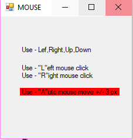

# How to programmatically synthesizes mouse motion and button clicks...
## Requires
- Visual Studio 2013
## License
- MIT
## Technologies
- C#
- Synthesizes Mouse Motion
- Win Form
## Topics
- C#
- Win Form
- API user32.dll
## Updated
- 05/29/2019
## Description

<h1>Introduction</h1>

Added logic - if use key &quot;A&quot; programm will move mouse &#43;/- 3px each 5 minutes.

It prevent computer go to sleep (simulate activities).&nbsp;

This small Window Form application which explains how to programmatically synthesizes mouse motion and button clicks.

It uses the <strong>mouse_event</strong> from user32.dll

If you need to Win32 API, and application (for example) will hold WCF service - choose Win Form application ...

&nbsp;

Please see below three useful links:

<a href="http://www.pinvoke.net/default.aspx/user32.mouse_event">http://www.pinvoke.net/default.aspx/user32.mouse_event</a>

<a href="https://msdn.microsoft.com/en-us/library/windows/desktop/ms646260(v=vs.85).aspx">https://msdn.microsoft.com/en-us/library/windows/desktop/ms646260(v=vs.85).aspx</a>

&nbsp;

Use arrow &quot;Left&quot;, &quot;Right&quot;, &quot;Up&quot;, &quot;Down&quot; for move Mouse Cursor, Use &quot;L&quot; for simulate Left Press, &quot;R&quot; for simulate &quot;R&quot; press... If you press &quot;L&quot; or &quot;R&quot; application lost focus... you will need focus again ...

&nbsp;

For simulate press, button use this approach&nbsp;

&nbsp; &nbsp; &nbsp; &nbsp; &nbsp; &nbsp; &nbsp; &nbsp; mouse_event(MOUSEEVENTF_LEFTDOWN, 0u, 0u, 0u, (UIntPtr)0);&nbsp;

&nbsp; &nbsp; &nbsp; &nbsp; &nbsp; &nbsp; &nbsp; &nbsp; Thread.Sleep(100);&nbsp; &nbsp; &nbsp; &nbsp; &nbsp; &nbsp; &nbsp; &nbsp;

&nbsp; &nbsp; &nbsp; &nbsp; &nbsp; &nbsp; &nbsp; &nbsp; mouse_event(MOUSEEVENTF_LEFTUP, 0u, 0u, 0u, (UIntPtr)0);

&nbsp;

If you use &nbsp;mouse_event(<strong>MOUSEEVENTF_LEFTDOWN | MOUSEEVENTF_LEFTUP</strong>&nbsp;, 0u, 0u, 0u, (UIntPtr)0);
<strong>some application will not be working correctly</strong> - example Media Player ...

&nbsp;

For simulate Left Press and Move Use combination ...&nbsp;

mouse_event(MOUSEEVENTF_MOVE &#43; MOUSEEVENTF_LEFTDOWN &#43; ...

when moving will be doen execute below ... &nbsp; &nbsp; &nbsp; &nbsp; &nbsp; &nbsp; &nbsp;&nbsp;

mouse_event(MOUSEEVENTF_LEFTUP, 0u, 0u, 0u, (UIntPtr)0);

Thanks...

&nbsp;

&nbsp;

C#

Edit|Remove

csharp
<pre class="hidden">using System;
using System.Collections.Generic;
using System.Data;
using System.Drawing;
using System.Linq;
using System.Text;
using System.Threading.Tasks;
using System.Windows.Forms;
using System.Runtime.InteropServices;
using System.Threading;

namespace WindowsFormsMouse
{
    public partial class formMouse : Form
    {
        public formMouse()
        {
            InitializeComponent();
        }

        [DllImport(&quot;user32.dll&quot;, CharSet = CharSet.Auto, CallingConvention = CallingConvention.StdCall)]
        public static extern void mouse_event(uint dwFlags, uint dx, uint dy, uint dwData, UIntPtr dwExtraInfo);

        const uint MOUSEEVENTF_ABSOLUTE = 0x8000;
        const uint MOUSEEVENTF_LEFTDOWN = 0x0002;
        const uint MOUSEEVENTF_LEFTUP = 0x0004;
        const uint MOUSEEVENTF_MIDDLEDOWN = 0x0020;
        const uint MOUSEEVENTF_MIDDLEUP = 0x0040;
        const uint MOUSEEVENTF_MOVE = 0x0001;
        const uint MOUSEEVENTF_RIGHTDOWN = 0x0008;
        const uint MOUSEEVENTF_RIGHTUP = 0x0010;
        const uint MOUSEEVENTF_XDOWN = 0x0080;
        const uint MOUSEEVENTF_XUP = 0x0100;
        const uint MOUSEEVENTF_WHEEL = 0x0800;
        const uint MOUSEEVENTF_HWHEEL = 0x01000;

        //http://www.pinvoke.net/default.aspx/user32.mouse_event
        //https://msdn.microsoft.com/en-us/library/windows/desktop/ms646260(v=vs.85).aspx

        private void MoveCursor(string Direction)
        {
            // Set the Current cursor, move the cursor's Position,
 
            // mouse_event moves in a coordinate system where
            // (0, 0) is in the upper left corner and
            // (65535,65535) is in the lower right corner.

            // Get the current mouse coordinates and convert
            // them into this new system.
            
            int X = 0; // Cursor.Position.X;
            int Y = 0; // Cursor.Position.Y;
           
            uint action = 0;

            if (Direction == &quot;Up&quot;)      { action =  MOUSEEVENTF_MOVE ; Y = -3;  X = 0; }
            else if (Direction == &quot;Down&quot;) { action =  MOUSEEVENTF_MOVE ; Y =  3;  X = 0; }
            else if (Direction == &quot;Left&quot;) { action =  MOUSEEVENTF_MOVE ; Y = 0 ;  X = -3; }
            else if (Direction == &quot;Right&quot;) { action =  MOUSEEVENTF_MOVE ; Y = 0 ;  X =  3; }

            else if (Direction == &quot;L&quot;) 
            {
                mouse_event(MOUSEEVENTF_LEFTDOWN, 0u, 0u, 0u, (UIntPtr)0);
                Thread.Sleep(100);
                mouse_event(MOUSEEVENTF_LEFTUP, 0u, 0u, 0u, (UIntPtr)0);
                return;
            }
            else if (Direction == &quot;R&quot;)
            {
                mouse_event(MOUSEEVENTF_RIGHTDOWN, 0u, 0u, 0u, (UIntPtr)0);
                Thread.Sleep(100);
                mouse_event(MOUSEEVENTF_RIGHTUP, 0u, 0u, 0u, (UIntPtr)0);
                return;
            }
           
            else return;

            // mouse_event(MOUSEEVENTF_ABSOLUTE &#43; MOUSEEVENTF_MOVE &#43; MOUSEEVENTF_LEFTDOWN &#43; MOUSEEVENTF_LEFTUP .... 
            mouse_event(action, (uint)X, (uint)Y, (uint)0, (UIntPtr)0);

        }

        // Below just for example : how to manage &quot;Mouse' by Key  ...
        
        private void formMouse_KeyDown(object sender, KeyEventArgs e)
        {
            switch (e.KeyCode)
            {
                case Keys.Down:
                    MoveCursor(&quot;Down&quot;);
                    break;
                case Keys.Up:
                    MoveCursor(&quot;Up&quot;);
                    break;
                case Keys.Left:
                    MoveCursor(&quot;Left&quot;);
                    break;
                case Keys.Right:
                    MoveCursor(&quot;Right&quot;);
                    break;
                case Keys.L:
                    MoveCursor(&quot;L&quot;);
                    break;
                case Keys.R:
                    MoveCursor(&quot;R&quot;);
                    break;
            }
        }

    }
}
</pre>

<pre class="csharp">using&nbsp;System;&nbsp;
using&nbsp;System.Collections.Generic;&nbsp;
using&nbsp;System.Data;&nbsp;
using&nbsp;System.Drawing;&nbsp;
using&nbsp;System.Linq;&nbsp;
using&nbsp;System.Text;&nbsp;
using&nbsp;System.Threading.Tasks;&nbsp;
using&nbsp;System.Windows.Forms;&nbsp;
using&nbsp;System.Runtime.InteropServices;&nbsp;
using&nbsp;System.Threading;&nbsp;
&nbsp;
namespace&nbsp;WindowsFormsMouse&nbsp;
{&nbsp;
&nbsp;&nbsp;&nbsp;&nbsp;public&nbsp;partial&nbsp;class&nbsp;formMouse&nbsp;:&nbsp;Form&nbsp;
&nbsp;&nbsp;&nbsp;&nbsp;{&nbsp;
&nbsp;&nbsp;&nbsp;&nbsp;&nbsp;&nbsp;&nbsp;&nbsp;public&nbsp;formMouse()&nbsp;
&nbsp;&nbsp;&nbsp;&nbsp;&nbsp;&nbsp;&nbsp;&nbsp;{&nbsp;
&nbsp;&nbsp;&nbsp;&nbsp;&nbsp;&nbsp;&nbsp;&nbsp;&nbsp;&nbsp;&nbsp;&nbsp;InitializeComponent();&nbsp;
&nbsp;&nbsp;&nbsp;&nbsp;&nbsp;&nbsp;&nbsp;&nbsp;}&nbsp;
&nbsp;
&nbsp;
&nbsp;&nbsp;&nbsp;&nbsp;&nbsp;&nbsp;&nbsp;&nbsp;[DllImport(&quot;user32.dll&quot;,&nbsp;CharSet&nbsp;=&nbsp;CharSet.Auto,&nbsp;CallingConvention&nbsp;=&nbsp;CallingConvention.StdCall)]&nbsp;
&nbsp;&nbsp;&nbsp;&nbsp;&nbsp;&nbsp;&nbsp;&nbsp;public&nbsp;static&nbsp;extern&nbsp;void&nbsp;mouse_event(uint&nbsp;dwFlags,&nbsp;uint&nbsp;dx,&nbsp;uint&nbsp;dy,&nbsp;uint&nbsp;dwData,&nbsp;UIntPtr&nbsp;dwExtraInfo);&nbsp;
&nbsp;
&nbsp;&nbsp;&nbsp;&nbsp;&nbsp;&nbsp;&nbsp;&nbsp;const&nbsp;uint&nbsp;MOUSEEVENTF_ABSOLUTE&nbsp;=&nbsp;0x8000;&nbsp;
&nbsp;&nbsp;&nbsp;&nbsp;&nbsp;&nbsp;&nbsp;&nbsp;const&nbsp;uint&nbsp;MOUSEEVENTF_LEFTDOWN&nbsp;=&nbsp;0x0002;&nbsp;
&nbsp;&nbsp;&nbsp;&nbsp;&nbsp;&nbsp;&nbsp;&nbsp;const&nbsp;uint&nbsp;MOUSEEVENTF_LEFTUP&nbsp;=&nbsp;0x0004;&nbsp;
&nbsp;&nbsp;&nbsp;&nbsp;&nbsp;&nbsp;&nbsp;&nbsp;const&nbsp;uint&nbsp;MOUSEEVENTF_MIDDLEDOWN&nbsp;=&nbsp;0x0020;&nbsp;
&nbsp;&nbsp;&nbsp;&nbsp;&nbsp;&nbsp;&nbsp;&nbsp;const&nbsp;uint&nbsp;MOUSEEVENTF_MIDDLEUP&nbsp;=&nbsp;0x0040;&nbsp;
&nbsp;&nbsp;&nbsp;&nbsp;&nbsp;&nbsp;&nbsp;&nbsp;const&nbsp;uint&nbsp;MOUSEEVENTF_MOVE&nbsp;=&nbsp;0x0001;&nbsp;
&nbsp;&nbsp;&nbsp;&nbsp;&nbsp;&nbsp;&nbsp;&nbsp;const&nbsp;uint&nbsp;MOUSEEVENTF_RIGHTDOWN&nbsp;=&nbsp;0x0008;&nbsp;
&nbsp;&nbsp;&nbsp;&nbsp;&nbsp;&nbsp;&nbsp;&nbsp;const&nbsp;uint&nbsp;MOUSEEVENTF_RIGHTUP&nbsp;=&nbsp;0x0010;&nbsp;
&nbsp;&nbsp;&nbsp;&nbsp;&nbsp;&nbsp;&nbsp;&nbsp;const&nbsp;uint&nbsp;MOUSEEVENTF_XDOWN&nbsp;=&nbsp;0x0080;&nbsp;
&nbsp;&nbsp;&nbsp;&nbsp;&nbsp;&nbsp;&nbsp;&nbsp;const&nbsp;uint&nbsp;MOUSEEVENTF_XUP&nbsp;=&nbsp;0x0100;&nbsp;
&nbsp;&nbsp;&nbsp;&nbsp;&nbsp;&nbsp;&nbsp;&nbsp;const&nbsp;uint&nbsp;MOUSEEVENTF_WHEEL&nbsp;=&nbsp;0x0800;&nbsp;
&nbsp;&nbsp;&nbsp;&nbsp;&nbsp;&nbsp;&nbsp;&nbsp;const&nbsp;uint&nbsp;MOUSEEVENTF_HWHEEL&nbsp;=&nbsp;0x01000;&nbsp;
&nbsp;
&nbsp;&nbsp;&nbsp;&nbsp;&nbsp;&nbsp;&nbsp;&nbsp;//http://www.pinvoke.net/default.aspx/user32.mouse_event&nbsp;
&nbsp;&nbsp;&nbsp;&nbsp;&nbsp;&nbsp;&nbsp;&nbsp;//https://msdn.microsoft.com/en-us/library/windows/desktop/ms646260(v=vs.85).aspx&nbsp;
&nbsp;
&nbsp;&nbsp;&nbsp;&nbsp;&nbsp;&nbsp;&nbsp;&nbsp;private&nbsp;void&nbsp;MoveCursor(string&nbsp;Direction)&nbsp;
&nbsp;&nbsp;&nbsp;&nbsp;&nbsp;&nbsp;&nbsp;&nbsp;{&nbsp;
&nbsp;&nbsp;&nbsp;&nbsp;&nbsp;&nbsp;&nbsp;&nbsp;&nbsp;&nbsp;&nbsp;&nbsp;//&nbsp;Set&nbsp;the&nbsp;Current&nbsp;cursor,&nbsp;move&nbsp;the&nbsp;cursor's&nbsp;Position,&nbsp;
&nbsp;&nbsp;
&nbsp;&nbsp;&nbsp;&nbsp;&nbsp;&nbsp;&nbsp;&nbsp;&nbsp;&nbsp;&nbsp;&nbsp;//&nbsp;mouse_event&nbsp;moves&nbsp;in&nbsp;a&nbsp;coordinate&nbsp;system&nbsp;where&nbsp;
&nbsp;&nbsp;&nbsp;&nbsp;&nbsp;&nbsp;&nbsp;&nbsp;&nbsp;&nbsp;&nbsp;&nbsp;//&nbsp;(0,&nbsp;0)&nbsp;is&nbsp;in&nbsp;the&nbsp;upper&nbsp;left&nbsp;corner&nbsp;and&nbsp;
&nbsp;&nbsp;&nbsp;&nbsp;&nbsp;&nbsp;&nbsp;&nbsp;&nbsp;&nbsp;&nbsp;&nbsp;//&nbsp;(65535,65535)&nbsp;is&nbsp;in&nbsp;the&nbsp;lower&nbsp;right&nbsp;corner.&nbsp;
&nbsp;
&nbsp;&nbsp;&nbsp;&nbsp;&nbsp;&nbsp;&nbsp;&nbsp;&nbsp;&nbsp;&nbsp;&nbsp;//&nbsp;Get&nbsp;the&nbsp;current&nbsp;mouse&nbsp;coordinates&nbsp;and&nbsp;convert&nbsp;
&nbsp;&nbsp;&nbsp;&nbsp;&nbsp;&nbsp;&nbsp;&nbsp;&nbsp;&nbsp;&nbsp;&nbsp;//&nbsp;them&nbsp;into&nbsp;this&nbsp;new&nbsp;system.&nbsp;
&nbsp;&nbsp;&nbsp;&nbsp;&nbsp;&nbsp;&nbsp;&nbsp;&nbsp;&nbsp;&nbsp;&nbsp;&nbsp;
&nbsp;&nbsp;&nbsp;&nbsp;&nbsp;&nbsp;&nbsp;&nbsp;&nbsp;&nbsp;&nbsp;&nbsp;int&nbsp;X&nbsp;=&nbsp;0;&nbsp;//&nbsp;Cursor.Position.X;&nbsp;
&nbsp;&nbsp;&nbsp;&nbsp;&nbsp;&nbsp;&nbsp;&nbsp;&nbsp;&nbsp;&nbsp;&nbsp;int&nbsp;Y&nbsp;=&nbsp;0;&nbsp;//&nbsp;Cursor.Position.Y;&nbsp;
&nbsp;&nbsp;&nbsp;&nbsp;&nbsp;&nbsp;&nbsp;&nbsp;&nbsp;&nbsp;&nbsp;&nbsp;
&nbsp;&nbsp;&nbsp;&nbsp;&nbsp;&nbsp;&nbsp;&nbsp;&nbsp;&nbsp;&nbsp;&nbsp;uint&nbsp;action&nbsp;=&nbsp;0;&nbsp;
&nbsp;
&nbsp;&nbsp;&nbsp;&nbsp;&nbsp;&nbsp;&nbsp;&nbsp;&nbsp;&nbsp;&nbsp;&nbsp;if&nbsp;(Direction&nbsp;==&nbsp;&quot;Up&quot;)&nbsp;&nbsp;&nbsp;&nbsp;&nbsp;&nbsp;{&nbsp;action&nbsp;=&nbsp;&nbsp;MOUSEEVENTF_MOVE&nbsp;;&nbsp;Y&nbsp;=&nbsp;-3;&nbsp;&nbsp;X&nbsp;=&nbsp;0;&nbsp;}&nbsp;
&nbsp;&nbsp;&nbsp;&nbsp;&nbsp;&nbsp;&nbsp;&nbsp;&nbsp;&nbsp;&nbsp;&nbsp;else&nbsp;if&nbsp;(Direction&nbsp;==&nbsp;&quot;Down&quot;)&nbsp;{&nbsp;action&nbsp;=&nbsp;&nbsp;MOUSEEVENTF_MOVE&nbsp;;&nbsp;Y&nbsp;=&nbsp;&nbsp;3;&nbsp;&nbsp;X&nbsp;=&nbsp;0;&nbsp;}&nbsp;
&nbsp;&nbsp;&nbsp;&nbsp;&nbsp;&nbsp;&nbsp;&nbsp;&nbsp;&nbsp;&nbsp;&nbsp;else&nbsp;if&nbsp;(Direction&nbsp;==&nbsp;&quot;Left&quot;)&nbsp;{&nbsp;action&nbsp;=&nbsp;&nbsp;MOUSEEVENTF_MOVE&nbsp;;&nbsp;Y&nbsp;=&nbsp;0&nbsp;;&nbsp;&nbsp;X&nbsp;=&nbsp;-3;&nbsp;}&nbsp;
&nbsp;&nbsp;&nbsp;&nbsp;&nbsp;&nbsp;&nbsp;&nbsp;&nbsp;&nbsp;&nbsp;&nbsp;else&nbsp;if&nbsp;(Direction&nbsp;==&nbsp;&quot;Right&quot;)&nbsp;{&nbsp;action&nbsp;=&nbsp;&nbsp;MOUSEEVENTF_MOVE&nbsp;;&nbsp;Y&nbsp;=&nbsp;0&nbsp;;&nbsp;&nbsp;X&nbsp;=&nbsp;&nbsp;3;&nbsp;}&nbsp;
&nbsp;
&nbsp;&nbsp;&nbsp;&nbsp;&nbsp;&nbsp;&nbsp;&nbsp;&nbsp;&nbsp;&nbsp;&nbsp;else&nbsp;if&nbsp;(Direction&nbsp;==&nbsp;&quot;L&quot;)&nbsp;&nbsp;
&nbsp;&nbsp;&nbsp;&nbsp;&nbsp;&nbsp;&nbsp;&nbsp;&nbsp;&nbsp;&nbsp;&nbsp;{&nbsp;
&nbsp;&nbsp;&nbsp;&nbsp;&nbsp;&nbsp;&nbsp;&nbsp;&nbsp;&nbsp;&nbsp;&nbsp;&nbsp;&nbsp;&nbsp;&nbsp;mouse_event(MOUSEEVENTF_LEFTDOWN,&nbsp;0u,&nbsp;0u,&nbsp;0u,&nbsp;(UIntPtr)0);&nbsp;
&nbsp;&nbsp;&nbsp;&nbsp;&nbsp;&nbsp;&nbsp;&nbsp;&nbsp;&nbsp;&nbsp;&nbsp;&nbsp;&nbsp;&nbsp;&nbsp;Thread.Sleep(100);&nbsp;
&nbsp;&nbsp;&nbsp;&nbsp;&nbsp;&nbsp;&nbsp;&nbsp;&nbsp;&nbsp;&nbsp;&nbsp;&nbsp;&nbsp;&nbsp;&nbsp;mouse_event(MOUSEEVENTF_LEFTUP,&nbsp;0u,&nbsp;0u,&nbsp;0u,&nbsp;(UIntPtr)0);&nbsp;
&nbsp;&nbsp;&nbsp;&nbsp;&nbsp;&nbsp;&nbsp;&nbsp;&nbsp;&nbsp;&nbsp;&nbsp;&nbsp;&nbsp;&nbsp;&nbsp;return;&nbsp;
&nbsp;&nbsp;&nbsp;&nbsp;&nbsp;&nbsp;&nbsp;&nbsp;&nbsp;&nbsp;&nbsp;&nbsp;}&nbsp;
&nbsp;&nbsp;&nbsp;&nbsp;&nbsp;&nbsp;&nbsp;&nbsp;&nbsp;&nbsp;&nbsp;&nbsp;else&nbsp;if&nbsp;(Direction&nbsp;==&nbsp;&quot;R&quot;)&nbsp;
&nbsp;&nbsp;&nbsp;&nbsp;&nbsp;&nbsp;&nbsp;&nbsp;&nbsp;&nbsp;&nbsp;&nbsp;{&nbsp;
&nbsp;&nbsp;&nbsp;&nbsp;&nbsp;&nbsp;&nbsp;&nbsp;&nbsp;&nbsp;&nbsp;&nbsp;&nbsp;&nbsp;&nbsp;&nbsp;mouse_event(MOUSEEVENTF_RIGHTDOWN,&nbsp;0u,&nbsp;0u,&nbsp;0u,&nbsp;(UIntPtr)0);&nbsp;
&nbsp;&nbsp;&nbsp;&nbsp;&nbsp;&nbsp;&nbsp;&nbsp;&nbsp;&nbsp;&nbsp;&nbsp;&nbsp;&nbsp;&nbsp;&nbsp;Thread.Sleep(100);&nbsp;
&nbsp;&nbsp;&nbsp;&nbsp;&nbsp;&nbsp;&nbsp;&nbsp;&nbsp;&nbsp;&nbsp;&nbsp;&nbsp;&nbsp;&nbsp;&nbsp;mouse_event(MOUSEEVENTF_RIGHTUP,&nbsp;0u,&nbsp;0u,&nbsp;0u,&nbsp;(UIntPtr)0);&nbsp;
&nbsp;&nbsp;&nbsp;&nbsp;&nbsp;&nbsp;&nbsp;&nbsp;&nbsp;&nbsp;&nbsp;&nbsp;&nbsp;&nbsp;&nbsp;&nbsp;return;&nbsp;
&nbsp;&nbsp;&nbsp;&nbsp;&nbsp;&nbsp;&nbsp;&nbsp;&nbsp;&nbsp;&nbsp;&nbsp;}&nbsp;
&nbsp;&nbsp;&nbsp;&nbsp;&nbsp;&nbsp;&nbsp;&nbsp;&nbsp;&nbsp;&nbsp;&nbsp;
&nbsp;&nbsp;&nbsp;&nbsp;&nbsp;&nbsp;&nbsp;&nbsp;&nbsp;&nbsp;&nbsp;&nbsp;else&nbsp;return;&nbsp;
&nbsp;
&nbsp;&nbsp;&nbsp;&nbsp;&nbsp;&nbsp;&nbsp;&nbsp;&nbsp;&nbsp;&nbsp;&nbsp;//&nbsp;mouse_event(MOUSEEVENTF_ABSOLUTE&nbsp;&#43;&nbsp;MOUSEEVENTF_MOVE&nbsp;&#43;&nbsp;MOUSEEVENTF_LEFTDOWN&nbsp;&#43;&nbsp;MOUSEEVENTF_LEFTUP&nbsp;....&nbsp;&nbsp;
&nbsp;&nbsp;&nbsp;&nbsp;&nbsp;&nbsp;&nbsp;&nbsp;&nbsp;&nbsp;&nbsp;&nbsp;mouse_event(action,&nbsp;(uint)X,&nbsp;(uint)Y,&nbsp;(uint)0,&nbsp;(UIntPtr)0);&nbsp;
&nbsp;
&nbsp;&nbsp;&nbsp;&nbsp;&nbsp;&nbsp;&nbsp;&nbsp;}&nbsp;
&nbsp;
&nbsp;&nbsp;&nbsp;&nbsp;&nbsp;&nbsp;&nbsp;&nbsp;//&nbsp;Below&nbsp;just&nbsp;for&nbsp;example&nbsp;:&nbsp;how&nbsp;to&nbsp;manage&nbsp;&quot;Mouse'&nbsp;by&nbsp;Key&nbsp;&nbsp;...&nbsp;
&nbsp;&nbsp;&nbsp;&nbsp;&nbsp;&nbsp;&nbsp;&nbsp;&nbsp;
&nbsp;&nbsp;&nbsp;&nbsp;&nbsp;&nbsp;&nbsp;&nbsp;private&nbsp;void&nbsp;formMouse_KeyDown(object&nbsp;sender,&nbsp;KeyEventArgs&nbsp;e)&nbsp;
&nbsp;&nbsp;&nbsp;&nbsp;&nbsp;&nbsp;&nbsp;&nbsp;{&nbsp;
&nbsp;&nbsp;&nbsp;&nbsp;&nbsp;&nbsp;&nbsp;&nbsp;&nbsp;&nbsp;&nbsp;&nbsp;switch&nbsp;(e.KeyCode)&nbsp;
&nbsp;&nbsp;&nbsp;&nbsp;&nbsp;&nbsp;&nbsp;&nbsp;&nbsp;&nbsp;&nbsp;&nbsp;{&nbsp;
&nbsp;&nbsp;&nbsp;&nbsp;&nbsp;&nbsp;&nbsp;&nbsp;&nbsp;&nbsp;&nbsp;&nbsp;&nbsp;&nbsp;&nbsp;&nbsp;case&nbsp;Keys.Down:&nbsp;
&nbsp;&nbsp;&nbsp;&nbsp;&nbsp;&nbsp;&nbsp;&nbsp;&nbsp;&nbsp;&nbsp;&nbsp;&nbsp;&nbsp;&nbsp;&nbsp;&nbsp;&nbsp;&nbsp;&nbsp;MoveCursor(&quot;Down&quot;);&nbsp;
&nbsp;&nbsp;&nbsp;&nbsp;&nbsp;&nbsp;&nbsp;&nbsp;&nbsp;&nbsp;&nbsp;&nbsp;&nbsp;&nbsp;&nbsp;&nbsp;&nbsp;&nbsp;&nbsp;&nbsp;break;&nbsp;
&nbsp;&nbsp;&nbsp;&nbsp;&nbsp;&nbsp;&nbsp;&nbsp;&nbsp;&nbsp;&nbsp;&nbsp;&nbsp;&nbsp;&nbsp;&nbsp;case&nbsp;Keys.Up:&nbsp;
&nbsp;&nbsp;&nbsp;&nbsp;&nbsp;&nbsp;&nbsp;&nbsp;&nbsp;&nbsp;&nbsp;&nbsp;&nbsp;&nbsp;&nbsp;&nbsp;&nbsp;&nbsp;&nbsp;&nbsp;MoveCursor(&quot;Up&quot;);&nbsp;
&nbsp;&nbsp;&nbsp;&nbsp;&nbsp;&nbsp;&nbsp;&nbsp;&nbsp;&nbsp;&nbsp;&nbsp;&nbsp;&nbsp;&nbsp;&nbsp;&nbsp;&nbsp;&nbsp;&nbsp;break;&nbsp;
&nbsp;&nbsp;&nbsp;&nbsp;&nbsp;&nbsp;&nbsp;&nbsp;&nbsp;&nbsp;&nbsp;&nbsp;&nbsp;&nbsp;&nbsp;&nbsp;case&nbsp;Keys.Left:&nbsp;
&nbsp;&nbsp;&nbsp;&nbsp;&nbsp;&nbsp;&nbsp;&nbsp;&nbsp;&nbsp;&nbsp;&nbsp;&nbsp;&nbsp;&nbsp;&nbsp;&nbsp;&nbsp;&nbsp;&nbsp;MoveCursor(&quot;Left&quot;);&nbsp;
&nbsp;&nbsp;&nbsp;&nbsp;&nbsp;&nbsp;&nbsp;&nbsp;&nbsp;&nbsp;&nbsp;&nbsp;&nbsp;&nbsp;&nbsp;&nbsp;&nbsp;&nbsp;&nbsp;&nbsp;break;&nbsp;
&nbsp;&nbsp;&nbsp;&nbsp;&nbsp;&nbsp;&nbsp;&nbsp;&nbsp;&nbsp;&nbsp;&nbsp;&nbsp;&nbsp;&nbsp;&nbsp;case&nbsp;Keys.Right:&nbsp;
&nbsp;&nbsp;&nbsp;&nbsp;&nbsp;&nbsp;&nbsp;&nbsp;&nbsp;&nbsp;&nbsp;&nbsp;&nbsp;&nbsp;&nbsp;&nbsp;&nbsp;&nbsp;&nbsp;&nbsp;MoveCursor(&quot;Right&quot;);&nbsp;
&nbsp;&nbsp;&nbsp;&nbsp;&nbsp;&nbsp;&nbsp;&nbsp;&nbsp;&nbsp;&nbsp;&nbsp;&nbsp;&nbsp;&nbsp;&nbsp;&nbsp;&nbsp;&nbsp;&nbsp;break;&nbsp;
&nbsp;&nbsp;&nbsp;&nbsp;&nbsp;&nbsp;&nbsp;&nbsp;&nbsp;&nbsp;&nbsp;&nbsp;&nbsp;&nbsp;&nbsp;&nbsp;case&nbsp;Keys.L:&nbsp;
&nbsp;&nbsp;&nbsp;&nbsp;&nbsp;&nbsp;&nbsp;&nbsp;&nbsp;&nbsp;&nbsp;&nbsp;&nbsp;&nbsp;&nbsp;&nbsp;&nbsp;&nbsp;&nbsp;&nbsp;MoveCursor(&quot;L&quot;);&nbsp;
&nbsp;&nbsp;&nbsp;&nbsp;&nbsp;&nbsp;&nbsp;&nbsp;&nbsp;&nbsp;&nbsp;&nbsp;&nbsp;&nbsp;&nbsp;&nbsp;&nbsp;&nbsp;&nbsp;&nbsp;break;&nbsp;
&nbsp;&nbsp;&nbsp;&nbsp;&nbsp;&nbsp;&nbsp;&nbsp;&nbsp;&nbsp;&nbsp;&nbsp;&nbsp;&nbsp;&nbsp;&nbsp;case&nbsp;Keys.R:&nbsp;
&nbsp;&nbsp;&nbsp;&nbsp;&nbsp;&nbsp;&nbsp;&nbsp;&nbsp;&nbsp;&nbsp;&nbsp;&nbsp;&nbsp;&nbsp;&nbsp;&nbsp;&nbsp;&nbsp;&nbsp;MoveCursor(&quot;R&quot;);&nbsp;
&nbsp;&nbsp;&nbsp;&nbsp;&nbsp;&nbsp;&nbsp;&nbsp;&nbsp;&nbsp;&nbsp;&nbsp;&nbsp;&nbsp;&nbsp;&nbsp;&nbsp;&nbsp;&nbsp;&nbsp;break;&nbsp;
&nbsp;&nbsp;&nbsp;&nbsp;&nbsp;&nbsp;&nbsp;&nbsp;&nbsp;&nbsp;&nbsp;&nbsp;}&nbsp;
&nbsp;&nbsp;&nbsp;&nbsp;&nbsp;&nbsp;&nbsp;&nbsp;}&nbsp;
&nbsp;
&nbsp;
&nbsp;&nbsp;&nbsp;&nbsp;}&nbsp;
}&nbsp;
</pre>

