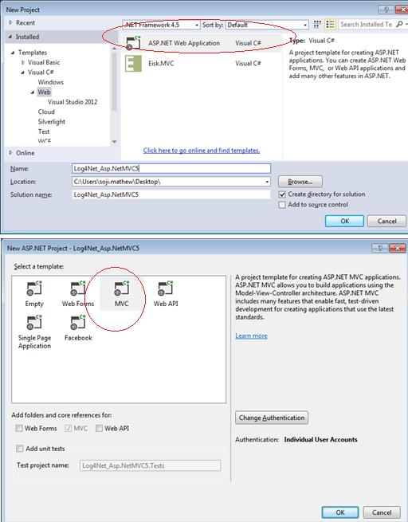
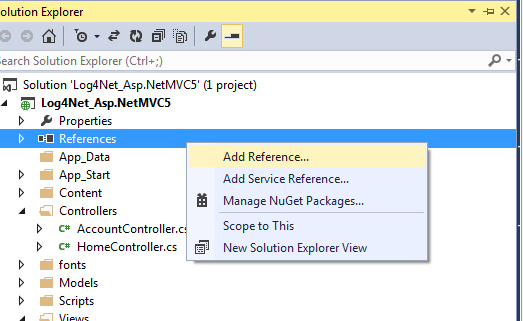
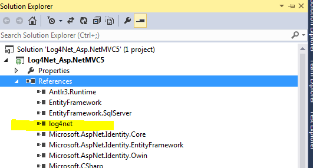
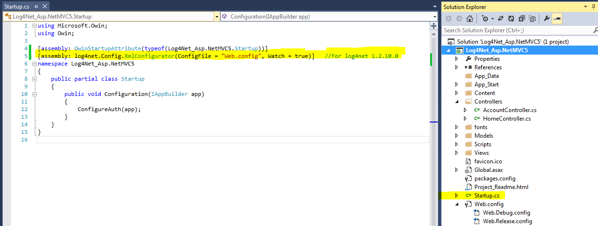
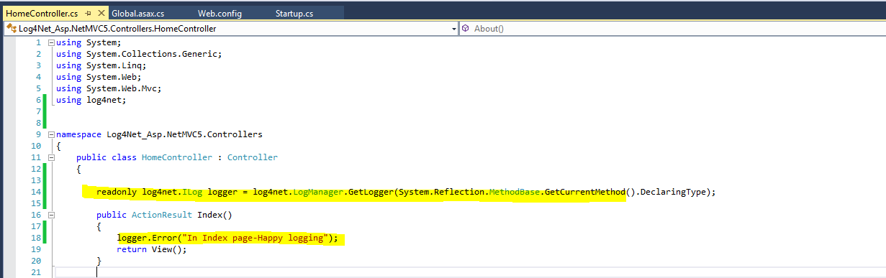

# How to use Apache log4net library with ASP.NET MVC 5 for logging.
## Requires
- 
## License
- Apache License, Version 2.0
## Technologies
- C#
- ASP.NET
- .NET Framework
- Logging
- .NET Framework 4.0
- ASP.NET MVC 5
- Log4net
- Visual Studio Express 2013
- Apache log4net library
## Topics
- C#
- ASP.NET
- Logging
- file logging
## Updated
- 10/09/2014
## Description

Introduction

Logging is a method of tracking/monitoring what is going on when an application is in progress/running. Log records will be most needed items when something goes wrong in your application, be it windows forms, mobile or web applications.

Here I will be walking through the basic steps in implementing logging functionality using Apache log4net framework in an ASP.Net MVC 5 application.

I am using Visual Studio Express 2013 for Web as my development environment targeting .Net framework 4.5.

<h1>Building the Sample</h1>

<strong>Step1 :&nbsp;&nbsp;&nbsp;&nbsp;&nbsp;&nbsp;&nbsp;&nbsp;&nbsp; </strong>
Open Visual Studio 2013 for Web and create a new ASP.Net Web application selecting MVC template.

&nbsp;

&nbsp;

<strong>Step 2 : </strong>Here in this demo application we are going to use Apache log4net framework for logging. We need to add reference of log4net DLL using NuGet package manager.

<ul>
<li>In VS 2013 Solution Explorer -&gt; Right Click on Reference and Select Manage NuGet Packages.
</li><li>Search for &lsquo;log4net&rsquo; and Install. </li></ul>

&nbsp;

&nbsp;

Once installation is successful we can see the log4net dll added under the Solution explorer Reference section as shown below.

&nbsp;

<strong>Step 3:</strong> Next we need to configure our application to use log4net logging framework. Add below line in your startup.cs file in ASP.Net MVC5 Solution folder. The below line of code provides information about log4net configuration file.

&nbsp;

&nbsp;

C#

Edit|Remove

csharp
<pre class="hidden">[assembly: log4net.Config.XmlConfigurator(ConfigFile = &quot;Web.config&quot;, Watch = true)]   </pre>

<pre class="csharp">[assembly:&nbsp;log4net.Config.XmlConfigurator(ConfigFile&nbsp;=&nbsp;&quot;Web.config&quot;,&nbsp;Watch&nbsp;=&nbsp;true)]&nbsp;&nbsp;&nbsp;</pre>

&nbsp;

&nbsp;

&nbsp;

<strong>Step 4 :</strong> Next add the below section to web.config file.

&nbsp;

&nbsp;

XML

Edit|Remove

xml
<pre class="hidden">  &lt;configSections&gt;
    &lt;!-- Add log4net config section--&gt;
    &lt;section name=&quot;log4net&quot; type=&quot;log4net.Config.Log4NetConfigurationSectionHandler, 	log4net&quot; /&gt;
  &lt;/configSections&gt;

  &lt;log4net debug=&quot;true&quot;&gt;
    &lt;appender name=&quot;RollingLogFileAppender&quot; type=&quot;log4net.Appender.RollingFileAppender&quot;&gt;
      &lt;file value=&quot;logs\log.txt&quot; /&gt;
      &lt;appendToFile value=&quot;true&quot; /&gt;
      &lt;rollingStyle value=&quot;Size&quot; /&gt;
      &lt;maxSizeRollBackups value=&quot;10&quot; /&gt;
      &lt;maximumFileSize value=&quot;10MB&quot; /&gt;
      &lt;staticLogFileName value=&quot;true&quot; /&gt;
      &lt;layout type=&quot;log4net.Layout.PatternLayout&quot;&gt;
        &lt;conversionPattern value=&quot;%-5p %d %5rms %-22.22c{1} %-18.18M - %m%n&quot; /&gt;
      &lt;/layout&gt;
    &lt;/appender&gt;

    &lt;root&gt;
      &lt;level value=&quot;DEBUG&quot; /&gt;
      &lt;appender-ref ref=&quot;RollingLogFileAppender&quot; /&gt;
    &lt;/root&gt;
  &lt;/log4net&gt;
</pre>

<pre class="xml">&lt;configSections&gt;&nbsp;
&lt;!--&nbsp;Add&nbsp;log4net&nbsp;config&nbsp;section--&gt;&lt;sectionname=&quot;log4net&quot;type=&quot;log4net.Config.Log4NetConfigurationSectionHandler,&nbsp;&nbsp;&nbsp;&nbsp;&nbsp;log4net&quot;/&gt;&lt;/configSections&gt;&lt;log4netdebug=&quot;true&quot;&gt;&nbsp;
&lt;appendername=&quot;RollingLogFileAppender&quot;type=&quot;log4net.Appender.RollingFileAppender&quot;&gt;&nbsp;
&lt;filevalue=&quot;logs\log.txt&quot;/&gt;&lt;appendToFilevalue=&quot;true&quot;/&gt;&lt;rollingStylevalue=&quot;Size&quot;/&gt;&lt;maxSizeRollBackupsvalue=&quot;10&quot;/&gt;&lt;maximumFileSizevalue=&quot;10MB&quot;/&gt;&lt;staticLogFileNamevalue=&quot;true&quot;/&gt;&lt;layouttype=&quot;log4net.Layout.PatternLayout&quot;&gt;&nbsp;
&lt;conversionPatternvalue=&quot;%-5p&nbsp;%d&nbsp;%5rms&nbsp;%-22.22c{1}&nbsp;%-18.18M&nbsp;-&nbsp;%m%n&quot;/&gt;&lt;/layout&gt;&lt;/appender&gt;&lt;root&gt;&nbsp;
&lt;levelvalue=&quot;DEBUG&quot;/&gt;&lt;appender-ref&nbsp;ref=&quot;RollingLogFileAppender&quot;/&gt;&lt;/root&gt;&lt;/log4net&gt;</pre>

&nbsp;

<strong>Step 5 :</strong> Next Modify Global.asax.cs and add the below code inside Application_Start() method.

&nbsp;

&nbsp;

C#

Edit|Remove

csharp
<pre class="hidden">log4net.Config.XmlConfigurator.Configure(new FileInfo(Server.MapPath(&quot;~/Web.config&quot;)));</pre>

<pre class="csharp">log4net.Config.XmlConfigurator.Configure(new&nbsp;FileInfo(Server.MapPath(&quot;~/Web.config&quot;)));</pre>

&nbsp;

&nbsp;

&nbsp;

Now our log4net library is ready to use with MVC5 application.

<strong>Step 6 :</strong> Add logger declaration in classes for which we want to make logs as below.

&nbsp;

&nbsp;

C#

Edit|Remove

csharp
<pre class="hidden">readonly log4net.ILog logger = log4net.LogManager.GetLogger(System.Reflection.MethodBase.GetCurrentMethod().DeclaringType);</pre>

<pre class="csharp">readonly&nbsp;log4net.ILog&nbsp;logger&nbsp;=&nbsp;log4net.LogManager.GetLogger(System.Reflection.MethodBase.GetCurrentMethod().DeclaringType);</pre>

&nbsp;

&nbsp;

<strong>Step 7 :</strong> Use the logger.Error() method to log messages when needed.

&nbsp;

Run and application and we can see the log file generated under the logs folder under the application root directory as configured in the web config file.

&nbsp;

&nbsp;

&nbsp;

&nbsp;

