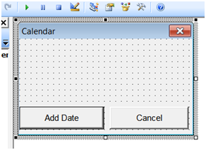
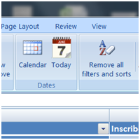
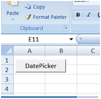

# How to use MonthView control (mscomct2.ocx) without fear
## Requires
- 
## License
- Apache License, Version 2.0
## Technologies
- VBA
- VB.Net
## Topics
- Excel Automation
- Office Automation
- mscomct2.ocx
- MonthView
## Updated
- 11/08/2012
## Description

<h1>Introduction (for those who like to read)</h1>

Recently I was asked to design an Excel file with integrated MontView control.&nbsp; I was surprised to see that so many users are looking for solutions and guidelines on how to use the well known and beloved Date-Picker (or as it is formally named: MonthView
 ActiveX control).

The number of threads on this subject are countless.

Unfortunately I was unable to find one solid solution that will solve the annoying stability issues accompanying this control and so I decided to present a solution to this problem that is completely resilient to user&rsquo;s environment variations.

In order to use this control it is necessary to establish a &lsquo;solid&rsquo; reference to the ActiveX file mscomct2.ocx. The reason for this stability issues stems from the fact that creating this &lsquo;solid&rsquo; reference is a tricky, almost impossible
 mission with today OS. Particularly for applications that must run on different OS of 32 and 64 bits and Office versions of 32 and 64 bits (yes the hassle of where the hell should I save resources, in System32 or SysWOW64?). Even after thoroughly debugging
 an application it may later function erratically for some users. Particularly if the application (e.g. an Excel file with macros) is placed and used from a remote server by&nbsp;other users.

In the following sample I will present a solution to this problem that was already tested on different OS with different Office versions, on a standalone PC or on networks.

The presented solution was implemented in an Excel file, the most common use of the DatePicker.

Note: It will not show how to call the DatePicker from Excel since this issue is well covered by others (Google it).

&nbsp;

<h1>Strategy (more boring stuff)</h1>

One may think on 3 different strategies which I will call the Straw House, the Wood House and the Brick House strategies.

The Straw House strategy may define a solution, best suited for single users, and&nbsp;of files&nbsp;which are&nbsp;always&nbsp;located&nbsp;on the same computer. In this case we will ask the user to do some initialization process for&nbsp;the&nbsp;first
 time the file is used (you can simplify the below code to follow this functionality).

The Wood House strategy is similar to the Straw House strategy but it will also suit the use of files by many users over a network. Here the user is asked to do a one-time initialization process before he can use the file (you can simplify the below code
 to follow this functionality).

The Brick House strategy (which I presented here) will enable using&nbsp;files by single users or by many users, regardless if the file is local or shared on a network. Every time the file is opened (e.g. an Excel file) it will check whether the user is
 having valid references to the resources needed, if not, the user will be asked to correct the problem (automatically) and only then he will be able to use the file with the DatePicker. This way we will assure good functionality of the Month View control under
 any condition.

Sound complicated? Not really, as you will learn later.

&nbsp;

<h1>Implementation (warming up)</h1>

Regardless on the strategy you choose, 3 basic issues must be addressed and solved:

<ol>
<li>We need a solid verification process on whether a valid reference to the mscomc2.ocx exists (and we don&rsquo;t like to get messy with Windows registry).
</li><li>If the reference is missing or broken we need to have a foolproof method on how to fix it, regardless on current user environment.
</li><li>If for some reason (e.g in Straw Hose approach) the files (e.g. Excel)&nbsp;are used with missing references, we need to protect the user from confusing messages or even worst &ndash; compilation error messages.
</li></ol>

In this sample we will do the following:

The resource file mscomc2.ocx will be placed in a predefined folder that will serve any user who is activating our file. I decided to save the file in a subfolder 'Support' located under the folder containing our application file (working folder) but it
 may be saved at any location that suit your requirements (in the later case you will need to make a small modification of the code).

&nbsp;

<h1>Preparations</h1>

You should follow the next steps:

1. Save the Excel file you want to use in a folder. In this folder create a subfolder by the name
<em><strong>Support </strong></em>(works with no problems on networks).

2. Load and extract the ActiveX file<strong> mscomct.ocx</strong> from the following link:
<a href="http://support.microsoft.com/kb/297381">http://support.microsoft.com/kb/297381</a> and save it in the
<strong><em>Support</em></strong> folder (you need only this file). It may look like this:

<ul>
<li>Work folder - X:\Company Apps\MyExelFile.xlsm </li><li>Support folder - X:\Company Apps\Support\mscomct2.ocx </li></ul>

3. Insert a UserForm to your excel file VBA project.&nbsp; Rename it to: <strong>
<em>CalendarForm </em></strong>with caption: <strong><em>Calendar</em></strong>

4. Add to the CalendarForm 2 Command Buttons:

<ul>
<li>1st Button renamed to: <strong><em>CommandButtonAddDate </em></strong>with caption:
<strong><em>Add Date</em></strong> </li><li>2nd Button renamed to: <em><strong>Cancel </strong></em>with caption:
<em><strong>Cancel</strong></em> </li></ul>
<ul>
<li>The Form should look like this: </li></ul>

5. Add the following code to the <strong><em>CalendarForm</em></strong>

Note: You are not requested to enter a MonthView control to the form

&nbsp;

Visual Basic

Edit|Remove

vb
<pre class="hidden">Option Explicit

'To change The buttons size under the MonthView control use only the next 3 lines
Private Const Paspartu As Long = 3
Private Const ButtonsHeight  As Long = 20
Private Const ButtonsSpace  As Long = 40

Public WithEvents MonthView1 As MSComCtl2.MonthView

Private Sub AddMonthPicker()
    Dim myCalendar As Control
    Dim CalendarWidth As Long
    Dim CalendarHeight As Long
    Dim ButtonsTops  As Long
    Dim ButtonsWidth As Long
    On Error GoTo LastRow
    Set CalendarForm.MonthView1 = CalendarForm.Controls.Add(&quot;MSComCtl2.MonthView&quot;, &quot;MonthView1&quot;, True)
    If Err.Number &lt;&gt; 0 Or CalendarForm.MonthView1 Is Nothing Then
        GoTo LastRow
    End If
    Set myCalendar = CalendarForm.Controls(&quot;MonthView1&quot;)
    
    With CalendarForm.Controls(&quot;MonthView1&quot;)
        .Appearance = 0 'ccFlat
        .BorderStyle = 1 'ccFixedSingle
        .ShowWeekNumbers = True
        .BackColor = &amp;HBA5A03
        .TitleBackColor = &amp;HFFA782
        .TitleForeColor = &amp;HBA5A03
        .BorderStyle = cc2None
        .Value = Date
        .StartOfWeek = 2 'mvwSunday
    End With
    
    With CalendarForm
        
        'Define MonthView location
        CalendarWidth = myCalendar.Width
        CalendarHeight = myCalendar.Height
        myCalendar.Top = Paspartu
        myCalendar.Left = Paspartu
        
        'Define buttons size and lockation
        ButtonsTops = 2 * Paspartu &#43; CalendarHeight
        ButtonsWidth = (3 * Paspartu &#43; CalendarWidth - ButtonsSpace) / 2
         
        .CommandButtonAddDate.Top = ButtonsTops
        .CommandButtonAddDate.Left = Paspartu
        .CommandButtonAddDate.Width = ButtonsWidth
        .CommandButtonAddDate.Height = ButtonsHeight
        
        .CommandButtonCancel.Top = ButtonsTops
        .CommandButtonCancel.Left = Paspartu &#43; CalendarWidth - ButtonsWidth
        .CommandButtonCancel.Width = ButtonsWidth
        .CommandButtonCancel.Height = ButtonsHeight
          
        'Define Form size
        .Height = 3 * Paspartu &#43; CalendarHeight &#43; ButtonsHeight &#43; 20
        .Width = 3 * Paspartu &#43; CalendarWidth
        
    End With
LastRow:
End Sub

Private Sub CommandButtonAddDate_Click()
    Selection = MonthView1.Value
    Unload Me
End Sub

Private Sub CommandButtonCancel_Click()
    Unload Me
End Sub

Private Sub MonthView1_DateDblClick(ByVal DateDblClicked As Date)
    Selection = MonthView1.Value
    Unload Me
End Sub

'The Initialize event is used (instead of Activate event) the in order to prevent flickering when user calls the form
Private Sub UserForm_Initialize()
    AddMonthPicker
    SetDate
End Sub

Private Sub SetDate()
    On Error GoTo LastRow
    If Not ActiveCell Is Nothing Then
        If ActiveCell.Value Then
            MonthView1.Value = ActiveCell.Value
        End If
    End If
LastRow:
End Sub

</pre>

<pre class="vb">Option&nbsp;Explicit&nbsp;
&nbsp;
&nbsp;
'To&nbsp;change&nbsp;The&nbsp;buttons&nbsp;size&nbsp;under&nbsp;the&nbsp;MonthView&nbsp;control&nbsp;use&nbsp;only&nbsp;the&nbsp;next&nbsp;3&nbsp;lines&nbsp;
Private&nbsp;Const&nbsp;Paspartu&nbsp;As&nbsp;Long&nbsp;=&nbsp;3&nbsp;
Private&nbsp;Const&nbsp;ButtonsHeight&nbsp;&nbsp;As&nbsp;Long&nbsp;=&nbsp;20&nbsp;
Private&nbsp;Const&nbsp;ButtonsSpace&nbsp;&nbsp;As&nbsp;Long&nbsp;=&nbsp;40&nbsp;
&nbsp;
&nbsp;
Public&nbsp;WithEvents&nbsp;MonthView1&nbsp;As&nbsp;MSComCtl2.MonthView&nbsp;
&nbsp;
&nbsp;
Private&nbsp;Sub&nbsp;AddMonthPicker()&nbsp;
&nbsp;&nbsp;&nbsp;&nbsp;Dim&nbsp;myCalendar&nbsp;As&nbsp;Control&nbsp;
&nbsp;&nbsp;&nbsp;&nbsp;Dim&nbsp;CalendarWidth&nbsp;As&nbsp;Long&nbsp;
&nbsp;&nbsp;&nbsp;&nbsp;Dim&nbsp;CalendarHeight&nbsp;As&nbsp;Long&nbsp;
&nbsp;&nbsp;&nbsp;&nbsp;Dim&nbsp;ButtonsTops&nbsp;&nbsp;As&nbsp;Long&nbsp;
&nbsp;&nbsp;&nbsp;&nbsp;Dim&nbsp;ButtonsWidth&nbsp;As&nbsp;Long&nbsp;
&nbsp;&nbsp;&nbsp;&nbsp;On&nbsp;Error&nbsp;GoTo&nbsp;LastRow&nbsp;
&nbsp;&nbsp;&nbsp;&nbsp;Set&nbsp;CalendarForm.MonthView1&nbsp;=&nbsp;CalendarForm.Controls.Add(&quot;MSComCtl2.MonthView&quot;,&nbsp;&quot;MonthView1&quot;,&nbsp;True)&nbsp;
&nbsp;&nbsp;&nbsp;&nbsp;If&nbsp;Err.Number&nbsp;&lt;&gt;&nbsp;0&nbsp;Or&nbsp;CalendarForm.MonthView1&nbsp;Is&nbsp;Nothing&nbsp;Then&nbsp;
&nbsp;&nbsp;&nbsp;&nbsp;&nbsp;&nbsp;&nbsp;&nbsp;GoTo&nbsp;LastRow&nbsp;
&nbsp;&nbsp;&nbsp;&nbsp;End&nbsp;If&nbsp;
&nbsp;&nbsp;&nbsp;&nbsp;Set&nbsp;myCalendar&nbsp;=&nbsp;CalendarForm.Controls(&quot;MonthView1&quot;)&nbsp;
&nbsp;&nbsp;&nbsp;&nbsp;&nbsp;
&nbsp;&nbsp;&nbsp;&nbsp;With&nbsp;CalendarForm.Controls(&quot;MonthView1&quot;)&nbsp;
&nbsp;&nbsp;&nbsp;&nbsp;&nbsp;&nbsp;&nbsp;&nbsp;.Appearance&nbsp;=&nbsp;0&nbsp;'ccFlat&nbsp;
&nbsp;&nbsp;&nbsp;&nbsp;&nbsp;&nbsp;&nbsp;&nbsp;.BorderStyle&nbsp;=&nbsp;1&nbsp;'ccFixedSingle&nbsp;
&nbsp;&nbsp;&nbsp;&nbsp;&nbsp;&nbsp;&nbsp;&nbsp;.ShowWeekNumbers&nbsp;=&nbsp;True&nbsp;
&nbsp;&nbsp;&nbsp;&nbsp;&nbsp;&nbsp;&nbsp;&nbsp;.BackColor&nbsp;=&nbsp;&amp;HBA5A03&nbsp;
&nbsp;&nbsp;&nbsp;&nbsp;&nbsp;&nbsp;&nbsp;&nbsp;.TitleBackColor&nbsp;=&nbsp;&amp;HFFA782&nbsp;
&nbsp;&nbsp;&nbsp;&nbsp;&nbsp;&nbsp;&nbsp;&nbsp;.TitleForeColor&nbsp;=&nbsp;&amp;HBA5A03&nbsp;
&nbsp;&nbsp;&nbsp;&nbsp;&nbsp;&nbsp;&nbsp;&nbsp;.BorderStyle&nbsp;=&nbsp;cc2None&nbsp;
&nbsp;&nbsp;&nbsp;&nbsp;&nbsp;&nbsp;&nbsp;&nbsp;.Value&nbsp;=&nbsp;Date&nbsp;
&nbsp;&nbsp;&nbsp;&nbsp;&nbsp;&nbsp;&nbsp;&nbsp;.StartOfWeek&nbsp;=&nbsp;2&nbsp;'mvwSunday&nbsp;
&nbsp;&nbsp;&nbsp;&nbsp;End&nbsp;With&nbsp;
&nbsp;&nbsp;&nbsp;&nbsp;&nbsp;
&nbsp;&nbsp;&nbsp;&nbsp;With&nbsp;CalendarForm&nbsp;
&nbsp;&nbsp;&nbsp;&nbsp;&nbsp;&nbsp;&nbsp;&nbsp;&nbsp;
&nbsp;&nbsp;&nbsp;&nbsp;&nbsp;&nbsp;&nbsp;&nbsp;'Define&nbsp;MonthView&nbsp;location&nbsp;
&nbsp;&nbsp;&nbsp;&nbsp;&nbsp;&nbsp;&nbsp;&nbsp;CalendarWidth&nbsp;=&nbsp;myCalendar.Width&nbsp;
&nbsp;&nbsp;&nbsp;&nbsp;&nbsp;&nbsp;&nbsp;&nbsp;CalendarHeight&nbsp;=&nbsp;myCalendar.Height&nbsp;
&nbsp;&nbsp;&nbsp;&nbsp;&nbsp;&nbsp;&nbsp;&nbsp;myCalendar.Top&nbsp;=&nbsp;Paspartu&nbsp;
&nbsp;&nbsp;&nbsp;&nbsp;&nbsp;&nbsp;&nbsp;&nbsp;myCalendar.Left&nbsp;=&nbsp;Paspartu&nbsp;
&nbsp;&nbsp;&nbsp;&nbsp;&nbsp;&nbsp;&nbsp;&nbsp;&nbsp;
&nbsp;&nbsp;&nbsp;&nbsp;&nbsp;&nbsp;&nbsp;&nbsp;'Define&nbsp;buttons&nbsp;size&nbsp;and&nbsp;lockation&nbsp;
&nbsp;&nbsp;&nbsp;&nbsp;&nbsp;&nbsp;&nbsp;&nbsp;ButtonsTops&nbsp;=&nbsp;2&nbsp;*&nbsp;Paspartu&nbsp;&#43;&nbsp;CalendarHeight&nbsp;
&nbsp;&nbsp;&nbsp;&nbsp;&nbsp;&nbsp;&nbsp;&nbsp;ButtonsWidth&nbsp;=&nbsp;(3&nbsp;*&nbsp;Paspartu&nbsp;&#43;&nbsp;CalendarWidth&nbsp;-&nbsp;ButtonsSpace)&nbsp;/&nbsp;2&nbsp;
&nbsp;&nbsp;&nbsp;&nbsp;&nbsp;&nbsp;&nbsp;&nbsp;&nbsp;&nbsp;
&nbsp;&nbsp;&nbsp;&nbsp;&nbsp;&nbsp;&nbsp;&nbsp;.CommandButtonAddDate.Top&nbsp;=&nbsp;ButtonsTops&nbsp;
&nbsp;&nbsp;&nbsp;&nbsp;&nbsp;&nbsp;&nbsp;&nbsp;.CommandButtonAddDate.Left&nbsp;=&nbsp;Paspartu&nbsp;
&nbsp;&nbsp;&nbsp;&nbsp;&nbsp;&nbsp;&nbsp;&nbsp;.CommandButtonAddDate.Width&nbsp;=&nbsp;ButtonsWidth&nbsp;
&nbsp;&nbsp;&nbsp;&nbsp;&nbsp;&nbsp;&nbsp;&nbsp;.CommandButtonAddDate.Height&nbsp;=&nbsp;ButtonsHeight&nbsp;
&nbsp;&nbsp;&nbsp;&nbsp;&nbsp;&nbsp;&nbsp;&nbsp;&nbsp;
&nbsp;&nbsp;&nbsp;&nbsp;&nbsp;&nbsp;&nbsp;&nbsp;.CommandButtonCancel.Top&nbsp;=&nbsp;ButtonsTops&nbsp;
&nbsp;&nbsp;&nbsp;&nbsp;&nbsp;&nbsp;&nbsp;&nbsp;.CommandButtonCancel.Left&nbsp;=&nbsp;Paspartu&nbsp;&#43;&nbsp;CalendarWidth&nbsp;-&nbsp;ButtonsWidth&nbsp;
&nbsp;&nbsp;&nbsp;&nbsp;&nbsp;&nbsp;&nbsp;&nbsp;.CommandButtonCancel.Width&nbsp;=&nbsp;ButtonsWidth&nbsp;
&nbsp;&nbsp;&nbsp;&nbsp;&nbsp;&nbsp;&nbsp;&nbsp;.CommandButtonCancel.Height&nbsp;=&nbsp;ButtonsHeight&nbsp;
&nbsp;&nbsp;&nbsp;&nbsp;&nbsp;&nbsp;&nbsp;&nbsp;&nbsp;&nbsp;&nbsp;
&nbsp;&nbsp;&nbsp;&nbsp;&nbsp;&nbsp;&nbsp;&nbsp;'Define&nbsp;Form&nbsp;size&nbsp;
&nbsp;&nbsp;&nbsp;&nbsp;&nbsp;&nbsp;&nbsp;&nbsp;.Height&nbsp;=&nbsp;3&nbsp;*&nbsp;Paspartu&nbsp;&#43;&nbsp;CalendarHeight&nbsp;&#43;&nbsp;ButtonsHeight&nbsp;&#43;&nbsp;20&nbsp;
&nbsp;&nbsp;&nbsp;&nbsp;&nbsp;&nbsp;&nbsp;&nbsp;.Width&nbsp;=&nbsp;3&nbsp;*&nbsp;Paspartu&nbsp;&#43;&nbsp;CalendarWidth&nbsp;
&nbsp;&nbsp;&nbsp;&nbsp;&nbsp;&nbsp;&nbsp;&nbsp;&nbsp;
&nbsp;&nbsp;&nbsp;&nbsp;End&nbsp;With&nbsp;
LastRow:&nbsp;
End&nbsp;Sub&nbsp;
&nbsp;
Private&nbsp;Sub&nbsp;CommandButtonAddDate_Click()&nbsp;
&nbsp;&nbsp;&nbsp;&nbsp;Selection&nbsp;=&nbsp;MonthView1.Value&nbsp;
&nbsp;&nbsp;&nbsp;&nbsp;Unload&nbsp;Me&nbsp;
End&nbsp;Sub&nbsp;
&nbsp;
Private&nbsp;Sub&nbsp;CommandButtonCancel_Click()&nbsp;
&nbsp;&nbsp;&nbsp;&nbsp;Unload&nbsp;Me&nbsp;
End&nbsp;Sub&nbsp;
&nbsp;
Private&nbsp;Sub&nbsp;MonthView1_DateDblClick(ByVal&nbsp;DateDblClicked&nbsp;As&nbsp;Date)&nbsp;
&nbsp;&nbsp;&nbsp;&nbsp;Selection&nbsp;=&nbsp;MonthView1.Value&nbsp;
&nbsp;&nbsp;&nbsp;&nbsp;Unload&nbsp;Me&nbsp;
End&nbsp;Sub&nbsp;
&nbsp;
&nbsp;
'The&nbsp;Initialize&nbsp;event&nbsp;is&nbsp;used&nbsp;(instead&nbsp;of&nbsp;Activate&nbsp;event)&nbsp;the&nbsp;in&nbsp;order&nbsp;to&nbsp;prevent&nbsp;flickering&nbsp;when&nbsp;user&nbsp;calls&nbsp;the&nbsp;form&nbsp;
Private&nbsp;Sub&nbsp;UserForm_Initialize()&nbsp;
&nbsp;&nbsp;&nbsp;&nbsp;AddMonthPicker&nbsp;
&nbsp;&nbsp;&nbsp;&nbsp;SetDate&nbsp;
End&nbsp;Sub&nbsp;
&nbsp;
Private&nbsp;Sub&nbsp;SetDate()&nbsp;
&nbsp;&nbsp;&nbsp;&nbsp;On&nbsp;Error&nbsp;GoTo&nbsp;LastRow&nbsp;
&nbsp;&nbsp;&nbsp;&nbsp;If&nbsp;Not&nbsp;ActiveCell&nbsp;Is&nbsp;Nothing&nbsp;Then&nbsp;
&nbsp;&nbsp;&nbsp;&nbsp;&nbsp;&nbsp;&nbsp;&nbsp;If&nbsp;ActiveCell.Value&nbsp;Then&nbsp;
&nbsp;&nbsp;&nbsp;&nbsp;&nbsp;&nbsp;&nbsp;&nbsp;&nbsp;&nbsp;&nbsp;&nbsp;MonthView1.Value&nbsp;=&nbsp;ActiveCell.Value&nbsp;
&nbsp;&nbsp;&nbsp;&nbsp;&nbsp;&nbsp;&nbsp;&nbsp;End&nbsp;If&nbsp;
&nbsp;&nbsp;&nbsp;&nbsp;End&nbsp;If&nbsp;
LastRow:&nbsp;
End&nbsp;Sub&nbsp;
&nbsp;
</pre>

&nbsp;

&nbsp;

6. Add a standard Module to the VBA project (Module1)

7. Add the following code to this Module

&nbsp;

Visual Basic

Edit|Remove

vb
<pre class="hidden">Option Explicit

Private Declare Function ShellExecute Lib &quot;shell32.dll&quot; Alias &quot;ShellExecuteA&quot; _
  (ByVal hWnd As Long, _
   ByVal lpOperation As String, _
   ByVal lpFile As String, _
   ByVal lpParameters As String, _
   ByVal lpDirectory As String, _
   ByVal nShowCmd As Long) As Long
    

Private WorkFolder As String 'Stores the work folder of the Workbook
Private SupportFolder As String 'Stores the Support folder for this application
Public bMscomct2ReferenceStatus As Boolean 'Stores the mscomct2.ocx reference status

Public Sub CheckAndFixReferences()
    bMscomct2ReferenceStatus = False
    Dim i As Long
'Stage 1 - Check the 'Trust VBA project' status
    If Not TrustAccessToVBA Then
        MsgBox &quot;You have chosen not to trust the VBA project module.&quot; &amp; vbNewLine &amp; _
        &quot;Therefore, the file is not usable and it will be closed.&quot;, vbExclamation, _
        &quot;VBA project trust status&quot;
        'Close File
        ActiveWorkbook.Close SaveChanges:=False
        Exit Sub
    End If
    
'Stage 2 - Check if a reference to mscomct2.ocx exist and if it's status is OK
    If Not Mscomct2ReferenceStatus Then
        'mscomct2.ocx is not referenced or reference is broken.
        'The shortest way to correct this situation is to register mscomct2.ocx
        '(without removing the broken reference).
        'To simplify the registration process mscomct2.ocx will saved and registered
        'form a Support folder.
        GetMyWorkFolder
        'If you want to save mscomct2.ocx in a diferent lockation
        '(e.g. Windows\system32\) you will have to change the next line
        SetSupportFolder 'defines - SupportFolder
        If Not Mscomct2Exists(SupportFolder) Then
            MsgBox &quot;The file mscomct2.ocx was not found in the Support folder or the&quot; &amp; _
                    &quot; Support folder does not exist.&quot; &amp; vbNewLine &amp; _
            &quot;This problem must be corrected to allow this workbook loading.&quot; _
            &amp; vbNewLine &amp; vbNewLine &amp; _
            &quot;Mscomct2.ocx must be located in the folowing folder:&quot; &amp; vbNewLine &amp; _
            SupportFolder &amp; &quot;mscomct2.ocx&quot;, vbExclamation, &quot;Excel aborted&quot;
            'If Support folder was not found close Workbook
            ActiveWorkbook.Close SaveChanges:=False
            Exit Sub
        End If
        
        
'Stage 3 - Register mscomct2.ocx from the Support folder
        RegisterFile SupportFolder &amp; &quot;mscomct2.ocx&quot;

'In order to complete the registration process we need to allow the operating system
'to process these events externally.
'Test has shown that a single call to DoEvents may not work on some systems. A safe
'A minimum of 1000 calls is recommended.
    For i = 1 To 1000
        DoEvents
    Next
    
'Stage 4 - Recheck mscomct2.ocx registration status
        If Not Mscomct2ReferenceStatus Then
            'Incorrect status. Close file
            MsgBox _
                &quot;You do not have a correct registration or reference to the support &quot; &amp; _
                &quot;file mscomct2.ocx&quot; &amp; vbNewLine &amp; _
                &quot;Possible causes for the problem:&quot; &amp; vbNewLine &amp; vbNewLine &amp; _
                &quot;1.  The file was not installed on your computer or it is not &quot; &amp; _
                &quot;located in the 'Support' folder as it should be.&quot; &amp; vbNewLine &amp; _
                &quot;(!) Make sure the file is located correctly in a subfolder &quot; &amp; _
                &quot;'Support' under the folder containing this excel file.&quot; &amp; _
                vbNewLine &amp; vbNewLine &amp; _
                &quot;2.  The file mscomct2.ocx exists but Excel was not able to &quot; &amp; _
                &quot;correct a broken reference to it.&quot; &amp; vbNewLine &amp; _
                &quot;(!) To fix this problem close all open Workbooks (excel files) &quot; &amp; _
                &quot;and restart only this file.&quot; &amp; vbNewLine &amp; vbNewLine &amp; _
                &quot;3.  You are using unsupported Windows or Office version.&quot; _
                &amp; vbNewLine &amp; _
                &quot;(!) Call your system administrator to fix this problem.&quot;, _
                vbInformation, &quot;Excel aborted&quot;
             MsgBox &quot;The application in this file may not work correctly.&quot; &amp; _
                    vbNewLine &amp; _
                    &quot;The file must be closed in order to prevent ambiguous results.&quot;, _
                    vbInformation, &quot;Excel aborted&quot;
            'Close file
            ActiveWorkbook.Close SaveChanges:=False
            Exit Sub
        Else
            bMscomct2ReferenceStatus = True
        End If
    Else
        MsgBox &quot;A valid, unbroken, reference to mscomct2.ocx was found.&quot;, _
                vbInformation, &quot;Reference validation&quot;
        bMscomct2ReferenceStatus = True
    End If
End Sub

'Function will find if trust access to VBA object module(in Options) is checked.
'This is a general property of Excel applied to all Workbooks (that are already open
'or will be opened).
Private Function TrustAccessToVBA() As Boolean
    Dim Response As Long
    Dim VisualBasicProject As Object
    TrustAccessToVBA = True
    On Error Resume Next
    'Check if trust center is alowing to run macros
    Set VisualBasicProject = ActiveWorkbook.VBProject
    If Not Err.Number = 0 Then
         Response = MsgBox(&quot;Programme Stopped.&quot; &amp; vbNewLine &amp; _
         &quot;Your current security settings do not allow the code in this workbook&quot; &amp; _
         &quot; to work as designed and you will get error messages.&quot; &amp; vbNewLine &amp; vbNewLine &amp; _
         &quot;To allow the code to function correctly and without errors you need&quot; &amp; _
         &quot; to change your security setting as follows:&quot; &amp; vbNewLine &amp; vbNewLine &amp; _
         &quot; 1. Click OK to go directly to the security centre&quot; &amp; vbNewLine &amp; _
         &quot; 2. Check 'Trust access to VBA project object model'&quot;, _
         vbOKCancel &#43; vbCritical)
         If Response = vbOK Then
             Application.CommandBars(&quot;Macro&quot;).Controls(&quot;Security...&quot;).Execute
         End If
        'Retesting if user has allowed access to the VBA project object model
        '1st - Reset last error value
        Err.Number = 0
        '2nd - Recall the VBProject in order to see if it generate an error
        Set VisualBasicProject = ActiveWorkbook.VBProject
        '3rd - Check if an error was generated
        If Err.Number = 0 Then
            MsgBox &quot;Access to the VBA project object model was set to TRUSTED.&quot;, _
                    vbApplicationModal &#43; vbInformation, &quot;Excel Setup&quot;
        Else
            TrustAccessToVBA = False
        End If
    End If
    Set VisualBasicProject = Nothing
End Function

'Get the Active Workbook working folder
Private Sub GetMyWorkFolder()
    Dim WorkPath As String
    Dim AWB As Workbook
    Set AWB = ActiveWorkbook
    WorkFolder = AWB.Path
    If WorkFolder = &quot;&quot; Then
        MsgBox &quot;File is not saved.&quot;
    End If
    Set AWB = Nothing
End Sub

'Set the the path for the Support folder for this Workbook
Private Sub SetSupportFolder()
    SupportFolder = WorkFolder &amp; &quot;\&quot; &amp; &quot;Support\&quot;
End Sub

'Find if mscomct2.ocx exsist in the Support folder
Private Function Mscomct2Exists(SupportFolderName As String) As Boolean
    Dim str As String
    str = Dir(SupportFolderName &amp; &quot;mscomct2.ocx&quot;)
    If str &lt;&gt; &quot;&quot; Then Mscomct2Exists = True Else: Mscomct2Exists = False
End Function

'Silently register a file with administrator elevated access
Private Sub RegisterFile(ByVal sFileName As String)
    ShellExecute 0, &quot;runas&quot;, &quot;cmd&quot;, &quot;/c regsvr32 /s &quot; &amp; &quot;&quot;&quot;&quot; &amp; sFileName _
                 &amp; &quot;&quot;&quot;&quot;, &quot;C:\&quot;, 0
End Sub

'Silently unregister a file with administrator elevated access
Private Sub UnRegisterFile(ByVal sFileName As String)
    ShellExecute 0, &quot;runas&quot;, &quot;cmd&quot;, &quot;/c regsvr32 /u /s &quot; &amp; &quot;&quot;&quot;&quot; &amp; sFileName _
                 &amp; &quot;&quot;&quot;&quot;, &quot;C:\&quot;, 0
End Sub

'Check if a reference to mscomct2.ocx exists and if yes what the status of this
'reference.
Private Function Mscomct2ReferenceStatus() As Boolean
    Dim VBProj As Object 'As VBIDE.VBProject '(In order to use early bound a reference
                         'has to be made to the VBIDE library)
    Dim chkRef As Object
    Dim sPath As String
    Dim RefOK As Boolean
    Dim RefNo As Long
    'Get the activedocument's VBA project.
    Set VBProj = ActiveWorkbook.VBProject
    'Go through the listed project references
    For Each chkRef In VBProj.References
        RefNo = RefNo &#43; 1
        '1st see each referance broken status
        If Not chkRef.IsBroken Then
            '2nd check if refarance is mscomct2.ocx.
            'This is done thru the referance GUID wich is alwis presend
            'in contrast to the reference name that might be missing
            If chkRef.GUID = &quot;{86CF1D34-0C5F-11D2-A9FC-0000F8754DA1}&quot; Then
                'Now check if the mscomct2.ocx path is recognized correctly otherwise
                'the reference connectivity to the project is still broken
                On Error Resume Next
                sPath = chkRef.fullpath
                If Err.Number = 0 Then
                    'mscomct2.ocx is correctly referenced but!!!
                    'Even if the reference path is OK the file may be still be missing.
                    'We need to check if the reference file exists in the registered
                    'path.
                    If Dir(sPath) &lt;&gt; &quot;&quot; Then
'                        MsgBox &quot;Ref path is OK&quot;
                        'Even if the file exist the reference may be corrupt.
                        'We will now check if the reference file is lockated in the
                        'support file.
                        '1st we will check if the Support file path is set
                        If SupportFolder = &quot;&quot; Then
                            GetMyWorkFolder
                            SetSupportFolder
                        End If
                        If sPath = SupportFolder &amp; &quot;mscomct2.ocx&quot; Then
                            'Only if the reference file is lockated in the Support
                            'folder we will concider it as OK.
                            RefOK = True
                        Else
                             VBProj.Remove RefNo
                        End If
                    End If
                End If
            End If
        End If
    Next
    If RefOK Then Mscomct2ReferenceStatus = True
    Set VBProj = Nothing
    Set chkRef = Nothing
End Function

'''''''''''''''''''''''''''''''''''''''''''''''''''''''''''''''''''''''''''''''''''''''''
' The following two procedures are used in order to prevent compilation errors:         '
'    1. A direct call to CalendarForm.show may result in compilation error when         '
'       mscomct.ocx is not referenced correctly.                                        '
'    2. The error will be triggered by the declaration of MSComCtl2.MonthView.          '
'                                                                                       '
' To protect user from this annoyance, calls to CalendarForm must be blocked unless     '
' unbroken reference is confirmed. We will do it as follows:                            '
'    1.  A call to CalendarForm.show will be conditioned on verifying correct reference '
'        to mscomct2.ocx                                                                '
'    2.  We will prevent compilation errors by an indirect call to procedure containing '
'        the command CalendarForm.show                                                  '
'''''''''''''''''''''''''''''''''''''''''''''''''''''''''''''''''''''''''''''''''''''''''

'These procedures will protect user from compilation errors
Public Sub ShowMonthPickerForm()
    If bMscomct2ReferenceStatus Then
        Application.Run &quot;MonthPickerForm&quot;
    Else
        MsgBox &quot;The Date-Picker is not availble.&quot; &amp; vbNewLine &amp; _
                &quot;You need to restart this file or call your adiministrator to fix &quot; &amp; _
                &quot;the problem.&quot;, vbExclamation, &quot;Date Picker&quot;
    End If
End Sub

'A procedure called only if mscomct2.ocx is referenced correctly
Private Sub MonthPickerForm()
    CalendarForm.Show
End Sub
</pre>

<pre class="vb">Option&nbsp;Explicit&nbsp;
&nbsp;
Private&nbsp;Declare&nbsp;Function&nbsp;ShellExecute&nbsp;Lib&nbsp;&quot;shell32.dll&quot;&nbsp;Alias&nbsp;&quot;ShellExecuteA&quot;&nbsp;_&nbsp;
&nbsp;&nbsp;(ByVal&nbsp;hWnd&nbsp;As&nbsp;Long,&nbsp;_&nbsp;
&nbsp;&nbsp;&nbsp;ByVal&nbsp;lpOperation&nbsp;As&nbsp;String,&nbsp;_&nbsp;
&nbsp;&nbsp;&nbsp;ByVal&nbsp;lpFile&nbsp;As&nbsp;String,&nbsp;_&nbsp;
&nbsp;&nbsp;&nbsp;ByVal&nbsp;lpParameters&nbsp;As&nbsp;String,&nbsp;_&nbsp;
&nbsp;&nbsp;&nbsp;ByVal&nbsp;lpDirectory&nbsp;As&nbsp;String,&nbsp;_&nbsp;
&nbsp;&nbsp;&nbsp;ByVal&nbsp;nShowCmd&nbsp;As&nbsp;Long)&nbsp;As&nbsp;Long&nbsp;
&nbsp;&nbsp;&nbsp;&nbsp;&nbsp;
&nbsp;
Private&nbsp;WorkFolder&nbsp;As&nbsp;String&nbsp;'Stores&nbsp;the&nbsp;work&nbsp;folder&nbsp;of&nbsp;the&nbsp;Workbook&nbsp;
Private&nbsp;SupportFolder&nbsp;As&nbsp;String&nbsp;'Stores&nbsp;the&nbsp;Support&nbsp;folder&nbsp;for&nbsp;this&nbsp;application&nbsp;
Public&nbsp;bMscomct2ReferenceStatus&nbsp;As&nbsp;Boolean&nbsp;'Stores&nbsp;the&nbsp;mscomct2.ocx&nbsp;reference&nbsp;status&nbsp;
&nbsp;
&nbsp;
Public&nbsp;Sub&nbsp;CheckAndFixReferences()&nbsp;
&nbsp;&nbsp;&nbsp;&nbsp;bMscomct2ReferenceStatus&nbsp;=&nbsp;False&nbsp;
&nbsp;&nbsp;&nbsp;&nbsp;Dim&nbsp;i&nbsp;As&nbsp;Long&nbsp;
'Stage&nbsp;1&nbsp;-&nbsp;Check&nbsp;the&nbsp;'Trust&nbsp;VBA&nbsp;project'&nbsp;status&nbsp;
&nbsp;&nbsp;&nbsp;&nbsp;If&nbsp;Not&nbsp;TrustAccessToVBA&nbsp;Then&nbsp;
&nbsp;&nbsp;&nbsp;&nbsp;&nbsp;&nbsp;&nbsp;&nbsp;MsgBox&nbsp;&quot;You&nbsp;have&nbsp;chosen&nbsp;not&nbsp;to&nbsp;trust&nbsp;the&nbsp;VBA&nbsp;project&nbsp;module.&quot;&nbsp;&amp;&nbsp;vbNewLine&nbsp;&amp;&nbsp;_&nbsp;
&nbsp;&nbsp;&nbsp;&nbsp;&nbsp;&nbsp;&nbsp;&nbsp;&quot;Therefore,&nbsp;the&nbsp;file&nbsp;is&nbsp;not&nbsp;usable&nbsp;and&nbsp;it&nbsp;will&nbsp;be&nbsp;closed.&quot;,&nbsp;vbExclamation,&nbsp;_&nbsp;
&nbsp;&nbsp;&nbsp;&nbsp;&nbsp;&nbsp;&nbsp;&nbsp;&quot;VBA&nbsp;project&nbsp;trust&nbsp;status&quot;&nbsp;
&nbsp;&nbsp;&nbsp;&nbsp;&nbsp;&nbsp;&nbsp;&nbsp;'Close&nbsp;File&nbsp;
&nbsp;&nbsp;&nbsp;&nbsp;&nbsp;&nbsp;&nbsp;&nbsp;ActiveWorkbook.Close&nbsp;SaveChanges:=False&nbsp;
&nbsp;&nbsp;&nbsp;&nbsp;&nbsp;&nbsp;&nbsp;&nbsp;Exit&nbsp;Sub&nbsp;
&nbsp;&nbsp;&nbsp;&nbsp;End&nbsp;If&nbsp;
&nbsp;&nbsp;&nbsp;&nbsp;&nbsp;
'Stage&nbsp;2&nbsp;-&nbsp;Check&nbsp;if&nbsp;a&nbsp;reference&nbsp;to&nbsp;mscomct2.ocx&nbsp;exist&nbsp;and&nbsp;if&nbsp;it's&nbsp;status&nbsp;is&nbsp;OK&nbsp;
&nbsp;&nbsp;&nbsp;&nbsp;If&nbsp;Not&nbsp;Mscomct2ReferenceStatus&nbsp;Then&nbsp;
&nbsp;&nbsp;&nbsp;&nbsp;&nbsp;&nbsp;&nbsp;&nbsp;'mscomct2.ocx&nbsp;is&nbsp;not&nbsp;referenced&nbsp;or&nbsp;reference&nbsp;is&nbsp;broken.&nbsp;
&nbsp;&nbsp;&nbsp;&nbsp;&nbsp;&nbsp;&nbsp;&nbsp;'The&nbsp;shortest&nbsp;way&nbsp;to&nbsp;correct&nbsp;this&nbsp;situation&nbsp;is&nbsp;to&nbsp;register&nbsp;mscomct2.ocx&nbsp;
&nbsp;&nbsp;&nbsp;&nbsp;&nbsp;&nbsp;&nbsp;&nbsp;'(without&nbsp;removing&nbsp;the&nbsp;broken&nbsp;reference).&nbsp;
&nbsp;&nbsp;&nbsp;&nbsp;&nbsp;&nbsp;&nbsp;&nbsp;'To&nbsp;simplify&nbsp;the&nbsp;registration&nbsp;process&nbsp;mscomct2.ocx&nbsp;will&nbsp;saved&nbsp;and&nbsp;registered&nbsp;
&nbsp;&nbsp;&nbsp;&nbsp;&nbsp;&nbsp;&nbsp;&nbsp;'form&nbsp;a&nbsp;Support&nbsp;folder.&nbsp;
&nbsp;&nbsp;&nbsp;&nbsp;&nbsp;&nbsp;&nbsp;&nbsp;GetMyWorkFolder&nbsp;
&nbsp;&nbsp;&nbsp;&nbsp;&nbsp;&nbsp;&nbsp;&nbsp;'If&nbsp;you&nbsp;want&nbsp;to&nbsp;save&nbsp;mscomct2.ocx&nbsp;in&nbsp;a&nbsp;diferent&nbsp;lockation&nbsp;
&nbsp;&nbsp;&nbsp;&nbsp;&nbsp;&nbsp;&nbsp;&nbsp;'(e.g.&nbsp;Windows\system32\)&nbsp;you&nbsp;will&nbsp;have&nbsp;to&nbsp;change&nbsp;the&nbsp;next&nbsp;line&nbsp;
&nbsp;&nbsp;&nbsp;&nbsp;&nbsp;&nbsp;&nbsp;&nbsp;SetSupportFolder&nbsp;'defines&nbsp;-&nbsp;SupportFolder&nbsp;
&nbsp;&nbsp;&nbsp;&nbsp;&nbsp;&nbsp;&nbsp;&nbsp;If&nbsp;Not&nbsp;Mscomct2Exists(SupportFolder)&nbsp;Then&nbsp;
&nbsp;&nbsp;&nbsp;&nbsp;&nbsp;&nbsp;&nbsp;&nbsp;&nbsp;&nbsp;&nbsp;&nbsp;MsgBox&nbsp;&quot;The&nbsp;file&nbsp;mscomct2.ocx&nbsp;was&nbsp;not&nbsp;found&nbsp;in&nbsp;the&nbsp;Support&nbsp;folder&nbsp;or&nbsp;the&quot;&nbsp;&amp;&nbsp;_&nbsp;
&nbsp;&nbsp;&nbsp;&nbsp;&nbsp;&nbsp;&nbsp;&nbsp;&nbsp;&nbsp;&nbsp;&nbsp;&nbsp;&nbsp;&nbsp;&nbsp;&nbsp;&nbsp;&nbsp;&nbsp;&quot;&nbsp;Support&nbsp;folder&nbsp;does&nbsp;not&nbsp;exist.&quot;&nbsp;&amp;&nbsp;vbNewLine&nbsp;&amp;&nbsp;_&nbsp;
&nbsp;&nbsp;&nbsp;&nbsp;&nbsp;&nbsp;&nbsp;&nbsp;&nbsp;&nbsp;&nbsp;&nbsp;&quot;This&nbsp;problem&nbsp;must&nbsp;be&nbsp;corrected&nbsp;to&nbsp;allow&nbsp;this&nbsp;workbook&nbsp;loading.&quot;&nbsp;_&nbsp;
&nbsp;&nbsp;&nbsp;&nbsp;&nbsp;&nbsp;&nbsp;&nbsp;&nbsp;&nbsp;&nbsp;&nbsp;&amp;&nbsp;vbNewLine&nbsp;&amp;&nbsp;vbNewLine&nbsp;&amp;&nbsp;_&nbsp;
&nbsp;&nbsp;&nbsp;&nbsp;&nbsp;&nbsp;&nbsp;&nbsp;&nbsp;&nbsp;&nbsp;&nbsp;&quot;Mscomct2.ocx&nbsp;must&nbsp;be&nbsp;located&nbsp;in&nbsp;the&nbsp;folowing&nbsp;folder:&quot;&nbsp;&amp;&nbsp;vbNewLine&nbsp;&amp;&nbsp;_&nbsp;
&nbsp;&nbsp;&nbsp;&nbsp;&nbsp;&nbsp;&nbsp;&nbsp;&nbsp;&nbsp;&nbsp;&nbsp;SupportFolder&nbsp;&amp;&nbsp;&quot;mscomct2.ocx&quot;,&nbsp;vbExclamation,&nbsp;&quot;Excel&nbsp;aborted&quot;&nbsp;
&nbsp;&nbsp;&nbsp;&nbsp;&nbsp;&nbsp;&nbsp;&nbsp;&nbsp;&nbsp;&nbsp;&nbsp;'If&nbsp;Support&nbsp;folder&nbsp;was&nbsp;not&nbsp;found&nbsp;close&nbsp;Workbook&nbsp;
&nbsp;&nbsp;&nbsp;&nbsp;&nbsp;&nbsp;&nbsp;&nbsp;&nbsp;&nbsp;&nbsp;&nbsp;ActiveWorkbook.Close&nbsp;SaveChanges:=False&nbsp;
&nbsp;&nbsp;&nbsp;&nbsp;&nbsp;&nbsp;&nbsp;&nbsp;&nbsp;&nbsp;&nbsp;&nbsp;Exit&nbsp;Sub&nbsp;
&nbsp;&nbsp;&nbsp;&nbsp;&nbsp;&nbsp;&nbsp;&nbsp;End&nbsp;If&nbsp;
&nbsp;&nbsp;&nbsp;&nbsp;&nbsp;&nbsp;&nbsp;&nbsp;&nbsp;
&nbsp;&nbsp;&nbsp;&nbsp;&nbsp;&nbsp;&nbsp;&nbsp;&nbsp;
'Stage&nbsp;3&nbsp;-&nbsp;Register&nbsp;mscomct2.ocx&nbsp;from&nbsp;the&nbsp;Support&nbsp;folder&nbsp;
&nbsp;&nbsp;&nbsp;&nbsp;&nbsp;&nbsp;&nbsp;&nbsp;RegisterFile&nbsp;SupportFolder&nbsp;&amp;&nbsp;&quot;mscomct2.ocx&quot;&nbsp;
&nbsp;
'In&nbsp;order&nbsp;to&nbsp;complete&nbsp;the&nbsp;registration&nbsp;process&nbsp;we&nbsp;need&nbsp;to&nbsp;allow&nbsp;the&nbsp;operating&nbsp;system&nbsp;
'to&nbsp;process&nbsp;these&nbsp;events&nbsp;externally.&nbsp;
'Test&nbsp;has&nbsp;shown&nbsp;that&nbsp;a&nbsp;single&nbsp;call&nbsp;to&nbsp;DoEvents&nbsp;may&nbsp;not&nbsp;work&nbsp;on&nbsp;some&nbsp;systems.&nbsp;A&nbsp;safe&nbsp;
'A&nbsp;minimum&nbsp;of&nbsp;1000&nbsp;calls&nbsp;is&nbsp;recommended.&nbsp;
&nbsp;&nbsp;&nbsp;&nbsp;For&nbsp;i&nbsp;=&nbsp;1&nbsp;To&nbsp;1000&nbsp;
&nbsp;&nbsp;&nbsp;&nbsp;&nbsp;&nbsp;&nbsp;&nbsp;DoEvents&nbsp;
&nbsp;&nbsp;&nbsp;&nbsp;Next&nbsp;
&nbsp;&nbsp;&nbsp;&nbsp;&nbsp;
'Stage&nbsp;4&nbsp;-&nbsp;Recheck&nbsp;mscomct2.ocx&nbsp;registration&nbsp;status&nbsp;
&nbsp;&nbsp;&nbsp;&nbsp;&nbsp;&nbsp;&nbsp;&nbsp;If&nbsp;Not&nbsp;Mscomct2ReferenceStatus&nbsp;Then&nbsp;
&nbsp;&nbsp;&nbsp;&nbsp;&nbsp;&nbsp;&nbsp;&nbsp;&nbsp;&nbsp;&nbsp;&nbsp;'Incorrect&nbsp;status.&nbsp;Close&nbsp;file&nbsp;
&nbsp;&nbsp;&nbsp;&nbsp;&nbsp;&nbsp;&nbsp;&nbsp;&nbsp;&nbsp;&nbsp;&nbsp;MsgBox&nbsp;_&nbsp;
&nbsp;&nbsp;&nbsp;&nbsp;&nbsp;&nbsp;&nbsp;&nbsp;&nbsp;&nbsp;&nbsp;&nbsp;&nbsp;&nbsp;&nbsp;&nbsp;&quot;You&nbsp;do&nbsp;not&nbsp;have&nbsp;a&nbsp;correct&nbsp;registration&nbsp;or&nbsp;reference&nbsp;to&nbsp;the&nbsp;support&nbsp;&quot;&nbsp;&amp;&nbsp;_&nbsp;
&nbsp;&nbsp;&nbsp;&nbsp;&nbsp;&nbsp;&nbsp;&nbsp;&nbsp;&nbsp;&nbsp;&nbsp;&nbsp;&nbsp;&nbsp;&nbsp;&quot;file&nbsp;mscomct2.ocx&quot;&nbsp;&amp;&nbsp;vbNewLine&nbsp;&amp;&nbsp;_&nbsp;
&nbsp;&nbsp;&nbsp;&nbsp;&nbsp;&nbsp;&nbsp;&nbsp;&nbsp;&nbsp;&nbsp;&nbsp;&nbsp;&nbsp;&nbsp;&nbsp;&quot;Possible&nbsp;causes&nbsp;for&nbsp;the&nbsp;problem:&quot;&nbsp;&amp;&nbsp;vbNewLine&nbsp;&amp;&nbsp;vbNewLine&nbsp;&amp;&nbsp;_&nbsp;
&nbsp;&nbsp;&nbsp;&nbsp;&nbsp;&nbsp;&nbsp;&nbsp;&nbsp;&nbsp;&nbsp;&nbsp;&nbsp;&nbsp;&nbsp;&nbsp;&quot;1.&nbsp;&nbsp;The&nbsp;file&nbsp;was&nbsp;not&nbsp;installed&nbsp;on&nbsp;your&nbsp;computer&nbsp;or&nbsp;it&nbsp;is&nbsp;not&nbsp;&quot;&nbsp;&amp;&nbsp;_&nbsp;
&nbsp;&nbsp;&nbsp;&nbsp;&nbsp;&nbsp;&nbsp;&nbsp;&nbsp;&nbsp;&nbsp;&nbsp;&nbsp;&nbsp;&nbsp;&nbsp;&quot;located&nbsp;in&nbsp;the&nbsp;'Support'&nbsp;folder&nbsp;as&nbsp;it&nbsp;should&nbsp;be.&quot;&nbsp;&amp;&nbsp;vbNewLine&nbsp;&amp;&nbsp;_&nbsp;
&nbsp;&nbsp;&nbsp;&nbsp;&nbsp;&nbsp;&nbsp;&nbsp;&nbsp;&nbsp;&nbsp;&nbsp;&nbsp;&nbsp;&nbsp;&nbsp;&quot;(!)&nbsp;Make&nbsp;sure&nbsp;the&nbsp;file&nbsp;is&nbsp;located&nbsp;correctly&nbsp;in&nbsp;a&nbsp;subfolder&nbsp;&quot;&nbsp;&amp;&nbsp;_&nbsp;
&nbsp;&nbsp;&nbsp;&nbsp;&nbsp;&nbsp;&nbsp;&nbsp;&nbsp;&nbsp;&nbsp;&nbsp;&nbsp;&nbsp;&nbsp;&nbsp;&quot;'Support'&nbsp;under&nbsp;the&nbsp;folder&nbsp;containing&nbsp;this&nbsp;excel&nbsp;file.&quot;&nbsp;&amp;&nbsp;_&nbsp;
&nbsp;&nbsp;&nbsp;&nbsp;&nbsp;&nbsp;&nbsp;&nbsp;&nbsp;&nbsp;&nbsp;&nbsp;&nbsp;&nbsp;&nbsp;&nbsp;vbNewLine&nbsp;&amp;&nbsp;vbNewLine&nbsp;&amp;&nbsp;_&nbsp;
&nbsp;&nbsp;&nbsp;&nbsp;&nbsp;&nbsp;&nbsp;&nbsp;&nbsp;&nbsp;&nbsp;&nbsp;&nbsp;&nbsp;&nbsp;&nbsp;&quot;2.&nbsp;&nbsp;The&nbsp;file&nbsp;mscomct2.ocx&nbsp;exists&nbsp;but&nbsp;Excel&nbsp;was&nbsp;not&nbsp;able&nbsp;to&nbsp;&quot;&nbsp;&amp;&nbsp;_&nbsp;
&nbsp;&nbsp;&nbsp;&nbsp;&nbsp;&nbsp;&nbsp;&nbsp;&nbsp;&nbsp;&nbsp;&nbsp;&nbsp;&nbsp;&nbsp;&nbsp;&quot;correct&nbsp;a&nbsp;broken&nbsp;reference&nbsp;to&nbsp;it.&quot;&nbsp;&amp;&nbsp;vbNewLine&nbsp;&amp;&nbsp;_&nbsp;
&nbsp;&nbsp;&nbsp;&nbsp;&nbsp;&nbsp;&nbsp;&nbsp;&nbsp;&nbsp;&nbsp;&nbsp;&nbsp;&nbsp;&nbsp;&nbsp;&quot;(!)&nbsp;To&nbsp;fix&nbsp;this&nbsp;problem&nbsp;close&nbsp;all&nbsp;open&nbsp;Workbooks&nbsp;(excel&nbsp;files)&nbsp;&quot;&nbsp;&amp;&nbsp;_&nbsp;
&nbsp;&nbsp;&nbsp;&nbsp;&nbsp;&nbsp;&nbsp;&nbsp;&nbsp;&nbsp;&nbsp;&nbsp;&nbsp;&nbsp;&nbsp;&nbsp;&quot;and&nbsp;restart&nbsp;only&nbsp;this&nbsp;file.&quot;&nbsp;&amp;&nbsp;vbNewLine&nbsp;&amp;&nbsp;vbNewLine&nbsp;&amp;&nbsp;_&nbsp;
&nbsp;&nbsp;&nbsp;&nbsp;&nbsp;&nbsp;&nbsp;&nbsp;&nbsp;&nbsp;&nbsp;&nbsp;&nbsp;&nbsp;&nbsp;&nbsp;&quot;3.&nbsp;&nbsp;You&nbsp;are&nbsp;using&nbsp;unsupported&nbsp;Windows&nbsp;or&nbsp;Office&nbsp;version.&quot;&nbsp;_&nbsp;
&nbsp;&nbsp;&nbsp;&nbsp;&nbsp;&nbsp;&nbsp;&nbsp;&nbsp;&nbsp;&nbsp;&nbsp;&nbsp;&nbsp;&nbsp;&nbsp;&amp;&nbsp;vbNewLine&nbsp;&amp;&nbsp;_&nbsp;
&nbsp;&nbsp;&nbsp;&nbsp;&nbsp;&nbsp;&nbsp;&nbsp;&nbsp;&nbsp;&nbsp;&nbsp;&nbsp;&nbsp;&nbsp;&nbsp;&quot;(!)&nbsp;Call&nbsp;your&nbsp;system&nbsp;administrator&nbsp;to&nbsp;fix&nbsp;this&nbsp;problem.&quot;,&nbsp;_&nbsp;
&nbsp;&nbsp;&nbsp;&nbsp;&nbsp;&nbsp;&nbsp;&nbsp;&nbsp;&nbsp;&nbsp;&nbsp;&nbsp;&nbsp;&nbsp;&nbsp;vbInformation,&nbsp;&quot;Excel&nbsp;aborted&quot;&nbsp;
&nbsp;&nbsp;&nbsp;&nbsp;&nbsp;&nbsp;&nbsp;&nbsp;&nbsp;&nbsp;&nbsp;&nbsp;&nbsp;MsgBox&nbsp;&quot;The&nbsp;application&nbsp;in&nbsp;this&nbsp;file&nbsp;may&nbsp;not&nbsp;work&nbsp;correctly.&quot;&nbsp;&amp;&nbsp;_&nbsp;
&nbsp;&nbsp;&nbsp;&nbsp;&nbsp;&nbsp;&nbsp;&nbsp;&nbsp;&nbsp;&nbsp;&nbsp;&nbsp;&nbsp;&nbsp;&nbsp;&nbsp;&nbsp;&nbsp;&nbsp;vbNewLine&nbsp;&amp;&nbsp;_&nbsp;
&nbsp;&nbsp;&nbsp;&nbsp;&nbsp;&nbsp;&nbsp;&nbsp;&nbsp;&nbsp;&nbsp;&nbsp;&nbsp;&nbsp;&nbsp;&nbsp;&nbsp;&nbsp;&nbsp;&nbsp;&quot;The&nbsp;file&nbsp;must&nbsp;be&nbsp;closed&nbsp;in&nbsp;order&nbsp;to&nbsp;prevent&nbsp;ambiguous&nbsp;results.&quot;,&nbsp;_&nbsp;
&nbsp;&nbsp;&nbsp;&nbsp;&nbsp;&nbsp;&nbsp;&nbsp;&nbsp;&nbsp;&nbsp;&nbsp;&nbsp;&nbsp;&nbsp;&nbsp;&nbsp;&nbsp;&nbsp;&nbsp;vbInformation,&nbsp;&quot;Excel&nbsp;aborted&quot;&nbsp;
&nbsp;&nbsp;&nbsp;&nbsp;&nbsp;&nbsp;&nbsp;&nbsp;&nbsp;&nbsp;&nbsp;&nbsp;'Close&nbsp;file&nbsp;
&nbsp;&nbsp;&nbsp;&nbsp;&nbsp;&nbsp;&nbsp;&nbsp;&nbsp;&nbsp;&nbsp;&nbsp;ActiveWorkbook.Close&nbsp;SaveChanges:=False&nbsp;
&nbsp;&nbsp;&nbsp;&nbsp;&nbsp;&nbsp;&nbsp;&nbsp;&nbsp;&nbsp;&nbsp;&nbsp;Exit&nbsp;Sub&nbsp;
&nbsp;&nbsp;&nbsp;&nbsp;&nbsp;&nbsp;&nbsp;&nbsp;Else&nbsp;
&nbsp;&nbsp;&nbsp;&nbsp;&nbsp;&nbsp;&nbsp;&nbsp;&nbsp;&nbsp;&nbsp;&nbsp;bMscomct2ReferenceStatus&nbsp;=&nbsp;True&nbsp;
&nbsp;&nbsp;&nbsp;&nbsp;&nbsp;&nbsp;&nbsp;&nbsp;End&nbsp;If&nbsp;
&nbsp;&nbsp;&nbsp;&nbsp;Else&nbsp;
&nbsp;&nbsp;&nbsp;&nbsp;&nbsp;&nbsp;&nbsp;&nbsp;MsgBox&nbsp;&quot;A&nbsp;valid,&nbsp;unbroken,&nbsp;reference&nbsp;to&nbsp;mscomct2.ocx&nbsp;was&nbsp;found.&quot;,&nbsp;_&nbsp;
&nbsp;&nbsp;&nbsp;&nbsp;&nbsp;&nbsp;&nbsp;&nbsp;&nbsp;&nbsp;&nbsp;&nbsp;&nbsp;&nbsp;&nbsp;&nbsp;vbInformation,&nbsp;&quot;Reference&nbsp;validation&quot;&nbsp;
&nbsp;&nbsp;&nbsp;&nbsp;&nbsp;&nbsp;&nbsp;&nbsp;bMscomct2ReferenceStatus&nbsp;=&nbsp;True&nbsp;
&nbsp;&nbsp;&nbsp;&nbsp;End&nbsp;If&nbsp;
End&nbsp;Sub&nbsp;
&nbsp;
'Function&nbsp;will&nbsp;find&nbsp;if&nbsp;trust&nbsp;access&nbsp;to&nbsp;VBA&nbsp;object&nbsp;module(in&nbsp;Options)&nbsp;is&nbsp;checked.&nbsp;
'This&nbsp;is&nbsp;a&nbsp;general&nbsp;property&nbsp;of&nbsp;Excel&nbsp;applied&nbsp;to&nbsp;all&nbsp;Workbooks&nbsp;(that&nbsp;are&nbsp;already&nbsp;open&nbsp;
'or&nbsp;will&nbsp;be&nbsp;opened).&nbsp;
Private&nbsp;Function&nbsp;TrustAccessToVBA()&nbsp;As&nbsp;Boolean&nbsp;
&nbsp;&nbsp;&nbsp;&nbsp;Dim&nbsp;Response&nbsp;As&nbsp;Long&nbsp;
&nbsp;&nbsp;&nbsp;&nbsp;Dim&nbsp;VisualBasicProject&nbsp;As&nbsp;Object&nbsp;
&nbsp;&nbsp;&nbsp;&nbsp;TrustAccessToVBA&nbsp;=&nbsp;True&nbsp;
&nbsp;&nbsp;&nbsp;&nbsp;On&nbsp;Error&nbsp;Resume&nbsp;Next&nbsp;
&nbsp;&nbsp;&nbsp;&nbsp;'Check&nbsp;if&nbsp;trust&nbsp;center&nbsp;is&nbsp;alowing&nbsp;to&nbsp;run&nbsp;macros&nbsp;
&nbsp;&nbsp;&nbsp;&nbsp;Set&nbsp;VisualBasicProject&nbsp;=&nbsp;ActiveWorkbook.VBProject&nbsp;
&nbsp;&nbsp;&nbsp;&nbsp;If&nbsp;Not&nbsp;Err.Number&nbsp;=&nbsp;0&nbsp;Then&nbsp;
&nbsp;&nbsp;&nbsp;&nbsp;&nbsp;&nbsp;&nbsp;&nbsp;&nbsp;Response&nbsp;=&nbsp;MsgBox(&quot;Programme&nbsp;Stopped.&quot;&nbsp;&amp;&nbsp;vbNewLine&nbsp;&amp;&nbsp;_&nbsp;
&nbsp;&nbsp;&nbsp;&nbsp;&nbsp;&nbsp;&nbsp;&nbsp;&nbsp;&quot;Your&nbsp;current&nbsp;security&nbsp;settings&nbsp;do&nbsp;not&nbsp;allow&nbsp;the&nbsp;code&nbsp;in&nbsp;this&nbsp;workbook&quot;&nbsp;&amp;&nbsp;_&nbsp;
&nbsp;&nbsp;&nbsp;&nbsp;&nbsp;&nbsp;&nbsp;&nbsp;&nbsp;&quot;&nbsp;to&nbsp;work&nbsp;as&nbsp;designed&nbsp;and&nbsp;you&nbsp;will&nbsp;get&nbsp;error&nbsp;messages.&quot;&nbsp;&amp;&nbsp;vbNewLine&nbsp;&amp;&nbsp;vbNewLine&nbsp;&amp;&nbsp;_&nbsp;
&nbsp;&nbsp;&nbsp;&nbsp;&nbsp;&nbsp;&nbsp;&nbsp;&nbsp;&quot;To&nbsp;allow&nbsp;the&nbsp;code&nbsp;to&nbsp;function&nbsp;correctly&nbsp;and&nbsp;without&nbsp;errors&nbsp;you&nbsp;need&quot;&nbsp;&amp;&nbsp;_&nbsp;
&nbsp;&nbsp;&nbsp;&nbsp;&nbsp;&nbsp;&nbsp;&nbsp;&nbsp;&quot;&nbsp;to&nbsp;change&nbsp;your&nbsp;security&nbsp;setting&nbsp;as&nbsp;follows:&quot;&nbsp;&amp;&nbsp;vbNewLine&nbsp;&amp;&nbsp;vbNewLine&nbsp;&amp;&nbsp;_&nbsp;
&nbsp;&nbsp;&nbsp;&nbsp;&nbsp;&nbsp;&nbsp;&nbsp;&nbsp;&quot;&nbsp;1.&nbsp;Click&nbsp;OK&nbsp;to&nbsp;go&nbsp;directly&nbsp;to&nbsp;the&nbsp;security&nbsp;centre&quot;&nbsp;&amp;&nbsp;vbNewLine&nbsp;&amp;&nbsp;_&nbsp;
&nbsp;&nbsp;&nbsp;&nbsp;&nbsp;&nbsp;&nbsp;&nbsp;&nbsp;&quot;&nbsp;2.&nbsp;Check&nbsp;'Trust&nbsp;access&nbsp;to&nbsp;VBA&nbsp;project&nbsp;object&nbsp;model'&quot;,&nbsp;_&nbsp;
&nbsp;&nbsp;&nbsp;&nbsp;&nbsp;&nbsp;&nbsp;&nbsp;&nbsp;vbOKCancel&nbsp;&#43;&nbsp;vbCritical)&nbsp;
&nbsp;&nbsp;&nbsp;&nbsp;&nbsp;&nbsp;&nbsp;&nbsp;&nbsp;If&nbsp;Response&nbsp;=&nbsp;vbOK&nbsp;Then&nbsp;
&nbsp;&nbsp;&nbsp;&nbsp;&nbsp;&nbsp;&nbsp;&nbsp;&nbsp;&nbsp;&nbsp;&nbsp;&nbsp;Application.CommandBars(&quot;Macro&quot;).Controls(&quot;Security...&quot;).Execute&nbsp;
&nbsp;&nbsp;&nbsp;&nbsp;&nbsp;&nbsp;&nbsp;&nbsp;&nbsp;End&nbsp;If&nbsp;
&nbsp;&nbsp;&nbsp;&nbsp;&nbsp;&nbsp;&nbsp;&nbsp;'Retesting&nbsp;if&nbsp;user&nbsp;has&nbsp;allowed&nbsp;access&nbsp;to&nbsp;the&nbsp;VBA&nbsp;project&nbsp;object&nbsp;model&nbsp;
&nbsp;&nbsp;&nbsp;&nbsp;&nbsp;&nbsp;&nbsp;&nbsp;'1st&nbsp;-&nbsp;Reset&nbsp;last&nbsp;error&nbsp;value&nbsp;
&nbsp;&nbsp;&nbsp;&nbsp;&nbsp;&nbsp;&nbsp;&nbsp;Err.Number&nbsp;=&nbsp;0&nbsp;
&nbsp;&nbsp;&nbsp;&nbsp;&nbsp;&nbsp;&nbsp;&nbsp;'2nd&nbsp;-&nbsp;Recall&nbsp;the&nbsp;VBProject&nbsp;in&nbsp;order&nbsp;to&nbsp;see&nbsp;if&nbsp;it&nbsp;generate&nbsp;an&nbsp;error&nbsp;
&nbsp;&nbsp;&nbsp;&nbsp;&nbsp;&nbsp;&nbsp;&nbsp;Set&nbsp;VisualBasicProject&nbsp;=&nbsp;ActiveWorkbook.VBProject&nbsp;
&nbsp;&nbsp;&nbsp;&nbsp;&nbsp;&nbsp;&nbsp;&nbsp;'3rd&nbsp;-&nbsp;Check&nbsp;if&nbsp;an&nbsp;error&nbsp;was&nbsp;generated&nbsp;
&nbsp;&nbsp;&nbsp;&nbsp;&nbsp;&nbsp;&nbsp;&nbsp;If&nbsp;Err.Number&nbsp;=&nbsp;0&nbsp;Then&nbsp;
&nbsp;&nbsp;&nbsp;&nbsp;&nbsp;&nbsp;&nbsp;&nbsp;&nbsp;&nbsp;&nbsp;&nbsp;MsgBox&nbsp;&quot;Access&nbsp;to&nbsp;the&nbsp;VBA&nbsp;project&nbsp;object&nbsp;model&nbsp;was&nbsp;set&nbsp;to&nbsp;TRUSTED.&quot;,&nbsp;_&nbsp;
&nbsp;&nbsp;&nbsp;&nbsp;&nbsp;&nbsp;&nbsp;&nbsp;&nbsp;&nbsp;&nbsp;&nbsp;&nbsp;&nbsp;&nbsp;&nbsp;&nbsp;&nbsp;&nbsp;&nbsp;vbApplicationModal&nbsp;&#43;&nbsp;vbInformation,&nbsp;&quot;Excel&nbsp;Setup&quot;&nbsp;
&nbsp;&nbsp;&nbsp;&nbsp;&nbsp;&nbsp;&nbsp;&nbsp;Else&nbsp;
&nbsp;&nbsp;&nbsp;&nbsp;&nbsp;&nbsp;&nbsp;&nbsp;&nbsp;&nbsp;&nbsp;&nbsp;TrustAccessToVBA&nbsp;=&nbsp;False&nbsp;
&nbsp;&nbsp;&nbsp;&nbsp;&nbsp;&nbsp;&nbsp;&nbsp;End&nbsp;If&nbsp;
&nbsp;&nbsp;&nbsp;&nbsp;End&nbsp;If&nbsp;
&nbsp;&nbsp;&nbsp;&nbsp;Set&nbsp;VisualBasicProject&nbsp;=&nbsp;Nothing&nbsp;
End&nbsp;Function&nbsp;
&nbsp;
'Get&nbsp;the&nbsp;Active&nbsp;Workbook&nbsp;working&nbsp;folder&nbsp;
Private&nbsp;Sub&nbsp;GetMyWorkFolder()&nbsp;
&nbsp;&nbsp;&nbsp;&nbsp;Dim&nbsp;WorkPath&nbsp;As&nbsp;String&nbsp;
&nbsp;&nbsp;&nbsp;&nbsp;Dim&nbsp;AWB&nbsp;As&nbsp;Workbook&nbsp;
&nbsp;&nbsp;&nbsp;&nbsp;Set&nbsp;AWB&nbsp;=&nbsp;ActiveWorkbook&nbsp;
&nbsp;&nbsp;&nbsp;&nbsp;WorkFolder&nbsp;=&nbsp;AWB.Path&nbsp;
&nbsp;&nbsp;&nbsp;&nbsp;If&nbsp;WorkFolder&nbsp;=&nbsp;&quot;&quot;&nbsp;Then&nbsp;
&nbsp;&nbsp;&nbsp;&nbsp;&nbsp;&nbsp;&nbsp;&nbsp;MsgBox&nbsp;&quot;File&nbsp;is&nbsp;not&nbsp;saved.&quot;&nbsp;
&nbsp;&nbsp;&nbsp;&nbsp;End&nbsp;If&nbsp;
&nbsp;&nbsp;&nbsp;&nbsp;Set&nbsp;AWB&nbsp;=&nbsp;Nothing&nbsp;
End&nbsp;Sub&nbsp;
&nbsp;
'Set&nbsp;the&nbsp;the&nbsp;path&nbsp;for&nbsp;the&nbsp;Support&nbsp;folder&nbsp;for&nbsp;this&nbsp;Workbook&nbsp;
Private&nbsp;Sub&nbsp;SetSupportFolder()&nbsp;
&nbsp;&nbsp;&nbsp;&nbsp;SupportFolder&nbsp;=&nbsp;WorkFolder&nbsp;&amp;&nbsp;&quot;\&quot;&nbsp;&amp;&nbsp;&quot;Support\&quot;&nbsp;
End&nbsp;Sub&nbsp;
&nbsp;
'Find&nbsp;if&nbsp;mscomct2.ocx&nbsp;exsist&nbsp;in&nbsp;the&nbsp;Support&nbsp;folder&nbsp;
Private&nbsp;Function&nbsp;Mscomct2Exists(SupportFolderName&nbsp;As&nbsp;String)&nbsp;As&nbsp;Boolean&nbsp;
&nbsp;&nbsp;&nbsp;&nbsp;Dim&nbsp;str&nbsp;As&nbsp;String&nbsp;
&nbsp;&nbsp;&nbsp;&nbsp;str&nbsp;=&nbsp;Dir(SupportFolderName&nbsp;&amp;&nbsp;&quot;mscomct2.ocx&quot;)&nbsp;
&nbsp;&nbsp;&nbsp;&nbsp;If&nbsp;str&nbsp;&lt;&gt;&nbsp;&quot;&quot;&nbsp;Then&nbsp;Mscomct2Exists&nbsp;=&nbsp;True&nbsp;Else:&nbsp;Mscomct2Exists&nbsp;=&nbsp;False&nbsp;
End&nbsp;Function&nbsp;
&nbsp;
'Silently&nbsp;register&nbsp;a&nbsp;file&nbsp;with&nbsp;administrator&nbsp;elevated&nbsp;access&nbsp;
Private&nbsp;Sub&nbsp;RegisterFile(ByVal&nbsp;sFileName&nbsp;As&nbsp;String)&nbsp;
&nbsp;&nbsp;&nbsp;&nbsp;ShellExecute&nbsp;0,&nbsp;&quot;runas&quot;,&nbsp;&quot;cmd&quot;,&nbsp;&quot;/c&nbsp;regsvr32&nbsp;/s&nbsp;&quot;&nbsp;&amp;&nbsp;&quot;&quot;&quot;&quot;&nbsp;&amp;&nbsp;sFileName&nbsp;_&nbsp;
&nbsp;&nbsp;&nbsp;&nbsp;&nbsp;&nbsp;&nbsp;&nbsp;&nbsp;&nbsp;&nbsp;&nbsp;&nbsp;&nbsp;&nbsp;&nbsp;&nbsp;&amp;&nbsp;&quot;&quot;&quot;&quot;,&nbsp;&quot;C:\&quot;,&nbsp;0&nbsp;
End&nbsp;Sub&nbsp;
&nbsp;
'Silently&nbsp;unregister&nbsp;a&nbsp;file&nbsp;with&nbsp;administrator&nbsp;elevated&nbsp;access&nbsp;
Private&nbsp;Sub&nbsp;UnRegisterFile(ByVal&nbsp;sFileName&nbsp;As&nbsp;String)&nbsp;
&nbsp;&nbsp;&nbsp;&nbsp;ShellExecute&nbsp;0,&nbsp;&quot;runas&quot;,&nbsp;&quot;cmd&quot;,&nbsp;&quot;/c&nbsp;regsvr32&nbsp;/u&nbsp;/s&nbsp;&quot;&nbsp;&amp;&nbsp;&quot;&quot;&quot;&quot;&nbsp;&amp;&nbsp;sFileName&nbsp;_&nbsp;
&nbsp;&nbsp;&nbsp;&nbsp;&nbsp;&nbsp;&nbsp;&nbsp;&nbsp;&nbsp;&nbsp;&nbsp;&nbsp;&nbsp;&nbsp;&nbsp;&nbsp;&amp;&nbsp;&quot;&quot;&quot;&quot;,&nbsp;&quot;C:\&quot;,&nbsp;0&nbsp;
End&nbsp;Sub&nbsp;
&nbsp;
'Check&nbsp;if&nbsp;a&nbsp;reference&nbsp;to&nbsp;mscomct2.ocx&nbsp;exists&nbsp;and&nbsp;if&nbsp;yes&nbsp;what&nbsp;the&nbsp;status&nbsp;of&nbsp;this&nbsp;
'reference.&nbsp;
Private&nbsp;Function&nbsp;Mscomct2ReferenceStatus()&nbsp;As&nbsp;Boolean&nbsp;
&nbsp;&nbsp;&nbsp;&nbsp;Dim&nbsp;VBProj&nbsp;As&nbsp;Object&nbsp;'As&nbsp;VBIDE.VBProject&nbsp;'(In&nbsp;order&nbsp;to&nbsp;use&nbsp;early&nbsp;bound&nbsp;a&nbsp;reference&nbsp;
&nbsp;&nbsp;&nbsp;&nbsp;&nbsp;&nbsp;&nbsp;&nbsp;&nbsp;&nbsp;&nbsp;&nbsp;&nbsp;&nbsp;&nbsp;&nbsp;&nbsp;&nbsp;&nbsp;&nbsp;&nbsp;&nbsp;&nbsp;&nbsp;&nbsp;'has&nbsp;to&nbsp;be&nbsp;made&nbsp;to&nbsp;the&nbsp;VBIDE&nbsp;library)&nbsp;
&nbsp;&nbsp;&nbsp;&nbsp;Dim&nbsp;chkRef&nbsp;As&nbsp;Object&nbsp;
&nbsp;&nbsp;&nbsp;&nbsp;Dim&nbsp;sPath&nbsp;As&nbsp;String&nbsp;
&nbsp;&nbsp;&nbsp;&nbsp;Dim&nbsp;RefOK&nbsp;As&nbsp;Boolean&nbsp;
&nbsp;&nbsp;&nbsp;&nbsp;Dim&nbsp;RefNo&nbsp;As&nbsp;Long&nbsp;
&nbsp;&nbsp;&nbsp;&nbsp;'Get&nbsp;the&nbsp;activedocument's&nbsp;VBA&nbsp;project.&nbsp;
&nbsp;&nbsp;&nbsp;&nbsp;Set&nbsp;VBProj&nbsp;=&nbsp;ActiveWorkbook.VBProject&nbsp;
&nbsp;&nbsp;&nbsp;&nbsp;'Go&nbsp;through&nbsp;the&nbsp;listed&nbsp;project&nbsp;references&nbsp;
&nbsp;&nbsp;&nbsp;&nbsp;For&nbsp;Each&nbsp;chkRef&nbsp;In&nbsp;VBProj.References&nbsp;
&nbsp;&nbsp;&nbsp;&nbsp;&nbsp;&nbsp;&nbsp;&nbsp;RefNo&nbsp;=&nbsp;RefNo&nbsp;&#43;&nbsp;1&nbsp;
&nbsp;&nbsp;&nbsp;&nbsp;&nbsp;&nbsp;&nbsp;&nbsp;'1st&nbsp;see&nbsp;each&nbsp;referance&nbsp;broken&nbsp;status&nbsp;
&nbsp;&nbsp;&nbsp;&nbsp;&nbsp;&nbsp;&nbsp;&nbsp;If&nbsp;Not&nbsp;chkRef.IsBroken&nbsp;Then&nbsp;
&nbsp;&nbsp;&nbsp;&nbsp;&nbsp;&nbsp;&nbsp;&nbsp;&nbsp;&nbsp;&nbsp;&nbsp;'2nd&nbsp;check&nbsp;if&nbsp;refarance&nbsp;is&nbsp;mscomct2.ocx.&nbsp;
&nbsp;&nbsp;&nbsp;&nbsp;&nbsp;&nbsp;&nbsp;&nbsp;&nbsp;&nbsp;&nbsp;&nbsp;'This&nbsp;is&nbsp;done&nbsp;thru&nbsp;the&nbsp;referance&nbsp;GUID&nbsp;wich&nbsp;is&nbsp;alwis&nbsp;presend&nbsp;
&nbsp;&nbsp;&nbsp;&nbsp;&nbsp;&nbsp;&nbsp;&nbsp;&nbsp;&nbsp;&nbsp;&nbsp;'in&nbsp;contrast&nbsp;to&nbsp;the&nbsp;reference&nbsp;name&nbsp;that&nbsp;might&nbsp;be&nbsp;missing&nbsp;
&nbsp;&nbsp;&nbsp;&nbsp;&nbsp;&nbsp;&nbsp;&nbsp;&nbsp;&nbsp;&nbsp;&nbsp;If&nbsp;chkRef.GUID&nbsp;=&nbsp;&quot;{86CF1D34-0C5F-11D2-A9FC-0000F8754DA1}&quot;&nbsp;Then&nbsp;
&nbsp;&nbsp;&nbsp;&nbsp;&nbsp;&nbsp;&nbsp;&nbsp;&nbsp;&nbsp;&nbsp;&nbsp;&nbsp;&nbsp;&nbsp;&nbsp;'Now&nbsp;check&nbsp;if&nbsp;the&nbsp;mscomct2.ocx&nbsp;path&nbsp;is&nbsp;recognized&nbsp;correctly&nbsp;otherwise&nbsp;
&nbsp;&nbsp;&nbsp;&nbsp;&nbsp;&nbsp;&nbsp;&nbsp;&nbsp;&nbsp;&nbsp;&nbsp;&nbsp;&nbsp;&nbsp;&nbsp;'the&nbsp;reference&nbsp;connectivity&nbsp;to&nbsp;the&nbsp;project&nbsp;is&nbsp;still&nbsp;broken&nbsp;
&nbsp;&nbsp;&nbsp;&nbsp;&nbsp;&nbsp;&nbsp;&nbsp;&nbsp;&nbsp;&nbsp;&nbsp;&nbsp;&nbsp;&nbsp;&nbsp;On&nbsp;Error&nbsp;Resume&nbsp;Next&nbsp;
&nbsp;&nbsp;&nbsp;&nbsp;&nbsp;&nbsp;&nbsp;&nbsp;&nbsp;&nbsp;&nbsp;&nbsp;&nbsp;&nbsp;&nbsp;&nbsp;sPath&nbsp;=&nbsp;chkRef.fullpath&nbsp;
&nbsp;&nbsp;&nbsp;&nbsp;&nbsp;&nbsp;&nbsp;&nbsp;&nbsp;&nbsp;&nbsp;&nbsp;&nbsp;&nbsp;&nbsp;&nbsp;If&nbsp;Err.Number&nbsp;=&nbsp;0&nbsp;Then&nbsp;
&nbsp;&nbsp;&nbsp;&nbsp;&nbsp;&nbsp;&nbsp;&nbsp;&nbsp;&nbsp;&nbsp;&nbsp;&nbsp;&nbsp;&nbsp;&nbsp;&nbsp;&nbsp;&nbsp;&nbsp;'mscomct2.ocx&nbsp;is&nbsp;correctly&nbsp;referenced&nbsp;but!!!&nbsp;
&nbsp;&nbsp;&nbsp;&nbsp;&nbsp;&nbsp;&nbsp;&nbsp;&nbsp;&nbsp;&nbsp;&nbsp;&nbsp;&nbsp;&nbsp;&nbsp;&nbsp;&nbsp;&nbsp;&nbsp;'Even&nbsp;if&nbsp;the&nbsp;reference&nbsp;path&nbsp;is&nbsp;OK&nbsp;the&nbsp;file&nbsp;may&nbsp;be&nbsp;still&nbsp;be&nbsp;missing.&nbsp;
&nbsp;&nbsp;&nbsp;&nbsp;&nbsp;&nbsp;&nbsp;&nbsp;&nbsp;&nbsp;&nbsp;&nbsp;&nbsp;&nbsp;&nbsp;&nbsp;&nbsp;&nbsp;&nbsp;&nbsp;'We&nbsp;need&nbsp;to&nbsp;check&nbsp;if&nbsp;the&nbsp;reference&nbsp;file&nbsp;exists&nbsp;in&nbsp;the&nbsp;registered&nbsp;
&nbsp;&nbsp;&nbsp;&nbsp;&nbsp;&nbsp;&nbsp;&nbsp;&nbsp;&nbsp;&nbsp;&nbsp;&nbsp;&nbsp;&nbsp;&nbsp;&nbsp;&nbsp;&nbsp;&nbsp;'path.&nbsp;
&nbsp;&nbsp;&nbsp;&nbsp;&nbsp;&nbsp;&nbsp;&nbsp;&nbsp;&nbsp;&nbsp;&nbsp;&nbsp;&nbsp;&nbsp;&nbsp;&nbsp;&nbsp;&nbsp;&nbsp;If&nbsp;Dir(sPath)&nbsp;&lt;&gt;&nbsp;&quot;&quot;&nbsp;Then&nbsp;
'&nbsp;&nbsp;&nbsp;&nbsp;&nbsp;&nbsp;&nbsp;&nbsp;&nbsp;&nbsp;&nbsp;&nbsp;&nbsp;&nbsp;&nbsp;&nbsp;&nbsp;&nbsp;&nbsp;&nbsp;&nbsp;&nbsp;&nbsp;&nbsp;MsgBox&nbsp;&quot;Ref&nbsp;path&nbsp;is&nbsp;OK&quot;&nbsp;
&nbsp;&nbsp;&nbsp;&nbsp;&nbsp;&nbsp;&nbsp;&nbsp;&nbsp;&nbsp;&nbsp;&nbsp;&nbsp;&nbsp;&nbsp;&nbsp;&nbsp;&nbsp;&nbsp;&nbsp;&nbsp;&nbsp;&nbsp;&nbsp;'Even&nbsp;if&nbsp;the&nbsp;file&nbsp;exist&nbsp;the&nbsp;reference&nbsp;may&nbsp;be&nbsp;corrupt.&nbsp;
&nbsp;&nbsp;&nbsp;&nbsp;&nbsp;&nbsp;&nbsp;&nbsp;&nbsp;&nbsp;&nbsp;&nbsp;&nbsp;&nbsp;&nbsp;&nbsp;&nbsp;&nbsp;&nbsp;&nbsp;&nbsp;&nbsp;&nbsp;&nbsp;'We&nbsp;will&nbsp;now&nbsp;check&nbsp;if&nbsp;the&nbsp;reference&nbsp;file&nbsp;is&nbsp;lockated&nbsp;in&nbsp;the&nbsp;
&nbsp;&nbsp;&nbsp;&nbsp;&nbsp;&nbsp;&nbsp;&nbsp;&nbsp;&nbsp;&nbsp;&nbsp;&nbsp;&nbsp;&nbsp;&nbsp;&nbsp;&nbsp;&nbsp;&nbsp;&nbsp;&nbsp;&nbsp;&nbsp;'support&nbsp;file.&nbsp;
&nbsp;&nbsp;&nbsp;&nbsp;&nbsp;&nbsp;&nbsp;&nbsp;&nbsp;&nbsp;&nbsp;&nbsp;&nbsp;&nbsp;&nbsp;&nbsp;&nbsp;&nbsp;&nbsp;&nbsp;&nbsp;&nbsp;&nbsp;&nbsp;'1st&nbsp;we&nbsp;will&nbsp;check&nbsp;if&nbsp;the&nbsp;Support&nbsp;file&nbsp;path&nbsp;is&nbsp;set&nbsp;
&nbsp;&nbsp;&nbsp;&nbsp;&nbsp;&nbsp;&nbsp;&nbsp;&nbsp;&nbsp;&nbsp;&nbsp;&nbsp;&nbsp;&nbsp;&nbsp;&nbsp;&nbsp;&nbsp;&nbsp;&nbsp;&nbsp;&nbsp;&nbsp;If&nbsp;SupportFolder&nbsp;=&nbsp;&quot;&quot;&nbsp;Then&nbsp;
&nbsp;&nbsp;&nbsp;&nbsp;&nbsp;&nbsp;&nbsp;&nbsp;&nbsp;&nbsp;&nbsp;&nbsp;&nbsp;&nbsp;&nbsp;&nbsp;&nbsp;&nbsp;&nbsp;&nbsp;&nbsp;&nbsp;&nbsp;&nbsp;&nbsp;&nbsp;&nbsp;&nbsp;GetMyWorkFolder&nbsp;
&nbsp;&nbsp;&nbsp;&nbsp;&nbsp;&nbsp;&nbsp;&nbsp;&nbsp;&nbsp;&nbsp;&nbsp;&nbsp;&nbsp;&nbsp;&nbsp;&nbsp;&nbsp;&nbsp;&nbsp;&nbsp;&nbsp;&nbsp;&nbsp;&nbsp;&nbsp;&nbsp;&nbsp;SetSupportFolder&nbsp;
&nbsp;&nbsp;&nbsp;&nbsp;&nbsp;&nbsp;&nbsp;&nbsp;&nbsp;&nbsp;&nbsp;&nbsp;&nbsp;&nbsp;&nbsp;&nbsp;&nbsp;&nbsp;&nbsp;&nbsp;&nbsp;&nbsp;&nbsp;&nbsp;End&nbsp;If&nbsp;
&nbsp;&nbsp;&nbsp;&nbsp;&nbsp;&nbsp;&nbsp;&nbsp;&nbsp;&nbsp;&nbsp;&nbsp;&nbsp;&nbsp;&nbsp;&nbsp;&nbsp;&nbsp;&nbsp;&nbsp;&nbsp;&nbsp;&nbsp;&nbsp;If&nbsp;sPath&nbsp;=&nbsp;SupportFolder&nbsp;&amp;&nbsp;&quot;mscomct2.ocx&quot;&nbsp;Then&nbsp;
&nbsp;&nbsp;&nbsp;&nbsp;&nbsp;&nbsp;&nbsp;&nbsp;&nbsp;&nbsp;&nbsp;&nbsp;&nbsp;&nbsp;&nbsp;&nbsp;&nbsp;&nbsp;&nbsp;&nbsp;&nbsp;&nbsp;&nbsp;&nbsp;&nbsp;&nbsp;&nbsp;&nbsp;'Only&nbsp;if&nbsp;the&nbsp;reference&nbsp;file&nbsp;is&nbsp;lockated&nbsp;in&nbsp;the&nbsp;Support&nbsp;
&nbsp;&nbsp;&nbsp;&nbsp;&nbsp;&nbsp;&nbsp;&nbsp;&nbsp;&nbsp;&nbsp;&nbsp;&nbsp;&nbsp;&nbsp;&nbsp;&nbsp;&nbsp;&nbsp;&nbsp;&nbsp;&nbsp;&nbsp;&nbsp;&nbsp;&nbsp;&nbsp;&nbsp;'folder&nbsp;we&nbsp;will&nbsp;concider&nbsp;it&nbsp;as&nbsp;OK.&nbsp;
&nbsp;&nbsp;&nbsp;&nbsp;&nbsp;&nbsp;&nbsp;&nbsp;&nbsp;&nbsp;&nbsp;&nbsp;&nbsp;&nbsp;&nbsp;&nbsp;&nbsp;&nbsp;&nbsp;&nbsp;&nbsp;&nbsp;&nbsp;&nbsp;&nbsp;&nbsp;&nbsp;&nbsp;RefOK&nbsp;=&nbsp;True&nbsp;
&nbsp;&nbsp;&nbsp;&nbsp;&nbsp;&nbsp;&nbsp;&nbsp;&nbsp;&nbsp;&nbsp;&nbsp;&nbsp;&nbsp;&nbsp;&nbsp;&nbsp;&nbsp;&nbsp;&nbsp;&nbsp;&nbsp;&nbsp;&nbsp;Else&nbsp;
&nbsp;&nbsp;&nbsp;&nbsp;&nbsp;&nbsp;&nbsp;&nbsp;&nbsp;&nbsp;&nbsp;&nbsp;&nbsp;&nbsp;&nbsp;&nbsp;&nbsp;&nbsp;&nbsp;&nbsp;&nbsp;&nbsp;&nbsp;&nbsp;&nbsp;&nbsp;&nbsp;&nbsp;&nbsp;VBProj.Remove&nbsp;RefNo&nbsp;
&nbsp;&nbsp;&nbsp;&nbsp;&nbsp;&nbsp;&nbsp;&nbsp;&nbsp;&nbsp;&nbsp;&nbsp;&nbsp;&nbsp;&nbsp;&nbsp;&nbsp;&nbsp;&nbsp;&nbsp;&nbsp;&nbsp;&nbsp;&nbsp;End&nbsp;If&nbsp;
&nbsp;&nbsp;&nbsp;&nbsp;&nbsp;&nbsp;&nbsp;&nbsp;&nbsp;&nbsp;&nbsp;&nbsp;&nbsp;&nbsp;&nbsp;&nbsp;&nbsp;&nbsp;&nbsp;&nbsp;End&nbsp;If&nbsp;
&nbsp;&nbsp;&nbsp;&nbsp;&nbsp;&nbsp;&nbsp;&nbsp;&nbsp;&nbsp;&nbsp;&nbsp;&nbsp;&nbsp;&nbsp;&nbsp;End&nbsp;If&nbsp;
&nbsp;&nbsp;&nbsp;&nbsp;&nbsp;&nbsp;&nbsp;&nbsp;&nbsp;&nbsp;&nbsp;&nbsp;End&nbsp;If&nbsp;
&nbsp;&nbsp;&nbsp;&nbsp;&nbsp;&nbsp;&nbsp;&nbsp;End&nbsp;If&nbsp;
&nbsp;&nbsp;&nbsp;&nbsp;Next&nbsp;
&nbsp;&nbsp;&nbsp;&nbsp;If&nbsp;RefOK&nbsp;Then&nbsp;Mscomct2ReferenceStatus&nbsp;=&nbsp;True&nbsp;
&nbsp;&nbsp;&nbsp;&nbsp;Set&nbsp;VBProj&nbsp;=&nbsp;Nothing&nbsp;
&nbsp;&nbsp;&nbsp;&nbsp;Set&nbsp;chkRef&nbsp;=&nbsp;Nothing&nbsp;
End&nbsp;Function&nbsp;
&nbsp;
'''''''''''''''''''''''''''''''''''''''''''''''''''''''''''''''''''''''''''''''''''''''''&nbsp;
'&nbsp;The&nbsp;following&nbsp;two&nbsp;procedures&nbsp;are&nbsp;used&nbsp;in&nbsp;order&nbsp;to&nbsp;prevent&nbsp;compilation&nbsp;errors:&nbsp;&nbsp;&nbsp;&nbsp;&nbsp;&nbsp;&nbsp;&nbsp;&nbsp;'&nbsp;
'&nbsp;&nbsp;&nbsp;&nbsp;1.&nbsp;A&nbsp;direct&nbsp;call&nbsp;to&nbsp;CalendarForm.show&nbsp;may&nbsp;result&nbsp;in&nbsp;compilation&nbsp;error&nbsp;when&nbsp;&nbsp;&nbsp;&nbsp;&nbsp;&nbsp;&nbsp;&nbsp;&nbsp;'&nbsp;
'&nbsp;&nbsp;&nbsp;&nbsp;&nbsp;&nbsp;&nbsp;mscomct.ocx&nbsp;is&nbsp;not&nbsp;referenced&nbsp;correctly.&nbsp;&nbsp;&nbsp;&nbsp;&nbsp;&nbsp;&nbsp;&nbsp;&nbsp;&nbsp;&nbsp;&nbsp;&nbsp;&nbsp;&nbsp;&nbsp;&nbsp;&nbsp;&nbsp;&nbsp;&nbsp;&nbsp;&nbsp;&nbsp;&nbsp;&nbsp;&nbsp;&nbsp;&nbsp;&nbsp;&nbsp;&nbsp;&nbsp;&nbsp;&nbsp;&nbsp;&nbsp;&nbsp;&nbsp;&nbsp;'&nbsp;
'&nbsp;&nbsp;&nbsp;&nbsp;2.&nbsp;The&nbsp;error&nbsp;will&nbsp;be&nbsp;triggered&nbsp;by&nbsp;the&nbsp;declaration&nbsp;of&nbsp;MSComCtl2.MonthView.&nbsp;&nbsp;&nbsp;&nbsp;&nbsp;&nbsp;&nbsp;&nbsp;&nbsp;&nbsp;'&nbsp;
'&nbsp;&nbsp;&nbsp;&nbsp;&nbsp;&nbsp;&nbsp;&nbsp;&nbsp;&nbsp;&nbsp;&nbsp;&nbsp;&nbsp;&nbsp;&nbsp;&nbsp;&nbsp;&nbsp;&nbsp;&nbsp;&nbsp;&nbsp;&nbsp;&nbsp;&nbsp;&nbsp;&nbsp;&nbsp;&nbsp;&nbsp;&nbsp;&nbsp;&nbsp;&nbsp;&nbsp;&nbsp;&nbsp;&nbsp;&nbsp;&nbsp;&nbsp;&nbsp;&nbsp;&nbsp;&nbsp;&nbsp;&nbsp;&nbsp;&nbsp;&nbsp;&nbsp;&nbsp;&nbsp;&nbsp;&nbsp;&nbsp;&nbsp;&nbsp;&nbsp;&nbsp;&nbsp;&nbsp;&nbsp;&nbsp;&nbsp;&nbsp;&nbsp;&nbsp;&nbsp;&nbsp;&nbsp;&nbsp;&nbsp;&nbsp;&nbsp;&nbsp;&nbsp;&nbsp;&nbsp;&nbsp;&nbsp;&nbsp;&nbsp;&nbsp;&nbsp;&nbsp;'&nbsp;
'&nbsp;To&nbsp;protect&nbsp;user&nbsp;from&nbsp;this&nbsp;annoyance,&nbsp;calls&nbsp;to&nbsp;CalendarForm&nbsp;must&nbsp;be&nbsp;blocked&nbsp;unless&nbsp;&nbsp;&nbsp;&nbsp;&nbsp;'&nbsp;
'&nbsp;unbroken&nbsp;reference&nbsp;is&nbsp;confirmed.&nbsp;We&nbsp;will&nbsp;do&nbsp;it&nbsp;as&nbsp;follows:&nbsp;&nbsp;&nbsp;&nbsp;&nbsp;&nbsp;&nbsp;&nbsp;&nbsp;&nbsp;&nbsp;&nbsp;&nbsp;&nbsp;&nbsp;&nbsp;&nbsp;&nbsp;&nbsp;&nbsp;&nbsp;&nbsp;&nbsp;&nbsp;&nbsp;&nbsp;&nbsp;&nbsp;'&nbsp;
'&nbsp;&nbsp;&nbsp;&nbsp;1.&nbsp;&nbsp;A&nbsp;call&nbsp;to&nbsp;CalendarForm.show&nbsp;will&nbsp;be&nbsp;conditioned&nbsp;on&nbsp;verifying&nbsp;correct&nbsp;reference&nbsp;'&nbsp;
'&nbsp;&nbsp;&nbsp;&nbsp;&nbsp;&nbsp;&nbsp;&nbsp;to&nbsp;mscomct2.ocx&nbsp;&nbsp;&nbsp;&nbsp;&nbsp;&nbsp;&nbsp;&nbsp;&nbsp;&nbsp;&nbsp;&nbsp;&nbsp;&nbsp;&nbsp;&nbsp;&nbsp;&nbsp;&nbsp;&nbsp;&nbsp;&nbsp;&nbsp;&nbsp;&nbsp;&nbsp;&nbsp;&nbsp;&nbsp;&nbsp;&nbsp;&nbsp;&nbsp;&nbsp;&nbsp;&nbsp;&nbsp;&nbsp;&nbsp;&nbsp;&nbsp;&nbsp;&nbsp;&nbsp;&nbsp;&nbsp;&nbsp;&nbsp;&nbsp;&nbsp;&nbsp;&nbsp;&nbsp;&nbsp;&nbsp;&nbsp;&nbsp;&nbsp;&nbsp;&nbsp;&nbsp;&nbsp;&nbsp;&nbsp;'&nbsp;
'&nbsp;&nbsp;&nbsp;&nbsp;2.&nbsp;&nbsp;We&nbsp;will&nbsp;prevent&nbsp;compilation&nbsp;errors&nbsp;by&nbsp;an&nbsp;indirect&nbsp;call&nbsp;to&nbsp;procedure&nbsp;containing&nbsp;'&nbsp;
'&nbsp;&nbsp;&nbsp;&nbsp;&nbsp;&nbsp;&nbsp;&nbsp;the&nbsp;command&nbsp;CalendarForm.show&nbsp;&nbsp;&nbsp;&nbsp;&nbsp;&nbsp;&nbsp;&nbsp;&nbsp;&nbsp;&nbsp;&nbsp;&nbsp;&nbsp;&nbsp;&nbsp;&nbsp;&nbsp;&nbsp;&nbsp;&nbsp;&nbsp;&nbsp;&nbsp;&nbsp;&nbsp;&nbsp;&nbsp;&nbsp;&nbsp;&nbsp;&nbsp;&nbsp;&nbsp;&nbsp;&nbsp;&nbsp;&nbsp;&nbsp;&nbsp;&nbsp;&nbsp;&nbsp;&nbsp;&nbsp;&nbsp;&nbsp;&nbsp;&nbsp;&nbsp;'&nbsp;
'''''''''''''''''''''''''''''''''''''''''''''''''''''''''''''''''''''''''''''''''''''''''&nbsp;
&nbsp;
'These&nbsp;procedures&nbsp;will&nbsp;protect&nbsp;user&nbsp;from&nbsp;compilation&nbsp;errors&nbsp;
Public&nbsp;Sub&nbsp;ShowMonthPickerForm()&nbsp;
&nbsp;&nbsp;&nbsp;&nbsp;If&nbsp;bMscomct2ReferenceStatus&nbsp;Then&nbsp;
&nbsp;&nbsp;&nbsp;&nbsp;&nbsp;&nbsp;&nbsp;&nbsp;Application.Run&nbsp;&quot;MonthPickerForm&quot;&nbsp;
&nbsp;&nbsp;&nbsp;&nbsp;Else&nbsp;
&nbsp;&nbsp;&nbsp;&nbsp;&nbsp;&nbsp;&nbsp;&nbsp;MsgBox&nbsp;&quot;The&nbsp;Date-Picker&nbsp;is&nbsp;not&nbsp;availble.&quot;&nbsp;&amp;&nbsp;vbNewLine&nbsp;&amp;&nbsp;_&nbsp;
&nbsp;&nbsp;&nbsp;&nbsp;&nbsp;&nbsp;&nbsp;&nbsp;&nbsp;&nbsp;&nbsp;&nbsp;&nbsp;&nbsp;&nbsp;&nbsp;&quot;You&nbsp;need&nbsp;to&nbsp;restart&nbsp;this&nbsp;file&nbsp;or&nbsp;call&nbsp;your&nbsp;adiministrator&nbsp;to&nbsp;fix&nbsp;&quot;&nbsp;&amp;&nbsp;_&nbsp;
&nbsp;&nbsp;&nbsp;&nbsp;&nbsp;&nbsp;&nbsp;&nbsp;&nbsp;&nbsp;&nbsp;&nbsp;&nbsp;&nbsp;&nbsp;&nbsp;&quot;the&nbsp;problem.&quot;,&nbsp;vbExclamation,&nbsp;&quot;Date&nbsp;Picker&quot;&nbsp;
&nbsp;&nbsp;&nbsp;&nbsp;End&nbsp;If&nbsp;
End&nbsp;Sub&nbsp;
&nbsp;
'A&nbsp;procedure&nbsp;called&nbsp;only&nbsp;if&nbsp;mscomct2.ocx&nbsp;is&nbsp;referenced&nbsp;correctly&nbsp;
Private&nbsp;Sub&nbsp;MonthPickerForm()&nbsp;
&nbsp;&nbsp;&nbsp;&nbsp;CalendarForm.Show&nbsp;
End&nbsp;Sub&nbsp;
</pre>

&nbsp;

8. Add the following code to the Workbook object (when used with Excel)

&nbsp;

Visual Basic

Edit|Remove

vb
<pre class="hidden">Private Sub Workbook_Open()
    CheckAndFixReferences
End Sub
</pre>

<pre class="js">Private&nbsp;Sub&nbsp;Workbook_Open()&nbsp;
&nbsp;&nbsp;&nbsp;&nbsp;CheckAndFixReferences&nbsp;
End&nbsp;Sub&nbsp;
</pre>

&nbsp;

<ul>
<li>This code will run every time the file is opened to verify reference validity.
</li><li>In the Straw House and Wood House strategies it will probably look different: You may call it per specific request or in the&nbsp;first time the file is used.
</li></ul>

&nbsp;

<h1>How to activate the DatePicker</h1>

To activate the DatePicker you need to call the procedure <strong><em>ShowMonthPickerForm()
</em></strong>located in the standard module (Module1).

It will use the current active cell input as a date baseline when showing the DatePicker dialog and then it will return to the same cell the selected date.

Three basic options may be used to call the DatePicker:

1. Add a button to the file menu (the professional way)

In Excel 2007, 2010 it is called - Fluent Ribbon. The implementation is more complicated in office 2007 (see link for more help
<a href="http://msdn.microsoft.com/en-us/library/aa338202%28v=office.12%29.aspx">
http://msdn.microsoft.com/en-us/library/aa338202%28v=office.12%29.aspx</a>) but in Excel 2010 it is easier to implement.

The ribbon may look like this:

&nbsp;2. Floating buttons (a lot of hassle for little gain)

You will need to work with events (e.g. Worksheet_SelectionChange, Worksheet_Activate, etc.) and probably create floating buttons to generate a call to the DataPicker once a cell is pressed. See link:

<a href="http://manan-shahsblog.blogspot.co.il/2012/02/date-picker-in-excel-for-any-cell.html">http://manan-shahsblog.blogspot.co.il/2012/02/date-picker-in-excel-for-any-cell.html</a>

<a href="http://www.yogeshguptaonline.com/2010/01/excel-macros-excel-date-picker.html">http://www.yogeshguptaonline.com/2010/01/excel-macros-excel-date-picker.html</a>

3. Enter a button to a Worksheet (the easiest way)

<ul>
<li>Add a Button to a Sheet via the developer tab </li><li>Thru the Assign Macro dialog add the procedure <em><strong>ShowMonthPickerForm()</strong></em>
</li></ul>

May look like this:

&nbsp;Finally you may also simply define a shortcut key to activate the procedure.

&nbsp;

<h1>Samples</h1>

&nbsp;You may find&nbsp;two&nbsp;attached Excel 2007 sample files&nbsp;that you may use as a starter.

