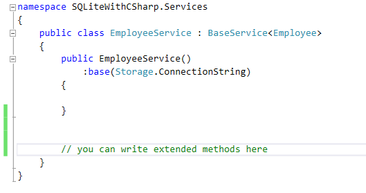

# How to use SQLite with CSharp
## Requires
- Visual Studio 2015
## License
- MIT
## Technologies
- C#
- SQLite
## Topics
- Architecture and Design
## Updated
- 03/18/2017
## Description

SQLite is open source file system database. Unlike SQL Server, this doesn&rsquo;t require any service to interact with database. But the real problem happens when we try to interact with SQLite DB in C#. There is no proper entity framework support available
 as of now. So, we, somewhat, become compelled to use inline queries. After working on Linq and Entity framework-like ORM, it feels quite irritating to write inline queries for CRUD operation in SQLite DB. So, can we use quasi-lambda codes to interact with
 such file system DB? Can we avoid hardcoded table/column names from our C# code? If you ask me these questions, I would say &ldquo;Absolutely&rdquo;.

In the below article, I will show you &ndash;

&nbsp;

<ul>
<li>How to architect a SQLite &#43;C# client application without any ORM. </li><li>How to use reflection and generic to create your custom and extensible ORM to interact with SQLite database.
</li><li>Also, how to optimize code and its maintainability. </li></ul>

Let&rsquo;s get started&hellip;.

&nbsp;

First of all let&rsquo;s create a SQLite database using any SQLite manager. In our case, say, we have only one table inside the database &ndash; Employee.

Database name: SQLiteDemo.db and table name and schema as follows.

Now, we have to create our solution and tiers. In my case, I will create a solution as give below.

<strong>SQLiteWithCSharp</strong> : It is the host. It can be windows form application of WPF application or any other.

<strong>SQLiteWithCSharp.Common</strong> : As the name says, it can be used by all the projects under this solution.

<strong>SQLiteWithCSharp.Models </strong>: This class library will contain all the model classes. The model class name will be exactly same as the table name (&ldquo;Employee&rdquo;). And properties will be same as column names. These model classes will
 be exactly similar to entity classes in case of entity framework with SQL Server. Another point I must mention at this moment is, each property will be decorated with a custom attribute called DbColumn which denotes it to be a table column in database. I will
 explain this custom attribute little later.

Employee model class looks like this.

&nbsp;

&nbsp;

C#

Edit|Remove

csharp
<pre class="hidden">public class Employee
    {
        [DbColumn(IsIdentity =true, IsPrimary =true)]
        public long EmployeeId { get; set; }
        [DbColumn]
        public string Name { get; set; }
        [DbColumn]
        public string JobDescription { get; set; }
        [DbColumn]
        public string Technology { get; set; }
        [DbColumn]
        public string Email { get; set; }

        public long Age { get; set; }

    }
</pre>

<pre class="csharp">publicclass&nbsp;Employee&nbsp;
&nbsp;&nbsp;&nbsp;&nbsp;{&nbsp;
&nbsp;&nbsp;&nbsp;&nbsp;&nbsp;&nbsp;&nbsp;&nbsp;[DbColumn(IsIdentity&nbsp;=true,&nbsp;IsPrimary&nbsp;=true)]&nbsp;
&nbsp;&nbsp;&nbsp;&nbsp;&nbsp;&nbsp;&nbsp;&nbsp;publiclong&nbsp;EmployeeId&nbsp;{&nbsp;get;&nbsp;set;&nbsp;}&nbsp;
&nbsp;&nbsp;&nbsp;&nbsp;&nbsp;&nbsp;&nbsp;&nbsp;[DbColumn]&nbsp;
&nbsp;&nbsp;&nbsp;&nbsp;&nbsp;&nbsp;&nbsp;&nbsp;publicstring&nbsp;Name&nbsp;{&nbsp;get;&nbsp;set;&nbsp;}&nbsp;
&nbsp;&nbsp;&nbsp;&nbsp;&nbsp;&nbsp;&nbsp;&nbsp;[DbColumn]&nbsp;
&nbsp;&nbsp;&nbsp;&nbsp;&nbsp;&nbsp;&nbsp;&nbsp;publicstring&nbsp;JobDescription&nbsp;{&nbsp;get;&nbsp;set;&nbsp;}&nbsp;
&nbsp;&nbsp;&nbsp;&nbsp;&nbsp;&nbsp;&nbsp;&nbsp;[DbColumn]&nbsp;
&nbsp;&nbsp;&nbsp;&nbsp;&nbsp;&nbsp;&nbsp;&nbsp;publicstring&nbsp;Technology&nbsp;{&nbsp;get;&nbsp;set;&nbsp;}&nbsp;
&nbsp;&nbsp;&nbsp;&nbsp;&nbsp;&nbsp;&nbsp;&nbsp;[DbColumn]&nbsp;
&nbsp;&nbsp;&nbsp;&nbsp;&nbsp;&nbsp;&nbsp;&nbsp;publicstring&nbsp;Email&nbsp;{&nbsp;get;&nbsp;set;&nbsp;}&nbsp;
&nbsp;
&nbsp;&nbsp;&nbsp;&nbsp;&nbsp;&nbsp;&nbsp;&nbsp;publiclong&nbsp;Age&nbsp;{&nbsp;get;&nbsp;set;&nbsp;}&nbsp;
&nbsp;
&nbsp;&nbsp;&nbsp;&nbsp;}&nbsp;
</pre>

&nbsp;

<strong>SQLiteWithCSharp.Services</strong>: This library contains all the CRUD operation methods and business logics. You can also go one step ahead and split into multiple libraries for your own convenience.

<strong>SQLiteWithCSharp.Utility</strong>: This is the heart of the CRUD operation. It contains all the operations but in very usable and generic form.

&nbsp;

From my attached solution, you can figure out how these projects are referencing each other.

Now, let&rsquo;s go over the Utility library.

&nbsp;

This custom attribute is used for decorating a property in model class.

&nbsp;

C#

Edit|Remove

csharp
<pre class="hidden">public class DbColumnAttribute : Attribute
{
        /// &lt;summary&gt;
        /// Set true if implicit conversion is required.
        /// &lt;/summary&gt;
        public bool Convert { get; set; }
        /// &lt;summary&gt;
        /// Set true if the property is primary key in the table
        /// &lt;/summary&gt;
        public bool IsPrimary { get; set; }
        /// &lt;summary&gt;
        /// denotes if the field is an identity type or not.
        /// &lt;/summary&gt;
        public bool IsIdentity { get; set; }
}
</pre>

<pre class="csharp">public&nbsp;class&nbsp;DbColumnAttribute&nbsp;:&nbsp;Attribute&nbsp;
{&nbsp;
&nbsp;&nbsp;&nbsp;&nbsp;&nbsp;&nbsp;&nbsp;&nbsp;///&nbsp;&lt;summary&gt;&nbsp;
&nbsp;&nbsp;&nbsp;&nbsp;&nbsp;&nbsp;&nbsp;&nbsp;///&nbsp;Set&nbsp;true&nbsp;if&nbsp;implicit&nbsp;conversion&nbsp;is&nbsp;required.&nbsp;
&nbsp;&nbsp;&nbsp;&nbsp;&nbsp;&nbsp;&nbsp;&nbsp;///&nbsp;&lt;/summary&gt;&nbsp;
&nbsp;&nbsp;&nbsp;&nbsp;&nbsp;&nbsp;&nbsp;&nbsp;public&nbsp;bool&nbsp;Convert&nbsp;{&nbsp;get;&nbsp;set;&nbsp;}&nbsp;
&nbsp;&nbsp;&nbsp;&nbsp;&nbsp;&nbsp;&nbsp;&nbsp;///&nbsp;&lt;summary&gt;&nbsp;
&nbsp;&nbsp;&nbsp;&nbsp;&nbsp;&nbsp;&nbsp;&nbsp;///&nbsp;Set&nbsp;true&nbsp;if&nbsp;the&nbsp;property&nbsp;is&nbsp;primary&nbsp;key&nbsp;in&nbsp;the&nbsp;table&nbsp;
&nbsp;&nbsp;&nbsp;&nbsp;&nbsp;&nbsp;&nbsp;&nbsp;///&nbsp;&lt;/summary&gt;&nbsp;
&nbsp;&nbsp;&nbsp;&nbsp;&nbsp;&nbsp;&nbsp;&nbsp;public&nbsp;bool&nbsp;IsPrimary&nbsp;{&nbsp;get;&nbsp;set;&nbsp;}&nbsp;
&nbsp;&nbsp;&nbsp;&nbsp;&nbsp;&nbsp;&nbsp;&nbsp;///&nbsp;&lt;summary&gt;&nbsp;
&nbsp;&nbsp;&nbsp;&nbsp;&nbsp;&nbsp;&nbsp;&nbsp;///&nbsp;denotes&nbsp;if&nbsp;the&nbsp;field&nbsp;is&nbsp;an&nbsp;identity&nbsp;type&nbsp;or&nbsp;not.&nbsp;
&nbsp;&nbsp;&nbsp;&nbsp;&nbsp;&nbsp;&nbsp;&nbsp;///&nbsp;&lt;/summary&gt;&nbsp;
&nbsp;&nbsp;&nbsp;&nbsp;&nbsp;&nbsp;&nbsp;&nbsp;public&nbsp;bool&nbsp;IsIdentity&nbsp;{&nbsp;get;&nbsp;set;&nbsp;}&nbsp;
}&nbsp;
</pre>

&nbsp;This interface basically is implemented by a custom class called Filter which provides you the capability to use member expression to get filtered records in optimized way.

C#

Edit|Remove

csharp
<pre class="hidden">public interface IFilter&lt;T&gt; where T : class, new()
    {
        string EntityName { get; }
        string Query { get; }

        void Add(Expression&lt;Func&lt;T, object&gt;&gt; memberExpression, object memberValue);
    }
</pre>

<pre class="csharp">public&nbsp;interface&nbsp;IFilter&lt;T&gt;&nbsp;where&nbsp;T&nbsp;:&nbsp;class,&nbsp;new()&nbsp;
&nbsp;&nbsp;&nbsp;&nbsp;{&nbsp;
&nbsp;&nbsp;&nbsp;&nbsp;&nbsp;&nbsp;&nbsp;&nbsp;string&nbsp;EntityName&nbsp;{&nbsp;get;&nbsp;}&nbsp;
&nbsp;&nbsp;&nbsp;&nbsp;&nbsp;&nbsp;&nbsp;&nbsp;string&nbsp;Query&nbsp;{&nbsp;get;&nbsp;}&nbsp;
&nbsp;
&nbsp;&nbsp;&nbsp;&nbsp;&nbsp;&nbsp;&nbsp;&nbsp;void&nbsp;Add(Expression&lt;Func&lt;T,&nbsp;object&gt;&gt;&nbsp;memberExpression,&nbsp;object&nbsp;memberValue);&nbsp;
&nbsp;&nbsp;&nbsp;&nbsp;}&nbsp;
</pre>

&nbsp;

C#

Edit|Remove

csharp
<pre class="hidden">public class Filter&lt;T&gt; : IFilter&lt;T&gt; where T : class, new()
    {

        public Filter()
        {
            _Query = new StringBuilder();
            EntityName = typeof(T).Name;
        }

        public void Add(Expression&lt;Func&lt;T, object&gt;&gt; memberExpression, object memberValue)
        {

            if (_Query.ToString() != string.Empty)
                _Query.Append(&quot; AND &quot;);

            _Query.Append(string.Format(&quot; [{0}] = {1}&quot;, NameOf(memberExpression), memberValue == null ? &quot;NULL&quot; : string.Format(&quot;'{0}'&quot;, memberValue)));
        }

        public string EntityName { get; private set; }

        private readonly StringBuilder _Query;

        public string Query
        {
            get
            {
                return string.Format(&quot;SELECT * FROM [{0}] {1} {2};&quot;
                    , EntityName
                    , _Query.ToString() == string.Empty ? string.Empty : &quot;WHERE&quot;
                    , _Query.ToString());
            }
        }

        private string NameOf(Expression&lt;Func&lt;T, object&gt;&gt; exp)
        {
            MemberExpression body = exp.Body as MemberExpression;

            if (body == null)
            {
                UnaryExpression ubody = (UnaryExpression)exp.Body;
                body = ubody.Operand as MemberExpression;
            }

            return body.Member.Name;
        }
    }
</pre>

<pre class="csharp">public&nbsp;class&nbsp;Filter&lt;T&gt;&nbsp;:&nbsp;IFilter&lt;T&gt;&nbsp;where&nbsp;T&nbsp;:&nbsp;class,&nbsp;new()&nbsp;
&nbsp;&nbsp;&nbsp;&nbsp;{&nbsp;
&nbsp;
&nbsp;&nbsp;&nbsp;&nbsp;&nbsp;&nbsp;&nbsp;&nbsp;public&nbsp;Filter()&nbsp;
&nbsp;&nbsp;&nbsp;&nbsp;&nbsp;&nbsp;&nbsp;&nbsp;{&nbsp;
&nbsp;&nbsp;&nbsp;&nbsp;&nbsp;&nbsp;&nbsp;&nbsp;&nbsp;&nbsp;&nbsp;&nbsp;_Query&nbsp;=&nbsp;new&nbsp;StringBuilder();&nbsp;
&nbsp;&nbsp;&nbsp;&nbsp;&nbsp;&nbsp;&nbsp;&nbsp;&nbsp;&nbsp;&nbsp;&nbsp;EntityName&nbsp;=&nbsp;typeof(T).Name;&nbsp;
&nbsp;&nbsp;&nbsp;&nbsp;&nbsp;&nbsp;&nbsp;&nbsp;}&nbsp;
&nbsp;
&nbsp;&nbsp;&nbsp;&nbsp;&nbsp;&nbsp;&nbsp;&nbsp;public&nbsp;void&nbsp;Add(Expression&lt;Func&lt;T,&nbsp;object&gt;&gt;&nbsp;memberExpression,&nbsp;object&nbsp;memberValue)&nbsp;
&nbsp;&nbsp;&nbsp;&nbsp;&nbsp;&nbsp;&nbsp;&nbsp;{&nbsp;
&nbsp;
&nbsp;&nbsp;&nbsp;&nbsp;&nbsp;&nbsp;&nbsp;&nbsp;&nbsp;&nbsp;&nbsp;&nbsp;if&nbsp;(_Query.ToString()&nbsp;!=&nbsp;string.Empty)&nbsp;
&nbsp;&nbsp;&nbsp;&nbsp;&nbsp;&nbsp;&nbsp;&nbsp;&nbsp;&nbsp;&nbsp;&nbsp;&nbsp;&nbsp;&nbsp;&nbsp;_Query.Append(&quot;&nbsp;AND&nbsp;&quot;);&nbsp;
&nbsp;
&nbsp;&nbsp;&nbsp;&nbsp;&nbsp;&nbsp;&nbsp;&nbsp;&nbsp;&nbsp;&nbsp;&nbsp;_Query.Append(string.Format(&quot;&nbsp;[{0}]&nbsp;=&nbsp;{1}&quot;,&nbsp;NameOf(memberExpression),&nbsp;memberValue&nbsp;==&nbsp;null&nbsp;?&nbsp;&quot;NULL&quot;&nbsp;:&nbsp;string.Format(&quot;'{0}'&quot;,&nbsp;memberValue)));&nbsp;
&nbsp;&nbsp;&nbsp;&nbsp;&nbsp;&nbsp;&nbsp;&nbsp;}&nbsp;
&nbsp;
&nbsp;&nbsp;&nbsp;&nbsp;&nbsp;&nbsp;&nbsp;&nbsp;public&nbsp;string&nbsp;EntityName&nbsp;{&nbsp;get;&nbsp;private&nbsp;set;&nbsp;}&nbsp;
&nbsp;
&nbsp;&nbsp;&nbsp;&nbsp;&nbsp;&nbsp;&nbsp;&nbsp;private&nbsp;readonly&nbsp;StringBuilder&nbsp;_Query;&nbsp;
&nbsp;
&nbsp;&nbsp;&nbsp;&nbsp;&nbsp;&nbsp;&nbsp;&nbsp;public&nbsp;string&nbsp;Query&nbsp;
&nbsp;&nbsp;&nbsp;&nbsp;&nbsp;&nbsp;&nbsp;&nbsp;{&nbsp;
&nbsp;&nbsp;&nbsp;&nbsp;&nbsp;&nbsp;&nbsp;&nbsp;&nbsp;&nbsp;&nbsp;&nbsp;get&nbsp;
&nbsp;&nbsp;&nbsp;&nbsp;&nbsp;&nbsp;&nbsp;&nbsp;&nbsp;&nbsp;&nbsp;&nbsp;{&nbsp;
&nbsp;&nbsp;&nbsp;&nbsp;&nbsp;&nbsp;&nbsp;&nbsp;&nbsp;&nbsp;&nbsp;&nbsp;&nbsp;&nbsp;&nbsp;&nbsp;return&nbsp;string.Format(&quot;SELECT&nbsp;*&nbsp;FROM&nbsp;[{0}]&nbsp;{1}&nbsp;{2};&quot;&nbsp;
&nbsp;&nbsp;&nbsp;&nbsp;&nbsp;&nbsp;&nbsp;&nbsp;&nbsp;&nbsp;&nbsp;&nbsp;&nbsp;&nbsp;&nbsp;&nbsp;&nbsp;&nbsp;&nbsp;&nbsp;,&nbsp;EntityName&nbsp;
&nbsp;&nbsp;&nbsp;&nbsp;&nbsp;&nbsp;&nbsp;&nbsp;&nbsp;&nbsp;&nbsp;&nbsp;&nbsp;&nbsp;&nbsp;&nbsp;&nbsp;&nbsp;&nbsp;&nbsp;,&nbsp;_Query.ToString()&nbsp;==&nbsp;string.Empty&nbsp;?&nbsp;string.Empty&nbsp;:&nbsp;&quot;WHERE&quot;&nbsp;
&nbsp;&nbsp;&nbsp;&nbsp;&nbsp;&nbsp;&nbsp;&nbsp;&nbsp;&nbsp;&nbsp;&nbsp;&nbsp;&nbsp;&nbsp;&nbsp;&nbsp;&nbsp;&nbsp;&nbsp;,&nbsp;_Query.ToString());&nbsp;
&nbsp;&nbsp;&nbsp;&nbsp;&nbsp;&nbsp;&nbsp;&nbsp;&nbsp;&nbsp;&nbsp;&nbsp;}&nbsp;
&nbsp;&nbsp;&nbsp;&nbsp;&nbsp;&nbsp;&nbsp;&nbsp;}&nbsp;
&nbsp;
&nbsp;&nbsp;&nbsp;&nbsp;&nbsp;&nbsp;&nbsp;&nbsp;private&nbsp;string&nbsp;NameOf(Expression&lt;Func&lt;T,&nbsp;object&gt;&gt;&nbsp;exp)&nbsp;
&nbsp;&nbsp;&nbsp;&nbsp;&nbsp;&nbsp;&nbsp;&nbsp;{&nbsp;
&nbsp;&nbsp;&nbsp;&nbsp;&nbsp;&nbsp;&nbsp;&nbsp;&nbsp;&nbsp;&nbsp;&nbsp;MemberExpression&nbsp;body&nbsp;=&nbsp;exp.Body&nbsp;as&nbsp;MemberExpression;&nbsp;
&nbsp;
&nbsp;&nbsp;&nbsp;&nbsp;&nbsp;&nbsp;&nbsp;&nbsp;&nbsp;&nbsp;&nbsp;&nbsp;if&nbsp;(body&nbsp;==&nbsp;null)&nbsp;
&nbsp;&nbsp;&nbsp;&nbsp;&nbsp;&nbsp;&nbsp;&nbsp;&nbsp;&nbsp;&nbsp;&nbsp;{&nbsp;
&nbsp;&nbsp;&nbsp;&nbsp;&nbsp;&nbsp;&nbsp;&nbsp;&nbsp;&nbsp;&nbsp;&nbsp;&nbsp;&nbsp;&nbsp;&nbsp;UnaryExpression&nbsp;ubody&nbsp;=&nbsp;(UnaryExpression)exp.Body;&nbsp;
&nbsp;&nbsp;&nbsp;&nbsp;&nbsp;&nbsp;&nbsp;&nbsp;&nbsp;&nbsp;&nbsp;&nbsp;&nbsp;&nbsp;&nbsp;&nbsp;body&nbsp;=&nbsp;ubody.Operand&nbsp;as&nbsp;MemberExpression;&nbsp;
&nbsp;&nbsp;&nbsp;&nbsp;&nbsp;&nbsp;&nbsp;&nbsp;&nbsp;&nbsp;&nbsp;&nbsp;}&nbsp;
&nbsp;
&nbsp;&nbsp;&nbsp;&nbsp;&nbsp;&nbsp;&nbsp;&nbsp;&nbsp;&nbsp;&nbsp;&nbsp;return&nbsp;body.Member.Name;&nbsp;
&nbsp;&nbsp;&nbsp;&nbsp;&nbsp;&nbsp;&nbsp;&nbsp;}&nbsp;
&nbsp;&nbsp;&nbsp;&nbsp;}&nbsp;
</pre>

&nbsp;

Now we have a class called EntityMapper which actually reads the SQLite db reader and fills in the property values.

C#

Edit|Remove

csharp
<pre class="hidden">public class EntityMapper
    {
        // Complete
        public IList&lt;T&gt; Map&lt;T&gt;(SQLiteDataReader reader)
            where T : class, new()
        {
            IList&lt;T&gt; collection = new List&lt;T&gt;();
            while (reader.Read())
            {
                T obj = new T();
                foreach (PropertyInfo i in obj.GetType().GetProperties()
                    .Where(p =&gt; p.CustomAttributes.FirstOrDefault(x =&gt; x.AttributeType == typeof(DbColumnAttribute)) != null).ToList())
                {

                    try
                    {
                        var ca = i.GetCustomAttribute(typeof(DbColumnAttribute));

                        if (ca != null)
                        {
                            if (((DbColumnAttribute)ca).Convert == true)
                            {
                                if (reader[i.Name] != DBNull.Value)
                                    i.SetValue(obj, Convert.ChangeType(reader[i.Name], i.PropertyType));
                            }
                            else
                            {
                                if (reader[i.Name] != DBNull.Value)
                                    i.SetValue(obj, reader[i.Name]);
                            }
                        }
                    }
                    catch (Exception ex)
                    {
#if DEBUG
                        Console.WriteLine(ex.Message);
                        Console.ReadLine();
#endif

#if !DEBUG
                        throw ex;
#endif
                    }
                }

                collection.Add(obj);
            }

            return collection;
        }

    }
</pre>

<pre class="csharp">public&nbsp;class&nbsp;EntityMapper&nbsp;
&nbsp;&nbsp;&nbsp;&nbsp;{&nbsp;
&nbsp;&nbsp;&nbsp;&nbsp;&nbsp;&nbsp;&nbsp;&nbsp;//&nbsp;Complete&nbsp;
&nbsp;&nbsp;&nbsp;&nbsp;&nbsp;&nbsp;&nbsp;&nbsp;public&nbsp;IList&lt;T&gt;&nbsp;Map&lt;T&gt;(SQLiteDataReader&nbsp;reader)&nbsp;
&nbsp;&nbsp;&nbsp;&nbsp;&nbsp;&nbsp;&nbsp;&nbsp;&nbsp;&nbsp;&nbsp;&nbsp;where&nbsp;T&nbsp;:&nbsp;class,&nbsp;new()&nbsp;
&nbsp;&nbsp;&nbsp;&nbsp;&nbsp;&nbsp;&nbsp;&nbsp;{&nbsp;
&nbsp;&nbsp;&nbsp;&nbsp;&nbsp;&nbsp;&nbsp;&nbsp;&nbsp;&nbsp;&nbsp;&nbsp;IList&lt;T&gt;&nbsp;collection&nbsp;=&nbsp;new&nbsp;List&lt;T&gt;();&nbsp;
&nbsp;&nbsp;&nbsp;&nbsp;&nbsp;&nbsp;&nbsp;&nbsp;&nbsp;&nbsp;&nbsp;&nbsp;while&nbsp;(reader.Read())&nbsp;
&nbsp;&nbsp;&nbsp;&nbsp;&nbsp;&nbsp;&nbsp;&nbsp;&nbsp;&nbsp;&nbsp;&nbsp;{&nbsp;
&nbsp;&nbsp;&nbsp;&nbsp;&nbsp;&nbsp;&nbsp;&nbsp;&nbsp;&nbsp;&nbsp;&nbsp;&nbsp;&nbsp;&nbsp;&nbsp;T&nbsp;obj&nbsp;=&nbsp;new&nbsp;T();&nbsp;
&nbsp;&nbsp;&nbsp;&nbsp;&nbsp;&nbsp;&nbsp;&nbsp;&nbsp;&nbsp;&nbsp;&nbsp;&nbsp;&nbsp;&nbsp;&nbsp;foreach&nbsp;(PropertyInfo&nbsp;i&nbsp;in&nbsp;obj.GetType().GetProperties()&nbsp;
&nbsp;&nbsp;&nbsp;&nbsp;&nbsp;&nbsp;&nbsp;&nbsp;&nbsp;&nbsp;&nbsp;&nbsp;&nbsp;&nbsp;&nbsp;&nbsp;&nbsp;&nbsp;&nbsp;&nbsp;.Where(p&nbsp;=&gt;&nbsp;p.CustomAttributes.FirstOrDefault(x&nbsp;=&gt;&nbsp;x.AttributeType&nbsp;==&nbsp;typeof(DbColumnAttribute))&nbsp;!=&nbsp;null).ToList())&nbsp;
&nbsp;&nbsp;&nbsp;&nbsp;&nbsp;&nbsp;&nbsp;&nbsp;&nbsp;&nbsp;&nbsp;&nbsp;&nbsp;&nbsp;&nbsp;&nbsp;{&nbsp;
&nbsp;
&nbsp;&nbsp;&nbsp;&nbsp;&nbsp;&nbsp;&nbsp;&nbsp;&nbsp;&nbsp;&nbsp;&nbsp;&nbsp;&nbsp;&nbsp;&nbsp;&nbsp;&nbsp;&nbsp;&nbsp;try&nbsp;
&nbsp;&nbsp;&nbsp;&nbsp;&nbsp;&nbsp;&nbsp;&nbsp;&nbsp;&nbsp;&nbsp;&nbsp;&nbsp;&nbsp;&nbsp;&nbsp;&nbsp;&nbsp;&nbsp;&nbsp;{&nbsp;
&nbsp;&nbsp;&nbsp;&nbsp;&nbsp;&nbsp;&nbsp;&nbsp;&nbsp;&nbsp;&nbsp;&nbsp;&nbsp;&nbsp;&nbsp;&nbsp;&nbsp;&nbsp;&nbsp;&nbsp;&nbsp;&nbsp;&nbsp;&nbsp;var&nbsp;ca&nbsp;=&nbsp;i.GetCustomAttribute(typeof(DbColumnAttribute));&nbsp;
&nbsp;
&nbsp;&nbsp;&nbsp;&nbsp;&nbsp;&nbsp;&nbsp;&nbsp;&nbsp;&nbsp;&nbsp;&nbsp;&nbsp;&nbsp;&nbsp;&nbsp;&nbsp;&nbsp;&nbsp;&nbsp;&nbsp;&nbsp;&nbsp;&nbsp;if&nbsp;(ca&nbsp;!=&nbsp;null)&nbsp;
&nbsp;&nbsp;&nbsp;&nbsp;&nbsp;&nbsp;&nbsp;&nbsp;&nbsp;&nbsp;&nbsp;&nbsp;&nbsp;&nbsp;&nbsp;&nbsp;&nbsp;&nbsp;&nbsp;&nbsp;&nbsp;&nbsp;&nbsp;&nbsp;{&nbsp;
&nbsp;&nbsp;&nbsp;&nbsp;&nbsp;&nbsp;&nbsp;&nbsp;&nbsp;&nbsp;&nbsp;&nbsp;&nbsp;&nbsp;&nbsp;&nbsp;&nbsp;&nbsp;&nbsp;&nbsp;&nbsp;&nbsp;&nbsp;&nbsp;&nbsp;&nbsp;&nbsp;&nbsp;if&nbsp;(((DbColumnAttribute)ca).Convert&nbsp;==&nbsp;true)&nbsp;
&nbsp;&nbsp;&nbsp;&nbsp;&nbsp;&nbsp;&nbsp;&nbsp;&nbsp;&nbsp;&nbsp;&nbsp;&nbsp;&nbsp;&nbsp;&nbsp;&nbsp;&nbsp;&nbsp;&nbsp;&nbsp;&nbsp;&nbsp;&nbsp;&nbsp;&nbsp;&nbsp;&nbsp;{&nbsp;
&nbsp;&nbsp;&nbsp;&nbsp;&nbsp;&nbsp;&nbsp;&nbsp;&nbsp;&nbsp;&nbsp;&nbsp;&nbsp;&nbsp;&nbsp;&nbsp;&nbsp;&nbsp;&nbsp;&nbsp;&nbsp;&nbsp;&nbsp;&nbsp;&nbsp;&nbsp;&nbsp;&nbsp;&nbsp;&nbsp;&nbsp;&nbsp;if&nbsp;(reader[i.Name]&nbsp;!=&nbsp;DBNull.Value)&nbsp;
&nbsp;&nbsp;&nbsp;&nbsp;&nbsp;&nbsp;&nbsp;&nbsp;&nbsp;&nbsp;&nbsp;&nbsp;&nbsp;&nbsp;&nbsp;&nbsp;&nbsp;&nbsp;&nbsp;&nbsp;&nbsp;&nbsp;&nbsp;&nbsp;&nbsp;&nbsp;&nbsp;&nbsp;&nbsp;&nbsp;&nbsp;&nbsp;&nbsp;&nbsp;&nbsp;&nbsp;i.SetValue(obj,&nbsp;Convert.ChangeType(reader[i.Name],&nbsp;i.PropertyType));&nbsp;
&nbsp;&nbsp;&nbsp;&nbsp;&nbsp;&nbsp;&nbsp;&nbsp;&nbsp;&nbsp;&nbsp;&nbsp;&nbsp;&nbsp;&nbsp;&nbsp;&nbsp;&nbsp;&nbsp;&nbsp;&nbsp;&nbsp;&nbsp;&nbsp;&nbsp;&nbsp;&nbsp;&nbsp;}&nbsp;
&nbsp;&nbsp;&nbsp;&nbsp;&nbsp;&nbsp;&nbsp;&nbsp;&nbsp;&nbsp;&nbsp;&nbsp;&nbsp;&nbsp;&nbsp;&nbsp;&nbsp;&nbsp;&nbsp;&nbsp;&nbsp;&nbsp;&nbsp;&nbsp;&nbsp;&nbsp;&nbsp;&nbsp;else&nbsp;
&nbsp;&nbsp;&nbsp;&nbsp;&nbsp;&nbsp;&nbsp;&nbsp;&nbsp;&nbsp;&nbsp;&nbsp;&nbsp;&nbsp;&nbsp;&nbsp;&nbsp;&nbsp;&nbsp;&nbsp;&nbsp;&nbsp;&nbsp;&nbsp;&nbsp;&nbsp;&nbsp;&nbsp;{&nbsp;
&nbsp;&nbsp;&nbsp;&nbsp;&nbsp;&nbsp;&nbsp;&nbsp;&nbsp;&nbsp;&nbsp;&nbsp;&nbsp;&nbsp;&nbsp;&nbsp;&nbsp;&nbsp;&nbsp;&nbsp;&nbsp;&nbsp;&nbsp;&nbsp;&nbsp;&nbsp;&nbsp;&nbsp;&nbsp;&nbsp;&nbsp;&nbsp;if&nbsp;(reader[i.Name]&nbsp;!=&nbsp;DBNull.Value)&nbsp;
&nbsp;&nbsp;&nbsp;&nbsp;&nbsp;&nbsp;&nbsp;&nbsp;&nbsp;&nbsp;&nbsp;&nbsp;&nbsp;&nbsp;&nbsp;&nbsp;&nbsp;&nbsp;&nbsp;&nbsp;&nbsp;&nbsp;&nbsp;&nbsp;&nbsp;&nbsp;&nbsp;&nbsp;&nbsp;&nbsp;&nbsp;&nbsp;&nbsp;&nbsp;&nbsp;&nbsp;i.SetValue(obj,&nbsp;reader[i.Name]);&nbsp;
&nbsp;&nbsp;&nbsp;&nbsp;&nbsp;&nbsp;&nbsp;&nbsp;&nbsp;&nbsp;&nbsp;&nbsp;&nbsp;&nbsp;&nbsp;&nbsp;&nbsp;&nbsp;&nbsp;&nbsp;&nbsp;&nbsp;&nbsp;&nbsp;&nbsp;&nbsp;&nbsp;&nbsp;}&nbsp;
&nbsp;&nbsp;&nbsp;&nbsp;&nbsp;&nbsp;&nbsp;&nbsp;&nbsp;&nbsp;&nbsp;&nbsp;&nbsp;&nbsp;&nbsp;&nbsp;&nbsp;&nbsp;&nbsp;&nbsp;&nbsp;&nbsp;&nbsp;&nbsp;}&nbsp;
&nbsp;&nbsp;&nbsp;&nbsp;&nbsp;&nbsp;&nbsp;&nbsp;&nbsp;&nbsp;&nbsp;&nbsp;&nbsp;&nbsp;&nbsp;&nbsp;&nbsp;&nbsp;&nbsp;&nbsp;}&nbsp;
&nbsp;&nbsp;&nbsp;&nbsp;&nbsp;&nbsp;&nbsp;&nbsp;&nbsp;&nbsp;&nbsp;&nbsp;&nbsp;&nbsp;&nbsp;&nbsp;&nbsp;&nbsp;&nbsp;&nbsp;catch&nbsp;(Exception&nbsp;ex)&nbsp;
&nbsp;&nbsp;&nbsp;&nbsp;&nbsp;&nbsp;&nbsp;&nbsp;&nbsp;&nbsp;&nbsp;&nbsp;&nbsp;&nbsp;&nbsp;&nbsp;&nbsp;&nbsp;&nbsp;&nbsp;{&nbsp;
#if&nbsp;DEBUG&nbsp;
&nbsp;&nbsp;&nbsp;&nbsp;&nbsp;&nbsp;&nbsp;&nbsp;&nbsp;&nbsp;&nbsp;&nbsp;&nbsp;&nbsp;&nbsp;&nbsp;&nbsp;&nbsp;&nbsp;&nbsp;&nbsp;&nbsp;&nbsp;&nbsp;Console.WriteLine(ex.Message);&nbsp;
&nbsp;&nbsp;&nbsp;&nbsp;&nbsp;&nbsp;&nbsp;&nbsp;&nbsp;&nbsp;&nbsp;&nbsp;&nbsp;&nbsp;&nbsp;&nbsp;&nbsp;&nbsp;&nbsp;&nbsp;&nbsp;&nbsp;&nbsp;&nbsp;Console.ReadLine();&nbsp;
#endif&nbsp;
&nbsp;
#if&nbsp;!DEBUG&nbsp;
&nbsp;&nbsp;&nbsp;&nbsp;&nbsp;&nbsp;&nbsp;&nbsp;&nbsp;&nbsp;&nbsp;&nbsp;&nbsp;&nbsp;&nbsp;&nbsp;&nbsp;&nbsp;&nbsp;&nbsp;&nbsp;&nbsp;&nbsp;&nbsp;throw&nbsp;ex;&nbsp;
#endif&nbsp;
&nbsp;&nbsp;&nbsp;&nbsp;&nbsp;&nbsp;&nbsp;&nbsp;&nbsp;&nbsp;&nbsp;&nbsp;&nbsp;&nbsp;&nbsp;&nbsp;&nbsp;&nbsp;&nbsp;&nbsp;}&nbsp;
&nbsp;&nbsp;&nbsp;&nbsp;&nbsp;&nbsp;&nbsp;&nbsp;&nbsp;&nbsp;&nbsp;&nbsp;&nbsp;&nbsp;&nbsp;&nbsp;}&nbsp;
&nbsp;
&nbsp;&nbsp;&nbsp;&nbsp;&nbsp;&nbsp;&nbsp;&nbsp;&nbsp;&nbsp;&nbsp;&nbsp;&nbsp;&nbsp;&nbsp;&nbsp;collection.Add(obj);&nbsp;
&nbsp;&nbsp;&nbsp;&nbsp;&nbsp;&nbsp;&nbsp;&nbsp;&nbsp;&nbsp;&nbsp;&nbsp;}&nbsp;
&nbsp;
&nbsp;&nbsp;&nbsp;&nbsp;&nbsp;&nbsp;&nbsp;&nbsp;&nbsp;&nbsp;&nbsp;&nbsp;return&nbsp;collection;&nbsp;
&nbsp;&nbsp;&nbsp;&nbsp;&nbsp;&nbsp;&nbsp;&nbsp;}&nbsp;
&nbsp;
&nbsp;&nbsp;&nbsp;&nbsp;}&nbsp;
</pre>

&nbsp;

The below class is called BaseService which is inherited by all the service classes (example: EmployeeService). It provies basic CRUD operations to all the service classes. The above-montioned claases, attributes, interfaces are used and the BaseService
 methods are prepared. The methods are given below. Since the code is bit lengthy, you can get the complete working code from the attachment. Here I will explain only the methods inside BaseService and how to use them.

C#

Edit|Remove

csharp
<pre class="hidden">public long Add(T entity) // to insert single entity.
public void AddRange(IList&lt;T&gt; entities) // to bulk-insert multiple entities
public void Update(T entity) // to update one entity
public void UpdateRange(IList&lt;T&gt; entities) // to update multiple entities
public T GetById(object id) // get single entity by its Id
public IList&lt;T&gt; Find(IEnumerable&lt;object&gt; ids) // get multiple entities by ids
public IList&lt;T&gt; Find(IFilter&lt;T&gt; filter) // find entities by filter criteria
public IList&lt;T&gt; GetAll() // to get all entities
</pre>

<pre class="csharp">publiclong&nbsp;Add(T&nbsp;entity)&nbsp;//&nbsp;to&nbsp;insert&nbsp;single&nbsp;entity.publicvoid&nbsp;AddRange(IList&lt;T&gt;&nbsp;entities)&nbsp;//&nbsp;to&nbsp;bulk-insert&nbsp;multiple&nbsp;entitiespublicvoid&nbsp;Update(T&nbsp;entity)&nbsp;//&nbsp;to&nbsp;update&nbsp;one&nbsp;entitypublicvoid&nbsp;UpdateRange(IList&lt;T&gt;&nbsp;entities)&nbsp;//&nbsp;to&nbsp;update&nbsp;multiple&nbsp;entitiespublic&nbsp;T&nbsp;GetById(object&nbsp;id)&nbsp;//&nbsp;get&nbsp;single&nbsp;entity&nbsp;by&nbsp;its&nbsp;Idpublic&nbsp;IList&lt;T&gt;&nbsp;Find(IEnumerable&lt;object&gt;&nbsp;ids)&nbsp;//&nbsp;get&nbsp;multiple&nbsp;entities&nbsp;by&nbsp;idspublic&nbsp;IList&lt;T&gt;&nbsp;Find(IFilter&lt;T&gt;&nbsp;filter)&nbsp;//&nbsp;find&nbsp;entities&nbsp;by&nbsp;filter&nbsp;criteriapublic&nbsp;IList&lt;T&gt;&nbsp;GetAll()&nbsp;//&nbsp;to&nbsp;get&nbsp;all&nbsp;entities</pre>

In the solution, you will get all other methods that provide you controls over database through model classes only. You can also write or extend more.

&nbsp;Now, to insert one employee in database and to get the newly inserted employeeId (identity) in one single transaction, we need to write only few lines of code as gove below.

C#

Edit|Remove

csharp
<pre class="hidden">//Create employee object and fill the properties.
            Employee e = new Employee();
            e.Name = &quot;Swaraj&quot;;
            e.Email = &quot;swaraj.ece.jgec@gmail.com&quot;;
            e.JobDescription = &quot;Software Developer&quot;;
            e.Technology = &quot;DotNet&quot;;
            e.Age = 27;

           long generatedEmployeeId = InsertEmployee(e);
            textBox1.Text = string.Format(&quot;{0}&quot;, generatedEmployeeId);
            // Similarly call other methods
public  long InsertEmployee(Employee newEmployee)
        {
//Call the add method in employee service.
           return new EmployeeService().Add(newEmployee);
        }
</pre>

<pre class="csharp">//Create&nbsp;employee&nbsp;object&nbsp;and&nbsp;fill&nbsp;the&nbsp;properties.&nbsp;
&nbsp;&nbsp;&nbsp;&nbsp;&nbsp;&nbsp;&nbsp;&nbsp;&nbsp;&nbsp;&nbsp;&nbsp;Employee&nbsp;e&nbsp;=&nbsp;new&nbsp;Employee();&nbsp;
&nbsp;&nbsp;&nbsp;&nbsp;&nbsp;&nbsp;&nbsp;&nbsp;&nbsp;&nbsp;&nbsp;&nbsp;e.Name&nbsp;=&nbsp;&quot;Swaraj&quot;;&nbsp;
&nbsp;&nbsp;&nbsp;&nbsp;&nbsp;&nbsp;&nbsp;&nbsp;&nbsp;&nbsp;&nbsp;&nbsp;e.Email&nbsp;=&nbsp;&quot;swaraj.ece.jgec@gmail.com&quot;;&nbsp;
&nbsp;&nbsp;&nbsp;&nbsp;&nbsp;&nbsp;&nbsp;&nbsp;&nbsp;&nbsp;&nbsp;&nbsp;e.JobDescription&nbsp;=&nbsp;&quot;Software&nbsp;Developer&quot;;&nbsp;
&nbsp;&nbsp;&nbsp;&nbsp;&nbsp;&nbsp;&nbsp;&nbsp;&nbsp;&nbsp;&nbsp;&nbsp;e.Technology&nbsp;=&nbsp;&quot;DotNet&quot;;&nbsp;
&nbsp;&nbsp;&nbsp;&nbsp;&nbsp;&nbsp;&nbsp;&nbsp;&nbsp;&nbsp;&nbsp;&nbsp;e.Age&nbsp;=&nbsp;27;&nbsp;
&nbsp;
&nbsp;&nbsp;&nbsp;&nbsp;&nbsp;&nbsp;&nbsp;&nbsp;&nbsp;&nbsp;&nbsp;long&nbsp;generatedEmployeeId&nbsp;=&nbsp;InsertEmployee(e);&nbsp;
&nbsp;&nbsp;&nbsp;&nbsp;&nbsp;&nbsp;&nbsp;&nbsp;&nbsp;&nbsp;&nbsp;&nbsp;textBox1.Text&nbsp;=&nbsp;string.Format(&quot;{0}&quot;,&nbsp;generatedEmployeeId);&nbsp;
&nbsp;&nbsp;&nbsp;&nbsp;&nbsp;&nbsp;&nbsp;&nbsp;&nbsp;&nbsp;&nbsp;&nbsp;//&nbsp;Similarly&nbsp;call&nbsp;other&nbsp;methodspubliclong&nbsp;InsertEmployee(Employee&nbsp;newEmployee)&nbsp;
&nbsp;&nbsp;&nbsp;&nbsp;&nbsp;&nbsp;&nbsp;&nbsp;{&nbsp;
//Call&nbsp;the&nbsp;add&nbsp;method&nbsp;in&nbsp;employee&nbsp;service.returnnew&nbsp;EmployeeService().Add(newEmployee);&nbsp;
&nbsp;&nbsp;&nbsp;&nbsp;&nbsp;&nbsp;&nbsp;&nbsp;}&nbsp;
</pre>

The EmployeeService class looks very clean and simple. Please notice, the employee class has been passed to BaseService as an entity.

Similarly, you can update, search employees as given in the below sample methods.

C#

Edit|Remove

csharp
<pre class="hidden">public void UpdateEmployee(Employee existingEmployee)
        {
            new EmployeeService().Update(existingEmployee);
        }

        public Employee GetEmployee(long id)
        {
            return new EmployeeService().GetById(id);
        }

        public List&lt;Employee&gt; GetEmployeesByTechnology(string technology)
        {

            var employeeFilter = new Filter&lt;Employee&gt;();
            employeeFilter.Add(x =&gt; x.Technology, technology);
            // You can add more filters

            EmployeeService svc = new EmployeeService();
            return svc.Find(employeeFilter).ToList();
        }
</pre>

<pre class="csharp">publicvoid&nbsp;UpdateEmployee(Employee&nbsp;existingEmployee)&nbsp;
&nbsp;&nbsp;&nbsp;&nbsp;&nbsp;&nbsp;&nbsp;&nbsp;{&nbsp;
&nbsp;&nbsp;&nbsp;&nbsp;&nbsp;&nbsp;&nbsp;&nbsp;&nbsp;&nbsp;&nbsp;&nbsp;new&nbsp;EmployeeService().Update(existingEmployee);&nbsp;
&nbsp;&nbsp;&nbsp;&nbsp;&nbsp;&nbsp;&nbsp;&nbsp;}&nbsp;
&nbsp;
&nbsp;&nbsp;&nbsp;&nbsp;&nbsp;&nbsp;&nbsp;&nbsp;public&nbsp;Employee&nbsp;GetEmployee(long&nbsp;id)&nbsp;
&nbsp;&nbsp;&nbsp;&nbsp;&nbsp;&nbsp;&nbsp;&nbsp;{&nbsp;
&nbsp;&nbsp;&nbsp;&nbsp;&nbsp;&nbsp;&nbsp;&nbsp;&nbsp;&nbsp;&nbsp;&nbsp;returnnew&nbsp;EmployeeService().GetById(id);&nbsp;
&nbsp;&nbsp;&nbsp;&nbsp;&nbsp;&nbsp;&nbsp;&nbsp;}&nbsp;
&nbsp;
&nbsp;&nbsp;&nbsp;&nbsp;&nbsp;&nbsp;&nbsp;&nbsp;public&nbsp;List&lt;Employee&gt;&nbsp;GetEmployeesByTechnology(string&nbsp;technology)&nbsp;
&nbsp;&nbsp;&nbsp;&nbsp;&nbsp;&nbsp;&nbsp;&nbsp;{&nbsp;
&nbsp;
&nbsp;&nbsp;&nbsp;&nbsp;&nbsp;&nbsp;&nbsp;&nbsp;&nbsp;&nbsp;&nbsp;&nbsp;var&nbsp;employeeFilter&nbsp;=&nbsp;new&nbsp;Filter&lt;Employee&gt;();&nbsp;
&nbsp;&nbsp;&nbsp;&nbsp;&nbsp;&nbsp;&nbsp;&nbsp;&nbsp;&nbsp;&nbsp;&nbsp;employeeFilter.Add(x&nbsp;=&gt;&nbsp;x.Technology,&nbsp;technology);&nbsp;
&nbsp;&nbsp;&nbsp;&nbsp;&nbsp;&nbsp;&nbsp;&nbsp;&nbsp;&nbsp;&nbsp;&nbsp;//&nbsp;You&nbsp;can&nbsp;add&nbsp;more&nbsp;filters&nbsp;
&nbsp;
&nbsp;&nbsp;&nbsp;&nbsp;&nbsp;&nbsp;&nbsp;&nbsp;&nbsp;&nbsp;&nbsp;&nbsp;EmployeeService&nbsp;svc&nbsp;=&nbsp;new&nbsp;EmployeeService();&nbsp;
&nbsp;&nbsp;&nbsp;&nbsp;&nbsp;&nbsp;&nbsp;&nbsp;&nbsp;&nbsp;&nbsp;&nbsp;return&nbsp;svc.Find(employeeFilter).ToList();&nbsp;
&nbsp;&nbsp;&nbsp;&nbsp;&nbsp;&nbsp;&nbsp;&nbsp;}&nbsp;
</pre>

<strong>Conclusion:-</strong>

Thus, you can write much cleaner code while working&nbsp; with SQLite and C#.&nbsp;

&nbsp;

&nbsp;

&nbsp;

