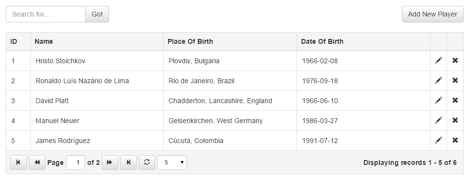

# How to use jQuery Grid with ASP.NET MVC
## Requires
- Visual Studio 2013
## License
- MIT
## Technologies
- ASP.NET MVC
- jQuery
- Javascript
- Bootstrap
## Topics
- jQuery
## Updated
- 04/19/2015
## Description

<h1>Introduction</h1>

<em>This article is going to show how you can easily implement paging, sorting, filtering and CRUD operations with jQuery Grid Plugin in ASP.NET MVC with bootstrap.</em>

<em> 
</em>

<h1>Background</h1>

<em>In the sample project that you can download from this article I'm using&nbsp;<a href="http://gijgo.com/" target="_blank">jQuery Grid</a>&nbsp;0.4.3 by gijgo.com,&nbsp;<a href="http://jquery.com/" target="_blank">jQuery</a>&nbsp;2.1.3,&nbsp;<a target="_blank">Bootstrap</a>&nbsp;3.3.4
 and&nbsp;<a href="http://www.asp.net/mvc" target="_blank">AspNet.Mvc</a>&nbsp;5.2.3.</em>

<h1>A Few Words about jQuery Grid by gijgo.com</h1>

Since the other libraries, that are in use are pretty popular compared to the grid plugin, I'm going to give you some info about this plugin.

<ul>
<li>Stylish and Featured Tabular data presentation control. </li><li>JavaScript control for representing and manipulating tabular data on the web.
</li><li>Ajax Enabled. </li><li>Can be integrated with any of the server-side technologies like ASP, JavaServelets, JSP, PHP etc.
</li><li>Very simple to integrate with ASP.NET. </li><li>Support pagination, javascript and server side data sources. </li><li>Support jQuery UI and Bootstrap. </li><li>Free open source tool distributed under MIT License. </li></ul>

You can find the documentation about the version of the plugin that is in use in this article at&nbsp;<a href="http://gijgo.com/version_0_4/Documentation" target="_blank">http://gijgo.com/version_0_4/Documentation</a>.

<em>&nbsp;</em>

<h1>Integrating jQuery Grid with ASP.NET MVC - Step By Step</h1>

&nbsp;

<li>Create new ASP.NET MVC project in visual studio. </li><li>I assume that jquery and bootstrap would be added to your ASP.NET MVC project by default. If they are not added you can find and add them to your project via nuget.
</li><li>Add jQuery Grid by gijgo.com via nuget. You can find more info at&nbsp;<a href="https://www.nuget.org/packages/jQuery.Grid/" target="_blank">https://www.nuget.org/packages/jQuery.Grid/</a>
</li><li>Make sure that you have a reference to jquery.js, bootstrap.css, grid.css and grid.js files in the pages where you are planning to use the jquery grid.

&nbsp;

In order to use the grid plugin you will need a html table tag for a base element of the grid. I recommend to use the &quot;data-source&quot; attribute of the table as identification for the location of source url on the server side.

HTML

Edit|Remove

<pre class="html">&lt;table&nbsp;id=&quot;grid&quot;&nbsp;data-source=&quot;@Url.Action(&quot;GetPlayers&quot;)&quot;&gt;&lt;/table&gt;</pre>

After that, we have to initialize the table as jquery grid with the fields which we are planning to display in the Grid.

&nbsp;

JavaScript

Edit|Remove

js
<pre class="hidden">  grid = $(&quot;#grid&quot;).grid({
    dataKey: &quot;ID&quot;,
    uiLibrary: &quot;bootstrap&quot;,
    columns: [
      { field: &quot;ID&quot;, width: 50, sortable: true },
      { field: &quot;Name&quot;, sortable: true },
      { field: &quot;PlaceOfBirth&quot;, title: &quot;Place Of Birth&quot;, sortable: true },
      { field: &quot;DateOfBirth&quot;, title: &quot;Date Of Birth&quot;, sortable: true },
      { field: &quot;Edit&quot;, title: &quot;&quot;, width: 34, type: &quot;icon&quot;, icon: &quot;glyphicon-pencil&quot;, tooltip: &quot;Edit&quot;, events: { &quot;click&quot;: Edit } },
      { field: &quot;Delete&quot;, title: &quot;&quot;, width: 34, type: &quot;icon&quot;, icon: &quot;glyphicon-remove&quot;, tooltip: &quot;Delete&quot;, events: { &quot;click&quot;: Remove } }
    ],
    pager: { enable: true, limit: 5, sizes: [2, 5, 10, 20] }
  });</pre>

<pre class="js">&nbsp;&nbsp;grid&nbsp;=&nbsp;$(&quot;#grid&quot;).grid({&nbsp;
&nbsp;&nbsp;&nbsp;&nbsp;dataKey:&nbsp;&quot;ID&quot;,&nbsp;
&nbsp;&nbsp;&nbsp;&nbsp;uiLibrary:&nbsp;&quot;bootstrap&quot;,&nbsp;
&nbsp;&nbsp;&nbsp;&nbsp;columns:&nbsp;[&nbsp;
&nbsp;&nbsp;&nbsp;&nbsp;&nbsp;&nbsp;{&nbsp;field:&nbsp;&quot;ID&quot;,&nbsp;width:&nbsp;50,&nbsp;sortable:&nbsp;true&nbsp;},&nbsp;
&nbsp;&nbsp;&nbsp;&nbsp;&nbsp;&nbsp;{&nbsp;field:&nbsp;&quot;Name&quot;,&nbsp;sortable:&nbsp;true&nbsp;},&nbsp;
&nbsp;&nbsp;&nbsp;&nbsp;&nbsp;&nbsp;{&nbsp;field:&nbsp;&quot;PlaceOfBirth&quot;,&nbsp;title:&nbsp;&quot;Place&nbsp;Of&nbsp;Birth&quot;,&nbsp;sortable:&nbsp;true&nbsp;},&nbsp;
&nbsp;&nbsp;&nbsp;&nbsp;&nbsp;&nbsp;{&nbsp;field:&nbsp;&quot;DateOfBirth&quot;,&nbsp;title:&nbsp;&quot;Date&nbsp;Of&nbsp;Birth&quot;,&nbsp;sortable:&nbsp;true&nbsp;},&nbsp;
&nbsp;&nbsp;&nbsp;&nbsp;&nbsp;&nbsp;{&nbsp;field:&nbsp;&quot;Edit&quot;,&nbsp;title:&nbsp;&quot;&quot;,&nbsp;width:&nbsp;34,&nbsp;type:&nbsp;&quot;icon&quot;,&nbsp;icon:&nbsp;&quot;glyphicon-pencil&quot;,&nbsp;tooltip:&nbsp;&quot;Edit&quot;,&nbsp;events:&nbsp;{&quot;click&quot;:&nbsp;Edit&nbsp;}},&nbsp;
&nbsp;&nbsp;&nbsp;&nbsp;&nbsp;&nbsp;{&nbsp;field:&nbsp;&quot;Delete&quot;,&nbsp;title:&nbsp;&quot;&quot;,&nbsp;width:&nbsp;34,&nbsp;type:&nbsp;&quot;icon&quot;,&nbsp;icon:&nbsp;&quot;glyphicon-remove&quot;,&nbsp;tooltip:&nbsp;&quot;Delete&quot;,&nbsp;events:&nbsp;{&quot;click&quot;:&nbsp;Remove&nbsp;}}&nbsp;
&nbsp;&nbsp;&nbsp;&nbsp;],&nbsp;
&nbsp;&nbsp;&nbsp;&nbsp;pager:&nbsp;{&nbsp;enable:&nbsp;true,&nbsp;limit:&nbsp;5,&nbsp;sizes:&nbsp;[2,&nbsp;5,&nbsp;10,&nbsp;20]&nbsp;}});</pre>

If you want to be able to sort by particular column you need to set the sortable option of the colum to true. When you do that, the grid plugin is going to send information to the server about the field name that needs to be sorted. In order to configure
 paging you have to use the pager option from where you can control the paging.

In the sample project I use the following code to implement simple CRUD operations over the data inside the grid.

JavaScript

Edit|Remove

js
<pre class="hidden">  function Add() {
    $(&quot;#playerId&quot;).val(&quot;&quot;);
    $(&quot;#name&quot;).val(&quot;&quot;);
    $(&quot;#placeOfBirth&quot;).val(&quot;&quot;);
    $(&quot;#dateOfBirth&quot;).val(&quot;&quot;);
    $(&quot;#playerModal&quot;).modal(&quot;show&quot;);
  }
  function Edit(e) {
    $(&quot;#playerId&quot;).val(e.data.id);
    $(&quot;#name&quot;).val(e.data.record.Name);
    $(&quot;#placeOfBirth&quot;).val(e.data.record.PlaceOfBirth);
    $(&quot;#dateOfBirth&quot;).val(e.data.record.DateOfBirth);
    $(&quot;#playerModal&quot;).modal(&quot;show&quot;);
  }
  function Save() {
    var player = {
      ID: $(&quot;#playerId&quot;).val(),
      Name: $(&quot;#name&quot;).val(),
      PlaceOfBirth: $(&quot;#placeOfBirth&quot;).val(),
      DateOfBirth: $(&quot;#dateOfBirth&quot;).val()
    };
    $.ajax({ url: &quot;Home/Save&quot;, type: &quot;POST&quot;, data: { player: player } })
      .done(function () {
        grid.reload();
        $(&quot;#playerModal&quot;).modal(&quot;hide&quot;);
      })
      .fail(function () {
        alert(&quot;Unable to save.&quot;);
        $(&quot;#playerModal&quot;).modal(&quot;hide&quot;);
      });
  }
  function Remove(e) {
    $.ajax({ url: &quot;Home/Remove&quot;, type: &quot;POST&quot;, data: { id: e.data.id } })
      .done(function () {
        grid.reload();
      })
      .fail(function () {
        alert(&quot;Unable to remove.&quot;);
      });
  }
  function Search() {
    grid.reload({ searchString: $(&quot;#search&quot;).val() });
  }</pre>

<pre class="js">function&nbsp;Add()&nbsp;{&nbsp;
&nbsp;&nbsp;&nbsp;&nbsp;$(&quot;#playerId&quot;).val(&quot;&quot;);&nbsp;
&nbsp;&nbsp;&nbsp;&nbsp;$(&quot;#name&quot;).val(&quot;&quot;);&nbsp;
&nbsp;&nbsp;&nbsp;&nbsp;$(&quot;#placeOfBirth&quot;).val(&quot;&quot;);&nbsp;
&nbsp;&nbsp;&nbsp;&nbsp;$(&quot;#dateOfBirth&quot;).val(&quot;&quot;);&nbsp;
&nbsp;&nbsp;&nbsp;&nbsp;$(&quot;#playerModal&quot;).modal(&quot;show&quot;);&nbsp;
&nbsp;&nbsp;}function&nbsp;Edit(e)&nbsp;{&nbsp;
&nbsp;&nbsp;&nbsp;&nbsp;$(&quot;#playerId&quot;).val(e.data.id);&nbsp;
&nbsp;&nbsp;&nbsp;&nbsp;$(&quot;#name&quot;).val(e.data.record.Name);&nbsp;
&nbsp;&nbsp;&nbsp;&nbsp;$(&quot;#placeOfBirth&quot;).val(e.data.record.PlaceOfBirth);&nbsp;
&nbsp;&nbsp;&nbsp;&nbsp;$(&quot;#dateOfBirth&quot;).val(e.data.record.DateOfBirth);&nbsp;
&nbsp;&nbsp;&nbsp;&nbsp;$(&quot;#playerModal&quot;).modal(&quot;show&quot;);&nbsp;
&nbsp;&nbsp;}function&nbsp;Save()&nbsp;{var&nbsp;player&nbsp;=&nbsp;{&nbsp;
&nbsp;&nbsp;&nbsp;&nbsp;&nbsp;&nbsp;ID:&nbsp;$(&quot;#playerId&quot;).val(),&nbsp;
&nbsp;&nbsp;&nbsp;&nbsp;&nbsp;&nbsp;Name:&nbsp;$(&quot;#name&quot;).val(),&nbsp;
&nbsp;&nbsp;&nbsp;&nbsp;&nbsp;&nbsp;PlaceOfBirth:&nbsp;$(&quot;#placeOfBirth&quot;).val(),&nbsp;
&nbsp;&nbsp;&nbsp;&nbsp;&nbsp;&nbsp;DateOfBirth:&nbsp;$(&quot;#dateOfBirth&quot;).val()&nbsp;
&nbsp;&nbsp;&nbsp;&nbsp;};&nbsp;
&nbsp;&nbsp;&nbsp;&nbsp;$.ajax({&nbsp;url:&nbsp;&quot;Home/Save&quot;,&nbsp;type:&nbsp;&quot;POST&quot;,&nbsp;data:&nbsp;{&nbsp;player:&nbsp;player&nbsp;}})&nbsp;
&nbsp;&nbsp;&nbsp;&nbsp;&nbsp;&nbsp;.done(function&nbsp;()&nbsp;{&nbsp;
&nbsp;&nbsp;&nbsp;&nbsp;&nbsp;&nbsp;&nbsp;&nbsp;grid.reload();&nbsp;
&nbsp;&nbsp;&nbsp;&nbsp;&nbsp;&nbsp;&nbsp;&nbsp;$(&quot;#playerModal&quot;).modal(&quot;hide&quot;);&nbsp;
&nbsp;&nbsp;&nbsp;&nbsp;&nbsp;&nbsp;})&nbsp;
&nbsp;&nbsp;&nbsp;&nbsp;&nbsp;&nbsp;.fail(function&nbsp;()&nbsp;{&nbsp;
&nbsp;&nbsp;&nbsp;&nbsp;&nbsp;&nbsp;&nbsp;&nbsp;alert(&quot;Unable&nbsp;to&nbsp;save.&quot;);&nbsp;
&nbsp;&nbsp;&nbsp;&nbsp;&nbsp;&nbsp;&nbsp;&nbsp;$(&quot;#playerModal&quot;).modal(&quot;hide&quot;);&nbsp;
&nbsp;&nbsp;&nbsp;&nbsp;&nbsp;&nbsp;});&nbsp;
&nbsp;&nbsp;}function&nbsp;Remove(e)&nbsp;{&nbsp;
&nbsp;&nbsp;&nbsp;&nbsp;$.ajax({&nbsp;url:&nbsp;&quot;Home/Remove&quot;,&nbsp;type:&nbsp;&quot;POST&quot;,&nbsp;data:&nbsp;{&nbsp;id:&nbsp;e.data.id&nbsp;}})&nbsp;
&nbsp;&nbsp;&nbsp;&nbsp;&nbsp;&nbsp;.done(function&nbsp;()&nbsp;{&nbsp;
&nbsp;&nbsp;&nbsp;&nbsp;&nbsp;&nbsp;&nbsp;&nbsp;grid.reload();&nbsp;
&nbsp;&nbsp;&nbsp;&nbsp;&nbsp;&nbsp;})&nbsp;
&nbsp;&nbsp;&nbsp;&nbsp;&nbsp;&nbsp;.fail(function&nbsp;()&nbsp;{&nbsp;
&nbsp;&nbsp;&nbsp;&nbsp;&nbsp;&nbsp;&nbsp;&nbsp;alert(&quot;Unable&nbsp;to&nbsp;remove.&quot;);&nbsp;
&nbsp;&nbsp;&nbsp;&nbsp;&nbsp;&nbsp;});&nbsp;
&nbsp;&nbsp;}function&nbsp;Search()&nbsp;{&nbsp;
&nbsp;&nbsp;&nbsp;&nbsp;grid.reload({&nbsp;searchString:&nbsp;$(&quot;#search&quot;).val()&nbsp;});&nbsp;
&nbsp;&nbsp;}</pre>

<h2>Server Side</h2>

In the Controller we need only 4 method. Index, GetPlayers, Save and Remove.

C#

Edit|Remove

csharp
<pre class="hidden">  [NoCache]
  public class HomeController : Controller
  {
    public ActionResult Index()
    {
      return View();
    }

    [HttpGet]
    public JsonResult GetPlayers(int? page, int? limit, string sortBy, string direction, string searchString = null)
    {
      int total;
      var records = new GridModel().GetPlayers(page, limit, sortBy, direction, searchString, out total);
      return Json(new { records, total }, JsonRequestBehavior.AllowGet);
    }

    [HttpPost]
    public JsonResult Save(Player player)
    {
      new GridModel().Save(player);
      return Json(true);
    }

    [HttpPost]
    public JsonResult Remove(int id)
    {
      new GridModel().Remove(id);
      return Json(true);
    }
  }</pre>

<pre class="csharp">&nbsp;&nbsp;[NoCache]&nbsp;
&nbsp;&nbsp;public&nbsp;class&nbsp;HomeController&nbsp;:&nbsp;Controller&nbsp;
&nbsp;&nbsp;{&nbsp;
&nbsp;&nbsp;&nbsp;&nbsp;public&nbsp;ActionResult&nbsp;Index()&nbsp;
&nbsp;&nbsp;&nbsp;&nbsp;{&nbsp;
&nbsp;&nbsp;&nbsp;&nbsp;&nbsp;&nbsp;return&nbsp;View();&nbsp;
&nbsp;&nbsp;&nbsp;&nbsp;}&nbsp;
&nbsp;
&nbsp;&nbsp;&nbsp;&nbsp;[HttpGet]&nbsp;
&nbsp;&nbsp;&nbsp;&nbsp;public&nbsp;JsonResult&nbsp;GetPlayers(int?&nbsp;page,&nbsp;int?&nbsp;limit,&nbsp;string&nbsp;sortBy,&nbsp;string&nbsp;direction,&nbsp;string&nbsp;searchString&nbsp;=&nbsp;null)&nbsp;
&nbsp;&nbsp;&nbsp;&nbsp;{&nbsp;
&nbsp;&nbsp;&nbsp;&nbsp;&nbsp;&nbsp;int&nbsp;total;&nbsp;
&nbsp;&nbsp;&nbsp;&nbsp;&nbsp;&nbsp;var&nbsp;records&nbsp;=&nbsp;new&nbsp;GridModel().GetPlayers(page,&nbsp;limit,&nbsp;sortBy,&nbsp;direction,&nbsp;searchString,&nbsp;out&nbsp;total);&nbsp;
&nbsp;&nbsp;&nbsp;&nbsp;&nbsp;&nbsp;return&nbsp;Json(new&nbsp;{&nbsp;records,&nbsp;total&nbsp;},&nbsp;JsonRequestBehavior.AllowGet);&nbsp;
&nbsp;&nbsp;&nbsp;&nbsp;}&nbsp;
&nbsp;
&nbsp;&nbsp;&nbsp;&nbsp;[HttpPost]&nbsp;
&nbsp;&nbsp;&nbsp;&nbsp;public&nbsp;JsonResult&nbsp;Save(Player&nbsp;player)&nbsp;
&nbsp;&nbsp;&nbsp;&nbsp;{&nbsp;
&nbsp;&nbsp;&nbsp;&nbsp;&nbsp;&nbsp;new&nbsp;GridModel().Save(player);&nbsp;
&nbsp;&nbsp;&nbsp;&nbsp;&nbsp;&nbsp;return&nbsp;Json(true);&nbsp;
&nbsp;&nbsp;&nbsp;&nbsp;}&nbsp;
&nbsp;
&nbsp;&nbsp;&nbsp;&nbsp;[HttpPost]&nbsp;
&nbsp;&nbsp;&nbsp;&nbsp;public&nbsp;JsonResult&nbsp;Remove(int&nbsp;id)&nbsp;
&nbsp;&nbsp;&nbsp;&nbsp;{&nbsp;
&nbsp;&nbsp;&nbsp;&nbsp;&nbsp;&nbsp;new&nbsp;GridModel().Remove(id);&nbsp;
&nbsp;&nbsp;&nbsp;&nbsp;&nbsp;&nbsp;return&nbsp;Json(true);&nbsp;
&nbsp;&nbsp;&nbsp;&nbsp;}&nbsp;
&nbsp;&nbsp;}</pre>

Please note that I'm using custom &quot;[NoCache]&quot; attribute for the controller, that is going to resolve some issues with the caching. I recommend the usage of such attribute or similar mechanism for prevention of bugs related to caching.

C#

Edit|Remove

csharp
<pre class="hidden">  [AttributeUsage(AttributeTargets.Class | AttributeTargets.Method)]
  public sealed class NoCacheAttribute : ActionFilterAttribute
  {
    public override void OnResultExecuting(ResultExecutingContext filterContext)
    {
      filterContext.HttpContext.Response.Cache.SetExpires(DateTime.UtcNow.AddDays(-1));
      filterContext.HttpContext.Response.Cache.SetValidUntilExpires(false);
      filterContext.HttpContext.Response.Cache.SetRevalidation(HttpCacheRevalidation.AllCaches);
      filterContext.HttpContext.Response.Cache.SetCacheability(HttpCacheability.NoCache);
      filterContext.HttpContext.Response.Cache.SetNoStore();
      base.OnResultExecuting(filterContext);
    }
  }</pre>

<pre class="js">&nbsp;&nbsp;[AttributeUsage(AttributeTargets.Class&nbsp;|&nbsp;AttributeTargets.Method)]&nbsp;
&nbsp;&nbsp;public&nbsp;sealed&nbsp;class&nbsp;NoCacheAttribute&nbsp;:&nbsp;ActionFilterAttribute&nbsp;
&nbsp;&nbsp;{&nbsp;
&nbsp;&nbsp;&nbsp;&nbsp;public&nbsp;override&nbsp;void&nbsp;OnResultExecuting(ResultExecutingContext&nbsp;filterContext)&nbsp;
&nbsp;&nbsp;&nbsp;&nbsp;{&nbsp;
&nbsp;&nbsp;&nbsp;&nbsp;&nbsp;&nbsp;filterContext.HttpContext.Response.Cache.SetExpires(DateTime.UtcNow.AddDays(-1));&nbsp;
&nbsp;&nbsp;&nbsp;&nbsp;&nbsp;&nbsp;filterContext.HttpContext.Response.Cache.SetValidUntilExpires(false);&nbsp;
&nbsp;&nbsp;&nbsp;&nbsp;&nbsp;&nbsp;filterContext.HttpContext.Response.Cache.SetRevalidation(HttpCacheRevalidation.AllCaches);&nbsp;
&nbsp;&nbsp;&nbsp;&nbsp;&nbsp;&nbsp;filterContext.HttpContext.Response.Cache.SetCacheability(HttpCacheability.NoCache);&nbsp;
&nbsp;&nbsp;&nbsp;&nbsp;&nbsp;&nbsp;filterContext.HttpContext.Response.Cache.SetNoStore();&nbsp;
&nbsp;&nbsp;&nbsp;&nbsp;&nbsp;&nbsp;base.OnResultExecuting(filterContext);&nbsp;
&nbsp;&nbsp;&nbsp;&nbsp;}&nbsp;
&nbsp;&nbsp;}</pre>

In the data model of this example I use xml as data store in order to simplify the logic in the model. You can customize the date model as you want and replace my implementation with code that is using relational databases like
 MS SQL Server, My Sql or other services that are specific for your project.

I hope that this article is going to be useful for your project.

</li>