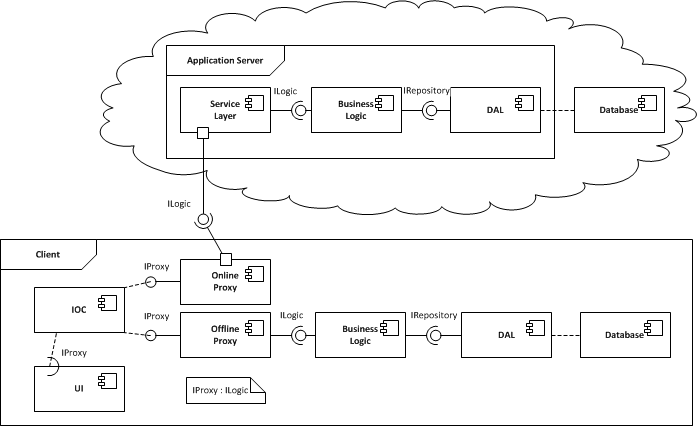

# Hybrid Online/Offline Architecture
## Requires
- Visual Studio 2010
## License
- Apache License, Version 2.0
## Technologies
- WCF
- SQL Server
- LINQ to SQL
- WPF
- ViewModel pattern (MVVM)
- Entity Framework
- Microsoft Sync Framework 2.1
- SQL Server Data Tools
- Ninject
- ApexSQL Diff
## Topics
- Architecture and Design
- Occasionally Connected Data
- Dependancy Injection
## Updated
- 12/01/2012
## Description

<h2>Introduction</h2>

Your application is deployed to mobile devices, which sometimes have network access, but always needs to function. The standard solution is to keep a local cache of the remote database, periodically synchronised when the device is connected.

However, in your application, it is essential to use the freshest data available. Furthermore, many deployments are to desktops on the same LAN as your data centre. Cached data is good for giving a sales demonstration in your client's underground conference
 room, but your desk-bound workers need live data.

You could write a desktop application for cached data and a web application for live data, but why maintain two applications just to handle changes in connectivity? A more intelligent data source is needed; one that can choose at run-time whether to use
 a local data cache, or your application server.

<h2>Architecture</h2>

The database, data access layer, and business logic are deployed to both the server and client. The server exposes its business logic through a service layer, which the client's online proxy connects to. The client also has an offline proxy for accessing
 its local copy of the business logic.

Both proxies implement <code>IProxy</code>, which itself implements the business logic's interface. The client application accesses business logic through a reference to
<code>IProxy</code>, which runtime dependency injection satisfies with the correct proxy.

(For simplicity's sake, the sample code does not contain any independent business logic. Data is retrieved directly from the data access layer.)

<h2>Technology</h2>

The sample code contains a SQL Server project for creating the sample database. Data access is via the entity framework, and WCF is used for the service layer. Ninject is used to inject the correct proxy into WPF view models. Please see the included
<code>Read Me.htm</code> for a list of dependencies and where to find them.

<h2>Synchronisation</h2>

Synchronisation begins by asking the server for the current schema version. If this is greater than the client's schema, a schema update is applied, and the new version is recorded.

Synchronisation initially used Microsoft's Sync Framework. This has the advantage of a mature API, and it can work through a 3-tier architecture. However, it cannot cope with schema changes to existing tables. To get around this, DDL triggers were used to
 update the framework's metadata whenever the schema changed. The last version to use the Sync Framework is thus tagged.

The client objected to relying on DDL triggers, and so later versions switched to ApexSQL's
<a href="http://www.apexsql.com/sql_tools_diffapi.aspx">Diff API</a>. This requires a direct connection to the server, so synchronisation is only performed from within the office LAN.

<h2>ID Ranges</h2>

To avoid primary key conflicts, each client is assigned a range of ID values to use when it first synchronises. After every synchronisation, each table in the client database is reseeded to the correct ID range.

The server does not need reseeding, as it uses positive ID values, while the client ranges are all negative.

<h2>Source Control</h2>

Hybrid's source control is available at the project's <a href="http://code.accursoft.com/hybrid/">
home page</a>.

<h2>Credits</h2>

This code is made available by kind permission of my client, <a href="http://www.logican.co.uk/">
Logican</a>. It is provided for informational purposes only, and may not be used without their explicit consent. The hybrid approach was suggested by
<a href="http://blog.solutionist-ltd.com/">Joseph Babad</a>.

