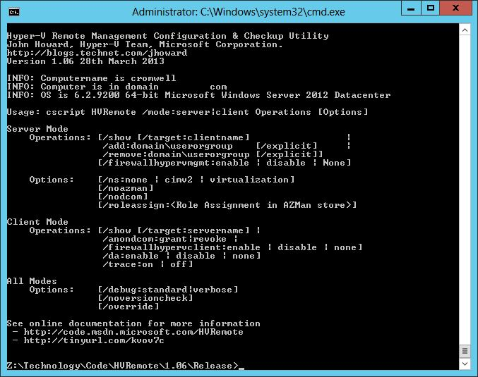

# Hyper-V Remote Management Configuration Utility (HVRemote)
## License
- MS-LPL
## Technologies
- Hyper-V
## Topics
- Configuration
## Updated
- 10/24/2016
## Description

<h1>Latest Version</h1>

1.08, 9th&nbsp;September&nbsp;2013.

&nbsp;

Note: There are no plans add support for Windows 10/Windows Server 2016 -&nbsp; there are too many changes in Windows 10 to take this on in a simple manner right now given other things I'm working on. Sorry.

<h1>About</h1>

&nbsp;

<ul>
<li>HVRemote reduces the manual configuration steps needed for Hyper-V Remote Management down to a few simple commands.
</li><li>HVRemote can diagnose common configuration errors. </li><li>HVRemote is locale neutral, although output is in English only. </li><li>HVRemote can configure all combinations of workgroup and domain joined clients and servers.
</li></ul>

&nbsp;

If you find HVRemote useful, please drop me an email through my <a class="externalLink" href="http://blogs.technet.com/jhoward">
blog</a>, add a comment to this <a class="externalLink" href="http://blogs.technet.com/jhoward/archive/2008/11/14/configure-hyper-v-remote-management-in-seconds.aspx">
post</a>, or provide a rating above ^^^. Thank you! :)

&nbsp;

<h1> 
10-second guide</h1>

&nbsp;

<table>
<tbody>
<tr>
<th><strong>Configuration</strong> </th>
<th><strong>Where</strong> </th>
<th><strong>Purpose</strong></th>
<th><strong>Commands</strong></th>
</tr>
<tr>
<td><strong>Client and Server both workgroup</strong></td>
<td>Server</td>
<td>Create a local account (eg &quot;john&quot;)</td>
<td>Use <em>net user /?</em> or Computer Management&nbsp;</td>
</tr>
<tr>
<td>&nbsp;</td>
<td>Server</td>
<td>Grant the user access</td>
<td>hvremote /add:accountname&nbsp;&nbsp;&nbsp;&nbsp;&nbsp;&nbsp;&nbsp;&nbsp;&nbsp;
<strong>***</strong></td>
</tr>
<tr>
<td>&nbsp;</td>
<td>Client</td>
<td>Allow Anonymous Logon remote DCOM access</td>
<td>hvremote /anondcom:grant</td>
</tr>
<tr>
<td>&nbsp;</td>
<td>Client</td>
<td>Logon with matching local account.</td>
<td>&nbsp;</td>
</tr>
<tr>
<td>&nbsp;</td>
<td>Client</td>
<td>If passwords do not match</td>
<td>cmdkey /add:servername /user:servername\account /pass</td>
</tr>
<tr>
<td>&nbsp;</td>
<td>Both&nbsp;&nbsp;</td>
<td>Verify configuration for errors</td>
<td>hvremote /show /target:othercomputername</td>
</tr>
<tr>
<td>-------------------------</td>
<td>&nbsp;</td>
<td>&nbsp;</td>
<td>&nbsp;</td>
</tr>
<tr>
<td><strong>Client workgroup, Server domain</strong></td>
<td>Server</td>
<td>Grant domain account access</td>
<td>hvremote /add:domain\account&nbsp;&nbsp;&nbsp;&nbsp;&nbsp;&nbsp;&nbsp;&nbsp;&nbsp;&nbsp;
<strong>***</strong></td>
</tr>
<tr>
<td>&nbsp;</td>
<td>Client</td>
<td>Allow Anonymous Logon remote DCOM access</td>
<td>hvremote /anondcom:grant</td>
</tr>
<tr>
<td>&nbsp;</td>
<td>Client</td>
<td>Set credentials for domain account</td>
<td>cmdkey /add:servername /user:domain\account /pass</td>
</tr>
<tr>
<td>&nbsp;</td>
<td>Both&nbsp;&nbsp;</td>
<td>Verify configuration for errors</td>
<td>hvremote /show /target:othercomputername</td>
</tr>
<tr>
<td>-------------------------</td>
<td>&nbsp;</td>
<td>&nbsp;</td>
<td>&nbsp;</td>
</tr>
<tr>
<td><strong>Client domain, Server workgroup</strong></td>
<td>Server</td>
<td>Create a local account (eg &quot;john&quot;)</td>
<td>Use <em>net user /?</em> or Computer Management&nbsp;</td>
</tr>
<tr>
<td>&nbsp;</td>
<td>Server</td>
<td>Grant the user access</td>
<td>hvremote /add:accountname&nbsp;&nbsp;&nbsp;&nbsp;&nbsp;&nbsp;&nbsp;&nbsp;&nbsp;&nbsp;
<strong>***</strong></td>
</tr>
<tr>
<td>&nbsp;</td>
<td>Client</td>
<td>Allow Anonymous Logon remote DCOM access</td>
<td>hvremote /anondcom:grant</td>
</tr>
<tr>
<td>&nbsp;</td>
<td>Client</td>
<td>Set credentials for local account</td>
<td>cmdkey /add:servername /user:servername\accountname /pass</td>
</tr>
<tr>
<td>&nbsp;</td>
<td>Both&nbsp;&nbsp;</td>
<td>Verify configuration for errors</td>
<td>hvremote /show /target:othercomputername</td>
</tr>
<tr>
<td>-------------------------</td>
<td>&nbsp;</td>
<td>&nbsp;</td>
<td>&nbsp;</td>
</tr>
<tr>
<td><strong>Client and Server both domain</strong></td>
<td>Server</td>
<td>Grant the non-admin user access</td>
<td>hvremote /add:domain\account&nbsp;&nbsp;&nbsp;&nbsp;&nbsp;&nbsp;&nbsp;&nbsp;&nbsp;&nbsp;
<strong>***</strong>&nbsp;</td>
</tr>
<tr>
<td>&nbsp;</td>
<td>Both&nbsp;&nbsp;</td>
<td>Verify configuration for errors</td>
<td>hvremote /show /target:othercomputername</td>
</tr>
</tbody>
</table>

 
 
<strong>***</strong> Restart server if this is the first time an account has been added. Not required for Windows 8 Client Hyper-V or Windows Server 2012&nbsp;and later operating systems 
 

<h1>Supported Servers:</h1>
<ul>
<li>&nbsp;
<ul>
</ul>
</li><li>Windows Server 2008 SP1 with Hyper-V RTM update applied (<a class="externalLink" href="http://support.microsoft.com/kb/950050">KB950050</a>), Core &amp; Full installations
</li><li>Windows Server 2008 SP2, Core &amp; Full installations </li><li>Microsoft Hyper-V Server 2008 SP1 (already contains Hyper-V RTM update) </li><li>Microsoft Hyper-V Server 2008 SP2 </li><li>Windows Server 2008 R2, Core &amp; Full installations </li><li>Windows Server 2008 R2 SP1, Core &amp; Full installations </li><li>Microsoft Hyper-V Server 2008 R2 </li><li>Microsoft Hyper-V Server 2008 R2 SP1 </li><li>Windows Server 2012 Core &amp; Full installations <strong>(Version 1.x or later)</strong>
</li><li>Microsoft Hyper-V Server 2012 <strong>(Version 1.x or later)</strong> </li><li>Windows 8 Pro &amp; Enterprise x64 with Hyper-V enabled <strong>(Version 1.x or later)</strong>
</li><li>Windows Server 2012 R2 Core &amp; Full installations <strong>(Version 1.08 or later)</strong>
</li><li style="font-family:Verdana">Microsoft Hyper-V Server 2012 R2 <strong>(Version 1.08 or later)</strong>
</li><li>Windows 8.1 x64 Client Hyper-V <strong>(Version 1.08 or later)</strong> </li></ul>

&nbsp;

<h1>Supported Clients:</h1>
<ul>
<li>Windows Vista Business, Enterprise and Ultimate x86 &amp; x64, SP1 and SP2, with
<a class="externalLink" href="http://support.microsoft.com/kb/952627">KB952627</a> applied
</li><li>Windows 7 Professional, Enterprise and Ultimate x86 &amp; x64 with <a class="externalLink" href="http://download.microsoft.com/">
RSAT</a> installed and Hyper-V tools feature enabled </li><li>Windows 8 Pro and Enterprise x86 and x64 with Hyper-V Management Tools feature enabled
<strong>(Version 1.x or later)</strong> </li><li>Windows 8.1 Pro and Enterprise x86 and x64&nbsp;with Hyper-V Management Tools feature enabled
<strong>(Version 1.08 or later)</strong> </li><li>Windows Server 2008 SP1 with Hyper-V RTM update applied (<a class="externalLink" href="http://support.microsoft.com/kb/950050">KB950050</a>), x86 and x64
</li><li>Windows Server 2008 SP2 x86 and x64 </li><li>Windows Server 2008 R2 </li><li>Windows Server 2008 R2 SP1 </li><li>Windows Server 2012 <strong>(Version 1.x or later)</strong> </li><li>Windows Server 2012 R2 <strong>(Version 1.08 or later)</strong> </li></ul>
<h1>Command summary&nbsp;</h1>

 
Please see the documentation for more information - below is not a complete list of all command line options, just the most commonly needed commands. Commands should be run from an elevated command prompt.
 
 
If the default scripting engine is already CScript, you can run each command exactly as shown in the table. To change the default scripting engine to cscript, run
<em>cscript //h:cscript</em>. Alternately, launch each command using the longer format:
<em>cscript hvremote.wsf <a href="http://archive.msdn.microsoft.com/HVRemote/Wiki/View.aspx?title=command&referringTitle=Home">
command</a></em> 
 

<table>
<tbody>
<tr>
<th><strong>Applicability</strong> </th>
<th><strong>Operation</strong> </th>
<th><strong>Command</strong> </th>
</tr>
<tr>
<td>Server</td>
<td>Grant account access</td>
<td>hvremote /add:domain\account <em>(Domain)</em> <em>or</em> hvremote /add:account
<em>(Workgroup)</em></td>
</tr>
<tr>
<td>Server</td>
<td>Revoke account access</td>
<td>hvremote /add:domain\account <em>(Domain)</em> <em>or</em> hvremote /add:account
<em>(Workgroup)</em></td>
</tr>
<tr>
<td>Both</td>
<td>Display settings</td>
<td>hvremote /show</td>
</tr>
<tr>
<td>Client</td>
<td>Display settings and test server connectivity</td>
<td>hvremote /show /target:servercomputername</td>
</tr>
<tr>
<td>Server</td>
<td>Display settings and test client connectivity</td>
<td>hvremote /show /target:clientcomputername</td>
</tr>
<tr>
<td>Both</td>
<td>Display help</td>
<td>hvremote /?</td>
</tr>
<tr>
<td>Client</td>
<td>Permit ANONYMOUS LOGON remote DCOM access</td>
<td>hvremote /AnonDCOM:grant</td>
</tr>
<tr>
<td>Client</td>
<td>Deny ANONYMOUS LOGON remote DCOM access</td>
<td>hvremote /AnonDCOM:revoke</td>
</tr>
</tbody>
</table>
<h1>Installation &amp; Removal</h1>

Save HVRemote.wsf&nbsp;to a directory on the local disk (eg c:\HVRemote). There is no setup program, it is run from a elevated command prompt. To uninstall, simply delete the file.&nbsp;

<h1>General Usage</h1>

It is easier if you change the scripting engine to cscript by running &quot;cscript //H:cscript&quot; before use. Should you not wish to do this, instead of running &quot;hvremote Operation [Options]&quot;, run &quot;cscript hvremote.wsf Operation [Options]&quot;

<h1>Known Issues</h1>

HVRemote has not been verified using Microsoft accounts in Windows 8 and later, only&nbsp;local and domain accounts

<h1>Disclaimer</h1>

Although I work for Microsoft and am a Program Manager in the Hyper-V team, I must point you to the disclaimer on my
<a class="externalLink" href="http://blogs.technet.com/jhoward">blog</a>, the disclaimer in the documentation, and the license conditions at the top of this page before use. HVRemote and the associated documentation are provided &quot;as-is&quot;. You bear the risk
 of using it. No express warranties, guarantees or conditions are provided. It is not supported or endorsed by Microsoft Corporation and should be used at your own risk. 
 
Thanks, 
John.

<em>&nbsp;</em>

