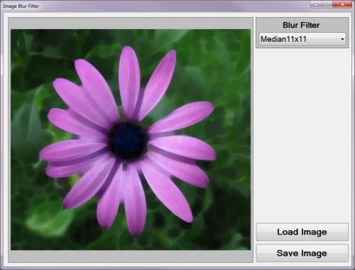
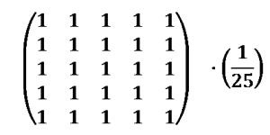
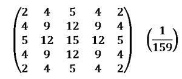
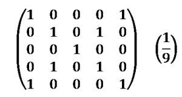

# Image Blur
## Requires
- Visual Studio 2010
## License
- MS-LPL
## Technologies
- C#
- .NET
- Class Library
- User Interface
- Windows Forms
- .NET Framework 4
- .NET 3.0
- .NET Framework 3.5 SP1
- .NET Framework
- .NET Framework 4.0
- Image manipulation
- Library
- Windows General
- Windows UI
- C# Language
- WinForms
- System.Media Namespace
- .NET Framework 4.5
- .NET Framwork
- Graphics Functions
- Microsoft .NET Framework 3.5 SP1
- Visual C Sharp .NET
- System.Drawing.Drawing2D
- System.Windows.Forms.UserControl
- Image process
- Filter expression
- .NET 4.5
- .NET Development
- Image Blur
- Image Processing
- Digital Signal Processing
## Topics
- Controls
- Graphics
- C#
- User Controls
- Graphics and 3D
- Images
- GeometryDrawing
- ImageViewer
- Windows Form Controls
- Dynamic Controls
- 2d graphics
- Visual How To
- Image manipulation
- Code Sample
- Windows UI
- Image
- Imaging
- Drawing
- How to
- Generic C# resuable code
- Image Optimization
- Form controls
- Windows Forms Controls
- C# Language Features
- Graphics Functions
- UserControls
- BitmapImage
- Load Image
- Dynamically Image
## Updated
- 06/15/2013
## Description

<h1>Introduction</h1>

This article serves to provides an introduction and discussion relating to
<a title="Image blurring" rel="tag" href="http://en.wikipedia.org/wiki/Gaussian_blur" target="_blank">
Image Blurring</a> methods and techniques. The <strong>Image Blur</strong> methods covered in this article include:
<a title="Box Blur" rel="tag" href="http://en.wikipedia.org/wiki/Box_blur" target="_blank">
Box Blur</a>/<a title="Mean Filter" rel="tag" href="http://en.wikipedia.org/wiki/Box_blur" target="_blank">Mean Filter</a>,
<a title="Gaussian blur" rel="tag" href="http://en.wikipedia.org/wiki/Gaussian_blur" target="_blank">
Gaussian Blur</a>, <a title="Wikipedia: Median Filter" rel="tag" href="http://en.wikipedia.org/wiki/Median_filter" target="_blank">
Median Filter</a> and <a title="Motion Blur" rel="tag" href="http://en.wikipedia.org/wiki/Motion_blur#Computer_graphics" target="_blank">
Motion Blur</a>.

<strong><em>Daisy: Mean 9&times;9</em></strong>

<h1>Building the Sample</h1>

There are&nbsp;no special requirements or instructions for building the sample source code.

<h1>Using the Sample Application</h1>

This article is accompanied by a sample application, intended to provide a means of testing and replicating topics discussed in this article. The sample application is a
<a title="Windows Forms" rel="tag" href="http://msdn.microsoft.com/en-us/library/dd30h2yb.aspx" target="_blank">
Windows Forms</a> based application of which the user interface enables the user to select an
<a title="Image Blur" rel="tag" href="http://en.wikipedia.org/wiki/Gaussian_blur" target="_blank">
Image Blur</a> type to implement.

When clicking the <strong><em>Load Image</em></strong> button users are able to browse the local file system in order to select source/input
<a title="images" rel="tag" href="http://msdn.microsoft.com/en-us/library/system.drawing.image.aspx" target="_blank">
images</a>. In addition users are also able to save blurred result <a title="images" rel="tag" href="http://msdn.microsoft.com/en-us/library/system.drawing.image.aspx" target="_blank">
images</a> when clicking the <strong><em>Save Image</em></strong> button and browsing the local file system.

<strong><em>Daisy: Mean 7&times;7</em></strong>

The sample application provides the user with the ability to select the method of
<a title="Image blurring" rel="tag" href="http://en.wikipedia.org/wiki/Gaussian_blur" target="_blank">
image blurring</a> to implement. The <a title="ComboBox" rel="tag" href="http://msdn.microsoft.com/en-us/library/system.windows.forms.combobox.aspx" target="_blank">
combobox</a> dropdown located on the right-hand side of the user interface lists all of the supported methods of
<a title="Image blurring" rel="tag" href="http://en.wikipedia.org/wiki/Gaussian_blur" target="_blank">
image blurring</a>. When a user selects an item from the <a title="ComboBox" rel="tag" href="http://msdn.microsoft.com/en-us/library/system.windows.forms.combobox.aspx" target="_blank">
combobox</a>, the associated blur method will be implemented on the preview <a title="Image" rel="tag" href="http://msdn.microsoft.com/en-us/library/system.drawing.image.aspx" target="_blank">
image</a>.

The image below is a screenshot of the <strong><em>Image Blur Filter</em></strong> sample application in action:

<h1>Image Blur Overview</h1>

The process of <a title="Image blurring" rel="tag" href="http://en.wikipedia.org/wiki/Gaussian_blur" target="_blank">
image blurring</a> can be regarded as reducing the sharpness or crispness defined by an
<a title="Image" rel="tag" href="http://msdn.microsoft.com/en-us/library/system.drawing.image.aspx" target="_blank">
image</a>. <a title="Image blurring" rel="tag" href="http://en.wikipedia.org/wiki/Gaussian_blur" target="_blank">
Image blurring</a> results in <a title="Image" rel="tag" href="http://msdn.microsoft.com/en-us/library/system.drawing.image.aspx" target="_blank">
image</a> detail/<a title="Wikipedia: Edge Enhancement" rel="tag" href="http://en.wikipedia.org/wiki/Edge_enhancement" target="_blank">definition</a> being perceived as less distinct.
<a title="images" rel="tag" href="http://msdn.microsoft.com/en-us/library/system.drawing.image.aspx" target="_blank">
Images</a> are often blurred as a method of smoothing an <a title="Image" rel="tag" href="http://msdn.microsoft.com/en-us/library/system.drawing.image.aspx" target="_blank">
image</a>.

<a title="images" rel="tag" href="http://msdn.microsoft.com/en-us/library/system.drawing.image.aspx" target="_blank">Images</a> perceived as too crisp/sharp can be softened by applying a variety of
<a title="Image blurring" rel="tag" href="http://en.wikipedia.org/wiki/Gaussian_blur" target="_blank">
image blurring</a> techniques and intensity levels. Often <a title="images" rel="tag" href="http://msdn.microsoft.com/en-us/library/system.drawing.image.aspx" target="_blank">
images</a> are smoothed/blurred in order to remove/reduce <a title="Image noise" rel="tag" href="http://en.wikipedia.org/wiki/Image_noise" target="_blank">
image noise</a>. In <a title="Wikipedia: Edge Detection" rel="tag" href="http://en.wikipedia.org/wiki/Edge_detection" target="_blank">
image edge detection</a> implementations better results are often achieved when first implementing
<a title="Wikipedia: Noise Reduction" rel="tag" href="http://en.wikipedia.org/wiki/Noise_reduction" target="_blank">
noise reduction</a> through smoothing/<a title="blurring" rel="tag" href="http://en.wikipedia.org/wiki/Gaussian_blur" target="_blank">blurring</a>.
<a title="Image blurring" rel="tag" href="http://en.wikipedia.org/wiki/Gaussian_blur" target="_blank">
Image blurring</a> can even be implemented in a fashion where results reflect <a title="Wikipedia: Edge Detection" rel="tag" href="http://en.wikipedia.org/wiki/Edge_detection" target="_blank">
image edge detection</a>, a method known as <a title="Wikipedia: Difference of Gaussians" rel="tag" href="http://en.wikipedia.org/wiki/Difference_of_Gaussians" target="_blank">
Difference of Gaussians</a>.

In this article and the accompanying sample source code all methods of
<a title="Image blurring" rel="tag" href="http://en.wikipedia.org/wiki/Gaussian_blur" target="_blank">
image blurring</a> supported have been implemented through <a title="Image Convolution" rel="tag" href="http://en.wikipedia.org/wiki/Kernel_(image_processing)#Convolution" target="_blank">
image convolution</a>, with the exception of the <a title="Wikipedia: Median" rel="tag" href="http://en.wikipedia.org/wiki/Median" target="_blank">
Median</a> filter. Each of the supported methods in essence only represent a different
<a title="Convolution" rel="tag" href="http://en.wikipedia.org/wiki/Kernel_(image_processing)#Convolution" target="_blank">
convolution</a>&nbsp;<a title="Matrix" rel="tag" href="http://en.wikipedia.org/wiki/Matrix_(mathematics)" target="_blank">matrix</a>&nbsp;<a title="Image Kernel" rel="tag" href="http://en.wikipedia.org/wiki/Kernel_(image_processing)" target="_blank">kernel</a>.
 The <a title="Image blurring" rel="tag" href="http://en.wikipedia.org/wiki/Gaussian_blur" target="_blank">
image blurring</a> technique capable of achieving optimal results will to varying degrees be dependent on the features present in the specified source/input
<a title="Image" rel="tag" href="http://msdn.microsoft.com/en-us/library/system.drawing.image.aspx" target="_blank">
image</a>. Each method provides a different set of desired properties and compromises. In the following sections an overview of each method will be discussed.

<strong><em>Daisy: Mean 9&times;9</em></strong>

<h1>Mean Filter/Box Blur</h1>

The <a title="Mean Filter" rel="tag" href="http://en.wikipedia.org/wiki/Box_blur" target="_blank">
Mean Filter</a> also sometimes referred to as a <a title="Box Blur" rel="tag" href="http://en.wikipedia.org/wiki/Box_blur" target="_blank">
Box Blur</a> represents a fairly simplistic implementation and definition. A <a title="Mean Filter" rel="tag" href="http://en.wikipedia.org/wiki/Box_blur" target="_blank">
Mean Filter</a> definition can be found on <a title="Mean Filter" rel="tag" href="http://en.wikipedia.org/wiki/Box_blur" target="_blank">
Wikipedia</a> as follows:

<blockquote>

A <strong>box blur</strong> is an <a title="Wikipdia: Image Filter" rel="tag" href="http://en.wikipedia.org/wiki/Image_filter" target="_blank">
image filter</a> in which each pixel in the resulting image has a value equal to the average value of its neighbouring pixels in the input image. It is a form of low-pass (&quot;blurring&quot;) filter and is a
<a title="Wikipedia: Convolution" rel="tag" href="http://en.wikipedia.org/wiki/Convolution" target="_blank">
convolution</a>.

Due to its property of using equal weights it can be implemented using a much simpler accumulation algorithm which is significantly faster than using a sliding window algorithm.

</blockquote>

<a title="Mean Filter" rel="tag" href="http://en.wikipedia.org/wiki/Box_blur" target="_blank">Mean Filter</a> as a title relates to all weight values in a
<a title="Convolution" rel="tag" href="http://en.wikipedia.org/wiki/Kernel_(image_processing)#Convolution" target="_blank">
convolution</a> <a title="Image Kernel" rel="tag" href="http://en.wikipedia.org/wiki/Kernel_(image_processing)" target="_blank">
kernel</a> being equal, therefore the alternate title of <a title="Box Blur" rel="tag" href="http://en.wikipedia.org/wiki/Box_blur" target="_blank">
Box Blur</a>. In most cases a <a title="Mean Filter" rel="tag" href="http://en.wikipedia.org/wiki/Box_blur" target="_blank">
Mean Filter</a> <a title="Matrix" rel="tag" href="http://en.wikipedia.org/wiki/Matrix_(mathematics)" target="_blank">
matrix</a> <a title="Image Kernel" rel="tag" href="http://en.wikipedia.org/wiki/Kernel_(image_processing)" target="_blank">
kernel</a> will only contain the value one. When performing <a title="Image" rel="tag" href="http://msdn.microsoft.com/en-us/library/system.drawing.image.aspx" target="_blank">
image</a> <a title="Convolution" rel="tag" href="http://en.wikipedia.org/wiki/Kernel_(image_processing)#Convolution" target="_blank">
convolution</a> implementing a <a title="Mean Filter" rel="tag" href="http://en.wikipedia.org/wiki/Box_blur" target="_blank">
Mean Filter</a> <a title="Image Kernel" rel="tag" href="http://en.wikipedia.org/wiki/Kernel_(image_processing)" target="_blank">
kernel</a>, the factor value equates to the <strong><em>1</em></strong> being divided by the sum of all
<a title="Image Kernel" rel="tag" href="http://en.wikipedia.org/wiki/Kernel_(image_processing)" target="_blank">
kernel</a> values.

The following is an example of a <strong><em>5&times;5</em></strong>
<a title="Mean Filter" rel="tag" href="http://en.wikipedia.org/wiki/Box_blur" target="_blank">
Mean Filter</a> convolution kernel:

The <a title="Image Kernel" rel="tag" href="http://en.wikipedia.org/wiki/Kernel_(image_processing)" target="_blank">
kernel</a> consist of <strong><em>25</em></strong> elements, therefore the factor value equates to one divided by twenty five.

The <a title="Mean Filter" rel="tag" href="http://en.wikipedia.org/wiki/Box_blur" target="_blank">
Mean Filter</a> Blur does not result in the same level of smoothing achieved by other
<a title="Image Blur" rel="tag" href="http://en.wikipedia.org/wiki/Gaussian_blur" target="_blank">
image blur</a> methods. The <a title="Mean Filter" rel="tag" href="http://en.wikipedia.org/wiki/Box_blur" target="_blank">
Mean Filter</a> method can also be susceptible to directional artefacts.

<strong><em>Daisy Mean 5&times;5</em></strong>

<h1>Gaussian Blur</h1>

The <a title="Wikipedia: Gaussian Blur" rel="tag" href="http://en.wikipedia.org/wiki/Gaussian_blur" target="_blank">
Gaussian</a> method of <a title="Image blurring" rel="tag" href="http://en.wikipedia.org/wiki/Gaussian_blur" target="_blank">
image blurring</a> is a popular and often implemented filter. In contrast to the <a title="Box Blur" rel="tag" href="http://en.wikipedia.org/wiki/Box_blur" target="_blank">
Box Blur</a> method <a title="Wikipedia: Gaussian blurring" rel="tag" href="http://en.wikipedia.org/wiki/Gaussian_blur" target="_blank">
Gaussian Blurring</a> produce resulting <a title="images" rel="tag" href="http://msdn.microsoft.com/en-us/library/system.drawing.image.aspx" target="_blank">
images</a> appearing to contain a more uniform level of smoothing. When implementing
<a title="Wikipedia: Edge Detection" rel="tag" href="http://en.wikipedia.org/wiki/Edge_detection" target="_blank">
image edge detection</a> a <a title="Gaussian blur" rel="tag" href="http://en.wikipedia.org/wiki/Gaussian_blur" target="_blank">
Gaussian Blur</a> is often applied to source/input <a title="images" rel="tag" href="http://msdn.microsoft.com/en-us/library/system.drawing.image.aspx" target="_blank">
images</a> resulting in <a title="Wikipedia: Noise Reduction" rel="tag" href="http://en.wikipedia.org/wiki/Noise_reduction" target="_blank">
noise reduction</a>. The <a title="Gaussian blur" rel="tag" href="http://en.wikipedia.org/wiki/Gaussian_blur" target="_blank">
Gaussian Blur</a> has a good level of <a title="Image" rel="tag" href="http://msdn.microsoft.com/en-us/library/system.drawing.image.aspx" target="_blank">
image</a> edge preservation, hence being used in <a title="Wikipedia: Edge detection" rel="tag" href="http://en.wikipedia.org/wiki/Edge_detection" target="_blank">
edge detection</a> operations.

From <a title="Gaussian blur" rel="tag" href="http://en.wikipedia.org/wiki/Gaussian_blur" target="_blank">
Wikipedia</a> we gain the following <a title="Gaussian blur" rel="tag" href="http://en.wikipedia.org/wiki/Gaussian_blur" target="_blank">
description</a>:

<blockquote>

A <strong>Gaussian blur</strong> (also known as Gaussian smoothing) is the result of blurring an image by a
<a title="Gaussian function" rel="tag" href="http://en.wikipedia.org/wiki/Gaussian_function" target="_blank">
Gaussian function</a>. It is a widely used effect in graphics software, typically to reduce
<a title="image noise" href="http://en.wikipedia.org/wiki/Image_noise" target="_blank">
image noise</a> and reduce detail. The visual effect of this blurring technique is a smooth blur resembling that of viewing the
<a title="image" href="http://en.wikipedia.org/wiki/Image" target="_blank">image</a> through a translucent screen, distinctly different from the
<a title="bokeh" href="http://en.wikipedia.org/wiki/Bokeh" target="_blank">bokeh</a> effect produced by an out-of-focus lens or the shadow of an object under usual illumination. Gaussian smoothing is also used as a pre-processing stage in
<a title="computer vision" href="http://en.wikipedia.org/wiki/Computer_vision" target="_blank">
computer vision</a> algorithms in order to enhance image structures at different scales

</blockquote>

A potential drawback to implementing a <a title="Gaussian blur" rel="tag" href="http://en.wikipedia.org/wiki/Gaussian_blur" target="_blank">
Gaussian blur</a> results from the filter being computationally intensive. The following
<a title="Matrix" rel="tag" href="http://en.wikipedia.org/wiki/Matrix_(mathematics)" target="_blank">
matrix</a> <a title="Image Kernel" rel="tag" href="http://en.wikipedia.org/wiki/Kernel_(image_processing)" target="_blank">
kernel</a> represents a <strong><em>5&times;5</em></strong> <a title="Gaussian blur" rel="tag" href="http://en.wikipedia.org/wiki/Gaussian_blur" target="_blank">
Gaussian Blur</a>. The sum total of all elements in the <a title="Image Kernel" rel="tag" href="http://en.wikipedia.org/wiki/Kernel_(image_processing)" target="_blank">
kernel</a> equate to <strong><em>159</em></strong>, therefore a factor value of <strong>
<em>1.0 / 159.0 </em></strong>will be implemented.

<strong><em>Daisy: Gaussian 5&times;5</em></strong>

<h1>Median Filter Blur</h1>

The <a title="Wikipedia: Median Filter" rel="tag" href="http://en.wikipedia.org/wiki/Median_filter" target="_blank">
Median Filter</a> is classified as a non-linear filter. In contrast to the other methods of
<a title="Image blurring" rel="tag" href="http://en.wikipedia.org/wiki/Gaussian_blur" target="_blank">
image blurring</a> discussed in this article the <a title="Wikipedia: Median Filter" rel="tag" href="http://en.wikipedia.org/wiki/Median_filter" target="_blank">
Median Filter</a> implementation does not involve <a title="Convolution" rel="tag" href="http://en.wikipedia.org/wiki/Kernel_(image_processing)#Convolution" target="_blank">
convolution</a> or a predefined matrix <a title="Image Kernel" rel="tag" href="http://en.wikipedia.org/wiki/Kernel_(image_processing)" target="_blank">
kernel</a>. The following <a title="Median filter" rel="tag" href="http://en.wikipedia.org/wiki/Median_filter" target="_blank">
description</a> can be found on <a title="Median filter" rel="tag" href="http://en.wikipedia.org/wiki/Median_filter" target="_blank">
Wikipedia</a>:

<blockquote>

In <a title="signal processing" href="http://en.wikipedia.org/wiki/Signal_processing" target="_blank">
signal processing</a>, it is often desirable to be able to perform some kind of <a title="noise reduction" rel="tag" href="http://en.wikipedia.org/wiki/Noise_reduction" target="_blank">
noise reduction</a> on an image or signal. The <strong>median filter</strong> is a nonlinear
<a title="digital filtering" rel="tag" href="http://en.wikipedia.org/wiki/Digital_filter" target="_blank">
digital filtering</a> technique, often used to remove <a title="Signal noise" rel="tag" href="http://en.wikipedia.org/wiki/Signal_noise" target="_blank">
noise</a>. Such noise reduction is a typical pre-processing step to improve the results of later processing (for example,
<a title="edge detection" rel="tag" href="http://en.wikipedia.org/wiki/Edge_detection" target="_blank">
edge detection</a> on an image). Median filtering is very widely used in digital <a title="image processing" rel="tag" href="http://en.wikipedia.org/wiki/Image_processing" target="_blank">
image processing</a> because, under certain conditions, it preserves edges while removing noise.

</blockquote>

<strong><em>Daisy: Median 7&times;7</em></strong>

As the name implies, the <a title="Wikipedia: Median Filter" rel="tag" href="http://en.wikipedia.org/wiki/Median_filter" target="_blank">
Median Filter</a> operates by calculating the <a title="Wikipedia: Median" rel="tag" href="http://en.wikipedia.org/wiki/Median" target="_blank">
median</a> value of a pixel group also referred to as a window. Calculating a <a title="Wikipedia: Median" rel="tag" href="http://en.wikipedia.org/wiki/Median" target="_blank">
Median</a> value involves a number of steps. The required steps are listed as follows:

<ol style="text-align:justify">
<li>Iterate each pixel that forms part of the source/input <a title="Image" rel="tag" href="http://msdn.microsoft.com/en-us/library/system.drawing.image.aspx" target="_blank">
image</a>. </li><li>In relation to the pixel currently being iterated determine neighbouring pixels located within the bounds defined by the window size. The window location should be offset in order to align the window&rsquo;s middle pixel and the pixel currently being iterated.
</li><li>Neighbouring pixels located within the bounds&nbsp; defined by the window should be added to a one dimensional neighbourhood array. Once all value have been added, the array should be sorted by value.
</li><li>The pixel value located at the middle of the sorted neighbourhood array qualifies as the
<a title="Wikipedia: Median" rel="tag" href="http://en.wikipedia.org/wiki/Median" target="_blank">
Median</a> value. The newly determined <a title="Wikipedia: Median" rel="tag" href="http://en.wikipedia.org/wiki/Median" target="_blank">
Median</a> value should be assigned to the pixel currently being iterated. </li><li>Repeat the steps listed above until all pixels within the source/input <a title="Image" rel="tag" href="http://msdn.microsoft.com/en-us/library/system.drawing.image.aspx" target="_blank">
image</a> have been iterated. </li></ol>

Similar to the <a title="Gaussian blur" rel="tag" href="http://en.wikipedia.org/wiki/Gaussian_blur" target="_blank">
Gaussian Blur</a> filter the <a title="Wikipedia: Median Filter" rel="tag" href="http://en.wikipedia.org/wiki/Median_filter" target="_blank">
Median Filter</a> has the ability to smooth <a title="Image noise" rel="tag" href="http://en.wikipedia.org/wiki/Image_noise" target="_blank">
image noise</a> whilst providing edge preservation. Depending on the window size implemented and the physical dimensions of input/source
<a title="images" rel="tag" href="http://msdn.microsoft.com/en-us/library/system.drawing.image.aspx" target="_blank">
images</a> the <a title="Wikipedia: Median Filter" rel="tag" href="http://en.wikipedia.org/wiki/Median_filter" target="_blank">
Median Filter</a> can be computationally expensive.

<strong><em>Daisy: Median 9&times;9</em></strong>

<h1>Motion Blur</h1>

The sample source implements <a title="Motion Blur" rel="tag" href="http://en.wikipedia.org/wiki/Motion_blur#Computer_graphics" target="_blank">
Motion Blur</a> filters. <a title="Motion blurring" rel="tag" href="http://en.wikipedia.org/wiki/Motion_blur#Computer_graphics" target="_blank">
Motion blurring</a> in the traditional sense has been association with photography and video capturing.
<a title="Motion blurring" rel="tag" href="http://en.wikipedia.org/wiki/Motion_blur#Computer_graphics" target="_blank">
Motion Blurring</a> can often be observed in scenarios where rapid movements are being captured to photographs or video recording. When recording a single frame, rapid movements could result in the
<a title="Image" rel="tag" href="http://msdn.microsoft.com/en-us/library/system.drawing.image.aspx" target="_blank">
image</a> changing&nbsp; before the frame being captured has completed.

<a title="Motion blurring" rel="tag" href="http://en.wikipedia.org/wiki/Motion_blur#Computer_graphics" target="_blank">Motion Blurring</a> can be synthetically imitated through the implementation of Digital
<a title="Motion Blur" rel="tag" href="http://en.wikipedia.org/wiki/Motion_blur#Computer_graphics" target="_blank">
Motion Blur</a> filters. The size of the <a title="Matrix" rel="tag" href="http://en.wikipedia.org/wiki/Matrix_(mathematics)" target="_blank">
matrix</a> <a title="Image Kernel" rel="tag" href="http://en.wikipedia.org/wiki/Kernel_(image_processing)" target="_blank">
kernel</a> provided when implementing <a title="Image Convolution" rel="tag" href="http://en.wikipedia.org/wiki/Kernel_(image_processing)#Convolution" target="_blank">
image convolution</a> affects the filter intensity perceived in result <a title="images" rel="tag" href="http://msdn.microsoft.com/en-us/library/system.drawing.image.aspx" target="_blank">
images</a>. Relating to <a title="Motion Blur" rel="tag" href="http://en.wikipedia.org/wiki/Motion_blur#Computer_graphics" target="_blank">
Motion Blur</a> filters the size of the <a title="Image Kernel" rel="tag" href="http://en.wikipedia.org/wiki/Kernel_(image_processing)" target="_blank">
kernel</a> specified in <a title="Convolution" rel="tag" href="http://en.wikipedia.org/wiki/Kernel_(image_processing)#Convolution" target="_blank">
convolution</a> influences the perception and appearance of how rapidly movement had occurred to have blurred the resulting
<a title="Image" rel="tag" href="http://msdn.microsoft.com/en-us/library/system.drawing.image.aspx" target="_blank">
image</a>. Larger <a title="Wikipedia: Kernel" rel="tag" href="http://en.wikipedia.org/wiki/Kernel_(image_processing)" target="_blank">
kernels</a> produce the appearance of more rapid motion, whereas smaller <a title="Wikipedia: Kernel" rel="tag" href="http://en.wikipedia.org/wiki/Kernel_(image_processing)" target="_blank">
kernels</a> result in less rapid motion being perceived.

<strong><em>Daisy: Motion Blur 7&times;7 135 Degrees</em></strong>

Depending on the <a title="Image Kernel" rel="tag" href="http://en.wikipedia.org/wiki/Kernel_(image_processing)" target="_blank">
kernel</a> specified the ability exists to create the appearance of movement having occurred in a certain direction. The sample source code implements
<a title="Motion Blur" rel="tag" href="http://en.wikipedia.org/wiki/Motion_blur#Computer_graphics" target="_blank">
Motion Blur</a> filters at <strong><em>45 degrees</em></strong>, <strong><em>135 degrees</em></strong> and in both directions simultaneously.

The <a title="Image Kernel" rel="tag" href="http://en.wikipedia.org/wiki/Kernel_(image_processing)" target="_blank">
kernel</a> listed below represents a <strong><em>5&times;5</em></strong> <a title="Motion Blur" rel="tag" href="http://en.wikipedia.org/wiki/Motion_blur#Computer_graphics" target="_blank">
Motion Blur</a> filter occurring at&nbsp; <strong><em>45 degrees and 135 degrees</em></strong>:

<h1>Image Blur Implementation</h1>

The sample source code implements all of the concepts explored throughout this article. The source code definition can be grouped into 4 sections:
<strong><em>ImageBlurFilter</em></strong> method, <strong><em>ConvolutionFilter</em></strong> method,
<strong><em>MedianFilter</em></strong> method and the <strong><em>Matrix</em></strong> class. The following article sections relate to the 4 main source code sections.

The <strong><em>ImageBlurFilter</em></strong> <a title="MSDN: Extension Methods" rel="tag" href="http://msdn.microsoft.com/en-us/library/vstudio/bb383977.aspx" target="_blank">
extension method</a> has the purpose of invoking the correct blur filter method and relevant method parameters. This method acts as a method wrapper providing the technical implementation details required when performing a specified blur filter.

The definition of the <strong><em>ImageBlurFilter</em></strong>
<a title="MSDN: Extension Methods" rel="tag" href="http://msdn.microsoft.com/en-us/library/vstudio/bb383977.aspx" target="_blank">
extension method</a> as follows:

C#

Edit|Remove

csharp

<pre class="csharp">public&nbsp;static&nbsp;Bitmap&nbsp;ImageBlurFilter(this&nbsp;Bitmap&nbsp;sourceBitmap,&nbsp;&nbsp;&nbsp;
&nbsp;&nbsp;&nbsp;&nbsp;&nbsp;&nbsp;&nbsp;&nbsp;&nbsp;&nbsp;&nbsp;&nbsp;&nbsp;&nbsp;&nbsp;&nbsp;&nbsp;&nbsp;&nbsp;&nbsp;&nbsp;&nbsp;&nbsp;&nbsp;&nbsp;&nbsp;&nbsp;&nbsp;&nbsp;&nbsp;&nbsp;&nbsp;&nbsp;&nbsp;&nbsp;&nbsp;&nbsp;&nbsp;&nbsp;&nbsp;&nbsp;&nbsp;&nbsp;&nbsp;&nbsp;BlurType&nbsp;blurType)&nbsp;&nbsp;
{&nbsp;&nbsp;&nbsp;
&nbsp;&nbsp;&nbsp;&nbsp;&nbsp;Bitmap&nbsp;resultBitmap&nbsp;=&nbsp;null;&nbsp;&nbsp;
&nbsp;
&nbsp;&nbsp;&nbsp;&nbsp;&nbsp;&nbsp;&nbsp;&nbsp;
&nbsp;&nbsp;&nbsp;&nbsp;&nbsp;switch&nbsp;(blurType)&nbsp;&nbsp;
&nbsp;&nbsp;&nbsp;&nbsp;&nbsp;{&nbsp;&nbsp;&nbsp;
&nbsp;&nbsp;&nbsp;&nbsp;&nbsp;&nbsp;&nbsp;&nbsp;&nbsp;case&nbsp;BlurType.Mean3x3:&nbsp;&nbsp;
&nbsp;&nbsp;&nbsp;&nbsp;&nbsp;&nbsp;&nbsp;&nbsp;&nbsp;&nbsp;&nbsp;&nbsp;&nbsp;&nbsp;{&nbsp;&nbsp;&nbsp;
&nbsp;&nbsp;&nbsp;&nbsp;&nbsp;&nbsp;&nbsp;&nbsp;&nbsp;&nbsp;&nbsp;&nbsp;&nbsp;&nbsp;&nbsp;&nbsp;&nbsp;resultBitmap&nbsp;=&nbsp;sourceBitmap.ConvolutionFilter(&nbsp;&nbsp;
&nbsp;&nbsp;&nbsp;&nbsp;&nbsp;&nbsp;&nbsp;&nbsp;&nbsp;&nbsp;&nbsp;&nbsp;&nbsp;&nbsp;&nbsp;&nbsp;&nbsp;&nbsp;&nbsp;&nbsp;&nbsp;&nbsp;&nbsp;&nbsp;&nbsp;&nbsp;&nbsp;&nbsp;&nbsp;&nbsp;&nbsp;&nbsp;Matrix.Mean3x3,&nbsp;1.0&nbsp;/&nbsp;9.0,&nbsp;0);&nbsp;&nbsp;
&nbsp;&nbsp;&nbsp;&nbsp;&nbsp;&nbsp;&nbsp;&nbsp;&nbsp;&nbsp;&nbsp;&nbsp;&nbsp;&nbsp;}&nbsp;break;&nbsp;&nbsp;
&nbsp;&nbsp;&nbsp;&nbsp;&nbsp;&nbsp;&nbsp;&nbsp;&nbsp;case&nbsp;BlurType.Mean5x5:&nbsp;&nbsp;
&nbsp;&nbsp;&nbsp;&nbsp;&nbsp;&nbsp;&nbsp;&nbsp;&nbsp;&nbsp;&nbsp;&nbsp;&nbsp;&nbsp;{&nbsp;&nbsp;&nbsp;
&nbsp;&nbsp;&nbsp;&nbsp;&nbsp;&nbsp;&nbsp;&nbsp;&nbsp;&nbsp;&nbsp;&nbsp;&nbsp;&nbsp;&nbsp;&nbsp;&nbsp;resultBitmap&nbsp;=&nbsp;sourceBitmap.ConvolutionFilter(&nbsp;&nbsp;
&nbsp;&nbsp;&nbsp;&nbsp;&nbsp;&nbsp;&nbsp;&nbsp;&nbsp;&nbsp;&nbsp;&nbsp;&nbsp;&nbsp;&nbsp;&nbsp;&nbsp;&nbsp;&nbsp;&nbsp;&nbsp;&nbsp;&nbsp;&nbsp;&nbsp;&nbsp;&nbsp;&nbsp;&nbsp;&nbsp;&nbsp;&nbsp;Matrix.Mean5x5,&nbsp;1.0&nbsp;/&nbsp;25.0,&nbsp;0);&nbsp;&nbsp;
&nbsp;&nbsp;&nbsp;&nbsp;&nbsp;&nbsp;&nbsp;&nbsp;&nbsp;&nbsp;&nbsp;&nbsp;&nbsp;&nbsp;}&nbsp;break;&nbsp;&nbsp;
&nbsp;&nbsp;&nbsp;&nbsp;&nbsp;&nbsp;&nbsp;&nbsp;&nbsp;case&nbsp;BlurType.Mean7x7:&nbsp;&nbsp;
&nbsp;&nbsp;&nbsp;&nbsp;&nbsp;&nbsp;&nbsp;&nbsp;&nbsp;&nbsp;&nbsp;&nbsp;&nbsp;&nbsp;{&nbsp;&nbsp;&nbsp;
&nbsp;&nbsp;&nbsp;&nbsp;&nbsp;&nbsp;&nbsp;&nbsp;&nbsp;&nbsp;&nbsp;&nbsp;&nbsp;&nbsp;&nbsp;&nbsp;&nbsp;resultBitmap&nbsp;=&nbsp;sourceBitmap.ConvolutionFilter(&nbsp;&nbsp;
&nbsp;&nbsp;&nbsp;&nbsp;&nbsp;&nbsp;&nbsp;&nbsp;&nbsp;&nbsp;&nbsp;&nbsp;&nbsp;&nbsp;&nbsp;&nbsp;&nbsp;&nbsp;&nbsp;&nbsp;&nbsp;&nbsp;&nbsp;&nbsp;&nbsp;&nbsp;&nbsp;&nbsp;&nbsp;&nbsp;&nbsp;&nbsp;Matrix.Mean7x7,&nbsp;1.0&nbsp;/&nbsp;49.0,&nbsp;0);&nbsp;&nbsp;
&nbsp;&nbsp;&nbsp;&nbsp;&nbsp;&nbsp;&nbsp;&nbsp;&nbsp;&nbsp;&nbsp;&nbsp;&nbsp;&nbsp;}&nbsp;break;&nbsp;&nbsp;
&nbsp;&nbsp;&nbsp;&nbsp;&nbsp;&nbsp;&nbsp;&nbsp;&nbsp;case&nbsp;BlurType.Mean9x9:&nbsp;&nbsp;
&nbsp;&nbsp;&nbsp;&nbsp;&nbsp;&nbsp;&nbsp;&nbsp;&nbsp;&nbsp;&nbsp;&nbsp;&nbsp;&nbsp;{&nbsp;&nbsp;&nbsp;
&nbsp;&nbsp;&nbsp;&nbsp;&nbsp;&nbsp;&nbsp;&nbsp;&nbsp;&nbsp;&nbsp;&nbsp;&nbsp;&nbsp;&nbsp;&nbsp;&nbsp;resultBitmap&nbsp;=&nbsp;sourceBitmap.ConvolutionFilter(&nbsp;&nbsp;
&nbsp;&nbsp;&nbsp;&nbsp;&nbsp;&nbsp;&nbsp;&nbsp;&nbsp;&nbsp;&nbsp;&nbsp;&nbsp;&nbsp;&nbsp;&nbsp;&nbsp;&nbsp;&nbsp;&nbsp;&nbsp;&nbsp;&nbsp;&nbsp;&nbsp;&nbsp;&nbsp;&nbsp;&nbsp;&nbsp;&nbsp;&nbsp;Matrix.Mean9x9,&nbsp;1.0&nbsp;/&nbsp;81.0,&nbsp;0);&nbsp;&nbsp;
&nbsp;&nbsp;&nbsp;&nbsp;&nbsp;&nbsp;&nbsp;&nbsp;&nbsp;&nbsp;&nbsp;&nbsp;&nbsp;&nbsp;}&nbsp;break;&nbsp;&nbsp;
&nbsp;&nbsp;&nbsp;&nbsp;&nbsp;&nbsp;&nbsp;&nbsp;&nbsp;case&nbsp;BlurType.GaussianBlur3x3:&nbsp;&nbsp;
&nbsp;&nbsp;&nbsp;&nbsp;&nbsp;&nbsp;&nbsp;&nbsp;&nbsp;&nbsp;&nbsp;&nbsp;&nbsp;&nbsp;{&nbsp;&nbsp;&nbsp;
&nbsp;&nbsp;&nbsp;&nbsp;&nbsp;&nbsp;&nbsp;&nbsp;&nbsp;&nbsp;&nbsp;&nbsp;&nbsp;&nbsp;&nbsp;&nbsp;&nbsp;resultBitmap&nbsp;=&nbsp;sourceBitmap.ConvolutionFilter(&nbsp;&nbsp;
&nbsp;&nbsp;&nbsp;&nbsp;&nbsp;&nbsp;&nbsp;&nbsp;&nbsp;&nbsp;&nbsp;&nbsp;&nbsp;&nbsp;&nbsp;&nbsp;&nbsp;&nbsp;&nbsp;&nbsp;&nbsp;&nbsp;&nbsp;&nbsp;&nbsp;Matrix.GaussianBlur3x3,&nbsp;1.0&nbsp;/&nbsp;16.0,&nbsp;0);&nbsp;&nbsp;
&nbsp;&nbsp;&nbsp;&nbsp;&nbsp;&nbsp;&nbsp;&nbsp;&nbsp;&nbsp;&nbsp;&nbsp;&nbsp;&nbsp;}&nbsp;break;&nbsp;&nbsp;
&nbsp;&nbsp;&nbsp;&nbsp;&nbsp;&nbsp;&nbsp;&nbsp;&nbsp;case&nbsp;BlurType.GaussianBlur5x5:&nbsp;&nbsp;
&nbsp;&nbsp;&nbsp;&nbsp;&nbsp;&nbsp;&nbsp;&nbsp;&nbsp;&nbsp;&nbsp;&nbsp;&nbsp;&nbsp;{&nbsp;&nbsp;&nbsp;
&nbsp;&nbsp;&nbsp;&nbsp;&nbsp;&nbsp;&nbsp;&nbsp;&nbsp;&nbsp;&nbsp;&nbsp;&nbsp;&nbsp;&nbsp;&nbsp;&nbsp;resultBitmap&nbsp;=&nbsp;sourceBitmap.ConvolutionFilter(&nbsp;&nbsp;
&nbsp;&nbsp;&nbsp;&nbsp;&nbsp;&nbsp;&nbsp;&nbsp;&nbsp;&nbsp;&nbsp;&nbsp;&nbsp;&nbsp;&nbsp;&nbsp;&nbsp;&nbsp;&nbsp;&nbsp;&nbsp;&nbsp;&nbsp;&nbsp;Matrix.GaussianBlur5x5,&nbsp;1.0&nbsp;/&nbsp;159.0,&nbsp;0);&nbsp;&nbsp;
&nbsp;&nbsp;&nbsp;&nbsp;&nbsp;&nbsp;&nbsp;&nbsp;&nbsp;&nbsp;&nbsp;&nbsp;&nbsp;&nbsp;}&nbsp;break;&nbsp;&nbsp;
&nbsp;&nbsp;&nbsp;&nbsp;&nbsp;&nbsp;&nbsp;&nbsp;&nbsp;case&nbsp;BlurType.MotionBlur5x5:&nbsp;&nbsp;
&nbsp;&nbsp;&nbsp;&nbsp;&nbsp;&nbsp;&nbsp;&nbsp;&nbsp;&nbsp;&nbsp;&nbsp;&nbsp;&nbsp;{&nbsp;&nbsp;&nbsp;
&nbsp;&nbsp;&nbsp;&nbsp;&nbsp;&nbsp;&nbsp;&nbsp;&nbsp;&nbsp;&nbsp;&nbsp;&nbsp;&nbsp;&nbsp;&nbsp;&nbsp;resultBitmap&nbsp;=&nbsp;sourceBitmap.ConvolutionFilter(&nbsp;&nbsp;
&nbsp;&nbsp;&nbsp;&nbsp;&nbsp;&nbsp;&nbsp;&nbsp;&nbsp;&nbsp;&nbsp;&nbsp;&nbsp;&nbsp;&nbsp;&nbsp;&nbsp;&nbsp;&nbsp;&nbsp;&nbsp;&nbsp;&nbsp;&nbsp;&nbsp;&nbsp;&nbsp;Matrix.MotionBlur5x5,&nbsp;1.0&nbsp;/&nbsp;10.0,&nbsp;0);&nbsp;&nbsp;
&nbsp;&nbsp;&nbsp;&nbsp;&nbsp;&nbsp;&nbsp;&nbsp;&nbsp;&nbsp;&nbsp;&nbsp;&nbsp;&nbsp;}&nbsp;break;&nbsp;&nbsp;
&nbsp;&nbsp;&nbsp;&nbsp;&nbsp;&nbsp;&nbsp;&nbsp;&nbsp;case&nbsp;BlurType.MotionBlur5x5At45Degrees:&nbsp;&nbsp;
&nbsp;&nbsp;&nbsp;&nbsp;&nbsp;&nbsp;&nbsp;&nbsp;&nbsp;&nbsp;&nbsp;&nbsp;&nbsp;&nbsp;{&nbsp;&nbsp;&nbsp;
&nbsp;&nbsp;&nbsp;&nbsp;&nbsp;&nbsp;&nbsp;&nbsp;&nbsp;&nbsp;&nbsp;&nbsp;&nbsp;&nbsp;&nbsp;&nbsp;&nbsp;resultBitmap&nbsp;=&nbsp;sourceBitmap.ConvolutionFilter(&nbsp;&nbsp;
&nbsp;&nbsp;&nbsp;&nbsp;&nbsp;&nbsp;&nbsp;&nbsp;&nbsp;&nbsp;&nbsp;&nbsp;&nbsp;&nbsp;&nbsp;&nbsp;&nbsp;Matrix.MotionBlur5x5At45Degrees,&nbsp;1.0&nbsp;/&nbsp;5.0,&nbsp;0);&nbsp;&nbsp;
&nbsp;&nbsp;&nbsp;&nbsp;&nbsp;&nbsp;&nbsp;&nbsp;&nbsp;&nbsp;&nbsp;&nbsp;&nbsp;&nbsp;}&nbsp;break;&nbsp;&nbsp;
&nbsp;&nbsp;&nbsp;&nbsp;&nbsp;&nbsp;&nbsp;&nbsp;&nbsp;case&nbsp;BlurType.MotionBlur5x5At135Degrees:&nbsp;&nbsp;
&nbsp;&nbsp;&nbsp;&nbsp;&nbsp;&nbsp;&nbsp;&nbsp;&nbsp;&nbsp;&nbsp;&nbsp;&nbsp;&nbsp;{&nbsp;&nbsp;&nbsp;
&nbsp;&nbsp;&nbsp;&nbsp;&nbsp;&nbsp;&nbsp;&nbsp;&nbsp;&nbsp;&nbsp;&nbsp;&nbsp;&nbsp;&nbsp;&nbsp;&nbsp;resultBitmap&nbsp;=&nbsp;sourceBitmap.ConvolutionFilter(&nbsp;&nbsp;
&nbsp;&nbsp;&nbsp;&nbsp;&nbsp;&nbsp;&nbsp;&nbsp;&nbsp;&nbsp;&nbsp;&nbsp;&nbsp;&nbsp;&nbsp;&nbsp;&nbsp;Matrix.MotionBlur5x5At135Degrees,&nbsp;1.0&nbsp;/&nbsp;5.0,&nbsp;0);&nbsp;&nbsp;
&nbsp;&nbsp;&nbsp;&nbsp;&nbsp;&nbsp;&nbsp;&nbsp;&nbsp;&nbsp;&nbsp;&nbsp;&nbsp;&nbsp;}&nbsp;break;&nbsp;&nbsp;
&nbsp;&nbsp;&nbsp;&nbsp;&nbsp;&nbsp;&nbsp;&nbsp;&nbsp;case&nbsp;BlurType.MotionBlur7x7:&nbsp;&nbsp;
&nbsp;&nbsp;&nbsp;&nbsp;&nbsp;&nbsp;&nbsp;&nbsp;&nbsp;&nbsp;&nbsp;&nbsp;&nbsp;&nbsp;{&nbsp;&nbsp;&nbsp;
&nbsp;&nbsp;&nbsp;&nbsp;&nbsp;&nbsp;&nbsp;&nbsp;&nbsp;&nbsp;&nbsp;&nbsp;&nbsp;&nbsp;&nbsp;&nbsp;&nbsp;resultBitmap&nbsp;=&nbsp;sourceBitmap.ConvolutionFilter(&nbsp;&nbsp;
&nbsp;&nbsp;&nbsp;&nbsp;&nbsp;&nbsp;&nbsp;&nbsp;&nbsp;&nbsp;&nbsp;&nbsp;&nbsp;&nbsp;&nbsp;&nbsp;&nbsp;Matrix.MotionBlur7x7,&nbsp;1.0&nbsp;/&nbsp;14.0,&nbsp;0);&nbsp;&nbsp;
&nbsp;&nbsp;&nbsp;&nbsp;&nbsp;&nbsp;&nbsp;&nbsp;&nbsp;&nbsp;&nbsp;&nbsp;&nbsp;&nbsp;}&nbsp;break;&nbsp;&nbsp;
&nbsp;&nbsp;&nbsp;&nbsp;&nbsp;&nbsp;&nbsp;&nbsp;&nbsp;case&nbsp;BlurType.MotionBlur7x7At45Degrees:&nbsp;&nbsp;
&nbsp;&nbsp;&nbsp;&nbsp;&nbsp;&nbsp;&nbsp;&nbsp;&nbsp;&nbsp;&nbsp;&nbsp;&nbsp;&nbsp;{&nbsp;&nbsp;&nbsp;
&nbsp;&nbsp;&nbsp;&nbsp;&nbsp;&nbsp;&nbsp;&nbsp;&nbsp;&nbsp;&nbsp;&nbsp;&nbsp;&nbsp;&nbsp;&nbsp;&nbsp;resultBitmap&nbsp;=&nbsp;sourceBitmap.ConvolutionFilter(&nbsp;&nbsp;
&nbsp;&nbsp;&nbsp;&nbsp;&nbsp;&nbsp;&nbsp;&nbsp;&nbsp;&nbsp;&nbsp;&nbsp;&nbsp;&nbsp;&nbsp;&nbsp;&nbsp;Matrix.MotionBlur7x7At45Degrees,&nbsp;1.0&nbsp;/&nbsp;7.0,&nbsp;0);&nbsp;&nbsp;
&nbsp;&nbsp;&nbsp;&nbsp;&nbsp;&nbsp;&nbsp;&nbsp;&nbsp;&nbsp;&nbsp;&nbsp;&nbsp;&nbsp;}&nbsp;break;&nbsp;&nbsp;
&nbsp;&nbsp;&nbsp;&nbsp;&nbsp;&nbsp;&nbsp;&nbsp;&nbsp;case&nbsp;BlurType.MotionBlur7x7At135Degrees:&nbsp;&nbsp;
&nbsp;&nbsp;&nbsp;&nbsp;&nbsp;&nbsp;&nbsp;&nbsp;&nbsp;&nbsp;&nbsp;&nbsp;&nbsp;&nbsp;{&nbsp;&nbsp;&nbsp;
&nbsp;&nbsp;&nbsp;&nbsp;&nbsp;&nbsp;&nbsp;&nbsp;&nbsp;&nbsp;&nbsp;&nbsp;&nbsp;&nbsp;&nbsp;&nbsp;&nbsp;resultBitmap&nbsp;=&nbsp;sourceBitmap.ConvolutionFilter(&nbsp;&nbsp;
&nbsp;&nbsp;&nbsp;&nbsp;&nbsp;&nbsp;&nbsp;&nbsp;&nbsp;&nbsp;&nbsp;&nbsp;&nbsp;&nbsp;&nbsp;&nbsp;&nbsp;Matrix.MotionBlur7x7At135Degrees,&nbsp;1.0&nbsp;/&nbsp;7.0,&nbsp;0);&nbsp;&nbsp;
&nbsp;&nbsp;&nbsp;&nbsp;&nbsp;&nbsp;&nbsp;&nbsp;&nbsp;&nbsp;&nbsp;&nbsp;&nbsp;&nbsp;}&nbsp;break;&nbsp;&nbsp;
&nbsp;&nbsp;&nbsp;&nbsp;&nbsp;&nbsp;&nbsp;&nbsp;&nbsp;case&nbsp;BlurType.MotionBlur9x9:&nbsp;&nbsp;
&nbsp;&nbsp;&nbsp;&nbsp;&nbsp;&nbsp;&nbsp;&nbsp;&nbsp;&nbsp;&nbsp;&nbsp;&nbsp;&nbsp;{&nbsp;&nbsp;&nbsp;
&nbsp;&nbsp;&nbsp;&nbsp;&nbsp;&nbsp;&nbsp;&nbsp;&nbsp;&nbsp;&nbsp;&nbsp;&nbsp;&nbsp;&nbsp;&nbsp;&nbsp;resultBitmap&nbsp;=&nbsp;sourceBitmap.ConvolutionFilter(&nbsp;&nbsp;
&nbsp;&nbsp;&nbsp;&nbsp;&nbsp;&nbsp;&nbsp;&nbsp;&nbsp;&nbsp;&nbsp;&nbsp;&nbsp;&nbsp;&nbsp;&nbsp;&nbsp;Matrix.MotionBlur9x9,&nbsp;1.0&nbsp;/&nbsp;18.0,&nbsp;0);&nbsp;&nbsp;
&nbsp;&nbsp;&nbsp;&nbsp;&nbsp;&nbsp;&nbsp;&nbsp;&nbsp;&nbsp;&nbsp;&nbsp;&nbsp;&nbsp;}&nbsp;break;&nbsp;&nbsp;
&nbsp;&nbsp;&nbsp;&nbsp;&nbsp;&nbsp;&nbsp;&nbsp;&nbsp;case&nbsp;BlurType.MotionBlur9x9At45Degrees:&nbsp;&nbsp;
&nbsp;&nbsp;&nbsp;&nbsp;&nbsp;&nbsp;&nbsp;&nbsp;&nbsp;&nbsp;&nbsp;&nbsp;&nbsp;&nbsp;{&nbsp;&nbsp;&nbsp;
&nbsp;&nbsp;&nbsp;&nbsp;&nbsp;&nbsp;&nbsp;&nbsp;&nbsp;&nbsp;&nbsp;&nbsp;&nbsp;&nbsp;&nbsp;&nbsp;&nbsp;resultBitmap&nbsp;=&nbsp;sourceBitmap.ConvolutionFilter(&nbsp;&nbsp;
&nbsp;&nbsp;&nbsp;&nbsp;&nbsp;&nbsp;&nbsp;&nbsp;&nbsp;&nbsp;&nbsp;&nbsp;&nbsp;&nbsp;&nbsp;&nbsp;&nbsp;Matrix.MotionBlur9x9At45Degrees,&nbsp;1.0&nbsp;/&nbsp;9.0,&nbsp;0);&nbsp;&nbsp;
&nbsp;&nbsp;&nbsp;&nbsp;&nbsp;&nbsp;&nbsp;&nbsp;&nbsp;&nbsp;&nbsp;&nbsp;&nbsp;&nbsp;}&nbsp;break;&nbsp;&nbsp;
&nbsp;&nbsp;&nbsp;&nbsp;&nbsp;&nbsp;&nbsp;&nbsp;&nbsp;case&nbsp;BlurType.MotionBlur9x9At135Degrees:&nbsp;&nbsp;
&nbsp;&nbsp;&nbsp;&nbsp;&nbsp;&nbsp;&nbsp;&nbsp;&nbsp;&nbsp;&nbsp;&nbsp;&nbsp;&nbsp;{&nbsp;&nbsp;&nbsp;
&nbsp;&nbsp;&nbsp;&nbsp;&nbsp;&nbsp;&nbsp;&nbsp;&nbsp;&nbsp;&nbsp;&nbsp;&nbsp;&nbsp;&nbsp;&nbsp;&nbsp;resultBitmap&nbsp;=&nbsp;sourceBitmap.ConvolutionFilter(&nbsp;&nbsp;
&nbsp;&nbsp;&nbsp;&nbsp;&nbsp;&nbsp;&nbsp;&nbsp;&nbsp;&nbsp;&nbsp;&nbsp;&nbsp;&nbsp;&nbsp;&nbsp;&nbsp;Matrix.MotionBlur9x9At135Degrees,&nbsp;1.0&nbsp;/&nbsp;9.0,&nbsp;0);&nbsp;&nbsp;
&nbsp;&nbsp;&nbsp;&nbsp;&nbsp;&nbsp;&nbsp;&nbsp;&nbsp;&nbsp;&nbsp;&nbsp;&nbsp;&nbsp;}&nbsp;break;&nbsp;&nbsp;
&nbsp;&nbsp;&nbsp;&nbsp;&nbsp;&nbsp;&nbsp;&nbsp;&nbsp;case&nbsp;BlurType.Median3x3:&nbsp;&nbsp;
&nbsp;&nbsp;&nbsp;&nbsp;&nbsp;&nbsp;&nbsp;&nbsp;&nbsp;&nbsp;&nbsp;&nbsp;&nbsp;&nbsp;{&nbsp;&nbsp;&nbsp;
&nbsp;&nbsp;&nbsp;&nbsp;&nbsp;&nbsp;&nbsp;&nbsp;&nbsp;&nbsp;&nbsp;&nbsp;&nbsp;&nbsp;&nbsp;&nbsp;&nbsp;resultBitmap&nbsp;=&nbsp;sourceBitmap.MedianFilter(3);&nbsp;&nbsp;
&nbsp;&nbsp;&nbsp;&nbsp;&nbsp;&nbsp;&nbsp;&nbsp;&nbsp;&nbsp;&nbsp;&nbsp;&nbsp;&nbsp;}&nbsp;break;&nbsp;&nbsp;
&nbsp;&nbsp;&nbsp;&nbsp;&nbsp;&nbsp;&nbsp;&nbsp;&nbsp;case&nbsp;BlurType.Median5x5:&nbsp;&nbsp;
&nbsp;&nbsp;&nbsp;&nbsp;&nbsp;&nbsp;&nbsp;&nbsp;&nbsp;&nbsp;&nbsp;&nbsp;&nbsp;&nbsp;{&nbsp;&nbsp;&nbsp;
&nbsp;&nbsp;&nbsp;&nbsp;&nbsp;&nbsp;&nbsp;&nbsp;&nbsp;&nbsp;&nbsp;&nbsp;&nbsp;&nbsp;&nbsp;&nbsp;&nbsp;resultBitmap&nbsp;=&nbsp;sourceBitmap.MedianFilter(5);&nbsp;&nbsp;
&nbsp;&nbsp;&nbsp;&nbsp;&nbsp;&nbsp;&nbsp;&nbsp;&nbsp;&nbsp;&nbsp;&nbsp;&nbsp;&nbsp;}&nbsp;break;&nbsp;&nbsp;
&nbsp;&nbsp;&nbsp;&nbsp;&nbsp;&nbsp;&nbsp;&nbsp;&nbsp;case&nbsp;BlurType.Median7x7:&nbsp;&nbsp;
&nbsp;&nbsp;&nbsp;&nbsp;&nbsp;&nbsp;&nbsp;&nbsp;&nbsp;&nbsp;&nbsp;&nbsp;&nbsp;&nbsp;{&nbsp;&nbsp;&nbsp;
&nbsp;&nbsp;&nbsp;&nbsp;&nbsp;&nbsp;&nbsp;&nbsp;&nbsp;&nbsp;&nbsp;&nbsp;&nbsp;&nbsp;&nbsp;&nbsp;&nbsp;resultBitmap&nbsp;=&nbsp;sourceBitmap.MedianFilter(7);&nbsp;&nbsp;
&nbsp;&nbsp;&nbsp;&nbsp;&nbsp;&nbsp;&nbsp;&nbsp;&nbsp;&nbsp;&nbsp;&nbsp;&nbsp;&nbsp;}&nbsp;break;&nbsp;&nbsp;
&nbsp;&nbsp;&nbsp;&nbsp;&nbsp;&nbsp;&nbsp;&nbsp;&nbsp;case&nbsp;BlurType.Median9x9:&nbsp;&nbsp;
&nbsp;&nbsp;&nbsp;&nbsp;&nbsp;&nbsp;&nbsp;&nbsp;&nbsp;&nbsp;&nbsp;&nbsp;&nbsp;&nbsp;{&nbsp;&nbsp;&nbsp;
&nbsp;&nbsp;&nbsp;&nbsp;&nbsp;&nbsp;&nbsp;&nbsp;&nbsp;&nbsp;&nbsp;&nbsp;&nbsp;&nbsp;&nbsp;&nbsp;&nbsp;resultBitmap&nbsp;=&nbsp;sourceBitmap.MedianFilter(9);&nbsp;&nbsp;
&nbsp;&nbsp;&nbsp;&nbsp;&nbsp;&nbsp;&nbsp;&nbsp;&nbsp;&nbsp;&nbsp;&nbsp;&nbsp;&nbsp;}&nbsp;break;&nbsp;&nbsp;
&nbsp;&nbsp;&nbsp;&nbsp;&nbsp;&nbsp;&nbsp;&nbsp;&nbsp;case&nbsp;BlurType.Median11x11:&nbsp;&nbsp;
&nbsp;&nbsp;&nbsp;&nbsp;&nbsp;&nbsp;&nbsp;&nbsp;&nbsp;&nbsp;&nbsp;&nbsp;&nbsp;&nbsp;{&nbsp;&nbsp;&nbsp;
&nbsp;&nbsp;&nbsp;&nbsp;&nbsp;&nbsp;&nbsp;&nbsp;&nbsp;&nbsp;&nbsp;&nbsp;&nbsp;&nbsp;&nbsp;&nbsp;&nbsp;resultBitmap&nbsp;=&nbsp;sourceBitmap.MedianFilter(11);&nbsp;&nbsp;
&nbsp;&nbsp;&nbsp;&nbsp;&nbsp;&nbsp;&nbsp;&nbsp;&nbsp;&nbsp;&nbsp;&nbsp;&nbsp;&nbsp;}&nbsp;break;&nbsp;&nbsp;
&nbsp;&nbsp;&nbsp;&nbsp;&nbsp;&nbsp;}&nbsp;&nbsp;&nbsp;
&nbsp;
&nbsp;&nbsp;&nbsp;&nbsp;
&nbsp;&nbsp;&nbsp;&nbsp;&nbsp;return&nbsp;resultBitmap;&nbsp;&nbsp;
}</pre>

&nbsp;

<strong><em>Daisy: Motion Blur 9&times;9</em></strong>

The <strong><em>Matrix</em></strong> class serves as a collection of&nbsp; various
<a title="Image Kernel" rel="tag" href="http://en.wikipedia.org/wiki/Kernel_(image_processing)" target="_blank">
kernel</a> definitions. The <strong><em>Matrix</em></strong> class and all <strong>
<em>public</em></strong> properties are defined as <strong><em>static</em></strong>. The definition of the
<strong><em>Matrix</em></strong> class as follows:

C#

Edit|Remove

csharp

<pre class="csharp">&nbsp;&nbsp;&nbsp;&nbsp;public&nbsp;static&nbsp;class&nbsp;Matrix&nbsp;&nbsp;
&nbsp;&nbsp;&nbsp;&nbsp;{&nbsp;&nbsp;&nbsp;
&nbsp;&nbsp;&nbsp;&nbsp;&nbsp;&nbsp;&nbsp;&nbsp;&nbsp;public&nbsp;static&nbsp;double[,]&nbsp;Mean3x3&nbsp;&nbsp;
&nbsp;&nbsp;&nbsp;&nbsp;&nbsp;&nbsp;&nbsp;&nbsp;&nbsp;{&nbsp;&nbsp;&nbsp;
&nbsp;&nbsp;&nbsp;&nbsp;&nbsp;&nbsp;&nbsp;&nbsp;&nbsp;&nbsp;&nbsp;&nbsp;&nbsp;get&nbsp;&nbsp;
&nbsp;&nbsp;&nbsp;&nbsp;&nbsp;&nbsp;&nbsp;&nbsp;&nbsp;&nbsp;&nbsp;&nbsp;&nbsp;{&nbsp;&nbsp;&nbsp;
&nbsp;&nbsp;&nbsp;&nbsp;&nbsp;&nbsp;&nbsp;&nbsp;&nbsp;&nbsp;&nbsp;&nbsp;&nbsp;&nbsp;&nbsp;&nbsp;&nbsp;return&nbsp;new&nbsp;double[,]&nbsp;&nbsp;&nbsp;&nbsp;
&nbsp;&nbsp;&nbsp;&nbsp;&nbsp;&nbsp;&nbsp;&nbsp;&nbsp;&nbsp;&nbsp;&nbsp;&nbsp;&nbsp;&nbsp;&nbsp;{&nbsp;{&nbsp;&nbsp;1,&nbsp;1,&nbsp;1,&nbsp;},&nbsp;&nbsp;&nbsp;
&nbsp;&nbsp;&nbsp;&nbsp;&nbsp;&nbsp;&nbsp;&nbsp;&nbsp;&nbsp;&nbsp;&nbsp;&nbsp;&nbsp;&nbsp;&nbsp;&nbsp;&nbsp;{&nbsp;&nbsp;1,&nbsp;1,&nbsp;1,&nbsp;},&nbsp;&nbsp;&nbsp;
&nbsp;&nbsp;&nbsp;&nbsp;&nbsp;&nbsp;&nbsp;&nbsp;&nbsp;&nbsp;&nbsp;&nbsp;&nbsp;&nbsp;&nbsp;&nbsp;&nbsp;&nbsp;{&nbsp;&nbsp;1,&nbsp;1,&nbsp;1,&nbsp;},&nbsp;};&nbsp;&nbsp;
&nbsp;&nbsp;&nbsp;&nbsp;&nbsp;&nbsp;&nbsp;&nbsp;&nbsp;&nbsp;&nbsp;&nbsp;&nbsp;}&nbsp;&nbsp;&nbsp;
&nbsp;&nbsp;&nbsp;&nbsp;&nbsp;&nbsp;&nbsp;&nbsp;&nbsp;}&nbsp;&nbsp;&nbsp;
&nbsp;
&nbsp;&nbsp;&nbsp;
&nbsp;&nbsp;&nbsp;&nbsp;&nbsp;&nbsp;&nbsp;&nbsp;&nbsp;public&nbsp;static&nbsp;double[,]&nbsp;Mean5x5&nbsp;&nbsp;
&nbsp;&nbsp;&nbsp;&nbsp;&nbsp;&nbsp;&nbsp;&nbsp;&nbsp;{&nbsp;&nbsp;&nbsp;
&nbsp;&nbsp;&nbsp;&nbsp;&nbsp;&nbsp;&nbsp;&nbsp;&nbsp;&nbsp;&nbsp;&nbsp;&nbsp;get&nbsp;&nbsp;
&nbsp;&nbsp;&nbsp;&nbsp;&nbsp;&nbsp;&nbsp;&nbsp;&nbsp;&nbsp;&nbsp;&nbsp;&nbsp;{&nbsp;&nbsp;&nbsp;
&nbsp;&nbsp;&nbsp;&nbsp;&nbsp;&nbsp;&nbsp;&nbsp;&nbsp;&nbsp;&nbsp;&nbsp;&nbsp;&nbsp;&nbsp;&nbsp;&nbsp;return&nbsp;new&nbsp;double[,]&nbsp;&nbsp;&nbsp;&nbsp;
&nbsp;&nbsp;&nbsp;&nbsp;&nbsp;&nbsp;&nbsp;&nbsp;&nbsp;&nbsp;&nbsp;&nbsp;&nbsp;&nbsp;&nbsp;&nbsp;{&nbsp;{&nbsp;&nbsp;1,&nbsp;1,&nbsp;1,&nbsp;1,&nbsp;1&nbsp;},&nbsp;&nbsp;&nbsp;
&nbsp;&nbsp;&nbsp;&nbsp;&nbsp;&nbsp;&nbsp;&nbsp;&nbsp;&nbsp;&nbsp;&nbsp;&nbsp;&nbsp;&nbsp;&nbsp;&nbsp;&nbsp;{&nbsp;&nbsp;1,&nbsp;1,&nbsp;1,&nbsp;1,&nbsp;1&nbsp;},&nbsp;&nbsp;
&nbsp;&nbsp;&nbsp;&nbsp;&nbsp;&nbsp;&nbsp;&nbsp;&nbsp;&nbsp;&nbsp;&nbsp;&nbsp;&nbsp;&nbsp;&nbsp;&nbsp;&nbsp;{&nbsp;&nbsp;1,&nbsp;1,&nbsp;1,&nbsp;1,&nbsp;1&nbsp;},&nbsp;&nbsp;
&nbsp;&nbsp;&nbsp;&nbsp;&nbsp;&nbsp;&nbsp;&nbsp;&nbsp;&nbsp;&nbsp;&nbsp;&nbsp;&nbsp;&nbsp;&nbsp;&nbsp;&nbsp;{&nbsp;&nbsp;1,&nbsp;1,&nbsp;1,&nbsp;1,&nbsp;1&nbsp;},&nbsp;&nbsp;
&nbsp;&nbsp;&nbsp;&nbsp;&nbsp;&nbsp;&nbsp;&nbsp;&nbsp;&nbsp;&nbsp;&nbsp;&nbsp;&nbsp;&nbsp;&nbsp;&nbsp;&nbsp;{&nbsp;&nbsp;1,&nbsp;1,&nbsp;1,&nbsp;1,&nbsp;1&nbsp;},&nbsp;};&nbsp;&nbsp;
&nbsp;&nbsp;&nbsp;&nbsp;&nbsp;&nbsp;&nbsp;&nbsp;&nbsp;&nbsp;&nbsp;&nbsp;}&nbsp;&nbsp;&nbsp;
&nbsp;&nbsp;&nbsp;&nbsp;&nbsp;&nbsp;&nbsp;&nbsp;}&nbsp;&nbsp;&nbsp;
&nbsp;
&nbsp;&nbsp;&nbsp;&nbsp;&nbsp;
&nbsp;&nbsp;&nbsp;&nbsp;&nbsp;&nbsp;&nbsp;&nbsp;public&nbsp;static&nbsp;double[,]&nbsp;Mean7x7&nbsp;&nbsp;
&nbsp;&nbsp;&nbsp;&nbsp;&nbsp;&nbsp;&nbsp;&nbsp;{&nbsp;&nbsp;&nbsp;
&nbsp;&nbsp;&nbsp;&nbsp;&nbsp;&nbsp;&nbsp;&nbsp;&nbsp;&nbsp;&nbsp;&nbsp;&nbsp;get&nbsp;&nbsp;
&nbsp;&nbsp;&nbsp;&nbsp;&nbsp;&nbsp;&nbsp;&nbsp;&nbsp;&nbsp;&nbsp;&nbsp;&nbsp;{&nbsp;&nbsp;&nbsp;
&nbsp;&nbsp;&nbsp;&nbsp;&nbsp;&nbsp;&nbsp;&nbsp;&nbsp;&nbsp;&nbsp;&nbsp;&nbsp;&nbsp;&nbsp;&nbsp;return&nbsp;new&nbsp;double[,]&nbsp;&nbsp;&nbsp;&nbsp;
&nbsp;&nbsp;&nbsp;&nbsp;&nbsp;&nbsp;&nbsp;&nbsp;&nbsp;&nbsp;&nbsp;&nbsp;&nbsp;&nbsp;&nbsp;&nbsp;{&nbsp;{&nbsp;&nbsp;1,&nbsp;1,&nbsp;1,&nbsp;1,&nbsp;1,&nbsp;1,&nbsp;1&nbsp;},&nbsp;&nbsp;&nbsp;
&nbsp;&nbsp;&nbsp;&nbsp;&nbsp;&nbsp;&nbsp;&nbsp;&nbsp;&nbsp;&nbsp;&nbsp;&nbsp;&nbsp;&nbsp;&nbsp;&nbsp;&nbsp;{&nbsp;&nbsp;1,&nbsp;1,&nbsp;1,&nbsp;1,&nbsp;1,&nbsp;1,&nbsp;1&nbsp;},&nbsp;&nbsp;
&nbsp;&nbsp;&nbsp;&nbsp;&nbsp;&nbsp;&nbsp;&nbsp;&nbsp;&nbsp;&nbsp;&nbsp;&nbsp;&nbsp;&nbsp;&nbsp;&nbsp;&nbsp;{&nbsp;&nbsp;1,&nbsp;1,&nbsp;1,&nbsp;1,&nbsp;1,&nbsp;1,&nbsp;1&nbsp;},&nbsp;&nbsp;
&nbsp;&nbsp;&nbsp;&nbsp;&nbsp;&nbsp;&nbsp;&nbsp;&nbsp;&nbsp;&nbsp;&nbsp;&nbsp;&nbsp;&nbsp;&nbsp;&nbsp;&nbsp;{&nbsp;&nbsp;1,&nbsp;1,&nbsp;1,&nbsp;1,&nbsp;1,&nbsp;1,&nbsp;1&nbsp;},&nbsp;&nbsp;
&nbsp;&nbsp;&nbsp;&nbsp;&nbsp;&nbsp;&nbsp;&nbsp;&nbsp;&nbsp;&nbsp;&nbsp;&nbsp;&nbsp;&nbsp;&nbsp;&nbsp;&nbsp;{&nbsp;&nbsp;1,&nbsp;1,&nbsp;1,&nbsp;1,&nbsp;1,&nbsp;1,&nbsp;1&nbsp;},&nbsp;&nbsp;
&nbsp;&nbsp;&nbsp;&nbsp;&nbsp;&nbsp;&nbsp;&nbsp;&nbsp;&nbsp;&nbsp;&nbsp;&nbsp;&nbsp;&nbsp;&nbsp;&nbsp;&nbsp;{&nbsp;&nbsp;1,&nbsp;1,&nbsp;1,&nbsp;1,&nbsp;1,&nbsp;1,&nbsp;1&nbsp;},&nbsp;&nbsp;
&nbsp;&nbsp;&nbsp;&nbsp;&nbsp;&nbsp;&nbsp;&nbsp;&nbsp;&nbsp;&nbsp;&nbsp;&nbsp;&nbsp;&nbsp;&nbsp;&nbsp;&nbsp;{&nbsp;&nbsp;1,&nbsp;1,&nbsp;1,&nbsp;1,&nbsp;1,&nbsp;1,&nbsp;1&nbsp;},&nbsp;};&nbsp;&nbsp;
&nbsp;&nbsp;&nbsp;&nbsp;&nbsp;&nbsp;&nbsp;&nbsp;&nbsp;&nbsp;&nbsp;&nbsp;&nbsp;}&nbsp;&nbsp;&nbsp;
&nbsp;&nbsp;&nbsp;&nbsp;&nbsp;&nbsp;&nbsp;&nbsp;}&nbsp;&nbsp;&nbsp;
&nbsp;
&nbsp;&nbsp;&nbsp;&nbsp;&nbsp;
&nbsp;&nbsp;&nbsp;&nbsp;&nbsp;&nbsp;&nbsp;&nbsp;&nbsp;public&nbsp;static&nbsp;double[,]&nbsp;Mean9x9&nbsp;&nbsp;
&nbsp;&nbsp;&nbsp;&nbsp;&nbsp;&nbsp;&nbsp;&nbsp;&nbsp;{&nbsp;&nbsp;&nbsp;
&nbsp;&nbsp;&nbsp;&nbsp;&nbsp;&nbsp;&nbsp;&nbsp;&nbsp;&nbsp;&nbsp;&nbsp;&nbsp;get&nbsp;&nbsp;
&nbsp;&nbsp;&nbsp;&nbsp;&nbsp;&nbsp;&nbsp;&nbsp;&nbsp;&nbsp;&nbsp;&nbsp;&nbsp;{&nbsp;&nbsp;&nbsp;
&nbsp;&nbsp;&nbsp;&nbsp;&nbsp;&nbsp;&nbsp;&nbsp;&nbsp;&nbsp;&nbsp;&nbsp;&nbsp;&nbsp;&nbsp;&nbsp;return&nbsp;new&nbsp;double[,]&nbsp;&nbsp;&nbsp;&nbsp;
&nbsp;&nbsp;&nbsp;&nbsp;&nbsp;&nbsp;&nbsp;&nbsp;&nbsp;&nbsp;&nbsp;&nbsp;&nbsp;&nbsp;&nbsp;&nbsp;{&nbsp;{&nbsp;&nbsp;1,&nbsp;1,&nbsp;1,&nbsp;1,&nbsp;1,&nbsp;1,&nbsp;1,&nbsp;1,&nbsp;1&nbsp;},&nbsp;&nbsp;&nbsp;
&nbsp;&nbsp;&nbsp;&nbsp;&nbsp;&nbsp;&nbsp;&nbsp;&nbsp;&nbsp;&nbsp;&nbsp;&nbsp;&nbsp;&nbsp;&nbsp;&nbsp;&nbsp;{&nbsp;&nbsp;1,&nbsp;1,&nbsp;1,&nbsp;1,&nbsp;1,&nbsp;1,&nbsp;1,&nbsp;1,&nbsp;1&nbsp;},&nbsp;&nbsp;
&nbsp;&nbsp;&nbsp;&nbsp;&nbsp;&nbsp;&nbsp;&nbsp;&nbsp;&nbsp;&nbsp;&nbsp;&nbsp;&nbsp;&nbsp;&nbsp;&nbsp;&nbsp;{&nbsp;&nbsp;1,&nbsp;1,&nbsp;1,&nbsp;1,&nbsp;1,&nbsp;1,&nbsp;1,&nbsp;1,&nbsp;1&nbsp;},&nbsp;&nbsp;
&nbsp;&nbsp;&nbsp;&nbsp;&nbsp;&nbsp;&nbsp;&nbsp;&nbsp;&nbsp;&nbsp;&nbsp;&nbsp;&nbsp;&nbsp;&nbsp;&nbsp;&nbsp;{&nbsp;&nbsp;1,&nbsp;1,&nbsp;1,&nbsp;1,&nbsp;1,&nbsp;1,&nbsp;1,&nbsp;1,&nbsp;1&nbsp;},&nbsp;&nbsp;
&nbsp;&nbsp;&nbsp;&nbsp;&nbsp;&nbsp;&nbsp;&nbsp;&nbsp;&nbsp;&nbsp;&nbsp;&nbsp;&nbsp;&nbsp;&nbsp;&nbsp;&nbsp;{&nbsp;&nbsp;1,&nbsp;1,&nbsp;1,&nbsp;1,&nbsp;1,&nbsp;1,&nbsp;1,&nbsp;1,&nbsp;1&nbsp;},&nbsp;&nbsp;
&nbsp;&nbsp;&nbsp;&nbsp;&nbsp;&nbsp;&nbsp;&nbsp;&nbsp;&nbsp;&nbsp;&nbsp;&nbsp;&nbsp;&nbsp;&nbsp;&nbsp;&nbsp;{&nbsp;&nbsp;1,&nbsp;1,&nbsp;1,&nbsp;1,&nbsp;1,&nbsp;1,&nbsp;1,&nbsp;1,&nbsp;1&nbsp;},&nbsp;&nbsp;
&nbsp;&nbsp;&nbsp;&nbsp;&nbsp;&nbsp;&nbsp;&nbsp;&nbsp;&nbsp;&nbsp;&nbsp;&nbsp;&nbsp;&nbsp;&nbsp;&nbsp;&nbsp;{&nbsp;&nbsp;1,&nbsp;1,&nbsp;1,&nbsp;1,&nbsp;1,&nbsp;1,&nbsp;1,&nbsp;1,&nbsp;1&nbsp;},&nbsp;&nbsp;
&nbsp;&nbsp;&nbsp;&nbsp;&nbsp;&nbsp;&nbsp;&nbsp;&nbsp;&nbsp;&nbsp;&nbsp;&nbsp;&nbsp;&nbsp;&nbsp;&nbsp;&nbsp;{&nbsp;&nbsp;1,&nbsp;1,&nbsp;1,&nbsp;1,&nbsp;1,&nbsp;1,&nbsp;1,&nbsp;1,&nbsp;1&nbsp;},&nbsp;&nbsp;
&nbsp;&nbsp;&nbsp;&nbsp;&nbsp;&nbsp;&nbsp;&nbsp;&nbsp;&nbsp;&nbsp;&nbsp;&nbsp;&nbsp;&nbsp;&nbsp;&nbsp;&nbsp;{&nbsp;&nbsp;1,&nbsp;1,&nbsp;1,&nbsp;1,&nbsp;1,&nbsp;1,&nbsp;1,&nbsp;1,&nbsp;1&nbsp;},&nbsp;};&nbsp;&nbsp;
&nbsp;&nbsp;&nbsp;&nbsp;&nbsp;&nbsp;&nbsp;&nbsp;&nbsp;&nbsp;&nbsp;&nbsp;}&nbsp;&nbsp;&nbsp;
&nbsp;&nbsp;&nbsp;&nbsp;&nbsp;&nbsp;&nbsp;&nbsp;}&nbsp;&nbsp;&nbsp;
&nbsp;
&nbsp;&nbsp;&nbsp;&nbsp;&nbsp;
&nbsp;&nbsp;&nbsp;&nbsp;&nbsp;&nbsp;&nbsp;&nbsp;public&nbsp;static&nbsp;double[,]&nbsp;GaussianBlur3x3&nbsp;&nbsp;
&nbsp;&nbsp;&nbsp;&nbsp;&nbsp;&nbsp;&nbsp;&nbsp;{&nbsp;&nbsp;&nbsp;
&nbsp;&nbsp;&nbsp;&nbsp;&nbsp;&nbsp;&nbsp;&nbsp;&nbsp;&nbsp;&nbsp;&nbsp;get&nbsp;&nbsp;
&nbsp;&nbsp;&nbsp;&nbsp;&nbsp;&nbsp;&nbsp;&nbsp;&nbsp;&nbsp;&nbsp;&nbsp;{&nbsp;&nbsp;&nbsp;
&nbsp;&nbsp;&nbsp;&nbsp;&nbsp;&nbsp;&nbsp;&nbsp;&nbsp;&nbsp;&nbsp;&nbsp;&nbsp;&nbsp;&nbsp;&nbsp;return&nbsp;new&nbsp;double[,]&nbsp;&nbsp;&nbsp;&nbsp;
&nbsp;&nbsp;&nbsp;&nbsp;&nbsp;&nbsp;&nbsp;&nbsp;&nbsp;&nbsp;&nbsp;&nbsp;&nbsp;&nbsp;&nbsp;&nbsp;{&nbsp;{&nbsp;&nbsp;1,&nbsp;2,&nbsp;1,&nbsp;},&nbsp;&nbsp;&nbsp;
&nbsp;&nbsp;&nbsp;&nbsp;&nbsp;&nbsp;&nbsp;&nbsp;&nbsp;&nbsp;&nbsp;&nbsp;&nbsp;&nbsp;&nbsp;&nbsp;&nbsp;&nbsp;{&nbsp;&nbsp;2,&nbsp;4,&nbsp;2,&nbsp;},&nbsp;&nbsp;&nbsp;
&nbsp;&nbsp;&nbsp;&nbsp;&nbsp;&nbsp;&nbsp;&nbsp;&nbsp;&nbsp;&nbsp;&nbsp;&nbsp;&nbsp;&nbsp;&nbsp;&nbsp;&nbsp;{&nbsp;&nbsp;1,&nbsp;2,&nbsp;1,&nbsp;},&nbsp;};&nbsp;&nbsp;
&nbsp;&nbsp;&nbsp;&nbsp;&nbsp;&nbsp;&nbsp;&nbsp;&nbsp;&nbsp;&nbsp;&nbsp;}&nbsp;&nbsp;&nbsp;
&nbsp;&nbsp;&nbsp;&nbsp;&nbsp;&nbsp;&nbsp;&nbsp;}&nbsp;&nbsp;&nbsp;
&nbsp;
&nbsp;&nbsp;&nbsp;&nbsp;&nbsp;
&nbsp;&nbsp;&nbsp;&nbsp;&nbsp;&nbsp;&nbsp;&nbsp;public&nbsp;static&nbsp;double[,]&nbsp;GaussianBlur5x5&nbsp;&nbsp;
&nbsp;&nbsp;&nbsp;&nbsp;&nbsp;&nbsp;&nbsp;&nbsp;{&nbsp;&nbsp;&nbsp;
&nbsp;&nbsp;&nbsp;&nbsp;&nbsp;&nbsp;&nbsp;&nbsp;&nbsp;&nbsp;&nbsp;&nbsp;get&nbsp;&nbsp;
&nbsp;&nbsp;&nbsp;&nbsp;&nbsp;&nbsp;&nbsp;&nbsp;&nbsp;&nbsp;&nbsp;&nbsp;{&nbsp;&nbsp;&nbsp;
&nbsp;&nbsp;&nbsp;&nbsp;&nbsp;&nbsp;&nbsp;&nbsp;&nbsp;&nbsp;&nbsp;&nbsp;&nbsp;&nbsp;&nbsp;&nbsp;return&nbsp;new&nbsp;double[,]&nbsp;&nbsp;&nbsp;&nbsp;
&nbsp;&nbsp;&nbsp;&nbsp;&nbsp;&nbsp;&nbsp;&nbsp;&nbsp;&nbsp;&nbsp;&nbsp;&nbsp;&nbsp;&nbsp;&nbsp;{&nbsp;{&nbsp;&nbsp;2,&nbsp;04,&nbsp;05,&nbsp;04,&nbsp;2&nbsp;},&nbsp;&nbsp;&nbsp;
&nbsp;&nbsp;&nbsp;&nbsp;&nbsp;&nbsp;&nbsp;&nbsp;&nbsp;&nbsp;&nbsp;&nbsp;&nbsp;&nbsp;&nbsp;&nbsp;&nbsp;&nbsp;{&nbsp;&nbsp;4,&nbsp;09,&nbsp;12,&nbsp;09,&nbsp;4&nbsp;},&nbsp;&nbsp;&nbsp;
&nbsp;&nbsp;&nbsp;&nbsp;&nbsp;&nbsp;&nbsp;&nbsp;&nbsp;&nbsp;&nbsp;&nbsp;&nbsp;&nbsp;&nbsp;&nbsp;&nbsp;&nbsp;{&nbsp;&nbsp;5,&nbsp;12,&nbsp;15,&nbsp;12,&nbsp;5&nbsp;},&nbsp;&nbsp;
&nbsp;&nbsp;&nbsp;&nbsp;&nbsp;&nbsp;&nbsp;&nbsp;&nbsp;&nbsp;&nbsp;&nbsp;&nbsp;&nbsp;&nbsp;&nbsp;&nbsp;&nbsp;{&nbsp;&nbsp;4,&nbsp;09,&nbsp;12,&nbsp;09,&nbsp;4&nbsp;},&nbsp;&nbsp;
&nbsp;&nbsp;&nbsp;&nbsp;&nbsp;&nbsp;&nbsp;&nbsp;&nbsp;&nbsp;&nbsp;&nbsp;&nbsp;&nbsp;&nbsp;&nbsp;&nbsp;&nbsp;{&nbsp;&nbsp;2,&nbsp;04,&nbsp;05,&nbsp;04,&nbsp;2&nbsp;},&nbsp;};&nbsp;&nbsp;
&nbsp;&nbsp;&nbsp;&nbsp;&nbsp;&nbsp;&nbsp;&nbsp;&nbsp;&nbsp;&nbsp;&nbsp;}&nbsp;&nbsp;&nbsp;
&nbsp;&nbsp;&nbsp;&nbsp;&nbsp;&nbsp;&nbsp;&nbsp;}&nbsp;&nbsp;&nbsp;
&nbsp;
&nbsp;&nbsp;&nbsp;&nbsp;&nbsp;
&nbsp;&nbsp;&nbsp;&nbsp;&nbsp;&nbsp;&nbsp;&nbsp;public&nbsp;static&nbsp;double[,]&nbsp;MotionBlur5x5&nbsp;&nbsp;
&nbsp;&nbsp;&nbsp;&nbsp;&nbsp;&nbsp;&nbsp;&nbsp;{&nbsp;&nbsp;&nbsp;
&nbsp;&nbsp;&nbsp;&nbsp;&nbsp;&nbsp;&nbsp;&nbsp;&nbsp;&nbsp;&nbsp;&nbsp;&nbsp;get&nbsp;&nbsp;
&nbsp;&nbsp;&nbsp;&nbsp;&nbsp;&nbsp;&nbsp;&nbsp;&nbsp;&nbsp;&nbsp;&nbsp;{&nbsp;&nbsp;&nbsp;
&nbsp;&nbsp;&nbsp;&nbsp;&nbsp;&nbsp;&nbsp;&nbsp;&nbsp;&nbsp;&nbsp;&nbsp;&nbsp;&nbsp;&nbsp;&nbsp;return&nbsp;new&nbsp;double[,]&nbsp;&nbsp;&nbsp;&nbsp;
&nbsp;&nbsp;&nbsp;&nbsp;&nbsp;&nbsp;&nbsp;&nbsp;&nbsp;&nbsp;&nbsp;&nbsp;&nbsp;&nbsp;&nbsp;&nbsp;{&nbsp;{&nbsp;&nbsp;1,&nbsp;0,&nbsp;0,&nbsp;0,&nbsp;1&nbsp;},&nbsp;&nbsp;&nbsp;
&nbsp;&nbsp;&nbsp;&nbsp;&nbsp;&nbsp;&nbsp;&nbsp;&nbsp;&nbsp;&nbsp;&nbsp;&nbsp;&nbsp;&nbsp;&nbsp;&nbsp;&nbsp;{&nbsp;&nbsp;0,&nbsp;1,&nbsp;0,&nbsp;1,&nbsp;0&nbsp;},&nbsp;&nbsp;&nbsp;
&nbsp;&nbsp;&nbsp;&nbsp;&nbsp;&nbsp;&nbsp;&nbsp;&nbsp;&nbsp;&nbsp;&nbsp;&nbsp;&nbsp;&nbsp;&nbsp;&nbsp;&nbsp;{&nbsp;&nbsp;0,&nbsp;0,&nbsp;1,&nbsp;0,&nbsp;0&nbsp;},&nbsp;&nbsp;
&nbsp;&nbsp;&nbsp;&nbsp;&nbsp;&nbsp;&nbsp;&nbsp;&nbsp;&nbsp;&nbsp;&nbsp;&nbsp;&nbsp;&nbsp;&nbsp;&nbsp;&nbsp;{&nbsp;&nbsp;0,&nbsp;1,&nbsp;0,&nbsp;1,&nbsp;0&nbsp;},&nbsp;&nbsp;
&nbsp;&nbsp;&nbsp;&nbsp;&nbsp;&nbsp;&nbsp;&nbsp;&nbsp;&nbsp;&nbsp;&nbsp;&nbsp;&nbsp;&nbsp;&nbsp;&nbsp;&nbsp;{&nbsp;&nbsp;1,&nbsp;0,&nbsp;0,&nbsp;0,&nbsp;1&nbsp;},&nbsp;};&nbsp;&nbsp;
&nbsp;&nbsp;&nbsp;&nbsp;&nbsp;&nbsp;&nbsp;&nbsp;&nbsp;&nbsp;&nbsp;&nbsp;}&nbsp;&nbsp;&nbsp;
&nbsp;&nbsp;&nbsp;&nbsp;&nbsp;&nbsp;&nbsp;&nbsp;}&nbsp;&nbsp;&nbsp;
&nbsp;
&nbsp;&nbsp;&nbsp;&nbsp;&nbsp;
&nbsp;&nbsp;&nbsp;&nbsp;&nbsp;&nbsp;&nbsp;&nbsp;public&nbsp;static&nbsp;double[,]&nbsp;MotionBlur5x5At45Degrees&nbsp;&nbsp;
&nbsp;&nbsp;&nbsp;&nbsp;&nbsp;&nbsp;&nbsp;&nbsp;{&nbsp;&nbsp;&nbsp;
&nbsp;&nbsp;&nbsp;&nbsp;&nbsp;&nbsp;&nbsp;&nbsp;&nbsp;&nbsp;&nbsp;&nbsp;&nbsp;get&nbsp;&nbsp;
&nbsp;&nbsp;&nbsp;&nbsp;&nbsp;&nbsp;&nbsp;&nbsp;&nbsp;&nbsp;&nbsp;&nbsp;{&nbsp;&nbsp;&nbsp;
&nbsp;&nbsp;&nbsp;&nbsp;&nbsp;&nbsp;&nbsp;&nbsp;&nbsp;&nbsp;&nbsp;&nbsp;&nbsp;&nbsp;&nbsp;&nbsp;return&nbsp;new&nbsp;double[,]&nbsp;&nbsp;&nbsp;&nbsp;
&nbsp;&nbsp;&nbsp;&nbsp;&nbsp;&nbsp;&nbsp;&nbsp;&nbsp;&nbsp;&nbsp;&nbsp;&nbsp;&nbsp;&nbsp;&nbsp;{&nbsp;{&nbsp;&nbsp;0,&nbsp;0,&nbsp;0,&nbsp;0,&nbsp;1&nbsp;},&nbsp;&nbsp;&nbsp;
&nbsp;&nbsp;&nbsp;&nbsp;&nbsp;&nbsp;&nbsp;&nbsp;&nbsp;&nbsp;&nbsp;&nbsp;&nbsp;&nbsp;&nbsp;&nbsp;&nbsp;&nbsp;{&nbsp;&nbsp;0,&nbsp;0,&nbsp;0,&nbsp;1,&nbsp;0&nbsp;},&nbsp;&nbsp;&nbsp;
&nbsp;&nbsp;&nbsp;&nbsp;&nbsp;&nbsp;&nbsp;&nbsp;&nbsp;&nbsp;&nbsp;&nbsp;&nbsp;&nbsp;&nbsp;&nbsp;&nbsp;&nbsp;{&nbsp;&nbsp;0,&nbsp;0,&nbsp;1,&nbsp;0,&nbsp;0&nbsp;},&nbsp;&nbsp;
&nbsp;&nbsp;&nbsp;&nbsp;&nbsp;&nbsp;&nbsp;&nbsp;&nbsp;&nbsp;&nbsp;&nbsp;&nbsp;&nbsp;&nbsp;&nbsp;&nbsp;&nbsp;{&nbsp;&nbsp;0,&nbsp;1,&nbsp;0,&nbsp;0,&nbsp;0&nbsp;},&nbsp;&nbsp;
&nbsp;&nbsp;&nbsp;&nbsp;&nbsp;&nbsp;&nbsp;&nbsp;&nbsp;&nbsp;&nbsp;&nbsp;&nbsp;&nbsp;&nbsp;&nbsp;&nbsp;&nbsp;{&nbsp;&nbsp;1,&nbsp;0,&nbsp;0,&nbsp;0,&nbsp;0&nbsp;},&nbsp;};&nbsp;&nbsp;
&nbsp;&nbsp;&nbsp;&nbsp;&nbsp;&nbsp;&nbsp;&nbsp;&nbsp;&nbsp;&nbsp;&nbsp;}&nbsp;&nbsp;&nbsp;
&nbsp;&nbsp;&nbsp;&nbsp;&nbsp;&nbsp;&nbsp;&nbsp;}&nbsp;&nbsp;&nbsp;
&nbsp;
&nbsp;&nbsp;&nbsp;&nbsp;&nbsp;
&nbsp;&nbsp;&nbsp;&nbsp;&nbsp;&nbsp;&nbsp;&nbsp;public&nbsp;static&nbsp;double[,]&nbsp;MotionBlur5x5At135Degrees&nbsp;&nbsp;
&nbsp;&nbsp;&nbsp;&nbsp;&nbsp;&nbsp;&nbsp;&nbsp;{&nbsp;&nbsp;&nbsp;
&nbsp;&nbsp;&nbsp;&nbsp;&nbsp;&nbsp;&nbsp;&nbsp;&nbsp;&nbsp;&nbsp;&nbsp;&nbsp;get&nbsp;&nbsp;
&nbsp;&nbsp;&nbsp;&nbsp;&nbsp;&nbsp;&nbsp;&nbsp;&nbsp;&nbsp;&nbsp;&nbsp;{&nbsp;&nbsp;&nbsp;
&nbsp;&nbsp;&nbsp;&nbsp;&nbsp;&nbsp;&nbsp;&nbsp;&nbsp;&nbsp;&nbsp;&nbsp;&nbsp;&nbsp;&nbsp;&nbsp;return&nbsp;new&nbsp;double[,]&nbsp;&nbsp;&nbsp;&nbsp;
&nbsp;&nbsp;&nbsp;&nbsp;&nbsp;&nbsp;&nbsp;&nbsp;&nbsp;&nbsp;&nbsp;&nbsp;&nbsp;&nbsp;&nbsp;&nbsp;{&nbsp;{&nbsp;&nbsp;1,&nbsp;0,&nbsp;0,&nbsp;0,&nbsp;0&nbsp;},&nbsp;&nbsp;&nbsp;
&nbsp;&nbsp;&nbsp;&nbsp;&nbsp;&nbsp;&nbsp;&nbsp;&nbsp;&nbsp;&nbsp;&nbsp;&nbsp;&nbsp;&nbsp;&nbsp;&nbsp;&nbsp;{&nbsp;&nbsp;0,&nbsp;1,&nbsp;0,&nbsp;0,&nbsp;0&nbsp;},&nbsp;&nbsp;&nbsp;
&nbsp;&nbsp;&nbsp;&nbsp;&nbsp;&nbsp;&nbsp;&nbsp;&nbsp;&nbsp;&nbsp;&nbsp;&nbsp;&nbsp;&nbsp;&nbsp;&nbsp;&nbsp;{&nbsp;&nbsp;0,&nbsp;0,&nbsp;1,&nbsp;0,&nbsp;0&nbsp;},&nbsp;&nbsp;
&nbsp;&nbsp;&nbsp;&nbsp;&nbsp;&nbsp;&nbsp;&nbsp;&nbsp;&nbsp;&nbsp;&nbsp;&nbsp;&nbsp;&nbsp;&nbsp;&nbsp;&nbsp;{&nbsp;&nbsp;0,&nbsp;0,&nbsp;0,&nbsp;1,&nbsp;0&nbsp;},&nbsp;&nbsp;
&nbsp;&nbsp;&nbsp;&nbsp;&nbsp;&nbsp;&nbsp;&nbsp;&nbsp;&nbsp;&nbsp;&nbsp;&nbsp;&nbsp;&nbsp;&nbsp;&nbsp;&nbsp;{&nbsp;&nbsp;0,&nbsp;0,&nbsp;0,&nbsp;0,&nbsp;1&nbsp;},&nbsp;};&nbsp;&nbsp;
&nbsp;&nbsp;&nbsp;&nbsp;&nbsp;&nbsp;&nbsp;&nbsp;&nbsp;&nbsp;&nbsp;&nbsp;}&nbsp;&nbsp;&nbsp;
&nbsp;&nbsp;&nbsp;&nbsp;&nbsp;&nbsp;&nbsp;&nbsp;}&nbsp;&nbsp;&nbsp;
&nbsp;
&nbsp;&nbsp;&nbsp;&nbsp;&nbsp;
&nbsp;&nbsp;&nbsp;&nbsp;&nbsp;&nbsp;&nbsp;&nbsp;public&nbsp;static&nbsp;double[,]&nbsp;MotionBlur7x7&nbsp;&nbsp;
&nbsp;&nbsp;&nbsp;&nbsp;&nbsp;&nbsp;&nbsp;&nbsp;{&nbsp;&nbsp;&nbsp;
&nbsp;&nbsp;&nbsp;&nbsp;&nbsp;&nbsp;&nbsp;&nbsp;&nbsp;&nbsp;&nbsp;&nbsp;get&nbsp;&nbsp;
&nbsp;&nbsp;&nbsp;&nbsp;&nbsp;&nbsp;&nbsp;&nbsp;&nbsp;&nbsp;&nbsp;&nbsp;{&nbsp;&nbsp;&nbsp;
&nbsp;&nbsp;&nbsp;&nbsp;&nbsp;&nbsp;&nbsp;&nbsp;&nbsp;&nbsp;&nbsp;&nbsp;&nbsp;&nbsp;&nbsp;&nbsp;return&nbsp;new&nbsp;double[,]&nbsp;&nbsp;&nbsp;&nbsp;
&nbsp;&nbsp;&nbsp;&nbsp;&nbsp;&nbsp;&nbsp;&nbsp;&nbsp;&nbsp;&nbsp;&nbsp;&nbsp;&nbsp;&nbsp;&nbsp;{&nbsp;{&nbsp;&nbsp;1,&nbsp;0,&nbsp;0,&nbsp;0,&nbsp;0,&nbsp;0,&nbsp;1&nbsp;},&nbsp;&nbsp;&nbsp;
&nbsp;&nbsp;&nbsp;&nbsp;&nbsp;&nbsp;&nbsp;&nbsp;&nbsp;&nbsp;&nbsp;&nbsp;&nbsp;&nbsp;&nbsp;&nbsp;&nbsp;&nbsp;{&nbsp;&nbsp;0,&nbsp;1,&nbsp;0,&nbsp;0,&nbsp;0,&nbsp;1,&nbsp;0&nbsp;},&nbsp;&nbsp;&nbsp;
&nbsp;&nbsp;&nbsp;&nbsp;&nbsp;&nbsp;&nbsp;&nbsp;&nbsp;&nbsp;&nbsp;&nbsp;&nbsp;&nbsp;&nbsp;&nbsp;&nbsp;&nbsp;{&nbsp;&nbsp;0,&nbsp;0,&nbsp;1,&nbsp;0,&nbsp;1,&nbsp;0,&nbsp;0&nbsp;},&nbsp;&nbsp;
&nbsp;&nbsp;&nbsp;&nbsp;&nbsp;&nbsp;&nbsp;&nbsp;&nbsp;&nbsp;&nbsp;&nbsp;&nbsp;&nbsp;&nbsp;&nbsp;&nbsp;&nbsp;{&nbsp;&nbsp;0,&nbsp;0,&nbsp;0,&nbsp;1,&nbsp;0,&nbsp;0,&nbsp;0&nbsp;},&nbsp;&nbsp;
&nbsp;&nbsp;&nbsp;&nbsp;&nbsp;&nbsp;&nbsp;&nbsp;&nbsp;&nbsp;&nbsp;&nbsp;&nbsp;&nbsp;&nbsp;&nbsp;&nbsp;&nbsp;{&nbsp;&nbsp;0,&nbsp;0,&nbsp;1,&nbsp;0,&nbsp;1,&nbsp;0,&nbsp;0&nbsp;},&nbsp;&nbsp;
&nbsp;&nbsp;&nbsp;&nbsp;&nbsp;&nbsp;&nbsp;&nbsp;&nbsp;&nbsp;&nbsp;&nbsp;&nbsp;&nbsp;&nbsp;&nbsp;&nbsp;&nbsp;{&nbsp;&nbsp;0,&nbsp;1,&nbsp;0,&nbsp;0,&nbsp;0,&nbsp;1,&nbsp;0&nbsp;},&nbsp;&nbsp;
&nbsp;&nbsp;&nbsp;&nbsp;&nbsp;&nbsp;&nbsp;&nbsp;&nbsp;&nbsp;&nbsp;&nbsp;&nbsp;&nbsp;&nbsp;&nbsp;&nbsp;&nbsp;{&nbsp;&nbsp;1,&nbsp;0,&nbsp;0,&nbsp;0,&nbsp;0,&nbsp;0,&nbsp;1&nbsp;},&nbsp;};&nbsp;&nbsp;
&nbsp;&nbsp;&nbsp;&nbsp;&nbsp;&nbsp;&nbsp;&nbsp;&nbsp;&nbsp;&nbsp;&nbsp;}&nbsp;&nbsp;&nbsp;
&nbsp;&nbsp;&nbsp;&nbsp;&nbsp;&nbsp;&nbsp;&nbsp;}&nbsp;&nbsp;&nbsp;
&nbsp;
&nbsp;&nbsp;&nbsp;&nbsp;&nbsp;
&nbsp;&nbsp;&nbsp;&nbsp;&nbsp;&nbsp;&nbsp;&nbsp;public&nbsp;static&nbsp;double[,]&nbsp;MotionBlur7x7At45Degrees&nbsp;&nbsp;
&nbsp;&nbsp;&nbsp;&nbsp;&nbsp;&nbsp;&nbsp;&nbsp;{&nbsp;&nbsp;&nbsp;
&nbsp;&nbsp;&nbsp;&nbsp;&nbsp;&nbsp;&nbsp;&nbsp;&nbsp;&nbsp;&nbsp;&nbsp;get&nbsp;&nbsp;
&nbsp;&nbsp;&nbsp;&nbsp;&nbsp;&nbsp;&nbsp;&nbsp;&nbsp;&nbsp;&nbsp;&nbsp;{&nbsp;&nbsp;&nbsp;
&nbsp;&nbsp;&nbsp;&nbsp;&nbsp;&nbsp;&nbsp;&nbsp;&nbsp;&nbsp;&nbsp;&nbsp;&nbsp;&nbsp;&nbsp;&nbsp;return&nbsp;new&nbsp;double[,]&nbsp;&nbsp;&nbsp;&nbsp;
&nbsp;&nbsp;&nbsp;&nbsp;&nbsp;&nbsp;&nbsp;&nbsp;&nbsp;&nbsp;&nbsp;&nbsp;&nbsp;&nbsp;&nbsp;&nbsp;{&nbsp;{&nbsp;&nbsp;0,&nbsp;0,&nbsp;0,&nbsp;0,&nbsp;0,&nbsp;0,&nbsp;1&nbsp;},&nbsp;&nbsp;&nbsp;
&nbsp;&nbsp;&nbsp;&nbsp;&nbsp;&nbsp;&nbsp;&nbsp;&nbsp;&nbsp;&nbsp;&nbsp;&nbsp;&nbsp;&nbsp;&nbsp;&nbsp;&nbsp;{&nbsp;&nbsp;0,&nbsp;0,&nbsp;0,&nbsp;0,&nbsp;0,&nbsp;1,&nbsp;0&nbsp;},&nbsp;&nbsp;&nbsp;
&nbsp;&nbsp;&nbsp;&nbsp;&nbsp;&nbsp;&nbsp;&nbsp;&nbsp;&nbsp;&nbsp;&nbsp;&nbsp;&nbsp;&nbsp;&nbsp;&nbsp;&nbsp;{&nbsp;&nbsp;0,&nbsp;0,&nbsp;0,&nbsp;0,&nbsp;1,&nbsp;0,&nbsp;0&nbsp;},&nbsp;&nbsp;
&nbsp;&nbsp;&nbsp;&nbsp;&nbsp;&nbsp;&nbsp;&nbsp;&nbsp;&nbsp;&nbsp;&nbsp;&nbsp;&nbsp;&nbsp;&nbsp;&nbsp;&nbsp;{&nbsp;&nbsp;0,&nbsp;0,&nbsp;0,&nbsp;1,&nbsp;0,&nbsp;0,&nbsp;0&nbsp;},&nbsp;&nbsp;
&nbsp;&nbsp;&nbsp;&nbsp;&nbsp;&nbsp;&nbsp;&nbsp;&nbsp;&nbsp;&nbsp;&nbsp;&nbsp;&nbsp;&nbsp;&nbsp;&nbsp;&nbsp;{&nbsp;&nbsp;0,&nbsp;0,&nbsp;1,&nbsp;0,&nbsp;0,&nbsp;0,&nbsp;0&nbsp;},&nbsp;&nbsp;
&nbsp;&nbsp;&nbsp;&nbsp;&nbsp;&nbsp;&nbsp;&nbsp;&nbsp;&nbsp;&nbsp;&nbsp;&nbsp;&nbsp;&nbsp;&nbsp;&nbsp;&nbsp;{&nbsp;&nbsp;0,&nbsp;1,&nbsp;0,&nbsp;0,&nbsp;0,&nbsp;0,&nbsp;0&nbsp;},&nbsp;&nbsp;
&nbsp;&nbsp;&nbsp;&nbsp;&nbsp;&nbsp;&nbsp;&nbsp;&nbsp;&nbsp;&nbsp;&nbsp;&nbsp;&nbsp;&nbsp;&nbsp;&nbsp;&nbsp;{&nbsp;&nbsp;1,&nbsp;0,&nbsp;0,&nbsp;0,&nbsp;0,&nbsp;0,&nbsp;0&nbsp;},&nbsp;};&nbsp;&nbsp;
&nbsp;&nbsp;&nbsp;&nbsp;&nbsp;&nbsp;&nbsp;&nbsp;&nbsp;&nbsp;&nbsp;&nbsp;}&nbsp;&nbsp;&nbsp;
&nbsp;&nbsp;&nbsp;&nbsp;&nbsp;&nbsp;&nbsp;&nbsp;}&nbsp;&nbsp;&nbsp;
&nbsp;
&nbsp;&nbsp;&nbsp;&nbsp;&nbsp;
&nbsp;&nbsp;&nbsp;&nbsp;&nbsp;&nbsp;&nbsp;&nbsp;public&nbsp;static&nbsp;double[,]&nbsp;MotionBlur7x7At135Degrees&nbsp;&nbsp;
&nbsp;&nbsp;&nbsp;&nbsp;&nbsp;&nbsp;&nbsp;&nbsp;{&nbsp;&nbsp;&nbsp;
&nbsp;&nbsp;&nbsp;&nbsp;&nbsp;&nbsp;&nbsp;&nbsp;&nbsp;&nbsp;&nbsp;&nbsp;get&nbsp;&nbsp;
&nbsp;&nbsp;&nbsp;&nbsp;&nbsp;&nbsp;&nbsp;&nbsp;&nbsp;&nbsp;&nbsp;&nbsp;{&nbsp;&nbsp;&nbsp;
&nbsp;&nbsp;&nbsp;&nbsp;&nbsp;&nbsp;&nbsp;&nbsp;&nbsp;&nbsp;&nbsp;&nbsp;&nbsp;&nbsp;&nbsp;&nbsp;return&nbsp;new&nbsp;double[,]&nbsp;&nbsp;&nbsp;&nbsp;
&nbsp;&nbsp;&nbsp;&nbsp;&nbsp;&nbsp;&nbsp;&nbsp;&nbsp;&nbsp;&nbsp;&nbsp;&nbsp;&nbsp;&nbsp;&nbsp;{&nbsp;{&nbsp;&nbsp;1,&nbsp;0,&nbsp;0,&nbsp;0,&nbsp;0,&nbsp;0,&nbsp;0&nbsp;},&nbsp;&nbsp;&nbsp;
&nbsp;&nbsp;&nbsp;&nbsp;&nbsp;&nbsp;&nbsp;&nbsp;&nbsp;&nbsp;&nbsp;&nbsp;&nbsp;&nbsp;&nbsp;&nbsp;&nbsp;&nbsp;{&nbsp;&nbsp;0,&nbsp;1,&nbsp;0,&nbsp;0,&nbsp;0,&nbsp;0,&nbsp;0&nbsp;},&nbsp;&nbsp;&nbsp;
&nbsp;&nbsp;&nbsp;&nbsp;&nbsp;&nbsp;&nbsp;&nbsp;&nbsp;&nbsp;&nbsp;&nbsp;&nbsp;&nbsp;&nbsp;&nbsp;&nbsp;&nbsp;{&nbsp;&nbsp;0,&nbsp;0,&nbsp;1,&nbsp;0,&nbsp;0,&nbsp;0,&nbsp;0&nbsp;},&nbsp;&nbsp;
&nbsp;&nbsp;&nbsp;&nbsp;&nbsp;&nbsp;&nbsp;&nbsp;&nbsp;&nbsp;&nbsp;&nbsp;&nbsp;&nbsp;&nbsp;&nbsp;&nbsp;&nbsp;{&nbsp;&nbsp;0,&nbsp;0,&nbsp;0,&nbsp;1,&nbsp;0,&nbsp;0,&nbsp;0&nbsp;},&nbsp;&nbsp;
&nbsp;&nbsp;&nbsp;&nbsp;&nbsp;&nbsp;&nbsp;&nbsp;&nbsp;&nbsp;&nbsp;&nbsp;&nbsp;&nbsp;&nbsp;&nbsp;&nbsp;&nbsp;{&nbsp;&nbsp;0,&nbsp;0,&nbsp;0,&nbsp;0,&nbsp;1,&nbsp;0,&nbsp;0&nbsp;},&nbsp;&nbsp;
&nbsp;&nbsp;&nbsp;&nbsp;&nbsp;&nbsp;&nbsp;&nbsp;&nbsp;&nbsp;&nbsp;&nbsp;&nbsp;&nbsp;&nbsp;&nbsp;&nbsp;&nbsp;{&nbsp;&nbsp;0,&nbsp;0,&nbsp;0,&nbsp;0,&nbsp;0,&nbsp;1,&nbsp;0&nbsp;},&nbsp;&nbsp;
&nbsp;&nbsp;&nbsp;&nbsp;&nbsp;&nbsp;&nbsp;&nbsp;&nbsp;&nbsp;&nbsp;&nbsp;&nbsp;&nbsp;&nbsp;&nbsp;&nbsp;&nbsp;{&nbsp;&nbsp;0,&nbsp;0,&nbsp;0,&nbsp;0,&nbsp;0,&nbsp;0,&nbsp;1&nbsp;},&nbsp;};&nbsp;&nbsp;
&nbsp;&nbsp;&nbsp;&nbsp;&nbsp;&nbsp;&nbsp;&nbsp;&nbsp;&nbsp;&nbsp;&nbsp;}&nbsp;&nbsp;&nbsp;
&nbsp;&nbsp;&nbsp;&nbsp;&nbsp;&nbsp;&nbsp;&nbsp;}&nbsp;&nbsp;&nbsp;
&nbsp;
&nbsp;&nbsp;&nbsp;&nbsp;&nbsp;
&nbsp;&nbsp;&nbsp;&nbsp;&nbsp;&nbsp;&nbsp;&nbsp;public&nbsp;static&nbsp;double[,]&nbsp;MotionBlur9x9&nbsp;&nbsp;
&nbsp;&nbsp;&nbsp;&nbsp;&nbsp;&nbsp;&nbsp;&nbsp;{&nbsp;&nbsp;&nbsp;
&nbsp;&nbsp;&nbsp;&nbsp;&nbsp;&nbsp;&nbsp;&nbsp;&nbsp;&nbsp;&nbsp;&nbsp;get&nbsp;&nbsp;
&nbsp;&nbsp;&nbsp;&nbsp;&nbsp;&nbsp;&nbsp;&nbsp;&nbsp;&nbsp;&nbsp;&nbsp;{&nbsp;&nbsp;&nbsp;
&nbsp;&nbsp;&nbsp;&nbsp;&nbsp;&nbsp;&nbsp;&nbsp;&nbsp;&nbsp;&nbsp;&nbsp;&nbsp;&nbsp;&nbsp;&nbsp;return&nbsp;new&nbsp;double[,]&nbsp;&nbsp;&nbsp;&nbsp;
&nbsp;&nbsp;&nbsp;&nbsp;&nbsp;&nbsp;&nbsp;&nbsp;&nbsp;&nbsp;&nbsp;&nbsp;&nbsp;&nbsp;&nbsp;&nbsp;{&nbsp;{&nbsp;1,&nbsp;0,&nbsp;0,&nbsp;0,&nbsp;0,&nbsp;0,&nbsp;0,&nbsp;0,&nbsp;1,&nbsp;},&nbsp;&nbsp;
&nbsp;&nbsp;&nbsp;&nbsp;&nbsp;&nbsp;&nbsp;&nbsp;&nbsp;&nbsp;&nbsp;&nbsp;&nbsp;&nbsp;&nbsp;&nbsp;&nbsp;&nbsp;{&nbsp;0,&nbsp;1,&nbsp;0,&nbsp;0,&nbsp;0,&nbsp;0,&nbsp;0,&nbsp;1,&nbsp;0,&nbsp;},&nbsp;&nbsp;
&nbsp;&nbsp;&nbsp;&nbsp;&nbsp;&nbsp;&nbsp;&nbsp;&nbsp;&nbsp;&nbsp;&nbsp;&nbsp;&nbsp;&nbsp;&nbsp;&nbsp;&nbsp;{&nbsp;0,&nbsp;0,&nbsp;1,&nbsp;0,&nbsp;0,&nbsp;0,&nbsp;1,&nbsp;0,&nbsp;0,&nbsp;},&nbsp;&nbsp;
&nbsp;&nbsp;&nbsp;&nbsp;&nbsp;&nbsp;&nbsp;&nbsp;&nbsp;&nbsp;&nbsp;&nbsp;&nbsp;&nbsp;&nbsp;&nbsp;&nbsp;&nbsp;{&nbsp;0,&nbsp;0,&nbsp;0,&nbsp;1,&nbsp;0,&nbsp;1,&nbsp;0,&nbsp;0,&nbsp;0,&nbsp;},&nbsp;&nbsp;
&nbsp;&nbsp;&nbsp;&nbsp;&nbsp;&nbsp;&nbsp;&nbsp;&nbsp;&nbsp;&nbsp;&nbsp;&nbsp;&nbsp;&nbsp;&nbsp;&nbsp;&nbsp;{&nbsp;0,&nbsp;0,&nbsp;0,&nbsp;0,&nbsp;1,&nbsp;0,&nbsp;0,&nbsp;0,&nbsp;0,&nbsp;},&nbsp;&nbsp;
&nbsp;&nbsp;&nbsp;&nbsp;&nbsp;&nbsp;&nbsp;&nbsp;&nbsp;&nbsp;&nbsp;&nbsp;&nbsp;&nbsp;&nbsp;&nbsp;&nbsp;&nbsp;{&nbsp;0,&nbsp;0,&nbsp;0,&nbsp;1,&nbsp;0,&nbsp;1,&nbsp;0,&nbsp;0,&nbsp;0,&nbsp;},&nbsp;&nbsp;
&nbsp;&nbsp;&nbsp;&nbsp;&nbsp;&nbsp;&nbsp;&nbsp;&nbsp;&nbsp;&nbsp;&nbsp;&nbsp;&nbsp;&nbsp;&nbsp;&nbsp;&nbsp;{&nbsp;0,&nbsp;0,&nbsp;1,&nbsp;0,&nbsp;0,&nbsp;0,&nbsp;1,&nbsp;0,&nbsp;0,&nbsp;},&nbsp;&nbsp;
&nbsp;&nbsp;&nbsp;&nbsp;&nbsp;&nbsp;&nbsp;&nbsp;&nbsp;&nbsp;&nbsp;&nbsp;&nbsp;&nbsp;&nbsp;&nbsp;&nbsp;&nbsp;{&nbsp;0,&nbsp;1,&nbsp;0,&nbsp;0,&nbsp;0,&nbsp;0,&nbsp;0,&nbsp;1,&nbsp;0,&nbsp;},&nbsp;&nbsp;
&nbsp;&nbsp;&nbsp;&nbsp;&nbsp;&nbsp;&nbsp;&nbsp;&nbsp;&nbsp;&nbsp;&nbsp;&nbsp;&nbsp;&nbsp;&nbsp;&nbsp;&nbsp;{&nbsp;1,&nbsp;0,&nbsp;0,&nbsp;0,&nbsp;0,&nbsp;0,&nbsp;0,&nbsp;0,&nbsp;1,&nbsp;},&nbsp;};&nbsp;&nbsp;
&nbsp;&nbsp;&nbsp;&nbsp;&nbsp;&nbsp;&nbsp;&nbsp;&nbsp;&nbsp;&nbsp;&nbsp;}&nbsp;&nbsp;&nbsp;
&nbsp;&nbsp;&nbsp;&nbsp;&nbsp;&nbsp;&nbsp;&nbsp;}&nbsp;&nbsp;&nbsp;
&nbsp;
&nbsp;&nbsp;&nbsp;&nbsp;&nbsp;
&nbsp;&nbsp;&nbsp;&nbsp;&nbsp;&nbsp;&nbsp;&nbsp;public&nbsp;static&nbsp;double[,]&nbsp;MotionBlur9x9At45Degrees&nbsp;&nbsp;
&nbsp;&nbsp;&nbsp;&nbsp;&nbsp;&nbsp;&nbsp;&nbsp;{&nbsp;&nbsp;&nbsp;
&nbsp;&nbsp;&nbsp;&nbsp;&nbsp;&nbsp;&nbsp;&nbsp;&nbsp;&nbsp;&nbsp;&nbsp;&nbsp;get&nbsp;&nbsp;
&nbsp;&nbsp;&nbsp;&nbsp;&nbsp;&nbsp;&nbsp;&nbsp;&nbsp;&nbsp;&nbsp;&nbsp;{&nbsp;&nbsp;&nbsp;
&nbsp;&nbsp;&nbsp;&nbsp;&nbsp;&nbsp;&nbsp;&nbsp;&nbsp;&nbsp;&nbsp;&nbsp;&nbsp;&nbsp;&nbsp;&nbsp;return&nbsp;new&nbsp;double[,]&nbsp;&nbsp;&nbsp;&nbsp;
&nbsp;&nbsp;&nbsp;&nbsp;&nbsp;&nbsp;&nbsp;&nbsp;&nbsp;&nbsp;&nbsp;&nbsp;&nbsp;&nbsp;&nbsp;&nbsp;{&nbsp;{&nbsp;0,&nbsp;0,&nbsp;0,&nbsp;0,&nbsp;0,&nbsp;0,&nbsp;0,&nbsp;0,&nbsp;1,&nbsp;},&nbsp;&nbsp;
&nbsp;&nbsp;&nbsp;&nbsp;&nbsp;&nbsp;&nbsp;&nbsp;&nbsp;&nbsp;&nbsp;&nbsp;&nbsp;&nbsp;&nbsp;&nbsp;&nbsp;&nbsp;{&nbsp;0,&nbsp;0,&nbsp;0,&nbsp;0,&nbsp;0,&nbsp;0,&nbsp;0,&nbsp;1,&nbsp;0,&nbsp;},&nbsp;&nbsp;
&nbsp;&nbsp;&nbsp;&nbsp;&nbsp;&nbsp;&nbsp;&nbsp;&nbsp;&nbsp;&nbsp;&nbsp;&nbsp;&nbsp;&nbsp;&nbsp;&nbsp;&nbsp;{&nbsp;0,&nbsp;0,&nbsp;0,&nbsp;0,&nbsp;0,&nbsp;0,&nbsp;1,&nbsp;0,&nbsp;0,&nbsp;},&nbsp;&nbsp;
&nbsp;&nbsp;&nbsp;&nbsp;&nbsp;&nbsp;&nbsp;&nbsp;&nbsp;&nbsp;&nbsp;&nbsp;&nbsp;&nbsp;&nbsp;&nbsp;&nbsp;&nbsp;{&nbsp;0,&nbsp;0,&nbsp;0,&nbsp;0,&nbsp;0,&nbsp;1,&nbsp;0,&nbsp;0,&nbsp;0,&nbsp;},&nbsp;&nbsp;
&nbsp;&nbsp;&nbsp;&nbsp;&nbsp;&nbsp;&nbsp;&nbsp;&nbsp;&nbsp;&nbsp;&nbsp;&nbsp;&nbsp;&nbsp;&nbsp;&nbsp;&nbsp;{&nbsp;0,&nbsp;0,&nbsp;0,&nbsp;0,&nbsp;1,&nbsp;0,&nbsp;0,&nbsp;0,&nbsp;0,&nbsp;},&nbsp;&nbsp;
&nbsp;&nbsp;&nbsp;&nbsp;&nbsp;&nbsp;&nbsp;&nbsp;&nbsp;&nbsp;&nbsp;&nbsp;&nbsp;&nbsp;&nbsp;&nbsp;&nbsp;&nbsp;{&nbsp;0,&nbsp;0,&nbsp;0,&nbsp;1,&nbsp;0,&nbsp;0,&nbsp;0,&nbsp;0,&nbsp;0,&nbsp;},&nbsp;&nbsp;
&nbsp;&nbsp;&nbsp;&nbsp;&nbsp;&nbsp;&nbsp;&nbsp;&nbsp;&nbsp;&nbsp;&nbsp;&nbsp;&nbsp;&nbsp;&nbsp;&nbsp;&nbsp;{&nbsp;0,&nbsp;0,&nbsp;1,&nbsp;0,&nbsp;0,&nbsp;0,&nbsp;0,&nbsp;0,&nbsp;0,&nbsp;},&nbsp;&nbsp;
&nbsp;&nbsp;&nbsp;&nbsp;&nbsp;&nbsp;&nbsp;&nbsp;&nbsp;&nbsp;&nbsp;&nbsp;&nbsp;&nbsp;&nbsp;&nbsp;&nbsp;&nbsp;{&nbsp;0,&nbsp;1,&nbsp;0,&nbsp;0,&nbsp;0,&nbsp;0,&nbsp;0,&nbsp;0,&nbsp;0,&nbsp;},&nbsp;&nbsp;
&nbsp;&nbsp;&nbsp;&nbsp;&nbsp;&nbsp;&nbsp;&nbsp;&nbsp;&nbsp;&nbsp;&nbsp;&nbsp;&nbsp;&nbsp;&nbsp;&nbsp;&nbsp;{&nbsp;1,&nbsp;0,&nbsp;0,&nbsp;0,&nbsp;0,&nbsp;0,&nbsp;0,&nbsp;0,&nbsp;0,&nbsp;},&nbsp;};&nbsp;&nbsp;
&nbsp;&nbsp;&nbsp;&nbsp;&nbsp;&nbsp;&nbsp;&nbsp;&nbsp;&nbsp;&nbsp;&nbsp;}&nbsp;&nbsp;&nbsp;
&nbsp;&nbsp;&nbsp;&nbsp;&nbsp;&nbsp;&nbsp;&nbsp;}&nbsp;&nbsp;&nbsp;
&nbsp;
&nbsp;&nbsp;&nbsp;&nbsp;&nbsp;
&nbsp;&nbsp;&nbsp;&nbsp;&nbsp;&nbsp;&nbsp;&nbsp;public&nbsp;static&nbsp;double[,]&nbsp;MotionBlur9x9At135Degrees&nbsp;&nbsp;
&nbsp;&nbsp;&nbsp;&nbsp;&nbsp;&nbsp;&nbsp;&nbsp;{&nbsp;&nbsp;&nbsp;
&nbsp;&nbsp;&nbsp;&nbsp;&nbsp;&nbsp;&nbsp;&nbsp;&nbsp;&nbsp;&nbsp;&nbsp;&nbsp;get&nbsp;&nbsp;
&nbsp;&nbsp;&nbsp;&nbsp;&nbsp;&nbsp;&nbsp;&nbsp;&nbsp;&nbsp;&nbsp;&nbsp;{&nbsp;&nbsp;&nbsp;
&nbsp;&nbsp;&nbsp;&nbsp;&nbsp;&nbsp;&nbsp;&nbsp;&nbsp;&nbsp;&nbsp;&nbsp;&nbsp;&nbsp;&nbsp;&nbsp;return&nbsp;new&nbsp;double[,]&nbsp;&nbsp;&nbsp;&nbsp;
&nbsp;&nbsp;&nbsp;&nbsp;&nbsp;&nbsp;&nbsp;&nbsp;&nbsp;&nbsp;&nbsp;&nbsp;&nbsp;&nbsp;&nbsp;&nbsp;{&nbsp;{&nbsp;1,&nbsp;0,&nbsp;0,&nbsp;0,&nbsp;0,&nbsp;0,&nbsp;0,&nbsp;0,&nbsp;0,&nbsp;},&nbsp;&nbsp;
&nbsp;&nbsp;&nbsp;&nbsp;&nbsp;&nbsp;&nbsp;&nbsp;&nbsp;&nbsp;&nbsp;&nbsp;&nbsp;&nbsp;&nbsp;&nbsp;&nbsp;&nbsp;{&nbsp;0,&nbsp;1,&nbsp;0,&nbsp;0,&nbsp;0,&nbsp;0,&nbsp;0,&nbsp;0,&nbsp;0,&nbsp;},&nbsp;&nbsp;
&nbsp;&nbsp;&nbsp;&nbsp;&nbsp;&nbsp;&nbsp;&nbsp;&nbsp;&nbsp;&nbsp;&nbsp;&nbsp;&nbsp;&nbsp;&nbsp;&nbsp;&nbsp;{&nbsp;0,&nbsp;0,&nbsp;1,&nbsp;0,&nbsp;0,&nbsp;0,&nbsp;0,&nbsp;0,&nbsp;0,&nbsp;},&nbsp;&nbsp;
&nbsp;&nbsp;&nbsp;&nbsp;&nbsp;&nbsp;&nbsp;&nbsp;&nbsp;&nbsp;&nbsp;&nbsp;&nbsp;&nbsp;&nbsp;&nbsp;&nbsp;&nbsp;{&nbsp;0,&nbsp;0,&nbsp;0,&nbsp;1,&nbsp;0,&nbsp;0,&nbsp;0,&nbsp;0,&nbsp;0,&nbsp;},&nbsp;&nbsp;
&nbsp;&nbsp;&nbsp;&nbsp;&nbsp;&nbsp;&nbsp;&nbsp;&nbsp;&nbsp;&nbsp;&nbsp;&nbsp;&nbsp;&nbsp;&nbsp;&nbsp;&nbsp;{&nbsp;0,&nbsp;0,&nbsp;0,&nbsp;0,&nbsp;1,&nbsp;0,&nbsp;0,&nbsp;0,&nbsp;0,&nbsp;},&nbsp;&nbsp;
&nbsp;&nbsp;&nbsp;&nbsp;&nbsp;&nbsp;&nbsp;&nbsp;&nbsp;&nbsp;&nbsp;&nbsp;&nbsp;&nbsp;&nbsp;&nbsp;&nbsp;&nbsp;{&nbsp;0,&nbsp;0,&nbsp;0,&nbsp;0,&nbsp;0,&nbsp;1,&nbsp;0,&nbsp;0,&nbsp;0,&nbsp;},&nbsp;&nbsp;
&nbsp;&nbsp;&nbsp;&nbsp;&nbsp;&nbsp;&nbsp;&nbsp;&nbsp;&nbsp;&nbsp;&nbsp;&nbsp;&nbsp;&nbsp;&nbsp;&nbsp;&nbsp;{&nbsp;0,&nbsp;0,&nbsp;0,&nbsp;0,&nbsp;0,&nbsp;0,&nbsp;1,&nbsp;0,&nbsp;0,&nbsp;},&nbsp;&nbsp;
&nbsp;&nbsp;&nbsp;&nbsp;&nbsp;&nbsp;&nbsp;&nbsp;&nbsp;&nbsp;&nbsp;&nbsp;&nbsp;&nbsp;&nbsp;&nbsp;&nbsp;&nbsp;{&nbsp;0,&nbsp;0,&nbsp;0,&nbsp;0,&nbsp;0,&nbsp;0,&nbsp;0,&nbsp;1,&nbsp;0,&nbsp;},&nbsp;&nbsp;
&nbsp;&nbsp;&nbsp;&nbsp;&nbsp;&nbsp;&nbsp;&nbsp;&nbsp;&nbsp;&nbsp;&nbsp;&nbsp;&nbsp;&nbsp;&nbsp;&nbsp;&nbsp;{&nbsp;0,&nbsp;0,&nbsp;0,&nbsp;0,&nbsp;0,&nbsp;0,&nbsp;0,&nbsp;0,&nbsp;1,&nbsp;},&nbsp;};&nbsp;&nbsp;
&nbsp;&nbsp;&nbsp;&nbsp;&nbsp;&nbsp;&nbsp;&nbsp;&nbsp;&nbsp;&nbsp;&nbsp;}&nbsp;&nbsp;&nbsp;
&nbsp;&nbsp;&nbsp;&nbsp;&nbsp;&nbsp;&nbsp;&nbsp;}&nbsp;&nbsp;&nbsp;
&nbsp;&nbsp;&nbsp;&nbsp;}</pre>

&nbsp;

<strong><em>Daisy: Median 7&times;7</em></strong>

The <strong><em>MedianFilter</em></strong> <a title="MSDN: Extension Methods" rel="tag" href="http://msdn.microsoft.com/en-us/library/vstudio/bb383977.aspx" target="_blank">
extension method</a> targets the <a title="Bitmap" rel="tag" href="http://msdn.microsoft.com/en-us/library/system.drawing.bitmap.aspx" target="_blank">
Bitmap</a> class. The <strong><em>MedianFilter</em></strong> method applies a <a title="Wikipedia: Median Filter" rel="tag" href="http://en.wikipedia.org/wiki/Median_filter" target="_blank">
Median Filter</a> using the specified <a title="Bitmap" rel="tag" href="http://msdn.microsoft.com/en-us/library/system.drawing.bitmap.aspx" target="_blank">
Bitmap</a> and matrix size (window size), returning a new <a title="Bitmap" rel="tag" href="http://msdn.microsoft.com/en-us/library/system.drawing.bitmap.aspx" target="_blank">
Bitmap</a> representing the filtered <a title="Image" rel="tag" href="http://msdn.microsoft.com/en-us/library/system.drawing.image.aspx" target="_blank">
image</a>.

The definition of the <strong><em>MedianFilter</em></strong>
<a title="MSDN: Extension Methods" rel="tag" href="http://msdn.microsoft.com/en-us/library/vstudio/bb383977.aspx" target="_blank">
extension method</a> as follows:

C#

Edit|Remove

csharp

<pre class="csharp">public&nbsp;static&nbsp;Bitmap&nbsp;MedianFilter(this&nbsp;Bitmap&nbsp;sourceBitmap,&nbsp;&nbsp;
&nbsp;&nbsp;&nbsp;&nbsp;&nbsp;&nbsp;&nbsp;&nbsp;&nbsp;&nbsp;&nbsp;&nbsp;&nbsp;&nbsp;&nbsp;&nbsp;&nbsp;&nbsp;&nbsp;&nbsp;&nbsp;&nbsp;&nbsp;&nbsp;&nbsp;&nbsp;&nbsp;&nbsp;&nbsp;&nbsp;&nbsp;&nbsp;&nbsp;&nbsp;&nbsp;int&nbsp;matrixSize)&nbsp;&nbsp;
{&nbsp;&nbsp;
&nbsp;&nbsp;&nbsp;&nbsp;&nbsp;BitmapData&nbsp;sourceData&nbsp;=&nbsp;&nbsp;
&nbsp;&nbsp;&nbsp;&nbsp;&nbsp;&nbsp;&nbsp;&nbsp;&nbsp;&nbsp;&nbsp;&nbsp;&nbsp;&nbsp;&nbsp;&nbsp;sourceBitmap.LockBits(new&nbsp;Rectangle(0,&nbsp;0,&nbsp;&nbsp;
&nbsp;&nbsp;&nbsp;&nbsp;&nbsp;&nbsp;&nbsp;&nbsp;&nbsp;&nbsp;&nbsp;&nbsp;&nbsp;&nbsp;&nbsp;&nbsp;sourceBitmap.Width,&nbsp;sourceBitmap.Height),&nbsp;&nbsp;
&nbsp;&nbsp;&nbsp;&nbsp;&nbsp;&nbsp;&nbsp;&nbsp;&nbsp;&nbsp;&nbsp;&nbsp;&nbsp;&nbsp;&nbsp;&nbsp;ImageLockMode.ReadOnly,&nbsp;&nbsp;
&nbsp;&nbsp;&nbsp;&nbsp;&nbsp;&nbsp;&nbsp;&nbsp;&nbsp;&nbsp;&nbsp;&nbsp;&nbsp;&nbsp;&nbsp;&nbsp;PixelFormat.Format32bppArgb);&nbsp;&nbsp;
&nbsp;
&nbsp;&nbsp;&nbsp;&nbsp;&nbsp;byte[]&nbsp;pixelBuffer&nbsp;=&nbsp;new&nbsp;byte[sourceData.Stride&nbsp;*&nbsp;&nbsp;
&nbsp;&nbsp;&nbsp;&nbsp;&nbsp;&nbsp;&nbsp;&nbsp;&nbsp;&nbsp;&nbsp;&nbsp;&nbsp;&nbsp;&nbsp;&nbsp;&nbsp;&nbsp;&nbsp;&nbsp;&nbsp;&nbsp;&nbsp;&nbsp;&nbsp;&nbsp;&nbsp;&nbsp;&nbsp;&nbsp;&nbsp;&nbsp;&nbsp;&nbsp;&nbsp;sourceData.Height];&nbsp;&nbsp;
&nbsp;&nbsp;&nbsp;
&nbsp;&nbsp;&nbsp;&nbsp;&nbsp;byte[]&nbsp;resultBuffer&nbsp;=&nbsp;new&nbsp;byte[sourceData.Stride&nbsp;*&nbsp;&nbsp;
&nbsp;&nbsp;&nbsp;&nbsp;&nbsp;&nbsp;&nbsp;&nbsp;&nbsp;&nbsp;&nbsp;&nbsp;&nbsp;&nbsp;&nbsp;&nbsp;&nbsp;&nbsp;&nbsp;&nbsp;&nbsp;&nbsp;&nbsp;&nbsp;&nbsp;&nbsp;&nbsp;&nbsp;&nbsp;&nbsp;&nbsp;&nbsp;&nbsp;&nbsp;&nbsp;&nbsp;sourceData.Height];&nbsp;&nbsp;
&nbsp;&nbsp;
&nbsp;&nbsp;&nbsp;&nbsp;&nbsp;Marshal.Copy(sourceData.Scan0,&nbsp;pixelBuffer,&nbsp;0,&nbsp;&nbsp;
&nbsp;&nbsp;&nbsp;&nbsp;&nbsp;&nbsp;&nbsp;&nbsp;&nbsp;&nbsp;&nbsp;&nbsp;&nbsp;&nbsp;&nbsp;&nbsp;&nbsp;&nbsp;&nbsp;&nbsp;&nbsp;&nbsp;&nbsp;&nbsp;&nbsp;&nbsp;&nbsp;&nbsp;&nbsp;&nbsp;&nbsp;&nbsp;pixelBuffer.Length);&nbsp;&nbsp;
&nbsp;&nbsp;
&nbsp;&nbsp;&nbsp;&nbsp;&nbsp;sourceBitmap.UnlockBits(sourceData);&nbsp;&nbsp;
&nbsp;
&nbsp;&nbsp;&nbsp;&nbsp;
&nbsp;&nbsp;&nbsp;&nbsp;&nbsp;int&nbsp;filterOffset&nbsp;=&nbsp;(matrixSize&nbsp;-&nbsp;1)&nbsp;/&nbsp;2;&nbsp;&nbsp;
&nbsp;&nbsp;&nbsp;&nbsp;&nbsp;int&nbsp;calcOffset&nbsp;=&nbsp;0;&nbsp;&nbsp;
&nbsp;&nbsp;&nbsp;&nbsp;
&nbsp;&nbsp;&nbsp;&nbsp;&nbsp;int&nbsp;byteOffset&nbsp;=&nbsp;0;&nbsp;&nbsp;
&nbsp;&nbsp;&nbsp;&nbsp;
&nbsp;&nbsp;&nbsp;&nbsp;&nbsp;List&lt;int&gt;&nbsp;neighbourPixels&nbsp;=&nbsp;new&nbsp;List&lt;int&gt;();&nbsp;&nbsp;
&nbsp;&nbsp;&nbsp;&nbsp;&nbsp;byte[]&nbsp;middlePixel;&nbsp;&nbsp;
&nbsp;&nbsp;&nbsp;&nbsp;
&nbsp;&nbsp;&nbsp;&nbsp;&nbsp;for&nbsp;(int&nbsp;offsetY&nbsp;=&nbsp;filterOffset;&nbsp;offsetY&nbsp;&lt;&nbsp;&nbsp;
&nbsp;&nbsp;&nbsp;&nbsp;&nbsp;&nbsp;&nbsp;&nbsp;&nbsp;sourceBitmap.Height&nbsp;-&nbsp;filterOffset;&nbsp;offsetY&#43;&#43;)&nbsp;&nbsp;
&nbsp;&nbsp;&nbsp;&nbsp;&nbsp;{&nbsp;&nbsp;
&nbsp;&nbsp;&nbsp;&nbsp;&nbsp;&nbsp;&nbsp;&nbsp;&nbsp;for&nbsp;(int&nbsp;offsetX&nbsp;=&nbsp;filterOffset;&nbsp;offsetX&nbsp;&lt;&nbsp;&nbsp;
&nbsp;&nbsp;&nbsp;&nbsp;&nbsp;&nbsp;&nbsp;&nbsp;&nbsp;&nbsp;&nbsp;&nbsp;&nbsp;sourceBitmap.Width&nbsp;-&nbsp;filterOffset;&nbsp;offsetX&#43;&#43;)&nbsp;&nbsp;
&nbsp;&nbsp;&nbsp;&nbsp;&nbsp;&nbsp;&nbsp;&nbsp;&nbsp;{&nbsp;&nbsp;
&nbsp;&nbsp;&nbsp;&nbsp;&nbsp;&nbsp;&nbsp;&nbsp;&nbsp;&nbsp;&nbsp;&nbsp;&nbsp;byteOffset&nbsp;=&nbsp;offsetY&nbsp;*&nbsp;&nbsp;
&nbsp;&nbsp;&nbsp;&nbsp;&nbsp;&nbsp;&nbsp;&nbsp;&nbsp;&nbsp;&nbsp;&nbsp;&nbsp;&nbsp;&nbsp;&nbsp;&nbsp;&nbsp;&nbsp;&nbsp;&nbsp;&nbsp;&nbsp;&nbsp;&nbsp;&nbsp;sourceData.Stride&nbsp;&#43;&nbsp;&nbsp;
&nbsp;&nbsp;&nbsp;&nbsp;&nbsp;&nbsp;&nbsp;&nbsp;&nbsp;&nbsp;&nbsp;&nbsp;&nbsp;&nbsp;&nbsp;&nbsp;&nbsp;&nbsp;&nbsp;&nbsp;&nbsp;&nbsp;&nbsp;&nbsp;&nbsp;&nbsp;offsetX&nbsp;*&nbsp;4;&nbsp;&nbsp;
&nbsp;&nbsp;&nbsp;&nbsp;
&nbsp;&nbsp;&nbsp;&nbsp;&nbsp;&nbsp;&nbsp;&nbsp;&nbsp;&nbsp;&nbsp;&nbsp;&nbsp;neighbourPixels.Clear();&nbsp;&nbsp;
&nbsp;&nbsp;&nbsp;&nbsp;
&nbsp;&nbsp;&nbsp;&nbsp;&nbsp;&nbsp;&nbsp;&nbsp;&nbsp;&nbsp;&nbsp;&nbsp;&nbsp;for&nbsp;(int&nbsp;filterY&nbsp;=&nbsp;-filterOffset;&nbsp;&nbsp;
&nbsp;&nbsp;&nbsp;&nbsp;&nbsp;&nbsp;&nbsp;&nbsp;&nbsp;&nbsp;&nbsp;&nbsp;&nbsp;&nbsp;&nbsp;&nbsp;&nbsp;filterY&nbsp;&lt;=&nbsp;filterOffset;&nbsp;filterY&#43;&#43;)&nbsp;&nbsp;
&nbsp;&nbsp;&nbsp;&nbsp;&nbsp;&nbsp;&nbsp;&nbsp;&nbsp;&nbsp;&nbsp;&nbsp;&nbsp;{&nbsp;
&nbsp;&nbsp;&nbsp;&nbsp;&nbsp;&nbsp;&nbsp;&nbsp;&nbsp;&nbsp;&nbsp;&nbsp;&nbsp;&nbsp;&nbsp;&nbsp;&nbsp;for&nbsp;(int&nbsp;filterX&nbsp;=&nbsp;-filterOffset;&nbsp;&nbsp;
&nbsp;&nbsp;&nbsp;&nbsp;&nbsp;&nbsp;&nbsp;&nbsp;&nbsp;&nbsp;&nbsp;&nbsp;&nbsp;&nbsp;&nbsp;&nbsp;&nbsp;&nbsp;&nbsp;&nbsp;&nbsp;filterX&nbsp;&lt;=&nbsp;filterOffset;&nbsp;filterX&#43;&#43;)&nbsp;&nbsp;
&nbsp;&nbsp;&nbsp;&nbsp;&nbsp;&nbsp;&nbsp;&nbsp;&nbsp;&nbsp;&nbsp;&nbsp;&nbsp;&nbsp;&nbsp;&nbsp;&nbsp;{&nbsp;&nbsp;&nbsp;
&nbsp;&nbsp;&nbsp;&nbsp;&nbsp;&nbsp;&nbsp;&nbsp;&nbsp;&nbsp;&nbsp;&nbsp;&nbsp;&nbsp;&nbsp;&nbsp;&nbsp;&nbsp;&nbsp;&nbsp;&nbsp;calcOffset&nbsp;=&nbsp;byteOffset&nbsp;&#43;&nbsp;&nbsp;
&nbsp;&nbsp;&nbsp;&nbsp;&nbsp;&nbsp;&nbsp;&nbsp;&nbsp;&nbsp;&nbsp;&nbsp;&nbsp;&nbsp;&nbsp;&nbsp;&nbsp;&nbsp;&nbsp;&nbsp;&nbsp;&nbsp;&nbsp;&nbsp;&nbsp;&nbsp;&nbsp;&nbsp;&nbsp;&nbsp;&nbsp;&nbsp;&nbsp;&nbsp;(filterX&nbsp;*&nbsp;4)&nbsp;&#43;&nbsp;&nbsp;
&nbsp;&nbsp;&nbsp;&nbsp;&nbsp;&nbsp;&nbsp;&nbsp;&nbsp;&nbsp;&nbsp;&nbsp;&nbsp;&nbsp;&nbsp;&nbsp;&nbsp;&nbsp;&nbsp;&nbsp;&nbsp;&nbsp;&nbsp;&nbsp;&nbsp;&nbsp;&nbsp;&nbsp;&nbsp;&nbsp;&nbsp;&nbsp;&nbsp;&nbsp;(filterY&nbsp;*&nbsp;sourceData.Stride);&nbsp;&nbsp;
&nbsp;&nbsp;&nbsp;&nbsp;
&nbsp;&nbsp;&nbsp;&nbsp;&nbsp;&nbsp;&nbsp;&nbsp;&nbsp;&nbsp;&nbsp;&nbsp;&nbsp;&nbsp;&nbsp;&nbsp;&nbsp;&nbsp;&nbsp;&nbsp;&nbsp;neighbourPixels.Add(BitConverter.ToInt32(&nbsp;&nbsp;
&nbsp;&nbsp;&nbsp;&nbsp;&nbsp;&nbsp;&nbsp;&nbsp;&nbsp;&nbsp;&nbsp;&nbsp;&nbsp;&nbsp;&nbsp;&nbsp;&nbsp;&nbsp;&nbsp;&nbsp;&nbsp;&nbsp;&nbsp;&nbsp;&nbsp;&nbsp;&nbsp;&nbsp;&nbsp;&nbsp;&nbsp;&nbsp;&nbsp;&nbsp;&nbsp;&nbsp;&nbsp;&nbsp;pixelBuffer,&nbsp;calcOffset));&nbsp;&nbsp;
&nbsp;&nbsp;&nbsp;&nbsp;&nbsp;&nbsp;&nbsp;&nbsp;&nbsp;&nbsp;&nbsp;&nbsp;&nbsp;&nbsp;&nbsp;&nbsp;&nbsp;}&nbsp;&nbsp;
&nbsp;&nbsp;&nbsp;&nbsp;&nbsp;&nbsp;&nbsp;&nbsp;&nbsp;&nbsp;&nbsp;&nbsp;&nbsp;}&nbsp;&nbsp;
&nbsp;&nbsp;&nbsp;&nbsp;
&nbsp;&nbsp;&nbsp;&nbsp;&nbsp;&nbsp;&nbsp;&nbsp;&nbsp;&nbsp;&nbsp;&nbsp;&nbsp;neighbourPixels.Sort();&nbsp;&nbsp;
&nbsp;&nbsp;&nbsp;
&nbsp;&nbsp;&nbsp;&nbsp;&nbsp;&nbsp;&nbsp;&nbsp;&nbsp;&nbsp;&nbsp;&nbsp;&nbsp;middlePixel&nbsp;=&nbsp;BitConverter.GetBytes(&nbsp;&nbsp;
&nbsp;&nbsp;&nbsp;&nbsp;&nbsp;&nbsp;&nbsp;&nbsp;&nbsp;&nbsp;&nbsp;&nbsp;&nbsp;&nbsp;&nbsp;&nbsp;&nbsp;&nbsp;&nbsp;&nbsp;&nbsp;&nbsp;&nbsp;&nbsp;&nbsp;&nbsp;&nbsp;&nbsp;&nbsp;&nbsp;&nbsp;&nbsp;neighbourPixels[filterOffset]);&nbsp;&nbsp;
&nbsp;&nbsp;&nbsp;&nbsp;
&nbsp;&nbsp;&nbsp;&nbsp;&nbsp;&nbsp;&nbsp;&nbsp;&nbsp;&nbsp;&nbsp;&nbsp;&nbsp;resultBuffer[byteOffset]&nbsp;=&nbsp;middlePixel[0];&nbsp;&nbsp;
&nbsp;&nbsp;&nbsp;&nbsp;&nbsp;&nbsp;&nbsp;&nbsp;&nbsp;&nbsp;&nbsp;&nbsp;&nbsp;resultBuffer[byteOffset&nbsp;&#43;&nbsp;1]&nbsp;=&nbsp;middlePixel[1];&nbsp;&nbsp;
&nbsp;&nbsp;&nbsp;&nbsp;&nbsp;&nbsp;&nbsp;&nbsp;&nbsp;&nbsp;&nbsp;&nbsp;&nbsp;resultBuffer[byteOffset&nbsp;&#43;&nbsp;2]&nbsp;=&nbsp;middlePixel[2];&nbsp;&nbsp;
&nbsp;&nbsp;&nbsp;&nbsp;&nbsp;&nbsp;&nbsp;&nbsp;&nbsp;&nbsp;&nbsp;&nbsp;&nbsp;resultBuffer[byteOffset&nbsp;&#43;&nbsp;3]&nbsp;=&nbsp;middlePixel[3];&nbsp;&nbsp;
&nbsp;&nbsp;&nbsp;&nbsp;&nbsp;&nbsp;&nbsp;&nbsp;&nbsp;}&nbsp;&nbsp;
&nbsp;&nbsp;&nbsp;&nbsp;&nbsp;}&nbsp;
&nbsp;&nbsp;&nbsp;&nbsp;
&nbsp;&nbsp;&nbsp;&nbsp;&nbsp;Bitmap&nbsp;resultBitmap&nbsp;=&nbsp;new&nbsp;Bitmap&nbsp;(sourceBitmap.Width,&nbsp;&nbsp;
&nbsp;&nbsp;&nbsp;&nbsp;&nbsp;&nbsp;&nbsp;&nbsp;&nbsp;&nbsp;&nbsp;&nbsp;&nbsp;&nbsp;&nbsp;&nbsp;&nbsp;&nbsp;&nbsp;&nbsp;&nbsp;&nbsp;&nbsp;&nbsp;&nbsp;&nbsp;&nbsp;&nbsp;&nbsp;&nbsp;&nbsp;&nbsp;&nbsp;&nbsp;&nbsp;&nbsp;&nbsp;&nbsp;sourceBitmap.Height);&nbsp;&nbsp;
&nbsp;&nbsp;&nbsp;&nbsp;
&nbsp;&nbsp;&nbsp;&nbsp;&nbsp;BitmapData&nbsp;resultData&nbsp;=&nbsp;&nbsp;
&nbsp;&nbsp;&nbsp;&nbsp;&nbsp;&nbsp;&nbsp;&nbsp;&nbsp;&nbsp;&nbsp;&nbsp;&nbsp;&nbsp;&nbsp;&nbsp;resultBitmap.LockBits(new&nbsp;Rectangle&nbsp;&nbsp;(0,&nbsp;0,&nbsp;&nbsp;
&nbsp;&nbsp;&nbsp;&nbsp;&nbsp;&nbsp;&nbsp;&nbsp;&nbsp;&nbsp;&nbsp;&nbsp;&nbsp;&nbsp;&nbsp;&nbsp;resultBitmap.Width,&nbsp;resultBitmap.Height),&nbsp;&nbsp;
&nbsp;&nbsp;&nbsp;&nbsp;&nbsp;&nbsp;&nbsp;&nbsp;&nbsp;&nbsp;&nbsp;&nbsp;&nbsp;&nbsp;&nbsp;&nbsp;ImageLockMode.WriteOnly,&nbsp;&nbsp;
&nbsp;&nbsp;&nbsp;&nbsp;&nbsp;&nbsp;&nbsp;&nbsp;&nbsp;&nbsp;&nbsp;&nbsp;&nbsp;&nbsp;&nbsp;&nbsp;PixelFormat.Format32bppArgb);&nbsp;&nbsp;
&nbsp;&nbsp;&nbsp;&nbsp;
&nbsp;&nbsp;&nbsp;&nbsp;&nbsp;Marshal.Copy(resultBuffer,&nbsp;0,&nbsp;resultData.Scan0,&nbsp;&nbsp;
&nbsp;&nbsp;&nbsp;&nbsp;&nbsp;&nbsp;&nbsp;&nbsp;&nbsp;&nbsp;&nbsp;&nbsp;&nbsp;&nbsp;&nbsp;&nbsp;&nbsp;&nbsp;&nbsp;&nbsp;&nbsp;&nbsp;&nbsp;&nbsp;&nbsp;&nbsp;&nbsp;&nbsp;&nbsp;&nbsp;&nbsp;&nbsp;resultBuffer.Length);&nbsp;&nbsp;
&nbsp;&nbsp;&nbsp;&nbsp;
&nbsp;&nbsp;&nbsp;&nbsp;&nbsp;resultBitmap.UnlockBits(resultData);&nbsp;&nbsp;
&nbsp;&nbsp;&nbsp;&nbsp;
&nbsp;&nbsp;&nbsp;&nbsp;&nbsp;return&nbsp;resultBitmap;&nbsp;&nbsp;
}</pre>

&nbsp;

<strong><em>Daisy: Motion Blur 9&times;9</em></strong>

The sample source code performs <a title="Image Convolution" rel="tag" href="http://en.wikipedia.org/wiki/Kernel_(image_processing)#Convolution" target="_blank">
image convolution</a> by invoking the <strong><em>ConvolutionFilter</em></strong>
<a title="MSDN: Extension Methods" rel="tag" href="http://msdn.microsoft.com/en-us/library/vstudio/bb383977.aspx" target="_blank">
extension method</a>.

The definition of the <strong><em>ConvolutionFilter</em></strong>
<a title="MSDN: Extension Methods" rel="tag" href="http://msdn.microsoft.com/en-us/library/vstudio/bb383977.aspx" target="_blank">
extension method</a> as follows:

C#

Edit|Remove

csharp

<pre class="csharp">private&nbsp;static&nbsp;Bitmap&nbsp;ConvolutionFilter(this&nbsp;Bitmap&nbsp;sourceBitmap,&nbsp;&nbsp;
&nbsp;&nbsp;&nbsp;&nbsp;&nbsp;&nbsp;&nbsp;&nbsp;&nbsp;&nbsp;&nbsp;&nbsp;&nbsp;&nbsp;&nbsp;&nbsp;&nbsp;&nbsp;&nbsp;&nbsp;&nbsp;&nbsp;&nbsp;&nbsp;&nbsp;&nbsp;&nbsp;&nbsp;&nbsp;&nbsp;&nbsp;&nbsp;&nbsp;&nbsp;&nbsp;&nbsp;&nbsp;&nbsp;&nbsp;&nbsp;&nbsp;&nbsp;double[,]&nbsp;filterMatrix,&nbsp;&nbsp;
&nbsp;&nbsp;&nbsp;&nbsp;&nbsp;&nbsp;&nbsp;&nbsp;&nbsp;&nbsp;&nbsp;&nbsp;&nbsp;&nbsp;&nbsp;&nbsp;&nbsp;&nbsp;&nbsp;&nbsp;&nbsp;&nbsp;&nbsp;&nbsp;&nbsp;&nbsp;&nbsp;&nbsp;&nbsp;&nbsp;&nbsp;&nbsp;&nbsp;&nbsp;&nbsp;&nbsp;&nbsp;&nbsp;&nbsp;&nbsp;&nbsp;&nbsp;&nbsp;&nbsp;&nbsp;&nbsp;&nbsp;double&nbsp;factor&nbsp;=&nbsp;1,&nbsp;&nbsp;
&nbsp;&nbsp;&nbsp;&nbsp;&nbsp;&nbsp;&nbsp;&nbsp;&nbsp;&nbsp;&nbsp;&nbsp;&nbsp;&nbsp;&nbsp;&nbsp;&nbsp;&nbsp;&nbsp;&nbsp;&nbsp;&nbsp;&nbsp;&nbsp;&nbsp;&nbsp;&nbsp;&nbsp;&nbsp;&nbsp;&nbsp;&nbsp;&nbsp;&nbsp;&nbsp;&nbsp;&nbsp;&nbsp;&nbsp;&nbsp;&nbsp;&nbsp;&nbsp;&nbsp;&nbsp;&nbsp;&nbsp;&nbsp;&nbsp;&nbsp;&nbsp;&nbsp;int&nbsp;bias&nbsp;=&nbsp;0)&nbsp;&nbsp;
{&nbsp;&nbsp;
&nbsp;&nbsp;&nbsp;&nbsp;BitmapData&nbsp;sourceData&nbsp;=&nbsp;sourceBitmap.LockBits(new&nbsp;Rectangle(0,&nbsp;0,&nbsp;&nbsp;
&nbsp;&nbsp;&nbsp;&nbsp;&nbsp;&nbsp;&nbsp;&nbsp;&nbsp;&nbsp;&nbsp;&nbsp;&nbsp;&nbsp;&nbsp;&nbsp;&nbsp;&nbsp;&nbsp;&nbsp;&nbsp;&nbsp;&nbsp;&nbsp;&nbsp;&nbsp;&nbsp;&nbsp;&nbsp;sourceBitmap.Width,&nbsp;sourceBitmap.Height),&nbsp;&nbsp;
&nbsp;&nbsp;&nbsp;&nbsp;&nbsp;&nbsp;&nbsp;&nbsp;&nbsp;&nbsp;&nbsp;&nbsp;&nbsp;&nbsp;&nbsp;&nbsp;&nbsp;&nbsp;&nbsp;&nbsp;&nbsp;&nbsp;&nbsp;&nbsp;&nbsp;&nbsp;&nbsp;&nbsp;&nbsp;&nbsp;&nbsp;&nbsp;&nbsp;&nbsp;&nbsp;&nbsp;&nbsp;&nbsp;&nbsp;&nbsp;&nbsp;&nbsp;&nbsp;&nbsp;&nbsp;&nbsp;&nbsp;ImageLockMode.ReadOnly,&nbsp;&nbsp;
&nbsp;&nbsp;&nbsp;&nbsp;&nbsp;&nbsp;&nbsp;&nbsp;&nbsp;&nbsp;&nbsp;&nbsp;&nbsp;&nbsp;&nbsp;&nbsp;&nbsp;&nbsp;&nbsp;&nbsp;&nbsp;&nbsp;&nbsp;&nbsp;&nbsp;&nbsp;&nbsp;&nbsp;&nbsp;&nbsp;&nbsp;&nbsp;&nbsp;&nbsp;&nbsp;&nbsp;&nbsp;&nbsp;&nbsp;&nbsp;&nbsp;PixelFormat.Format32bppArgb);&nbsp;&nbsp;
&nbsp;&nbsp;&nbsp;&nbsp;
&nbsp;&nbsp;&nbsp;&nbsp;byte[]&nbsp;pixelBuffer&nbsp;=&nbsp;new&nbsp;byte[sourceData.Stride&nbsp;*&nbsp;sourceData.Height];&nbsp;&nbsp;
&nbsp;&nbsp;&nbsp;&nbsp;byte[]&nbsp;resultBuffer&nbsp;=&nbsp;new&nbsp;byte[sourceData.Stride&nbsp;*&nbsp;sourceData.Height];&nbsp;&nbsp;
&nbsp;&nbsp;&nbsp;&nbsp;
&nbsp;&nbsp;&nbsp;&nbsp;Marshal.Copy(sourceData.Scan0,&nbsp;pixelBuffer,&nbsp;0,&nbsp;pixelBuffer.Length);&nbsp;&nbsp;
&nbsp;&nbsp;&nbsp;&nbsp;sourceBitmap.UnlockBits(sourceData);&nbsp;&nbsp;
&nbsp;&nbsp;&nbsp;&nbsp;
&nbsp;&nbsp;&nbsp;&nbsp;double&nbsp;blue&nbsp;=&nbsp;0.0;&nbsp;&nbsp;
&nbsp;&nbsp;&nbsp;&nbsp;double&nbsp;green&nbsp;=&nbsp;0.0;&nbsp;&nbsp;
&nbsp;&nbsp;&nbsp;&nbsp;double&nbsp;red&nbsp;=&nbsp;0.0;&nbsp;&nbsp;
&nbsp;&nbsp;&nbsp;&nbsp;
&nbsp;&nbsp;&nbsp;&nbsp;int&nbsp;filterWidth&nbsp;=&nbsp;filterMatrix.GetLength(1);&nbsp;&nbsp;
&nbsp;&nbsp;&nbsp;&nbsp;int&nbsp;filterHeight&nbsp;=&nbsp;filterMatrix.GetLength(0);&nbsp;&nbsp;
&nbsp;&nbsp;&nbsp;&nbsp;
&nbsp;&nbsp;&nbsp;&nbsp;int&nbsp;filterOffset&nbsp;=&nbsp;(filterWidth&nbsp;-&nbsp;1)&nbsp;/&nbsp;2;&nbsp;&nbsp;
&nbsp;&nbsp;&nbsp;&nbsp;int&nbsp;calcOffset&nbsp;=&nbsp;0;&nbsp;&nbsp;
&nbsp;&nbsp;&nbsp;&nbsp;
&nbsp;&nbsp;&nbsp;&nbsp;int&nbsp;byteOffset&nbsp;=&nbsp;0;&nbsp;&nbsp;
&nbsp;&nbsp;&nbsp;&nbsp;
&nbsp;&nbsp;&nbsp;&nbsp;for&nbsp;(int&nbsp;offsetY&nbsp;=&nbsp;filterOffset;&nbsp;offsetY&nbsp;&lt;&nbsp;&nbsp;
&nbsp;&nbsp;&nbsp;&nbsp;&nbsp;&nbsp;&nbsp;&nbsp;sourceBitmap.Height&nbsp;-&nbsp;filterOffset;&nbsp;offsetY&#43;&#43;)&nbsp;&nbsp;
&nbsp;&nbsp;&nbsp;&nbsp;&nbsp;{&nbsp;&nbsp;
&nbsp;&nbsp;&nbsp;&nbsp;&nbsp;&nbsp;&nbsp;&nbsp;for&nbsp;(int&nbsp;offsetX&nbsp;=&nbsp;filterOffset;&nbsp;offsetX&nbsp;&lt;&nbsp;&nbsp;
&nbsp;&nbsp;&nbsp;&nbsp;&nbsp;&nbsp;&nbsp;&nbsp;&nbsp;&nbsp;&nbsp;&nbsp;sourceBitmap.Width&nbsp;-&nbsp;filterOffset;&nbsp;offsetX&#43;&#43;)&nbsp;&nbsp;
&nbsp;&nbsp;&nbsp;&nbsp;&nbsp;&nbsp;&nbsp;&nbsp;&nbsp;{&nbsp;&nbsp;
&nbsp;&nbsp;&nbsp;&nbsp;&nbsp;&nbsp;&nbsp;&nbsp;&nbsp;&nbsp;&nbsp;&nbsp;blue&nbsp;=&nbsp;0;&nbsp;&nbsp;
&nbsp;&nbsp;&nbsp;&nbsp;&nbsp;&nbsp;&nbsp;&nbsp;&nbsp;&nbsp;&nbsp;&nbsp;green&nbsp;=&nbsp;0;&nbsp;&nbsp;
&nbsp;&nbsp;&nbsp;&nbsp;&nbsp;&nbsp;&nbsp;&nbsp;&nbsp;&nbsp;&nbsp;&nbsp;red&nbsp;=&nbsp;0;&nbsp;&nbsp;
&nbsp;&nbsp;&nbsp;&nbsp;
&nbsp;&nbsp;&nbsp;&nbsp;&nbsp;&nbsp;&nbsp;&nbsp;&nbsp;&nbsp;&nbsp;&nbsp;byteOffset&nbsp;=&nbsp;offsetY&nbsp;*&nbsp;&nbsp;
&nbsp;&nbsp;&nbsp;&nbsp;&nbsp;&nbsp;&nbsp;&nbsp;&nbsp;&nbsp;&nbsp;&nbsp;&nbsp;&nbsp;&nbsp;&nbsp;&nbsp;&nbsp;&nbsp;&nbsp;&nbsp;&nbsp;&nbsp;&nbsp;&nbsp;sourceData.Stride&nbsp;&#43;&nbsp;&nbsp;
&nbsp;&nbsp;&nbsp;&nbsp;&nbsp;&nbsp;&nbsp;&nbsp;&nbsp;&nbsp;&nbsp;&nbsp;&nbsp;&nbsp;&nbsp;&nbsp;&nbsp;&nbsp;&nbsp;&nbsp;&nbsp;&nbsp;&nbsp;&nbsp;&nbsp;offsetX&nbsp;*&nbsp;4;&nbsp;&nbsp;
&nbsp;&nbsp;&nbsp;&nbsp;
&nbsp;&nbsp;&nbsp;&nbsp;&nbsp;&nbsp;&nbsp;&nbsp;&nbsp;&nbsp;&nbsp;&nbsp;for&nbsp;(int&nbsp;filterY&nbsp;=&nbsp;-filterOffset;&nbsp;&nbsp;
&nbsp;&nbsp;&nbsp;&nbsp;&nbsp;&nbsp;&nbsp;&nbsp;&nbsp;&nbsp;&nbsp;&nbsp;&nbsp;&nbsp;&nbsp;&nbsp;filterY&nbsp;&lt;=&nbsp;filterOffset;&nbsp;filterY&#43;&#43;)&nbsp;&nbsp;
&nbsp;&nbsp;&nbsp;&nbsp;&nbsp;&nbsp;&nbsp;&nbsp;&nbsp;&nbsp;&nbsp;&nbsp;&nbsp;{&nbsp;&nbsp;
&nbsp;&nbsp;&nbsp;&nbsp;&nbsp;&nbsp;&nbsp;&nbsp;&nbsp;&nbsp;&nbsp;&nbsp;&nbsp;&nbsp;&nbsp;&nbsp;for&nbsp;(int&nbsp;filterX&nbsp;=&nbsp;-filterOffset;&nbsp;&nbsp;
&nbsp;&nbsp;&nbsp;&nbsp;&nbsp;&nbsp;&nbsp;&nbsp;&nbsp;&nbsp;&nbsp;&nbsp;&nbsp;&nbsp;&nbsp;&nbsp;&nbsp;&nbsp;&nbsp;&nbsp;filterX&nbsp;&lt;=&nbsp;filterOffset;&nbsp;filterX&#43;&#43;)&nbsp;&nbsp;
&nbsp;&nbsp;&nbsp;&nbsp;&nbsp;&nbsp;&nbsp;&nbsp;&nbsp;&nbsp;&nbsp;&nbsp;&nbsp;&nbsp;&nbsp;&nbsp;&nbsp;{&nbsp;&nbsp;&nbsp;&nbsp;&nbsp;
&nbsp;&nbsp;&nbsp;&nbsp;&nbsp;&nbsp;&nbsp;&nbsp;&nbsp;&nbsp;&nbsp;&nbsp;&nbsp;&nbsp;&nbsp;&nbsp;&nbsp;&nbsp;&nbsp;&nbsp;calcOffset&nbsp;=&nbsp;byteOffset&nbsp;&#43;&nbsp;&nbsp;
&nbsp;&nbsp;&nbsp;&nbsp;&nbsp;&nbsp;&nbsp;&nbsp;&nbsp;&nbsp;&nbsp;&nbsp;&nbsp;&nbsp;&nbsp;&nbsp;&nbsp;&nbsp;&nbsp;&nbsp;&nbsp;&nbsp;&nbsp;&nbsp;&nbsp;&nbsp;&nbsp;&nbsp;&nbsp;&nbsp;&nbsp;&nbsp;&nbsp;(filterX&nbsp;*&nbsp;4)&nbsp;&#43;&nbsp;&nbsp;
&nbsp;&nbsp;&nbsp;&nbsp;&nbsp;&nbsp;&nbsp;&nbsp;&nbsp;&nbsp;&nbsp;&nbsp;&nbsp;&nbsp;&nbsp;&nbsp;&nbsp;&nbsp;&nbsp;&nbsp;&nbsp;&nbsp;&nbsp;&nbsp;&nbsp;&nbsp;&nbsp;&nbsp;&nbsp;&nbsp;&nbsp;&nbsp;&nbsp;(filterY&nbsp;*&nbsp;sourceData.Stride);&nbsp;&nbsp;
&nbsp;&nbsp;&nbsp;&nbsp;
&nbsp;&nbsp;&nbsp;&nbsp;&nbsp;&nbsp;&nbsp;&nbsp;&nbsp;&nbsp;&nbsp;&nbsp;&nbsp;&nbsp;&nbsp;&nbsp;&nbsp;&nbsp;&nbsp;&nbsp;blue&nbsp;&#43;=&nbsp;(double)(pixelBuffer[calcOffset])&nbsp;*&nbsp;&nbsp;
&nbsp;&nbsp;&nbsp;&nbsp;&nbsp;&nbsp;&nbsp;&nbsp;&nbsp;&nbsp;&nbsp;&nbsp;&nbsp;&nbsp;&nbsp;&nbsp;&nbsp;&nbsp;&nbsp;&nbsp;&nbsp;&nbsp;&nbsp;&nbsp;&nbsp;&nbsp;&nbsp;&nbsp;filterMatrix[filterY&nbsp;&#43;&nbsp;filterOffset,&nbsp;&nbsp;
&nbsp;&nbsp;&nbsp;&nbsp;&nbsp;&nbsp;&nbsp;&nbsp;&nbsp;&nbsp;&nbsp;&nbsp;&nbsp;&nbsp;&nbsp;&nbsp;&nbsp;&nbsp;&nbsp;&nbsp;&nbsp;&nbsp;&nbsp;&nbsp;&nbsp;&nbsp;&nbsp;&nbsp;&nbsp;&nbsp;&nbsp;&nbsp;&nbsp;&nbsp;&nbsp;&nbsp;&nbsp;&nbsp;&nbsp;&nbsp;&nbsp;&nbsp;&nbsp;&nbsp;&nbsp;&nbsp;&nbsp;&nbsp;filterX&nbsp;&#43;&nbsp;filterOffset];&nbsp;&nbsp;
&nbsp;&nbsp;&nbsp;&nbsp;
&nbsp;&nbsp;&nbsp;&nbsp;&nbsp;&nbsp;&nbsp;&nbsp;&nbsp;&nbsp;&nbsp;&nbsp;&nbsp;&nbsp;&nbsp;&nbsp;&nbsp;&nbsp;&nbsp;&nbsp;green&nbsp;&#43;=&nbsp;(double)(pixelBuffer[calcOffset&nbsp;&#43;&nbsp;1])&nbsp;*&nbsp;&nbsp;
&nbsp;&nbsp;&nbsp;&nbsp;&nbsp;&nbsp;&nbsp;&nbsp;&nbsp;&nbsp;&nbsp;&nbsp;&nbsp;&nbsp;&nbsp;&nbsp;&nbsp;&nbsp;&nbsp;&nbsp;&nbsp;&nbsp;&nbsp;&nbsp;&nbsp;&nbsp;&nbsp;&nbsp;&nbsp;filterMatrix[filterY&nbsp;&#43;&nbsp;filterOffset,&nbsp;&nbsp;
&nbsp;&nbsp;&nbsp;&nbsp;&nbsp;&nbsp;&nbsp;&nbsp;&nbsp;&nbsp;&nbsp;&nbsp;&nbsp;&nbsp;&nbsp;&nbsp;&nbsp;&nbsp;&nbsp;&nbsp;&nbsp;&nbsp;&nbsp;&nbsp;&nbsp;&nbsp;&nbsp;&nbsp;&nbsp;&nbsp;&nbsp;&nbsp;&nbsp;&nbsp;&nbsp;&nbsp;&nbsp;&nbsp;&nbsp;&nbsp;&nbsp;&nbsp;&nbsp;&nbsp;&nbsp;&nbsp;&nbsp;&nbsp;filterX&nbsp;&#43;&nbsp;filterOffset];&nbsp;&nbsp;
&nbsp;&nbsp;&nbsp;&nbsp;
&nbsp;&nbsp;&nbsp;&nbsp;&nbsp;&nbsp;&nbsp;&nbsp;&nbsp;&nbsp;&nbsp;&nbsp;&nbsp;&nbsp;&nbsp;&nbsp;&nbsp;&nbsp;&nbsp;&nbsp;red&nbsp;&#43;=&nbsp;(double)(pixelBuffer[calcOffset&nbsp;&#43;&nbsp;2])&nbsp;*&nbsp;&nbsp;
&nbsp;&nbsp;&nbsp;&nbsp;&nbsp;&nbsp;&nbsp;&nbsp;&nbsp;&nbsp;&nbsp;&nbsp;&nbsp;&nbsp;&nbsp;&nbsp;&nbsp;&nbsp;&nbsp;&nbsp;&nbsp;&nbsp;&nbsp;&nbsp;&nbsp;&nbsp;&nbsp;filterMatrix[filterY&nbsp;&#43;&nbsp;filterOffset,&nbsp;&nbsp;
&nbsp;&nbsp;&nbsp;&nbsp;&nbsp;&nbsp;&nbsp;&nbsp;&nbsp;&nbsp;&nbsp;&nbsp;&nbsp;&nbsp;&nbsp;&nbsp;&nbsp;&nbsp;&nbsp;&nbsp;&nbsp;&nbsp;&nbsp;&nbsp;&nbsp;&nbsp;&nbsp;&nbsp;&nbsp;&nbsp;&nbsp;&nbsp;&nbsp;&nbsp;&nbsp;&nbsp;&nbsp;&nbsp;&nbsp;&nbsp;&nbsp;&nbsp;&nbsp;&nbsp;&nbsp;&nbsp;filterX&nbsp;&#43;&nbsp;filterOffset];&nbsp;&nbsp;
&nbsp;&nbsp;&nbsp;&nbsp;&nbsp;&nbsp;&nbsp;&nbsp;&nbsp;&nbsp;&nbsp;&nbsp;&nbsp;&nbsp;&nbsp;&nbsp;&nbsp;}&nbsp;&nbsp;
&nbsp;&nbsp;&nbsp;&nbsp;&nbsp;&nbsp;&nbsp;&nbsp;&nbsp;&nbsp;&nbsp;&nbsp;&nbsp;}&nbsp;
&nbsp;&nbsp;&nbsp;&nbsp;
&nbsp;&nbsp;&nbsp;&nbsp;&nbsp;&nbsp;&nbsp;&nbsp;&nbsp;&nbsp;&nbsp;&nbsp;blue&nbsp;=&nbsp;factor&nbsp;*&nbsp;blue&nbsp;&#43;&nbsp;bias;&nbsp;&nbsp;
&nbsp;&nbsp;&nbsp;&nbsp;&nbsp;&nbsp;&nbsp;&nbsp;&nbsp;&nbsp;&nbsp;&nbsp;green&nbsp;=&nbsp;factor&nbsp;*&nbsp;green&nbsp;&#43;&nbsp;bias;&nbsp;&nbsp;
&nbsp;&nbsp;&nbsp;&nbsp;&nbsp;&nbsp;&nbsp;&nbsp;&nbsp;&nbsp;&nbsp;&nbsp;red&nbsp;=&nbsp;factor&nbsp;*&nbsp;red&nbsp;&#43;&nbsp;bias;&nbsp;&nbsp;
&nbsp;&nbsp;&nbsp;&nbsp;
&nbsp;&nbsp;&nbsp;&nbsp;&nbsp;&nbsp;&nbsp;&nbsp;&nbsp;&nbsp;&nbsp;&nbsp;blue&nbsp;=&nbsp;(blue&nbsp;&gt;&nbsp;255&nbsp;?&nbsp;255&nbsp;:&nbsp;&nbsp;
&nbsp;&nbsp;&nbsp;&nbsp;&nbsp;&nbsp;&nbsp;&nbsp;&nbsp;&nbsp;&nbsp;&nbsp;&nbsp;&nbsp;&nbsp;&nbsp;&nbsp;&nbsp;&nbsp;(blue&nbsp;&lt;&nbsp;0&nbsp;?&nbsp;0&nbsp;:&nbsp;&nbsp;
&nbsp;&nbsp;&nbsp;&nbsp;&nbsp;&nbsp;&nbsp;&nbsp;&nbsp;&nbsp;&nbsp;&nbsp;&nbsp;&nbsp;&nbsp;&nbsp;&nbsp;&nbsp;&nbsp;&nbsp;blue));&nbsp;&nbsp;
&nbsp;&nbsp;&nbsp;&nbsp;
&nbsp;&nbsp;&nbsp;&nbsp;&nbsp;&nbsp;&nbsp;&nbsp;&nbsp;&nbsp;&nbsp;&nbsp;green&nbsp;=&nbsp;(green&nbsp;&gt;&nbsp;255&nbsp;?&nbsp;255&nbsp;:&nbsp;&nbsp;
&nbsp;&nbsp;&nbsp;&nbsp;&nbsp;&nbsp;&nbsp;&nbsp;&nbsp;&nbsp;&nbsp;&nbsp;&nbsp;&nbsp;&nbsp;&nbsp;&nbsp;&nbsp;&nbsp;&nbsp;(green&nbsp;&lt;&nbsp;0&nbsp;?&nbsp;0&nbsp;:&nbsp;&nbsp;
&nbsp;&nbsp;&nbsp;&nbsp;&nbsp;&nbsp;&nbsp;&nbsp;&nbsp;&nbsp;&nbsp;&nbsp;&nbsp;&nbsp;&nbsp;&nbsp;&nbsp;&nbsp;&nbsp;&nbsp;&nbsp;green));&nbsp;&nbsp;
&nbsp;&nbsp;&nbsp;&nbsp;
&nbsp;&nbsp;&nbsp;&nbsp;&nbsp;&nbsp;&nbsp;&nbsp;&nbsp;&nbsp;&nbsp;&nbsp;red&nbsp;=&nbsp;(red&nbsp;&gt;&nbsp;255&nbsp;?&nbsp;255&nbsp;:&nbsp;&nbsp;
&nbsp;&nbsp;&nbsp;&nbsp;&nbsp;&nbsp;&nbsp;&nbsp;&nbsp;&nbsp;&nbsp;&nbsp;&nbsp;&nbsp;&nbsp;&nbsp;&nbsp;&nbsp;(red&nbsp;&lt;&nbsp;0&nbsp;?&nbsp;0&nbsp;:&nbsp;&nbsp;
&nbsp;&nbsp;&nbsp;&nbsp;&nbsp;&nbsp;&nbsp;&nbsp;&nbsp;&nbsp;&nbsp;&nbsp;&nbsp;&nbsp;&nbsp;&nbsp;&nbsp;&nbsp;&nbsp;red));&nbsp;&nbsp;&nbsp;
&nbsp;&nbsp;&nbsp;&nbsp;
&nbsp;&nbsp;&nbsp;&nbsp;&nbsp;&nbsp;&nbsp;&nbsp;&nbsp;&nbsp;&nbsp;&nbsp;resultBuffer[byteOffset]&nbsp;=&nbsp;(byte)(blue);&nbsp;&nbsp;
&nbsp;&nbsp;&nbsp;&nbsp;&nbsp;&nbsp;&nbsp;&nbsp;&nbsp;&nbsp;&nbsp;&nbsp;resultBuffer[byteOffset&nbsp;&#43;&nbsp;1]&nbsp;=&nbsp;(byte)(green);&nbsp;&nbsp;
&nbsp;&nbsp;&nbsp;&nbsp;&nbsp;&nbsp;&nbsp;&nbsp;&nbsp;&nbsp;&nbsp;&nbsp;resultBuffer[byteOffset&nbsp;&#43;&nbsp;2]&nbsp;=&nbsp;(byte)(red);&nbsp;&nbsp;
&nbsp;&nbsp;&nbsp;&nbsp;&nbsp;&nbsp;&nbsp;&nbsp;&nbsp;&nbsp;&nbsp;&nbsp;resultBuffer[byteOffset&nbsp;&#43;&nbsp;3]&nbsp;=&nbsp;255;&nbsp;&nbsp;
&nbsp;&nbsp;&nbsp;&nbsp;&nbsp;&nbsp;&nbsp;&nbsp;&nbsp;}&nbsp;&nbsp;
&nbsp;&nbsp;&nbsp;&nbsp;&nbsp;}&nbsp;
&nbsp;&nbsp;&nbsp;&nbsp;
&nbsp;&nbsp;&nbsp;&nbsp;Bitmap&nbsp;resultBitmap&nbsp;=&nbsp;new&nbsp;Bitmap(sourceBitmap.Width,&nbsp;sourceBitmap.Height);&nbsp;&nbsp;
&nbsp;&nbsp;&nbsp;&nbsp;
&nbsp;&nbsp;&nbsp;&nbsp;BitmapData&nbsp;resultData&nbsp;=&nbsp;resultBitmap.LockBits(new&nbsp;Rectangle&nbsp;(0,&nbsp;0,&nbsp;&nbsp;
&nbsp;&nbsp;&nbsp;&nbsp;&nbsp;&nbsp;&nbsp;&nbsp;&nbsp;&nbsp;&nbsp;&nbsp;&nbsp;&nbsp;&nbsp;&nbsp;&nbsp;&nbsp;&nbsp;&nbsp;&nbsp;&nbsp;&nbsp;&nbsp;&nbsp;&nbsp;&nbsp;&nbsp;&nbsp;resultBitmap.Width,&nbsp;resultBitmap.Height),&nbsp;&nbsp;
&nbsp;&nbsp;&nbsp;&nbsp;&nbsp;&nbsp;&nbsp;&nbsp;&nbsp;&nbsp;&nbsp;&nbsp;&nbsp;&nbsp;&nbsp;&nbsp;&nbsp;&nbsp;&nbsp;&nbsp;&nbsp;&nbsp;&nbsp;&nbsp;&nbsp;&nbsp;&nbsp;&nbsp;&nbsp;&nbsp;&nbsp;&nbsp;&nbsp;&nbsp;&nbsp;&nbsp;&nbsp;&nbsp;&nbsp;&nbsp;&nbsp;&nbsp;&nbsp;&nbsp;&nbsp;&nbsp;ImageLockMode.WriteOnly,&nbsp;&nbsp;
&nbsp;&nbsp;&nbsp;&nbsp;&nbsp;&nbsp;&nbsp;&nbsp;&nbsp;&nbsp;&nbsp;&nbsp;&nbsp;&nbsp;&nbsp;&nbsp;&nbsp;&nbsp;&nbsp;&nbsp;&nbsp;&nbsp;&nbsp;&nbsp;&nbsp;&nbsp;&nbsp;&nbsp;&nbsp;&nbsp;&nbsp;&nbsp;&nbsp;&nbsp;&nbsp;&nbsp;&nbsp;&nbsp;&nbsp;&nbsp;&nbsp;PixelFormat.Format32bppArgb);&nbsp;&nbsp;
&nbsp;&nbsp;&nbsp;&nbsp;
&nbsp;&nbsp;&nbsp;&nbsp;Marshal.Copy(resultBuffer,&nbsp;0,&nbsp;resultData.Scan0,&nbsp;resultBuffer.Length);&nbsp;&nbsp;
&nbsp;&nbsp;&nbsp;&nbsp;resultBitmap.UnlockBits(resultData);&nbsp;&nbsp;
&nbsp;&nbsp;&nbsp;&nbsp;
&nbsp;&nbsp;&nbsp;&nbsp;return&nbsp;resultBitmap;&nbsp;&nbsp;
}</pre>

&nbsp;

<h1>Sample Images</h1>

This article features a number of sample images. All featured images have been licensed allowing for reproduction.

The sample images featuring an image of a <strong><em>yellow daisy</em></strong> is licensed under the
<a href="http://en.wikipedia.org/wiki/en:Creative_Commons">Creative Commons</a> <a href="http://creativecommons.org/licenses/by-sa/2.5/deed.en">
Attribution-Share Alike 2.5 Generic</a> license and can be <a title="Yellow Daisy" href="http://commons.wikimedia.org/wiki/File:Argyranthemum_frutescens_(aka).jpg" target="_blank">
downloaded</a> from <a title="Yellow Daisy" href="http://commons.wikimedia.org/wiki/File:Argyranthemum_frutescens_(aka).jpg" target="_blank">
Wikimedia.org</a>.

The sample images featuring an image of a <strong><em>white daisy</em></strong> is licensed under the
<a href="http://en.wikipedia.org/wiki/en:Creative_Commons">Creative Commons</a> <a href="http://creativecommons.org/licenses/by-sa/3.0/deed.en">
Attribution-Share Alike 3.0 Unported</a> license and can be <a title="White Daisy" href="http://en.wikipedia.org/wiki/File:Leucanthemum_vulgare_'Filigran'_Flower_2200px.jpg" target="_blank">
downloaded</a> from <a title="White Daisy" href="http://en.wikipedia.org/wiki/File:Leucanthemum_vulgare_'Filigran'_Flower_2200px.jpg" target="_blank">
Wikipedia</a>.

The sample images featuring an image of a <strong><em>pink daisy</em></strong> is licensed under the
<a href="http://en.wikipedia.org/wiki/en:Creative_Commons">Creative Commons</a> <a href="http://creativecommons.org/licenses/by-sa/2.5/deed.en">
Attribution-Share Alike 2.5 Generic</a> license and can be <a title="Pink Daisy" href="http://en.wikipedia.org/wiki/File:Dorotheanthus_bellidiformis-P9200031.jpg" target="_blank">
downloaded</a> from <a title="Pink Daisy" href="http://en.wikipedia.org/wiki/File:Dorotheanthus_bellidiformis-P9200031.jpg" target="_blank">
Wikipedia</a>.

The sample images featuring an image of a <strong><em>purple daisy</em></strong> is licensed under the
<a href="https://en.wikipedia.org/wiki/Creative_Commons">Creative Commons</a> <a href="http://creativecommons.org/licenses/by-sa/3.0/">
Attribution-ShareAlike 3.0</a> License and can be <a title="Purple Daisy" href="https://en.wikipedia.org/wiki/File:Purple_osteospermum.jpg" target="_blank">
downloaded</a> from <a title="Purple Daisy" href="https://en.wikipedia.org/wiki/File:Purple_osteospermum.jpg" target="_blank">
Wikipedia</a>.

<strong><em>The Original Image</em></strong>

<strong><em></em></strong>

<strong><em>Daisy: Gaussian 3&times;3</em></strong>

<strong><em></em></strong>

<strong><em>Daisy: Gaussian 5&times;5</em></strong>

<strong><em></em></strong>

<strong><em>Daisy: Mean 3&times;3</em></strong>

<strong><em></em></strong>

<strong><em>Daisy: Mean 5&times;5</em></strong>

<strong><em></em></strong>

<strong><em>Daisy: Mean 7&times;7</em></strong>

<strong><em></em></strong>

<strong><em>Daisy: Mean 9&times;9</em></strong>

<strong><em></em></strong>

<strong><em>Daisy: Median 3&times;3</em></strong>

<strong><em></em></strong>

<strong><em>Daisy: Median 5&times;5</em></strong>

<strong><em></em></strong>

<strong><em>Daisy: Median 7&times;7</em></strong>

<strong><em></em></strong>

<strong><em>Daisy: Median 9&times;9</em></strong>

<strong><em></em></strong>

<strong><em>Daisy: Median 11&times;11</em></strong>

<strong><em></em></strong>

<strong><em>Daisy: Motion Blur 5&times;5</em></strong>

<strong><em></em></strong>

<strong><em>Daisy: Motion Blur 5&times;5 45 Degrees</em></strong>

<strong><em></em></strong>

<strong><em>Daisy: Motion Blur 5&times;5 135 Degrees</em></strong>

<strong><em></em></strong>

<strong><em>Daisy: Motion Blur 7&times;7</em></strong>

<strong><em></em></strong>

<strong><em>Daisy: Motion Blur 7&times;7 45 Degrees</em></strong>

<strong><em></em></strong>

<strong><em>Daisy: Motion Blur 7&times;7 135 Degrees</em></strong>

<em><strong></strong></em>

<em><strong>Daisy: Motion Blur 9&times;9</strong></em>

<strong><em></em></strong>

<strong><em>Daisy: Motion Blur 9&times;9 45 Degrees</em></strong>

<strong><em></em></strong>

<strong><em>Daisy: Motion Blur 9&times;9 135 Degrees</em></strong>

<h1>Source Code Files</h1>
<ul>
<li><em><em><em><em>ExtBitmap.cs - Contains the definition of: ImageBlurFilter, ConvolutionFilter and MedianFilter methods</em></em></em>.</em>
</li><li><em>Matrix.cs&nbsp;- Contains the definition of various matrix kernels.</em> </li><li><em><em><em><em><em><em><em><em><em><em>MainForm.cs - Windows Forms based sample application</em></em></em></em></em></em></em></em>.</em></em>
</li></ul>
<h1>More Information</h1>

This article is based on an article originally posted on my
<a href="http://softwarebydefault.com/" target="_blank">blog</a>:&nbsp;<a href="http://softwarebydefault.com/2013/06/09/image-blur-filters/" target="_blank">http://softwarebydefault.com/2013/06/09/image-blur-filters/</a>&nbsp;If you have any questions/comments
 please feel free to make use of the Q&amp;A section on this page, also please remember to rate this article.

<strong><em><a title="About Dewald Esterhuizen" rel="tag" href="http://softwarebydefault.com/about/" target="_blank">Dewald Esterhuizen</a></em></strong>

