# Image Erosion and Dilation
## Requires
- Visual Studio 2010
## License
- MS-LPL
## Technologies
- C#
- GDI+
- .NET
- Class Library
- User Interface
- Windows Forms
- WPF
- .NET Framework 4
- .NET Framework 3.5 SP1
- .NET Framework
- .NET Framework 4.0
- Library
- Windows General
- Windows UI
- C# Language
- Converter
- WinForms
- .NET Framework 4.5
- .NET Framwork
- Graphics Functions
- Microsoft .NET Framework 3.5 SP1
- Visual C Sharp .NET
- System.Drawing.Drawing2D
- System.Windows.Forms.UserControl
- Image process
- Filter expression
- Manipulation
- .NET 4.5
- .NET Development
## Topics
- Controls
- Graphics
- C#
- GDI+
- User Controls
- Class Library
- User Interface
- Windows Forms
- Graphics and 3D
- Images
- GeometryDrawing
- ImageViewer
- custom controls
- Windows Form Controls
- Dynamic Controls
- 2d graphics
- Visual How To
- Image manipulation
- Code Sample
- Windows UI
- Common Controls
- Image Gallery
- Image
- Optional &amp; Named Parameters in C#
- .NET 4
- Imaging
- Drawing
- How to
- Colors and Gradient Brushes
- Generic C# resuable code
- Extension
- Image Optimization
- Windows Forms Design
- Form controls
- Windows Forms Controls
- C# Language Features
- Graphics Functions
- System.Drawing.Drawing2D
- BitmapImage
- Load Image
- Dynamically Image
- Extension methods
## Updated
- 05/25/2013
## Description

<h1>Introduction</h1>

The purpose of this article is aimed at exploring the concepts of
<a title="Wikipedia: Image Erosion" rel="tag" href="http://en.wikipedia.org/wiki/Erosion_(morphology)" target="_blank">
Image Erosion</a>, <a title="Wikipedia: Image Dilation" rel="tag" href="http://en.wikipedia.org/wiki/Dilation_(morphology)" target="_blank">
Image Dilation</a>, <a title="Wikipedia: Open Morphology" rel="tag" href="http://en.wikipedia.org/wiki/Opening_(morphology)" target="_blank">
Open Morphology</a> and <a title="Wikipedia: Closed Morphology" rel="tag" href="http://en.wikipedia.org/wiki/Closing_(morphology)" target="_blank">
Closed Morphology</a>. In addition this article extends conventional <a title="Wikipedia: Image Erosion" rel="tag" href="http://en.wikipedia.org/wiki/Erosion_(morphology)" target="_blank">
Image Erosion</a> and <a title="Wikipedia: Image Dilation" rel="tag" href="http://en.wikipedia.org/wiki/Dilation_(morphology)" target="_blank">
Dilation</a> implementations through partial colour variations of <a title="Wikipedia: Image Erosion" rel="tag" href="http://en.wikipedia.org/wiki/Erosion_(morphology)" target="_blank">
Image Erosion</a> and <a title="Wikipedia: Image Dilation" rel="tag" href="http://en.wikipedia.org/wiki/Dilation_(morphology)" target="_blank">
Dilation</a>.

<h1>Building the Sample</h1>

There are no special requirements or instructions for building the sample source code.

<h1>Using the sample application</h1>

Included in this article&rsquo;s sample source code you&rsquo;ll find a
<a title="Windows Forms" rel="tag" href="http://msdn.microsoft.com/en-us/library/dd30h2yb.aspx" target="_blank">
Windows Forms</a> based sample application. The sample application can be used to test and replicate the concepts we explore in this article.

When executing the sample application source/input <a title="images" rel="tag" href="http://msdn.microsoft.com/en-us/library/system.drawing.image.aspx" target="_blank">
images</a> can selected from the local <a title="System.IO.File" rel="tag" href="http://msdn.microsoft.com/en-us/library/system.io.file.aspx" target="_blank">
file</a> system by clicking the <strong><em>Load Image</em></strong> button. On the right-hand side of the sample application&rsquo;s user interface users can adjust the provided controls in order to modify the method of filtering being implemented.

The three <a title="MSDN: CheckBox" rel="tag" href="http://msdn.microsoft.com/en-us/library/system.windows.forms.checkbox.aspx" target="_blank">
CheckBoxes</a> labelled <strong><em>Red</em></strong>, <strong><em>Green</em></strong> and
<strong><em>Blue</em></strong> relate to whether the relevant colour component will be regarded or not when implementing the configured
<a title="Image" rel="tag" href="http://msdn.microsoft.com/en-us/library/system.drawing.image.aspx" target="_blank">
image</a> filter.

Users are required to select an <a title="Image" rel="tag" href="http://msdn.microsoft.com/en-us/library/system.drawing.image.aspx" target="_blank">
image</a> filter: <a title="Wikipedia: Image Erosion" rel="tag" href="http://en.wikipedia.org/wiki/Erosion_(morphology)" target="_blank">
Image Erosion</a>, <a title="Wikipedia: Image Dilation" rel="tag" href="http://en.wikipedia.org/wiki/Dilation_(morphology)" target="_blank">
Image Dilation</a> <a title="Wikipedia: Open Morphology" rel="tag" href="http://en.wikipedia.org/wiki/Opening_(morphology)" target="_blank">
Open Morphology</a> or <a title="Wikipedia: Closed Morphology" rel="tag" href="http://en.wikipedia.org/wiki/Closing_(morphology)" target="_blank">
Closed Morphology</a>. The interface selection is expressed by means of four <a title="MSDN: RadioButton" rel="tag" href="http://msdn.microsoft.com/en-us/library/system.windows.forms.radiobutton.aspx" target="_blank">
RadioButtons</a> respectively labelled <strong><em>Dilate, </em></strong><strong><em>Erode, Open
</em></strong>and <strong><em>Closed. </em></strong>

The only other input required from a user comes in the form of selecting the filter intensity/filter size. The dropdown
<a title="ComboxBox" rel="tag" href="http://msdn.microsoft.com/en-us/library/system.windows.forms.combobox.aspx" target="_blank">
ComboxBox</a> indicated as <strong><em>Filter Size </em></strong>provides the user with several intensity levels ranging from
<strong><em>3&times;3</em></strong> to <strong><em>17&times;17</em></strong>. <strong>
<em>Note:</em></strong> Larger filter sizes result in additional processing required when implementing the filter. Large
<a title="images" rel="tag" href="http://msdn.microsoft.com/en-us/library/system.drawing.image.aspx" target="_blank">
images</a> set to implement large sized filters may require more processor cycles.

Resulting filtered <a title="images" rel="tag" href="http://msdn.microsoft.com/en-us/library/system.drawing.image.aspx" target="_blank">
images</a> can be saved to the local file system by clicking the <strong><em>Save Image</em></strong> button. The screenshot below illustrates the
<strong><em>Image Erosion and Dilation</em></strong> sample application in action:

<h1>Mathematical Morphology</h1>

A description of <a title="Wikipedia: Mathematical Morphology" rel="tag" href="http://en.wikipedia.org/wiki/Mathematical_morphology" target="_blank">
Mathematical Morphology</a> as expressed on <a title="Wikipedia" rel="tag" href="http://en.wikipedia.org/wiki/Mathematical_morphology" target="_blank">
Wikipedia</a>:

<blockquote>

<strong>Mathematical morphology</strong> (MM) is a theory and technique for the analysis and processing of geometrical structures, based on
<a title="Wikipedia: Set Theory" rel="tag" href="http://en.wikipedia.org/wiki/Set_theory" target="_blank">
set theory</a>, <a title="Wikipedia: Lattice Theory" rel="tag" href="http://en.wikipedia.org/wiki/Lattice_theory" target="_blank">
lattice theory</a>, <a title="Wikipedia: Topology" rel="tag" href="http://en.wikipedia.org/wiki/Topology" target="_blank">
topology</a>, and <a title="Wikipedia: Random Functions" rel="tag" href="http://en.wikipedia.org/wiki/Random_function" target="_blank">
random functions</a>. MM is most commonly applied to <a title="Wikipedia: Digital Images" rel="tag" href="http://en.wikipedia.org/wiki/Digital_image" target="_blank">
digital images</a>, but it can be employed as well on <a title="Wikipedia: Graphs" rel="tag" href="http://en.wikipedia.org/wiki/Graph_(mathematics)" target="_blank">
graphs</a>, <a title="Wikipedia: Surface Meshes" rel="tag" href="http://en.wikipedia.org/wiki/Polygon_mesh" target="_blank">
surface meshes</a>, <a title="Wikipedia: Solids" rel="tag" href="http://en.wikipedia.org/wiki/Solid_geometry" target="_blank">
solids</a>, and many other spatial structures.

<a title="Wikipedia: Topology" rel="tag" href="http://en.wikipedia.org/wiki/Topology" target="_blank">Topological</a> and
<a title="Wikipedia: Geometrical" rel="tag" href="http://en.wikipedia.org/wiki/Geometry" target="_blank">
geometrical</a> <a title="Wikipedia: Continuous" rel="tag" href="http://en.wikipedia.org/wiki/Continuum_(theory)" target="_blank">
continuous</a>-space concepts such as size, <a title="Wikipedia: Shape" rel="tag" href="http://en.wikipedia.org/wiki/Shape" target="_blank">
shape</a>, <a title="Wikipedia: Convexity" rel="tag" href="http://en.wikipedia.org/wiki/Convex_set" target="_blank">
convexity</a>, <a title="Wikipedia: Connectedness" rel="tag" href="http://en.wikipedia.org/wiki/Connectedness" target="_blank">
connectivity</a>, and <a title="Wikipedia: Geodesic Distance" rel="tag" href="http://en.wikipedia.org/wiki/Geodesic_distance" target="_blank">
geodesic distance</a>, were introduced by MM on both continuous and <a title="Wikipedia: Discrete Spaces" rel="tag" href="http://en.wikipedia.org/wiki/Discrete_space" target="_blank">
discrete spaces</a>. MM is also the foundation of morphological image processing, which consists of a set of operators that transform images according to the above characterizations.

MM was originally developed for <a title="Wikipedia: Binary Images" rel="tag" href="http://en.wikipedia.org/wiki/Binary_image" target="_blank">
binary images</a>, and was later extended to <a title="Wikipedia: Grayscale" rel="tag" href="http://en.wikipedia.org/wiki/Grayscale" target="_blank">
grayscale</a> <a title="Wikipedia: functions" rel="tag" href="http://en.wikipedia.org/wiki/Function_(mathematics)" target="_blank">
functions</a> and images. The subsequent generalization to <a title="Wikipedia: Complete Lattices" rel="tag" href="http://en.wikipedia.org/wiki/Complete_lattice" target="_blank">
complete lattices</a> is widely accepted today as MM&rsquo;s theoretical foundation.

</blockquote>

In this article we explore <a title="Wikipedia: Image Erosion" rel="tag" href="http://en.wikipedia.org/wiki/Erosion_(morphology)" target="_blank">
Image Erosion</a>, <a title="Wikipedia: Dilation" rel="tag" href="http://en.wikipedia.org/wiki/Dilation_(morphology)" target="_blank">
Dilation</a>, as well as <a title="Wikipedia: Open Morphology" rel="tag" href="http://en.wikipedia.org/wiki/Opening_(morphology)" target="_blank">
Open</a> and <a title="Wikipedia: Closed Morphology" rel="tag" href="http://en.wikipedia.org/wiki/Closing_(morphology)" target="_blank">
Closed Morphology</a>. The implementation of these <a title="Image" rel="tag" href="http://msdn.microsoft.com/en-us/library/system.drawing.image.aspx" target="_blank">
image</a> filters are significantly easier to grasp when compared to most definitions of
<a title="Wikipedia: Mathematical Morphology" rel="tag" href="http://en.wikipedia.org/wiki/Mathematical_morphology" target="_blank">
Mathematical Morphology</a>.

<h1>Image Erosion and Dilation</h1>

<a title="Wikipedia: Image Erosion" rel="tag" href="http://en.wikipedia.org/wiki/Erosion_(morphology)" target="_blank">Image Erosion</a> and
<a title="Wikipedia: Dilation" rel="tag" href="http://en.wikipedia.org/wiki/Dilation_(morphology)" target="_blank">
Dilation</a> are implementations of <a title="Wikipedia: Morphological Filters" rel="tag" href="http://en.wikipedia.org/wiki/Mathematical_morphology" target="_blank">
morphological filters</a>, a subset of <a title="Wikipedia: Mathematical Morphology" rel="tag" href="http://en.wikipedia.org/wiki/Mathematical_morphology" target="_blank">
Mathematical Morphology</a>. In simpler terms <a title="Wikipedia: Image Dilation" rel="tag" href="http://en.wikipedia.org/wiki/Dilation_(morphology)" target="_blank">
Image Dilation</a> can be defined by this <a title="Image Dilation" rel="tag" href="http://homepages.inf.ed.ac.uk/rbf/HIPR2/dilate.htm" target="_blank">
quote</a>:

<blockquote>

Dilation is one of the two basic operators in the area of
<a title="Mathematical Morphology" rel="tag" href="http://homepages.inf.ed.ac.uk/rbf/HIPR2/matmorph.htm" target="_blank">
mathematical morphology</a>, the other being <a title="Image Erosion" rel="tag" href="http://homepages.inf.ed.ac.uk/rbf/HIPR2/erode.htm" target="_blank">
erosion</a>. It is typically applied to <a title="Binary Images" rel="tag" href="http://homepages.inf.ed.ac.uk/rbf/HIPR2/binimage.htm" target="_blank">
binary images</a>, but there are versions that work on <a title="Grayscale Images" rel="tag" href="http://homepages.inf.ed.ac.uk/rbf/HIPR2/gryimage.htm" target="_blank">
grayscale images</a>. The basic effect of the operator on a binary image is to gradually enlarge the boundaries of regions of foreground
<a title="Pixels" rel="tag" href="http://homepages.inf.ed.ac.uk/rbf/HIPR2/pixel.htm" target="_blank">
pixels</a> (<em>i.e.</em> white pixels, typically). Thus areas of foreground pixels grow in size while holes within those regions become smaller.

</blockquote>

<a title="Wikipedia: Image Erosion" rel="tag" href="http://en.wikipedia.org/wiki/Erosion_(morphology)" target="_blank">Image Erosion</a> being a related concept is defined by this
<a title="Image Erosion" rel="tag" href="http://homepages.inf.ed.ac.uk/rbf/HIPR2/erode.htm" target="_blank">
quote</a>:

<blockquote>

Erosion is one of the two basic operators in the area of
<a href="http://homepages.inf.ed.ac.uk/rbf/HIPR2/matmorph.htm">mathematical morphology</a>, the other being
<a title="Dilation" rel="tag" href="http://homepages.inf.ed.ac.uk/rbf/HIPR2/dilate.htm" target="_blank">
dilation</a>. It is typically applied to <a href="http://homepages.inf.ed.ac.uk/rbf/HIPR2/binimage.htm">
binary images</a>, but there are versions that work on <a title="Grayscale Images" rel="tag" href="http://homepages.inf.ed.ac.uk/rbf/HIPR2/gryimage.htm" target="_blank">
grayscale images</a>. The basic effect of the operator on a binary image is to erode away the boundaries of regions of foreground
<a title="Pixels" rel="tag" href="http://homepages.inf.ed.ac.uk/rbf/HIPR2/pixel.htm" target="_blank">
pixels</a> (<em>i.e.</em> white pixels, typically). Thus areas of foreground pixels shrink in size, and holes within those areas become larger.

</blockquote>

From the definitions listed above we gather that <a title="Wikipedia: Image Dilation" rel="tag" href="http://en.wikipedia.org/wiki/Dilation_(morphology)" target="_blank">
Image Dilation</a> increases the size of edges contained in an image. In contrast
<a title="Wikipedia: Image Erosion" rel="tag" href="http://en.wikipedia.org/wiki/Erosion_(morphology)" target="_blank">
Image Erosion</a> decreases or shrinks the size of an Image&rsquo;s edges.

<h1>Open and Closed Morphology</h1>

Building upon the concepts of <a title="Wikipedia: Image Erosion" rel="tag" href="http://en.wikipedia.org/wiki/Erosion_(morphology)" target="_blank">
Image Erosion</a> and <a title="Wikipedia: Dilation" rel="tag" href="http://en.wikipedia.org/wiki/Dilation_(morphology)" target="_blank">
Dilation</a> this section explores <a title="Wikipedia: Open Morphology" rel="tag" href="http://en.wikipedia.org/wiki/Opening_(morphology)" target="_blank">
Open</a> and <a title="Wikipedia: Closed Morphology" rel="tag" href="http://en.wikipedia.org/wiki/Closing_(morphology)" target="_blank">
Closed Morphology</a>. A good definition of <a title="Wikipedia: Open Morphology" rel="tag" href="http://en.wikipedia.org/wiki/Opening_(morphology)" target="_blank">
Open Morphology</a> can be expressed as <a title="Open Morphology" rel="tag" href="http://homepages.inf.ed.ac.uk/rbf/HIPR2/open.htm" target="_blank">
follows</a>:

<blockquote>

The basic effect of an opening is somewhat like erosion in that it tends to remove some of the foreground (bright) pixels from the edges of regions of foreground pixels. However it is less destructive than erosion in general. As
 with other morphological operators, the exact operation is determined by a <a title="Structuring Element" rel="tag" href="http://homepages.inf.ed.ac.uk/rbf/HIPR2/strctel.htm" target="_blank">
structuring element</a>. The effect of the operator is to preserve <em>foreground</em> regions that have a similar shape to this structuring element, or that can completely contain the structuring element, while eliminating all other regions of foreground pixels.

</blockquote>

In turn <a title="Wikipedia: Closed Morphology" rel="tag" href="http://en.wikipedia.org/wiki/Closing_(morphology)" target="_blank">
Closed Morphology</a> can be defined as <a title="Closed Morphology" rel="tag" href="http://homepages.inf.ed.ac.uk/rbf/HIPR2/close.htm" target="_blank">
follows</a>:

<blockquote>

Closing is similar in some ways to dilation in that it tends to enlarge the boundaries of foreground (bright) regions in an image (and shrink background color holes in such regions), but it is less destructive of the original boundary
 shape. As with other <a title="Morphological Operators" rel="tag" href="http://homepages.inf.ed.ac.uk/rbf/HIPR2/morops.htm" target="_blank">
morphological operators</a>, the exact operation is determined by a <a title="Structuring Element" rel="tag" href="http://homepages.inf.ed.ac.uk/rbf/HIPR2/strctel.htm" target="_blank">
structuring element</a>. The effect of the operator is to preserve <em>background</em> regions that have a similar shape to this structuring element, or that can completely contain the structuring element, while eliminating all other regions of background pixels.

</blockquote>
<h1>Implementing Image Erosion and Dilation</h1>

In this article we implement <a title="Wikipedia: Image Erosion" rel="tag" href="http://en.wikipedia.org/wiki/Erosion_(morphology)" target="_blank">
Image Erosion</a> and <a title="Wikipedia: Dilation" rel="tag" href="http://en.wikipedia.org/wiki/Dilation_(morphology)" target="_blank">
Dilation</a> by iterating each pixel contained within an image. The colour of each pixel is determined by taking into regard a pixel&rsquo;s neighbouring pixels.

When implementing <a title="Wikipedia: Image Dilation" rel="tag" href="http://en.wikipedia.org/wiki/Dilation_(morphology)" target="_blank">
Image Dilation</a> a pixel&rsquo;s value is determined by comparing neighbouring pixels&rsquo; colour values, determining the
<strong><em>highest colour value</em></strong> expressed amongst neighbouring pixels.

In contrast to <a title="Wikipedia: Image Dilation" rel="tag" href="http://en.wikipedia.org/wiki/Dilation_(morphology)" target="_blank">
Image Dilation</a> we implement <a title="Wikipedia: Image Erosion" rel="tag" href="http://en.wikipedia.org/wiki/Erosion_(morphology)" target="_blank">
Image Erosion</a> by also inspecting neighbouring pixels&rsquo; colour values, determining the
<strong><em>lowest colour value</em></strong> expressed amongst neighbouring pixels.

In addition to conventional <a title="Wikipedia: Image Erosion" rel="tag" href="http://en.wikipedia.org/wiki/Erosion_(morphology)" target="_blank">
Image Erosion</a> and <a title="Wikipedia: Dilation" rel="tag" href="http://en.wikipedia.org/wiki/Dilation_(morphology)" target="_blank">
Dilation</a> the sample source code provides the ability to perform&nbsp; <a title="Wikipedia: Image Erosion" rel="tag" href="http://en.wikipedia.org/wiki/Erosion_(morphology)" target="_blank">
Image Erosion</a> and <a title="Wikipedia: Dilation" rel="tag" href="http://en.wikipedia.org/wiki/Dilation_(morphology)" target="_blank">
Dilation</a> targeting only specific colour components. The result of specific colour
<a title="Wikipedia: Image Erosion" rel="tag" href="http://en.wikipedia.org/wiki/Erosion_(morphology)" target="_blank">
Image Erosion</a> and <a title="Wikipedia: Dilation" rel="tag" href="http://en.wikipedia.org/wiki/Dilation_(morphology)" target="_blank">
Dilation</a> produces images which express the effects of <a title="Wikipedia: Image Erosion" rel="tag" href="http://en.wikipedia.org/wiki/Erosion_(morphology)" target="_blank">
Image Erosion</a> and <a title="Wikipedia: Dilation" rel="tag" href="http://en.wikipedia.org/wiki/Dilation_(morphology)" target="_blank">
Dilation</a> only in certain colours. Depending on filter parameters specified <a title="Image" rel="tag" href="http://msdn.microsoft.com/en-us/library/system.drawing.image.aspx" target="_blank">
Image</a> edges appear to have a coloured glow or shadow.

The sample source code provides the definition for the
<strong><em>DilateAndErodeFilter</em></strong> <a title="MSDN: Extension Methods" rel="tag" href="http://msdn.microsoft.com/en-us/library/vstudio/bb383977.aspx" target="_blank">
extension method</a>, targeting the <a title="Bitmap" rel="tag" href="http://msdn.microsoft.com/en-us/library/system.drawing.bitmap.aspx" target="_blank">
Bitmap</a> class. The following code snippet details the implementation of the <strong>
<em>DilateAndErodeFilter</em></strong> <a title="MSDN: Extension Methods" rel="tag" href="http://msdn.microsoft.com/en-us/library/vstudio/bb383977.aspx" target="_blank">
extension method</a>:

&nbsp;

C#

Edit|Remove

csharp
<pre class="hidden">public static Bitmap DilateAndErodeFilter(
                           this Bitmap sourceBitmap,  
                           int matrixSize, 
                           MorphologyType morphType, 
                           bool applyBlue = true, 
                           bool applyGreen = true, 
                           bool applyRed = true )  
{
    BitmapData sourceData =  
               sourceBitmap.LockBits(new Rectangle (0, 0, 
               sourceBitmap.Width, sourceBitmap.Height), 
               ImageLockMode.ReadOnly,  
               PixelFormat.Format32bppArgb); 

   
    byte[] pixelBuffer = new byte[sourceData.Stride *  
                                  sourceData.Height]; 

   
    byte[] resultBuffer = new byte[sourceData.Stride *  
                                   sourceData.Height]; 

   
    Marshal.Copy(sourceData.Scan0, pixelBuffer, 0,  
                               pixelBuffer.Length); 

   
    sourceBitmap.UnlockBits(sourceData); 

   
    int filterOffset = (matrixSize - 1) / 2; 
    int calcOffset = 0; 

   
    int byteOffset = 0; 

   
    byte blue = 0; 
    byte green = 0; 
    byte red = 0; 

   
    byte morphResetValue = 0; 

   
    if (morphType == MorphologyType.Erosion) 
    { 
        morphResetValue = 255; 
    } 

   
    for (int offsetY = filterOffset; offsetY &lt;  
        sourceBitmap.Height - filterOffset; offsetY&#43;&#43;) 
    { 
        for (int offsetX = filterOffset; offsetX &lt;  
            sourceBitmap.Width - filterOffset; offsetX&#43;&#43;) 
        { 
            byteOffset = offsetY *  
                         sourceData.Stride &#43;  
                         offsetX * 4; 

   
            blue = morphResetValue; 
            green = morphResetValue; 
            red = morphResetValue; 

   
            if (morphType == MorphologyType.Dilation) 
            { 
                for (int filterY = -filterOffset; 
                    filterY &lt;= filterOffset; filterY&#43;&#43;) 
                { 
                    for (int filterX = -filterOffset; 
                        filterX &lt;= filterOffset; filterX&#43;&#43;) 
                     { 
                        calcOffset = byteOffset &#43; 
                                     (filterX * 4) &#43; 
                        (filterY * sourceData.Stride); 

   
                        if (pixelBuffer[calcOffset] &gt; blue) 
                        {
                            blue = pixelBuffer[calcOffset]; 
                        }

   
                        if (pixelBuffer[calcOffset &#43; 1] &gt; green) 
                        { 
                            green = pixelBuffer[calcOffset &#43; 1]; 
                        } 

   
                        if (pixelBuffer[calcOffset &#43; 2] &gt; red) 
                        {
                            red = pixelBuffer[calcOffset &#43; 2]; 
                        } 
                    } 
                }
            }
            else if (morphType == MorphologyType .Erosion) 
            {
                for (int filterY = -filterOffset; 
                    filterY &lt;= filterOffset; filterY&#43;&#43;) 
                { 
                    for (int filterX = -filterOffset; 
                        filterX &lt;= filterOffset; filterX&#43;&#43;) 
                    {
                        calcOffset = byteOffset &#43; 
                                     (filterX * 4) &#43; 
                        (filterY * sourceData.Stride); 

   
                        if (pixelBuffer[calcOffset] &lt; blue) 
                        { 
                            blue = pixelBuffer[calcOffset]; 
                        } 

   
                        if (pixelBuffer[calcOffset &#43; 1] &lt; green) 
                        { 
                            green = pixelBuffer[calcOffset &#43; 1]; 
                        }

   
                        if (pixelBuffer[calcOffset &#43; 2] &lt; red) 
                        { 
                            red = pixelBuffer[calcOffset &#43; 2]; 
                        }
                    }
                } 
            }

   
            if (applyBlue == false ) 
            { 
                blue = pixelBuffer[byteOffset]; 
            } 

   
            if (applyGreen == false ) 
            {
                green = pixelBuffer[byteOffset &#43; 1]; 
            }

   
            if (applyRed == false ) 
            {
                red = pixelBuffer[byteOffset &#43; 2]; 
            }

   
            resultBuffer[byteOffset] = blue; 
            resultBuffer[byteOffset &#43; 1] = green; 
            resultBuffer[byteOffset &#43; 2] = red; 
            resultBuffer[byteOffset &#43; 3] = 255; 
        }
    }

   
    Bitmap resultBitmap = new Bitmap (sourceBitmap.Width,  
                                     sourceBitmap.Height); 

   
    BitmapData resultData =  
               resultBitmap.LockBits(new Rectangle (0, 0, 
               resultBitmap.Width, resultBitmap.Height), 
               ImageLockMode.WriteOnly, 
               PixelFormat.Format32bppArgb); 

   
    Marshal.Copy(resultBuffer, 0, resultData.Scan0,  
                               resultBuffer.Length); 

   
    resultBitmap.UnlockBits(resultData); 

   
    return resultBitmap; 
}</pre>

<pre class="csharp">public&nbsp;static&nbsp;Bitmap&nbsp;DilateAndErodeFilter(&nbsp;
&nbsp;&nbsp;&nbsp;&nbsp;&nbsp;&nbsp;&nbsp;&nbsp;&nbsp;&nbsp;&nbsp;&nbsp;&nbsp;&nbsp;&nbsp;&nbsp;&nbsp;&nbsp;&nbsp;&nbsp;&nbsp;&nbsp;&nbsp;&nbsp;&nbsp;&nbsp;&nbsp;this&nbsp;Bitmap&nbsp;sourceBitmap,&nbsp;&nbsp;&nbsp;
&nbsp;&nbsp;&nbsp;&nbsp;&nbsp;&nbsp;&nbsp;&nbsp;&nbsp;&nbsp;&nbsp;&nbsp;&nbsp;&nbsp;&nbsp;&nbsp;&nbsp;&nbsp;&nbsp;&nbsp;&nbsp;&nbsp;&nbsp;&nbsp;&nbsp;&nbsp;&nbsp;int&nbsp;matrixSize,&nbsp;&nbsp;
&nbsp;&nbsp;&nbsp;&nbsp;&nbsp;&nbsp;&nbsp;&nbsp;&nbsp;&nbsp;&nbsp;&nbsp;&nbsp;&nbsp;&nbsp;&nbsp;&nbsp;&nbsp;&nbsp;&nbsp;&nbsp;&nbsp;&nbsp;&nbsp;&nbsp;&nbsp;&nbsp;MorphologyType&nbsp;morphType,&nbsp;&nbsp;
&nbsp;&nbsp;&nbsp;&nbsp;&nbsp;&nbsp;&nbsp;&nbsp;&nbsp;&nbsp;&nbsp;&nbsp;&nbsp;&nbsp;&nbsp;&nbsp;&nbsp;&nbsp;&nbsp;&nbsp;&nbsp;&nbsp;&nbsp;&nbsp;&nbsp;&nbsp;&nbsp;bool&nbsp;applyBlue&nbsp;=&nbsp;true,&nbsp;&nbsp;
&nbsp;&nbsp;&nbsp;&nbsp;&nbsp;&nbsp;&nbsp;&nbsp;&nbsp;&nbsp;&nbsp;&nbsp;&nbsp;&nbsp;&nbsp;&nbsp;&nbsp;&nbsp;&nbsp;&nbsp;&nbsp;&nbsp;&nbsp;&nbsp;&nbsp;&nbsp;&nbsp;bool&nbsp;applyGreen&nbsp;=&nbsp;true,&nbsp;&nbsp;
&nbsp;&nbsp;&nbsp;&nbsp;&nbsp;&nbsp;&nbsp;&nbsp;&nbsp;&nbsp;&nbsp;&nbsp;&nbsp;&nbsp;&nbsp;&nbsp;&nbsp;&nbsp;&nbsp;&nbsp;&nbsp;&nbsp;&nbsp;&nbsp;&nbsp;&nbsp;&nbsp;bool&nbsp;applyRed&nbsp;=&nbsp;true&nbsp;)&nbsp;&nbsp;&nbsp;
{&nbsp;
&nbsp;&nbsp;&nbsp;&nbsp;BitmapData&nbsp;sourceData&nbsp;=&nbsp;&nbsp;&nbsp;
&nbsp;&nbsp;&nbsp;&nbsp;&nbsp;&nbsp;&nbsp;&nbsp;&nbsp;&nbsp;&nbsp;&nbsp;&nbsp;&nbsp;&nbsp;sourceBitmap.LockBits(new&nbsp;Rectangle&nbsp;(0,&nbsp;0,&nbsp;&nbsp;
&nbsp;&nbsp;&nbsp;&nbsp;&nbsp;&nbsp;&nbsp;&nbsp;&nbsp;&nbsp;&nbsp;&nbsp;&nbsp;&nbsp;&nbsp;sourceBitmap.Width,&nbsp;sourceBitmap.Height),&nbsp;&nbsp;
&nbsp;&nbsp;&nbsp;&nbsp;&nbsp;&nbsp;&nbsp;&nbsp;&nbsp;&nbsp;&nbsp;&nbsp;&nbsp;&nbsp;&nbsp;ImageLockMode.ReadOnly,&nbsp;&nbsp;&nbsp;
&nbsp;&nbsp;&nbsp;&nbsp;&nbsp;&nbsp;&nbsp;&nbsp;&nbsp;&nbsp;&nbsp;&nbsp;&nbsp;&nbsp;&nbsp;PixelFormat.Format32bppArgb);&nbsp;&nbsp;
&nbsp;
&nbsp;&nbsp;&nbsp;&nbsp;
&nbsp;&nbsp;&nbsp;&nbsp;byte[]&nbsp;pixelBuffer&nbsp;=&nbsp;new&nbsp;byte[sourceData.Stride&nbsp;*&nbsp;&nbsp;&nbsp;
&nbsp;&nbsp;&nbsp;&nbsp;&nbsp;&nbsp;&nbsp;&nbsp;&nbsp;&nbsp;&nbsp;&nbsp;&nbsp;&nbsp;&nbsp;&nbsp;&nbsp;&nbsp;&nbsp;&nbsp;&nbsp;&nbsp;&nbsp;&nbsp;&nbsp;&nbsp;&nbsp;&nbsp;&nbsp;&nbsp;&nbsp;&nbsp;&nbsp;&nbsp;sourceData.Height];&nbsp;&nbsp;
&nbsp;
&nbsp;&nbsp;&nbsp;&nbsp;
&nbsp;&nbsp;&nbsp;&nbsp;byte[]&nbsp;resultBuffer&nbsp;=&nbsp;new&nbsp;byte[sourceData.Stride&nbsp;*&nbsp;&nbsp;&nbsp;
&nbsp;&nbsp;&nbsp;&nbsp;&nbsp;&nbsp;&nbsp;&nbsp;&nbsp;&nbsp;&nbsp;&nbsp;&nbsp;&nbsp;&nbsp;&nbsp;&nbsp;&nbsp;&nbsp;&nbsp;&nbsp;&nbsp;&nbsp;&nbsp;&nbsp;&nbsp;&nbsp;&nbsp;&nbsp;&nbsp;&nbsp;&nbsp;&nbsp;&nbsp;&nbsp;sourceData.Height];&nbsp;&nbsp;
&nbsp;
&nbsp;&nbsp;&nbsp;&nbsp;
&nbsp;&nbsp;&nbsp;&nbsp;Marshal.Copy(sourceData.Scan0,&nbsp;pixelBuffer,&nbsp;0,&nbsp;&nbsp;&nbsp;
&nbsp;&nbsp;&nbsp;&nbsp;&nbsp;&nbsp;&nbsp;&nbsp;&nbsp;&nbsp;&nbsp;&nbsp;&nbsp;&nbsp;&nbsp;&nbsp;&nbsp;&nbsp;&nbsp;&nbsp;&nbsp;&nbsp;&nbsp;&nbsp;&nbsp;&nbsp;&nbsp;&nbsp;&nbsp;&nbsp;&nbsp;pixelBuffer.Length);&nbsp;&nbsp;
&nbsp;
&nbsp;&nbsp;&nbsp;&nbsp;
&nbsp;&nbsp;&nbsp;&nbsp;sourceBitmap.UnlockBits(sourceData);&nbsp;&nbsp;
&nbsp;
&nbsp;&nbsp;&nbsp;&nbsp;
&nbsp;&nbsp;&nbsp;&nbsp;int&nbsp;filterOffset&nbsp;=&nbsp;(matrixSize&nbsp;-&nbsp;1)&nbsp;/&nbsp;2;&nbsp;&nbsp;
&nbsp;&nbsp;&nbsp;&nbsp;int&nbsp;calcOffset&nbsp;=&nbsp;0;&nbsp;&nbsp;
&nbsp;
&nbsp;&nbsp;&nbsp;&nbsp;
&nbsp;&nbsp;&nbsp;&nbsp;int&nbsp;byteOffset&nbsp;=&nbsp;0;&nbsp;&nbsp;
&nbsp;
&nbsp;&nbsp;&nbsp;&nbsp;
&nbsp;&nbsp;&nbsp;&nbsp;byte&nbsp;blue&nbsp;=&nbsp;0;&nbsp;&nbsp;
&nbsp;&nbsp;&nbsp;&nbsp;byte&nbsp;green&nbsp;=&nbsp;0;&nbsp;&nbsp;
&nbsp;&nbsp;&nbsp;&nbsp;byte&nbsp;red&nbsp;=&nbsp;0;&nbsp;&nbsp;
&nbsp;
&nbsp;&nbsp;&nbsp;&nbsp;
&nbsp;&nbsp;&nbsp;&nbsp;byte&nbsp;morphResetValue&nbsp;=&nbsp;0;&nbsp;&nbsp;
&nbsp;
&nbsp;&nbsp;&nbsp;&nbsp;
&nbsp;&nbsp;&nbsp;&nbsp;if&nbsp;(morphType&nbsp;==&nbsp;MorphologyType.Erosion)&nbsp;&nbsp;
&nbsp;&nbsp;&nbsp;&nbsp;{&nbsp;&nbsp;
&nbsp;&nbsp;&nbsp;&nbsp;&nbsp;&nbsp;&nbsp;&nbsp;morphResetValue&nbsp;=&nbsp;255;&nbsp;&nbsp;
&nbsp;&nbsp;&nbsp;&nbsp;}&nbsp;&nbsp;
&nbsp;
&nbsp;&nbsp;&nbsp;&nbsp;
&nbsp;&nbsp;&nbsp;&nbsp;for&nbsp;(int&nbsp;offsetY&nbsp;=&nbsp;filterOffset;&nbsp;offsetY&nbsp;&lt;&nbsp;&nbsp;&nbsp;
&nbsp;&nbsp;&nbsp;&nbsp;&nbsp;&nbsp;&nbsp;&nbsp;sourceBitmap.Height&nbsp;-&nbsp;filterOffset;&nbsp;offsetY&#43;&#43;)&nbsp;&nbsp;
&nbsp;&nbsp;&nbsp;&nbsp;{&nbsp;&nbsp;
&nbsp;&nbsp;&nbsp;&nbsp;&nbsp;&nbsp;&nbsp;&nbsp;for&nbsp;(int&nbsp;offsetX&nbsp;=&nbsp;filterOffset;&nbsp;offsetX&nbsp;&lt;&nbsp;&nbsp;&nbsp;
&nbsp;&nbsp;&nbsp;&nbsp;&nbsp;&nbsp;&nbsp;&nbsp;&nbsp;&nbsp;&nbsp;&nbsp;sourceBitmap.Width&nbsp;-&nbsp;filterOffset;&nbsp;offsetX&#43;&#43;)&nbsp;&nbsp;
&nbsp;&nbsp;&nbsp;&nbsp;&nbsp;&nbsp;&nbsp;&nbsp;{&nbsp;&nbsp;
&nbsp;&nbsp;&nbsp;&nbsp;&nbsp;&nbsp;&nbsp;&nbsp;&nbsp;&nbsp;&nbsp;&nbsp;byteOffset&nbsp;=&nbsp;offsetY&nbsp;*&nbsp;&nbsp;&nbsp;
&nbsp;&nbsp;&nbsp;&nbsp;&nbsp;&nbsp;&nbsp;&nbsp;&nbsp;&nbsp;&nbsp;&nbsp;&nbsp;&nbsp;&nbsp;&nbsp;&nbsp;&nbsp;&nbsp;&nbsp;&nbsp;&nbsp;&nbsp;&nbsp;&nbsp;sourceData.Stride&nbsp;&#43;&nbsp;&nbsp;&nbsp;
&nbsp;&nbsp;&nbsp;&nbsp;&nbsp;&nbsp;&nbsp;&nbsp;&nbsp;&nbsp;&nbsp;&nbsp;&nbsp;&nbsp;&nbsp;&nbsp;&nbsp;&nbsp;&nbsp;&nbsp;&nbsp;&nbsp;&nbsp;&nbsp;&nbsp;offsetX&nbsp;*&nbsp;4;&nbsp;&nbsp;
&nbsp;
&nbsp;&nbsp;&nbsp;&nbsp;
&nbsp;&nbsp;&nbsp;&nbsp;&nbsp;&nbsp;&nbsp;&nbsp;&nbsp;&nbsp;&nbsp;&nbsp;blue&nbsp;=&nbsp;morphResetValue;&nbsp;&nbsp;
&nbsp;&nbsp;&nbsp;&nbsp;&nbsp;&nbsp;&nbsp;&nbsp;&nbsp;&nbsp;&nbsp;&nbsp;green&nbsp;=&nbsp;morphResetValue;&nbsp;&nbsp;
&nbsp;&nbsp;&nbsp;&nbsp;&nbsp;&nbsp;&nbsp;&nbsp;&nbsp;&nbsp;&nbsp;&nbsp;red&nbsp;=&nbsp;morphResetValue;&nbsp;&nbsp;
&nbsp;
&nbsp;&nbsp;&nbsp;&nbsp;
&nbsp;&nbsp;&nbsp;&nbsp;&nbsp;&nbsp;&nbsp;&nbsp;&nbsp;&nbsp;&nbsp;&nbsp;if&nbsp;(morphType&nbsp;==&nbsp;MorphologyType.Dilation)&nbsp;&nbsp;
&nbsp;&nbsp;&nbsp;&nbsp;&nbsp;&nbsp;&nbsp;&nbsp;&nbsp;&nbsp;&nbsp;&nbsp;{&nbsp;&nbsp;
&nbsp;&nbsp;&nbsp;&nbsp;&nbsp;&nbsp;&nbsp;&nbsp;&nbsp;&nbsp;&nbsp;&nbsp;&nbsp;&nbsp;&nbsp;&nbsp;for&nbsp;(int&nbsp;filterY&nbsp;=&nbsp;-filterOffset;&nbsp;&nbsp;
&nbsp;&nbsp;&nbsp;&nbsp;&nbsp;&nbsp;&nbsp;&nbsp;&nbsp;&nbsp;&nbsp;&nbsp;&nbsp;&nbsp;&nbsp;&nbsp;&nbsp;&nbsp;&nbsp;&nbsp;filterY&nbsp;&lt;=&nbsp;filterOffset;&nbsp;filterY&#43;&#43;)&nbsp;&nbsp;
&nbsp;&nbsp;&nbsp;&nbsp;&nbsp;&nbsp;&nbsp;&nbsp;&nbsp;&nbsp;&nbsp;&nbsp;&nbsp;&nbsp;&nbsp;&nbsp;{&nbsp;&nbsp;
&nbsp;&nbsp;&nbsp;&nbsp;&nbsp;&nbsp;&nbsp;&nbsp;&nbsp;&nbsp;&nbsp;&nbsp;&nbsp;&nbsp;&nbsp;&nbsp;&nbsp;&nbsp;&nbsp;&nbsp;for&nbsp;(int&nbsp;filterX&nbsp;=&nbsp;-filterOffset;&nbsp;&nbsp;
&nbsp;&nbsp;&nbsp;&nbsp;&nbsp;&nbsp;&nbsp;&nbsp;&nbsp;&nbsp;&nbsp;&nbsp;&nbsp;&nbsp;&nbsp;&nbsp;&nbsp;&nbsp;&nbsp;&nbsp;&nbsp;&nbsp;&nbsp;&nbsp;filterX&nbsp;&lt;=&nbsp;filterOffset;&nbsp;filterX&#43;&#43;)&nbsp;&nbsp;
&nbsp;&nbsp;&nbsp;&nbsp;&nbsp;&nbsp;&nbsp;&nbsp;&nbsp;&nbsp;&nbsp;&nbsp;&nbsp;&nbsp;&nbsp;&nbsp;&nbsp;&nbsp;&nbsp;&nbsp;&nbsp;{&nbsp;&nbsp;
&nbsp;&nbsp;&nbsp;&nbsp;&nbsp;&nbsp;&nbsp;&nbsp;&nbsp;&nbsp;&nbsp;&nbsp;&nbsp;&nbsp;&nbsp;&nbsp;&nbsp;&nbsp;&nbsp;&nbsp;&nbsp;&nbsp;&nbsp;&nbsp;calcOffset&nbsp;=&nbsp;byteOffset&nbsp;&#43;&nbsp;&nbsp;
&nbsp;&nbsp;&nbsp;&nbsp;&nbsp;&nbsp;&nbsp;&nbsp;&nbsp;&nbsp;&nbsp;&nbsp;&nbsp;&nbsp;&nbsp;&nbsp;&nbsp;&nbsp;&nbsp;&nbsp;&nbsp;&nbsp;&nbsp;&nbsp;&nbsp;&nbsp;&nbsp;&nbsp;&nbsp;&nbsp;&nbsp;&nbsp;&nbsp;&nbsp;&nbsp;&nbsp;&nbsp;(filterX&nbsp;*&nbsp;4)&nbsp;&#43;&nbsp;&nbsp;
&nbsp;&nbsp;&nbsp;&nbsp;&nbsp;&nbsp;&nbsp;&nbsp;&nbsp;&nbsp;&nbsp;&nbsp;&nbsp;&nbsp;&nbsp;&nbsp;&nbsp;&nbsp;&nbsp;&nbsp;&nbsp;&nbsp;&nbsp;&nbsp;(filterY&nbsp;*&nbsp;sourceData.Stride);&nbsp;&nbsp;
&nbsp;
&nbsp;&nbsp;&nbsp;&nbsp;
&nbsp;&nbsp;&nbsp;&nbsp;&nbsp;&nbsp;&nbsp;&nbsp;&nbsp;&nbsp;&nbsp;&nbsp;&nbsp;&nbsp;&nbsp;&nbsp;&nbsp;&nbsp;&nbsp;&nbsp;&nbsp;&nbsp;&nbsp;&nbsp;if&nbsp;(pixelBuffer[calcOffset]&nbsp;&gt;&nbsp;blue)&nbsp;&nbsp;
&nbsp;&nbsp;&nbsp;&nbsp;&nbsp;&nbsp;&nbsp;&nbsp;&nbsp;&nbsp;&nbsp;&nbsp;&nbsp;&nbsp;&nbsp;&nbsp;&nbsp;&nbsp;&nbsp;&nbsp;&nbsp;&nbsp;&nbsp;&nbsp;{&nbsp;
&nbsp;&nbsp;&nbsp;&nbsp;&nbsp;&nbsp;&nbsp;&nbsp;&nbsp;&nbsp;&nbsp;&nbsp;&nbsp;&nbsp;&nbsp;&nbsp;&nbsp;&nbsp;&nbsp;&nbsp;&nbsp;&nbsp;&nbsp;&nbsp;&nbsp;&nbsp;&nbsp;&nbsp;blue&nbsp;=&nbsp;pixelBuffer[calcOffset];&nbsp;&nbsp;
&nbsp;&nbsp;&nbsp;&nbsp;&nbsp;&nbsp;&nbsp;&nbsp;&nbsp;&nbsp;&nbsp;&nbsp;&nbsp;&nbsp;&nbsp;&nbsp;&nbsp;&nbsp;&nbsp;&nbsp;&nbsp;&nbsp;&nbsp;&nbsp;}&nbsp;
&nbsp;
&nbsp;&nbsp;&nbsp;&nbsp;
&nbsp;&nbsp;&nbsp;&nbsp;&nbsp;&nbsp;&nbsp;&nbsp;&nbsp;&nbsp;&nbsp;&nbsp;&nbsp;&nbsp;&nbsp;&nbsp;&nbsp;&nbsp;&nbsp;&nbsp;&nbsp;&nbsp;&nbsp;&nbsp;if&nbsp;(pixelBuffer[calcOffset&nbsp;&#43;&nbsp;1]&nbsp;&gt;&nbsp;green)&nbsp;&nbsp;
&nbsp;&nbsp;&nbsp;&nbsp;&nbsp;&nbsp;&nbsp;&nbsp;&nbsp;&nbsp;&nbsp;&nbsp;&nbsp;&nbsp;&nbsp;&nbsp;&nbsp;&nbsp;&nbsp;&nbsp;&nbsp;&nbsp;&nbsp;&nbsp;{&nbsp;&nbsp;
&nbsp;&nbsp;&nbsp;&nbsp;&nbsp;&nbsp;&nbsp;&nbsp;&nbsp;&nbsp;&nbsp;&nbsp;&nbsp;&nbsp;&nbsp;&nbsp;&nbsp;&nbsp;&nbsp;&nbsp;&nbsp;&nbsp;&nbsp;&nbsp;&nbsp;&nbsp;&nbsp;&nbsp;green&nbsp;=&nbsp;pixelBuffer[calcOffset&nbsp;&#43;&nbsp;1];&nbsp;&nbsp;
&nbsp;&nbsp;&nbsp;&nbsp;&nbsp;&nbsp;&nbsp;&nbsp;&nbsp;&nbsp;&nbsp;&nbsp;&nbsp;&nbsp;&nbsp;&nbsp;&nbsp;&nbsp;&nbsp;&nbsp;&nbsp;&nbsp;&nbsp;&nbsp;}&nbsp;&nbsp;
&nbsp;
&nbsp;&nbsp;&nbsp;&nbsp;
&nbsp;&nbsp;&nbsp;&nbsp;&nbsp;&nbsp;&nbsp;&nbsp;&nbsp;&nbsp;&nbsp;&nbsp;&nbsp;&nbsp;&nbsp;&nbsp;&nbsp;&nbsp;&nbsp;&nbsp;&nbsp;&nbsp;&nbsp;&nbsp;if&nbsp;(pixelBuffer[calcOffset&nbsp;&#43;&nbsp;2]&nbsp;&gt;&nbsp;red)&nbsp;&nbsp;
&nbsp;&nbsp;&nbsp;&nbsp;&nbsp;&nbsp;&nbsp;&nbsp;&nbsp;&nbsp;&nbsp;&nbsp;&nbsp;&nbsp;&nbsp;&nbsp;&nbsp;&nbsp;&nbsp;&nbsp;&nbsp;&nbsp;&nbsp;&nbsp;{&nbsp;
&nbsp;&nbsp;&nbsp;&nbsp;&nbsp;&nbsp;&nbsp;&nbsp;&nbsp;&nbsp;&nbsp;&nbsp;&nbsp;&nbsp;&nbsp;&nbsp;&nbsp;&nbsp;&nbsp;&nbsp;&nbsp;&nbsp;&nbsp;&nbsp;&nbsp;&nbsp;&nbsp;&nbsp;red&nbsp;=&nbsp;pixelBuffer[calcOffset&nbsp;&#43;&nbsp;2];&nbsp;&nbsp;
&nbsp;&nbsp;&nbsp;&nbsp;&nbsp;&nbsp;&nbsp;&nbsp;&nbsp;&nbsp;&nbsp;&nbsp;&nbsp;&nbsp;&nbsp;&nbsp;&nbsp;&nbsp;&nbsp;&nbsp;&nbsp;&nbsp;&nbsp;&nbsp;}&nbsp;&nbsp;
&nbsp;&nbsp;&nbsp;&nbsp;&nbsp;&nbsp;&nbsp;&nbsp;&nbsp;&nbsp;&nbsp;&nbsp;&nbsp;&nbsp;&nbsp;&nbsp;&nbsp;&nbsp;&nbsp;&nbsp;}&nbsp;&nbsp;
&nbsp;&nbsp;&nbsp;&nbsp;&nbsp;&nbsp;&nbsp;&nbsp;&nbsp;&nbsp;&nbsp;&nbsp;&nbsp;&nbsp;&nbsp;&nbsp;}&nbsp;
&nbsp;&nbsp;&nbsp;&nbsp;&nbsp;&nbsp;&nbsp;&nbsp;&nbsp;&nbsp;&nbsp;&nbsp;}&nbsp;
&nbsp;&nbsp;&nbsp;&nbsp;&nbsp;&nbsp;&nbsp;&nbsp;&nbsp;&nbsp;&nbsp;&nbsp;else&nbsp;if&nbsp;(morphType&nbsp;==&nbsp;MorphologyType&nbsp;.Erosion)&nbsp;&nbsp;
&nbsp;&nbsp;&nbsp;&nbsp;&nbsp;&nbsp;&nbsp;&nbsp;&nbsp;&nbsp;&nbsp;&nbsp;{&nbsp;
&nbsp;&nbsp;&nbsp;&nbsp;&nbsp;&nbsp;&nbsp;&nbsp;&nbsp;&nbsp;&nbsp;&nbsp;&nbsp;&nbsp;&nbsp;&nbsp;for&nbsp;(int&nbsp;filterY&nbsp;=&nbsp;-filterOffset;&nbsp;&nbsp;
&nbsp;&nbsp;&nbsp;&nbsp;&nbsp;&nbsp;&nbsp;&nbsp;&nbsp;&nbsp;&nbsp;&nbsp;&nbsp;&nbsp;&nbsp;&nbsp;&nbsp;&nbsp;&nbsp;&nbsp;filterY&nbsp;&lt;=&nbsp;filterOffset;&nbsp;filterY&#43;&#43;)&nbsp;&nbsp;
&nbsp;&nbsp;&nbsp;&nbsp;&nbsp;&nbsp;&nbsp;&nbsp;&nbsp;&nbsp;&nbsp;&nbsp;&nbsp;&nbsp;&nbsp;&nbsp;{&nbsp;&nbsp;
&nbsp;&nbsp;&nbsp;&nbsp;&nbsp;&nbsp;&nbsp;&nbsp;&nbsp;&nbsp;&nbsp;&nbsp;&nbsp;&nbsp;&nbsp;&nbsp;&nbsp;&nbsp;&nbsp;&nbsp;for&nbsp;(int&nbsp;filterX&nbsp;=&nbsp;-filterOffset;&nbsp;&nbsp;
&nbsp;&nbsp;&nbsp;&nbsp;&nbsp;&nbsp;&nbsp;&nbsp;&nbsp;&nbsp;&nbsp;&nbsp;&nbsp;&nbsp;&nbsp;&nbsp;&nbsp;&nbsp;&nbsp;&nbsp;&nbsp;&nbsp;&nbsp;&nbsp;filterX&nbsp;&lt;=&nbsp;filterOffset;&nbsp;filterX&#43;&#43;)&nbsp;&nbsp;
&nbsp;&nbsp;&nbsp;&nbsp;&nbsp;&nbsp;&nbsp;&nbsp;&nbsp;&nbsp;&nbsp;&nbsp;&nbsp;&nbsp;&nbsp;&nbsp;&nbsp;&nbsp;&nbsp;&nbsp;{&nbsp;
&nbsp;&nbsp;&nbsp;&nbsp;&nbsp;&nbsp;&nbsp;&nbsp;&nbsp;&nbsp;&nbsp;&nbsp;&nbsp;&nbsp;&nbsp;&nbsp;&nbsp;&nbsp;&nbsp;&nbsp;&nbsp;&nbsp;&nbsp;&nbsp;calcOffset&nbsp;=&nbsp;byteOffset&nbsp;&#43;&nbsp;&nbsp;
&nbsp;&nbsp;&nbsp;&nbsp;&nbsp;&nbsp;&nbsp;&nbsp;&nbsp;&nbsp;&nbsp;&nbsp;&nbsp;&nbsp;&nbsp;&nbsp;&nbsp;&nbsp;&nbsp;&nbsp;&nbsp;&nbsp;&nbsp;&nbsp;&nbsp;&nbsp;&nbsp;&nbsp;&nbsp;&nbsp;&nbsp;&nbsp;&nbsp;&nbsp;&nbsp;&nbsp;&nbsp;(filterX&nbsp;*&nbsp;4)&nbsp;&#43;&nbsp;&nbsp;
&nbsp;&nbsp;&nbsp;&nbsp;&nbsp;&nbsp;&nbsp;&nbsp;&nbsp;&nbsp;&nbsp;&nbsp;&nbsp;&nbsp;&nbsp;&nbsp;&nbsp;&nbsp;&nbsp;&nbsp;&nbsp;&nbsp;&nbsp;&nbsp;(filterY&nbsp;*&nbsp;sourceData.Stride);&nbsp;&nbsp;
&nbsp;
&nbsp;&nbsp;&nbsp;&nbsp;
&nbsp;&nbsp;&nbsp;&nbsp;&nbsp;&nbsp;&nbsp;&nbsp;&nbsp;&nbsp;&nbsp;&nbsp;&nbsp;&nbsp;&nbsp;&nbsp;&nbsp;&nbsp;&nbsp;&nbsp;&nbsp;&nbsp;&nbsp;&nbsp;if&nbsp;(pixelBuffer[calcOffset]&nbsp;&lt;&nbsp;blue)&nbsp;&nbsp;
&nbsp;&nbsp;&nbsp;&nbsp;&nbsp;&nbsp;&nbsp;&nbsp;&nbsp;&nbsp;&nbsp;&nbsp;&nbsp;&nbsp;&nbsp;&nbsp;&nbsp;&nbsp;&nbsp;&nbsp;&nbsp;&nbsp;&nbsp;&nbsp;{&nbsp;&nbsp;
&nbsp;&nbsp;&nbsp;&nbsp;&nbsp;&nbsp;&nbsp;&nbsp;&nbsp;&nbsp;&nbsp;&nbsp;&nbsp;&nbsp;&nbsp;&nbsp;&nbsp;&nbsp;&nbsp;&nbsp;&nbsp;&nbsp;&nbsp;&nbsp;&nbsp;&nbsp;&nbsp;&nbsp;blue&nbsp;=&nbsp;pixelBuffer[calcOffset];&nbsp;&nbsp;
&nbsp;&nbsp;&nbsp;&nbsp;&nbsp;&nbsp;&nbsp;&nbsp;&nbsp;&nbsp;&nbsp;&nbsp;&nbsp;&nbsp;&nbsp;&nbsp;&nbsp;&nbsp;&nbsp;&nbsp;&nbsp;&nbsp;&nbsp;&nbsp;}&nbsp;&nbsp;
&nbsp;
&nbsp;&nbsp;&nbsp;&nbsp;
&nbsp;&nbsp;&nbsp;&nbsp;&nbsp;&nbsp;&nbsp;&nbsp;&nbsp;&nbsp;&nbsp;&nbsp;&nbsp;&nbsp;&nbsp;&nbsp;&nbsp;&nbsp;&nbsp;&nbsp;&nbsp;&nbsp;&nbsp;&nbsp;if&nbsp;(pixelBuffer[calcOffset&nbsp;&#43;&nbsp;1]&nbsp;&lt;&nbsp;green)&nbsp;&nbsp;
&nbsp;&nbsp;&nbsp;&nbsp;&nbsp;&nbsp;&nbsp;&nbsp;&nbsp;&nbsp;&nbsp;&nbsp;&nbsp;&nbsp;&nbsp;&nbsp;&nbsp;&nbsp;&nbsp;&nbsp;&nbsp;&nbsp;&nbsp;&nbsp;{&nbsp;&nbsp;
&nbsp;&nbsp;&nbsp;&nbsp;&nbsp;&nbsp;&nbsp;&nbsp;&nbsp;&nbsp;&nbsp;&nbsp;&nbsp;&nbsp;&nbsp;&nbsp;&nbsp;&nbsp;&nbsp;&nbsp;&nbsp;&nbsp;&nbsp;&nbsp;&nbsp;&nbsp;&nbsp;&nbsp;green&nbsp;=&nbsp;pixelBuffer[calcOffset&nbsp;&#43;&nbsp;1];&nbsp;&nbsp;
&nbsp;&nbsp;&nbsp;&nbsp;&nbsp;&nbsp;&nbsp;&nbsp;&nbsp;&nbsp;&nbsp;&nbsp;&nbsp;&nbsp;&nbsp;&nbsp;&nbsp;&nbsp;&nbsp;&nbsp;&nbsp;&nbsp;&nbsp;&nbsp;}&nbsp;
&nbsp;
&nbsp;&nbsp;&nbsp;&nbsp;
&nbsp;&nbsp;&nbsp;&nbsp;&nbsp;&nbsp;&nbsp;&nbsp;&nbsp;&nbsp;&nbsp;&nbsp;&nbsp;&nbsp;&nbsp;&nbsp;&nbsp;&nbsp;&nbsp;&nbsp;&nbsp;&nbsp;&nbsp;&nbsp;if&nbsp;(pixelBuffer[calcOffset&nbsp;&#43;&nbsp;2]&nbsp;&lt;&nbsp;red)&nbsp;&nbsp;
&nbsp;&nbsp;&nbsp;&nbsp;&nbsp;&nbsp;&nbsp;&nbsp;&nbsp;&nbsp;&nbsp;&nbsp;&nbsp;&nbsp;&nbsp;&nbsp;&nbsp;&nbsp;&nbsp;&nbsp;&nbsp;&nbsp;&nbsp;&nbsp;{&nbsp;&nbsp;
&nbsp;&nbsp;&nbsp;&nbsp;&nbsp;&nbsp;&nbsp;&nbsp;&nbsp;&nbsp;&nbsp;&nbsp;&nbsp;&nbsp;&nbsp;&nbsp;&nbsp;&nbsp;&nbsp;&nbsp;&nbsp;&nbsp;&nbsp;&nbsp;&nbsp;&nbsp;&nbsp;&nbsp;red&nbsp;=&nbsp;pixelBuffer[calcOffset&nbsp;&#43;&nbsp;2];&nbsp;&nbsp;
&nbsp;&nbsp;&nbsp;&nbsp;&nbsp;&nbsp;&nbsp;&nbsp;&nbsp;&nbsp;&nbsp;&nbsp;&nbsp;&nbsp;&nbsp;&nbsp;&nbsp;&nbsp;&nbsp;&nbsp;&nbsp;&nbsp;&nbsp;&nbsp;}&nbsp;
&nbsp;&nbsp;&nbsp;&nbsp;&nbsp;&nbsp;&nbsp;&nbsp;&nbsp;&nbsp;&nbsp;&nbsp;&nbsp;&nbsp;&nbsp;&nbsp;&nbsp;&nbsp;&nbsp;&nbsp;}&nbsp;
&nbsp;&nbsp;&nbsp;&nbsp;&nbsp;&nbsp;&nbsp;&nbsp;&nbsp;&nbsp;&nbsp;&nbsp;&nbsp;&nbsp;&nbsp;&nbsp;}&nbsp;&nbsp;
&nbsp;&nbsp;&nbsp;&nbsp;&nbsp;&nbsp;&nbsp;&nbsp;&nbsp;&nbsp;&nbsp;&nbsp;}&nbsp;
&nbsp;
&nbsp;&nbsp;&nbsp;&nbsp;
&nbsp;&nbsp;&nbsp;&nbsp;&nbsp;&nbsp;&nbsp;&nbsp;&nbsp;&nbsp;&nbsp;&nbsp;if&nbsp;(applyBlue&nbsp;==&nbsp;false&nbsp;)&nbsp;&nbsp;
&nbsp;&nbsp;&nbsp;&nbsp;&nbsp;&nbsp;&nbsp;&nbsp;&nbsp;&nbsp;&nbsp;&nbsp;{&nbsp;&nbsp;
&nbsp;&nbsp;&nbsp;&nbsp;&nbsp;&nbsp;&nbsp;&nbsp;&nbsp;&nbsp;&nbsp;&nbsp;&nbsp;&nbsp;&nbsp;&nbsp;blue&nbsp;=&nbsp;pixelBuffer[byteOffset];&nbsp;&nbsp;
&nbsp;&nbsp;&nbsp;&nbsp;&nbsp;&nbsp;&nbsp;&nbsp;&nbsp;&nbsp;&nbsp;&nbsp;}&nbsp;&nbsp;
&nbsp;
&nbsp;&nbsp;&nbsp;&nbsp;
&nbsp;&nbsp;&nbsp;&nbsp;&nbsp;&nbsp;&nbsp;&nbsp;&nbsp;&nbsp;&nbsp;&nbsp;if&nbsp;(applyGreen&nbsp;==&nbsp;false&nbsp;)&nbsp;&nbsp;
&nbsp;&nbsp;&nbsp;&nbsp;&nbsp;&nbsp;&nbsp;&nbsp;&nbsp;&nbsp;&nbsp;&nbsp;{&nbsp;
&nbsp;&nbsp;&nbsp;&nbsp;&nbsp;&nbsp;&nbsp;&nbsp;&nbsp;&nbsp;&nbsp;&nbsp;&nbsp;&nbsp;&nbsp;&nbsp;green&nbsp;=&nbsp;pixelBuffer[byteOffset&nbsp;&#43;&nbsp;1];&nbsp;&nbsp;
&nbsp;&nbsp;&nbsp;&nbsp;&nbsp;&nbsp;&nbsp;&nbsp;&nbsp;&nbsp;&nbsp;&nbsp;}&nbsp;
&nbsp;
&nbsp;&nbsp;&nbsp;&nbsp;
&nbsp;&nbsp;&nbsp;&nbsp;&nbsp;&nbsp;&nbsp;&nbsp;&nbsp;&nbsp;&nbsp;&nbsp;if&nbsp;(applyRed&nbsp;==&nbsp;false&nbsp;)&nbsp;&nbsp;
&nbsp;&nbsp;&nbsp;&nbsp;&nbsp;&nbsp;&nbsp;&nbsp;&nbsp;&nbsp;&nbsp;&nbsp;{&nbsp;
&nbsp;&nbsp;&nbsp;&nbsp;&nbsp;&nbsp;&nbsp;&nbsp;&nbsp;&nbsp;&nbsp;&nbsp;&nbsp;&nbsp;&nbsp;&nbsp;red&nbsp;=&nbsp;pixelBuffer[byteOffset&nbsp;&#43;&nbsp;2];&nbsp;&nbsp;
&nbsp;&nbsp;&nbsp;&nbsp;&nbsp;&nbsp;&nbsp;&nbsp;&nbsp;&nbsp;&nbsp;&nbsp;}&nbsp;
&nbsp;
&nbsp;&nbsp;&nbsp;&nbsp;
&nbsp;&nbsp;&nbsp;&nbsp;&nbsp;&nbsp;&nbsp;&nbsp;&nbsp;&nbsp;&nbsp;&nbsp;resultBuffer[byteOffset]&nbsp;=&nbsp;blue;&nbsp;&nbsp;
&nbsp;&nbsp;&nbsp;&nbsp;&nbsp;&nbsp;&nbsp;&nbsp;&nbsp;&nbsp;&nbsp;&nbsp;resultBuffer[byteOffset&nbsp;&#43;&nbsp;1]&nbsp;=&nbsp;green;&nbsp;&nbsp;
&nbsp;&nbsp;&nbsp;&nbsp;&nbsp;&nbsp;&nbsp;&nbsp;&nbsp;&nbsp;&nbsp;&nbsp;resultBuffer[byteOffset&nbsp;&#43;&nbsp;2]&nbsp;=&nbsp;red;&nbsp;&nbsp;
&nbsp;&nbsp;&nbsp;&nbsp;&nbsp;&nbsp;&nbsp;&nbsp;&nbsp;&nbsp;&nbsp;&nbsp;resultBuffer[byteOffset&nbsp;&#43;&nbsp;3]&nbsp;=&nbsp;255;&nbsp;&nbsp;
&nbsp;&nbsp;&nbsp;&nbsp;&nbsp;&nbsp;&nbsp;&nbsp;}&nbsp;
&nbsp;&nbsp;&nbsp;&nbsp;}&nbsp;
&nbsp;
&nbsp;&nbsp;&nbsp;&nbsp;
&nbsp;&nbsp;&nbsp;&nbsp;Bitmap&nbsp;resultBitmap&nbsp;=&nbsp;new&nbsp;Bitmap&nbsp;(sourceBitmap.Width,&nbsp;&nbsp;&nbsp;
&nbsp;&nbsp;&nbsp;&nbsp;&nbsp;&nbsp;&nbsp;&nbsp;&nbsp;&nbsp;&nbsp;&nbsp;&nbsp;&nbsp;&nbsp;&nbsp;&nbsp;&nbsp;&nbsp;&nbsp;&nbsp;&nbsp;&nbsp;&nbsp;&nbsp;&nbsp;&nbsp;&nbsp;&nbsp;&nbsp;&nbsp;&nbsp;&nbsp;&nbsp;&nbsp;&nbsp;&nbsp;sourceBitmap.Height);&nbsp;&nbsp;
&nbsp;
&nbsp;&nbsp;&nbsp;&nbsp;
&nbsp;&nbsp;&nbsp;&nbsp;BitmapData&nbsp;resultData&nbsp;=&nbsp;&nbsp;&nbsp;
&nbsp;&nbsp;&nbsp;&nbsp;&nbsp;&nbsp;&nbsp;&nbsp;&nbsp;&nbsp;&nbsp;&nbsp;&nbsp;&nbsp;&nbsp;resultBitmap.LockBits(new&nbsp;Rectangle&nbsp;(0,&nbsp;0,&nbsp;&nbsp;
&nbsp;&nbsp;&nbsp;&nbsp;&nbsp;&nbsp;&nbsp;&nbsp;&nbsp;&nbsp;&nbsp;&nbsp;&nbsp;&nbsp;&nbsp;resultBitmap.Width,&nbsp;resultBitmap.Height),&nbsp;&nbsp;
&nbsp;&nbsp;&nbsp;&nbsp;&nbsp;&nbsp;&nbsp;&nbsp;&nbsp;&nbsp;&nbsp;&nbsp;&nbsp;&nbsp;&nbsp;ImageLockMode.WriteOnly,&nbsp;&nbsp;
&nbsp;&nbsp;&nbsp;&nbsp;&nbsp;&nbsp;&nbsp;&nbsp;&nbsp;&nbsp;&nbsp;&nbsp;&nbsp;&nbsp;&nbsp;PixelFormat.Format32bppArgb);&nbsp;&nbsp;
&nbsp;
&nbsp;&nbsp;&nbsp;&nbsp;
&nbsp;&nbsp;&nbsp;&nbsp;Marshal.Copy(resultBuffer,&nbsp;0,&nbsp;resultData.Scan0,&nbsp;&nbsp;&nbsp;
&nbsp;&nbsp;&nbsp;&nbsp;&nbsp;&nbsp;&nbsp;&nbsp;&nbsp;&nbsp;&nbsp;&nbsp;&nbsp;&nbsp;&nbsp;&nbsp;&nbsp;&nbsp;&nbsp;&nbsp;&nbsp;&nbsp;&nbsp;&nbsp;&nbsp;&nbsp;&nbsp;&nbsp;&nbsp;&nbsp;&nbsp;resultBuffer.Length);&nbsp;&nbsp;
&nbsp;
&nbsp;&nbsp;&nbsp;&nbsp;
&nbsp;&nbsp;&nbsp;&nbsp;resultBitmap.UnlockBits(resultData);&nbsp;&nbsp;
&nbsp;
&nbsp;&nbsp;&nbsp;&nbsp;
&nbsp;&nbsp;&nbsp;&nbsp;return&nbsp;resultBitmap;&nbsp;&nbsp;
}</pre>

&nbsp;

&nbsp;

<h1>Implementing Open and Closed Morphology</h1>

The sample source code implements <a title="Wikipedia: Open Morphology" rel="tag" href="http://en.wikipedia.org/wiki/Opening_(morphology)" target="_blank">
Open Morphology</a> by first implementing <a title="Wikipedia: Image Erosion" rel="tag" href="http://en.wikipedia.org/wiki/Erosion_(morphology)" target="_blank">
Image Erosion</a> on a source image, the resulting image is then filtered by implementing
<a title="Wikipedia: Image Dilation" rel="tag" href="http://en.wikipedia.org/wiki/Dilation_(morphology)" target="_blank">
Image Dilation</a>.

In a reverse fashion <a title="Wikipedia: Closed Morphology" rel="tag" href="http://en.wikipedia.org/wiki/Closing_(morphology)" target="_blank">
Closed Morphology</a> is achieved by first implementing <a title="Wikipedia: Image Dilation" rel="tag" href="http://en.wikipedia.org/wiki/Dilation_(morphology)" target="_blank">
Image Dilation</a> on a source image, which is then further filtered by implementing
<a title="Wikipedia: Image Erosion" rel="tag" href="http://en.wikipedia.org/wiki/Erosion_(morphology)" target="_blank">
Image Erosion</a>.

The sample source code defines the <strong><em>OpenMorphologyFilter</em></strong> and
<strong><em>CloseMorphologyFilter</em></strong> <a title="MSDN: Extension Methods" rel="tag" href="http://msdn.microsoft.com/en-us/library/vstudio/bb383977.aspx" target="_blank">
extension methods</a>, both targeting the <a title="Bitmap" rel="tag" href="http://msdn.microsoft.com/en-us/library/system.drawing.bitmap.aspx" target="_blank">
Bitmap</a> class. The implementation as follows:

&nbsp;

C#

Edit|Remove

csharp
<pre class="hidden">public static Bitmap OpenMorphologyFilter(
                            this Bitmap sourceBitmap, 
                            int matrixSize,
                            bool applyBlue = true, 
                            bool applyGreen = true, 
                            bool applyRed = true ) 
{ 
    Bitmap resultBitmap = 
           sourceBitmap.DilateAndErodeFilter(
                        matrixSize, MorphologyType.Erosion, 
                        applyBlue, applyGreen, applyRed); 

   
    resultBitmap = 
          resultBitmap.DilateAndErodeFilter(
                       matrixSize,  
                       MorphologyType.Dilation,  
                       applyBlue, applyGreen, applyRed); 

   
    return resultBitmap; 
} 

   
public static Bitmap CloseMorphologyFilter(
                            this Bitmap sourceBitmap, 
                            int matrixSize,
                            bool applyBlue = true, 
                            bool applyGreen = true, 
                            bool applyRed = true ) 
{ 
    Bitmap resultBitmap = 
           sourceBitmap.DilateAndErodeFilter(
                        matrixSize, MorphologyType.Dilation, 
                        applyBlue, applyGreen, applyRed); 

   
    resultBitmap = 
          resultBitmap.DilateAndErodeFilter(
                       matrixSize,  
                       MorphologyType.Erosion,
                       applyBlue, applyGreen, applyRed); 

   
    return resultBitmap; 
} </pre>

<pre class="csharp">public&nbsp;static&nbsp;Bitmap&nbsp;OpenMorphologyFilter(&nbsp;
&nbsp;&nbsp;&nbsp;&nbsp;&nbsp;&nbsp;&nbsp;&nbsp;&nbsp;&nbsp;&nbsp;&nbsp;&nbsp;&nbsp;&nbsp;&nbsp;&nbsp;&nbsp;&nbsp;&nbsp;&nbsp;&nbsp;&nbsp;&nbsp;&nbsp;&nbsp;&nbsp;&nbsp;this&nbsp;Bitmap&nbsp;sourceBitmap,&nbsp;&nbsp;
&nbsp;&nbsp;&nbsp;&nbsp;&nbsp;&nbsp;&nbsp;&nbsp;&nbsp;&nbsp;&nbsp;&nbsp;&nbsp;&nbsp;&nbsp;&nbsp;&nbsp;&nbsp;&nbsp;&nbsp;&nbsp;&nbsp;&nbsp;&nbsp;&nbsp;&nbsp;&nbsp;&nbsp;int&nbsp;matrixSize,&nbsp;
&nbsp;&nbsp;&nbsp;&nbsp;&nbsp;&nbsp;&nbsp;&nbsp;&nbsp;&nbsp;&nbsp;&nbsp;&nbsp;&nbsp;&nbsp;&nbsp;&nbsp;&nbsp;&nbsp;&nbsp;&nbsp;&nbsp;&nbsp;&nbsp;&nbsp;&nbsp;&nbsp;&nbsp;bool&nbsp;applyBlue&nbsp;=&nbsp;true,&nbsp;&nbsp;
&nbsp;&nbsp;&nbsp;&nbsp;&nbsp;&nbsp;&nbsp;&nbsp;&nbsp;&nbsp;&nbsp;&nbsp;&nbsp;&nbsp;&nbsp;&nbsp;&nbsp;&nbsp;&nbsp;&nbsp;&nbsp;&nbsp;&nbsp;&nbsp;&nbsp;&nbsp;&nbsp;&nbsp;bool&nbsp;applyGreen&nbsp;=&nbsp;true,&nbsp;&nbsp;
&nbsp;&nbsp;&nbsp;&nbsp;&nbsp;&nbsp;&nbsp;&nbsp;&nbsp;&nbsp;&nbsp;&nbsp;&nbsp;&nbsp;&nbsp;&nbsp;&nbsp;&nbsp;&nbsp;&nbsp;&nbsp;&nbsp;&nbsp;&nbsp;&nbsp;&nbsp;&nbsp;&nbsp;bool&nbsp;applyRed&nbsp;=&nbsp;true&nbsp;)&nbsp;&nbsp;
{&nbsp;&nbsp;
&nbsp;&nbsp;&nbsp;&nbsp;Bitmap&nbsp;resultBitmap&nbsp;=&nbsp;&nbsp;
&nbsp;&nbsp;&nbsp;&nbsp;&nbsp;&nbsp;&nbsp;&nbsp;&nbsp;&nbsp;&nbsp;sourceBitmap.DilateAndErodeFilter(&nbsp;
&nbsp;&nbsp;&nbsp;&nbsp;&nbsp;&nbsp;&nbsp;&nbsp;&nbsp;&nbsp;&nbsp;&nbsp;&nbsp;&nbsp;&nbsp;&nbsp;&nbsp;&nbsp;&nbsp;&nbsp;&nbsp;&nbsp;&nbsp;&nbsp;matrixSize,&nbsp;MorphologyType.Erosion,&nbsp;&nbsp;
&nbsp;&nbsp;&nbsp;&nbsp;&nbsp;&nbsp;&nbsp;&nbsp;&nbsp;&nbsp;&nbsp;&nbsp;&nbsp;&nbsp;&nbsp;&nbsp;&nbsp;&nbsp;&nbsp;&nbsp;&nbsp;&nbsp;&nbsp;&nbsp;applyBlue,&nbsp;applyGreen,&nbsp;applyRed);&nbsp;&nbsp;
&nbsp;
&nbsp;&nbsp;&nbsp;&nbsp;
&nbsp;&nbsp;&nbsp;&nbsp;resultBitmap&nbsp;=&nbsp;&nbsp;
&nbsp;&nbsp;&nbsp;&nbsp;&nbsp;&nbsp;&nbsp;&nbsp;&nbsp;&nbsp;resultBitmap.DilateAndErodeFilter(&nbsp;
&nbsp;&nbsp;&nbsp;&nbsp;&nbsp;&nbsp;&nbsp;&nbsp;&nbsp;&nbsp;&nbsp;&nbsp;&nbsp;&nbsp;&nbsp;&nbsp;&nbsp;&nbsp;&nbsp;&nbsp;&nbsp;&nbsp;&nbsp;matrixSize,&nbsp;&nbsp;&nbsp;
&nbsp;&nbsp;&nbsp;&nbsp;&nbsp;&nbsp;&nbsp;&nbsp;&nbsp;&nbsp;&nbsp;&nbsp;&nbsp;&nbsp;&nbsp;&nbsp;&nbsp;&nbsp;&nbsp;&nbsp;&nbsp;&nbsp;&nbsp;MorphologyType.Dilation,&nbsp;&nbsp;&nbsp;
&nbsp;&nbsp;&nbsp;&nbsp;&nbsp;&nbsp;&nbsp;&nbsp;&nbsp;&nbsp;&nbsp;&nbsp;&nbsp;&nbsp;&nbsp;&nbsp;&nbsp;&nbsp;&nbsp;&nbsp;&nbsp;&nbsp;&nbsp;applyBlue,&nbsp;applyGreen,&nbsp;applyRed);&nbsp;&nbsp;
&nbsp;
&nbsp;&nbsp;&nbsp;&nbsp;
&nbsp;&nbsp;&nbsp;&nbsp;return&nbsp;resultBitmap;&nbsp;&nbsp;
}&nbsp;&nbsp;
&nbsp;
&nbsp;&nbsp;&nbsp;&nbsp;
public&nbsp;static&nbsp;Bitmap&nbsp;CloseMorphologyFilter(&nbsp;
&nbsp;&nbsp;&nbsp;&nbsp;&nbsp;&nbsp;&nbsp;&nbsp;&nbsp;&nbsp;&nbsp;&nbsp;&nbsp;&nbsp;&nbsp;&nbsp;&nbsp;&nbsp;&nbsp;&nbsp;&nbsp;&nbsp;&nbsp;&nbsp;&nbsp;&nbsp;&nbsp;&nbsp;this&nbsp;Bitmap&nbsp;sourceBitmap,&nbsp;&nbsp;
&nbsp;&nbsp;&nbsp;&nbsp;&nbsp;&nbsp;&nbsp;&nbsp;&nbsp;&nbsp;&nbsp;&nbsp;&nbsp;&nbsp;&nbsp;&nbsp;&nbsp;&nbsp;&nbsp;&nbsp;&nbsp;&nbsp;&nbsp;&nbsp;&nbsp;&nbsp;&nbsp;&nbsp;int&nbsp;matrixSize,&nbsp;
&nbsp;&nbsp;&nbsp;&nbsp;&nbsp;&nbsp;&nbsp;&nbsp;&nbsp;&nbsp;&nbsp;&nbsp;&nbsp;&nbsp;&nbsp;&nbsp;&nbsp;&nbsp;&nbsp;&nbsp;&nbsp;&nbsp;&nbsp;&nbsp;&nbsp;&nbsp;&nbsp;&nbsp;bool&nbsp;applyBlue&nbsp;=&nbsp;true,&nbsp;&nbsp;
&nbsp;&nbsp;&nbsp;&nbsp;&nbsp;&nbsp;&nbsp;&nbsp;&nbsp;&nbsp;&nbsp;&nbsp;&nbsp;&nbsp;&nbsp;&nbsp;&nbsp;&nbsp;&nbsp;&nbsp;&nbsp;&nbsp;&nbsp;&nbsp;&nbsp;&nbsp;&nbsp;&nbsp;bool&nbsp;applyGreen&nbsp;=&nbsp;true,&nbsp;&nbsp;
&nbsp;&nbsp;&nbsp;&nbsp;&nbsp;&nbsp;&nbsp;&nbsp;&nbsp;&nbsp;&nbsp;&nbsp;&nbsp;&nbsp;&nbsp;&nbsp;&nbsp;&nbsp;&nbsp;&nbsp;&nbsp;&nbsp;&nbsp;&nbsp;&nbsp;&nbsp;&nbsp;&nbsp;bool&nbsp;applyRed&nbsp;=&nbsp;true&nbsp;)&nbsp;&nbsp;
{&nbsp;&nbsp;
&nbsp;&nbsp;&nbsp;&nbsp;Bitmap&nbsp;resultBitmap&nbsp;=&nbsp;&nbsp;
&nbsp;&nbsp;&nbsp;&nbsp;&nbsp;&nbsp;&nbsp;&nbsp;&nbsp;&nbsp;&nbsp;sourceBitmap.DilateAndErodeFilter(&nbsp;
&nbsp;&nbsp;&nbsp;&nbsp;&nbsp;&nbsp;&nbsp;&nbsp;&nbsp;&nbsp;&nbsp;&nbsp;&nbsp;&nbsp;&nbsp;&nbsp;&nbsp;&nbsp;&nbsp;&nbsp;&nbsp;&nbsp;&nbsp;&nbsp;matrixSize,&nbsp;MorphologyType.Dilation,&nbsp;&nbsp;
&nbsp;&nbsp;&nbsp;&nbsp;&nbsp;&nbsp;&nbsp;&nbsp;&nbsp;&nbsp;&nbsp;&nbsp;&nbsp;&nbsp;&nbsp;&nbsp;&nbsp;&nbsp;&nbsp;&nbsp;&nbsp;&nbsp;&nbsp;&nbsp;applyBlue,&nbsp;applyGreen,&nbsp;applyRed);&nbsp;&nbsp;
&nbsp;
&nbsp;&nbsp;&nbsp;&nbsp;
&nbsp;&nbsp;&nbsp;&nbsp;resultBitmap&nbsp;=&nbsp;&nbsp;
&nbsp;&nbsp;&nbsp;&nbsp;&nbsp;&nbsp;&nbsp;&nbsp;&nbsp;&nbsp;resultBitmap.DilateAndErodeFilter(&nbsp;
&nbsp;&nbsp;&nbsp;&nbsp;&nbsp;&nbsp;&nbsp;&nbsp;&nbsp;&nbsp;&nbsp;&nbsp;&nbsp;&nbsp;&nbsp;&nbsp;&nbsp;&nbsp;&nbsp;&nbsp;&nbsp;&nbsp;&nbsp;matrixSize,&nbsp;&nbsp;&nbsp;
&nbsp;&nbsp;&nbsp;&nbsp;&nbsp;&nbsp;&nbsp;&nbsp;&nbsp;&nbsp;&nbsp;&nbsp;&nbsp;&nbsp;&nbsp;&nbsp;&nbsp;&nbsp;&nbsp;&nbsp;&nbsp;&nbsp;&nbsp;MorphologyType.Erosion,&nbsp;
&nbsp;&nbsp;&nbsp;&nbsp;&nbsp;&nbsp;&nbsp;&nbsp;&nbsp;&nbsp;&nbsp;&nbsp;&nbsp;&nbsp;&nbsp;&nbsp;&nbsp;&nbsp;&nbsp;&nbsp;&nbsp;&nbsp;&nbsp;applyBlue,&nbsp;applyGreen,&nbsp;applyRed);&nbsp;&nbsp;
&nbsp;
&nbsp;&nbsp;&nbsp;&nbsp;
&nbsp;&nbsp;&nbsp;&nbsp;return&nbsp;resultBitmap;&nbsp;&nbsp;
}&nbsp;</pre>

&nbsp;

&nbsp;

<h1>Sample Images</h1>

The original source <a href="http://msdn.microsoft.com/en-us/library/system.drawing.image.aspx">
image</a> used to create all of the sample images in this article has been licensed under the
<a title="Creative Commons" href="http://en.wikipedia.org/wiki/en:Creative_Commons" target="_blank">
Creative Commons</a> Attribution-Share Alike <a title="Creative Commons" href="http://creativecommons.org/licenses/by-sa/3.0/deed.en" target="_blank">
3.0 Unported</a>, <a title="Creative Commons" href="http://creativecommons.org/licenses/by-sa/2.5/deed.en" target="_blank">
2.5 Generic</a>, <a title="Creative Commons" href="http://creativecommons.org/licenses/by-sa/2.0/deed.en" target="_blank">
2.0 Generic</a> and <a title="Creative Commons" href="http://creativecommons.org/licenses/by-sa/1.0/deed.en" target="_blank">
1.0 Generic</a> license. The original image is attributed to <a title="Kenneth Dwain Harrelson" href="http://en.wikipedia.org/wiki/User:HaarFager" target="_blank">
Kenneth Dwain Harrelson</a> and can be <a title="Wikipedia" href="http://en.wikipedia.org/wiki/File:Monarch_In_May.jpg" target="_blank">
downloaded</a> from <a title="Wikipedia" rel="tag" href="http://en.wikipedia.org/wiki/File:Monarch_In_May.jpg" target="_blank">
Wikipedia</a>.

<strong><em>The Original Image</em></strong>

<strong><em></em></strong>

<strong><em>Image Dilation 3&times;3 Blue</em></strong>

<strong><em></em></strong>

<strong><em>Image </em></strong><strong><em>Dilation 3&times;3 Blue, Green</em></strong>

<strong><em></em></strong>

<strong><em>Image </em></strong><strong><em>Dilation 3&times;3 Green</em></strong>

<strong><em>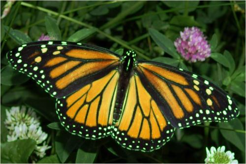</em></strong>

<strong><em>Image </em></strong><strong><em>Dilation 3&times;3 Red</em></strong>

<strong><em>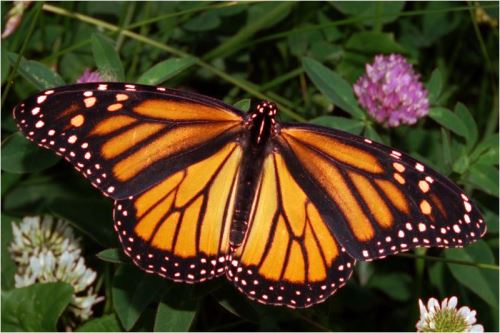</em></strong>

<strong><em>Image </em></strong><strong><em>Dilation 3&times;3 Red, Blue</em></strong>

<strong><em></em></strong>

<strong><em>Image </em></strong><strong><em>Dilation 3&times;3 Red, Green, Blue</em></strong>

<strong><em>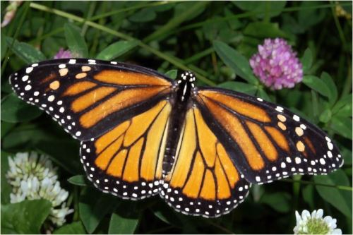</em></strong>

<strong><em>Image </em></strong><strong><em>Dilation 13&times;13 Blue</em></strong>

<strong><em></em></strong>

<strong><em>Image </em></strong><strong><em>Erosion 3&times;3 Green, Blue</em></strong>

<strong><em>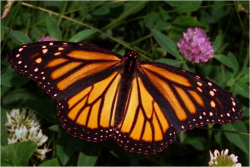</em></strong>

<strong><em>Image </em></strong><strong><em>Erosion 3&times;3 Green</em></strong>

<strong><em>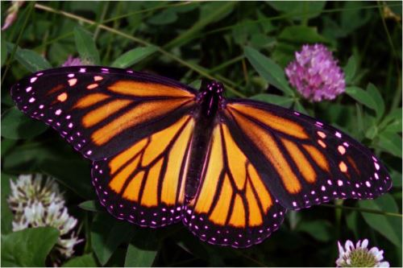</em></strong>

<strong><em>Image </em></strong><strong><em>Erosion 3&times;3 Red</em></strong>

<strong><em>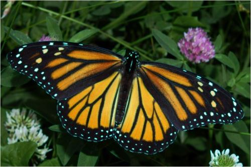</em></strong>

<strong><em>Image </em></strong><strong><em>Erosion 3&times;3 Red, Blue</em></strong>

<strong><em></em></strong>

<strong><em>Image </em></strong><strong><em>Erosion 3&times;3 Red, Green</em></strong>

<strong><em></em></strong>

<strong><em>Image </em></strong><strong><em>Erosion 3&times;3 Red, Green, Blue</em></strong>

<strong><em>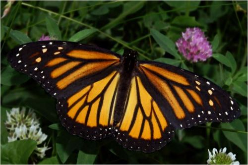</em></strong>

<strong><em>Image </em></strong><strong><em>Erosion 9&times;9 Green</em></strong>

<strong><em>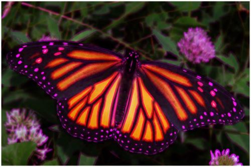</em></strong>

<strong><em>Image </em></strong><strong><em>Erosion 9&times;9 Red</em></strong>

<strong><em>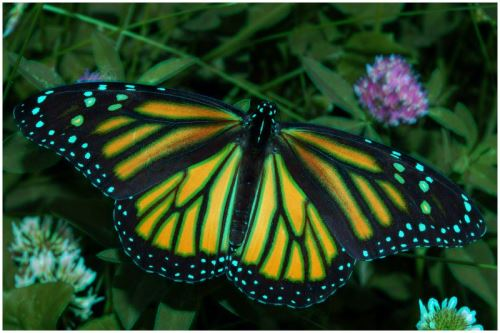</em></strong>

<strong><em>Image Open </em></strong><strong><em>Morphology 11&times;11 Green</em></strong>

<strong><em>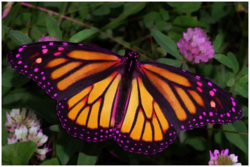</em></strong>

<strong><em>Image Open </em></strong><strong><em>Morphology 11&times;11 Green Blue</em></strong>

<strong><em>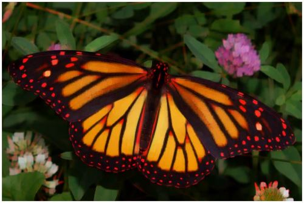</em></strong>

<strong><em>Image Open </em></strong><strong><em>Morphology 11&times;11 Red</em></strong>

<strong><em>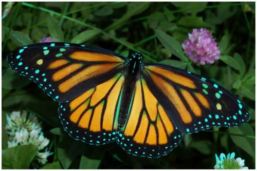</em></strong>

<strong><em>Image Open </em></strong><strong><em>Morphology 11&times;11 Red, Blue</em></strong>

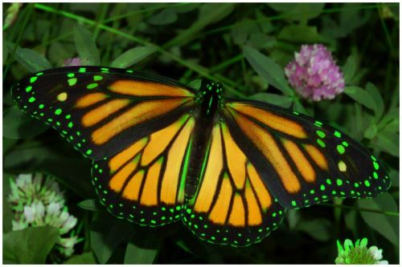

<h1>Source Code Files</h1>
<ul>
<li><em>ExtBitmap.cs - Contains the definition of extension methods: DilateAndErodeFilter, OpenMorphologyFilter and CloseMorphologyFilter.</em>
</li><li><em><em>MainForm.cs - Windows Forms based sample application.</em></em> </li></ul>
<h1>More Information</h1>

This article is based on an article originally posted on my <a href="http://softwarebydefault.com/" target="_blank">
blog</a>:&nbsp;<a href="http://softwarebydefault.com/2013/05/19/image-erosion-dilation/" target="_blank">http://softwarebydefault.com/2013/05/19/image-erosion-dilation/</a> If you have any questions/comments please feel free to make use of the Q&amp;A section
 on this page, also please remember to rate this article.

<strong><em><a title="About Dewald Esterhuizen" rel="tag" href="http://softwarebydefault.com/about/" target="_blank">Dewald Esterhuizen</a></em></strong>

