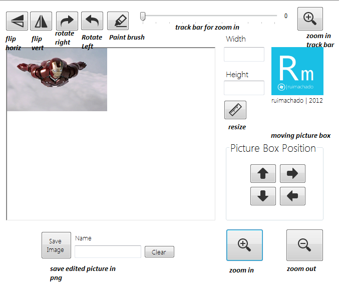

# Image Manipulation C#
## Requires
- Visual Studio 2010
## License
- Apache License, Version 2.0
## Technologies
- Visual Studio 2010
- C# Language
## Topics
- Image manipulation
## Updated
- 08/08/2012
## Description

<h1>* <em>Version 2.0 - Added Load Image Function</em></h1>

&nbsp;

<h1>Introduction</h1>

<em>I have been noticing that for some reason people are developing several projects with pictures in Visual Studio Projects, mainly Windows forms projects. Evern yesterday i helped a guy with an issue of zoom in and out an image within a picture box.
 For those that dont know this visual studio toolbox artifact, it represents a Windows picture box control for displaying an image.
</em>

<em>After helping this guy i started to google for some related problems and found out many other people asking the same questions. In order to help these people and other that may work with Images in Visual Studio projects i developed this small Demo,
 to show you how simple operations can be done.</em>

Description

<em>This sample countains controls to mak several manipulations in Images within a picture box, such controls include:</em>

<ul>
<li>Zoom in </li><li>Zoom out </li><li>Flip Horizontally </li><li>Flip Vertically </li><li>Resizing </li><li>Rotate Left </li><li>Rotate Right </li><li>Zoom in with a track bar </li><li>Make drawings in the image with a brush </li><li>Saving the manipulated picture </li><li>Moving picture box </li><li>Load images to picture box </li></ul>

These ar as i said, the basics controls to start playing with pictures in Visual Studio. Here is a print screen on this demo with the explanation of the controls:

&nbsp;

This sample includes just one image and no control to change it dynamcally, hoevr you can change the image to one of your own in the picture box control.

&nbsp;

Snippet of a zoom in&nbsp;

C#

Edit|Remove

csharp

<pre class="csharp">public&nbsp;void&nbsp;ZoomIn()&nbsp;
&nbsp;&nbsp;&nbsp;&nbsp;&nbsp;&nbsp;&nbsp;&nbsp;{&nbsp;
&nbsp;&nbsp;&nbsp;&nbsp;&nbsp;&nbsp;&nbsp;&nbsp;&nbsp;&nbsp;&nbsp;&nbsp;Multiplier&nbsp;=&nbsp;new&nbsp;Size(2,2);&nbsp;
&nbsp;
&nbsp;&nbsp;&nbsp;&nbsp;&nbsp;&nbsp;&nbsp;&nbsp;&nbsp;&nbsp;&nbsp;&nbsp;Image&nbsp;MyImage&nbsp;=&nbsp;pictureBox1.Image;&nbsp;
&nbsp;
&nbsp;&nbsp;&nbsp;&nbsp;&nbsp;&nbsp;&nbsp;&nbsp;&nbsp;&nbsp;&nbsp;&nbsp;Bitmap&nbsp;MyBitMap&nbsp;=&nbsp;new&nbsp;Bitmap(MyImage,&nbsp;Convert.ToInt32(MyImage.Width&nbsp;*&nbsp;Multiplier.Width),&nbsp;
&nbsp;&nbsp;&nbsp;&nbsp;&nbsp;&nbsp;&nbsp;&nbsp;&nbsp;&nbsp;&nbsp;&nbsp;&nbsp;&nbsp;&nbsp;&nbsp;Convert.ToInt32(MyImage.Height&nbsp;*&nbsp;Multiplier.Height));&nbsp;
&nbsp;
&nbsp;&nbsp;&nbsp;&nbsp;&nbsp;&nbsp;&nbsp;&nbsp;&nbsp;&nbsp;&nbsp;&nbsp;Graphics&nbsp;Graphic&nbsp;=&nbsp;Graphics.FromImage(MyBitMap);&nbsp;
&nbsp;
&nbsp;&nbsp;&nbsp;&nbsp;&nbsp;&nbsp;&nbsp;&nbsp;&nbsp;&nbsp;&nbsp;&nbsp;Graphic.InterpolationMode&nbsp;=&nbsp;InterpolationMode.High&nbsp;;&nbsp;
&nbsp;
&nbsp;&nbsp;&nbsp;&nbsp;&nbsp;&nbsp;&nbsp;&nbsp;&nbsp;&nbsp;&nbsp;&nbsp;pictureBox1.Image&nbsp;=&nbsp;MyBitMap;&nbsp;
&nbsp;
&nbsp;&nbsp;&nbsp;&nbsp;&nbsp;&nbsp;&nbsp;&nbsp;}</pre>

&nbsp;

&nbsp;

<h1>About Me</h1>

<em>Rui Pedro Machado @ 2012 | Portugal&nbsp; <a href="mailto:ruimachado@wordpess.com">
rpmachado.wordpress.com</a></em>

&nbsp;

&nbsp;

