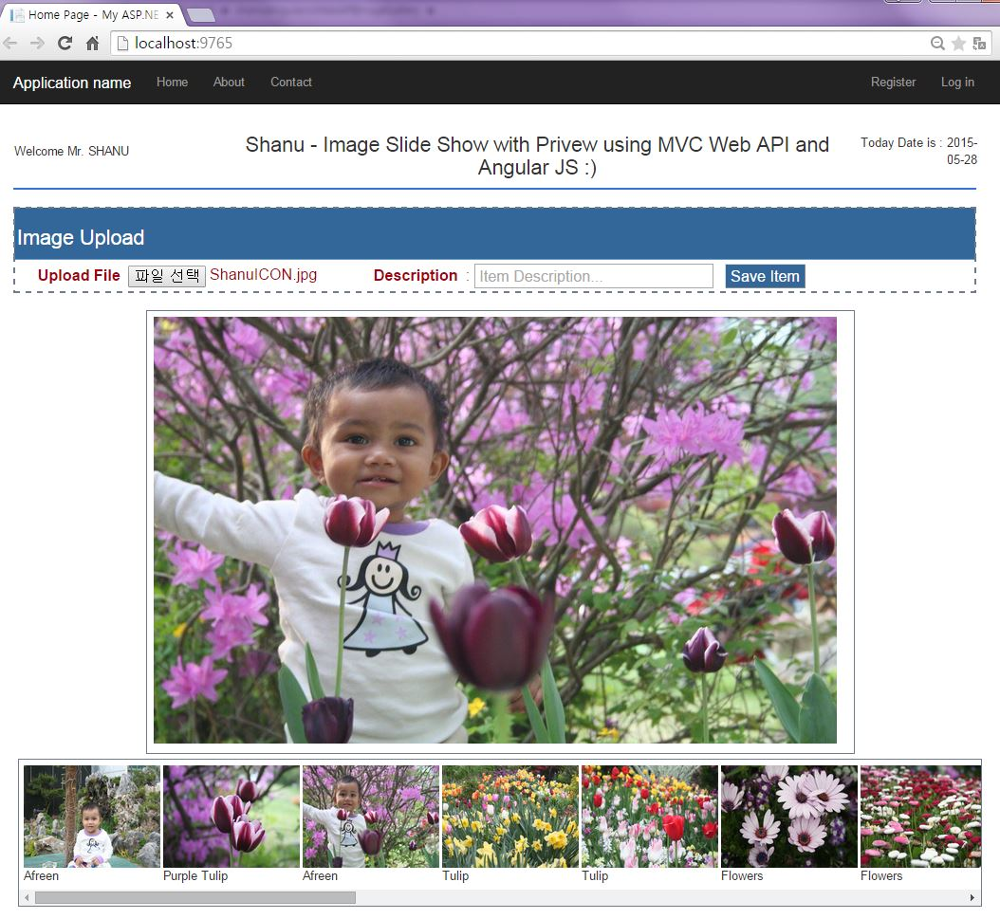
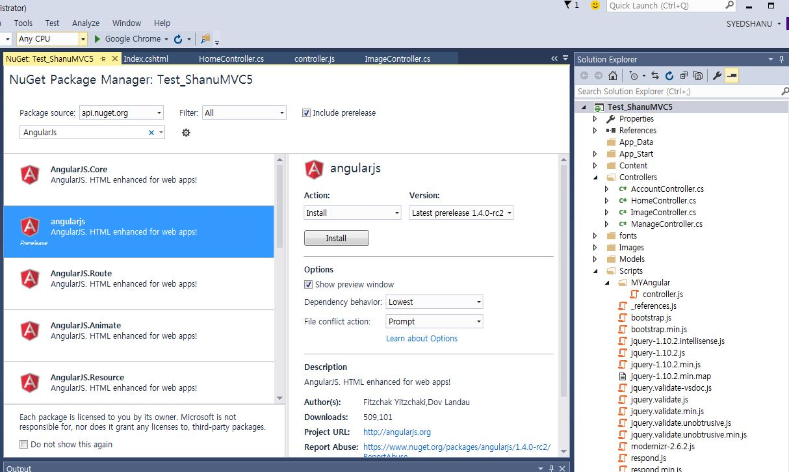
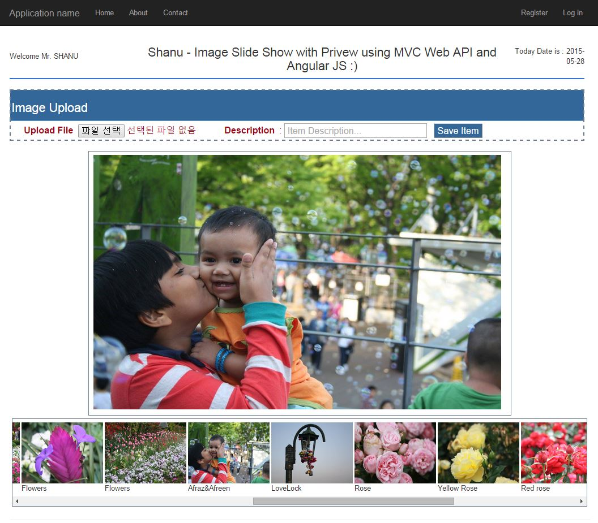
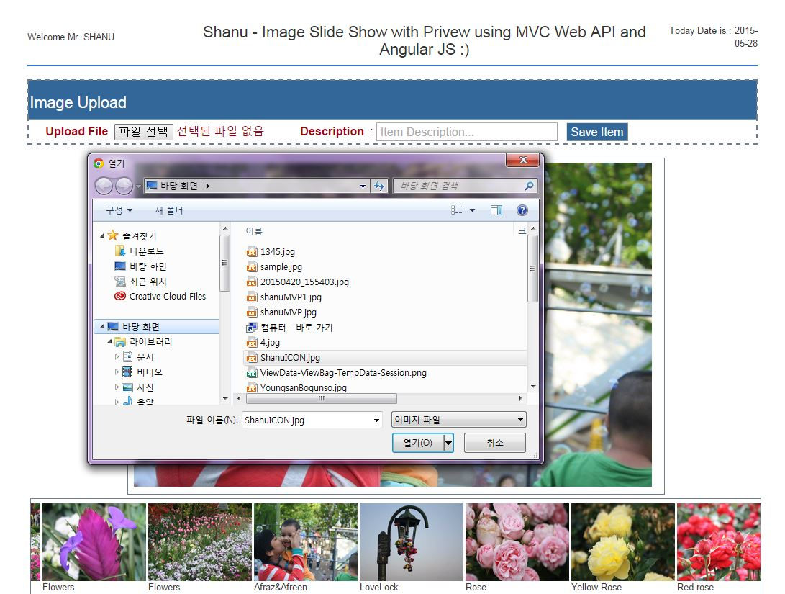
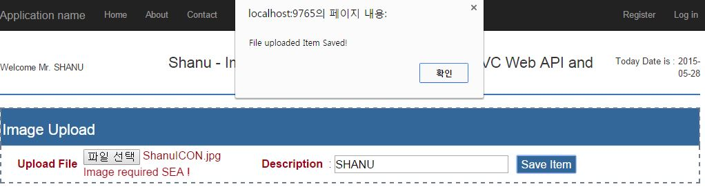

# Image Preview using MVC, AngularJs and Web API 2
## Requires
- Visual Studio 2015
## License
- MIT
## Technologies
- ASP.NET MVC
- WebAPI
- AngularJS
## Topics
- ASP.NET MVC
- WebAPI
- AngularJS
## Updated
- 08/31/2015
## Description

<h1>Introduction</h1>

In my previous article I explained AngualrJS with MVC and WCS Rest service. This article explains in detail how to create a simple Image Slideshow using MVC&nbsp;and AngularJs and using Web API 2. 
 
You can also view my previous articles related to AngularJs using MVC and the WCF Rest Serice.

<ul>
<li><em><a href="https://code.msdn.microsoft.com/Dynamic-scheduling-using-35328360" target="_blank">https://code.msdn.microsoft.com/Dynamic-scheduling-using-35328360</a></em>
</li><li><a href="https://code.msdn.microsoft.com/MVC-Angular-JS-CRUD-using-b4845edc" target="_blank">https://code.msdn.microsoft.com/MVC-Angular-JS-CRUD-using-b4845edc</a>
</li><li><a href="https://code.msdn.microsoft.com/AngularJS-Shopping-Cart-8d4dde90" target="_blank">https://code.msdn.microsoft.com/AngularJS-Shopping-Cart-8d4dde90</a>
</li><li><a href="https://code.msdn.microsoft.com/MVC-AngularJS-and-WCF-Rest-27d239b4" target="_blank">https://code.msdn.microsoft.com/MVC-AngularJS-and-WCF-Rest-27d239b4</a>
</li><li><a href="https://code.msdn.microsoft.com/MVC-Web-API-and-Angular-JS-36302919" target="_blank">https://code.msdn.microsoft.com/MVC-Web-API-and-Angular-JS-36302919</a>
</li></ul>
<ul>
<li><a href="https://code.msdn.microsoft.com/AngularJS-Filter-Sorting-1fe023c3" target="_blank">https://code.msdn.microsoft.com/MVC-Web-API-and-Angular-JS-36302919</a>
</li></ul>

Building the Sample

<strong>Prerequisites 
</strong> 
Visual Studio 2015. You can download it from <a rel="nofollow" href="https://www.visualstudio.com/en-us/downloads/visual-studio-2015-downloads-vs.aspx">
here</a>. (In my example I have used Visual Studio Community 2015 RC.)

Note :You can download and use the New Visual Studio 2015. 
 
This article explains the following in detail:

<ol>
<li>Select Image details from the database using EF and WEB API. </li><li>Upload Image to our root folder using AngularJs and MVC Controller method. </li><li>Insert uploaded image details to the database using AngularJs , MVC and the WEB API.
</li><li>Display animated images by clicking on Preview Image. </li></ol>

The base idea for this article was from my article on Windows Forms Based Image Slideshow Application. You can also have a look at that article.

Description

<strong>1. Create Database and Table 
</strong> 
We will create a ImageDetails table under the database ImageDB. The following is the script to create a database, table and sample insert query. Run this script in your SQL Server. I have used SQL Server 2012. 
 
<strong>Note:</strong> In my project folder I have all the images for a sample display.

&nbsp;

SQL

Edit|Remove

mysql

<pre class="mysql">--&nbsp;=============================================&nbsp;&nbsp;&nbsp;&nbsp;&nbsp;&nbsp;&nbsp;&nbsp;&nbsp;&nbsp;&nbsp;&nbsp;&nbsp;&nbsp;&nbsp;&nbsp;&nbsp;&nbsp;&nbsp;&nbsp;&nbsp;&nbsp;&nbsp;&nbsp;&nbsp;&nbsp;&nbsp;&nbsp;&nbsp;&nbsp;&nbsp;&nbsp;&nbsp;
--&nbsp;Author&nbsp;&nbsp;&nbsp;&nbsp;&nbsp;&nbsp;:&nbsp;Shanu&nbsp;&nbsp;&nbsp;&nbsp;&nbsp;&nbsp;&nbsp;&nbsp;&nbsp;&nbsp;&nbsp;&nbsp;&nbsp;&nbsp;&nbsp;&nbsp;&nbsp;&nbsp;&nbsp;&nbsp;&nbsp;&nbsp;&nbsp;&nbsp;&nbsp;&nbsp;&nbsp;&nbsp;&nbsp;&nbsp;&nbsp;&nbsp;&nbsp;
--&nbsp;Create&nbsp;date&nbsp;:&nbsp;2015-05-15&nbsp;&nbsp;&nbsp;&nbsp;&nbsp;&nbsp;&nbsp;&nbsp;&nbsp;&nbsp;&nbsp;&nbsp;&nbsp;&nbsp;&nbsp;&nbsp;&nbsp;&nbsp;&nbsp;&nbsp;&nbsp;&nbsp;&nbsp;&nbsp;&nbsp;&nbsp;&nbsp;&nbsp;&nbsp;&nbsp;&nbsp;&nbsp;&nbsp;&nbsp;&nbsp;
--&nbsp;Description&nbsp;:&nbsp;To&nbsp;Create&nbsp;Database,Table&nbsp;and&nbsp;Sample&nbsp;Insert&nbsp;Query&nbsp;&nbsp;&nbsp;&nbsp;&nbsp;&nbsp;&nbsp;&nbsp;&nbsp;&nbsp;&nbsp;&nbsp;&nbsp;&nbsp;&nbsp;&nbsp;&nbsp;&nbsp;&nbsp;&nbsp;&nbsp;&nbsp;&nbsp;&nbsp;&nbsp;&nbsp;&nbsp;&nbsp;&nbsp;&nbsp;
--&nbsp;Latest&nbsp;&nbsp;&nbsp;&nbsp;&nbsp;&nbsp;&nbsp;&nbsp;&nbsp;&nbsp;&nbsp;&nbsp;&nbsp;&nbsp;&nbsp;&nbsp;&nbsp;&nbsp;&nbsp;&nbsp;&nbsp;&nbsp;&nbsp;&nbsp;&nbsp;&nbsp;&nbsp;&nbsp;&nbsp;&nbsp;&nbsp;&nbsp;&nbsp;
--&nbsp;Modifier&nbsp;&nbsp;&nbsp;&nbsp;:&nbsp;Shanu&nbsp;&nbsp;&nbsp;&nbsp;&nbsp;&nbsp;&nbsp;&nbsp;&nbsp;&nbsp;&nbsp;&nbsp;&nbsp;&nbsp;&nbsp;&nbsp;&nbsp;&nbsp;&nbsp;&nbsp;&nbsp;&nbsp;&nbsp;&nbsp;&nbsp;&nbsp;&nbsp;&nbsp;&nbsp;&nbsp;&nbsp;&nbsp;&nbsp;
--&nbsp;Modify&nbsp;date&nbsp;:&nbsp;2015-05-15&nbsp;&nbsp;&nbsp;&nbsp;&nbsp;&nbsp;&nbsp;&nbsp;&nbsp;&nbsp;&nbsp;&nbsp;&nbsp;&nbsp;&nbsp;&nbsp;&nbsp;&nbsp;&nbsp;&nbsp;&nbsp;&nbsp;&nbsp;&nbsp;&nbsp;&nbsp;&nbsp;&nbsp;&nbsp;
--&nbsp;=============================================&nbsp;
--Script&nbsp;to&nbsp;create&nbsp;DB,Table&nbsp;and&nbsp;sample&nbsp;Insert&nbsp;data&nbsp;
USE&nbsp;MASTER&nbsp;
GO&nbsp;
--&nbsp;1)&nbsp;Check&nbsp;for&nbsp;the&nbsp;Database&nbsp;Exists&nbsp;.If&nbsp;the&nbsp;database&nbsp;is&nbsp;exist&nbsp;then&nbsp;drop&nbsp;and&nbsp;create&nbsp;new&nbsp;DB&nbsp;
IF&nbsp;EXISTS&nbsp;(SELECT&nbsp;[name]&nbsp;FROM&nbsp;sys.databases&nbsp;WHERE&nbsp;[name]&nbsp;=&nbsp;'ImageDB'&nbsp;)&nbsp;
DROP&nbsp;DATABASE&nbsp;DynamicProject&nbsp;
GO&nbsp;
&nbsp;
CREATE&nbsp;DATABASE&nbsp;ImageDB&nbsp;
GO&nbsp;
&nbsp;
USE&nbsp;ImageDB&nbsp;
GO&nbsp;
&nbsp;
--&nbsp;1)&nbsp;////////////&nbsp;ItemMasters&nbsp;
&nbsp;
IF&nbsp;EXISTS&nbsp;(&nbsp;SELECT&nbsp;[name]&nbsp;FROM&nbsp;sys.tables&nbsp;WHERE&nbsp;[name]&nbsp;=&nbsp;'ImageDetails'&nbsp;)&nbsp;
DROP&nbsp;TABLE&nbsp;ImageDetails&nbsp;
GO&nbsp;
&nbsp;
CREATE&nbsp;TABLE&nbsp;[dbo].[ImageDetails](&nbsp;
&nbsp;&nbsp;&nbsp;&nbsp;[ImageID]&nbsp;INT&nbsp;IDENTITY&nbsp;PRIMARY&nbsp;KEY,&nbsp;
&nbsp;&nbsp;&nbsp;&nbsp;[Image_Path]&nbsp;[varchar](100)&nbsp;NOT&nbsp;NULL,&nbsp;&nbsp;&nbsp;&nbsp;&nbsp;
&nbsp;&nbsp;&nbsp;&nbsp;[Description]&nbsp;[varchar](200)&nbsp;NOT&nbsp;NULL)&nbsp;
&nbsp;&nbsp;
&nbsp;
INSERT&nbsp;INTO&nbsp;[ImageDetails]&nbsp;([Image_Path],[Description])&nbsp;&nbsp;VALUES&nbsp;&nbsp;&nbsp;&nbsp;('1.jpg','Afreen')&nbsp;
INSERT&nbsp;INTO&nbsp;[ImageDetails]&nbsp;([Image_Path],[Description])&nbsp;&nbsp;VALUES&nbsp;&nbsp;&nbsp;&nbsp;('2.jpg','Purple&nbsp;Tulip')&nbsp;
INSERT&nbsp;INTO&nbsp;[ImageDetails]&nbsp;([Image_Path],[Description])&nbsp;&nbsp;VALUES&nbsp;&nbsp;&nbsp;&nbsp;('3.jpg','Afreen')&nbsp;
INSERT&nbsp;INTO&nbsp;[ImageDetails]&nbsp;([Image_Path],[Description])&nbsp;&nbsp;VALUES&nbsp;&nbsp;&nbsp;&nbsp;('4.jpg','Tulip')&nbsp;
INSERT&nbsp;INTO&nbsp;[ImageDetails]&nbsp;([Image_Path],[Description])&nbsp;&nbsp;VALUES&nbsp;&nbsp;&nbsp;&nbsp;('5.jpg','Tulip')&nbsp;
INSERT&nbsp;INTO&nbsp;[ImageDetails]&nbsp;([Image_Path],[Description])&nbsp;&nbsp;VALUES&nbsp;&nbsp;&nbsp;&nbsp;('6.jpg','Flowers')&nbsp;
INSERT&nbsp;INTO&nbsp;[ImageDetails]&nbsp;([Image_Path],[Description])&nbsp;&nbsp;VALUES&nbsp;&nbsp;&nbsp;&nbsp;('7.jpg','Flowers')&nbsp;
INSERT&nbsp;INTO&nbsp;[ImageDetails]&nbsp;([Image_Path],[Description])&nbsp;&nbsp;VALUES&nbsp;&nbsp;&nbsp;&nbsp;('8.jpg','Flowers')&nbsp;
INSERT&nbsp;INTO&nbsp;[ImageDetails]&nbsp;([Image_Path],[Description])&nbsp;&nbsp;VALUES&nbsp;&nbsp;&nbsp;&nbsp;('9.jpg','Flowers')&nbsp;
INSERT&nbsp;INTO&nbsp;[ImageDetails]&nbsp;([Image_Path],[Description])&nbsp;&nbsp;VALUES&nbsp;&nbsp;&nbsp;&nbsp;('10.jpg','Flowers')&nbsp;
INSERT&nbsp;INTO&nbsp;[ImageDetails]&nbsp;([Image_Path],[Description])&nbsp;&nbsp;VALUES&nbsp;&nbsp;&nbsp;&nbsp;('11.jpg','Afraz&amp;Afreen')&nbsp;
INSERT&nbsp;INTO&nbsp;[ImageDetails]&nbsp;([Image_Path],[Description])&nbsp;&nbsp;VALUES&nbsp;&nbsp;&nbsp;&nbsp;('12.jpg','LoveLock')&nbsp;
INSERT&nbsp;INTO&nbsp;[ImageDetails]&nbsp;([Image_Path],[Description])&nbsp;&nbsp;VALUES&nbsp;&nbsp;&nbsp;&nbsp;('13.jpg','Rose')&nbsp;
INSERT&nbsp;INTO&nbsp;[ImageDetails]&nbsp;([Image_Path],[Description])&nbsp;&nbsp;VALUES&nbsp;&nbsp;&nbsp;&nbsp;('14.jpg','Yellow&nbsp;Rose')&nbsp;
INSERT&nbsp;INTO&nbsp;[ImageDetails]&nbsp;([Image_Path],[Description])&nbsp;&nbsp;VALUES&nbsp;&nbsp;&nbsp;&nbsp;('15.jpg','Red&nbsp;rose')&nbsp;
INSERT&nbsp;INTO&nbsp;[ImageDetails]&nbsp;([Image_Path],[Description])&nbsp;&nbsp;VALUES&nbsp;&nbsp;&nbsp;&nbsp;('16.jpg','Cherry&nbsp;blossom')&nbsp;
INSERT&nbsp;INTO&nbsp;[ImageDetails]&nbsp;([Image_Path],[Description])&nbsp;&nbsp;VALUES&nbsp;&nbsp;&nbsp;&nbsp;('17.jpg','Afreen')&nbsp;
INSERT&nbsp;INTO&nbsp;[ImageDetails]&nbsp;([Image_Path],[Description])&nbsp;&nbsp;VALUES&nbsp;&nbsp;&nbsp;&nbsp;('18.jpg','fish&nbsp;Market')&nbsp;
INSERT&nbsp;INTO&nbsp;[ImageDetails]&nbsp;([Image_Path],[Description])&nbsp;&nbsp;VALUES&nbsp;&nbsp;&nbsp;&nbsp;('19.jpg','Afraz')&nbsp;
&nbsp;
&nbsp;&nbsp;&nbsp;&nbsp;&nbsp;&nbsp;&nbsp;&nbsp;&nbsp;&nbsp;&nbsp;&nbsp;&nbsp;&nbsp;&nbsp;&nbsp;&nbsp;&nbsp;
select&nbsp;*&nbsp;from&nbsp;[ImageDetails]&nbsp;
</pre>

&nbsp;

<strong>2. Create our First MVC Web Application in Visual Studio 2015</strong>

Now to create our first MVC web application in Visual Studio 2015. 
 
After installing Visual Studio 2015, click Start then select Programs then select Visual Studio 2015. Then click Visual Studio 2015 RC.

Click New -&gt; Project - &gt; Select Web -&gt; ASP.NET Web Application. Select your project's location and enter your web application's name. 

Select MVC and in &quot;Add Folders and Core reference for:&quot; select the Web API (as in the following) and click OK. 

Now we have created our MVC application. As a next step we will add our SQL Server database as an Entity Data Model to our application. 
 
<strong>Add Database using ADO.NET Entity Data Model 
</strong> 
Right-click our project and click Add -&gt; New Item. 
Select Data -&gt; Select ADO.NET Entity Data Model then provide the name for our EF and click Add. 

Select EF Designer from database and click Next. 
Here click New Connection and provide your SQL-Server Server Name and connect to your database.

Here we can see I have given my SQL Server name, Id and PWD. After the connection, the database is selected as ImageDB since we have created the database using my SQL Script. 

Click Next and select the table to be used and click Finish. 
Here we can see I have selected our table Imagedetails. This table will be used to get and insert all our images. 

Once our entity has been created the next step is to add a WEB API to our controller and write a function to get and insert records. 
 
<strong>Procedure to add our WEB API Controller 
</strong> 
Right-click the Controllers folder then click Add then click Controller. 
Since we will create our WEB API Controller, select Controller and Add Empty WEB API 2 Controller. Provide your name to the Web API controller and click OK. Here for my Web API Controller I have given the name as &ldquo;ImageController&rdquo;. 

As we all know, the Web API is a simple and easy way to build HTTP Services for Browsers and Mobiles. Web APIs has the four methods
<strong>Get/Post/Put and Delete</strong> where:

<ul>
<li><strong>Get</strong> is to request data. (Select) </li><li><strong>Post</strong> is to create data. (Insert) </li><li><strong>Put</strong> is to update data. </li><li><strong>Delete</strong> is to delete data. </li></ul>

In our example we will use both <strong>Get</strong> and <strong>Post</strong> since we need to get all the image names and descriptions from the database and to insert a new Image Name and Image Description into the database. 
 
<strong>Get Method 
</strong> 
Now as a next step we need to create an object for our entity and write our Get and Post methods.
 
 
We will use a get method to get all the details of the ImageDetails table using an entity object and we will return the result as an IEnumerable. We will use this method in our AngularJs and display the result in a MVC page from the AngularJs controller using
 Ng-Repeat. We can see the details step-by-step as follows.

&nbsp;

C#

Edit|Remove

csharp

<pre class="csharp">public&nbsp;class&nbsp;ImageController&nbsp;:&nbsp;ApiController&nbsp;
&nbsp;&nbsp;&nbsp;&nbsp;&nbsp;&nbsp;&nbsp;&nbsp;{&nbsp;
&nbsp;&nbsp;&nbsp;&nbsp;&nbsp;&nbsp;&nbsp;&nbsp;&nbsp;&nbsp;&nbsp;&nbsp;ImageDBEntities&nbsp;objAPI&nbsp;=&nbsp;new&nbsp;ImageDBEntities();&nbsp;
&nbsp;
&nbsp;
&nbsp;//get&nbsp;all&nbsp;Images&nbsp;
&nbsp;&nbsp;&nbsp;&nbsp;&nbsp;&nbsp;&nbsp;&nbsp;[HttpGet]&nbsp;
&nbsp;&nbsp;&nbsp;&nbsp;&nbsp;&nbsp;&nbsp;&nbsp;public&nbsp;IEnumerable&lt;ImageDetails&gt;&nbsp;Get()&nbsp;
&nbsp;&nbsp;&nbsp;&nbsp;&nbsp;&nbsp;&nbsp;&nbsp;{&nbsp;
&nbsp;&nbsp;&nbsp;&nbsp;&nbsp;&nbsp;&nbsp;&nbsp;&nbsp;&nbsp;&nbsp;&nbsp;return&nbsp;objAPI.ImageDetails.AsEnumerable();&nbsp;
&nbsp;&nbsp;&nbsp;&nbsp;&nbsp;&nbsp;&nbsp;&nbsp;&nbsp;&nbsp;&nbsp;&nbsp;//return&nbsp;objAPI.ImageDetails.AsEnumerable().OrderByDescending(item&nbsp;=&gt;&nbsp;item.ImageID&nbsp;);&nbsp;
&nbsp;
&nbsp;&nbsp;&nbsp;&nbsp;&nbsp;&nbsp;&nbsp;&nbsp;}&nbsp;
&nbsp;
&nbsp;
&nbsp;&nbsp;&nbsp;&nbsp;}&nbsp;
</pre>

&nbsp;<strong>Post Method 
</strong> 
Using the post method we will insert the Image details into the database. If HttpResponseMessage is used in the Action result, the Web API will convert the return value into a HTTP response message.

C#

Edit|Remove

csharp

<pre class="csharp">public&nbsp;class&nbsp;ImageController&nbsp;:&nbsp;ApiController&nbsp;
&nbsp;&nbsp;&nbsp;&nbsp;{&nbsp;
&nbsp;&nbsp;&nbsp;&nbsp;&nbsp;&nbsp;&nbsp;&nbsp;ImageDBEntities&nbsp;objAPI&nbsp;=&nbsp;new&nbsp;ImageDBEntities();&nbsp;
&nbsp;
&nbsp;&nbsp;&nbsp;&nbsp;&nbsp;&nbsp;&nbsp;&nbsp;//get&nbsp;all&nbsp;Images&nbsp;
&nbsp;&nbsp;&nbsp;&nbsp;&nbsp;&nbsp;&nbsp;&nbsp;[HttpGet]&nbsp;
&nbsp;&nbsp;&nbsp;&nbsp;&nbsp;&nbsp;&nbsp;&nbsp;public&nbsp;IEnumerable&lt;ImageDetails&gt;&nbsp;Get()&nbsp;
&nbsp;&nbsp;&nbsp;&nbsp;&nbsp;&nbsp;&nbsp;&nbsp;{&nbsp;
&nbsp;&nbsp;&nbsp;&nbsp;&nbsp;&nbsp;&nbsp;&nbsp;&nbsp;&nbsp;&nbsp;return&nbsp;objAPI.ImageDetails.AsEnumerable();&nbsp;
&nbsp;&nbsp;&nbsp;&nbsp;&nbsp;&nbsp;&nbsp;&nbsp;&nbsp;&nbsp;&nbsp;&nbsp;//return&nbsp;objAPI.ImageDetails.AsEnumerable().OrderByDescending(item&nbsp;=&gt;&nbsp;item.ImageID&nbsp;);&nbsp;
&nbsp;
&nbsp;&nbsp;&nbsp;&nbsp;&nbsp;&nbsp;&nbsp;&nbsp;}&nbsp;
&nbsp;
&nbsp;&nbsp;&nbsp;&nbsp;&nbsp;&nbsp;&nbsp;&nbsp;//insert&nbsp;Image&nbsp;
&nbsp;&nbsp;&nbsp;&nbsp;&nbsp;&nbsp;&nbsp;&nbsp;public&nbsp;HttpResponseMessage&nbsp;Post(ImageDetails&nbsp;imagedetails)&nbsp;
&nbsp;&nbsp;&nbsp;&nbsp;&nbsp;&nbsp;&nbsp;&nbsp;{&nbsp;
&nbsp;&nbsp;&nbsp;&nbsp;&nbsp;&nbsp;&nbsp;&nbsp;&nbsp;&nbsp;&nbsp;&nbsp;if&nbsp;(ModelState.IsValid)&nbsp;
&nbsp;&nbsp;&nbsp;&nbsp;&nbsp;&nbsp;&nbsp;&nbsp;&nbsp;&nbsp;&nbsp;&nbsp;{&nbsp;
&nbsp;&nbsp;&nbsp;&nbsp;&nbsp;&nbsp;&nbsp;&nbsp;&nbsp;&nbsp;&nbsp;&nbsp;&nbsp;&nbsp;&nbsp;&nbsp;objAPI.ImageDetails.Add(imagedetails);&nbsp;
&nbsp;&nbsp;&nbsp;&nbsp;&nbsp;&nbsp;&nbsp;&nbsp;&nbsp;&nbsp;&nbsp;&nbsp;&nbsp;&nbsp;&nbsp;&nbsp;objAPI.SaveChanges();&nbsp;
&nbsp;&nbsp;&nbsp;&nbsp;&nbsp;&nbsp;&nbsp;&nbsp;&nbsp;&nbsp;&nbsp;&nbsp;&nbsp;&nbsp;&nbsp;&nbsp;HttpResponseMessage&nbsp;response&nbsp;=&nbsp;Request.CreateResponse(HttpStatusCode.Created,&nbsp;imagedetails);&nbsp;
&nbsp;&nbsp;&nbsp;&nbsp;&nbsp;&nbsp;&nbsp;&nbsp;&nbsp;&nbsp;&nbsp;&nbsp;&nbsp;&nbsp;&nbsp;&nbsp;response.Headers.Location&nbsp;=&nbsp;new&nbsp;Uri(Url.Link(&quot;DefaultApi&quot;,&nbsp;new&nbsp;{&nbsp;id&nbsp;=&nbsp;imagedetails.Image_Path}));&nbsp;
&nbsp;&nbsp;&nbsp;&nbsp;&nbsp;&nbsp;&nbsp;&nbsp;&nbsp;&nbsp;&nbsp;&nbsp;&nbsp;&nbsp;&nbsp;&nbsp;return&nbsp;response;&nbsp;
&nbsp;&nbsp;&nbsp;&nbsp;&nbsp;&nbsp;&nbsp;&nbsp;&nbsp;&nbsp;&nbsp;&nbsp;}&nbsp;
&nbsp;&nbsp;&nbsp;&nbsp;&nbsp;&nbsp;&nbsp;&nbsp;&nbsp;&nbsp;&nbsp;&nbsp;else&nbsp;
&nbsp;&nbsp;&nbsp;&nbsp;&nbsp;&nbsp;&nbsp;&nbsp;&nbsp;&nbsp;&nbsp;&nbsp;{&nbsp;
&nbsp;&nbsp;&nbsp;&nbsp;&nbsp;&nbsp;&nbsp;&nbsp;&nbsp;&nbsp;&nbsp;&nbsp;&nbsp;&nbsp;&nbsp;&nbsp;return&nbsp;Request.CreateErrorResponse(HttpStatusCode.BadRequest,&nbsp;ModelState);&nbsp;
&nbsp;&nbsp;&nbsp;&nbsp;&nbsp;&nbsp;&nbsp;&nbsp;&nbsp;&nbsp;&nbsp;&nbsp;}&nbsp;
&nbsp;&nbsp;&nbsp;&nbsp;&nbsp;&nbsp;&nbsp;&nbsp;}&nbsp;
&nbsp;&nbsp;&nbsp;&nbsp;}&nbsp;
</pre>

&nbsp;Now we have created our Web API Controller Class. The next step is to create our AngularJs Module and Controller. Let us see how to create our AngularJs Controller. In Visual Studio 2015 it's much easier to add our AngularJs
 Controller. Let us see see step-by-step how to create and write our AngularJs Controller. 
 
<strong>Creating AngularJs Controller</strong> 
 
First create a folder inside the Script Folder and I have named the folder &ldquo;MyAngular&rdquo;.

&nbsp;

Now add your Angular Controller inside the folder.

 
Right-click the MyAngular folder and click Add and New Item. Select Web. Select AngularJs Controller and provide a name to the Controller. I have given my AngularJs Controller the name &ldquo;Controller.js&rdquo;. 

Once the AngularJs Controller is created, we can see that, by default, the controller will have the code with the default module definition.&nbsp; 
 
If the AngularJs package is missing then add the package to your project. 
 
Right-click your MVC project and click Manage NuGet Packages. Search for AngularJs and click Install.

In my previous articles related to AngularJs I explained the use of AngularJs ng-repeat to display the data from AngularJs and how to receive data from WCF to Angular Services, how to do simple animation in AngularJs and how to upload images using AnngularJS
 and a MVC Controller. To see more details about each, kindly refer to my previous article, you can find a link of each at the top of this article. 
 
Now in my controller I will change the code with my Module and Controller as in the following. 
 
First we will add all the references to AngularJs and then we will create a module. I have given my module the name &ldquo;RESTClientModule&rdquo;. Since we need to use simple Animation we will add the &quot;ngAnimate&quot; to our Module. 
 
In the controller for using the animation I used $timeout and for the file upload I uses the service FileUploadService. First we start with following. 
 
<strong>1. Variable declarations 
</strong> 
First I declared all the local variables that need to be used and the current date and store the date using and same, like this I have declared all the variables &nbsp;that need to be used. 
 
$scope.date. 
 
<strong>2. Methods 
</strong> 
To get the image details from our Web API we will use the $http.get method as in the following:

&nbsp;

JavaScript

Edit|Remove

js

<pre class="js">$http.get('/api/Image/').success(function&nbsp;(data)</pre>

In this we will receive all the data and store the result in:&nbsp;

&nbsp;

JavaScript

Edit|Remove

js

<pre class="js">$scope.Images&nbsp;=&nbsp;data;&nbsp;&nbsp;&nbsp;</pre>

&nbsp;I will use these images in ng-repeat to display the images one by one.

&nbsp;

&nbsp;

JavaScript

Edit|Remove

js

<pre class="js">///&nbsp;&lt;reference&nbsp;path=&quot;../angular.js&quot;&nbsp;/&gt;&nbsp;&nbsp;&nbsp;
///&nbsp;&lt;reference&nbsp;path=&quot;../angular.min.js&quot;&nbsp;/&gt;&nbsp;&nbsp;&nbsp;&nbsp;
///&nbsp;&lt;reference&nbsp;path=&quot;../angular-animate.js&quot;&nbsp;/&gt;&nbsp;&nbsp;&nbsp;&nbsp;
///&nbsp;&lt;reference&nbsp;path=&quot;../angular-animate.min.js&quot;&nbsp;/&gt;&nbsp;&nbsp;&nbsp;&nbsp;
&nbsp;
var&nbsp;app;&nbsp;
&nbsp;
(function&nbsp;()&nbsp;{&nbsp;
&nbsp;&nbsp;&nbsp;&nbsp;app&nbsp;=&nbsp;angular.module(&quot;RESTClientModule&quot;,&nbsp;['ngAnimate']);&nbsp;
})();&nbsp;
app.controller(&quot;AngularJs_ImageController&quot;,&nbsp;function&nbsp;($scope,&nbsp;$timeout,&nbsp;$rootScope,&nbsp;$window,&nbsp;$http,&nbsp;FileUploadService)&nbsp;{&nbsp;
&nbsp;&nbsp;&nbsp;&nbsp;$scope.date&nbsp;=&nbsp;new&nbsp;Date();&nbsp;
&nbsp;&nbsp;&nbsp;&nbsp;$scope.MyName&nbsp;=&nbsp;&quot;Shanu&quot;;&nbsp;
&nbsp;&nbsp;&nbsp;&nbsp;$scope.Imagename&nbsp;=&nbsp;&quot;&quot;;&nbsp;
&nbsp;&nbsp;&nbsp;&nbsp;$scope.ShowImage&nbsp;=&nbsp;false;&nbsp;
&nbsp;&nbsp;&nbsp;&nbsp;$scope.Description&nbsp;=&nbsp;&quot;&quot;;&nbsp;
&nbsp;&nbsp;&nbsp;&nbsp;$scope.AnimationImageName&nbsp;=&nbsp;&quot;1.jpg&quot;;&nbsp;
&nbsp;&nbsp;&nbsp;&nbsp;$scope.ImagesALLVal=[];&nbsp;
&nbsp;&nbsp;&nbsp;&nbsp;$scope.icountval&nbsp;=&nbsp;0&nbsp;
&nbsp;
&nbsp;
&nbsp;&nbsp;&nbsp;&nbsp;//get&nbsp;all&nbsp;image&nbsp;Details&nbsp;
&nbsp;&nbsp;&nbsp;&nbsp;$http.get('/api/Image/').success(function&nbsp;(data)&nbsp;{&nbsp;
&nbsp;&nbsp;&nbsp;&nbsp;&nbsp;&nbsp;&nbsp;&nbsp;$scope.Images&nbsp;=&nbsp;data;&nbsp;&nbsp;&nbsp;&nbsp;&nbsp;
&nbsp;&nbsp;&nbsp;&nbsp;&nbsp;&nbsp;&nbsp;&nbsp;if&nbsp;($scope.Images.length&nbsp;&gt;&nbsp;0)&nbsp;{&nbsp;
&nbsp;&nbsp;&nbsp;&nbsp;&nbsp;&nbsp;&nbsp;&nbsp;&nbsp;&nbsp;&nbsp;&nbsp;$scope.onShowImage($scope.Images[0].Image_Path);&nbsp;
&nbsp;&nbsp;&nbsp;&nbsp;&nbsp;&nbsp;&nbsp;&nbsp;}&nbsp;
&nbsp;&nbsp;&nbsp;&nbsp;})&nbsp;
&nbsp;&nbsp;&nbsp;&nbsp;.error(function&nbsp;()&nbsp;{&nbsp;
&nbsp;&nbsp;&nbsp;&nbsp;&nbsp;&nbsp;&nbsp;&nbsp;$scope.error&nbsp;=&nbsp;&quot;An&nbsp;Error&nbsp;has&nbsp;occured&nbsp;while&nbsp;loading&nbsp;posts!&quot;;&nbsp;
&nbsp;
&nbsp;&nbsp;&nbsp;&nbsp;});&nbsp;
</pre>

&nbsp;To preview the image click to display the actual image with simple animation. I will call this method in the Image Click event of AngularJs as ng-Click= onShowImage(currentImage).

JavaScript

Edit|Remove

js

<pre class="js">$scope.onShowImage&nbsp;=&nbsp;function&nbsp;(Image_Path)&nbsp;{&nbsp;
&nbsp;&nbsp;&nbsp;&nbsp;&nbsp;&nbsp;&nbsp;&nbsp;$scope.ShowImage&nbsp;=&nbsp;false;&nbsp;
&nbsp;&nbsp;&nbsp;&nbsp;&nbsp;&nbsp;&nbsp;&nbsp;$scope.AnimationImageName&nbsp;=&nbsp;Image_Path&nbsp;
&nbsp;&nbsp;&nbsp;&nbsp;&nbsp;&nbsp;&nbsp;
&nbsp;&nbsp;&nbsp;&nbsp;&nbsp;&nbsp;&nbsp;&nbsp;$timeout(function&nbsp;()&nbsp;{&nbsp;
&nbsp;&nbsp;&nbsp;&nbsp;&nbsp;&nbsp;&nbsp;&nbsp;&nbsp;&nbsp;&nbsp;&nbsp;$scope.ShowImage&nbsp;=&nbsp;true;&nbsp;
&nbsp;&nbsp;&nbsp;&nbsp;&nbsp;&nbsp;&nbsp;&nbsp;},&nbsp;400);&nbsp;
&nbsp;&nbsp;&nbsp;&nbsp;&nbsp;&nbsp;&nbsp;&nbsp;
&nbsp;&nbsp;&nbsp;&nbsp;}.&nbsp;
</pre>

&nbsp;Here we can see that when the user clicks on an image with simple animation I will display the animated image.

&nbsp;

&nbsp;

To upload an image and to insert an image name and image description to the database in the save Item button click I will call this function. 
 
In this method I will check that a valid image was uploaded and if all is true then I will pass the image to the service FileUploadService. If the upload is a success then I will insert the Image details of ImageName and Image Description into the database
 by calling the Web API post method and pass the data for insert. $http.post('/api/Image/', ItmDetails).

&nbsp;

JavaScript

Edit|Remove

js

<pre class="js">//Save&nbsp;File&nbsp;
&nbsp;&nbsp;&nbsp;&nbsp;$scope.SaveFile&nbsp;=&nbsp;function&nbsp;()&nbsp;{&nbsp;
&nbsp;&nbsp;&nbsp;&nbsp;&nbsp;&nbsp;&nbsp;&nbsp;$scope.IsFormSubmitted&nbsp;=&nbsp;true;&nbsp;
&nbsp;
&nbsp;&nbsp;&nbsp;&nbsp;&nbsp;&nbsp;&nbsp;&nbsp;$scope.Message&nbsp;=&nbsp;&quot;&quot;;&nbsp;
&nbsp;
&nbsp;&nbsp;&nbsp;&nbsp;&nbsp;&nbsp;&nbsp;&nbsp;$scope.ChechFileValid($scope.SelectedFileForUpload);&nbsp;
&nbsp;
&nbsp;&nbsp;&nbsp;&nbsp;&nbsp;&nbsp;&nbsp;&nbsp;if&nbsp;($scope.IsFormValid&nbsp;&amp;&amp;&nbsp;$scope.IsFileValid)&nbsp;{&nbsp;
&nbsp;
&nbsp;&nbsp;&nbsp;&nbsp;&nbsp;&nbsp;&nbsp;&nbsp;&nbsp;&nbsp;&nbsp;&nbsp;FileUploadService.UploadFile($scope.SelectedFileForUpload).then(function&nbsp;(d)&nbsp;{&nbsp;
&nbsp;
&nbsp;&nbsp;&nbsp;&nbsp;&nbsp;&nbsp;&nbsp;&nbsp;&nbsp;&nbsp;&nbsp;&nbsp;&nbsp;&nbsp;&nbsp;&nbsp;var&nbsp;ItmDetails&nbsp;=&nbsp;{&nbsp;
&nbsp;&nbsp;&nbsp;&nbsp;&nbsp;&nbsp;&nbsp;&nbsp;&nbsp;&nbsp;&nbsp;&nbsp;&nbsp;&nbsp;&nbsp;&nbsp;&nbsp;&nbsp;&nbsp;&nbsp;Image_Path:&nbsp;$scope.Imagename,&nbsp;
&nbsp;&nbsp;&nbsp;&nbsp;&nbsp;&nbsp;&nbsp;&nbsp;&nbsp;&nbsp;&nbsp;&nbsp;&nbsp;&nbsp;&nbsp;&nbsp;&nbsp;&nbsp;&nbsp;&nbsp;Description:&nbsp;$scope.Description&nbsp;
&nbsp;&nbsp;&nbsp;&nbsp;&nbsp;&nbsp;&nbsp;&nbsp;&nbsp;&nbsp;&nbsp;&nbsp;&nbsp;&nbsp;&nbsp;&nbsp;};&nbsp;
&nbsp;&nbsp;&nbsp;&nbsp;&nbsp;&nbsp;&nbsp;&nbsp;&nbsp;&nbsp;&nbsp;&nbsp;&nbsp;&nbsp;&nbsp;&nbsp;$http.post('/api/Image/',&nbsp;ItmDetails).success(function&nbsp;(data)&nbsp;{&nbsp;
&nbsp;&nbsp;&nbsp;&nbsp;&nbsp;&nbsp;&nbsp;&nbsp;&nbsp;&nbsp;&nbsp;&nbsp;&nbsp;&nbsp;&nbsp;&nbsp;&nbsp;&nbsp;&nbsp;&nbsp;alert(&quot;Added&nbsp;Successfully!!&quot;);&nbsp;
&nbsp;&nbsp;&nbsp;&nbsp;&nbsp;&nbsp;&nbsp;&nbsp;&nbsp;&nbsp;&nbsp;&nbsp;&nbsp;&nbsp;&nbsp;&nbsp;&nbsp;&nbsp;&nbsp;&nbsp;$scope.addMode&nbsp;=&nbsp;false;&nbsp;
&nbsp;&nbsp;&nbsp;&nbsp;&nbsp;&nbsp;&nbsp;&nbsp;&nbsp;&nbsp;&nbsp;&nbsp;&nbsp;&nbsp;&nbsp;&nbsp;&nbsp;&nbsp;&nbsp;&nbsp;$scope.Images.push(data);&nbsp;
&nbsp;&nbsp;&nbsp;&nbsp;&nbsp;&nbsp;&nbsp;&nbsp;&nbsp;&nbsp;&nbsp;&nbsp;&nbsp;&nbsp;&nbsp;&nbsp;&nbsp;&nbsp;&nbsp;&nbsp;$scope.loading&nbsp;=&nbsp;false;&nbsp;
&nbsp;&nbsp;&nbsp;&nbsp;&nbsp;&nbsp;&nbsp;&nbsp;&nbsp;&nbsp;&nbsp;&nbsp;&nbsp;&nbsp;&nbsp;&nbsp;}).error(function&nbsp;(data)&nbsp;{&nbsp;
&nbsp;&nbsp;&nbsp;&nbsp;&nbsp;&nbsp;&nbsp;&nbsp;&nbsp;&nbsp;&nbsp;&nbsp;&nbsp;&nbsp;&nbsp;&nbsp;&nbsp;&nbsp;&nbsp;&nbsp;$scope.error&nbsp;=&nbsp;&quot;An&nbsp;Error&nbsp;has&nbsp;occured&nbsp;while&nbsp;Adding&nbsp;Customer!&nbsp;&quot;&nbsp;&#43;&nbsp;data;&nbsp;
&nbsp;&nbsp;&nbsp;&nbsp;&nbsp;&nbsp;&nbsp;&nbsp;&nbsp;&nbsp;&nbsp;&nbsp;&nbsp;&nbsp;&nbsp;&nbsp;&nbsp;&nbsp;&nbsp;&nbsp;$scope.loading&nbsp;=&nbsp;false;&nbsp;
&nbsp;&nbsp;&nbsp;&nbsp;&nbsp;&nbsp;&nbsp;&nbsp;&nbsp;&nbsp;&nbsp;&nbsp;&nbsp;&nbsp;&nbsp;&nbsp;});&nbsp;
&nbsp;&nbsp;&nbsp;&nbsp;&nbsp;&nbsp;&nbsp;&nbsp;&nbsp;&nbsp;&nbsp;&nbsp;&nbsp;&nbsp;&nbsp;&nbsp;alert(d.Message&nbsp;&#43;&nbsp;&quot;&nbsp;Item&nbsp;Saved!&quot;);&nbsp;
&nbsp;&nbsp;&nbsp;&nbsp;&nbsp;&nbsp;&nbsp;&nbsp;&nbsp;&nbsp;&nbsp;&nbsp;&nbsp;&nbsp;&nbsp;&nbsp;$scope.IsFormSubmitted&nbsp;=&nbsp;false;&nbsp;
&nbsp;&nbsp;&nbsp;&nbsp;&nbsp;&nbsp;&nbsp;&nbsp;&nbsp;&nbsp;&nbsp;&nbsp;&nbsp;&nbsp;&nbsp;&nbsp;ClearForm();&nbsp;
&nbsp;
&nbsp;&nbsp;&nbsp;&nbsp;&nbsp;&nbsp;&nbsp;&nbsp;&nbsp;&nbsp;&nbsp;&nbsp;},&nbsp;function&nbsp;(e)&nbsp;{&nbsp;
&nbsp;&nbsp;&nbsp;&nbsp;&nbsp;&nbsp;&nbsp;&nbsp;&nbsp;&nbsp;&nbsp;&nbsp;&nbsp;&nbsp;&nbsp;&nbsp;alert(e);&nbsp;
&nbsp;&nbsp;&nbsp;&nbsp;&nbsp;&nbsp;&nbsp;&nbsp;&nbsp;&nbsp;&nbsp;&nbsp;});&nbsp;
&nbsp;&nbsp;&nbsp;&nbsp;&nbsp;&nbsp;&nbsp;&nbsp;}&nbsp;
&nbsp;&nbsp;&nbsp;&nbsp;&nbsp;&nbsp;&nbsp;&nbsp;else&nbsp;{&nbsp;
&nbsp;&nbsp;&nbsp;&nbsp;&nbsp;&nbsp;&nbsp;&nbsp;&nbsp;&nbsp;&nbsp;&nbsp;$scope.Message&nbsp;=&nbsp;&quot;All&nbsp;the&nbsp;fields&nbsp;are&nbsp;required.&quot;;&nbsp;
&nbsp;&nbsp;&nbsp;&nbsp;&nbsp;&nbsp;&nbsp;&nbsp;}&nbsp;
&nbsp;
&nbsp;&nbsp;&nbsp;&nbsp;};&nbsp;
</pre>

&nbsp;<em>fac.UploadFile = function (file)</em>

<em>&nbsp;</em> 
In this method we are using $http.post.

Here I have passed our image file to the MVC Home Controller and our HTTPost method is as in the following:

JavaScript

Edit|Remove

js

<pre class="js">.factory('FileUploadService',&nbsp;function&nbsp;($http,&nbsp;$q)&nbsp;{&nbsp;
&nbsp;&nbsp;&nbsp;&nbsp;var&nbsp;fac&nbsp;=&nbsp;{};&nbsp;
&nbsp;&nbsp;&nbsp;&nbsp;fac.UploadFile&nbsp;=&nbsp;function&nbsp;(file)&nbsp;{&nbsp;
&nbsp;&nbsp;&nbsp;&nbsp;&nbsp;&nbsp;&nbsp;&nbsp;var&nbsp;formData&nbsp;=&nbsp;new&nbsp;FormData();&nbsp;
&nbsp;&nbsp;&nbsp;&nbsp;&nbsp;&nbsp;&nbsp;&nbsp;formData.append(&quot;file&quot;,&nbsp;file);&nbsp;
&nbsp;&nbsp;&nbsp;&nbsp;&nbsp;&nbsp;&nbsp;&nbsp;var&nbsp;defer&nbsp;=&nbsp;$q.defer();&nbsp;
&nbsp;&nbsp;&nbsp;&nbsp;&nbsp;&nbsp;&nbsp;&nbsp;$http.post(&quot;/Home/UploadFile&quot;,&nbsp;formData,&nbsp;
&nbsp;&nbsp;&nbsp;&nbsp;&nbsp;&nbsp;&nbsp;&nbsp;&nbsp;&nbsp;&nbsp;&nbsp;{&nbsp;
&nbsp;&nbsp;&nbsp;&nbsp;&nbsp;&nbsp;&nbsp;&nbsp;&nbsp;&nbsp;&nbsp;&nbsp;&nbsp;&nbsp;&nbsp;&nbsp;withCredentials:&nbsp;true,&nbsp;
&nbsp;&nbsp;&nbsp;&nbsp;&nbsp;&nbsp;&nbsp;&nbsp;&nbsp;&nbsp;&nbsp;&nbsp;&nbsp;&nbsp;&nbsp;&nbsp;headers:&nbsp;{&nbsp;'Content-Type':&nbsp;undefined&nbsp;},&nbsp;
&nbsp;&nbsp;&nbsp;&nbsp;&nbsp;&nbsp;&nbsp;&nbsp;&nbsp;&nbsp;&nbsp;&nbsp;&nbsp;&nbsp;&nbsp;&nbsp;transformRequest:&nbsp;angular.identity&nbsp;
&nbsp;&nbsp;&nbsp;&nbsp;&nbsp;&nbsp;&nbsp;&nbsp;&nbsp;&nbsp;&nbsp;&nbsp;})&nbsp;
&nbsp;&nbsp;&nbsp;&nbsp;&nbsp;&nbsp;&nbsp;&nbsp;.success(function&nbsp;(d)&nbsp;{&nbsp;
&nbsp;&nbsp;&nbsp;&nbsp;&nbsp;&nbsp;&nbsp;&nbsp;&nbsp;&nbsp;&nbsp;&nbsp;defer.resolve(d);&nbsp;
&nbsp;&nbsp;&nbsp;&nbsp;&nbsp;&nbsp;&nbsp;&nbsp;})&nbsp;
&nbsp;&nbsp;&nbsp;&nbsp;&nbsp;&nbsp;&nbsp;&nbsp;.error(function&nbsp;()&nbsp;{&nbsp;
&nbsp;&nbsp;&nbsp;&nbsp;&nbsp;&nbsp;&nbsp;&nbsp;&nbsp;&nbsp;&nbsp;&nbsp;defer.reject(&quot;File&nbsp;Upload&nbsp;Failed!&quot;);&nbsp;
&nbsp;&nbsp;&nbsp;&nbsp;&nbsp;&nbsp;&nbsp;&nbsp;});&nbsp;
&nbsp;&nbsp;&nbsp;&nbsp;&nbsp;&nbsp;&nbsp;&nbsp;return&nbsp;defer.promise;&nbsp;
&nbsp;
&nbsp;&nbsp;&nbsp;&nbsp;}&nbsp;
</pre>

&nbsp;Note: For $http.post(&ldquo;&rdquo;) we need to provide our MVC Controller name and our HTTPost method name, where we uploaded the image to our root folder. The following is the code that is used to upload an image in our
 MVC Controller.

JavaScript

Edit|Remove

js

<pre class="js">[HttpPost]&nbsp;
&nbsp;&nbsp;&nbsp;&nbsp;&nbsp;&nbsp;&nbsp;&nbsp;public&nbsp;JsonResult&nbsp;UploadFile()&nbsp;
&nbsp;&nbsp;&nbsp;&nbsp;&nbsp;&nbsp;&nbsp;&nbsp;{&nbsp;
&nbsp;&nbsp;&nbsp;&nbsp;&nbsp;&nbsp;&nbsp;&nbsp;&nbsp;&nbsp;&nbsp;&nbsp;string&nbsp;Message,&nbsp;fileName;&nbsp;
&nbsp;&nbsp;&nbsp;&nbsp;&nbsp;&nbsp;&nbsp;&nbsp;&nbsp;&nbsp;&nbsp;&nbsp;Message&nbsp;=&nbsp;fileName&nbsp;=&nbsp;string.Empty;&nbsp;
&nbsp;&nbsp;&nbsp;&nbsp;&nbsp;&nbsp;&nbsp;&nbsp;&nbsp;&nbsp;&nbsp;&nbsp;bool&nbsp;flag&nbsp;=&nbsp;false;&nbsp;
&nbsp;&nbsp;&nbsp;&nbsp;&nbsp;&nbsp;&nbsp;&nbsp;&nbsp;&nbsp;&nbsp;&nbsp;if&nbsp;(Request.Files&nbsp;!=&nbsp;null)&nbsp;
&nbsp;&nbsp;&nbsp;&nbsp;&nbsp;&nbsp;&nbsp;&nbsp;&nbsp;&nbsp;&nbsp;&nbsp;{&nbsp;
&nbsp;&nbsp;&nbsp;&nbsp;&nbsp;&nbsp;&nbsp;&nbsp;&nbsp;&nbsp;&nbsp;&nbsp;&nbsp;&nbsp;&nbsp;&nbsp;var&nbsp;file&nbsp;=&nbsp;Request.Files[0];&nbsp;
&nbsp;&nbsp;&nbsp;&nbsp;&nbsp;&nbsp;&nbsp;&nbsp;&nbsp;&nbsp;&nbsp;&nbsp;&nbsp;&nbsp;&nbsp;&nbsp;fileName&nbsp;=&nbsp;file.FileName;&nbsp;
&nbsp;&nbsp;&nbsp;&nbsp;&nbsp;&nbsp;&nbsp;&nbsp;&nbsp;&nbsp;&nbsp;&nbsp;&nbsp;&nbsp;&nbsp;&nbsp;try&nbsp;
&nbsp;&nbsp;&nbsp;&nbsp;&nbsp;&nbsp;&nbsp;&nbsp;&nbsp;&nbsp;&nbsp;&nbsp;&nbsp;&nbsp;&nbsp;&nbsp;{&nbsp;
&nbsp;&nbsp;&nbsp;&nbsp;&nbsp;&nbsp;&nbsp;&nbsp;&nbsp;&nbsp;&nbsp;&nbsp;&nbsp;&nbsp;&nbsp;&nbsp;&nbsp;&nbsp;&nbsp;&nbsp;file.SaveAs(Path.Combine(Server.MapPath(&quot;~/Images&quot;),&nbsp;fileName));&nbsp;
&nbsp;&nbsp;&nbsp;&nbsp;&nbsp;&nbsp;&nbsp;&nbsp;&nbsp;&nbsp;&nbsp;&nbsp;&nbsp;&nbsp;&nbsp;&nbsp;&nbsp;&nbsp;&nbsp;&nbsp;Message&nbsp;=&nbsp;&quot;File&nbsp;uploaded&quot;;&nbsp;
&nbsp;&nbsp;&nbsp;&nbsp;&nbsp;&nbsp;&nbsp;&nbsp;&nbsp;&nbsp;&nbsp;&nbsp;&nbsp;&nbsp;&nbsp;&nbsp;&nbsp;&nbsp;&nbsp;&nbsp;flag&nbsp;=&nbsp;true;&nbsp;
&nbsp;&nbsp;&nbsp;&nbsp;&nbsp;&nbsp;&nbsp;&nbsp;&nbsp;&nbsp;&nbsp;&nbsp;&nbsp;&nbsp;&nbsp;&nbsp;}&nbsp;
&nbsp;&nbsp;&nbsp;&nbsp;&nbsp;&nbsp;&nbsp;&nbsp;&nbsp;&nbsp;&nbsp;&nbsp;&nbsp;&nbsp;&nbsp;&nbsp;catch&nbsp;(Exception)&nbsp;
&nbsp;&nbsp;&nbsp;&nbsp;&nbsp;&nbsp;&nbsp;&nbsp;&nbsp;&nbsp;&nbsp;&nbsp;&nbsp;&nbsp;&nbsp;&nbsp;{&nbsp;
&nbsp;&nbsp;&nbsp;&nbsp;&nbsp;&nbsp;&nbsp;&nbsp;&nbsp;&nbsp;&nbsp;&nbsp;&nbsp;&nbsp;&nbsp;&nbsp;&nbsp;&nbsp;&nbsp;&nbsp;Message&nbsp;=&nbsp;&quot;File&nbsp;upload&nbsp;failed!&nbsp;Please&nbsp;try&nbsp;again&quot;;&nbsp;
&nbsp;&nbsp;&nbsp;&nbsp;&nbsp;&nbsp;&nbsp;&nbsp;&nbsp;&nbsp;&nbsp;&nbsp;&nbsp;&nbsp;&nbsp;&nbsp;}&nbsp;
&nbsp;
&nbsp;&nbsp;&nbsp;&nbsp;&nbsp;&nbsp;&nbsp;&nbsp;&nbsp;&nbsp;&nbsp;&nbsp;}&nbsp;
&nbsp;&nbsp;&nbsp;&nbsp;&nbsp;&nbsp;&nbsp;&nbsp;&nbsp;&nbsp;&nbsp;&nbsp;return&nbsp;new&nbsp;JsonResult&nbsp;{&nbsp;Data&nbsp;=&nbsp;new&nbsp;{&nbsp;Message&nbsp;=&nbsp;Message,&nbsp;Status&nbsp;=&nbsp;flag&nbsp;}&nbsp;};&nbsp;
&nbsp;&nbsp;&nbsp;&nbsp;&nbsp;&nbsp;&nbsp;&nbsp;}&nbsp;
</pre>

&nbsp;We can see an example to upload an image to our application. Browse and select an image to be uploaded to our root folder.

&nbsp;

&nbsp;

Enter the description of the image and click Save Item to upload the image and save the item to the database. Once the image has been saved we can see the success message as in the following. 

<h1>Source Code Files</h1>
<ul>
<li>ShanuMVCWebAPIAngular.zip </li></ul>
<h1>More Information</h1>

<em>Supported Browsers: Chrome and Firefox.</em>

