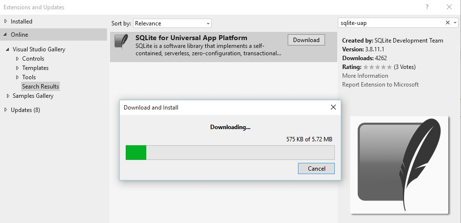
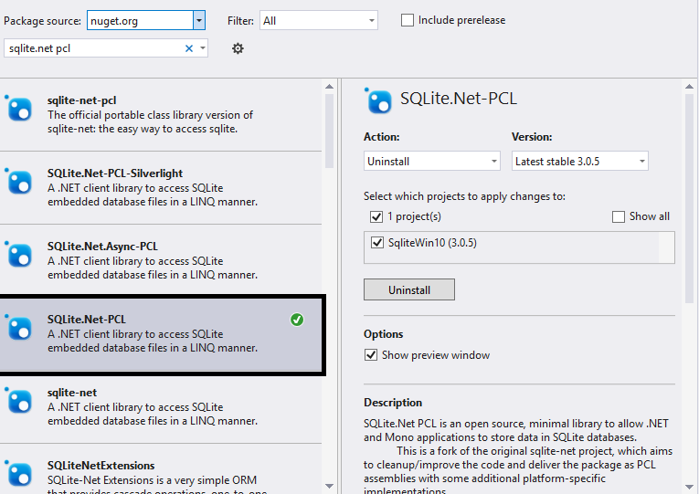
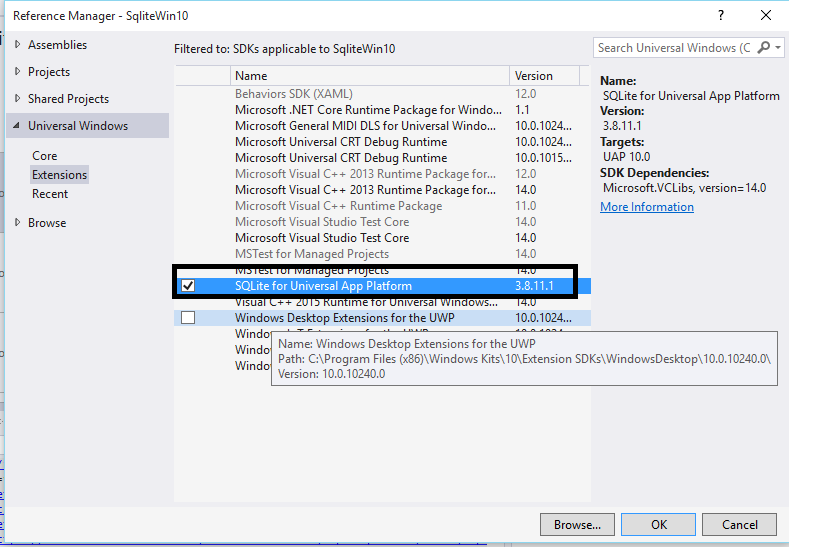

# Implement SQLite Local Storage Using Windows 10 UWP Apps
## Requires
- Visual Studio 2015
## License
- MIT
## Technologies
- UWP Sqlite C#
## Topics
- local storage
- Universal app application  local storage
## Updated
- 09/16/2015
## Description

<h1>Introduction</h1>

The Windows 10 Universal app with &nbsp;local storage using SQLite database. just follow below Step-by-step implementation.

&nbsp;It&nbsp;is really easy even in this preview phase. Even though Entity Framework 7 support for Windows 10 Universal apps is almost here

<h1>Building the Sample</h1>

<em>Sqlite Implemetation in UWP app</em>

Description

<strong>&nbsp;Step 1:</strong>

Create new universal project or &nbsp;library using VS2015 RTM Version

<strong>Step 2:</strong>

Install &ldquo;sqlite-uap-3081101.VSIX &ldquo;from <strong>Extensions and Updates</strong>

VS 2015 -&gt; Tools -&gt; Extensions and update -&gt; search sqlite-uap -&gt; Click Install -&gt; Restart VS 2015

&nbsp;

<strong>Step 3:</strong>

The next step is to add the SQLite.Net-PCL library to your project

&nbsp;

&nbsp;

<strong>Step 4:</strong>

Now, remember the sqlite-uap (Visual Studio extension) installed earlier. It installs SQLite extensions that you need to reference by right-clicking on Project References and choosing &quot;Add Reference...&quot; and then finding the right reference under Windows
 Universal &egrave; Extensions.

&nbsp;

<strong>Step 5:</strong>

<strong>Coding:</strong>

<table border="1" cellspacing="0" cellpadding="0">
<tbody>
<tr>
<td width="365" valign="top">

<strong>class LocalDatabase</strong>

&nbsp;&nbsp;&nbsp; <strong>{</strong>

&nbsp;&nbsp;&nbsp;&nbsp;&nbsp;&nbsp;&nbsp; <strong>public static void CreateDatabase()</strong>

<strong>&nbsp;&nbsp;&nbsp;&nbsp;&nbsp;&nbsp;&nbsp; {</strong>

&nbsp;&nbsp;&nbsp;&nbsp;&nbsp;&nbsp;&nbsp;&nbsp; var sqlpath = System.IO.Path.Combine(Windows.Storage.ApplicationData.Current.LocalFolder.Path, &quot;Contactdb.sqlite&quot;);

&nbsp;&nbsp;&nbsp;&nbsp;&nbsp;&nbsp;&nbsp;&nbsp;&nbsp;&nbsp;&nbsp; using (SQLite.Net.SQLiteConnection conn = new SQLite.Net.SQLiteConnection(new SQLite.Net.Platform.WinRT.SQLitePlatformWinRT(), sqlpath))

&nbsp;&nbsp;&nbsp;&nbsp;&nbsp;&nbsp;&nbsp;&nbsp;&nbsp;&nbsp;&nbsp; {

&nbsp;&nbsp;&nbsp;&nbsp;&nbsp;&nbsp;&nbsp;&nbsp;&nbsp;&nbsp;&nbsp;&nbsp;&nbsp;&nbsp;&nbsp; conn.CreateTable&lt;Contact&gt;();

&nbsp;&nbsp;&nbsp;&nbsp;&nbsp;&nbsp;&nbsp;&nbsp;&nbsp;&nbsp;&nbsp; }

<strong>&nbsp;&nbsp;&nbsp;&nbsp;&nbsp;&nbsp;&nbsp; }</strong>

<strong>&nbsp;&nbsp;&nbsp; }</strong>

</td>
</tr>
</tbody>
</table>

&nbsp;

&nbsp;

&nbsp;

<table border="1" cellspacing="0" cellpadding="0">
<tbody>
<tr>
<td width="623" valign="top">

&nbsp;&nbsp;&nbsp; <strong>public class Contact</strong>

<strong>&nbsp;&nbsp;&nbsp; {</strong>

&nbsp;&nbsp;&nbsp;&nbsp;&nbsp;&nbsp;&nbsp; public int Id { get; set; }

&nbsp;&nbsp;&nbsp;&nbsp;&nbsp;&nbsp;&nbsp; public string Name { get; set; }

&nbsp;&nbsp;&nbsp;&nbsp;&nbsp;&nbsp;&nbsp; public string Address { get; set; }

&nbsp;&nbsp;&nbsp;&nbsp;&nbsp;&nbsp;&nbsp; public string Mobile { get; set; }

&nbsp;&nbsp;&nbsp; }

</td>
</tr>
</tbody>
</table>

&nbsp;

&nbsp;

C#

Edit|Remove

csharp
<pre class="hidden">class LocalDatabase
    {
        public static void CreateDatabase()
        {
         var sqlpath = System.IO.Path.Combine(Windows.Storage.ApplicationData.Current.LocalFolder.Path, &quot;Contactdb.sqlite&quot;);
            using (SQLite.Net.SQLiteConnection conn = new SQLite.Net.SQLiteConnection(new SQLite.Net.Platform.WinRT.SQLitePlatformWinRT(), sqlpath))
            {
                conn.CreateTable&lt;Contact&gt;();
            }
        }
    }
    public class Contact
    {
        public int Id { get; set; }
        public string Name { get; set; }
        public string Address { get; set; }
        public string Mobile { get; set; }
    }
</pre>

<pre class="csharp">class&nbsp;LocalDatabase&nbsp;
&nbsp;&nbsp;&nbsp;&nbsp;{&nbsp;
&nbsp;&nbsp;&nbsp;&nbsp;&nbsp;&nbsp;&nbsp;&nbsp;public&nbsp;static&nbsp;void&nbsp;CreateDatabase()&nbsp;
&nbsp;&nbsp;&nbsp;&nbsp;&nbsp;&nbsp;&nbsp;&nbsp;{&nbsp;
&nbsp;&nbsp;&nbsp;&nbsp;&nbsp;&nbsp;&nbsp;&nbsp;&nbsp;var&nbsp;sqlpath&nbsp;=&nbsp;System.IO.Path.Combine(Windows.Storage.ApplicationData.Current.LocalFolder.Path,&nbsp;&quot;Contactdb.sqlite&quot;);&nbsp;
&nbsp;&nbsp;&nbsp;&nbsp;&nbsp;&nbsp;&nbsp;&nbsp;&nbsp;&nbsp;&nbsp;&nbsp;using&nbsp;(SQLite.Net.SQLiteConnection&nbsp;conn&nbsp;=&nbsp;new&nbsp;SQLite.Net.SQLiteConnection(new&nbsp;SQLite.Net.Platform.WinRT.SQLitePlatformWinRT(),&nbsp;sqlpath))&nbsp;
&nbsp;&nbsp;&nbsp;&nbsp;&nbsp;&nbsp;&nbsp;&nbsp;&nbsp;&nbsp;&nbsp;&nbsp;{&nbsp;
&nbsp;&nbsp;&nbsp;&nbsp;&nbsp;&nbsp;&nbsp;&nbsp;&nbsp;&nbsp;&nbsp;&nbsp;&nbsp;&nbsp;&nbsp;&nbsp;conn.CreateTable&lt;Contact&gt;();&nbsp;
&nbsp;&nbsp;&nbsp;&nbsp;&nbsp;&nbsp;&nbsp;&nbsp;&nbsp;&nbsp;&nbsp;&nbsp;}&nbsp;
&nbsp;&nbsp;&nbsp;&nbsp;&nbsp;&nbsp;&nbsp;&nbsp;}&nbsp;
&nbsp;&nbsp;&nbsp;&nbsp;}&nbsp;
&nbsp;&nbsp;&nbsp;&nbsp;public&nbsp;class&nbsp;Contact&nbsp;
&nbsp;&nbsp;&nbsp;&nbsp;{&nbsp;
&nbsp;&nbsp;&nbsp;&nbsp;&nbsp;&nbsp;&nbsp;&nbsp;public&nbsp;int&nbsp;Id&nbsp;{&nbsp;get;&nbsp;set;&nbsp;}&nbsp;
&nbsp;&nbsp;&nbsp;&nbsp;&nbsp;&nbsp;&nbsp;&nbsp;public&nbsp;string&nbsp;Name&nbsp;{&nbsp;get;&nbsp;set;&nbsp;}&nbsp;
&nbsp;&nbsp;&nbsp;&nbsp;&nbsp;&nbsp;&nbsp;&nbsp;public&nbsp;string&nbsp;Address&nbsp;{&nbsp;get;&nbsp;set;&nbsp;}&nbsp;
&nbsp;&nbsp;&nbsp;&nbsp;&nbsp;&nbsp;&nbsp;&nbsp;public&nbsp;string&nbsp;Mobile&nbsp;{&nbsp;get;&nbsp;set;&nbsp;}&nbsp;
&nbsp;&nbsp;&nbsp;&nbsp;}&nbsp;</pre>

<h1>More Information</h1>

<em>http://www.devenvexe.com Email :jssuthahar@gmail.com</em>

<em> 
</em>

