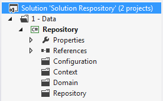
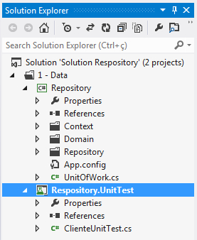
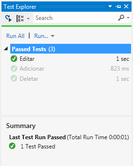
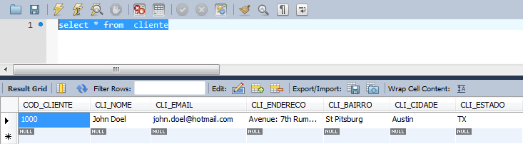

# Implementando Repositório de Dados (Repository Pattern)
## Requires
- Visual Studio 2012
## License
- MIT
## Technologies
- C#
- Entity Framework
- good programming practices
## Topics
- C#
- Entity Framework
- good programming practices
## Updated
- 01/16/2015
## Description

&nbsp;

<h1>Introdu&ccedil;&atilde;o</h1>

Estaremos aprendendo atrav&eacute;s deste post como implementar uma camada de acesso a dados usando o Padr&atilde;o de Reposit&oacute;rio de Dados Gen&eacute;ricos ou Repository Pattern no ingl&ecirc;s. Esse padr&atilde;o &eacute;
 muito utilizado hoje no dia-a-dia das f&aacute;bricas de softwares para uma maior:

<ul>
<li>Organiza&ccedil;&atilde;o do projeto; </li><li>Auxiliando a centralizar o c&oacute;digo j&aacute; desenvolvido evitando duplicidade;
</li><li>Melhor facilidade na manuten&ccedil;&atilde;o e implementa&ccedil;&atilde;o funcionalidades;
</li><li>Facilidade de elaborar testes unit&aacute;rios (unit tests);
</li><li>Melhor defini&ccedil;&atilde;o de tarefas entre a equipe do projeto;
</li></ul>

Os contras ou seja ao n&atilde;o adquar o projeto a esse padr&atilde;o seria:&nbsp;

<ul>
<li>C&oacute;digo duplicado. </li><li>Dificil entendimento do codigo e manuten&ccedil;&atilde;o ou implementa&ccedil;&atilde;o demorada;
</li><li>Elabora&ccedil;&atilde;o de testes unitarios erroneamente ou &nbsp;a nao implementa&ccedil;&atilde;o.
</li><li>Projeto chegaria ao termino mas todo estruturado erroneamente e de dificil compreens&atilde;o pela equipe do projeto;
</li><li>Ultimo e primordial o tempo do projeto podera estourar o escopo do especificado;
</li></ul>
<h1>Requisitos</h1>

Visual Studio 2012 ou 2013, servi&ccedil;o de banco de dados MySQL no meu caso esta instalado localmente, para manipula&ccedil;&atilde;o da base de dados utilizarei o software MySQL- WorkBench que &eacute; gratuito.

<h1>Criando a base de dados</h1>

Vamos criar uma base de dados ou tamb&eacute;m schema denominado pelo MySQL chamada &ldquo;estudo&rdquo; dentro desta base teremos a tabela chamada &ldquo;cliente&rdquo; segue baixo o script para melhor compreens&atilde;o:&nbsp;

SQL

Editar Script|Remove

mysql

<pre class="mysql">CREATE&nbsp;DATABASE&nbsp;estudo&nbsp;DEFAULT&nbsp;CHARACTER&nbsp;SET&nbsp;utf8;&nbsp;
&nbsp;
CREATE&nbsp;TABLE&nbsp;CLIENTE&nbsp;
(&nbsp;
&nbsp;&nbsp;&nbsp;&nbsp;COD_CLIENTE&nbsp;&nbsp;&nbsp;&nbsp;&nbsp;&nbsp;&nbsp;&nbsp;&nbsp;&nbsp;&nbsp;&nbsp;&nbsp;&nbsp;&nbsp;&nbsp;INT&nbsp;NOT&nbsp;NULL&nbsp;AUTO_INCREMENT,&nbsp;
&nbsp;&nbsp;&nbsp;&nbsp;CLI_NOME&nbsp;&nbsp;&nbsp;&nbsp;&nbsp;&nbsp;&nbsp;&nbsp;&nbsp;&nbsp;&nbsp;&nbsp;&nbsp;&nbsp;&nbsp;&nbsp;&nbsp;&nbsp;&nbsp;VARCHAR(100)&nbsp;NOT&nbsp;NULL,&nbsp;
&nbsp;&nbsp;&nbsp;&nbsp;CLI_EMAIL&nbsp;&nbsp;&nbsp;&nbsp;&nbsp;&nbsp;&nbsp;&nbsp;&nbsp;&nbsp;&nbsp;&nbsp;&nbsp;&nbsp;&nbsp;&nbsp;&nbsp;&nbsp;VARCHAR(100)&nbsp;NOT&nbsp;NULL,&nbsp;
&nbsp;&nbsp;&nbsp;&nbsp;CLI_ENDERECO&nbsp;&nbsp;&nbsp;&nbsp;&nbsp;&nbsp;&nbsp;&nbsp;&nbsp;&nbsp;&nbsp;&nbsp;&nbsp;&nbsp;&nbsp;VARCHAR(100)&nbsp;NOT&nbsp;NULL,&nbsp;
&nbsp;&nbsp;&nbsp;&nbsp;CLI_BAIRRO&nbsp;&nbsp;&nbsp;&nbsp;&nbsp;&nbsp;&nbsp;&nbsp;&nbsp;&nbsp;&nbsp;&nbsp;&nbsp;&nbsp;&nbsp;&nbsp;&nbsp;VARCHAR(100)&nbsp;NOT&nbsp;NULL,&nbsp;
&nbsp;&nbsp;&nbsp;&nbsp;CLI_CIDADE&nbsp;&nbsp;&nbsp;&nbsp;&nbsp;&nbsp;&nbsp;&nbsp;&nbsp;&nbsp;&nbsp;&nbsp;&nbsp;&nbsp;&nbsp;&nbsp;&nbsp;VARCHAR(100)&nbsp;NOT&nbsp;NULL,&nbsp;
&nbsp;&nbsp;&nbsp;&nbsp;CLI_ESTADO&nbsp;&nbsp;&nbsp;&nbsp;&nbsp;&nbsp;&nbsp;&nbsp;&nbsp;&nbsp;&nbsp;&nbsp;&nbsp;&nbsp;&nbsp;&nbsp;&nbsp;VARCHAR(2)&nbsp;NOT&nbsp;NULL,&nbsp;&nbsp;&nbsp;&nbsp;
&nbsp;&nbsp;&nbsp;&nbsp;PRIMARY&nbsp;KEY&nbsp;(COD_CLIENTE)&nbsp;
);&nbsp;
&nbsp;
ALTER&nbsp;TABLE&nbsp;CLIENTE&nbsp;AUTO_INCREMENT&nbsp;=&nbsp;1000;</pre>

<h1>Criando a Solution</h1>

Vamos criar uma nova solution no Visual Studio no meu caso &eacute; o 2012 e dentro dela criar uma pasta chamada &quot;<em>1 - Data</em>&quot; e dentro desta pasta criaremos um novo projeto do tipo &quot;<em>Class Library</em>&quot; onde ter&aacute;
 nossos objetos de trabalho bem como entidades de dominio, classe de configura&ccedil;&atilde;o das entidades, classe de contexto etc. Criem o projeto com a mesma estrutura de pasta demostrada aqui ok. Vejamos:&nbsp;

Vamos criar uma classe Base.cs que servira de base em comum dentre todas as entidades do projeto, as entidades herdar&atilde;o dela o campo &quot;id&quot; pois todos as entidades ter&atilde;o c&oacute;digos para representa-las visto que
 as entidades seram copias fieis das tabelas do nosso banco de dados. Vejamos:&nbsp;

C#

Editar Script|Remove

csharp

<pre class="csharp">using&nbsp;System;&nbsp;
using&nbsp;<a class="libraryLink" href="https://msdn.microsoft.com/pt-BR/library/System.Collections.Generic.aspx" target="_blank" title="Auto generated link to System.Collections.Generic">System.Collections.Generic</a>;&nbsp;
using&nbsp;<a class="libraryLink" href="https://msdn.microsoft.com/pt-BR/library/System.Linq.aspx" target="_blank" title="Auto generated link to System.Linq">System.Linq</a>;&nbsp;
using&nbsp;<a class="libraryLink" href="https://msdn.microsoft.com/pt-BR/library/System.Text.aspx" target="_blank" title="Auto generated link to System.Text">System.Text</a>;&nbsp;
using&nbsp;<a class="libraryLink" href="https://msdn.microsoft.com/pt-BR/library/System.Threading.Tasks.aspx" target="_blank" title="Auto generated link to System.Threading.Tasks">System.Threading.Tasks</a>;&nbsp;
&nbsp;
namespace&nbsp;Repository.Domain&nbsp;
{&nbsp;
&nbsp;&nbsp;&nbsp;&nbsp;public&nbsp;class&nbsp;Base&nbsp;
&nbsp;&nbsp;&nbsp;&nbsp;{&nbsp;
&nbsp;&nbsp;&nbsp;&nbsp;&nbsp;&nbsp;&nbsp;&nbsp;public&nbsp;int&nbsp;id&nbsp;{&nbsp;get;&nbsp;set;&nbsp;}&nbsp;
&nbsp;&nbsp;&nbsp;&nbsp;}&nbsp;
}&nbsp;
</pre>

Vamos agora implementar a entidade Cliente.cs dentro da pasta &quot;<em style="font-size:small">Domain</em>&quot; e ClienteConfiguration.cs dentro da pasta &quot;<em style="font-size:small">Configuration</em>&quot;,
 essa entidade ser&aacute; a copia da tabela do nosso banco de dados e sua configura&ccedil;&atilde;o ou seja as especifica&ccedil;&otilde;es das colunas das tabela do que &eacute; obrigat&oacute;rio ou opcional, qual coluna &eacute; varchar e qual &eacute;
 numeric etc. Esta entidade tera que ter a heran&ccedil;a de nossa entidade base.

Cliente.cs (Classe) dentro da pasta Domain&nbsp;

C#

Editar Script|Remove

csharp

<pre class="csharp">using&nbsp;System;&nbsp;
using&nbsp;<a class="libraryLink" href="https://msdn.microsoft.com/pt-BR/library/System.Collections.Generic.aspx" target="_blank" title="Auto generated link to System.Collections.Generic">System.Collections.Generic</a>;&nbsp;
using&nbsp;<a class="libraryLink" href="https://msdn.microsoft.com/pt-BR/library/System.Linq.aspx" target="_blank" title="Auto generated link to System.Linq">System.Linq</a>;&nbsp;
using&nbsp;<a class="libraryLink" href="https://msdn.microsoft.com/pt-BR/library/System.Text.aspx" target="_blank" title="Auto generated link to System.Text">System.Text</a>;&nbsp;
using&nbsp;<a class="libraryLink" href="https://msdn.microsoft.com/pt-BR/library/System.Threading.Tasks.aspx" target="_blank" title="Auto generated link to System.Threading.Tasks">System.Threading.Tasks</a>;&nbsp;
&nbsp;
namespace&nbsp;Repository.Domain&nbsp;
{&nbsp;
&nbsp;&nbsp;&nbsp;&nbsp;public&nbsp;class&nbsp;Cliente&nbsp;:&nbsp;Base&nbsp;
&nbsp;&nbsp;&nbsp;&nbsp;{&nbsp;
&nbsp;&nbsp;&nbsp;&nbsp;&nbsp;&nbsp;&nbsp;&nbsp;public&nbsp;string&nbsp;nome&nbsp;{&nbsp;get;&nbsp;set;&nbsp;}&nbsp;
&nbsp;&nbsp;&nbsp;&nbsp;&nbsp;&nbsp;&nbsp;&nbsp;public&nbsp;string&nbsp;email&nbsp;{&nbsp;get;&nbsp;set;&nbsp;}&nbsp;
&nbsp;&nbsp;&nbsp;&nbsp;&nbsp;&nbsp;&nbsp;&nbsp;public&nbsp;string&nbsp;endereco&nbsp;{&nbsp;get;&nbsp;set;&nbsp;}&nbsp;
&nbsp;&nbsp;&nbsp;&nbsp;&nbsp;&nbsp;&nbsp;&nbsp;public&nbsp;string&nbsp;bairro&nbsp;{&nbsp;get;&nbsp;set;&nbsp;}&nbsp;
&nbsp;&nbsp;&nbsp;&nbsp;&nbsp;&nbsp;&nbsp;&nbsp;public&nbsp;string&nbsp;cidade&nbsp;{&nbsp;get;&nbsp;set;&nbsp;}&nbsp;
&nbsp;&nbsp;&nbsp;&nbsp;&nbsp;&nbsp;&nbsp;&nbsp;public&nbsp;string&nbsp;uf&nbsp;{&nbsp;get;&nbsp;set;&nbsp;}&nbsp;
&nbsp;&nbsp;&nbsp;&nbsp;}&nbsp;
}&nbsp;
</pre>

&nbsp;ClienteConfiguration.cs (Classe) dentro da pasta Configuration

 

C#

Editar Script|Remove

csharp

<pre class="csharp">using&nbsp;System;&nbsp;
using&nbsp;<a class="libraryLink" href="https://msdn.microsoft.com/pt-BR/library/System.Collections.Generic.aspx" target="_blank" title="Auto generated link to System.Collections.Generic">System.Collections.Generic</a>;&nbsp;
using&nbsp;<a class="libraryLink" href="https://msdn.microsoft.com/pt-BR/library/System.Linq.aspx" target="_blank" title="Auto generated link to System.Linq">System.Linq</a>;&nbsp;
using&nbsp;<a class="libraryLink" href="https://msdn.microsoft.com/pt-BR/library/System.Text.aspx" target="_blank" title="Auto generated link to System.Text">System.Text</a>;&nbsp;
using&nbsp;<a class="libraryLink" href="https://msdn.microsoft.com/pt-BR/library/System.Threading.Tasks.aspx" target="_blank" title="Auto generated link to System.Threading.Tasks">System.Threading.Tasks</a>;&nbsp;
using&nbsp;<a class="libraryLink" href="https://msdn.microsoft.com/pt-BR/library/System.ComponentModel.DataAnnotations.Schema.aspx" target="_blank" title="Auto generated link to System.ComponentModel.DataAnnotations.Schema">System.ComponentModel.DataAnnotations.Schema</a>;&nbsp;
using&nbsp;<a class="libraryLink" href="https://msdn.microsoft.com/pt-BR/library/System.Data.Entity.ModelConfiguration.aspx" target="_blank" title="Auto generated link to System.Data.Entity.ModelConfiguration">System.Data.Entity.ModelConfiguration</a>;&nbsp;
using&nbsp;Repository.Domain;&nbsp;
&nbsp;
namespace&nbsp;Repository.Configuration&nbsp;
{&nbsp;
&nbsp;&nbsp;&nbsp;&nbsp;public&nbsp;class&nbsp;ClienteConfiguration&nbsp;:&nbsp;EntityTypeConfiguration&lt;Cliente&gt;&nbsp;
&nbsp;&nbsp;&nbsp;&nbsp;{&nbsp;
&nbsp;&nbsp;&nbsp;&nbsp;&nbsp;&nbsp;&nbsp;&nbsp;public&nbsp;ClienteConfiguration()&nbsp;
&nbsp;&nbsp;&nbsp;&nbsp;&nbsp;&nbsp;&nbsp;&nbsp;{&nbsp;
&nbsp;&nbsp;&nbsp;&nbsp;&nbsp;&nbsp;&nbsp;&nbsp;&nbsp;&nbsp;&nbsp;&nbsp;//&nbsp;chave&nbsp;primaria&nbsp;
&nbsp;&nbsp;&nbsp;&nbsp;&nbsp;&nbsp;&nbsp;&nbsp;&nbsp;&nbsp;&nbsp;&nbsp;this.HasKey(t&nbsp;=&gt;&nbsp;t.id);&nbsp;
&nbsp;
&nbsp;&nbsp;&nbsp;&nbsp;&nbsp;&nbsp;&nbsp;&nbsp;&nbsp;&nbsp;&nbsp;&nbsp;//&nbsp;propriedades&nbsp;
&nbsp;&nbsp;&nbsp;&nbsp;&nbsp;&nbsp;&nbsp;&nbsp;&nbsp;&nbsp;&nbsp;&nbsp;this.Property(t&nbsp;=&gt;&nbsp;t.nome)&nbsp;
&nbsp;&nbsp;&nbsp;&nbsp;&nbsp;&nbsp;&nbsp;&nbsp;&nbsp;&nbsp;&nbsp;&nbsp;&nbsp;&nbsp;&nbsp;&nbsp;.IsRequired()&nbsp;
&nbsp;&nbsp;&nbsp;&nbsp;&nbsp;&nbsp;&nbsp;&nbsp;&nbsp;&nbsp;&nbsp;&nbsp;&nbsp;&nbsp;&nbsp;&nbsp;.HasMaxLength(100);&nbsp;
&nbsp;
&nbsp;&nbsp;&nbsp;&nbsp;&nbsp;&nbsp;&nbsp;&nbsp;&nbsp;&nbsp;&nbsp;&nbsp;this.Property(t&nbsp;=&gt;&nbsp;t.email)&nbsp;
&nbsp;&nbsp;&nbsp;&nbsp;&nbsp;&nbsp;&nbsp;&nbsp;&nbsp;&nbsp;&nbsp;&nbsp;&nbsp;&nbsp;&nbsp;&nbsp;.IsRequired()&nbsp;
&nbsp;&nbsp;&nbsp;&nbsp;&nbsp;&nbsp;&nbsp;&nbsp;&nbsp;&nbsp;&nbsp;&nbsp;&nbsp;&nbsp;&nbsp;&nbsp;.HasMaxLength(100);&nbsp;
&nbsp;
&nbsp;&nbsp;&nbsp;&nbsp;&nbsp;&nbsp;&nbsp;&nbsp;&nbsp;&nbsp;&nbsp;&nbsp;this.Property(t&nbsp;=&gt;&nbsp;t.endereco)&nbsp;
&nbsp;&nbsp;&nbsp;&nbsp;&nbsp;&nbsp;&nbsp;&nbsp;&nbsp;&nbsp;&nbsp;&nbsp;&nbsp;&nbsp;&nbsp;&nbsp;.IsRequired()&nbsp;
&nbsp;&nbsp;&nbsp;&nbsp;&nbsp;&nbsp;&nbsp;&nbsp;&nbsp;&nbsp;&nbsp;&nbsp;&nbsp;&nbsp;&nbsp;&nbsp;.HasMaxLength(100);&nbsp;
&nbsp;
&nbsp;&nbsp;&nbsp;&nbsp;&nbsp;&nbsp;&nbsp;&nbsp;&nbsp;&nbsp;&nbsp;&nbsp;this.Property(t&nbsp;=&gt;&nbsp;t.bairro)&nbsp;
&nbsp;&nbsp;&nbsp;&nbsp;&nbsp;&nbsp;&nbsp;&nbsp;&nbsp;&nbsp;&nbsp;&nbsp;&nbsp;&nbsp;&nbsp;&nbsp;.IsRequired()&nbsp;
&nbsp;&nbsp;&nbsp;&nbsp;&nbsp;&nbsp;&nbsp;&nbsp;&nbsp;&nbsp;&nbsp;&nbsp;&nbsp;&nbsp;&nbsp;&nbsp;.HasMaxLength(100);&nbsp;
&nbsp;
&nbsp;&nbsp;&nbsp;&nbsp;&nbsp;&nbsp;&nbsp;&nbsp;&nbsp;&nbsp;&nbsp;&nbsp;this.Property(t&nbsp;=&gt;&nbsp;t.cidade)&nbsp;
&nbsp;&nbsp;&nbsp;&nbsp;&nbsp;&nbsp;&nbsp;&nbsp;&nbsp;&nbsp;&nbsp;&nbsp;&nbsp;&nbsp;&nbsp;&nbsp;.IsRequired()&nbsp;
&nbsp;&nbsp;&nbsp;&nbsp;&nbsp;&nbsp;&nbsp;&nbsp;&nbsp;&nbsp;&nbsp;&nbsp;&nbsp;&nbsp;&nbsp;&nbsp;.HasMaxLength(100);&nbsp;
&nbsp;
&nbsp;&nbsp;&nbsp;&nbsp;&nbsp;&nbsp;&nbsp;&nbsp;&nbsp;&nbsp;&nbsp;&nbsp;this.Property(t&nbsp;=&gt;&nbsp;t.uf)&nbsp;
&nbsp;&nbsp;&nbsp;&nbsp;&nbsp;&nbsp;&nbsp;&nbsp;&nbsp;&nbsp;&nbsp;&nbsp;&nbsp;&nbsp;&nbsp;&nbsp;.IsRequired()&nbsp;
&nbsp;&nbsp;&nbsp;&nbsp;&nbsp;&nbsp;&nbsp;&nbsp;&nbsp;&nbsp;&nbsp;&nbsp;&nbsp;&nbsp;&nbsp;&nbsp;.HasMaxLength(2);&nbsp;
&nbsp;
&nbsp;&nbsp;&nbsp;&nbsp;&nbsp;&nbsp;&nbsp;&nbsp;&nbsp;&nbsp;&nbsp;&nbsp;//&nbsp;tabela&nbsp;e&nbsp;mapeamentos&nbsp;
&nbsp;&nbsp;&nbsp;&nbsp;&nbsp;&nbsp;&nbsp;&nbsp;&nbsp;&nbsp;&nbsp;&nbsp;this.ToTable(&quot;cliente&quot;,&nbsp;&quot;estudo&quot;);&nbsp;
&nbsp;&nbsp;&nbsp;&nbsp;&nbsp;&nbsp;&nbsp;&nbsp;&nbsp;&nbsp;&nbsp;&nbsp;this.Property(t&nbsp;=&gt;&nbsp;t.id).HasColumnName(&quot;COD_CLIENTE&quot;);&nbsp;
&nbsp;&nbsp;&nbsp;&nbsp;&nbsp;&nbsp;&nbsp;&nbsp;&nbsp;&nbsp;&nbsp;&nbsp;this.Property(t&nbsp;=&gt;&nbsp;t.nome).HasColumnName(&quot;CLI_NOME&quot;);&nbsp;
&nbsp;&nbsp;&nbsp;&nbsp;&nbsp;&nbsp;&nbsp;&nbsp;&nbsp;&nbsp;&nbsp;&nbsp;this.Property(t&nbsp;=&gt;&nbsp;t.email).HasColumnName(&quot;CLI_EMAIL&quot;);&nbsp;
&nbsp;&nbsp;&nbsp;&nbsp;&nbsp;&nbsp;&nbsp;&nbsp;&nbsp;&nbsp;&nbsp;&nbsp;this.Property(t&nbsp;=&gt;&nbsp;t.endereco).HasColumnName(&quot;CLI_ENDERECO&quot;);&nbsp;
&nbsp;&nbsp;&nbsp;&nbsp;&nbsp;&nbsp;&nbsp;&nbsp;&nbsp;&nbsp;&nbsp;&nbsp;this.Property(t&nbsp;=&gt;&nbsp;t.bairro).HasColumnName(&quot;CLI_BAIRRO&quot;);&nbsp;
&nbsp;&nbsp;&nbsp;&nbsp;&nbsp;&nbsp;&nbsp;&nbsp;&nbsp;&nbsp;&nbsp;&nbsp;this.Property(t&nbsp;=&gt;&nbsp;t.cidade).HasColumnName(&quot;CLI_CIDADE&quot;);&nbsp;
&nbsp;&nbsp;&nbsp;&nbsp;&nbsp;&nbsp;&nbsp;&nbsp;&nbsp;&nbsp;&nbsp;&nbsp;this.Property(t&nbsp;=&gt;&nbsp;t.uf).HasColumnName(&quot;CLI_ESTADO&quot;);&nbsp;
&nbsp;&nbsp;&nbsp;&nbsp;&nbsp;&nbsp;&nbsp;&nbsp;}&nbsp;
&nbsp;&nbsp;&nbsp;&nbsp;}&nbsp;
}&nbsp;
</pre>

Vamos agora criar a classe de contexto &eacute; nela que adicionaremos todas as entidades que desejamos manipular em nosso projeto, desde que tenhamos a entidade implementada como descrito at&eacute; agora:

<ul>
<li>Implementamos a entidade na pasta Domain;
</li><li>Implementamos a classe de configura&ccedil;&atilde;o na pasta Configuration;
</li><li>Implementamos a chamada da enteidade na classe contexto;
</li></ul>

No modelo de contexto abaixo temos implementado somente a entidade cliente ate o presente momento. Vejamos abaixo:

C#

Editar Script|Remove

csharp

<pre class="csharp">using&nbsp;System;&nbsp;
using&nbsp;<a class="libraryLink" href="https://msdn.microsoft.com/pt-BR/library/System.Collections.Generic.aspx" target="_blank" title="Auto generated link to System.Collections.Generic">System.Collections.Generic</a>;&nbsp;
using&nbsp;<a class="libraryLink" href="https://msdn.microsoft.com/pt-BR/library/System.ComponentModel.DataAnnotations.Schema.aspx" target="_blank" title="Auto generated link to System.ComponentModel.DataAnnotations.Schema">System.ComponentModel.DataAnnotations.Schema</a>;&nbsp;
using&nbsp;<a class="libraryLink" href="https://msdn.microsoft.com/pt-BR/library/System.Data.Entity.aspx" target="_blank" title="Auto generated link to System.Data.Entity">System.Data.Entity</a>;&nbsp;
using&nbsp;<a class="libraryLink" href="https://msdn.microsoft.com/pt-BR/library/System.Data.Entity.Infrastructure.aspx" target="_blank" title="Auto generated link to System.Data.Entity.Infrastructure">System.Data.Entity.Infrastructure</a>;&nbsp;
using&nbsp;<a class="libraryLink" href="https://msdn.microsoft.com/pt-BR/library/System.Data.Entity.ModelConfiguration.Conventions.aspx" target="_blank" title="Auto generated link to System.Data.Entity.ModelConfiguration.Conventions">System.Data.Entity.ModelConfiguration.Conventions</a>;&nbsp;
using&nbsp;<a class="libraryLink" href="https://msdn.microsoft.com/pt-BR/library/System.Data.Objects.aspx" target="_blank" title="Auto generated link to System.Data.Objects">System.Data.Objects</a>;&nbsp;
using&nbsp;<a class="libraryLink" href="https://msdn.microsoft.com/pt-BR/library/System.Linq.aspx" target="_blank" title="Auto generated link to System.Linq">System.Linq</a>;&nbsp;
using&nbsp;<a class="libraryLink" href="https://msdn.microsoft.com/pt-BR/library/System.Text.aspx" target="_blank" title="Auto generated link to System.Text">System.Text</a>;&nbsp;
using&nbsp;<a class="libraryLink" href="https://msdn.microsoft.com/pt-BR/library/System.Configuration.aspx" target="_blank" title="Auto generated link to System.Configuration">System.Configuration</a>;&nbsp;
using&nbsp;<a class="libraryLink" href="https://msdn.microsoft.com/pt-BR/library/System.Threading.Tasks.aspx" target="_blank" title="Auto generated link to System.Threading.Tasks">System.Threading.Tasks</a>;&nbsp;
using&nbsp;<a class="libraryLink" href="https://msdn.microsoft.com/pt-BR/library/System.Transactions.aspx" target="_blank" title="Auto generated link to System.Transactions">System.Transactions</a>;&nbsp;
using&nbsp;Repository.Domain;&nbsp;
using&nbsp;Repository.Configuration;&nbsp;
&nbsp;
namespace&nbsp;Repository.Context&nbsp;
{&nbsp;
&nbsp;&nbsp;&nbsp;&nbsp;public&nbsp;class&nbsp;Contexto&nbsp;:&nbsp;DbContext&nbsp;
&nbsp;&nbsp;&nbsp;&nbsp;{&nbsp;
&nbsp;&nbsp;&nbsp;&nbsp;&nbsp;&nbsp;&nbsp;&nbsp;static&nbsp;Contexto()&nbsp;
&nbsp;&nbsp;&nbsp;&nbsp;&nbsp;&nbsp;&nbsp;&nbsp;{&nbsp;
&nbsp;&nbsp;&nbsp;&nbsp;&nbsp;&nbsp;&nbsp;&nbsp;&nbsp;&nbsp;&nbsp;&nbsp;Database.SetInitializer&lt;Contexto&gt;(null);&nbsp;
&nbsp;&nbsp;&nbsp;&nbsp;&nbsp;&nbsp;&nbsp;&nbsp;}&nbsp;
&nbsp;
&nbsp;&nbsp;&nbsp;&nbsp;&nbsp;&nbsp;&nbsp;&nbsp;public&nbsp;Contexto()&nbsp;:&nbsp;base(&quot;Name=estudoContext&quot;)&nbsp;
&nbsp;&nbsp;&nbsp;&nbsp;&nbsp;&nbsp;&nbsp;&nbsp;{&nbsp;
&nbsp;&nbsp;&nbsp;&nbsp;&nbsp;&nbsp;&nbsp;&nbsp;}&nbsp;
&nbsp;
&nbsp;&nbsp;&nbsp;&nbsp;&nbsp;&nbsp;&nbsp;&nbsp;public&nbsp;DbSet&lt;Cliente&gt;&nbsp;Cliente&nbsp;{&nbsp;get;&nbsp;set;&nbsp;}&nbsp;
&nbsp;
&nbsp;&nbsp;&nbsp;&nbsp;&nbsp;&nbsp;&nbsp;&nbsp;protected&nbsp;override&nbsp;void&nbsp;OnModelCreating(DbModelBuilder&nbsp;modelBuilder)&nbsp;
&nbsp;&nbsp;&nbsp;&nbsp;&nbsp;&nbsp;&nbsp;&nbsp;{&nbsp;
&nbsp;&nbsp;&nbsp;&nbsp;&nbsp;&nbsp;&nbsp;&nbsp;&nbsp;&nbsp;&nbsp;&nbsp;modelBuilder.Configurations.Add(new&nbsp;ClienteConfiguration());&nbsp;
&nbsp;&nbsp;&nbsp;&nbsp;&nbsp;&nbsp;&nbsp;&nbsp;}&nbsp;
&nbsp;
&nbsp;&nbsp;&nbsp;&nbsp;}&nbsp;
}&nbsp;
</pre>

Feito isso vamos agora implementar os principais objetos na minha opni&atilde;o da camada de dados com padr&atilde;o resposit&oacute;rio que &eacute; a interface &quot;IRespositoryBase.cs&quot; e a classe &quot;RepositoryBase.cs&quot;
 a interface tera as assinaturas padr&otilde;es dos m&eacute;todos e a classe ter&aacute; o c&oacute;digo das mesmas.

 

IRespositoryBase.cs (Interface) dentro da pasta Repository

 

C#

Editar Script|Remove

csharp

<pre class="csharp">using&nbsp;System;&nbsp;
using&nbsp;<a class="libraryLink" href="https://msdn.microsoft.com/pt-BR/library/System.Collections.Generic.aspx" target="_blank" title="Auto generated link to System.Collections.Generic">System.Collections.Generic</a>;&nbsp;
using&nbsp;<a class="libraryLink" href="https://msdn.microsoft.com/pt-BR/library/System.Linq.aspx" target="_blank" title="Auto generated link to System.Linq">System.Linq</a>;&nbsp;
using&nbsp;<a class="libraryLink" href="https://msdn.microsoft.com/pt-BR/library/System.Text.aspx" target="_blank" title="Auto generated link to System.Text">System.Text</a>;&nbsp;
using&nbsp;<a class="libraryLink" href="https://msdn.microsoft.com/pt-BR/library/System.Threading.Tasks.aspx" target="_blank" title="Auto generated link to System.Threading.Tasks">System.Threading.Tasks</a>;&nbsp;
using&nbsp;<a class="libraryLink" href="https://msdn.microsoft.com/pt-BR/library/System.Linq.Expressions.aspx" target="_blank" title="Auto generated link to System.Linq.Expressions">System.Linq.Expressions</a>;&nbsp;
&nbsp;
namespace&nbsp;Repository&nbsp;
{&nbsp;
&nbsp;&nbsp;&nbsp;&nbsp;public&nbsp;interface&nbsp;IRepositoryBase&lt;TEntity&gt;&nbsp;where&nbsp;TEntity&nbsp;:&nbsp;class&nbsp;
&nbsp;&nbsp;&nbsp;&nbsp;{&nbsp;
&nbsp;&nbsp;&nbsp;&nbsp;&nbsp;&nbsp;&nbsp;&nbsp;void&nbsp;Add(TEntity&nbsp;entity);&nbsp;
&nbsp;
&nbsp;&nbsp;&nbsp;&nbsp;&nbsp;&nbsp;&nbsp;&nbsp;void&nbsp;AddAll(List&lt;TEntity&gt;&nbsp;entity);&nbsp;
&nbsp;
&nbsp;&nbsp;&nbsp;&nbsp;&nbsp;&nbsp;&nbsp;&nbsp;void&nbsp;Edit(TEntity&nbsp;entity);&nbsp;
&nbsp;
&nbsp;&nbsp;&nbsp;&nbsp;&nbsp;&nbsp;&nbsp;&nbsp;void&nbsp;Delete(TEntity&nbsp;entity);&nbsp;
&nbsp;
&nbsp;&nbsp;&nbsp;&nbsp;&nbsp;&nbsp;&nbsp;&nbsp;void&nbsp;DeleteAll(Expression&lt;Func&lt;TEntity,&nbsp;bool&gt;&gt;&nbsp;filter&nbsp;=&nbsp;null);&nbsp;
&nbsp;
&nbsp;&nbsp;&nbsp;&nbsp;&nbsp;&nbsp;&nbsp;&nbsp;List&lt;TEntity&gt;&nbsp;Get(Expression&lt;Func&lt;TEntity,&nbsp;bool&gt;&gt;&nbsp;filter&nbsp;=&nbsp;null,&nbsp;Func&lt;IQueryable&lt;TEntity&gt;,&nbsp;IOrderedQueryable&lt;TEntity&gt;&gt;&nbsp;orderBy&nbsp;=&nbsp;null);&nbsp;
&nbsp;&nbsp;&nbsp;&nbsp;}&nbsp;
}&nbsp;
</pre>

&nbsp;RespositoryBase.cs (Classe) dentro da pasta Repository

 

C#

Editar Script|Remove

csharp

<pre class="csharp">using&nbsp;System;&nbsp;
using&nbsp;<a class="libraryLink" href="https://msdn.microsoft.com/pt-BR/library/System.Collections.Generic.aspx" target="_blank" title="Auto generated link to System.Collections.Generic">System.Collections.Generic</a>;&nbsp;
using&nbsp;<a class="libraryLink" href="https://msdn.microsoft.com/pt-BR/library/System.Data.aspx" target="_blank" title="Auto generated link to System.Data">System.Data</a>;&nbsp;
using&nbsp;<a class="libraryLink" href="https://msdn.microsoft.com/pt-BR/library/System.Data.Entity.aspx" target="_blank" title="Auto generated link to System.Data.Entity">System.Data.Entity</a>;&nbsp;
using&nbsp;<a class="libraryLink" href="https://msdn.microsoft.com/pt-BR/library/System.Data.Entity.Infrastructure.aspx" target="_blank" title="Auto generated link to System.Data.Entity.Infrastructure">System.Data.Entity.Infrastructure</a>;&nbsp;
using&nbsp;<a class="libraryLink" href="https://msdn.microsoft.com/pt-BR/library/System.Data.Objects.aspx" target="_blank" title="Auto generated link to System.Data.Objects">System.Data.Objects</a>;&nbsp;
using&nbsp;<a class="libraryLink" href="https://msdn.microsoft.com/pt-BR/library/System.Linq.aspx" target="_blank" title="Auto generated link to System.Linq">System.Linq</a>;&nbsp;
using&nbsp;<a class="libraryLink" href="https://msdn.microsoft.com/pt-BR/library/System.Linq.Expressions.aspx" target="_blank" title="Auto generated link to System.Linq.Expressions">System.Linq.Expressions</a>;&nbsp;
using&nbsp;<a class="libraryLink" href="https://msdn.microsoft.com/pt-BR/library/System.Text.aspx" target="_blank" title="Auto generated link to System.Text">System.Text</a>;&nbsp;
using&nbsp;<a class="libraryLink" href="https://msdn.microsoft.com/pt-BR/library/System.Threading.Tasks.aspx" target="_blank" title="Auto generated link to System.Threading.Tasks">System.Threading.Tasks</a>;&nbsp;
using&nbsp;Repository.Context;&nbsp;
&nbsp;
namespace&nbsp;Repository&nbsp;
{&nbsp;
&nbsp;&nbsp;&nbsp;&nbsp;public&nbsp;class&nbsp;RepositoryBase&lt;TEntity&gt;&nbsp;:&nbsp;IDisposable,&nbsp;IRepositoryBase&lt;TEntity&gt;&nbsp;where&nbsp;TEntity&nbsp;:&nbsp;class&nbsp;
&nbsp;&nbsp;&nbsp;&nbsp;{&nbsp;
&nbsp;&nbsp;&nbsp;&nbsp;&nbsp;&nbsp;&nbsp;&nbsp;internal&nbsp;Contexto&nbsp;_context;&nbsp;
&nbsp;&nbsp;&nbsp;&nbsp;&nbsp;&nbsp;&nbsp;&nbsp;internal&nbsp;DbSet&lt;TEntity&gt;&nbsp;_dbSet;&nbsp;
&nbsp;
&nbsp;&nbsp;&nbsp;&nbsp;&nbsp;&nbsp;&nbsp;&nbsp;public&nbsp;RepositoryBase(Contexto&nbsp;context)&nbsp;
&nbsp;&nbsp;&nbsp;&nbsp;&nbsp;&nbsp;&nbsp;&nbsp;{&nbsp;
&nbsp;&nbsp;&nbsp;&nbsp;&nbsp;&nbsp;&nbsp;&nbsp;&nbsp;&nbsp;&nbsp;&nbsp;this._context&nbsp;=&nbsp;context;&nbsp;
&nbsp;&nbsp;&nbsp;&nbsp;&nbsp;&nbsp;&nbsp;&nbsp;&nbsp;&nbsp;&nbsp;&nbsp;this._dbSet&nbsp;=&nbsp;context.Set&lt;TEntity&gt;();&nbsp;
&nbsp;&nbsp;&nbsp;&nbsp;&nbsp;&nbsp;&nbsp;&nbsp;}&nbsp;
&nbsp;
&nbsp;&nbsp;&nbsp;&nbsp;&nbsp;&nbsp;&nbsp;&nbsp;public&nbsp;void&nbsp;Add(TEntity&nbsp;entity)&nbsp;
&nbsp;&nbsp;&nbsp;&nbsp;&nbsp;&nbsp;&nbsp;&nbsp;{&nbsp;
&nbsp;&nbsp;&nbsp;&nbsp;&nbsp;&nbsp;&nbsp;&nbsp;&nbsp;&nbsp;&nbsp;&nbsp;_dbSet.Add(entity);&nbsp;
&nbsp;&nbsp;&nbsp;&nbsp;&nbsp;&nbsp;&nbsp;&nbsp;&nbsp;&nbsp;&nbsp;&nbsp;_context.SaveChanges();&nbsp;
&nbsp;&nbsp;&nbsp;&nbsp;&nbsp;&nbsp;&nbsp;&nbsp;}&nbsp;
&nbsp;
&nbsp;&nbsp;&nbsp;&nbsp;&nbsp;&nbsp;&nbsp;&nbsp;public&nbsp;void&nbsp;Edit(TEntity&nbsp;entity)&nbsp;
&nbsp;&nbsp;&nbsp;&nbsp;&nbsp;&nbsp;&nbsp;&nbsp;{&nbsp;
&nbsp;&nbsp;&nbsp;&nbsp;&nbsp;&nbsp;&nbsp;&nbsp;&nbsp;&nbsp;&nbsp;&nbsp;var&nbsp;entry&nbsp;=&nbsp;_context.Entry&lt;TEntity&gt;(entity);&nbsp;
&nbsp;&nbsp;&nbsp;&nbsp;&nbsp;&nbsp;&nbsp;&nbsp;&nbsp;&nbsp;&nbsp;&nbsp;var&nbsp;pkey&nbsp;=&nbsp;_dbSet.Create().GetType().GetProperty(&quot;id&quot;).GetValue(entity);&nbsp;
&nbsp;
&nbsp;&nbsp;&nbsp;&nbsp;&nbsp;&nbsp;&nbsp;&nbsp;&nbsp;&nbsp;&nbsp;&nbsp;if&nbsp;(entry.State&nbsp;==&nbsp;EntityState.Detached)&nbsp;
&nbsp;&nbsp;&nbsp;&nbsp;&nbsp;&nbsp;&nbsp;&nbsp;&nbsp;&nbsp;&nbsp;&nbsp;{&nbsp;
&nbsp;&nbsp;&nbsp;&nbsp;&nbsp;&nbsp;&nbsp;&nbsp;&nbsp;&nbsp;&nbsp;&nbsp;&nbsp;&nbsp;&nbsp;&nbsp;var&nbsp;set&nbsp;=&nbsp;_context.Set&lt;TEntity&gt;();&nbsp;
&nbsp;&nbsp;&nbsp;&nbsp;&nbsp;&nbsp;&nbsp;&nbsp;&nbsp;&nbsp;&nbsp;&nbsp;&nbsp;&nbsp;&nbsp;&nbsp;TEntity&nbsp;attachedEntity&nbsp;=&nbsp;set.Find(pkey);&nbsp;&nbsp;//&nbsp;access&nbsp;the&nbsp;key&nbsp;
&nbsp;&nbsp;&nbsp;&nbsp;&nbsp;&nbsp;&nbsp;&nbsp;&nbsp;&nbsp;&nbsp;&nbsp;&nbsp;&nbsp;&nbsp;&nbsp;if&nbsp;(attachedEntity&nbsp;!=&nbsp;null)&nbsp;
&nbsp;&nbsp;&nbsp;&nbsp;&nbsp;&nbsp;&nbsp;&nbsp;&nbsp;&nbsp;&nbsp;&nbsp;&nbsp;&nbsp;&nbsp;&nbsp;{&nbsp;
&nbsp;&nbsp;&nbsp;&nbsp;&nbsp;&nbsp;&nbsp;&nbsp;&nbsp;&nbsp;&nbsp;&nbsp;&nbsp;&nbsp;&nbsp;&nbsp;&nbsp;&nbsp;&nbsp;&nbsp;var&nbsp;attachedEntry&nbsp;=&nbsp;_context.Entry(attachedEntity);&nbsp;
&nbsp;&nbsp;&nbsp;&nbsp;&nbsp;&nbsp;&nbsp;&nbsp;&nbsp;&nbsp;&nbsp;&nbsp;&nbsp;&nbsp;&nbsp;&nbsp;&nbsp;&nbsp;&nbsp;&nbsp;attachedEntry.CurrentValues.SetValues(entity);&nbsp;
&nbsp;&nbsp;&nbsp;&nbsp;&nbsp;&nbsp;&nbsp;&nbsp;&nbsp;&nbsp;&nbsp;&nbsp;&nbsp;&nbsp;&nbsp;&nbsp;}&nbsp;
&nbsp;&nbsp;&nbsp;&nbsp;&nbsp;&nbsp;&nbsp;&nbsp;&nbsp;&nbsp;&nbsp;&nbsp;&nbsp;&nbsp;&nbsp;&nbsp;else&nbsp;
&nbsp;&nbsp;&nbsp;&nbsp;&nbsp;&nbsp;&nbsp;&nbsp;&nbsp;&nbsp;&nbsp;&nbsp;&nbsp;&nbsp;&nbsp;&nbsp;{&nbsp;
&nbsp;&nbsp;&nbsp;&nbsp;&nbsp;&nbsp;&nbsp;&nbsp;&nbsp;&nbsp;&nbsp;&nbsp;&nbsp;&nbsp;&nbsp;&nbsp;&nbsp;&nbsp;&nbsp;&nbsp;entry.State&nbsp;=&nbsp;EntityState.Modified;&nbsp;//&nbsp;attach&nbsp;the&nbsp;entity&nbsp;
&nbsp;&nbsp;&nbsp;&nbsp;&nbsp;&nbsp;&nbsp;&nbsp;&nbsp;&nbsp;&nbsp;&nbsp;&nbsp;&nbsp;&nbsp;&nbsp;}&nbsp;
&nbsp;&nbsp;&nbsp;&nbsp;&nbsp;&nbsp;&nbsp;&nbsp;&nbsp;&nbsp;&nbsp;&nbsp;}&nbsp;
&nbsp;
&nbsp;&nbsp;&nbsp;&nbsp;&nbsp;&nbsp;&nbsp;&nbsp;&nbsp;&nbsp;&nbsp;&nbsp;_context.SaveChanges();&nbsp;
&nbsp;&nbsp;&nbsp;&nbsp;&nbsp;&nbsp;&nbsp;&nbsp;}&nbsp;
&nbsp;
&nbsp;&nbsp;&nbsp;&nbsp;&nbsp;&nbsp;&nbsp;&nbsp;///&nbsp;&lt;summary&gt;&nbsp;
&nbsp;&nbsp;&nbsp;&nbsp;&nbsp;&nbsp;&nbsp;&nbsp;///&nbsp;M&eacute;todo&nbsp;que&nbsp;deleta&nbsp;um&nbsp;objeto&nbsp;no&nbsp;banco&nbsp;de&nbsp;dados&nbsp;da&nbsp;aplica&ccedil;&atilde;o.&nbsp;
&nbsp;&nbsp;&nbsp;&nbsp;&nbsp;&nbsp;&nbsp;&nbsp;///&nbsp;&lt;/summary&gt;&nbsp;
&nbsp;&nbsp;&nbsp;&nbsp;&nbsp;&nbsp;&nbsp;&nbsp;public&nbsp;void&nbsp;Delete(TEntity&nbsp;entity)&nbsp;
&nbsp;&nbsp;&nbsp;&nbsp;&nbsp;&nbsp;&nbsp;&nbsp;{&nbsp;
&nbsp;&nbsp;&nbsp;&nbsp;&nbsp;&nbsp;&nbsp;&nbsp;&nbsp;&nbsp;&nbsp;&nbsp;if&nbsp;(_context.Entry(entity).State&nbsp;==&nbsp;EntityState.Detached)&nbsp;
&nbsp;&nbsp;&nbsp;&nbsp;&nbsp;&nbsp;&nbsp;&nbsp;&nbsp;&nbsp;&nbsp;&nbsp;{&nbsp;
&nbsp;&nbsp;&nbsp;&nbsp;&nbsp;&nbsp;&nbsp;&nbsp;&nbsp;&nbsp;&nbsp;&nbsp;&nbsp;&nbsp;&nbsp;&nbsp;_dbSet.Attach(entity);&nbsp;
&nbsp;&nbsp;&nbsp;&nbsp;&nbsp;&nbsp;&nbsp;&nbsp;&nbsp;&nbsp;&nbsp;&nbsp;}&nbsp;
&nbsp;&nbsp;&nbsp;&nbsp;&nbsp;&nbsp;&nbsp;&nbsp;&nbsp;&nbsp;&nbsp;&nbsp;_dbSet.Remove(entity);&nbsp;
&nbsp;&nbsp;&nbsp;&nbsp;&nbsp;&nbsp;&nbsp;&nbsp;&nbsp;&nbsp;&nbsp;&nbsp;_context.SaveChanges();&nbsp;
&nbsp;&nbsp;&nbsp;&nbsp;&nbsp;&nbsp;&nbsp;&nbsp;}&nbsp;
&nbsp;
&nbsp;&nbsp;&nbsp;&nbsp;&nbsp;&nbsp;&nbsp;&nbsp;///&nbsp;&lt;summary&gt;&nbsp;
&nbsp;&nbsp;&nbsp;&nbsp;&nbsp;&nbsp;&nbsp;&nbsp;///&nbsp;M&eacute;todo&nbsp;que&nbsp;deleta&nbsp;um&nbsp;ou&nbsp;varios&nbsp;objetos&nbsp;no&nbsp;banco&nbsp;de&nbsp;dados&nbsp;da&nbsp;aplica&ccedil;&atilde;o,&nbsp;mediante&nbsp;uma&nbsp;express&atilde;o&nbsp;LINQ.&nbsp;
&nbsp;&nbsp;&nbsp;&nbsp;&nbsp;&nbsp;&nbsp;&nbsp;///&nbsp;&lt;/summary&gt;&nbsp;
&nbsp;&nbsp;&nbsp;&nbsp;&nbsp;&nbsp;&nbsp;&nbsp;public&nbsp;void&nbsp;DeleteAll(Expression&lt;Func&lt;TEntity,&nbsp;bool&gt;&gt;&nbsp;filter&nbsp;=&nbsp;null)&nbsp;
&nbsp;&nbsp;&nbsp;&nbsp;&nbsp;&nbsp;&nbsp;&nbsp;{&nbsp;
&nbsp;&nbsp;&nbsp;&nbsp;&nbsp;&nbsp;&nbsp;&nbsp;&nbsp;&nbsp;&nbsp;&nbsp;IQueryable&lt;TEntity&gt;&nbsp;query&nbsp;=&nbsp;_dbSet;&nbsp;
&nbsp;&nbsp;&nbsp;&nbsp;&nbsp;&nbsp;&nbsp;&nbsp;&nbsp;&nbsp;&nbsp;&nbsp;List&lt;TEntity&gt;&nbsp;listDelete&nbsp;=&nbsp;query.Where(filter).ToList();&nbsp;
&nbsp;
&nbsp;&nbsp;&nbsp;&nbsp;&nbsp;&nbsp;&nbsp;&nbsp;&nbsp;&nbsp;&nbsp;&nbsp;foreach&nbsp;(var&nbsp;item&nbsp;in&nbsp;listDelete)&nbsp;
&nbsp;&nbsp;&nbsp;&nbsp;&nbsp;&nbsp;&nbsp;&nbsp;&nbsp;&nbsp;&nbsp;&nbsp;{&nbsp;
&nbsp;&nbsp;&nbsp;&nbsp;&nbsp;&nbsp;&nbsp;&nbsp;&nbsp;&nbsp;&nbsp;&nbsp;&nbsp;&nbsp;&nbsp;&nbsp;_dbSet.Remove(item);&nbsp;
&nbsp;&nbsp;&nbsp;&nbsp;&nbsp;&nbsp;&nbsp;&nbsp;&nbsp;&nbsp;&nbsp;&nbsp;}&nbsp;
&nbsp;&nbsp;&nbsp;&nbsp;&nbsp;&nbsp;&nbsp;&nbsp;&nbsp;&nbsp;&nbsp;&nbsp;_context.SaveChanges();&nbsp;
&nbsp;&nbsp;&nbsp;&nbsp;&nbsp;&nbsp;&nbsp;&nbsp;}&nbsp;
&nbsp;
&nbsp;&nbsp;&nbsp;&nbsp;&nbsp;&nbsp;&nbsp;&nbsp;///&nbsp;&lt;summary&gt;&nbsp;
&nbsp;&nbsp;&nbsp;&nbsp;&nbsp;&nbsp;&nbsp;&nbsp;///&nbsp;M&eacute;todo&nbsp;que&nbsp;adiciona&nbsp;uma&nbsp;lista&nbsp;de&nbsp;novos&nbsp;objetos&nbsp;ao&nbsp;banco&nbsp;de&nbsp;dados&nbsp;da&nbsp;aplica&ccedil;&atilde;o.&nbsp;
&nbsp;&nbsp;&nbsp;&nbsp;&nbsp;&nbsp;&nbsp;&nbsp;///&nbsp;&lt;/summary&gt;&nbsp;
&nbsp;&nbsp;&nbsp;&nbsp;&nbsp;&nbsp;&nbsp;&nbsp;public&nbsp;void&nbsp;AddAll(List&lt;TEntity&gt;&nbsp;entity)&nbsp;
&nbsp;&nbsp;&nbsp;&nbsp;&nbsp;&nbsp;&nbsp;&nbsp;{&nbsp;
&nbsp;&nbsp;&nbsp;&nbsp;&nbsp;&nbsp;&nbsp;&nbsp;&nbsp;&nbsp;&nbsp;&nbsp;foreach&nbsp;(var&nbsp;item&nbsp;in&nbsp;entity)&nbsp;
&nbsp;&nbsp;&nbsp;&nbsp;&nbsp;&nbsp;&nbsp;&nbsp;&nbsp;&nbsp;&nbsp;&nbsp;{&nbsp;
&nbsp;&nbsp;&nbsp;&nbsp;&nbsp;&nbsp;&nbsp;&nbsp;&nbsp;&nbsp;&nbsp;&nbsp;&nbsp;&nbsp;&nbsp;&nbsp;_dbSet.Add(item);&nbsp;
&nbsp;&nbsp;&nbsp;&nbsp;&nbsp;&nbsp;&nbsp;&nbsp;&nbsp;&nbsp;&nbsp;&nbsp;}&nbsp;
&nbsp;&nbsp;&nbsp;&nbsp;&nbsp;&nbsp;&nbsp;&nbsp;&nbsp;&nbsp;&nbsp;&nbsp;_context.SaveChanges();&nbsp;
&nbsp;&nbsp;&nbsp;&nbsp;&nbsp;&nbsp;&nbsp;&nbsp;}&nbsp;
&nbsp;
&nbsp;&nbsp;&nbsp;&nbsp;&nbsp;&nbsp;&nbsp;&nbsp;///&nbsp;&lt;summary&gt;&nbsp;
&nbsp;&nbsp;&nbsp;&nbsp;&nbsp;&nbsp;&nbsp;&nbsp;///&nbsp;M&eacute;todo&nbsp;que&nbsp;busca&nbsp;uma&nbsp;lista&nbsp;de&nbsp;objetos&nbsp;no&nbsp;banco&nbsp;de&nbsp;dados&nbsp;da&nbsp;aplica&ccedil;&atilde;o&nbsp;e&nbsp;retorna-a&nbsp;no&nbsp;tipo&nbsp;IEnumerable&lt;TEntity&gt;.&nbsp;
&nbsp;&nbsp;&nbsp;&nbsp;&nbsp;&nbsp;&nbsp;&nbsp;///&nbsp;&lt;/summary&gt;&nbsp;
&nbsp;&nbsp;&nbsp;&nbsp;&nbsp;&nbsp;&nbsp;&nbsp;public&nbsp;virtual&nbsp;List&lt;TEntity&gt;&nbsp;Get(Expression&lt;Func&lt;TEntity,&nbsp;bool&gt;&gt;&nbsp;filter&nbsp;=&nbsp;null,&nbsp;Func&lt;IQueryable&lt;TEntity&gt;,&nbsp;IOrderedQueryable&lt;TEntity&gt;&gt;&nbsp;orderBy&nbsp;=&nbsp;null)&nbsp;
&nbsp;&nbsp;&nbsp;&nbsp;&nbsp;&nbsp;&nbsp;&nbsp;{&nbsp;
&nbsp;&nbsp;&nbsp;&nbsp;&nbsp;&nbsp;&nbsp;&nbsp;&nbsp;&nbsp;&nbsp;&nbsp;IQueryable&lt;TEntity&gt;&nbsp;query&nbsp;=&nbsp;_dbSet;&nbsp;
&nbsp;
&nbsp;&nbsp;&nbsp;&nbsp;&nbsp;&nbsp;&nbsp;&nbsp;&nbsp;&nbsp;&nbsp;&nbsp;if&nbsp;(filter&nbsp;!=&nbsp;null)&nbsp;
&nbsp;&nbsp;&nbsp;&nbsp;&nbsp;&nbsp;&nbsp;&nbsp;&nbsp;&nbsp;&nbsp;&nbsp;{&nbsp;
&nbsp;&nbsp;&nbsp;&nbsp;&nbsp;&nbsp;&nbsp;&nbsp;&nbsp;&nbsp;&nbsp;&nbsp;&nbsp;&nbsp;&nbsp;&nbsp;query&nbsp;=&nbsp;query.Where(filter);&nbsp;
&nbsp;&nbsp;&nbsp;&nbsp;&nbsp;&nbsp;&nbsp;&nbsp;&nbsp;&nbsp;&nbsp;&nbsp;}&nbsp;
&nbsp;
&nbsp;&nbsp;&nbsp;&nbsp;&nbsp;&nbsp;&nbsp;&nbsp;&nbsp;&nbsp;&nbsp;&nbsp;if&nbsp;(orderBy&nbsp;!=&nbsp;null)&nbsp;
&nbsp;&nbsp;&nbsp;&nbsp;&nbsp;&nbsp;&nbsp;&nbsp;&nbsp;&nbsp;&nbsp;&nbsp;{&nbsp;
&nbsp;&nbsp;&nbsp;&nbsp;&nbsp;&nbsp;&nbsp;&nbsp;&nbsp;&nbsp;&nbsp;&nbsp;&nbsp;&nbsp;&nbsp;&nbsp;return&nbsp;orderBy(query).ToList();&nbsp;
&nbsp;&nbsp;&nbsp;&nbsp;&nbsp;&nbsp;&nbsp;&nbsp;&nbsp;&nbsp;&nbsp;&nbsp;}&nbsp;
&nbsp;&nbsp;&nbsp;&nbsp;&nbsp;&nbsp;&nbsp;&nbsp;&nbsp;&nbsp;&nbsp;&nbsp;else&nbsp;
&nbsp;&nbsp;&nbsp;&nbsp;&nbsp;&nbsp;&nbsp;&nbsp;&nbsp;&nbsp;&nbsp;&nbsp;{&nbsp;
&nbsp;&nbsp;&nbsp;&nbsp;&nbsp;&nbsp;&nbsp;&nbsp;&nbsp;&nbsp;&nbsp;&nbsp;&nbsp;&nbsp;&nbsp;&nbsp;return&nbsp;query.ToList();&nbsp;
&nbsp;&nbsp;&nbsp;&nbsp;&nbsp;&nbsp;&nbsp;&nbsp;&nbsp;&nbsp;&nbsp;&nbsp;}&nbsp;
&nbsp;&nbsp;&nbsp;&nbsp;&nbsp;&nbsp;&nbsp;&nbsp;}&nbsp;
&nbsp;
&nbsp;&nbsp;&nbsp;&nbsp;&nbsp;&nbsp;&nbsp;&nbsp;public&nbsp;void&nbsp;Dispose()&nbsp;
&nbsp;&nbsp;&nbsp;&nbsp;&nbsp;&nbsp;&nbsp;&nbsp;{&nbsp;
&nbsp;&nbsp;&nbsp;&nbsp;&nbsp;&nbsp;&nbsp;&nbsp;&nbsp;&nbsp;&nbsp;&nbsp;_dbSet&nbsp;=&nbsp;null;&nbsp;
&nbsp;&nbsp;&nbsp;&nbsp;&nbsp;&nbsp;&nbsp;&nbsp;&nbsp;&nbsp;&nbsp;&nbsp;_context.Dispose();&nbsp;
&nbsp;&nbsp;&nbsp;&nbsp;&nbsp;&nbsp;&nbsp;&nbsp;&nbsp;&nbsp;&nbsp;&nbsp;GC.SuppressFinalize(this);&nbsp;
&nbsp;&nbsp;&nbsp;&nbsp;&nbsp;&nbsp;&nbsp;&nbsp;}&nbsp;
&nbsp;&nbsp;&nbsp;&nbsp;}&nbsp;
}&nbsp;
</pre>

Adicionaremos por ultimo agora o objeto que utilizaremos em outras camadas, de nosso projeto chamado de &quot;UnitOfWork.cs&quot;. Vejamos o codigo do mesmo:&nbsp;

 

C#

Editar Script|Remove

csharp

<pre class="csharp">using&nbsp;System;&nbsp;
using&nbsp;<a class="libraryLink" href="https://msdn.microsoft.com/pt-BR/library/System.Collections.Generic.aspx" target="_blank" title="Auto generated link to System.Collections.Generic">System.Collections.Generic</a>;&nbsp;
using&nbsp;<a class="libraryLink" href="https://msdn.microsoft.com/pt-BR/library/System.Linq.aspx" target="_blank" title="Auto generated link to System.Linq">System.Linq</a>;&nbsp;
using&nbsp;<a class="libraryLink" href="https://msdn.microsoft.com/pt-BR/library/System.Text.aspx" target="_blank" title="Auto generated link to System.Text">System.Text</a>;&nbsp;
using&nbsp;<a class="libraryLink" href="https://msdn.microsoft.com/pt-BR/library/System.Threading.Tasks.aspx" target="_blank" title="Auto generated link to System.Threading.Tasks">System.Threading.Tasks</a>;&nbsp;
using&nbsp;Repository.Context;&nbsp;
using&nbsp;Repository.Domain;&nbsp;
&nbsp;
namespace&nbsp;Repository&nbsp;
{&nbsp;
&nbsp;&nbsp;&nbsp;&nbsp;public&nbsp;class&nbsp;UnitOfWork&nbsp;:&nbsp;IDisposable&nbsp;
&nbsp;&nbsp;&nbsp;&nbsp;{&nbsp;
&nbsp;&nbsp;&nbsp;&nbsp;&nbsp;&nbsp;&nbsp;&nbsp;private&nbsp;Contexto&nbsp;_context&nbsp;=&nbsp;new&nbsp;Contexto();&nbsp;
&nbsp;
&nbsp;&nbsp;&nbsp;&nbsp;&nbsp;&nbsp;&nbsp;&nbsp;private&nbsp;RepositoryBase&lt;Cliente&gt;&nbsp;_clienteRepository;&nbsp;
&nbsp;
&nbsp;&nbsp;&nbsp;&nbsp;&nbsp;&nbsp;&nbsp;&nbsp;public&nbsp;RepositoryBase&lt;Cliente&gt;&nbsp;ClienteRepository&nbsp;
&nbsp;&nbsp;&nbsp;&nbsp;&nbsp;&nbsp;&nbsp;&nbsp;{&nbsp;
&nbsp;&nbsp;&nbsp;&nbsp;&nbsp;&nbsp;&nbsp;&nbsp;&nbsp;&nbsp;&nbsp;&nbsp;get&nbsp;
&nbsp;&nbsp;&nbsp;&nbsp;&nbsp;&nbsp;&nbsp;&nbsp;&nbsp;&nbsp;&nbsp;&nbsp;{&nbsp;
&nbsp;&nbsp;&nbsp;&nbsp;&nbsp;&nbsp;&nbsp;&nbsp;&nbsp;&nbsp;&nbsp;&nbsp;&nbsp;&nbsp;&nbsp;&nbsp;if&nbsp;(this._clienteRepository&nbsp;==&nbsp;null)&nbsp;
&nbsp;&nbsp;&nbsp;&nbsp;&nbsp;&nbsp;&nbsp;&nbsp;&nbsp;&nbsp;&nbsp;&nbsp;&nbsp;&nbsp;&nbsp;&nbsp;{&nbsp;
&nbsp;&nbsp;&nbsp;&nbsp;&nbsp;&nbsp;&nbsp;&nbsp;&nbsp;&nbsp;&nbsp;&nbsp;&nbsp;&nbsp;&nbsp;&nbsp;&nbsp;&nbsp;&nbsp;&nbsp;this._clienteRepository&nbsp;=&nbsp;new&nbsp;RepositoryBase&lt;Cliente&gt;(_context);&nbsp;
&nbsp;&nbsp;&nbsp;&nbsp;&nbsp;&nbsp;&nbsp;&nbsp;&nbsp;&nbsp;&nbsp;&nbsp;&nbsp;&nbsp;&nbsp;&nbsp;}&nbsp;
&nbsp;
&nbsp;&nbsp;&nbsp;&nbsp;&nbsp;&nbsp;&nbsp;&nbsp;&nbsp;&nbsp;&nbsp;&nbsp;&nbsp;&nbsp;&nbsp;&nbsp;return&nbsp;_clienteRepository;&nbsp;
&nbsp;&nbsp;&nbsp;&nbsp;&nbsp;&nbsp;&nbsp;&nbsp;&nbsp;&nbsp;&nbsp;&nbsp;}&nbsp;
&nbsp;&nbsp;&nbsp;&nbsp;&nbsp;&nbsp;&nbsp;&nbsp;}&nbsp;
&nbsp;
&nbsp;&nbsp;&nbsp;&nbsp;&nbsp;&nbsp;&nbsp;&nbsp;private&nbsp;bool&nbsp;_disposed&nbsp;=&nbsp;false;&nbsp;
&nbsp;
&nbsp;&nbsp;&nbsp;&nbsp;&nbsp;&nbsp;&nbsp;&nbsp;public&nbsp;void&nbsp;Dispose()&nbsp;
&nbsp;&nbsp;&nbsp;&nbsp;&nbsp;&nbsp;&nbsp;&nbsp;{&nbsp;
&nbsp;&nbsp;&nbsp;&nbsp;&nbsp;&nbsp;&nbsp;&nbsp;&nbsp;&nbsp;&nbsp;&nbsp;Clear(true);&nbsp;
&nbsp;&nbsp;&nbsp;&nbsp;&nbsp;&nbsp;&nbsp;&nbsp;&nbsp;&nbsp;&nbsp;&nbsp;GC.SuppressFinalize(this);&nbsp;
&nbsp;&nbsp;&nbsp;&nbsp;&nbsp;&nbsp;&nbsp;&nbsp;}&nbsp;
&nbsp;
&nbsp;&nbsp;&nbsp;&nbsp;&nbsp;&nbsp;&nbsp;&nbsp;private&nbsp;void&nbsp;Clear(bool&nbsp;disposing)&nbsp;
&nbsp;&nbsp;&nbsp;&nbsp;&nbsp;&nbsp;&nbsp;&nbsp;{&nbsp;
&nbsp;&nbsp;&nbsp;&nbsp;&nbsp;&nbsp;&nbsp;&nbsp;&nbsp;&nbsp;&nbsp;&nbsp;if&nbsp;(!this._disposed)&nbsp;
&nbsp;&nbsp;&nbsp;&nbsp;&nbsp;&nbsp;&nbsp;&nbsp;&nbsp;&nbsp;&nbsp;&nbsp;{&nbsp;
&nbsp;&nbsp;&nbsp;&nbsp;&nbsp;&nbsp;&nbsp;&nbsp;&nbsp;&nbsp;&nbsp;&nbsp;&nbsp;&nbsp;&nbsp;&nbsp;if&nbsp;(disposing)&nbsp;
&nbsp;&nbsp;&nbsp;&nbsp;&nbsp;&nbsp;&nbsp;&nbsp;&nbsp;&nbsp;&nbsp;&nbsp;&nbsp;&nbsp;&nbsp;&nbsp;{&nbsp;
&nbsp;&nbsp;&nbsp;&nbsp;&nbsp;&nbsp;&nbsp;&nbsp;&nbsp;&nbsp;&nbsp;&nbsp;&nbsp;&nbsp;&nbsp;&nbsp;&nbsp;&nbsp;&nbsp;&nbsp;_context.Dispose();&nbsp;
&nbsp;&nbsp;&nbsp;&nbsp;&nbsp;&nbsp;&nbsp;&nbsp;&nbsp;&nbsp;&nbsp;&nbsp;&nbsp;&nbsp;&nbsp;&nbsp;}&nbsp;
&nbsp;&nbsp;&nbsp;&nbsp;&nbsp;&nbsp;&nbsp;&nbsp;&nbsp;&nbsp;&nbsp;&nbsp;}&nbsp;
&nbsp;&nbsp;&nbsp;&nbsp;&nbsp;&nbsp;&nbsp;&nbsp;&nbsp;&nbsp;&nbsp;&nbsp;_disposed&nbsp;=&nbsp;true;&nbsp;
&nbsp;&nbsp;&nbsp;&nbsp;&nbsp;&nbsp;&nbsp;&nbsp;}&nbsp;
&nbsp;
&nbsp;&nbsp;&nbsp;&nbsp;&nbsp;&nbsp;&nbsp;&nbsp;~UnitOfWork()&nbsp;
&nbsp;&nbsp;&nbsp;&nbsp;&nbsp;&nbsp;&nbsp;&nbsp;{&nbsp;
&nbsp;&nbsp;&nbsp;&nbsp;&nbsp;&nbsp;&nbsp;&nbsp;&nbsp;&nbsp;&nbsp;&nbsp;Clear(false);&nbsp;
&nbsp;&nbsp;&nbsp;&nbsp;&nbsp;&nbsp;&nbsp;&nbsp;}&nbsp;
&nbsp;
&nbsp;&nbsp;&nbsp;&nbsp;}&nbsp;
}&nbsp;
</pre>

Por ultimo adicionaremos ao projeto um arquivo de configura&ccedil;&atilde;o chamado &quot;App.config&quot; que tera nossa connectionstring. Vejamos o exemplo abaixo:

&nbsp;

XML

Editar Script|Remove

xml

<pre class="xml">&lt;?xml&nbsp;version=&quot;1.0&quot;&nbsp;encoding=&quot;utf-8&quot;?&gt;&nbsp;
&lt;configuration&gt;&nbsp;
&nbsp;&nbsp;&nbsp;&nbsp;&lt;connectionStrings&gt;&nbsp;
&nbsp;&nbsp;&nbsp;&nbsp;&nbsp;&nbsp;&nbsp;&nbsp;&lt;add&nbsp;name=&quot;estudoContext&quot;&nbsp;connectionString=&quot;persistsecurityinfo=True;server=localhost;user&nbsp;id=root;password=SUASENHA;database=estudo&quot;&nbsp;providerName=&quot;MySql.Data.MySqlClient&quot;&nbsp;/&gt;&nbsp;
&nbsp;&nbsp;&nbsp;&nbsp;&lt;/connectionStrings&gt;&nbsp;
&lt;/configuration&gt;</pre>

Ap&oacute;s isso adicionaremos um novo projeto do tipo &quot;Unit Teste Project&quot; nomeando-o de &quot;Respository.UnitTest&quot; ficando nosso projeto como na imagem abaixo:&nbsp;

 

 

Dentro da classe &quot;ClienteUnitTest.cs&quot; teremos nossos m&eacute;todos de teste como no c&oacute;digo abaixo:

 

C#

Editar Script|Remove

csharp

<pre class="csharp">using&nbsp;System;&nbsp;
using&nbsp;Repository.Domain;&nbsp;
using&nbsp;Repository.Context;&nbsp;
using&nbsp;<a class="libraryLink" href="https://msdn.microsoft.com/pt-BR/library/Microsoft.VisualStudio.TestTools.UnitTesting.aspx" target="_blank" title="Auto generated link to Microsoft.VisualStudio.TestTools.UnitTesting">Microsoft.VisualStudio.TestTools.UnitTesting</a>;&nbsp;
&nbsp;
namespace&nbsp;Repository.UnitTest&nbsp;
{&nbsp;
&nbsp;&nbsp;&nbsp;&nbsp;[TestClass]&nbsp;
&nbsp;&nbsp;&nbsp;&nbsp;public&nbsp;class&nbsp;ClienteUnitTest&nbsp;
&nbsp;&nbsp;&nbsp;&nbsp;{&nbsp;
&nbsp;&nbsp;&nbsp;&nbsp;&nbsp;&nbsp;&nbsp;&nbsp;UnitOfWork&nbsp;_unitOfWork&nbsp;=&nbsp;new&nbsp;UnitOfWork();&nbsp;&nbsp;&nbsp;&nbsp;
&nbsp;
&nbsp;&nbsp;&nbsp;&nbsp;&nbsp;&nbsp;&nbsp;&nbsp;[TestMethod]&nbsp;
&nbsp;&nbsp;&nbsp;&nbsp;&nbsp;&nbsp;&nbsp;&nbsp;public&nbsp;void&nbsp;Adicionar()&nbsp;
&nbsp;&nbsp;&nbsp;&nbsp;&nbsp;&nbsp;&nbsp;&nbsp;{&nbsp;
&nbsp;&nbsp;&nbsp;&nbsp;&nbsp;&nbsp;&nbsp;&nbsp;&nbsp;&nbsp;&nbsp;&nbsp;Cliente&nbsp;novoCliente&nbsp;=&nbsp;new&nbsp;Cliente();&nbsp;
&nbsp;
&nbsp;&nbsp;&nbsp;&nbsp;&nbsp;&nbsp;&nbsp;&nbsp;&nbsp;&nbsp;&nbsp;&nbsp;novoCliente.nome&nbsp;=&nbsp;&quot;John&nbsp;Doel&quot;;&nbsp;
&nbsp;&nbsp;&nbsp;&nbsp;&nbsp;&nbsp;&nbsp;&nbsp;&nbsp;&nbsp;&nbsp;&nbsp;novoCliente.email&nbsp;=&nbsp;&quot;john.doel@hotmail.com&quot;;&nbsp;
&nbsp;&nbsp;&nbsp;&nbsp;&nbsp;&nbsp;&nbsp;&nbsp;&nbsp;&nbsp;&nbsp;&nbsp;novoCliente.endereco&nbsp;=&nbsp;&quot;Avenue:&nbsp;7th&nbsp;Rummel&nbsp;Pax&nbsp;289&quot;;&nbsp;
&nbsp;&nbsp;&nbsp;&nbsp;&nbsp;&nbsp;&nbsp;&nbsp;&nbsp;&nbsp;&nbsp;&nbsp;novoCliente.bairro&nbsp;=&nbsp;&quot;St&nbsp;Pitsburg&quot;;&nbsp;
&nbsp;&nbsp;&nbsp;&nbsp;&nbsp;&nbsp;&nbsp;&nbsp;&nbsp;&nbsp;&nbsp;&nbsp;novoCliente.cidade&nbsp;=&nbsp;&quot;Austin&quot;;&nbsp;
&nbsp;&nbsp;&nbsp;&nbsp;&nbsp;&nbsp;&nbsp;&nbsp;&nbsp;&nbsp;&nbsp;&nbsp;novoCliente.uf&nbsp;=&nbsp;&quot;TX&quot;;&nbsp;
&nbsp;
&nbsp;&nbsp;&nbsp;&nbsp;&nbsp;&nbsp;&nbsp;&nbsp;&nbsp;&nbsp;&nbsp;&nbsp;_unitOfWork.ClienteRepository.Add(novoCliente);&nbsp;
&nbsp;&nbsp;&nbsp;&nbsp;&nbsp;&nbsp;&nbsp;&nbsp;}&nbsp;
&nbsp;
&nbsp;&nbsp;&nbsp;&nbsp;&nbsp;&nbsp;&nbsp;&nbsp;[TestMethod]&nbsp;
&nbsp;&nbsp;&nbsp;&nbsp;&nbsp;&nbsp;&nbsp;&nbsp;public&nbsp;void&nbsp;Editar()&nbsp;
&nbsp;&nbsp;&nbsp;&nbsp;&nbsp;&nbsp;&nbsp;&nbsp;{&nbsp;
&nbsp;&nbsp;&nbsp;&nbsp;&nbsp;&nbsp;&nbsp;&nbsp;&nbsp;&nbsp;&nbsp;&nbsp;Cliente&nbsp;editarCliente&nbsp;=&nbsp;_unitOfWork.ClienteRepository.Get(x&nbsp;=&gt;&nbsp;x.id&nbsp;==&nbsp;1000)[0];&nbsp;
&nbsp;
&nbsp;&nbsp;&nbsp;&nbsp;&nbsp;&nbsp;&nbsp;&nbsp;&nbsp;&nbsp;&nbsp;&nbsp;editarCliente.nome&nbsp;=&nbsp;&quot;John&nbsp;Doel&nbsp;Gates&quot;;&nbsp;
&nbsp;&nbsp;&nbsp;&nbsp;&nbsp;&nbsp;&nbsp;&nbsp;&nbsp;&nbsp;&nbsp;&nbsp;editarCliente.email&nbsp;=&nbsp;&quot;john.doel.gates@msn.com&quot;;&nbsp;
&nbsp;&nbsp;&nbsp;&nbsp;&nbsp;&nbsp;&nbsp;&nbsp;&nbsp;&nbsp;&nbsp;&nbsp;editarCliente.endereco&nbsp;=&nbsp;&quot;Street:&nbsp;Philadelph&nbsp;289&quot;;&nbsp;
&nbsp;
&nbsp;&nbsp;&nbsp;&nbsp;&nbsp;&nbsp;&nbsp;&nbsp;&nbsp;&nbsp;&nbsp;&nbsp;_unitOfWork.ClienteRepository.Add(editarCliente);&nbsp;
&nbsp;&nbsp;&nbsp;&nbsp;&nbsp;&nbsp;&nbsp;&nbsp;}&nbsp;
&nbsp;
&nbsp;&nbsp;&nbsp;&nbsp;&nbsp;&nbsp;&nbsp;&nbsp;[TestMethod]&nbsp;
&nbsp;&nbsp;&nbsp;&nbsp;&nbsp;&nbsp;&nbsp;&nbsp;public&nbsp;void&nbsp;Deletar()&nbsp;
&nbsp;&nbsp;&nbsp;&nbsp;&nbsp;&nbsp;&nbsp;&nbsp;{&nbsp;
&nbsp;&nbsp;&nbsp;&nbsp;&nbsp;&nbsp;&nbsp;&nbsp;&nbsp;&nbsp;&nbsp;&nbsp;Cliente&nbsp;deletarCliente&nbsp;=&nbsp;_unitOfWork.ClienteRepository.Get(x&nbsp;=&gt;&nbsp;x.id&nbsp;==&nbsp;1000)[0];&nbsp;
&nbsp;&nbsp;&nbsp;&nbsp;&nbsp;&nbsp;&nbsp;&nbsp;&nbsp;&nbsp;&nbsp;&nbsp;_unitOfWork.ClienteRepository.Delete(deletarCliente);&nbsp;
&nbsp;&nbsp;&nbsp;&nbsp;&nbsp;&nbsp;&nbsp;&nbsp;}&nbsp;
&nbsp;&nbsp;&nbsp;&nbsp;}&nbsp;
}&nbsp;
</pre>

&nbsp;

Se tudo der certo em nossos testes estaremos ent&atilde;o finalizado e implementado uma camada de dados com suas entidades e configura&ccedil;&otilde;es, independentemente das outras camadas, podemos
 observar que n&atilde;o utilizamos em nenhum momento arquivos .edmx

 

&nbsp;

Altera&ccedil;&atilde;o executada no banco de dados :

 

 

 

