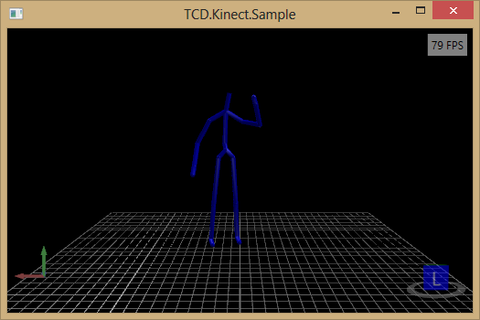

# Implementation of SkeletonPainter3D
## Requires
- Visual Studio 2012
## License
- MS-LPL
## Technologies
- WPF
- Kinect
- Kinect SDK
## Topics
- Controls
- User Interface
- Graphics and 3D
## Updated
- 11/13/2014
## Description

<h1>Introduction</h1>

<em>Recently I've built a UserControl that can be use to show the Skeletons, tracked by the Kinect camera in a three-dimensional, interactive viewport. Additional 3D objects can be added to the drawing as well.</em>

<h1>Building the Sample</h1>

<em>Visual Studio 2012 is required.</em>

<em>The SkeletonPainter3D UserControls is available via a NuGet package. (<a href="http://blog.mosthege.net/2012/07/15/exploring-nuget/" target="_parent">What is NuGet?</a>) You'll probably need the NuGet Package Mangaer Visual Studio extension!</em>

Description

<em>The purpose of the control is to be useful in debugging, and development scenarios, where a better understanding of what's going on in the virtual 3D environment is required. The
<a href="http://helixtoolkit.codeplex.com/">Helix 3D&nbsp;Toolkit</a>&nbsp;is used for the underlying 3D control. It's performance is okay, but not enough for advanced simulations! An experimental 3d Anaglyph mode is available.</em>

<em>To implement the control, you can construct it in XAML:</em>

XAML

Edit|Remove

xaml

<pre class="xaml">xmlns:kinect=&quot;clr-namespace:TCD.Kinect.Controls;assembly=TCD.Kinect.Controls&quot;&nbsp;
&nbsp;
&lt;kinect:SkeletonPainter3D&nbsp;x:Name=&quot;painter&quot;&nbsp;Background=&quot;Black&quot;&nbsp;IsAnaglyphEnabled=&quot;False&quot;&nbsp;CameraFieldOfView=&quot;70&quot;&nbsp;CameraPosition=&quot;0,0.5,-1&quot;&nbsp;CameraLookAt=&quot;0,0,2&quot;&nbsp;/&gt;</pre>

Then you can provide a Skeleton[]&nbsp;using the SkeletonPainter3D.Draw() method:&nbsp;

C#

Edit|Remove

csharp

<pre class="csharp">painter.Draw(skeletons);</pre>

<address>This it what it looks like:</address>
<h1></h1>
<address>The 3D view can be easily manipulated:</address>
<address></address>
<address>Additional 3D objects can be added as well. TCD.Kinect.Model3DExtensions provides a few basic geometric objects, like box and cylinder, that can be added to a Model3DCollection, which is than passed to the Draw() method. For example you may want
 to simulate a sword in the users hand and you need to test how to calculate the lenght, or orientation.</address>
<h1>Source Code Files</h1>
<ul>
<li><em>TCD.Kinect.Sample.zip&nbsp;- Sample implementation (like in the picture above)</em>
</li><li><a title="Kinect Sword Solution" href="http://dl.dropbox.com/u/7813771/Blog/CodeSamples/KinectSword.zip">KinectSword.zip</a> - Complete SourceCode of the 'game' demonstrated in this video:
<a href="http://www.youtube.com/watch?v=2j6GCd4M1bA">http://www.youtube.com/watch?v=2j6GCd4M1bA</a>&nbsp;(uses SkeletonPainter3D)
</li></ul>
<h1>More Information</h1>

<em>For more information on TCD.Kinect, see <a href="http://blog.mosthege.net">
http://blog.mosthege.net</a>.</em>

