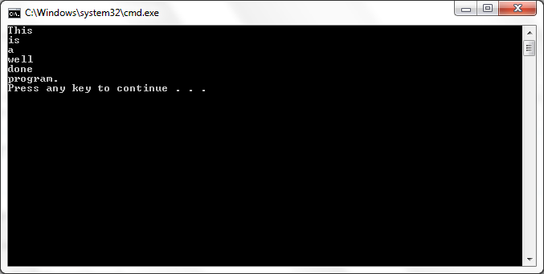

# Implementing the IEnumerable Interface in a Collection Class
## Requires
- Visual Studio 2010
## License
- Custom
## Technologies
- Windows General
## Topics
- Collections
- Tokens
- IEnumerable
- Foreach
## Updated
- 06/20/2011
## Description

<h1>Introduction</h1>

This sample shows how to implement a collection class that can be used with the
<strong>foreach</strong> statement.

<h1>Building the Sample</h1>
<h4 class="heading">To build and run the Collection Classes samples within Visual Studio</h4>

<ol>
<li>

In <strong>Solution Explorer</strong>, right-click the CollectionClasses1 project and click
<strong>Set as StartUp Project</strong>.

</li><li>

From the <strong>Debug</strong> menu, click <strong>Start Without Debugging</strong>.

</li><li>

Repeat the preceding steps for CollectionClasses2.

</li></ol>

<h4 class="heading">To build and run the Collection Classes samples from the Command Line</h4>

<ol>
<li>

Use the <strong>Change Directory</strong> command to change to the CollectionClasses1 directory.

</li><li>

Type the following:

<table cellspacing="0" cellpadding="0" width="100%">
<tbody>
<tr>
<td colspan="2">
<pre>csc tokens.cs
tokens</pre>
</td>
</tr>
</tbody>
</table>

</li><li>

Use the <strong>Change Directory</strong> command to change to the CollectionClasses2 directory.

</li><li>

Type the following:

<table cellspacing="0" cellpadding="0" width="100%">
<tbody>
<tr>
<td colspan="2">
<pre>csc tokens2.cs
tokens2</pre>
</td>
</tr>
</tbody>
</table>

</li></ol>

<h1>Description</h1>

This sample shows how to implement a collection class that can be used with the
<strong>foreach</strong> statement. See Collection Classes (C# Programming Guide) for more information.

<h4>Security Note</h4>

This sample code is provided to illustrate a concept and should not be used in applications or Web sites, as it may not illustrate the safest coding practices. Microsoft assumes no liability for incidental or consequential damages should the sample code
 be used for purposes other than as intended.

<h1>Screenshot</h1>

<h1>Sample Code</h1>

C#

Edit|Remove

csharp
<pre class="hidden">   static void Main()
   {
      // Testing Tokens by breaking the string into tokens:
      Tokens f = new Tokens(&quot;This is a well-done program.&quot;, 
         new char[] {' ','-'});
      foreach (string item in f)
      {
         Console.WriteLine(item);
      }
   }</pre>

<pre id="codePreview" class="csharp">&nbsp;&nbsp;&nbsp;static&nbsp;void&nbsp;Main()&nbsp;
&nbsp;&nbsp;&nbsp;{&nbsp;
&nbsp;&nbsp;&nbsp;&nbsp;&nbsp;&nbsp;//&nbsp;Testing&nbsp;Tokens&nbsp;by&nbsp;breaking&nbsp;the&nbsp;string&nbsp;into&nbsp;tokens:&nbsp;
&nbsp;&nbsp;&nbsp;&nbsp;&nbsp;&nbsp;Tokens&nbsp;f&nbsp;=&nbsp;new&nbsp;Tokens(&quot;This&nbsp;is&nbsp;a&nbsp;well-done&nbsp;program.&quot;,&nbsp;&nbsp;
&nbsp;&nbsp;&nbsp;&nbsp;&nbsp;&nbsp;&nbsp;&nbsp;&nbsp;new&nbsp;char[]&nbsp;{'&nbsp;','-'});&nbsp;
&nbsp;&nbsp;&nbsp;&nbsp;&nbsp;&nbsp;foreach&nbsp;(string&nbsp;item&nbsp;in&nbsp;f)&nbsp;
&nbsp;&nbsp;&nbsp;&nbsp;&nbsp;&nbsp;{&nbsp;
&nbsp;&nbsp;&nbsp;&nbsp;&nbsp;&nbsp;&nbsp;&nbsp;&nbsp;Console.WriteLine(item);&nbsp;
&nbsp;&nbsp;&nbsp;&nbsp;&nbsp;&nbsp;}&nbsp;
&nbsp;&nbsp;&nbsp;}</pre>

<h1>Source Code Files</h1>
<ul>
<li><a class="browseFile" href="sourcecode?fileId=23509&pathId=848208947">tokens.cs</a>
</li><li><a class="browseFile" href="sourcecode?fileId=23509&pathId=2098527711">tokens2.cs</a>
</li></ul>
<h1>More Information</h1>

For more information, see:

<ul>
<li>IEnumerable Interface - <a href="http://msdn.microsoft.com/en-us/library/system.collections.ienumerable.aspx" target="_blank">
http://msdn.microsoft.com/en-us/library/system.collections.ienumerable.aspx</a> </li><li>Foreach, in (C# Reference) - <a href="http://msdn.microsoft.com/en-us/library/ttw7t8t6%28v=VS.100%29.aspx" target="_blank">
http://msdn.microsoft.com/en-us/library/ttw7t8t6%28v=VS.100%29.aspx</a> </li><li>Collection Classes (C# Programming Guide) - <a href="http://msdn.microsoft.com/en-us/library/ybcx56wz%28v=VS.100%29.aspx" target="_blank">
http://msdn.microsoft.com/en-us/library/ybcx56wz%28v=VS.100%29.aspx</a> </li></ul>
