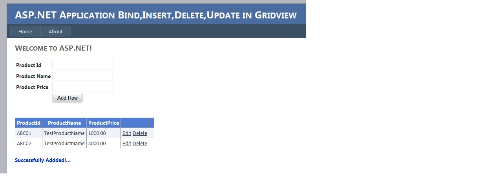
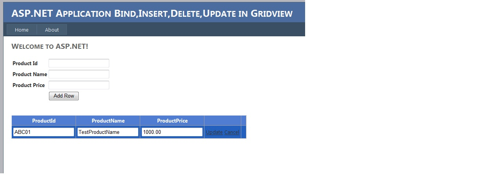

# Insert Update and Delete rows in ASP.NET GridView Control
## Requires
- Visual Studio 2010
## License
- Apache License, Version 2.0
## Technologies
- SQL
- ASP.NET
- GridView
## Topics
- SQL Server
- ASP.NET
- GridView
- inserting tables
- GridView editing
## Updated
- 05/29/2013
## Description

<h1>Introduction</h1>

<em>In this Article you can learn how to edit, update, delete, and cancel in gridview.First drag and drop Gridview.In gridview properties set AutoGenarateColumns to False.Next open Default.aspx source code. To make a columns
 in Gridview use &nbsp;&lt;asp:TemplateField&gt;Here first I created a table name 'Product' in my database.it contains 3 colomns as ProductId,ProductName,ProdcutPrice</em>

<em> 
1)Download My Sample.</em>

<em>2)Inside that folder person.sql file will be there execute it in your database<em>.<em><em>&nbsp;<em><em>&nbsp;</em></em></em></em></em></em>

<em><em>&nbsp;</em></em>

<em><em>&nbsp;</em></em>

<em><em>&nbsp;</em></em>

<em><em>&nbsp;</em></em>

<em><em>&nbsp;</em></em>

<em><em>

SQL

Edit|Remove

mysql

<pre class="mysql">/******&nbsp;Object:&nbsp;&nbsp;Table&nbsp;[dbo].[Product]&nbsp;&nbsp;&nbsp;&nbsp;Script&nbsp;Date:&nbsp;07/07/2012&nbsp;02:18:07&nbsp;******/&nbsp;
SET&nbsp;ANSI_NULLS&nbsp;ON&nbsp;
GO&nbsp;
&nbsp;
SET&nbsp;QUOTED_IDENTIFIER&nbsp;ON&nbsp;
GO&nbsp;
&nbsp;
SET&nbsp;ANSI_PADDING&nbsp;ON&nbsp;
GO&nbsp;
&nbsp;
CREATE&nbsp;TABLE&nbsp;[dbo].[Product](&nbsp;
&nbsp;&nbsp;&nbsp;&nbsp;[pk_id]&nbsp;[int]&nbsp;IDENTITY(1,1)&nbsp;NOT&nbsp;NULL,&nbsp;
&nbsp;&nbsp;&nbsp;&nbsp;[ProductId]&nbsp;[varchar](5)&nbsp;NULL,&nbsp;
&nbsp;&nbsp;&nbsp;&nbsp;[ProductName]&nbsp;[varchar](50)&nbsp;NULL,&nbsp;
&nbsp;&nbsp;&nbsp;&nbsp;[ProductPrice]&nbsp;[numeric](8,&nbsp;2)&nbsp;NULL,&nbsp;
PRIMARY&nbsp;KEY&nbsp;CLUSTERED&nbsp;&nbsp;
(&nbsp;
&nbsp;&nbsp;&nbsp;&nbsp;[pk_id]&nbsp;ASC&nbsp;
)WITH&nbsp;(PAD_INDEX&nbsp;&nbsp;=&nbsp;OFF,&nbsp;STATISTICS_NORECOMPUTE&nbsp;&nbsp;=&nbsp;OFF,&nbsp;IGNORE_DUP_KEY&nbsp;=&nbsp;OFF,&nbsp;ALLOW_ROW_LOCKS&nbsp;&nbsp;=&nbsp;ON,&nbsp;ALLOW_PAGE_LOCKS&nbsp;&nbsp;=&nbsp;ON)&nbsp;ON&nbsp;[PRIMARY]&nbsp;
)&nbsp;ON&nbsp;[PRIMARY]&nbsp;
&nbsp;
GO&nbsp;
&nbsp;
SET&nbsp;ANSI_PADDING&nbsp;OFF&nbsp;
GO&nbsp;
</pre>

&nbsp;<em><em>3)Change the connetion string in web.config file.</em></em>

</em>

&nbsp;

&nbsp;

C#

Edit|Remove

csharp

<pre class="csharp">&lt;configuration&gt;&nbsp;
&nbsp;&nbsp;&lt;connectionStrings&gt;&nbsp;
&nbsp;&nbsp;&nbsp;&nbsp;&lt;add&nbsp;name=&quot;MyConnection&quot;&nbsp;
&nbsp;&nbsp;&nbsp;&nbsp;&nbsp;&nbsp;&nbsp;&nbsp;&nbsp;connectionString=&quot;Data&nbsp;Source=MONISH-PC\MONISH;Initial&nbsp;Catalog=master;Persist&nbsp;Security&nbsp;Info=True;User&nbsp;ID=saty;Password=123&quot;&nbsp;
&nbsp;&nbsp;&nbsp;&nbsp;&nbsp;&nbsp;&nbsp;&nbsp;&nbsp;providerName=&quot;System.Data.SqlClient&quot;&nbsp;/&gt;&nbsp;
&nbsp;&nbsp;&lt;/connectionStrings&gt;</pre>

&nbsp;

Building the Sample

<em>This sample wrote by three tier architecture so you have to add references.</em>

<em>UI-&gt;BusinessLogic</em>

<em><em>BusinessLogic-&gt;DataAccess back to BL</em></em>

<em><em><em>BusinessLogic-&gt;Commonfunctioon&nbsp;<em><em>back to BL</em></em></em></em></em>

<em><em><em><em><em><em>BusinessLogic -&gt;&nbsp;<em>UI finally BL return data to UI</em></em></em></em></em></em></em>

<em><em><em><em><em><em><em> 
</em></em></em></em></em></em></em>

<em><em><em><em><em><em><em> 
</em></em></em></em></em></em></em>

Description

In Default.aspx source code we have to add

This&nbsp;is used to Edit the Row in Gridview.Here I am going to Edit only two columns name and marks.

C#

Edit|Remove

csharp

<pre class="csharp">&lt;asp:GridView&nbsp;ID=&quot;GridView1&quot;&nbsp;runat=&quot;server&quot;&nbsp;CellPadding=&quot;4&quot;&nbsp;&nbsp;
&nbsp;&nbsp;&nbsp;&nbsp;&nbsp;&nbsp;&nbsp;&nbsp;&nbsp;&nbsp;&nbsp;&nbsp;ForeColor=&quot;#333333&quot;&nbsp;&nbsp;AutoGenerateColumns=&quot;False&quot;&nbsp;&nbsp;
&nbsp;&nbsp;&nbsp;&nbsp;&nbsp;&nbsp;&nbsp;&nbsp;&nbsp;&nbsp;&nbsp;&nbsp;onrowcancelingedit=&quot;GridView1_RowCancelingEdit&quot;&nbsp;&nbsp;
&nbsp;&nbsp;&nbsp;&nbsp;&nbsp;&nbsp;&nbsp;&nbsp;&nbsp;&nbsp;&nbsp;&nbsp;onrowdeleting=&quot;GridView1_RowDeleting&quot;&nbsp;onrowediting=&quot;GridView1_RowEditing&quot;&nbsp;&nbsp;
&nbsp;&nbsp;&nbsp;&nbsp;&nbsp;&nbsp;&nbsp;&nbsp;&nbsp;&nbsp;&nbsp;&nbsp;onrowupdating=&quot;GridView1_RowUpdating&quot;&nbsp;&gt;&nbsp;
&nbsp;&nbsp;&nbsp;&nbsp;&nbsp;&nbsp;&nbsp;&nbsp;&nbsp;&nbsp;&nbsp;&nbsp;&lt;AlternatingRowStyle&nbsp;BackColor=&quot;White&quot;&nbsp;/&gt;&nbsp;
&nbsp;&nbsp;&nbsp;&nbsp;&nbsp;&nbsp;&nbsp;&nbsp;&nbsp;&nbsp;&nbsp;&nbsp;&lt;Columns&gt;&nbsp;
&nbsp;&nbsp;&nbsp;&nbsp;&nbsp;&nbsp;&nbsp;&nbsp;&nbsp;&nbsp;&nbsp;&nbsp;&nbsp;&nbsp;&nbsp;&nbsp;&lt;asp:TemplateField&nbsp;Visible=&quot;False&quot;&gt;&nbsp;&nbsp;&nbsp;
&nbsp;&nbsp;&nbsp;&nbsp;&nbsp;&nbsp;&nbsp;&nbsp;&nbsp;&nbsp;&nbsp;&nbsp;&nbsp;&nbsp;&nbsp;&nbsp;&nbsp;&nbsp;&nbsp;&nbsp;&nbsp;&nbsp;&nbsp;&nbsp;&nbsp;&nbsp;&nbsp;&nbsp;&nbsp;&nbsp;&nbsp;&nbsp;&nbsp;
&nbsp;&nbsp;&nbsp;&nbsp;&nbsp;&nbsp;&nbsp;&nbsp;&nbsp;&nbsp;&nbsp;&nbsp;&nbsp;&nbsp;&nbsp;&nbsp;&nbsp;&nbsp;&nbsp;&nbsp;&lt;ItemTemplate&gt;&nbsp;
&nbsp;&nbsp;&nbsp;&nbsp;&nbsp;&nbsp;&nbsp;&nbsp;&nbsp;&nbsp;&nbsp;&nbsp;&nbsp;&nbsp;&nbsp;&nbsp;&nbsp;&nbsp;&nbsp;&nbsp;&nbsp;&nbsp;&nbsp;&nbsp;&lt;asp:Label&nbsp;ID=&quot;lblPk_id&quot;&nbsp;runat=&quot;server&quot;&nbsp;&nbsp;Text='&lt;%#Eval(&quot;pk_id&quot;)%&gt;'&gt;&lt;/asp:Label&gt;&nbsp;
&nbsp;&nbsp;&nbsp;&nbsp;&nbsp;&nbsp;&nbsp;&nbsp;&nbsp;&nbsp;&nbsp;&nbsp;&nbsp;&nbsp;&nbsp;&nbsp;&nbsp;&nbsp;&nbsp;&nbsp;&lt;/ItemTemplate&gt;&nbsp;
&nbsp;&nbsp;&nbsp;&nbsp;&nbsp;&nbsp;&nbsp;&nbsp;&nbsp;&nbsp;&nbsp;&nbsp;&nbsp;&nbsp;&nbsp;&nbsp;&lt;/asp:TemplateField&gt;&nbsp;
&nbsp;&nbsp;&nbsp;&nbsp;&nbsp;&nbsp;&nbsp;&nbsp;&nbsp;&nbsp;&nbsp;&nbsp;&nbsp;&nbsp;&nbsp;&nbsp;&lt;asp:TemplateField&nbsp;Headertext=&quot;ProductId&quot;&gt;&nbsp;
&nbsp;&nbsp;&nbsp;&nbsp;&nbsp;&nbsp;&nbsp;&nbsp;&nbsp;&nbsp;&nbsp;&nbsp;&nbsp;&nbsp;&nbsp;&nbsp;&nbsp;&nbsp;&nbsp;&nbsp;&lt;EditItemTemplate&gt;&nbsp;
&nbsp;&nbsp;&nbsp;&nbsp;&nbsp;&nbsp;&nbsp;&nbsp;&nbsp;&nbsp;&nbsp;&nbsp;&nbsp;&nbsp;&nbsp;&nbsp;&nbsp;&nbsp;&nbsp;&nbsp;&nbsp;&nbsp;&nbsp;&nbsp;&lt;asp:TextBox&nbsp;ID=&quot;txtProductId&quot;&nbsp;runat=&quot;server&quot;&nbsp;&nbsp;Text='&lt;%#Eval(&quot;ProductId&quot;)%&gt;'&gt;&lt;/asp:TextBox&gt;&nbsp;
&nbsp;&nbsp;&nbsp;&nbsp;&nbsp;&nbsp;&nbsp;&nbsp;&nbsp;&nbsp;&nbsp;&nbsp;&nbsp;&nbsp;&nbsp;&nbsp;&nbsp;&nbsp;&nbsp;&nbsp;&lt;/EditItemTemplate&gt;&nbsp;
&nbsp;&nbsp;&nbsp;&nbsp;&nbsp;&nbsp;&nbsp;&nbsp;&nbsp;&nbsp;&nbsp;&nbsp;&nbsp;&nbsp;&nbsp;&nbsp;&nbsp;&nbsp;&nbsp;&nbsp;&lt;FooterTemplate&gt;&nbsp;
&nbsp;&nbsp;&nbsp;&nbsp;&nbsp;&nbsp;&nbsp;&nbsp;&nbsp;&nbsp;&nbsp;&nbsp;&nbsp;&nbsp;&nbsp;&nbsp;&nbsp;&nbsp;&nbsp;&nbsp;&lt;asp:TextBox&nbsp;ID=&quot;txtProductId&quot;&nbsp;runat=&quot;server&quot;&nbsp;&nbsp;Text='&lt;%#Eval(&quot;ProductId&quot;)%&gt;'&gt;&lt;/asp:TextBox&gt;&nbsp;
&nbsp;&nbsp;&nbsp;&nbsp;&nbsp;&nbsp;&nbsp;&nbsp;&nbsp;&nbsp;&nbsp;&nbsp;&nbsp;&nbsp;&nbsp;&nbsp;&nbsp;&nbsp;&nbsp;&nbsp;&lt;/FooterTemplate&gt;&nbsp;
&nbsp;&nbsp;&nbsp;&nbsp;&nbsp;&nbsp;&nbsp;&nbsp;&nbsp;&nbsp;&nbsp;&nbsp;&nbsp;&nbsp;&nbsp;&nbsp;&nbsp;&nbsp;&nbsp;&nbsp;&lt;ItemTemplate&gt;&nbsp;
&nbsp;&nbsp;&nbsp;&nbsp;&nbsp;&nbsp;&nbsp;&nbsp;&nbsp;&nbsp;&nbsp;&nbsp;&nbsp;&nbsp;&nbsp;&nbsp;&nbsp;&nbsp;&nbsp;&nbsp;&nbsp;&nbsp;&nbsp;&nbsp;&lt;asp:Label&nbsp;ID=&quot;lblProductId&quot;&nbsp;runat=&quot;server&quot;&nbsp;&nbsp;Text='&lt;%#Eval(&quot;ProductId&quot;)%&gt;'&gt;&lt;/asp:Label&gt;&nbsp;
&nbsp;&nbsp;&nbsp;&nbsp;&nbsp;&nbsp;&nbsp;&nbsp;&nbsp;&nbsp;&nbsp;&nbsp;&nbsp;&nbsp;&nbsp;&nbsp;&nbsp;&nbsp;&nbsp;&nbsp;&lt;/ItemTemplate&gt;&nbsp;
&nbsp;&nbsp;&nbsp;&nbsp;&nbsp;&nbsp;&nbsp;&nbsp;&nbsp;&nbsp;&nbsp;&nbsp;&nbsp;&nbsp;&nbsp;&nbsp;&lt;/asp:TemplateField&gt;&nbsp;
&nbsp;&nbsp;&nbsp;&nbsp;&nbsp;&nbsp;&nbsp;&nbsp;&nbsp;&nbsp;&nbsp;&nbsp;&nbsp;&nbsp;&nbsp;&nbsp;&lt;asp:TemplateField&nbsp;HeaderText=&quot;ProductName&quot;&gt;&nbsp;
&nbsp;&nbsp;&nbsp;&nbsp;&nbsp;&nbsp;&nbsp;&nbsp;&nbsp;&nbsp;&nbsp;&nbsp;&nbsp;&nbsp;&nbsp;&nbsp;&nbsp;&nbsp;&nbsp;&nbsp;&lt;EditItemTemplate&gt;&nbsp;
&nbsp;&nbsp;&nbsp;&nbsp;&nbsp;&nbsp;&nbsp;&nbsp;&nbsp;&nbsp;&nbsp;&nbsp;&nbsp;&nbsp;&nbsp;&nbsp;&nbsp;&nbsp;&nbsp;&nbsp;&nbsp;&nbsp;&nbsp;&nbsp;&lt;asp:TextBox&nbsp;ID=&quot;txtProductName&quot;&nbsp;runat=&quot;server&quot;&nbsp;Text='&lt;%#Eval(&quot;ProductName&quot;)%&gt;'&gt;&lt;/asp:TextBox&gt;&nbsp;
&nbsp;&nbsp;&nbsp;&nbsp;&nbsp;&nbsp;&nbsp;&nbsp;&nbsp;&nbsp;&nbsp;&nbsp;&nbsp;&nbsp;&nbsp;&nbsp;&nbsp;&nbsp;&nbsp;&nbsp;&lt;/EditItemTemplate&gt;&nbsp;
&nbsp;&nbsp;&nbsp;&nbsp;&nbsp;&nbsp;&nbsp;&nbsp;&nbsp;&nbsp;&nbsp;&nbsp;&nbsp;&nbsp;&nbsp;&nbsp;&nbsp;&nbsp;&nbsp;&nbsp;&lt;FooterTemplate&gt;&nbsp;
&nbsp;&nbsp;&nbsp;&nbsp;&nbsp;&nbsp;&nbsp;&nbsp;&nbsp;&nbsp;&nbsp;&nbsp;&nbsp;&nbsp;&nbsp;&nbsp;&nbsp;&nbsp;&nbsp;&nbsp;&lt;asp:TextBox&nbsp;ID=&quot;txtProductName&quot;&nbsp;runat=&quot;server&quot;&nbsp;Text='&lt;%#Eval(&quot;ProductName&quot;)%&gt;'&gt;&lt;/asp:TextBox&gt;&nbsp;
&nbsp;&nbsp;&nbsp;&nbsp;&nbsp;&nbsp;&nbsp;&nbsp;&nbsp;&nbsp;&nbsp;&nbsp;&nbsp;&nbsp;&nbsp;&nbsp;&nbsp;&nbsp;&nbsp;&nbsp;&lt;/FooterTemplate&gt;&nbsp;
&nbsp;&nbsp;&nbsp;&nbsp;&nbsp;&nbsp;&nbsp;&nbsp;&nbsp;&nbsp;&nbsp;&nbsp;&nbsp;&nbsp;&nbsp;&nbsp;&nbsp;&nbsp;&nbsp;&nbsp;&lt;ItemTemplate&gt;&nbsp;
&nbsp;&nbsp;&nbsp;&nbsp;&nbsp;&nbsp;&nbsp;&nbsp;&nbsp;&nbsp;&nbsp;&nbsp;&nbsp;&nbsp;&nbsp;&nbsp;&nbsp;&nbsp;&nbsp;&nbsp;&nbsp;&nbsp;&nbsp;&nbsp;&lt;asp:Label&nbsp;ID=&quot;lblProductName&quot;&nbsp;runat=&quot;server&quot;&nbsp;&nbsp;Text='&lt;%#Eval(&quot;ProductName&quot;)%&gt;'&gt;&lt;/asp:Label&gt;&nbsp;
&nbsp;&nbsp;&nbsp;&nbsp;&nbsp;&nbsp;&nbsp;&nbsp;&nbsp;&nbsp;&nbsp;&nbsp;&nbsp;&nbsp;&nbsp;&nbsp;&nbsp;&nbsp;&nbsp;&nbsp;&lt;/ItemTemplate&gt;&nbsp;
&nbsp;&nbsp;&nbsp;&nbsp;&nbsp;&nbsp;&nbsp;&nbsp;&nbsp;&nbsp;&nbsp;&nbsp;&nbsp;&nbsp;&nbsp;&nbsp;&lt;/asp:TemplateField&gt;&nbsp;
&nbsp;&nbsp;&nbsp;&nbsp;&nbsp;&nbsp;&nbsp;&nbsp;&nbsp;&nbsp;&nbsp;&nbsp;&nbsp;&nbsp;&nbsp;&nbsp;&lt;asp:TemplateField&nbsp;HeaderText=&quot;ProductPrice&quot;&gt;&nbsp;
&nbsp;&nbsp;&nbsp;&nbsp;&nbsp;&nbsp;&nbsp;&nbsp;&nbsp;&nbsp;&nbsp;&nbsp;&nbsp;&nbsp;&nbsp;&nbsp;&nbsp;&nbsp;&nbsp;&nbsp;&lt;EditItemTemplate&gt;&nbsp;
&nbsp;&nbsp;&nbsp;&nbsp;&nbsp;&nbsp;&nbsp;&nbsp;&nbsp;&nbsp;&nbsp;&nbsp;&nbsp;&nbsp;&nbsp;&nbsp;&nbsp;&nbsp;&nbsp;&nbsp;&nbsp;&nbsp;&nbsp;&nbsp;&lt;asp:TextBox&nbsp;ID=&quot;txtProductPrice&quot;&nbsp;runat=&quot;server&quot;&nbsp;&nbsp;Text='&lt;%#Eval(&quot;ProductPrice&quot;)%&gt;'&gt;&lt;/asp:TextBox&gt;&nbsp;
&nbsp;&nbsp;&nbsp;&nbsp;&nbsp;&nbsp;&nbsp;&nbsp;&nbsp;&nbsp;&nbsp;&nbsp;&nbsp;&nbsp;&nbsp;&nbsp;&nbsp;&nbsp;&nbsp;&nbsp;&lt;/EditItemTemplate&gt;&nbsp;
&nbsp;&nbsp;&nbsp;&nbsp;&nbsp;&nbsp;&nbsp;&nbsp;&nbsp;&nbsp;&nbsp;&nbsp;&nbsp;&nbsp;&nbsp;&nbsp;&nbsp;&nbsp;&nbsp;&nbsp;&lt;FooterTemplate&gt;&nbsp;
&nbsp;&nbsp;&nbsp;&nbsp;&nbsp;&nbsp;&nbsp;&nbsp;&nbsp;&nbsp;&nbsp;&nbsp;&nbsp;&nbsp;&nbsp;&nbsp;&nbsp;&nbsp;&nbsp;&nbsp;&lt;asp:TextBox&nbsp;ID=&quot;txtProductPrice&quot;&nbsp;runat=&quot;server&quot;&nbsp;&nbsp;Text='&lt;%#Eval(&quot;ProductPrice&quot;)%&gt;'&gt;&lt;/asp:TextBox&gt;&nbsp;
&nbsp;&nbsp;&nbsp;&nbsp;&nbsp;&nbsp;&nbsp;&nbsp;&nbsp;&nbsp;&nbsp;&nbsp;&nbsp;&nbsp;&nbsp;&nbsp;&nbsp;&nbsp;&nbsp;&nbsp;&lt;/FooterTemplate&gt;&nbsp;
&nbsp;&nbsp;&nbsp;&nbsp;&nbsp;&nbsp;&nbsp;&nbsp;&nbsp;&nbsp;&nbsp;&nbsp;&nbsp;&nbsp;&nbsp;&nbsp;&nbsp;&nbsp;&nbsp;&nbsp;&lt;ItemTemplate&gt;&nbsp;
&nbsp;&nbsp;&nbsp;&nbsp;&nbsp;&nbsp;&nbsp;&nbsp;&nbsp;&nbsp;&nbsp;&nbsp;&nbsp;&nbsp;&nbsp;&nbsp;&nbsp;&nbsp;&nbsp;&nbsp;&nbsp;&nbsp;&nbsp;&nbsp;&lt;asp:Label&nbsp;ID=&quot;lblProductPrice&quot;&nbsp;runat=&quot;server&quot;&nbsp;&nbsp;&nbsp;&nbsp;Text='&lt;%#Eval(&quot;ProductPrice&quot;)%&gt;'&gt;&lt;/asp:Label&gt;&nbsp;
&nbsp;&nbsp;&nbsp;&nbsp;&nbsp;&nbsp;&nbsp;&nbsp;&nbsp;&nbsp;&nbsp;&nbsp;&nbsp;&nbsp;&nbsp;&nbsp;&nbsp;&nbsp;&nbsp;&nbsp;&lt;/ItemTemplate&gt;&nbsp;
&nbsp;&nbsp;&nbsp;&nbsp;&nbsp;&nbsp;&nbsp;&nbsp;&nbsp;&nbsp;&nbsp;&nbsp;&nbsp;&nbsp;&nbsp;&nbsp;&lt;/asp:TemplateField&gt;&nbsp;
&nbsp;&nbsp;&nbsp;&nbsp;&nbsp;&nbsp;&nbsp;&nbsp;&nbsp;&nbsp;&nbsp;&nbsp;&nbsp;&nbsp;&nbsp;&nbsp;&lt;asp:CommandField&nbsp;ShowDeleteButton=&quot;True&quot;&nbsp;ShowEditButton=&quot;True&quot;&nbsp;/&gt;&nbsp;
&nbsp;&nbsp;&nbsp;&nbsp;&nbsp;&nbsp;&nbsp;&nbsp;&nbsp;&nbsp;&nbsp;&nbsp;&nbsp;&nbsp;&nbsp;&nbsp;&lt;asp:TemplateField&gt;&nbsp;
&nbsp;&nbsp;&nbsp;&nbsp;&nbsp;&nbsp;&nbsp;&nbsp;&nbsp;&nbsp;&nbsp;&nbsp;&nbsp;&nbsp;&nbsp;&nbsp;&lt;FooterTemplate&gt;&nbsp;
&nbsp;
&nbsp;&nbsp;&nbsp;&nbsp;&nbsp;&nbsp;&nbsp;&nbsp;&nbsp;&nbsp;&nbsp;&nbsp;&nbsp;&nbsp;&nbsp;&nbsp;&lt;asp:Button&nbsp;ID=&quot;btnInsert&quot;&nbsp;runat=&quot;Server&quot;&nbsp;Text=&quot;Insert&quot;&nbsp;CommandName=&quot;Insert&quot;&nbsp;UseSubmitBehavior=&quot;False&quot;&nbsp;/&gt;&nbsp;
&nbsp;
&nbsp;&nbsp;&nbsp;&nbsp;&nbsp;&nbsp;&nbsp;&nbsp;&nbsp;&nbsp;&nbsp;&nbsp;&nbsp;&nbsp;&nbsp;&nbsp;&lt;/FooterTemplate&gt;&nbsp;
&nbsp;&nbsp;&nbsp;&nbsp;&nbsp;&nbsp;&nbsp;&nbsp;&nbsp;&nbsp;&nbsp;&nbsp;&nbsp;&nbsp;&nbsp;&nbsp;&lt;/asp:TemplateField&gt;&nbsp;
&nbsp;
&nbsp;&nbsp;&nbsp;&nbsp;&nbsp;&nbsp;&nbsp;&nbsp;&nbsp;&nbsp;&nbsp;&nbsp;&lt;/Columns&gt;&nbsp;
&nbsp;&nbsp;&nbsp;&nbsp;&nbsp;&nbsp;&nbsp;&nbsp;&nbsp;&nbsp;&nbsp;&nbsp;&lt;EditRowStyle&nbsp;BackColor=&quot;#2461BF&quot;&nbsp;/&gt;&nbsp;
&nbsp;&nbsp;&nbsp;&nbsp;&nbsp;&nbsp;&nbsp;&nbsp;&nbsp;&nbsp;&nbsp;&nbsp;&lt;FooterStyle&nbsp;BackColor=&quot;#507CD1&quot;&nbsp;Font-Bold=&quot;True&quot;&nbsp;ForeColor=&quot;White&quot;&nbsp;/&gt;&nbsp;
&nbsp;&nbsp;&nbsp;&nbsp;&nbsp;&nbsp;&nbsp;&nbsp;&nbsp;&nbsp;&nbsp;&nbsp;&lt;HeaderStyle&nbsp;BackColor=&quot;#507CD1&quot;&nbsp;Font-Bold=&quot;True&quot;&nbsp;ForeColor=&quot;White&quot;&nbsp;/&gt;&nbsp;
&nbsp;&nbsp;&nbsp;&nbsp;&nbsp;&nbsp;&nbsp;&nbsp;&nbsp;&nbsp;&nbsp;&nbsp;&lt;PagerStyle&nbsp;BackColor=&quot;#2461BF&quot;&nbsp;ForeColor=&quot;White&quot;&nbsp;HorizontalAlign=&quot;Center&quot;&nbsp;/&gt;&nbsp;
&nbsp;&nbsp;&nbsp;&nbsp;&nbsp;&nbsp;&nbsp;&nbsp;&nbsp;&nbsp;&nbsp;&nbsp;&lt;RowStyle&nbsp;BackColor=&quot;#EFF3FB&quot;&nbsp;/&gt;&nbsp;
&nbsp;&nbsp;&nbsp;&nbsp;&nbsp;&nbsp;&nbsp;&nbsp;&nbsp;&nbsp;&nbsp;&nbsp;&lt;SelectedRowStyle&nbsp;BackColor=&quot;#D1DDF1&quot;&nbsp;Font-Bold=&quot;True&quot;&nbsp;ForeColor=&quot;#333333&quot;&nbsp;/&gt;&nbsp;
&nbsp;&nbsp;&nbsp;&nbsp;&nbsp;&nbsp;&nbsp;&nbsp;&nbsp;&nbsp;&nbsp;&nbsp;&lt;SortedAscendingCellStyle&nbsp;BackColor=&quot;#F5F7FB&quot;&nbsp;/&gt;&nbsp;
&nbsp;&nbsp;&nbsp;&nbsp;&nbsp;&nbsp;&nbsp;&nbsp;&nbsp;&nbsp;&nbsp;&nbsp;&lt;SortedAscendingHeaderStyle&nbsp;BackColor=&quot;#6D95E1&quot;&nbsp;/&gt;&nbsp;
&nbsp;&nbsp;&nbsp;&nbsp;&nbsp;&nbsp;&nbsp;&nbsp;&nbsp;&nbsp;&nbsp;&nbsp;&lt;SortedDescendingCellStyle&nbsp;BackColor=&quot;#E9EBEF&quot;&nbsp;/&gt;&nbsp;
&nbsp;&nbsp;&nbsp;&nbsp;&nbsp;&nbsp;&nbsp;&nbsp;&nbsp;&nbsp;&nbsp;&nbsp;&lt;SortedDescendingHeaderStyle&nbsp;BackColor=&quot;#4870BE&quot;&nbsp;/&gt;&nbsp;
&nbsp;&nbsp;&nbsp;&nbsp;&nbsp;&nbsp;&nbsp;&nbsp;&lt;/asp:GridView&gt;&nbsp;
&nbsp;&nbsp;&nbsp;&nbsp;&nbsp;&nbsp;&nbsp;</pre>

<h1>Source Code Files</h1>
<ul>
<li><strong><em>product.sql</em></strong> </li></ul>

&nbsp;

Note:I have used SqlServer 2008

For this article we are going to fill GridView by data from database.

We are going to make perform following operations on data using GridView

<ol>
<li>Add New record into database; here data will directly be added into database table
</li><li>Update Records into database, using edit link.
</li><li>Delete Records using delete link </li></ol>

&nbsp;

</em>

