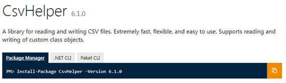
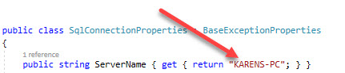
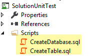

# Inserting a batch of records via SqlClient command/parameters (C#)
## Requires
- Visual Studio 2017
## License
- MIT
## Technologies
- C#
- SQL Server
- Unit Test
- SqlClient
## Topics
- SQL Server
- best practices
- Bulk Insert
- Adding records
## Updated
- 12/26/2017
## Description

<h1>Introduction</h1>

This code sample at the core is simple once known which is how to properly insert multiple records into a database in regards to setting up the proper objects.

<h1>Building the Sample</h1>

A NuGet package <a href="https://www.nuget.org/packages/CsvHelper/">
CsvHelper</a> is required, Visual Studio should do a auto restore package but if not you can go to the link above to install it.

 

Description

Many times on various forums a developer wants to insert multiple records from a DataGridView or perhaps they read in data from a delimited file. They will use a for or for-each statement where within the for or for-each they
 will close a global connection, setup a command object, create parameters using AddWithValue, execute the INSERT query and move to the next record, repeating this for all records.

Sure it works but when presented with a large set of data be it thousands of rows with a few fields or thousands of records with over 10 or 20 or more fields the code becomes difficult to read and can slow things down from opening/closing
 a connection along with having to recreate a command and parameters.

In this code sample I show a better way where at the core one connection is used, kept open for the duration of a for statement. A command is setup with parameters and in each iteration for inserting records each parameter is
 set rather than being created. For each row added the primary key is obtained and stored if needed for showing in a control such as a DataGridView where it may be changed (column values) then needs the updates to be sent back to the database hence the primary
 key for the record is needed.

There is a good deal of setup to get to the insert, I created a class project with the sole responsibility to read in a delimited file which resides, in this case in the folder of the unit test bin\debug folder.

C#

Edit|Remove

csharp
<pre class="hidden">using System;
using System.Collections.Generic;
using System.IO;
using System.Linq;
using CsvHelper;
using BackEnd;

namespace CsvReaderLibrary
{
    /// &lt;summary&gt;
    /// 
    /// &lt;/summary&gt;
    /// &lt;remarks&gt;
    /// File read in via
    /// https://joshclose.github.io/CsvHelper/
    /// &lt;/remarks&gt;
    public class ReadMLB_Pleayers : BaseExceptionProperties
    {
        /// &lt;summary&gt;
        /// Used to learn about import errors with the csv reader
        /// &lt;/summary&gt;
        private List&lt;string&gt; errorLines;
        /// &lt;summary&gt;
        /// Read a comma delimited file into a list of a specfic class
        /// &lt;/summary&gt;
        /// &lt;param name=&quot;pFileName&quot;&gt;&lt;/param&gt;
        /// &lt;returns&gt;&lt;/returns&gt;
        public List&lt;Player&gt; ReaderPlayersFromFile(string pFileName)
        {
            var playerList = new List&lt;Player&gt;();

            try
            {
                errorLines = new List&lt;string&gt;();
                using (TextReader readFile = new StreamReader(pFileName))
                {
                    var csv = new CsvReader(readFile);
                    csv.Configuration.BadDataFound = context =&gt;  
                    {
                        errorLines.Add($&quot;Bad data found on row '{context.RawRow}&quot;);
                    };

                    csv.Configuration.HasHeaderRecord = false;

                    var record = new PlayerPartial();
                    var records = csv.EnumerateRecords(record);

                    playerList = records.Select(p =&gt; new Player()
                    {
                        Name = p.Name,
                        Age = p.Age,
                        Height = p.Height,
                        Position = p.Position,
                        Team = p.Team,
                        Weight = p.Weight
                    }).ToList();

                }
            }
            catch (Exception ex)
            {
                mHasException = true;
                mLastException = ex;
            }

            return playerList;
        }
    }
}
</pre>

<pre class="csharp">using&nbsp;System;&nbsp;
using&nbsp;System.Collections.Generic;&nbsp;
using&nbsp;System.IO;&nbsp;
using&nbsp;System.Linq;&nbsp;
using&nbsp;CsvHelper;&nbsp;
using&nbsp;BackEnd;&nbsp;
&nbsp;
namespace&nbsp;CsvReaderLibrary&nbsp;
{&nbsp;
&nbsp;&nbsp;&nbsp;&nbsp;///&nbsp;&lt;summary&gt;///&nbsp;///&nbsp;&lt;/summary&gt;///&nbsp;&lt;remarks&gt;///&nbsp;File&nbsp;read&nbsp;in&nbsp;via///&nbsp;https://joshclose.github.io/CsvHelper////&nbsp;&lt;/remarks&gt;publicclass&nbsp;ReadMLB_Pleayers&nbsp;:&nbsp;BaseExceptionProperties&nbsp;
&nbsp;&nbsp;&nbsp;&nbsp;{&nbsp;
&nbsp;&nbsp;&nbsp;&nbsp;&nbsp;&nbsp;&nbsp;&nbsp;///&nbsp;&lt;summary&gt;///&nbsp;Used&nbsp;to&nbsp;learn&nbsp;about&nbsp;import&nbsp;errors&nbsp;with&nbsp;the&nbsp;csv&nbsp;reader///&nbsp;&lt;/summary&gt;private&nbsp;List&lt;string&gt;&nbsp;errorLines;&nbsp;
&nbsp;&nbsp;&nbsp;&nbsp;&nbsp;&nbsp;&nbsp;&nbsp;///&nbsp;&lt;summary&gt;///&nbsp;Read&nbsp;a&nbsp;comma&nbsp;delimited&nbsp;file&nbsp;into&nbsp;a&nbsp;list&nbsp;of&nbsp;a&nbsp;specfic&nbsp;class///&nbsp;&lt;/summary&gt;///&nbsp;&lt;param&nbsp;name=&quot;pFileName&quot;&gt;&lt;/param&gt;///&nbsp;&lt;returns&gt;&lt;/returns&gt;public&nbsp;List&lt;Player&gt;&nbsp;ReaderPlayersFromFile(string&nbsp;pFileName)&nbsp;
&nbsp;&nbsp;&nbsp;&nbsp;&nbsp;&nbsp;&nbsp;&nbsp;{&nbsp;
&nbsp;&nbsp;&nbsp;&nbsp;&nbsp;&nbsp;&nbsp;&nbsp;&nbsp;&nbsp;&nbsp;&nbsp;var&nbsp;playerList&nbsp;=&nbsp;new&nbsp;List&lt;Player&gt;();&nbsp;
&nbsp;
&nbsp;&nbsp;&nbsp;&nbsp;&nbsp;&nbsp;&nbsp;&nbsp;&nbsp;&nbsp;&nbsp;&nbsp;try&nbsp;
&nbsp;&nbsp;&nbsp;&nbsp;&nbsp;&nbsp;&nbsp;&nbsp;&nbsp;&nbsp;&nbsp;&nbsp;{&nbsp;
&nbsp;&nbsp;&nbsp;&nbsp;&nbsp;&nbsp;&nbsp;&nbsp;&nbsp;&nbsp;&nbsp;&nbsp;&nbsp;&nbsp;&nbsp;&nbsp;errorLines&nbsp;=&nbsp;new&nbsp;List&lt;string&gt;();&nbsp;
&nbsp;&nbsp;&nbsp;&nbsp;&nbsp;&nbsp;&nbsp;&nbsp;&nbsp;&nbsp;&nbsp;&nbsp;&nbsp;&nbsp;&nbsp;&nbsp;using&nbsp;(TextReader&nbsp;readFile&nbsp;=&nbsp;new&nbsp;StreamReader(pFileName))&nbsp;
&nbsp;&nbsp;&nbsp;&nbsp;&nbsp;&nbsp;&nbsp;&nbsp;&nbsp;&nbsp;&nbsp;&nbsp;&nbsp;&nbsp;&nbsp;&nbsp;{&nbsp;
&nbsp;&nbsp;&nbsp;&nbsp;&nbsp;&nbsp;&nbsp;&nbsp;&nbsp;&nbsp;&nbsp;&nbsp;&nbsp;&nbsp;&nbsp;&nbsp;&nbsp;&nbsp;&nbsp;&nbsp;var&nbsp;csv&nbsp;=&nbsp;new&nbsp;CsvReader(readFile);&nbsp;
&nbsp;&nbsp;&nbsp;&nbsp;&nbsp;&nbsp;&nbsp;&nbsp;&nbsp;&nbsp;&nbsp;&nbsp;&nbsp;&nbsp;&nbsp;&nbsp;&nbsp;&nbsp;&nbsp;&nbsp;csv.Configuration.BadDataFound&nbsp;=&nbsp;context&nbsp;=&gt;&nbsp;&nbsp;&nbsp;
&nbsp;&nbsp;&nbsp;&nbsp;&nbsp;&nbsp;&nbsp;&nbsp;&nbsp;&nbsp;&nbsp;&nbsp;&nbsp;&nbsp;&nbsp;&nbsp;&nbsp;&nbsp;&nbsp;&nbsp;{&nbsp;
&nbsp;&nbsp;&nbsp;&nbsp;&nbsp;&nbsp;&nbsp;&nbsp;&nbsp;&nbsp;&nbsp;&nbsp;&nbsp;&nbsp;&nbsp;&nbsp;&nbsp;&nbsp;&nbsp;&nbsp;&nbsp;&nbsp;&nbsp;&nbsp;errorLines.Add($&quot;Bad&nbsp;data&nbsp;found&nbsp;on&nbsp;row&nbsp;'{context.RawRow}&quot;);&nbsp;
&nbsp;&nbsp;&nbsp;&nbsp;&nbsp;&nbsp;&nbsp;&nbsp;&nbsp;&nbsp;&nbsp;&nbsp;&nbsp;&nbsp;&nbsp;&nbsp;&nbsp;&nbsp;&nbsp;&nbsp;};&nbsp;
&nbsp;
&nbsp;&nbsp;&nbsp;&nbsp;&nbsp;&nbsp;&nbsp;&nbsp;&nbsp;&nbsp;&nbsp;&nbsp;&nbsp;&nbsp;&nbsp;&nbsp;&nbsp;&nbsp;&nbsp;&nbsp;csv.Configuration.HasHeaderRecord&nbsp;=&nbsp;false;&nbsp;
&nbsp;
&nbsp;&nbsp;&nbsp;&nbsp;&nbsp;&nbsp;&nbsp;&nbsp;&nbsp;&nbsp;&nbsp;&nbsp;&nbsp;&nbsp;&nbsp;&nbsp;&nbsp;&nbsp;&nbsp;&nbsp;var&nbsp;record&nbsp;=&nbsp;new&nbsp;PlayerPartial();&nbsp;
&nbsp;&nbsp;&nbsp;&nbsp;&nbsp;&nbsp;&nbsp;&nbsp;&nbsp;&nbsp;&nbsp;&nbsp;&nbsp;&nbsp;&nbsp;&nbsp;&nbsp;&nbsp;&nbsp;&nbsp;var&nbsp;records&nbsp;=&nbsp;csv.EnumerateRecords(record);&nbsp;
&nbsp;
&nbsp;
&nbsp;&nbsp;&nbsp;&nbsp;&nbsp;&nbsp;&nbsp;&nbsp;&nbsp;&nbsp;&nbsp;&nbsp;&nbsp;&nbsp;&nbsp;&nbsp;&nbsp;&nbsp;&nbsp;&nbsp;playerList&nbsp;=&nbsp;records.Select(p&nbsp;=&gt;&nbsp;new&nbsp;Player()&nbsp;
&nbsp;&nbsp;&nbsp;&nbsp;&nbsp;&nbsp;&nbsp;&nbsp;&nbsp;&nbsp;&nbsp;&nbsp;&nbsp;&nbsp;&nbsp;&nbsp;&nbsp;&nbsp;&nbsp;&nbsp;{&nbsp;
&nbsp;&nbsp;&nbsp;&nbsp;&nbsp;&nbsp;&nbsp;&nbsp;&nbsp;&nbsp;&nbsp;&nbsp;&nbsp;&nbsp;&nbsp;&nbsp;&nbsp;&nbsp;&nbsp;&nbsp;&nbsp;&nbsp;&nbsp;&nbsp;Name&nbsp;=&nbsp;p.Name,&nbsp;
&nbsp;&nbsp;&nbsp;&nbsp;&nbsp;&nbsp;&nbsp;&nbsp;&nbsp;&nbsp;&nbsp;&nbsp;&nbsp;&nbsp;&nbsp;&nbsp;&nbsp;&nbsp;&nbsp;&nbsp;&nbsp;&nbsp;&nbsp;&nbsp;Age&nbsp;=&nbsp;p.Age,&nbsp;
&nbsp;&nbsp;&nbsp;&nbsp;&nbsp;&nbsp;&nbsp;&nbsp;&nbsp;&nbsp;&nbsp;&nbsp;&nbsp;&nbsp;&nbsp;&nbsp;&nbsp;&nbsp;&nbsp;&nbsp;&nbsp;&nbsp;&nbsp;&nbsp;Height&nbsp;=&nbsp;p.Height,&nbsp;
&nbsp;&nbsp;&nbsp;&nbsp;&nbsp;&nbsp;&nbsp;&nbsp;&nbsp;&nbsp;&nbsp;&nbsp;&nbsp;&nbsp;&nbsp;&nbsp;&nbsp;&nbsp;&nbsp;&nbsp;&nbsp;&nbsp;&nbsp;&nbsp;Position&nbsp;=&nbsp;p.Position,&nbsp;
&nbsp;&nbsp;&nbsp;&nbsp;&nbsp;&nbsp;&nbsp;&nbsp;&nbsp;&nbsp;&nbsp;&nbsp;&nbsp;&nbsp;&nbsp;&nbsp;&nbsp;&nbsp;&nbsp;&nbsp;&nbsp;&nbsp;&nbsp;&nbsp;Team&nbsp;=&nbsp;p.Team,&nbsp;
&nbsp;&nbsp;&nbsp;&nbsp;&nbsp;&nbsp;&nbsp;&nbsp;&nbsp;&nbsp;&nbsp;&nbsp;&nbsp;&nbsp;&nbsp;&nbsp;&nbsp;&nbsp;&nbsp;&nbsp;&nbsp;&nbsp;&nbsp;&nbsp;Weight&nbsp;=&nbsp;p.Weight&nbsp;
&nbsp;&nbsp;&nbsp;&nbsp;&nbsp;&nbsp;&nbsp;&nbsp;&nbsp;&nbsp;&nbsp;&nbsp;&nbsp;&nbsp;&nbsp;&nbsp;&nbsp;&nbsp;&nbsp;&nbsp;}).ToList();&nbsp;
&nbsp;
&nbsp;&nbsp;&nbsp;&nbsp;&nbsp;&nbsp;&nbsp;&nbsp;&nbsp;&nbsp;&nbsp;&nbsp;&nbsp;&nbsp;&nbsp;&nbsp;}&nbsp;
&nbsp;&nbsp;&nbsp;&nbsp;&nbsp;&nbsp;&nbsp;&nbsp;&nbsp;&nbsp;&nbsp;&nbsp;}&nbsp;
&nbsp;&nbsp;&nbsp;&nbsp;&nbsp;&nbsp;&nbsp;&nbsp;&nbsp;&nbsp;&nbsp;&nbsp;catch&nbsp;(Exception&nbsp;ex)&nbsp;
&nbsp;&nbsp;&nbsp;&nbsp;&nbsp;&nbsp;&nbsp;&nbsp;&nbsp;&nbsp;&nbsp;&nbsp;{&nbsp;
&nbsp;&nbsp;&nbsp;&nbsp;&nbsp;&nbsp;&nbsp;&nbsp;&nbsp;&nbsp;&nbsp;&nbsp;&nbsp;&nbsp;&nbsp;&nbsp;mHasException&nbsp;=&nbsp;true;&nbsp;
&nbsp;&nbsp;&nbsp;&nbsp;&nbsp;&nbsp;&nbsp;&nbsp;&nbsp;&nbsp;&nbsp;&nbsp;&nbsp;&nbsp;&nbsp;&nbsp;mLastException&nbsp;=&nbsp;ex;&nbsp;
&nbsp;&nbsp;&nbsp;&nbsp;&nbsp;&nbsp;&nbsp;&nbsp;&nbsp;&nbsp;&nbsp;&nbsp;}&nbsp;
&nbsp;
&nbsp;&nbsp;&nbsp;&nbsp;&nbsp;&nbsp;&nbsp;&nbsp;&nbsp;&nbsp;&nbsp;&nbsp;return&nbsp;playerList;&nbsp;
&nbsp;&nbsp;&nbsp;&nbsp;&nbsp;&nbsp;&nbsp;&nbsp;}&nbsp;
&nbsp;&nbsp;&nbsp;&nbsp;}&nbsp;
}&nbsp;
</pre>

In another class project, the data read in from the above project will insert data into a SQL-Server database table. In the code below, note how it's structured in regards to first creating a connection and command object followed
 by parameters. Within this there is the foreach which first sets values for each parameter then executes the INSERT which adds a new row followed by a SELECT to get the new key.

C#

Edit|Remove

csharp
<pre class="hidden">using System;
using System.Collections.Generic;
using System.Data;
using System.Data.SqlClient;

namespace BackEnd
{
    public class DataOperations : SqlConnectionProperties
    {
        /// &lt;summary&gt;
        /// Method inserts records based on pPlayerList into a SQL-Server table.
        /// The focus is for the most part on setting up the parameters for the
        /// inserting of records.
        /// &lt;/summary&gt;
        /// &lt;param name=&quot;pPlayerList&quot;&gt;&lt;/param&gt;
        /// &lt;returns&gt;&lt;/returns&gt;
        public bool InsertRecordsFromTextFileImport(List&lt;Player&gt; pPlayerList)
        {
            using (SqlConnection cn = new SqlConnection() { ConnectionString = ConnectionString })
            {
                using (SqlCommand cmd = new SqlCommand() { Connection = cn })
                {
                    /*
                     * Construct an INSERT statement with a SELECT which provides the new primary
                     * key on a successful insert.
                     * 
                     * INSERT/SELECT was generated via part of a code sample I wrote
                     * https://code.msdn.microsoft.com/Working-with-SQL-Server-986fff9e
                     * 
                     * where you select a database from a ComboBox, select a table from a ListBox
                     * then select columns from a CheckedListBox which in turn create a INSERT/SELECT
                     * statement.
                     */
                    cmd.CommandText = &quot;INSERT INTO Players &quot; &#43; 
                                      &quot;(Name,Team,Position,Height,[Weight],Age) &quot; &#43; 
                                      &quot;VALUES (@Name,@Team,@Position,@Height,@Weight,@Age); &quot; &#43; 
                                      &quot;SELECT CAST(scope_identity() AS int);&quot;;

                    /*
                     * Setup parameters (one only inserting one row we would use cmd.Parameters.AddWithValue
                     * yet in a for-each we can't unless we clear the parameter collection and set the values
                     * on each iteration while doing the parameters as shown below is better.
                     * 
                     * Usually what I see on forums is a new to data operations developer will not only 
                     * re-create parameters in a for-each but also they will be opening/closing a connection,
                     * creating a new command, re-open a connection, run the query, not check for errors
                     * or get the new id which with not many records might be acceptable to them yet when dealing
                     * with many rows or many rows and many columns this most likely will slow things down and
                     * make it harder to maintain the code.
                     */
                    cmd.Parameters.Add(new SqlParameter() {ParameterName = &quot;@Name&quot;, DbType = DbType.String });
                    cmd.Parameters.Add(new SqlParameter() {ParameterName = &quot;@Team&quot;, DbType = DbType.String });
                    cmd.Parameters.Add(new SqlParameter() {ParameterName = &quot;@Position&quot;,DbType = DbType.String});
                    cmd.Parameters.Add(new SqlParameter() {ParameterName = &quot;@Height&quot;, DbType = DbType.Int32 });
                    cmd.Parameters.Add(new SqlParameter() {ParameterName = &quot;@Weight&quot;, DbType = DbType.Int32 });
                    cmd.Parameters.Add(new SqlParameter() {ParameterName = &quot;@Age&quot;, DbType = DbType.Decimal });

                    try
                    {

                        cn.Open();

                        foreach (Player player in pPlayerList)
                        {
                            /*
                             * Since we setup parameters once above we simply index to the proper
                             * parameter and set it's value
                             */
                            cmd.Parameters[&quot;@Name&quot;].Value = player.Name;
                            cmd.Parameters[&quot;@Team&quot;].Value = player.Team;
                            cmd.Parameters[&quot;@Position&quot;].Value = player.Position;
                            cmd.Parameters[&quot;@Height&quot;].Value = player.Height;
                            cmd.Parameters[&quot;@Weight&quot;].Value = player.Weight;
                            cmd.Parameters[&quot;@Age&quot;].Value = player.Age;

                            /*
                             * As we have an insert and select the ExecuteScalar returns
                             * the result of the select part of our CommandText. We get
                             * back the identity/primary key for the newly added record
                             * from ExecuteScalar cast from object to int.
                             */
                            player.id = Convert.ToInt32(cmd.ExecuteScalar());

                        }
                        
                    }
                    catch (Exception ex)
                    {
                        mHasException = true;
                        mLastException = ex;
                        return false;
                    }
                }
            }

            return true;
        }
    }
}
</pre>

<pre class="csharp">using&nbsp;System;&nbsp;
using&nbsp;System.Collections.Generic;&nbsp;
using&nbsp;System.Data;&nbsp;
using&nbsp;System.Data.SqlClient;&nbsp;
&nbsp;
namespace&nbsp;BackEnd&nbsp;
{&nbsp;
&nbsp;&nbsp;&nbsp;&nbsp;public&nbsp;class&nbsp;DataOperations&nbsp;:&nbsp;SqlConnectionProperties&nbsp;
&nbsp;&nbsp;&nbsp;&nbsp;{&nbsp;
&nbsp;&nbsp;&nbsp;&nbsp;&nbsp;&nbsp;&nbsp;&nbsp;///&nbsp;&lt;summary&gt;&nbsp;
&nbsp;&nbsp;&nbsp;&nbsp;&nbsp;&nbsp;&nbsp;&nbsp;///&nbsp;Method&nbsp;inserts&nbsp;records&nbsp;based&nbsp;on&nbsp;pPlayerList&nbsp;into&nbsp;a&nbsp;SQL-Server&nbsp;table.&nbsp;
&nbsp;&nbsp;&nbsp;&nbsp;&nbsp;&nbsp;&nbsp;&nbsp;///&nbsp;The&nbsp;focus&nbsp;is&nbsp;for&nbsp;the&nbsp;most&nbsp;part&nbsp;on&nbsp;setting&nbsp;up&nbsp;the&nbsp;parameters&nbsp;for&nbsp;the&nbsp;
&nbsp;&nbsp;&nbsp;&nbsp;&nbsp;&nbsp;&nbsp;&nbsp;///&nbsp;inserting&nbsp;of&nbsp;records.&nbsp;
&nbsp;&nbsp;&nbsp;&nbsp;&nbsp;&nbsp;&nbsp;&nbsp;///&nbsp;&lt;/summary&gt;&nbsp;
&nbsp;&nbsp;&nbsp;&nbsp;&nbsp;&nbsp;&nbsp;&nbsp;///&nbsp;&lt;param&nbsp;name=&quot;pPlayerList&quot;&gt;&lt;/param&gt;&nbsp;
&nbsp;&nbsp;&nbsp;&nbsp;&nbsp;&nbsp;&nbsp;&nbsp;///&nbsp;&lt;returns&gt;&lt;/returns&gt;&nbsp;
&nbsp;&nbsp;&nbsp;&nbsp;&nbsp;&nbsp;&nbsp;&nbsp;public&nbsp;bool&nbsp;InsertRecordsFromTextFileImport(List&lt;Player&gt;&nbsp;pPlayerList)&nbsp;
&nbsp;&nbsp;&nbsp;&nbsp;&nbsp;&nbsp;&nbsp;&nbsp;{&nbsp;
&nbsp;&nbsp;&nbsp;&nbsp;&nbsp;&nbsp;&nbsp;&nbsp;&nbsp;&nbsp;&nbsp;&nbsp;using&nbsp;(SqlConnection&nbsp;cn&nbsp;=&nbsp;new&nbsp;SqlConnection()&nbsp;{&nbsp;ConnectionString&nbsp;=&nbsp;ConnectionString&nbsp;})&nbsp;
&nbsp;&nbsp;&nbsp;&nbsp;&nbsp;&nbsp;&nbsp;&nbsp;&nbsp;&nbsp;&nbsp;&nbsp;{&nbsp;
&nbsp;&nbsp;&nbsp;&nbsp;&nbsp;&nbsp;&nbsp;&nbsp;&nbsp;&nbsp;&nbsp;&nbsp;&nbsp;&nbsp;&nbsp;&nbsp;using&nbsp;(SqlCommand&nbsp;cmd&nbsp;=&nbsp;new&nbsp;SqlCommand()&nbsp;{&nbsp;Connection&nbsp;=&nbsp;cn&nbsp;})&nbsp;
&nbsp;&nbsp;&nbsp;&nbsp;&nbsp;&nbsp;&nbsp;&nbsp;&nbsp;&nbsp;&nbsp;&nbsp;&nbsp;&nbsp;&nbsp;&nbsp;{&nbsp;
&nbsp;&nbsp;&nbsp;&nbsp;&nbsp;&nbsp;&nbsp;&nbsp;&nbsp;&nbsp;&nbsp;&nbsp;&nbsp;&nbsp;&nbsp;&nbsp;&nbsp;&nbsp;&nbsp;&nbsp;/*&nbsp;
&nbsp;&nbsp;&nbsp;&nbsp;&nbsp;&nbsp;&nbsp;&nbsp;&nbsp;&nbsp;&nbsp;&nbsp;&nbsp;&nbsp;&nbsp;&nbsp;&nbsp;&nbsp;&nbsp;&nbsp;&nbsp;*&nbsp;Construct&nbsp;an&nbsp;INSERT&nbsp;statement&nbsp;with&nbsp;a&nbsp;SELECT&nbsp;which&nbsp;provides&nbsp;the&nbsp;new&nbsp;primary&nbsp;
&nbsp;&nbsp;&nbsp;&nbsp;&nbsp;&nbsp;&nbsp;&nbsp;&nbsp;&nbsp;&nbsp;&nbsp;&nbsp;&nbsp;&nbsp;&nbsp;&nbsp;&nbsp;&nbsp;&nbsp;&nbsp;*&nbsp;key&nbsp;on&nbsp;a&nbsp;successful&nbsp;insert.&nbsp;
&nbsp;&nbsp;&nbsp;&nbsp;&nbsp;&nbsp;&nbsp;&nbsp;&nbsp;&nbsp;&nbsp;&nbsp;&nbsp;&nbsp;&nbsp;&nbsp;&nbsp;&nbsp;&nbsp;&nbsp;&nbsp;*&nbsp;&nbsp;
&nbsp;&nbsp;&nbsp;&nbsp;&nbsp;&nbsp;&nbsp;&nbsp;&nbsp;&nbsp;&nbsp;&nbsp;&nbsp;&nbsp;&nbsp;&nbsp;&nbsp;&nbsp;&nbsp;&nbsp;&nbsp;*&nbsp;INSERT/SELECT&nbsp;was&nbsp;generated&nbsp;via&nbsp;part&nbsp;of&nbsp;a&nbsp;code&nbsp;sample&nbsp;I&nbsp;wrote&nbsp;
&nbsp;&nbsp;&nbsp;&nbsp;&nbsp;&nbsp;&nbsp;&nbsp;&nbsp;&nbsp;&nbsp;&nbsp;&nbsp;&nbsp;&nbsp;&nbsp;&nbsp;&nbsp;&nbsp;&nbsp;&nbsp;*&nbsp;https://code.msdn.microsoft.com/Working-with-SQL-Server-986fff9e&nbsp;
&nbsp;&nbsp;&nbsp;&nbsp;&nbsp;&nbsp;&nbsp;&nbsp;&nbsp;&nbsp;&nbsp;&nbsp;&nbsp;&nbsp;&nbsp;&nbsp;&nbsp;&nbsp;&nbsp;&nbsp;&nbsp;*&nbsp;&nbsp;
&nbsp;&nbsp;&nbsp;&nbsp;&nbsp;&nbsp;&nbsp;&nbsp;&nbsp;&nbsp;&nbsp;&nbsp;&nbsp;&nbsp;&nbsp;&nbsp;&nbsp;&nbsp;&nbsp;&nbsp;&nbsp;*&nbsp;where&nbsp;you&nbsp;select&nbsp;a&nbsp;database&nbsp;from&nbsp;a&nbsp;ComboBox,&nbsp;select&nbsp;a&nbsp;table&nbsp;from&nbsp;a&nbsp;ListBox&nbsp;
&nbsp;&nbsp;&nbsp;&nbsp;&nbsp;&nbsp;&nbsp;&nbsp;&nbsp;&nbsp;&nbsp;&nbsp;&nbsp;&nbsp;&nbsp;&nbsp;&nbsp;&nbsp;&nbsp;&nbsp;&nbsp;*&nbsp;then&nbsp;select&nbsp;columns&nbsp;from&nbsp;a&nbsp;CheckedListBox&nbsp;which&nbsp;in&nbsp;turn&nbsp;create&nbsp;a&nbsp;INSERT/SELECT&nbsp;
&nbsp;&nbsp;&nbsp;&nbsp;&nbsp;&nbsp;&nbsp;&nbsp;&nbsp;&nbsp;&nbsp;&nbsp;&nbsp;&nbsp;&nbsp;&nbsp;&nbsp;&nbsp;&nbsp;&nbsp;&nbsp;*&nbsp;statement.&nbsp;
&nbsp;&nbsp;&nbsp;&nbsp;&nbsp;&nbsp;&nbsp;&nbsp;&nbsp;&nbsp;&nbsp;&nbsp;&nbsp;&nbsp;&nbsp;&nbsp;&nbsp;&nbsp;&nbsp;&nbsp;&nbsp;*/&nbsp;
&nbsp;&nbsp;&nbsp;&nbsp;&nbsp;&nbsp;&nbsp;&nbsp;&nbsp;&nbsp;&nbsp;&nbsp;&nbsp;&nbsp;&nbsp;&nbsp;&nbsp;&nbsp;&nbsp;&nbsp;cmd.CommandText&nbsp;=&nbsp;&quot;INSERT&nbsp;INTO&nbsp;Players&nbsp;&quot;&nbsp;&#43;&nbsp;&nbsp;
&nbsp;&nbsp;&nbsp;&nbsp;&nbsp;&nbsp;&nbsp;&nbsp;&nbsp;&nbsp;&nbsp;&nbsp;&nbsp;&nbsp;&nbsp;&nbsp;&nbsp;&nbsp;&nbsp;&nbsp;&nbsp;&nbsp;&nbsp;&nbsp;&nbsp;&nbsp;&nbsp;&nbsp;&nbsp;&nbsp;&nbsp;&nbsp;&nbsp;&nbsp;&nbsp;&nbsp;&nbsp;&nbsp;&quot;(Name,Team,Position,Height,[Weight],Age)&nbsp;&quot;&nbsp;&#43;&nbsp;&nbsp;
&nbsp;&nbsp;&nbsp;&nbsp;&nbsp;&nbsp;&nbsp;&nbsp;&nbsp;&nbsp;&nbsp;&nbsp;&nbsp;&nbsp;&nbsp;&nbsp;&nbsp;&nbsp;&nbsp;&nbsp;&nbsp;&nbsp;&nbsp;&nbsp;&nbsp;&nbsp;&nbsp;&nbsp;&nbsp;&nbsp;&nbsp;&nbsp;&nbsp;&nbsp;&nbsp;&nbsp;&nbsp;&nbsp;&quot;VALUES&nbsp;(@Name,@Team,@Position,@Height,@Weight,@Age);&nbsp;&quot;&nbsp;&#43;&nbsp;&nbsp;
&nbsp;&nbsp;&nbsp;&nbsp;&nbsp;&nbsp;&nbsp;&nbsp;&nbsp;&nbsp;&nbsp;&nbsp;&nbsp;&nbsp;&nbsp;&nbsp;&nbsp;&nbsp;&nbsp;&nbsp;&nbsp;&nbsp;&nbsp;&nbsp;&nbsp;&nbsp;&nbsp;&nbsp;&nbsp;&nbsp;&nbsp;&nbsp;&nbsp;&nbsp;&nbsp;&nbsp;&nbsp;&nbsp;&quot;SELECT&nbsp;CAST(scope_identity()&nbsp;AS&nbsp;int);&quot;;&nbsp;
&nbsp;
&nbsp;&nbsp;&nbsp;&nbsp;&nbsp;&nbsp;&nbsp;&nbsp;&nbsp;&nbsp;&nbsp;&nbsp;&nbsp;&nbsp;&nbsp;&nbsp;&nbsp;&nbsp;&nbsp;&nbsp;/*&nbsp;
&nbsp;&nbsp;&nbsp;&nbsp;&nbsp;&nbsp;&nbsp;&nbsp;&nbsp;&nbsp;&nbsp;&nbsp;&nbsp;&nbsp;&nbsp;&nbsp;&nbsp;&nbsp;&nbsp;&nbsp;&nbsp;*&nbsp;Setup&nbsp;parameters&nbsp;(one&nbsp;only&nbsp;inserting&nbsp;one&nbsp;row&nbsp;we&nbsp;would&nbsp;use&nbsp;cmd.Parameters.AddWithValue&nbsp;
&nbsp;&nbsp;&nbsp;&nbsp;&nbsp;&nbsp;&nbsp;&nbsp;&nbsp;&nbsp;&nbsp;&nbsp;&nbsp;&nbsp;&nbsp;&nbsp;&nbsp;&nbsp;&nbsp;&nbsp;&nbsp;*&nbsp;yet&nbsp;in&nbsp;a&nbsp;for-each&nbsp;we&nbsp;can't&nbsp;unless&nbsp;we&nbsp;clear&nbsp;the&nbsp;parameter&nbsp;collection&nbsp;and&nbsp;set&nbsp;the&nbsp;values&nbsp;
&nbsp;&nbsp;&nbsp;&nbsp;&nbsp;&nbsp;&nbsp;&nbsp;&nbsp;&nbsp;&nbsp;&nbsp;&nbsp;&nbsp;&nbsp;&nbsp;&nbsp;&nbsp;&nbsp;&nbsp;&nbsp;*&nbsp;on&nbsp;each&nbsp;iteration&nbsp;while&nbsp;doing&nbsp;the&nbsp;parameters&nbsp;as&nbsp;shown&nbsp;below&nbsp;is&nbsp;better.&nbsp;
&nbsp;&nbsp;&nbsp;&nbsp;&nbsp;&nbsp;&nbsp;&nbsp;&nbsp;&nbsp;&nbsp;&nbsp;&nbsp;&nbsp;&nbsp;&nbsp;&nbsp;&nbsp;&nbsp;&nbsp;&nbsp;*&nbsp;&nbsp;
&nbsp;&nbsp;&nbsp;&nbsp;&nbsp;&nbsp;&nbsp;&nbsp;&nbsp;&nbsp;&nbsp;&nbsp;&nbsp;&nbsp;&nbsp;&nbsp;&nbsp;&nbsp;&nbsp;&nbsp;&nbsp;*&nbsp;Usually&nbsp;what&nbsp;I&nbsp;see&nbsp;on&nbsp;forums&nbsp;is&nbsp;a&nbsp;new&nbsp;to&nbsp;data&nbsp;operations&nbsp;developer&nbsp;will&nbsp;not&nbsp;only&nbsp;&nbsp;
&nbsp;&nbsp;&nbsp;&nbsp;&nbsp;&nbsp;&nbsp;&nbsp;&nbsp;&nbsp;&nbsp;&nbsp;&nbsp;&nbsp;&nbsp;&nbsp;&nbsp;&nbsp;&nbsp;&nbsp;&nbsp;*&nbsp;re-create&nbsp;parameters&nbsp;in&nbsp;a&nbsp;for-each&nbsp;but&nbsp;also&nbsp;they&nbsp;will&nbsp;be&nbsp;opening/closing&nbsp;a&nbsp;connection,&nbsp;
&nbsp;&nbsp;&nbsp;&nbsp;&nbsp;&nbsp;&nbsp;&nbsp;&nbsp;&nbsp;&nbsp;&nbsp;&nbsp;&nbsp;&nbsp;&nbsp;&nbsp;&nbsp;&nbsp;&nbsp;&nbsp;*&nbsp;creating&nbsp;a&nbsp;new&nbsp;command,&nbsp;re-open&nbsp;a&nbsp;connection,&nbsp;run&nbsp;the&nbsp;query,&nbsp;not&nbsp;check&nbsp;for&nbsp;errors&nbsp;
&nbsp;&nbsp;&nbsp;&nbsp;&nbsp;&nbsp;&nbsp;&nbsp;&nbsp;&nbsp;&nbsp;&nbsp;&nbsp;&nbsp;&nbsp;&nbsp;&nbsp;&nbsp;&nbsp;&nbsp;&nbsp;*&nbsp;or&nbsp;get&nbsp;the&nbsp;new&nbsp;id&nbsp;which&nbsp;with&nbsp;not&nbsp;many&nbsp;records&nbsp;might&nbsp;be&nbsp;acceptable&nbsp;to&nbsp;them&nbsp;yet&nbsp;when&nbsp;dealing&nbsp;
&nbsp;&nbsp;&nbsp;&nbsp;&nbsp;&nbsp;&nbsp;&nbsp;&nbsp;&nbsp;&nbsp;&nbsp;&nbsp;&nbsp;&nbsp;&nbsp;&nbsp;&nbsp;&nbsp;&nbsp;&nbsp;*&nbsp;with&nbsp;many&nbsp;rows&nbsp;or&nbsp;many&nbsp;rows&nbsp;and&nbsp;many&nbsp;columns&nbsp;this&nbsp;most&nbsp;likely&nbsp;will&nbsp;slow&nbsp;things&nbsp;down&nbsp;and&nbsp;
&nbsp;&nbsp;&nbsp;&nbsp;&nbsp;&nbsp;&nbsp;&nbsp;&nbsp;&nbsp;&nbsp;&nbsp;&nbsp;&nbsp;&nbsp;&nbsp;&nbsp;&nbsp;&nbsp;&nbsp;&nbsp;*&nbsp;make&nbsp;it&nbsp;harder&nbsp;to&nbsp;maintain&nbsp;the&nbsp;code.&nbsp;
&nbsp;&nbsp;&nbsp;&nbsp;&nbsp;&nbsp;&nbsp;&nbsp;&nbsp;&nbsp;&nbsp;&nbsp;&nbsp;&nbsp;&nbsp;&nbsp;&nbsp;&nbsp;&nbsp;&nbsp;&nbsp;*/&nbsp;
&nbsp;&nbsp;&nbsp;&nbsp;&nbsp;&nbsp;&nbsp;&nbsp;&nbsp;&nbsp;&nbsp;&nbsp;&nbsp;&nbsp;&nbsp;&nbsp;&nbsp;&nbsp;&nbsp;&nbsp;cmd.Parameters.Add(new&nbsp;SqlParameter()&nbsp;{ParameterName&nbsp;=&nbsp;&quot;@Name&quot;,&nbsp;DbType&nbsp;=&nbsp;DbType.String&nbsp;});&nbsp;
&nbsp;&nbsp;&nbsp;&nbsp;&nbsp;&nbsp;&nbsp;&nbsp;&nbsp;&nbsp;&nbsp;&nbsp;&nbsp;&nbsp;&nbsp;&nbsp;&nbsp;&nbsp;&nbsp;&nbsp;cmd.Parameters.Add(new&nbsp;SqlParameter()&nbsp;{ParameterName&nbsp;=&nbsp;&quot;@Team&quot;,&nbsp;DbType&nbsp;=&nbsp;DbType.String&nbsp;});&nbsp;
&nbsp;&nbsp;&nbsp;&nbsp;&nbsp;&nbsp;&nbsp;&nbsp;&nbsp;&nbsp;&nbsp;&nbsp;&nbsp;&nbsp;&nbsp;&nbsp;&nbsp;&nbsp;&nbsp;&nbsp;cmd.Parameters.Add(new&nbsp;SqlParameter()&nbsp;{ParameterName&nbsp;=&nbsp;&quot;@Position&quot;,DbType&nbsp;=&nbsp;DbType.String});&nbsp;
&nbsp;&nbsp;&nbsp;&nbsp;&nbsp;&nbsp;&nbsp;&nbsp;&nbsp;&nbsp;&nbsp;&nbsp;&nbsp;&nbsp;&nbsp;&nbsp;&nbsp;&nbsp;&nbsp;&nbsp;cmd.Parameters.Add(new&nbsp;SqlParameter()&nbsp;{ParameterName&nbsp;=&nbsp;&quot;@Height&quot;,&nbsp;DbType&nbsp;=&nbsp;DbType.Int32&nbsp;});&nbsp;
&nbsp;&nbsp;&nbsp;&nbsp;&nbsp;&nbsp;&nbsp;&nbsp;&nbsp;&nbsp;&nbsp;&nbsp;&nbsp;&nbsp;&nbsp;&nbsp;&nbsp;&nbsp;&nbsp;&nbsp;cmd.Parameters.Add(new&nbsp;SqlParameter()&nbsp;{ParameterName&nbsp;=&nbsp;&quot;@Weight&quot;,&nbsp;DbType&nbsp;=&nbsp;DbType.Int32&nbsp;});&nbsp;
&nbsp;&nbsp;&nbsp;&nbsp;&nbsp;&nbsp;&nbsp;&nbsp;&nbsp;&nbsp;&nbsp;&nbsp;&nbsp;&nbsp;&nbsp;&nbsp;&nbsp;&nbsp;&nbsp;&nbsp;cmd.Parameters.Add(new&nbsp;SqlParameter()&nbsp;{ParameterName&nbsp;=&nbsp;&quot;@Age&quot;,&nbsp;DbType&nbsp;=&nbsp;DbType.Decimal&nbsp;});&nbsp;
&nbsp;
&nbsp;&nbsp;&nbsp;&nbsp;&nbsp;&nbsp;&nbsp;&nbsp;&nbsp;&nbsp;&nbsp;&nbsp;&nbsp;&nbsp;&nbsp;&nbsp;&nbsp;&nbsp;&nbsp;&nbsp;try&nbsp;
&nbsp;&nbsp;&nbsp;&nbsp;&nbsp;&nbsp;&nbsp;&nbsp;&nbsp;&nbsp;&nbsp;&nbsp;&nbsp;&nbsp;&nbsp;&nbsp;&nbsp;&nbsp;&nbsp;&nbsp;{&nbsp;
&nbsp;
&nbsp;&nbsp;&nbsp;&nbsp;&nbsp;&nbsp;&nbsp;&nbsp;&nbsp;&nbsp;&nbsp;&nbsp;&nbsp;&nbsp;&nbsp;&nbsp;&nbsp;&nbsp;&nbsp;&nbsp;&nbsp;&nbsp;&nbsp;&nbsp;cn.Open();&nbsp;
&nbsp;
&nbsp;&nbsp;&nbsp;&nbsp;&nbsp;&nbsp;&nbsp;&nbsp;&nbsp;&nbsp;&nbsp;&nbsp;&nbsp;&nbsp;&nbsp;&nbsp;&nbsp;&nbsp;&nbsp;&nbsp;&nbsp;&nbsp;&nbsp;&nbsp;foreach&nbsp;(Player&nbsp;player&nbsp;in&nbsp;pPlayerList)&nbsp;
&nbsp;&nbsp;&nbsp;&nbsp;&nbsp;&nbsp;&nbsp;&nbsp;&nbsp;&nbsp;&nbsp;&nbsp;&nbsp;&nbsp;&nbsp;&nbsp;&nbsp;&nbsp;&nbsp;&nbsp;&nbsp;&nbsp;&nbsp;&nbsp;{&nbsp;
&nbsp;&nbsp;&nbsp;&nbsp;&nbsp;&nbsp;&nbsp;&nbsp;&nbsp;&nbsp;&nbsp;&nbsp;&nbsp;&nbsp;&nbsp;&nbsp;&nbsp;&nbsp;&nbsp;&nbsp;&nbsp;&nbsp;&nbsp;&nbsp;&nbsp;&nbsp;&nbsp;&nbsp;/*&nbsp;
&nbsp;&nbsp;&nbsp;&nbsp;&nbsp;&nbsp;&nbsp;&nbsp;&nbsp;&nbsp;&nbsp;&nbsp;&nbsp;&nbsp;&nbsp;&nbsp;&nbsp;&nbsp;&nbsp;&nbsp;&nbsp;&nbsp;&nbsp;&nbsp;&nbsp;&nbsp;&nbsp;&nbsp;&nbsp;*&nbsp;Since&nbsp;we&nbsp;setup&nbsp;parameters&nbsp;once&nbsp;above&nbsp;we&nbsp;simply&nbsp;index&nbsp;to&nbsp;the&nbsp;proper&nbsp;
&nbsp;&nbsp;&nbsp;&nbsp;&nbsp;&nbsp;&nbsp;&nbsp;&nbsp;&nbsp;&nbsp;&nbsp;&nbsp;&nbsp;&nbsp;&nbsp;&nbsp;&nbsp;&nbsp;&nbsp;&nbsp;&nbsp;&nbsp;&nbsp;&nbsp;&nbsp;&nbsp;&nbsp;&nbsp;*&nbsp;parameter&nbsp;and&nbsp;set&nbsp;it's&nbsp;value&nbsp;
&nbsp;&nbsp;&nbsp;&nbsp;&nbsp;&nbsp;&nbsp;&nbsp;&nbsp;&nbsp;&nbsp;&nbsp;&nbsp;&nbsp;&nbsp;&nbsp;&nbsp;&nbsp;&nbsp;&nbsp;&nbsp;&nbsp;&nbsp;&nbsp;&nbsp;&nbsp;&nbsp;&nbsp;&nbsp;*/&nbsp;
&nbsp;&nbsp;&nbsp;&nbsp;&nbsp;&nbsp;&nbsp;&nbsp;&nbsp;&nbsp;&nbsp;&nbsp;&nbsp;&nbsp;&nbsp;&nbsp;&nbsp;&nbsp;&nbsp;&nbsp;&nbsp;&nbsp;&nbsp;&nbsp;&nbsp;&nbsp;&nbsp;&nbsp;cmd.Parameters[&quot;@Name&quot;].Value&nbsp;=&nbsp;player.Name;&nbsp;
&nbsp;&nbsp;&nbsp;&nbsp;&nbsp;&nbsp;&nbsp;&nbsp;&nbsp;&nbsp;&nbsp;&nbsp;&nbsp;&nbsp;&nbsp;&nbsp;&nbsp;&nbsp;&nbsp;&nbsp;&nbsp;&nbsp;&nbsp;&nbsp;&nbsp;&nbsp;&nbsp;&nbsp;cmd.Parameters[&quot;@Team&quot;].Value&nbsp;=&nbsp;player.Team;&nbsp;
&nbsp;&nbsp;&nbsp;&nbsp;&nbsp;&nbsp;&nbsp;&nbsp;&nbsp;&nbsp;&nbsp;&nbsp;&nbsp;&nbsp;&nbsp;&nbsp;&nbsp;&nbsp;&nbsp;&nbsp;&nbsp;&nbsp;&nbsp;&nbsp;&nbsp;&nbsp;&nbsp;&nbsp;cmd.Parameters[&quot;@Position&quot;].Value&nbsp;=&nbsp;player.Position;&nbsp;
&nbsp;&nbsp;&nbsp;&nbsp;&nbsp;&nbsp;&nbsp;&nbsp;&nbsp;&nbsp;&nbsp;&nbsp;&nbsp;&nbsp;&nbsp;&nbsp;&nbsp;&nbsp;&nbsp;&nbsp;&nbsp;&nbsp;&nbsp;&nbsp;&nbsp;&nbsp;&nbsp;&nbsp;cmd.Parameters[&quot;@Height&quot;].Value&nbsp;=&nbsp;player.Height;&nbsp;
&nbsp;&nbsp;&nbsp;&nbsp;&nbsp;&nbsp;&nbsp;&nbsp;&nbsp;&nbsp;&nbsp;&nbsp;&nbsp;&nbsp;&nbsp;&nbsp;&nbsp;&nbsp;&nbsp;&nbsp;&nbsp;&nbsp;&nbsp;&nbsp;&nbsp;&nbsp;&nbsp;&nbsp;cmd.Parameters[&quot;@Weight&quot;].Value&nbsp;=&nbsp;player.Weight;&nbsp;
&nbsp;&nbsp;&nbsp;&nbsp;&nbsp;&nbsp;&nbsp;&nbsp;&nbsp;&nbsp;&nbsp;&nbsp;&nbsp;&nbsp;&nbsp;&nbsp;&nbsp;&nbsp;&nbsp;&nbsp;&nbsp;&nbsp;&nbsp;&nbsp;&nbsp;&nbsp;&nbsp;&nbsp;cmd.Parameters[&quot;@Age&quot;].Value&nbsp;=&nbsp;player.Age;&nbsp;
&nbsp;
&nbsp;&nbsp;&nbsp;&nbsp;&nbsp;&nbsp;&nbsp;&nbsp;&nbsp;&nbsp;&nbsp;&nbsp;&nbsp;&nbsp;&nbsp;&nbsp;&nbsp;&nbsp;&nbsp;&nbsp;&nbsp;&nbsp;&nbsp;&nbsp;&nbsp;&nbsp;&nbsp;&nbsp;/*&nbsp;
&nbsp;&nbsp;&nbsp;&nbsp;&nbsp;&nbsp;&nbsp;&nbsp;&nbsp;&nbsp;&nbsp;&nbsp;&nbsp;&nbsp;&nbsp;&nbsp;&nbsp;&nbsp;&nbsp;&nbsp;&nbsp;&nbsp;&nbsp;&nbsp;&nbsp;&nbsp;&nbsp;&nbsp;&nbsp;*&nbsp;As&nbsp;we&nbsp;have&nbsp;an&nbsp;insert&nbsp;and&nbsp;select&nbsp;the&nbsp;ExecuteScalar&nbsp;returns&nbsp;
&nbsp;&nbsp;&nbsp;&nbsp;&nbsp;&nbsp;&nbsp;&nbsp;&nbsp;&nbsp;&nbsp;&nbsp;&nbsp;&nbsp;&nbsp;&nbsp;&nbsp;&nbsp;&nbsp;&nbsp;&nbsp;&nbsp;&nbsp;&nbsp;&nbsp;&nbsp;&nbsp;&nbsp;&nbsp;*&nbsp;the&nbsp;result&nbsp;of&nbsp;the&nbsp;select&nbsp;part&nbsp;of&nbsp;our&nbsp;CommandText.&nbsp;We&nbsp;get&nbsp;
&nbsp;&nbsp;&nbsp;&nbsp;&nbsp;&nbsp;&nbsp;&nbsp;&nbsp;&nbsp;&nbsp;&nbsp;&nbsp;&nbsp;&nbsp;&nbsp;&nbsp;&nbsp;&nbsp;&nbsp;&nbsp;&nbsp;&nbsp;&nbsp;&nbsp;&nbsp;&nbsp;&nbsp;&nbsp;*&nbsp;back&nbsp;the&nbsp;identity/primary&nbsp;key&nbsp;for&nbsp;the&nbsp;newly&nbsp;added&nbsp;record&nbsp;
&nbsp;&nbsp;&nbsp;&nbsp;&nbsp;&nbsp;&nbsp;&nbsp;&nbsp;&nbsp;&nbsp;&nbsp;&nbsp;&nbsp;&nbsp;&nbsp;&nbsp;&nbsp;&nbsp;&nbsp;&nbsp;&nbsp;&nbsp;&nbsp;&nbsp;&nbsp;&nbsp;&nbsp;&nbsp;*&nbsp;from&nbsp;ExecuteScalar&nbsp;cast&nbsp;from&nbsp;object&nbsp;to&nbsp;int.&nbsp;
&nbsp;&nbsp;&nbsp;&nbsp;&nbsp;&nbsp;&nbsp;&nbsp;&nbsp;&nbsp;&nbsp;&nbsp;&nbsp;&nbsp;&nbsp;&nbsp;&nbsp;&nbsp;&nbsp;&nbsp;&nbsp;&nbsp;&nbsp;&nbsp;&nbsp;&nbsp;&nbsp;&nbsp;&nbsp;*/&nbsp;
&nbsp;&nbsp;&nbsp;&nbsp;&nbsp;&nbsp;&nbsp;&nbsp;&nbsp;&nbsp;&nbsp;&nbsp;&nbsp;&nbsp;&nbsp;&nbsp;&nbsp;&nbsp;&nbsp;&nbsp;&nbsp;&nbsp;&nbsp;&nbsp;&nbsp;&nbsp;&nbsp;&nbsp;player.id&nbsp;=&nbsp;Convert.ToInt32(cmd.ExecuteScalar());&nbsp;
&nbsp;
&nbsp;&nbsp;&nbsp;&nbsp;&nbsp;&nbsp;&nbsp;&nbsp;&nbsp;&nbsp;&nbsp;&nbsp;&nbsp;&nbsp;&nbsp;&nbsp;&nbsp;&nbsp;&nbsp;&nbsp;&nbsp;&nbsp;&nbsp;&nbsp;}&nbsp;
&nbsp;&nbsp;&nbsp;&nbsp;&nbsp;&nbsp;&nbsp;&nbsp;&nbsp;&nbsp;&nbsp;&nbsp;&nbsp;&nbsp;&nbsp;&nbsp;&nbsp;&nbsp;&nbsp;&nbsp;&nbsp;&nbsp;&nbsp;&nbsp;&nbsp;
&nbsp;&nbsp;&nbsp;&nbsp;&nbsp;&nbsp;&nbsp;&nbsp;&nbsp;&nbsp;&nbsp;&nbsp;&nbsp;&nbsp;&nbsp;&nbsp;&nbsp;&nbsp;&nbsp;&nbsp;}&nbsp;
&nbsp;&nbsp;&nbsp;&nbsp;&nbsp;&nbsp;&nbsp;&nbsp;&nbsp;&nbsp;&nbsp;&nbsp;&nbsp;&nbsp;&nbsp;&nbsp;&nbsp;&nbsp;&nbsp;&nbsp;catch&nbsp;(Exception&nbsp;ex)&nbsp;
&nbsp;&nbsp;&nbsp;&nbsp;&nbsp;&nbsp;&nbsp;&nbsp;&nbsp;&nbsp;&nbsp;&nbsp;&nbsp;&nbsp;&nbsp;&nbsp;&nbsp;&nbsp;&nbsp;&nbsp;{&nbsp;
&nbsp;&nbsp;&nbsp;&nbsp;&nbsp;&nbsp;&nbsp;&nbsp;&nbsp;&nbsp;&nbsp;&nbsp;&nbsp;&nbsp;&nbsp;&nbsp;&nbsp;&nbsp;&nbsp;&nbsp;&nbsp;&nbsp;&nbsp;&nbsp;mHasException&nbsp;=&nbsp;true;&nbsp;
&nbsp;&nbsp;&nbsp;&nbsp;&nbsp;&nbsp;&nbsp;&nbsp;&nbsp;&nbsp;&nbsp;&nbsp;&nbsp;&nbsp;&nbsp;&nbsp;&nbsp;&nbsp;&nbsp;&nbsp;&nbsp;&nbsp;&nbsp;&nbsp;mLastException&nbsp;=&nbsp;ex;&nbsp;
&nbsp;&nbsp;&nbsp;&nbsp;&nbsp;&nbsp;&nbsp;&nbsp;&nbsp;&nbsp;&nbsp;&nbsp;&nbsp;&nbsp;&nbsp;&nbsp;&nbsp;&nbsp;&nbsp;&nbsp;&nbsp;&nbsp;&nbsp;&nbsp;return&nbsp;false;&nbsp;
&nbsp;&nbsp;&nbsp;&nbsp;&nbsp;&nbsp;&nbsp;&nbsp;&nbsp;&nbsp;&nbsp;&nbsp;&nbsp;&nbsp;&nbsp;&nbsp;&nbsp;&nbsp;&nbsp;&nbsp;}&nbsp;
&nbsp;&nbsp;&nbsp;&nbsp;&nbsp;&nbsp;&nbsp;&nbsp;&nbsp;&nbsp;&nbsp;&nbsp;&nbsp;&nbsp;&nbsp;&nbsp;}&nbsp;
&nbsp;&nbsp;&nbsp;&nbsp;&nbsp;&nbsp;&nbsp;&nbsp;&nbsp;&nbsp;&nbsp;&nbsp;}&nbsp;
&nbsp;
&nbsp;&nbsp;&nbsp;&nbsp;&nbsp;&nbsp;&nbsp;&nbsp;&nbsp;&nbsp;&nbsp;&nbsp;return&nbsp;true;&nbsp;
&nbsp;&nbsp;&nbsp;&nbsp;&nbsp;&nbsp;&nbsp;&nbsp;}&nbsp;
&nbsp;&nbsp;&nbsp;&nbsp;}&nbsp;
}&nbsp;
</pre>

&nbsp;As I always advocate, make sure the code works in a unit test before attempting to run the code in a windows desktop app or other type of application.

There are two unit test methods, the first test we could read the delimited file in while the second unit test will test the the inserts worked. Note in the insert test I first remove all rows from the table as at the end of the
 test I assert there is 1,000 records total which is the count of records read from the delimited file.

C#

Edit|Remove

csharp
<pre class="hidden">using System;
using Microsoft.VisualStudio.TestTools.UnitTesting;
using CsvReaderLibrary;
using BackEnd;
using System.Linq;

namespace SolutionUnitTest
{
    /// &lt;summary&gt;
    /// Make sure to run CreateDatabase.sql followed
    /// by CreateTable.sql as the test rely on having
    /// a specific database and table.
    /// 
    /// Also in BackEnd.SqlConnection you need to change the server name
    /// to a server that exists on your machine.
    /// &lt;/summary&gt;
    [TestClass]
    public class UnitTest1
    {
        /// &lt;summary&gt;
        /// Validate reading a csv file into a list
        /// &lt;/summary&gt;
        [TestMethod]
        public void ReadPlayerFile_VerifyCountOfPlayers()
        {
            var fileName = System.IO.Path.Combine(AppDomain.CurrentDomain.BaseDirectory, &quot;Players.csv&quot;);
            var ops = new ReadMLB_Pleayers();
            var players = ops.ReaderPlayersFromFile(fileName);

            Assert.IsTrue(players.Count == 1000, 
                &quot;Explected 1000 players&quot;);

        }
        /// &lt;summary&gt;
        /// Validate reading csv file into a list followed by inserting data read in
        /// into a SQL-Server database table.
        /// &lt;/summary&gt;
        [TestMethod]
        public void InsertRecords()
        {
            var bOperations = new BackEndDataOperations();
            bOperations.TruncatePlayersTable();

            var fileName = System.IO.Path.Combine(AppDomain.CurrentDomain.BaseDirectory, 
                &quot;Players.csv&quot;);

            var csvOps = new ReadMLB_Pleayers();
            var opsData = new DataOperations();
            var players = csvOps.ReaderPlayersFromFile(fileName);

            // check the insert method was successful
            Assert.IsTrue(opsData.InsertRecordsFromTextFileImport(players),
                &quot;Insert of records failed&quot;);

            // validate all players where inserted as their id field (primary key should have a value not 0.
            Assert.IsTrue(!players.Any(p =&gt; p.id == 0),
                &quot;One or more records not inserted&quot;);

            Assert.IsTrue(bOperations.GetPlayerCount() == 1000,
                &quot;Expected 1000 records&quot;);

            
        }
    }
}
</pre>

<pre class="js">using&nbsp;System;&nbsp;
using&nbsp;Microsoft.VisualStudio.TestTools.UnitTesting;&nbsp;
using&nbsp;CsvReaderLibrary;&nbsp;
using&nbsp;BackEnd;&nbsp;
using&nbsp;System.Linq;&nbsp;
&nbsp;
namespace&nbsp;SolutionUnitTest&nbsp;
{&nbsp;
&nbsp;&nbsp;&nbsp;&nbsp;///&nbsp;&lt;summary&gt;&nbsp;
&nbsp;&nbsp;&nbsp;&nbsp;///&nbsp;Make&nbsp;sure&nbsp;to&nbsp;run&nbsp;CreateDatabase.sql&nbsp;followed&nbsp;
&nbsp;&nbsp;&nbsp;&nbsp;///&nbsp;by&nbsp;CreateTable.sql&nbsp;as&nbsp;the&nbsp;test&nbsp;rely&nbsp;on&nbsp;having&nbsp;
&nbsp;&nbsp;&nbsp;&nbsp;///&nbsp;a&nbsp;specific&nbsp;database&nbsp;and&nbsp;table.&nbsp;
&nbsp;&nbsp;&nbsp;&nbsp;///&nbsp;&nbsp;
&nbsp;&nbsp;&nbsp;&nbsp;///&nbsp;Also&nbsp;in&nbsp;BackEnd.SqlConnection&nbsp;you&nbsp;need&nbsp;to&nbsp;change&nbsp;the&nbsp;server&nbsp;name&nbsp;
&nbsp;&nbsp;&nbsp;&nbsp;///&nbsp;to&nbsp;a&nbsp;server&nbsp;that&nbsp;exists&nbsp;on&nbsp;your&nbsp;machine.&nbsp;
&nbsp;&nbsp;&nbsp;&nbsp;///&nbsp;&lt;/summary&gt;&nbsp;
&nbsp;&nbsp;&nbsp;&nbsp;[TestClass]&nbsp;
&nbsp;&nbsp;&nbsp;&nbsp;public&nbsp;class&nbsp;UnitTest1&nbsp;
&nbsp;&nbsp;&nbsp;&nbsp;{&nbsp;
&nbsp;&nbsp;&nbsp;&nbsp;&nbsp;&nbsp;&nbsp;&nbsp;///&nbsp;&lt;summary&gt;&nbsp;
&nbsp;&nbsp;&nbsp;&nbsp;&nbsp;&nbsp;&nbsp;&nbsp;///&nbsp;Validate&nbsp;reading&nbsp;a&nbsp;csv&nbsp;file&nbsp;into&nbsp;a&nbsp;list&nbsp;
&nbsp;&nbsp;&nbsp;&nbsp;&nbsp;&nbsp;&nbsp;&nbsp;///&nbsp;&lt;/summary&gt;&nbsp;
&nbsp;&nbsp;&nbsp;&nbsp;&nbsp;&nbsp;&nbsp;&nbsp;[TestMethod]&nbsp;
&nbsp;&nbsp;&nbsp;&nbsp;&nbsp;&nbsp;&nbsp;&nbsp;public&nbsp;void&nbsp;ReadPlayerFile_VerifyCountOfPlayers()&nbsp;
&nbsp;&nbsp;&nbsp;&nbsp;&nbsp;&nbsp;&nbsp;&nbsp;{&nbsp;
&nbsp;&nbsp;&nbsp;&nbsp;&nbsp;&nbsp;&nbsp;&nbsp;&nbsp;&nbsp;&nbsp;&nbsp;var&nbsp;fileName&nbsp;=&nbsp;System.IO.Path.Combine(AppDomain.CurrentDomain.BaseDirectory,&nbsp;&quot;Players.csv&quot;);&nbsp;
&nbsp;&nbsp;&nbsp;&nbsp;&nbsp;&nbsp;&nbsp;&nbsp;&nbsp;&nbsp;&nbsp;&nbsp;var&nbsp;ops&nbsp;=&nbsp;new&nbsp;ReadMLB_Pleayers();&nbsp;
&nbsp;&nbsp;&nbsp;&nbsp;&nbsp;&nbsp;&nbsp;&nbsp;&nbsp;&nbsp;&nbsp;&nbsp;var&nbsp;players&nbsp;=&nbsp;ops.ReaderPlayersFromFile(fileName);&nbsp;
&nbsp;
&nbsp;&nbsp;&nbsp;&nbsp;&nbsp;&nbsp;&nbsp;&nbsp;&nbsp;&nbsp;&nbsp;&nbsp;Assert.IsTrue(players.Count&nbsp;==&nbsp;1000,&nbsp;&nbsp;
&nbsp;&nbsp;&nbsp;&nbsp;&nbsp;&nbsp;&nbsp;&nbsp;&nbsp;&nbsp;&nbsp;&nbsp;&nbsp;&nbsp;&nbsp;&nbsp;&quot;Explected&nbsp;1000&nbsp;players&quot;);&nbsp;
&nbsp;
&nbsp;&nbsp;&nbsp;&nbsp;&nbsp;&nbsp;&nbsp;&nbsp;}&nbsp;
&nbsp;&nbsp;&nbsp;&nbsp;&nbsp;&nbsp;&nbsp;&nbsp;///&nbsp;&lt;summary&gt;&nbsp;
&nbsp;&nbsp;&nbsp;&nbsp;&nbsp;&nbsp;&nbsp;&nbsp;///&nbsp;Validate&nbsp;reading&nbsp;csv&nbsp;file&nbsp;into&nbsp;a&nbsp;list&nbsp;followed&nbsp;by&nbsp;inserting&nbsp;data&nbsp;read&nbsp;in&nbsp;
&nbsp;&nbsp;&nbsp;&nbsp;&nbsp;&nbsp;&nbsp;&nbsp;///&nbsp;into&nbsp;a&nbsp;SQL-Server&nbsp;database&nbsp;table.&nbsp;
&nbsp;&nbsp;&nbsp;&nbsp;&nbsp;&nbsp;&nbsp;&nbsp;///&nbsp;&lt;/summary&gt;&nbsp;
&nbsp;&nbsp;&nbsp;&nbsp;&nbsp;&nbsp;&nbsp;&nbsp;[TestMethod]&nbsp;
&nbsp;&nbsp;&nbsp;&nbsp;&nbsp;&nbsp;&nbsp;&nbsp;public&nbsp;void&nbsp;InsertRecords()&nbsp;
&nbsp;&nbsp;&nbsp;&nbsp;&nbsp;&nbsp;&nbsp;&nbsp;{&nbsp;
&nbsp;&nbsp;&nbsp;&nbsp;&nbsp;&nbsp;&nbsp;&nbsp;&nbsp;&nbsp;&nbsp;&nbsp;var&nbsp;bOperations&nbsp;=&nbsp;new&nbsp;BackEndDataOperations();&nbsp;
&nbsp;&nbsp;&nbsp;&nbsp;&nbsp;&nbsp;&nbsp;&nbsp;&nbsp;&nbsp;&nbsp;&nbsp;bOperations.TruncatePlayersTable();&nbsp;
&nbsp;
&nbsp;&nbsp;&nbsp;&nbsp;&nbsp;&nbsp;&nbsp;&nbsp;&nbsp;&nbsp;&nbsp;&nbsp;var&nbsp;fileName&nbsp;=&nbsp;System.IO.Path.Combine(AppDomain.CurrentDomain.BaseDirectory,&nbsp;&nbsp;
&nbsp;&nbsp;&nbsp;&nbsp;&nbsp;&nbsp;&nbsp;&nbsp;&nbsp;&nbsp;&nbsp;&nbsp;&nbsp;&nbsp;&nbsp;&nbsp;&quot;Players.csv&quot;);&nbsp;
&nbsp;
&nbsp;&nbsp;&nbsp;&nbsp;&nbsp;&nbsp;&nbsp;&nbsp;&nbsp;&nbsp;&nbsp;&nbsp;var&nbsp;csvOps&nbsp;=&nbsp;new&nbsp;ReadMLB_Pleayers();&nbsp;
&nbsp;&nbsp;&nbsp;&nbsp;&nbsp;&nbsp;&nbsp;&nbsp;&nbsp;&nbsp;&nbsp;&nbsp;var&nbsp;opsData&nbsp;=&nbsp;new&nbsp;DataOperations();&nbsp;
&nbsp;&nbsp;&nbsp;&nbsp;&nbsp;&nbsp;&nbsp;&nbsp;&nbsp;&nbsp;&nbsp;&nbsp;var&nbsp;players&nbsp;=&nbsp;csvOps.ReaderPlayersFromFile(fileName);&nbsp;
&nbsp;
&nbsp;&nbsp;&nbsp;&nbsp;&nbsp;&nbsp;&nbsp;&nbsp;&nbsp;&nbsp;&nbsp;&nbsp;//&nbsp;check&nbsp;the&nbsp;insert&nbsp;method&nbsp;was&nbsp;successful&nbsp;
&nbsp;&nbsp;&nbsp;&nbsp;&nbsp;&nbsp;&nbsp;&nbsp;&nbsp;&nbsp;&nbsp;&nbsp;Assert.IsTrue(opsData.InsertRecordsFromTextFileImport(players),&nbsp;
&nbsp;&nbsp;&nbsp;&nbsp;&nbsp;&nbsp;&nbsp;&nbsp;&nbsp;&nbsp;&nbsp;&nbsp;&nbsp;&nbsp;&nbsp;&nbsp;&quot;Insert&nbsp;of&nbsp;records&nbsp;failed&quot;);&nbsp;
&nbsp;
&nbsp;&nbsp;&nbsp;&nbsp;&nbsp;&nbsp;&nbsp;&nbsp;&nbsp;&nbsp;&nbsp;&nbsp;//&nbsp;validate&nbsp;all&nbsp;players&nbsp;where&nbsp;inserted&nbsp;as&nbsp;their&nbsp;id&nbsp;field&nbsp;(primary&nbsp;key&nbsp;should&nbsp;have&nbsp;a&nbsp;value&nbsp;not&nbsp;0.&nbsp;
&nbsp;&nbsp;&nbsp;&nbsp;&nbsp;&nbsp;&nbsp;&nbsp;&nbsp;&nbsp;&nbsp;&nbsp;Assert.IsTrue(!players.Any(p&nbsp;=&gt;&nbsp;p.id&nbsp;==&nbsp;0),&nbsp;
&nbsp;&nbsp;&nbsp;&nbsp;&nbsp;&nbsp;&nbsp;&nbsp;&nbsp;&nbsp;&nbsp;&nbsp;&nbsp;&nbsp;&nbsp;&nbsp;&quot;One&nbsp;or&nbsp;more&nbsp;records&nbsp;not&nbsp;inserted&quot;);&nbsp;
&nbsp;
&nbsp;&nbsp;&nbsp;&nbsp;&nbsp;&nbsp;&nbsp;&nbsp;&nbsp;&nbsp;&nbsp;&nbsp;Assert.IsTrue(bOperations.GetPlayerCount()&nbsp;==&nbsp;1000,&nbsp;
&nbsp;&nbsp;&nbsp;&nbsp;&nbsp;&nbsp;&nbsp;&nbsp;&nbsp;&nbsp;&nbsp;&nbsp;&nbsp;&nbsp;&nbsp;&nbsp;&quot;Expected&nbsp;1000&nbsp;records&quot;);&nbsp;
&nbsp;
&nbsp;&nbsp;&nbsp;&nbsp;&nbsp;&nbsp;&nbsp;&nbsp;&nbsp;&nbsp;&nbsp;&nbsp;&nbsp;
&nbsp;&nbsp;&nbsp;&nbsp;&nbsp;&nbsp;&nbsp;&nbsp;}&nbsp;
&nbsp;&nbsp;&nbsp;&nbsp;}&nbsp;
}&nbsp;
</pre>

&nbsp;&nbsp;Note in the BackEndDataOperations class in the test project and the class DataOperations in the BackEnd project have two classes.

C#

Edit|Remove

csharp
<pre class="hidden">public class SqlConnectionProperties : BaseExceptionProperties
{
    public string ServerName { get { return &quot;KARENS-PC&quot;; } }
    public string InitialCatalog { get { return &quot;ForumExample&quot;; } }
    public string ConnectionString {
        get
        {
            return $&quot;Data Source={ServerName};Initial Catalog={InitialCatalog};Integrated Security=True&quot;;
        } }

}</pre>

<pre class="js">public&nbsp;class&nbsp;SqlConnectionProperties&nbsp;:&nbsp;BaseExceptionProperties&nbsp;
{&nbsp;
&nbsp;&nbsp;&nbsp;&nbsp;public&nbsp;string&nbsp;ServerName&nbsp;{&nbsp;get&nbsp;{&nbsp;return&nbsp;&quot;KARENS-PC&quot;;&nbsp;}&nbsp;}&nbsp;
&nbsp;&nbsp;&nbsp;&nbsp;public&nbsp;string&nbsp;InitialCatalog&nbsp;{&nbsp;get&nbsp;{&nbsp;return&nbsp;&quot;ForumExample&quot;;&nbsp;}&nbsp;}&nbsp;
&nbsp;&nbsp;&nbsp;&nbsp;public&nbsp;string&nbsp;ConnectionString&nbsp;{&nbsp;
&nbsp;&nbsp;&nbsp;&nbsp;&nbsp;&nbsp;&nbsp;&nbsp;get&nbsp;
&nbsp;&nbsp;&nbsp;&nbsp;&nbsp;&nbsp;&nbsp;&nbsp;{&nbsp;
&nbsp;&nbsp;&nbsp;&nbsp;&nbsp;&nbsp;&nbsp;&nbsp;&nbsp;&nbsp;&nbsp;&nbsp;return&nbsp;$&quot;Data&nbsp;Source={ServerName};Initial&nbsp;Catalog={InitialCatalog};Integrated&nbsp;Security=True&quot;;&nbsp;
&nbsp;&nbsp;&nbsp;&nbsp;&nbsp;&nbsp;&nbsp;&nbsp;}&nbsp;}&nbsp;
&nbsp;
}</pre>

&nbsp;

C#

Edit|Remove

csharp
<pre class="hidden">public class BaseExceptionProperties
{
    protected bool mHasException;
    public bool HasException { get { return mHasException; } }
    protected Exception mLastException;
    public Exception LastException { get { return mLastException; } }
}</pre>

<pre class="js">public&nbsp;class&nbsp;BaseExceptionProperties&nbsp;
{&nbsp;
&nbsp;&nbsp;&nbsp;&nbsp;protected&nbsp;bool&nbsp;mHasException;&nbsp;
&nbsp;&nbsp;&nbsp;&nbsp;public&nbsp;bool&nbsp;HasException&nbsp;{&nbsp;get&nbsp;{&nbsp;return&nbsp;mHasException;&nbsp;}&nbsp;}&nbsp;
&nbsp;&nbsp;&nbsp;&nbsp;protected&nbsp;Exception&nbsp;mLastException;&nbsp;
&nbsp;&nbsp;&nbsp;&nbsp;public&nbsp;Exception&nbsp;LastException&nbsp;{&nbsp;get&nbsp;{&nbsp;return&nbsp;mLastException;&nbsp;}&nbsp;}&nbsp;
}</pre>

Which are used as follows which allows the properties within the two classes above to be used as if they were members in the class which implements them. I could had used the two above classes from BackEnd in the unit test yet thought
 that might be confusing so I added both classes to the unit test project.

C#

Edit|Remove

csharp
<pre class="hidden">public class DataOperations : SqlConnectionProperties</pre>

<pre class="js">public&nbsp;class&nbsp;DataOperations&nbsp;:&nbsp;SqlConnectionProperties</pre>

<h1 class="endscriptcode">Setup for running the code</h1>

In both copies of SqlConnectionproperties class change ServerName to the name of your SQL-Server.

Run both sql scripts, database first then table script.

&nbsp;

 

