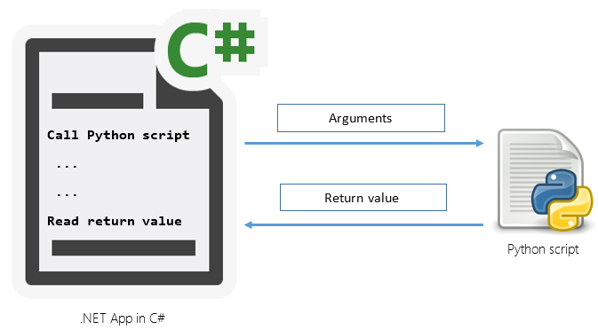
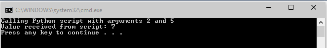

# Inter-process communication between C# and Python
## License
- Apache License, Version 2.0
## Technologies
- C#
- .NET Framework
- Python
## Topics
- C#
- Diagnostics
- Processes
- IO
- Inter-process Communication
- Script
- Python
- Open source
## Updated
- 05/01/2015
## Description

<h1>Introduction</h1>

This example illustrates basic inter-process communication between C# and Python. Example C# app will call a python script by sending 2 arguments and will read/consume output of the script.

<h1>Building the Sample</h1>

In order to make this app work, you need to have Python&nbsp;interpreter installed on your machine. I used&nbsp;Anaconda distribution of Python but code example should work with any other Python distributions.

&nbsp;

Description

We will follow very basic inter-process communication. Our C# app will call a Python script by providing 2 arguments and will read result value generated by script. We will use output redirection to read the textual output of the python script. For the sake
 of simplicity, I will avoid exception handling and other advanced methodologies. &nbsp;Reader of this example are encouraged to improve this solution and/or provide better alternatives. Following figure illustrates the concept at high level:

&nbsp;

Let's assume that our Python script simply gets 2 integer numbers and returns the sum of them. Of course we don't need to call Python to handle such simple operation and C# has immense capabilities but this is just for simplicity.&nbsp;&nbsp;

Python

Edit|Remove

python

<pre class="python">#!/usr/bin/python&nbsp;
#my&nbsp;simple&nbsp;python&nbsp;summation&nbsp;app,&nbsp;&nbsp;
#gets&nbsp;2&nbsp;integers&nbsp;and&nbsp;returns&nbsp;the&nbsp;sum&nbsp;
&nbsp;
import&nbsp;sys&nbsp;
&nbsp;
x&nbsp;=&nbsp;int(sys.argv[1])&nbsp;&nbsp;
y&nbsp;=&nbsp;int(sys.argv[2])&nbsp;
&nbsp;
print&nbsp;x&#43;y</pre>

&nbsp;

First of all, let's define location of Python interpreter, script to call, and arguments to pass:

C#

Edit|Remove

csharp

<pre class="csharp">//&nbsp;full&nbsp;path&nbsp;of&nbsp;python&nbsp;interpreter&nbsp;&nbsp;
string&nbsp;python&nbsp;=&nbsp;@&quot;C:\Continuum\Anaconda\python.exe&quot;;&nbsp;&nbsp;
&nbsp;&nbsp;&nbsp;&nbsp;&nbsp;&nbsp;&nbsp;&nbsp;&nbsp;&nbsp;&nbsp;&nbsp;&nbsp;&nbsp;
//&nbsp;python&nbsp;app&nbsp;to&nbsp;call&nbsp;&nbsp;
string&nbsp;myPythonApp&nbsp;=&nbsp;&quot;sum.py&quot;;&nbsp;&nbsp;
&nbsp;&nbsp;
//&nbsp;dummy&nbsp;parameters&nbsp;to&nbsp;send&nbsp;Python&nbsp;script&nbsp;&nbsp;
int&nbsp;x&nbsp;=&nbsp;2;&nbsp;&nbsp;
int&nbsp;y&nbsp;=&nbsp;5;&nbsp;</pre>

&nbsp;

We need to specify set of values that will used when we start the process. We should make sure that&nbsp;<strong>ProcessStartInfo.UseShellExecute</strong> is set to
<strong>false</strong> and <strong>ProcessStartInfo.RedirectStandardOutput</strong> is set to<strong> true</strong>. Otherwise, our app will throw and exception when we try to read from the StandardOutput stream:

C#

Edit|Remove

csharp

<pre class="csharp">//&nbsp;Create&nbsp;new&nbsp;process&nbsp;start&nbsp;info&nbsp;
ProcessStartInfo&nbsp;myProcessStartInfo&nbsp;=&nbsp;new&nbsp;ProcessStartInfo(python);&nbsp;
&nbsp;
//&nbsp;make&nbsp;sure&nbsp;we&nbsp;can&nbsp;read&nbsp;the&nbsp;output&nbsp;from&nbsp;stdout&nbsp;
myProcessStartInfo.UseShellExecute&nbsp;=&nbsp;false;&nbsp;
myProcessStartInfo.RedirectStandardOutput&nbsp;=&nbsp;true;&nbsp;
</pre>

Another important thing to keep in mind is that we need to define 3 arguments even though we actually need only to for our script. As explained in the code comment below, first argument will be just pointer to script itself:

C#

Edit|Remove

csharp

<pre class="csharp">//&nbsp;start&nbsp;python&nbsp;app&nbsp;with&nbsp;3&nbsp;arguments&nbsp;&nbsp;
//&nbsp;1st&nbsp;argument&nbsp;is&nbsp;pointer&nbsp;to&nbsp;itself,&nbsp;2nd&nbsp;and&nbsp;3rd&nbsp;are&nbsp;actual&nbsp;arguments&nbsp;we&nbsp;want&nbsp;to&nbsp;send&nbsp;
myProcessStartInfo.Arguments&nbsp;=&nbsp;myPythonApp&nbsp;&#43;&nbsp;&quot;&nbsp;&quot;&nbsp;&#43;&nbsp;x&nbsp;&#43;&nbsp;&quot;&nbsp;&quot;&nbsp;&#43;&nbsp;y;</pre>

&nbsp;

Now it is time to create a new process and start it:

C#

Edit|Remove

csharp

<pre class="csharp">Process&nbsp;myProcess&nbsp;=&nbsp;new&nbsp;Process();&nbsp;
//&nbsp;assign&nbsp;start&nbsp;information&nbsp;to&nbsp;the&nbsp;process&nbsp;
myProcess.StartInfo&nbsp;=&nbsp;myProcessStartInfo;&nbsp;
&nbsp;
//&nbsp;start&nbsp;process&nbsp;
myProcess.Start();</pre>

We will do&nbsp;perform synchronous read operations on the output stream of the process using
<strong>ReadLine()</strong>. However, in order to avoid deadlock we will read output first and then wait for process terminate to close it:

C#

Edit|Remove

csharp

<pre class="csharp">//&nbsp;Read&nbsp;the&nbsp;standard&nbsp;output&nbsp;of&nbsp;the&nbsp;app&nbsp;we&nbsp;called.&nbsp;&nbsp;
StreamReader&nbsp;myStreamReader&nbsp;=&nbsp;myProcess.StandardOutput;&nbsp;
string&nbsp;myString&nbsp;=&nbsp;myStreamReader.ReadLine();&nbsp;
&nbsp;&nbsp;&nbsp;&nbsp;&nbsp;&nbsp;&nbsp;&nbsp;&nbsp;&nbsp;&nbsp;&nbsp;&nbsp;
//&nbsp;wait&nbsp;exit&nbsp;signal&nbsp;from&nbsp;the&nbsp;app&nbsp;we&nbsp;called&nbsp;
myProcess.WaitForExit();&nbsp;
&nbsp;
//&nbsp;close&nbsp;the&nbsp;process&nbsp;
myProcess.Close();</pre>

Note that if we need to read multiple lines, we might use ReadToEnd() instead of ReadLine().&nbsp;

&nbsp;

Now we can simple output the value we just read as a basic way of consumption:

C#

Edit|Remove

csharp

<pre class="csharp">//&nbsp;write&nbsp;the&nbsp;output&nbsp;we&nbsp;got&nbsp;from&nbsp;python&nbsp;app&nbsp;
Console.WriteLine(&quot;Value&nbsp;received&nbsp;from&nbsp;script:&nbsp;&quot;&nbsp;&#43;&nbsp;myString);</pre>

&nbsp;

Aggregating all C# code segments above might result in a C# app look like:

C#

Edit|Remove

csharp

<pre class="csharp">using&nbsp;System;&nbsp;
using&nbsp;<a class="libraryLink" href="https://msdn.microsoft.com/en-US/library/System.IO.aspx" target="_blank" title="Auto generated link to System.IO">System.IO</a>;&nbsp;
using&nbsp;<a class="libraryLink" href="https://msdn.microsoft.com/en-US/library/System.Diagnostics.aspx" target="_blank" title="Auto generated link to System.Diagnostics">System.Diagnostics</a>;&nbsp;
&nbsp;
namespace&nbsp;CallPython&nbsp;
{&nbsp;
&nbsp;&nbsp;&nbsp;&nbsp;///&nbsp;&lt;summary&gt;&nbsp;
&nbsp;&nbsp;&nbsp;&nbsp;///&nbsp;Used&nbsp;to&nbsp;show&nbsp;simple&nbsp;C#&nbsp;and&nbsp;Python&nbsp;interprocess&nbsp;communication&nbsp;
&nbsp;&nbsp;&nbsp;&nbsp;///&nbsp;Author&nbsp;&nbsp;&nbsp;&nbsp;&nbsp;&nbsp;:&nbsp;Ozcan&nbsp;ILIKHAN&nbsp;
&nbsp;&nbsp;&nbsp;&nbsp;///&nbsp;Created&nbsp;&nbsp;&nbsp;&nbsp;&nbsp;:&nbsp;02/26/2015&nbsp;
&nbsp;&nbsp;&nbsp;&nbsp;///&nbsp;Last&nbsp;Update&nbsp;:&nbsp;04/30/2015&nbsp;
&nbsp;&nbsp;&nbsp;&nbsp;///&nbsp;&lt;/summary&gt;&nbsp;
&nbsp;&nbsp;&nbsp;&nbsp;class&nbsp;Program&nbsp;
&nbsp;&nbsp;&nbsp;&nbsp;{&nbsp;
&nbsp;&nbsp;&nbsp;&nbsp;&nbsp;&nbsp;&nbsp;&nbsp;static&nbsp;void&nbsp;Main(string[]&nbsp;args)&nbsp;
&nbsp;&nbsp;&nbsp;&nbsp;&nbsp;&nbsp;&nbsp;&nbsp;{&nbsp;
&nbsp;&nbsp;&nbsp;&nbsp;&nbsp;&nbsp;&nbsp;&nbsp;&nbsp;&nbsp;&nbsp;&nbsp;//&nbsp;full&nbsp;path&nbsp;of&nbsp;python&nbsp;interpreter&nbsp;
&nbsp;&nbsp;&nbsp;&nbsp;&nbsp;&nbsp;&nbsp;&nbsp;&nbsp;&nbsp;&nbsp;&nbsp;string&nbsp;python&nbsp;=&nbsp;@&quot;C:\Continuum\Anaconda\python.exe&quot;;&nbsp;
&nbsp;&nbsp;&nbsp;&nbsp;&nbsp;&nbsp;&nbsp;&nbsp;&nbsp;&nbsp;&nbsp;&nbsp;&nbsp;
&nbsp;&nbsp;&nbsp;&nbsp;&nbsp;&nbsp;&nbsp;&nbsp;&nbsp;&nbsp;&nbsp;&nbsp;//&nbsp;python&nbsp;app&nbsp;to&nbsp;call&nbsp;
&nbsp;&nbsp;&nbsp;&nbsp;&nbsp;&nbsp;&nbsp;&nbsp;&nbsp;&nbsp;&nbsp;&nbsp;string&nbsp;myPythonApp&nbsp;=&nbsp;&quot;sum.py&quot;;&nbsp;
&nbsp;
&nbsp;&nbsp;&nbsp;&nbsp;&nbsp;&nbsp;&nbsp;&nbsp;&nbsp;&nbsp;&nbsp;&nbsp;//&nbsp;dummy&nbsp;parameters&nbsp;to&nbsp;send&nbsp;Python&nbsp;script&nbsp;
&nbsp;&nbsp;&nbsp;&nbsp;&nbsp;&nbsp;&nbsp;&nbsp;&nbsp;&nbsp;&nbsp;&nbsp;int&nbsp;x&nbsp;=&nbsp;2;&nbsp;
&nbsp;&nbsp;&nbsp;&nbsp;&nbsp;&nbsp;&nbsp;&nbsp;&nbsp;&nbsp;&nbsp;&nbsp;int&nbsp;y&nbsp;=&nbsp;5;&nbsp;
&nbsp;
&nbsp;&nbsp;&nbsp;&nbsp;&nbsp;&nbsp;&nbsp;&nbsp;&nbsp;&nbsp;&nbsp;&nbsp;//&nbsp;Create&nbsp;new&nbsp;process&nbsp;start&nbsp;info&nbsp;
&nbsp;&nbsp;&nbsp;&nbsp;&nbsp;&nbsp;&nbsp;&nbsp;&nbsp;&nbsp;&nbsp;&nbsp;ProcessStartInfo&nbsp;myProcessStartInfo&nbsp;=&nbsp;new&nbsp;ProcessStartInfo(python);&nbsp;
&nbsp;
&nbsp;&nbsp;&nbsp;&nbsp;&nbsp;&nbsp;&nbsp;&nbsp;&nbsp;&nbsp;&nbsp;&nbsp;//&nbsp;make&nbsp;sure&nbsp;we&nbsp;can&nbsp;read&nbsp;the&nbsp;output&nbsp;from&nbsp;stdout&nbsp;
&nbsp;&nbsp;&nbsp;&nbsp;&nbsp;&nbsp;&nbsp;&nbsp;&nbsp;&nbsp;&nbsp;&nbsp;myProcessStartInfo.UseShellExecute&nbsp;=&nbsp;false;&nbsp;
&nbsp;&nbsp;&nbsp;&nbsp;&nbsp;&nbsp;&nbsp;&nbsp;&nbsp;&nbsp;&nbsp;&nbsp;myProcessStartInfo.RedirectStandardOutput&nbsp;=&nbsp;true;&nbsp;
&nbsp;
&nbsp;&nbsp;&nbsp;&nbsp;&nbsp;&nbsp;&nbsp;&nbsp;&nbsp;&nbsp;&nbsp;&nbsp;//&nbsp;start&nbsp;python&nbsp;app&nbsp;with&nbsp;3&nbsp;arguments&nbsp;&nbsp;
&nbsp;&nbsp;&nbsp;&nbsp;&nbsp;&nbsp;&nbsp;&nbsp;&nbsp;&nbsp;&nbsp;&nbsp;//&nbsp;1st&nbsp;arguments&nbsp;is&nbsp;pointer&nbsp;to&nbsp;itself,&nbsp;&nbsp;
&nbsp;&nbsp;&nbsp;&nbsp;&nbsp;&nbsp;&nbsp;&nbsp;&nbsp;&nbsp;&nbsp;&nbsp;//&nbsp;2nd&nbsp;and&nbsp;3rd&nbsp;are&nbsp;actual&nbsp;arguments&nbsp;we&nbsp;want&nbsp;to&nbsp;send&nbsp;
&nbsp;&nbsp;&nbsp;&nbsp;&nbsp;&nbsp;&nbsp;&nbsp;&nbsp;&nbsp;&nbsp;&nbsp;myProcessStartInfo.Arguments&nbsp;=&nbsp;myPythonApp&nbsp;&#43;&nbsp;&quot;&nbsp;&quot;&nbsp;&#43;&nbsp;x&nbsp;&#43;&nbsp;&quot;&nbsp;&quot;&nbsp;&#43;&nbsp;y;&nbsp;
&nbsp;
&nbsp;&nbsp;&nbsp;&nbsp;&nbsp;&nbsp;&nbsp;&nbsp;&nbsp;&nbsp;&nbsp;&nbsp;Process&nbsp;myProcess&nbsp;=&nbsp;new&nbsp;Process();&nbsp;
&nbsp;&nbsp;&nbsp;&nbsp;&nbsp;&nbsp;&nbsp;&nbsp;&nbsp;&nbsp;&nbsp;&nbsp;//&nbsp;assign&nbsp;start&nbsp;information&nbsp;to&nbsp;the&nbsp;process&nbsp;
&nbsp;&nbsp;&nbsp;&nbsp;&nbsp;&nbsp;&nbsp;&nbsp;&nbsp;&nbsp;&nbsp;&nbsp;myProcess.StartInfo&nbsp;=&nbsp;myProcessStartInfo;&nbsp;
&nbsp;
&nbsp;&nbsp;&nbsp;&nbsp;&nbsp;&nbsp;&nbsp;&nbsp;&nbsp;&nbsp;&nbsp;&nbsp;Console.WriteLine(&quot;Calling&nbsp;Python&nbsp;script&nbsp;with&nbsp;arguments&nbsp;{0}&nbsp;and&nbsp;{1}&quot;,&nbsp;x,y);&nbsp;
&nbsp;&nbsp;&nbsp;&nbsp;&nbsp;&nbsp;&nbsp;&nbsp;&nbsp;&nbsp;&nbsp;&nbsp;//&nbsp;start&nbsp;the&nbsp;process&nbsp;
&nbsp;&nbsp;&nbsp;&nbsp;&nbsp;&nbsp;&nbsp;&nbsp;&nbsp;&nbsp;&nbsp;&nbsp;myProcess.Start();&nbsp;
&nbsp;
&nbsp;&nbsp;&nbsp;&nbsp;&nbsp;&nbsp;&nbsp;&nbsp;&nbsp;&nbsp;&nbsp;&nbsp;//&nbsp;Read&nbsp;the&nbsp;standard&nbsp;output&nbsp;of&nbsp;the&nbsp;app&nbsp;we&nbsp;called.&nbsp;&nbsp;
&nbsp;&nbsp;&nbsp;&nbsp;&nbsp;&nbsp;&nbsp;&nbsp;&nbsp;&nbsp;&nbsp;&nbsp;//&nbsp;in&nbsp;order&nbsp;to&nbsp;avoid&nbsp;deadlock&nbsp;we&nbsp;will&nbsp;read&nbsp;output&nbsp;first&nbsp;
&nbsp;&nbsp;&nbsp;&nbsp;&nbsp;&nbsp;&nbsp;&nbsp;&nbsp;&nbsp;&nbsp;&nbsp;//&nbsp;and&nbsp;then&nbsp;wait&nbsp;for&nbsp;process&nbsp;terminate:&nbsp;
&nbsp;&nbsp;&nbsp;&nbsp;&nbsp;&nbsp;&nbsp;&nbsp;&nbsp;&nbsp;&nbsp;&nbsp;StreamReader&nbsp;myStreamReader&nbsp;=&nbsp;myProcess.StandardOutput;&nbsp;
&nbsp;&nbsp;&nbsp;&nbsp;&nbsp;&nbsp;&nbsp;&nbsp;&nbsp;&nbsp;&nbsp;&nbsp;string&nbsp;myString&nbsp;=&nbsp;myStreamReader.ReadLine();&nbsp;
&nbsp;&nbsp;&nbsp;&nbsp;&nbsp;&nbsp;&nbsp;&nbsp;&nbsp;&nbsp;&nbsp;&nbsp;&nbsp;
&nbsp;&nbsp;&nbsp;&nbsp;&nbsp;&nbsp;&nbsp;&nbsp;&nbsp;&nbsp;&nbsp;&nbsp;/*if&nbsp;you&nbsp;need&nbsp;to&nbsp;read&nbsp;multiple&nbsp;lines,&nbsp;you&nbsp;might&nbsp;use:&nbsp;
&nbsp;&nbsp;&nbsp;&nbsp;&nbsp;&nbsp;&nbsp;&nbsp;&nbsp;&nbsp;&nbsp;&nbsp;&nbsp;&nbsp;&nbsp;&nbsp;string&nbsp;myString&nbsp;=&nbsp;myStreamReader.ReadToEnd()&nbsp;*/&nbsp;&nbsp;&nbsp;&nbsp;&nbsp;&nbsp;&nbsp;&nbsp;&nbsp;&nbsp;&nbsp;
&nbsp;
&nbsp;&nbsp;&nbsp;&nbsp;&nbsp;&nbsp;&nbsp;&nbsp;&nbsp;&nbsp;&nbsp;&nbsp;//&nbsp;wait&nbsp;exit&nbsp;signal&nbsp;from&nbsp;the&nbsp;app&nbsp;we&nbsp;called&nbsp;and&nbsp;then&nbsp;close&nbsp;it.&nbsp;
&nbsp;&nbsp;&nbsp;&nbsp;&nbsp;&nbsp;&nbsp;&nbsp;&nbsp;&nbsp;&nbsp;&nbsp;myProcess.WaitForExit();&nbsp;
&nbsp;&nbsp;&nbsp;&nbsp;&nbsp;&nbsp;&nbsp;&nbsp;&nbsp;&nbsp;&nbsp;&nbsp;myProcess.Close();&nbsp;
&nbsp;
&nbsp;&nbsp;&nbsp;&nbsp;&nbsp;&nbsp;&nbsp;&nbsp;&nbsp;&nbsp;&nbsp;&nbsp;//&nbsp;write&nbsp;the&nbsp;output&nbsp;we&nbsp;got&nbsp;from&nbsp;python&nbsp;app&nbsp;
&nbsp;&nbsp;&nbsp;&nbsp;&nbsp;&nbsp;&nbsp;&nbsp;&nbsp;&nbsp;&nbsp;&nbsp;Console.WriteLine(&quot;Value&nbsp;received&nbsp;from&nbsp;script:&nbsp;&quot;&nbsp;&#43;&nbsp;myString);&nbsp;
&nbsp;&nbsp;&nbsp;&nbsp;&nbsp;&nbsp;&nbsp;&nbsp;&nbsp;&nbsp;&nbsp;&nbsp;&nbsp;
&nbsp;&nbsp;&nbsp;&nbsp;&nbsp;&nbsp;&nbsp;&nbsp;}&nbsp;
&nbsp;&nbsp;&nbsp;&nbsp;}&nbsp;
}&nbsp;
</pre>

&nbsp;

Here is a test run:

<h1>Source Code Files</h1>
<ul>
<li><em><a id="137065" href="/C-and-Python-interprocess-171378ee/file/137065/1/sum.py">sum.py</a> - simple python script receives 2 integers and returns the sum of them.</em>
</li><li><em><a id="137069" href="/C-and-Python-interprocess-171378ee/file/137069/1/Program.csharp">Program.cs</a></em><em>&nbsp;- example C# app to communicate with python script.</em>
</li></ul>
<h1>References</h1>
<ul>
<li>MSDN Library, Process.StandardOutput Property,<em>&nbsp;https://msdn.microsoft.com/en-us/library/system.diagnostics.process.standardoutput.aspx</em>
</li><li>Python - Official Site<em>,&nbsp;https://www.python.org/</em> </li></ul>
