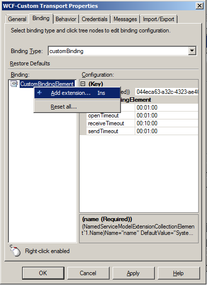
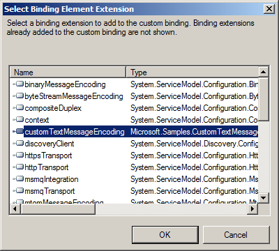
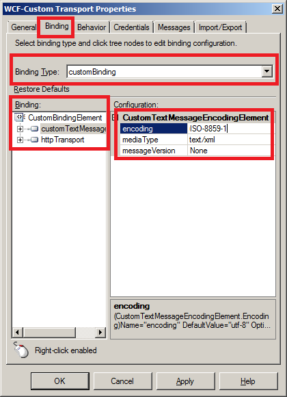

# Invoking a web service returning ISO-8859-1 encoded data with BizTalk 2010
## Requires
- Visual Studio 2010
## License
- Apache License, Version 2.0
## Technologies
- BizTalk Server
- BizTalk
- BizTalk Server 2010
## Topics
- WCF Adapter
## Updated
- 02/06/2013
## Description

<h1>Introduction</h1>

The&nbsp;TextMessageEncodingBindingElement&nbsp;of WCF supports only the UTF-8, UTF-16 and Big Endean Unicode encodings. If the web service returns response in some other encoding e.g. ISO-8859-1 need to be consumed in BizTalk Server 2010 then the following
 error get logged in the event viewer:

<strong><em><a class="libraryLink" href="http://msdn.microsoft.com/en-US/library/System.ServiceModel.ProtocolException.aspx" target="_blank" title="Auto generated link to System.ServiceModel.ProtocolException">System.ServiceModel.ProtocolException</a>: The content type text/xml of the response message does not match the content type of the binding (application/soap&#43;xml; charset=utf-8). If using a custom encoder, be sure that the IsContentTypeSupported
 method is implemented properly.</em></strong>

<h1>Description</h1>

The solution to above problem is to create a custom text message encoder binding element capable of handling other encodings. One such element is already provided part of
<a href="http://msdn.microsoft.com/en-us/library/ms751486.aspx">WCF Samples</a>. I have used it to receive response from the web services returing ISO-8859-1 encoded data.&nbsp;The trick was to override the property IsContentTypeSupported (to handle different
 content types with the same media type) in the class CustomTextMessageEncoder in the sample code as shown below:

C#

Edit|Remove

csharp

<pre class="csharp">public&nbsp;override&nbsp;bool&nbsp;IsContentTypeSupported(string&nbsp;contentType)&nbsp;&nbsp;
{&nbsp;&nbsp;
&nbsp;&nbsp;&nbsp;&nbsp;if&nbsp;(base.IsContentTypeSupported(contentType))&nbsp;&nbsp;
&nbsp;&nbsp;&nbsp;&nbsp;{&nbsp;&nbsp;
&nbsp;&nbsp;&nbsp;&nbsp;&nbsp;&nbsp;&nbsp;&nbsp;return&nbsp;true;&nbsp;&nbsp;
&nbsp;&nbsp;&nbsp;&nbsp;}&nbsp;&nbsp;
&nbsp;&nbsp;&nbsp;&nbsp;if&nbsp;(contentType.Length&nbsp;==&nbsp;this.MediaType.Length)&nbsp;&nbsp;
&nbsp;&nbsp;&nbsp;&nbsp;{&nbsp;&nbsp;
&nbsp;&nbsp;&nbsp;&nbsp;&nbsp;&nbsp;&nbsp;&nbsp;return&nbsp;contentType.Equals(this.MediaType,&nbsp;StringComparison.OrdinalIgnoreCase);&nbsp;&nbsp;
&nbsp;&nbsp;&nbsp;&nbsp;}&nbsp;&nbsp;
&nbsp;&nbsp;&nbsp;&nbsp;else&nbsp;&nbsp;
&nbsp;&nbsp;&nbsp;&nbsp;{&nbsp;&nbsp;
&nbsp;&nbsp;&nbsp;&nbsp;&nbsp;&nbsp;&nbsp;&nbsp;if&nbsp;(contentType.StartsWith(this.MediaType,&nbsp;StringComparison.OrdinalIgnoreCase)&nbsp;&nbsp;
&nbsp;&nbsp;&nbsp;&nbsp;&nbsp;&nbsp;&nbsp;&nbsp;&nbsp;&nbsp;&nbsp;&nbsp;&amp;&amp;&nbsp;(contentType[this.MediaType.Length]&nbsp;==&nbsp;';'))&nbsp;&nbsp;
&nbsp;&nbsp;&nbsp;&nbsp;&nbsp;&nbsp;&nbsp;&nbsp;{&nbsp;&nbsp;
&nbsp;&nbsp;&nbsp;&nbsp;&nbsp;&nbsp;&nbsp;&nbsp;&nbsp;&nbsp;&nbsp;&nbsp;return&nbsp;true;&nbsp;&nbsp;
&nbsp;&nbsp;&nbsp;&nbsp;&nbsp;&nbsp;&nbsp;&nbsp;}&nbsp;&nbsp;
&nbsp;&nbsp;&nbsp;&nbsp;}&nbsp;&nbsp;
&nbsp;&nbsp;&nbsp;&nbsp;return&nbsp;false;&nbsp;&nbsp;
}</pre>

<h1>Building the Sample</h1>

- Build the code and install the assembly CustomTextMessageEncoder.dll&nbsp;to GAC.

- Update the machine.config at path C:\Windows\Microsoft.NET\Framework\v4.0.30319\Config and add the following element to section &lt;system.serviceModel&gt;/&lt;extensions&gt;/&lt;bindingElementExtensions&gt;

&nbsp;&nbsp;&nbsp; &lt;add name=&quot;customTextMessageEncoding&quot; type=&quot;Microsoft.Samples.CustomTextMessageEncoder.CustomTextMessageEncodingElement, CustomTextMessageEncoder, Version=4.0.0.0, Culture=neutral, PublicKeyToken=71062dbfcab17aa3&quot;/&gt;

<strong>Note:</strong> Update the PublicKeyToken as per the key used to create the strong name for the assembly.

<h1>Using the customTextMessageEncoding element</h1>

-After making the required changes in WCF-Custom Transport Proprties dialog box go to Binding tab and choose the customBinding for Binding Type and remove all element. Right click the CustomBindingElemnent and coose Add extension... as shown below:

-Select customTextMessageEncoding element and repeat the same process for httpTransport element too.

<h1></h1>

-Configure the properties of customTextMessageEncoding element as shown below and now you would be able to received message encoded in encoding as long as the Media Type of response is text/xml.

<h1>Source Code Files</h1>

<em><em>In the Zip file:</em></em>

<ul>
<li><em>the&nbsp;CustomTextMessageEncoder folder contain the C# project for text encoder.</em>
</li><li><em><em>the Config folder contain machine.config containg the details of modification need to be done to machine.config at path&nbsp;C:\Windows\Microsoft.NET\Framework\v4.0.30319\Config</em></em>
</li></ul>
<h1>Abount Me</h1>
<pre><strong>Rohit Sharma</strong>&nbsp;</pre>
<pre><strong>Microsoft Integration - MVP</strong></pre>
<pre><strong><a href="http://rohitt-sharma.blogspot.com">http://rohitt-sharma.blogspot.com</a></strong></pre>
